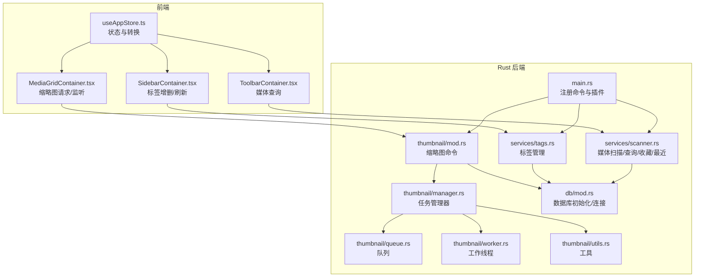
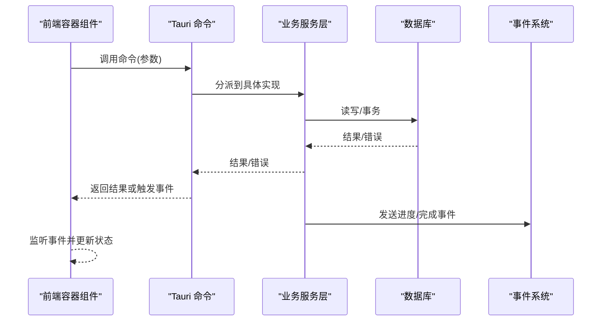
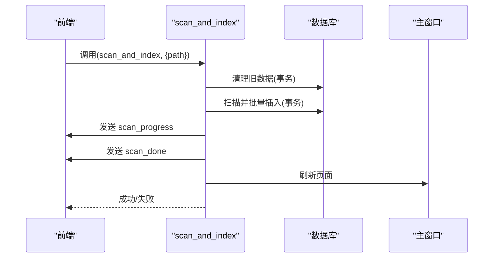
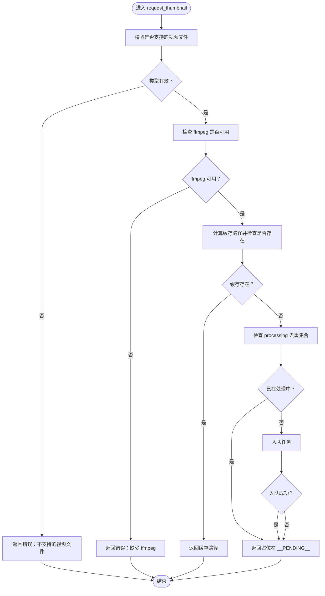
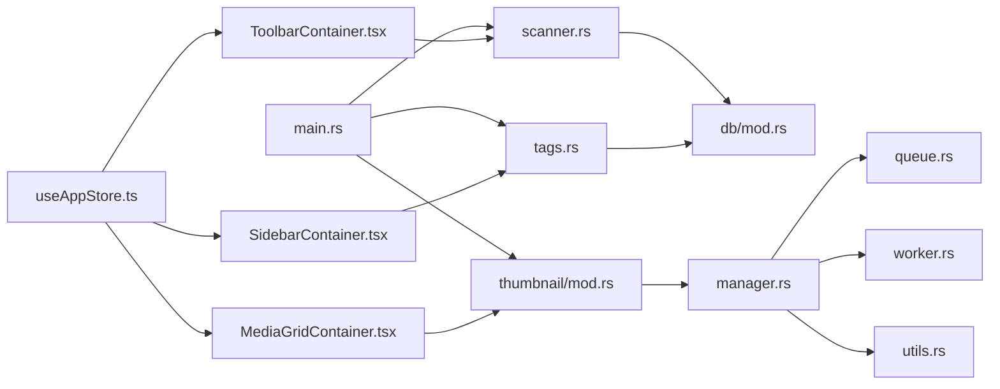

# Tauri 命令接口

<cite>
**本文档引用的文件**
- [src-tauri/src/main.rs](file://src-tauri/src/main.rs)
- [src-tauri/src/services/scanner.rs](file://src-tauri/src/services/scanner.rs)
- [src-tauri/src/services/tags.rs](file://src-tauri/src/services/tags.rs)
- [src-tauri/src/thumbnail/mod.rs](file://src-tauri/src/thumbnail/mod.rs)
- [src-tauri/src/thumbnail/manager.rs](file://src-tauri/src/thumbnail/manager.rs)
- [src-tauri/src/thumbnail/queue.rs](file://src-tauri/src/thumbnail/queue.rs)
- [src-tauri/src/thumbnail/worker.rs](file://src-tauri/src/thumbnail/worker.rs)
- [src-tauri/src/thumbnail/utils.rs](file://src-tauri/src/thumbnail/utils.rs)
- [src-tauri/src/db/mod.rs](file://src-tauri/src/db/mod.rs)
- [src/containers/MediaGridContainer.tsx](file://src/containers/MediaGridContainer.tsx)
- [src/containers/SidebarContainer.tsx](file://src/containers/SidebarContainer.tsx)
- [src/containers/ToolbarContainer.tsx](file://src/containers/ToolbarContainer.tsx)
- [src/store/useAppStore.ts](file://src/store/useAppStore.ts)
- [API_REFERENCE.md](file://API_REFERENCE.md)
- [DEVELOPMENT.md](file://DEVELOPMENT.md)
</cite>

## 目录
1. [简介](#简介)
2. [项目结构](#项目结构)
3. [核心组件](#核心组件)
4. [架构总览](#架构总览)
5. [详细组件分析](#详细组件分析)
6. [依赖关系分析](#依赖关系分析)
7. [性能考量](#性能考量)
8. [故障排除指南](#故障排除指南)
9. [结论](#结论)
10. [附录](#附录)

## 简介
本文件系统性梳理 Medex 应用中通过 Tauri 暴露给前端的命令接口，覆盖媒体扫描与查询、标签管理、缩略图系统三大功能域。文档为每个命令提供函数签名、参数说明、返回值格式、错误处理策略、执行流程、数据库操作与副作用，并给出最佳实践与性能优化建议。同时提供前端调用示例与常见问题排查指引。

## 项目结构
命令接口主要分布在以下模块：
- 媒体扫描与查询：位于服务层 scanner.rs，负责扫描、索引、过滤、收藏、最近观看等
- 标签管理：位于服务层 tags.rs，负责标签的增删改查与关联
- 缩略图系统：位于 thumbnail 子模块，负责视频缩略图的请求、生成与缓存
- 数据库：位于 db/mod.rs，提供 SQLite 初始化、连接池封装与表结构定义
- 前端调用：位于各容器组件与存储中，演示命令调用与事件监听

**图表来源**
- [src-tauri/src/main.rs:49-65](file://src-tauri/src/main.rs#L49-L65)
- [src-tauri/src/services/scanner.rs:160-341](file://src-tauri/src/services/scanner.rs#L160-L341)
- [src-tauri/src/services/tags.rs:19-220](file://src-tauri/src/services/tags.rs#L19-L220)
- [src-tauri/src/thumbnail/mod.rs:57-61](file://src-tauri/src/thumbnail/mod.rs#L57-L61)
- [src-tauri/src/db/mod.rs:45-123](file://src-tauri/src/db/mod.rs#L45-L123)

**章节来源**
- [src-tauri/src/main.rs:49-65](file://src-tauri/src/main.rs#L49-L65)
- [src-tauri/src/db/mod.rs:45-123](file://src-tauri/src/db/mod.rs#L45-L123)

## 核心组件
- 命令注册中心：在应用启动时集中注册所有命令，统一暴露给前端
- 数据访问层：通过 with_connection 封装数据库连接，确保线程安全与事务一致性
- 缩略图子系统：基于多线程工作池与有界队列，异步生成并缓存视频缩略图
- 前端调用层：容器组件通过 invoke 调用命令，结合事件监听实现响应式更新

**章节来源**
- [src-tauri/src/main.rs:49-65](file://src-tauri/src/main.rs#L49-L65)
- [src-tauri/src/db/mod.rs:97-110](file://src-tauri/src/db/mod.rs#L97-L110)

## 架构总览
命令接口采用“命令驱动 + 事件通知”的模式：
- 前端通过 invoke 调用后端命令
- 后端执行业务逻辑，必要时发出事件（如扫描进度、缩略图生成完成）
- 前端监听事件并更新 UI 状态

**图表来源**
- [src-tauri/src/main.rs:49-65](file://src-tauri/src/main.rs#L49-L65)
- [src-tauri/src/services/scanner.rs:250-341](file://src-tauri/src/services/scanner.rs#L250-L341)
- [src-tauri/src/thumbnail/worker.rs:81-89](file://src-tauri/src/thumbnail/worker.rs#L81-L89)

## 详细组件分析

### 媒体扫描与查询命令

#### 命令：scan_and_index
- 函数签名：scan_and_index(path: String, app_handle: AppHandle) -> Result<(), String>
- 参数
  - path: 目标扫描路径（字符串）
  - app_handle: 应用句柄（用于事件通知与窗口刷新）
- 返回值：成功返回空，失败返回错误字符串
- 功能概述
  - 清理旧媒体库数据（删除 media、media_tags、recent_views 并重置自增）
  - 扫描指定目录，识别图片与视频文件并批量插入 media 表
  - 逐条发送扫描进度事件 scan_progress
  - 完成后发送 scan_done 事件并刷新主窗口
- 数据库操作
  - DELETE/INSERT/ALTER TABLE（确保 is_favorite 列存在）
  - 事务包裹以保证一致性
- 错误处理
  - 任何阶段失败均转为字符串错误返回
  - 事件发送失败仅打印日志，不影响整体流程
- 性能与副作用
  - 批量插入使用事务，减少磁盘 IO
  - 进度事件频率高，注意前端渲染开销
  - 刷新主窗口可能触发页面重载

**图表来源**
- [src-tauri/src/services/scanner.rs:250-341](file://src-tauri/src/services/scanner.rs#L250-L341)

**章节来源**
- [src-tauri/src/services/scanner.rs:250-341](file://src-tauri/src/services/scanner.rs#L250-L341)

#### 命令：get_all_media
- 函数签名：get_all_media() -> Result<Vec<MediaItem>, String>
- 参数：无
- 返回值：媒体项数组（包含 id、路径、文件名、类型、收藏、最近、标签等）
- 功能概述：查询所有媒体并聚合标签信息
- 数据库操作：LEFT JOIN recent_views 与 media_tags，GROUP BY 聚合标签
- 错误处理：异常转字符串返回
- 使用场景：首次加载、清空筛选条件后的默认展示

**章节来源**
- [src-tauri/src/services/scanner.rs:160-163](file://src-tauri/src/services/scanner.rs#L160-L163)
- [src-tauri/src/services/scanner.rs:117-158](file://src-tauri/src/services/scanner.rs#L117-L158)

#### 命令：filter_media_by_tags
- 函数签名：filter_media_by_tags(tag_names: Vec<String>) -> Result<Vec<MediaItem>, String>
- 参数：tag_names（标签名称列表）
- 返回值：满足全部标签的媒体项
- 功能概述：多标签交集过滤
- 数据库操作：子查询匹配所有标签并按 DISTINCT 计数
- 错误处理：异常转字符串返回

**章节来源**
- [src-tauri/src/services/scanner.rs:165-168](file://src-tauri/src/services/scanner.rs#L165-L168)
- [src-tauri/src/services/scanner.rs:169-247](file://src-tauri/src/services/scanner.rs#L169-L247)

#### 命令：filter_media
- 函数签名：filter_media(tag_names: Vec<String>, media_type: Option<String>) -> Result<Vec<MediaItem>, String>
- 参数：tag_names（可为空）、media_type（可为 image/video/all）
- 返回值：按标签与类型的组合过滤结果
- 功能概述：支持标签过滤与媒体类型过滤
- 数据库操作：动态拼接 SQL，支持类型条件与标签计数 HAVING
- 错误处理：异常转字符串返回

**章节来源**
- [src-tauri/src/services/scanner.rs:169-247](file://src-tauri/src/services/scanner.rs#L169-L247)
- [src-tauri/src/services/scanner.rs:460-472](file://src-tauri/src/services/scanner.rs#L460-L472)

#### 命令：set_media_favorite
- 函数签名：set_media_favorite(media_id: i64, is_favorite: bool) -> Result<(), String>
- 参数：媒体 ID、收藏状态
- 返回值：成功/失败
- 功能概述：更新媒体收藏状态
- 数据库操作：UPDATE 媒体表并更新时间戳

**章节来源**
- [src-tauri/src/services/scanner.rs:343-354](file://src-tauri/src/services/scanner.rs#L343-L354)

#### 命令：mark_media_viewed
- 函数签名：mark_media_viewed(media_id: i64) -> Result<(), String>
- 参数：媒体 ID
- 返回值：成功/失败
- 功能概述：记录最近观看并限制历史数量
- 数据库操作：UPSERT recent_views；超过阈值后裁剪

**章节来源**
- [src-tauri/src/services/scanner.rs:356-389](file://src-tauri/src/services/scanner.rs#L356-L389)

#### 命令：clear_library_data
- 函数签名：clear_library_data(app_handle: AppHandle) -> Result<(), String>
- 参数：应用句柄
- 返回值：成功/失败
- 功能概述：清空媒体库并刷新界面
- 数据库操作：删除三张表并重置自增

**章节来源**
- [src-tauri/src/services/scanner.rs:475-525](file://src-tauri/src/services/scanner.rs#L475-L525)

### 标签管理命令

#### 命令：get_all_tags
- 函数签名：get_all_tags() -> Result<Vec<Tag>, String>
- 参数：无
- 返回值：标签列表（id、name）
- 功能概述：获取所有标签

**章节来源**
- [src-tauri/src/services/tags.rs:19-42](file://src-tauri/src/services/tags.rs#L19-L42)

#### 命令：get_all_tags_with_count
- 函数签名：get_all_tags_with_count() -> Result<Vec<TagWithCount>, String>
- 参数：无
- 返回值：标签及媒体数量（含 0）
- 功能概述：统计标签被使用的媒体数量

**章节来源**
- [src-tauri/src/services/tags.rs:44-74](file://src-tauri/src/services/tags.rs#L44-L74)

#### 命令：create_tag
- 函数签名：create_tag(tag_name: String) -> Result<(), String>
- 参数：标签名（自动去除空白）
- 返回值：成功/失败
- 功能概述：创建新标签（忽略重复）
- 错误处理：空标签名直接报错

**章节来源**
- [src-tauri/src/services/tags.rs:76-93](file://src-tauri/src/services/tags.rs#L76-L93)

#### 命令：delete_tag
- 函数签名：delete_tag(tag_id: i64) -> Result<(), String>
- 参数：标签 ID
- 返回值：成功/失败
- 功能概述：删除标签（若仍有媒体使用则拒绝）
- 错误处理：使用中标签报错

**章节来源**
- [src-tauri/src/services/tags.rs:95-124](file://src-tauri/src/services/tags.rs#L95-L124)

#### 命令：add_tag_to_media
- 函数签名：add_tag_to_media(media_id: i64, tag_name: String) -> Result<(), String>
- 参数：媒体 ID、标签名
- 返回值：成功/失败
- 功能概述：为媒体添加标签（标签不存在则先创建）

**章节来源**
- [src-tauri/src/services/tags.rs:126-164](file://src-tauri/src/services/tags.rs#L126-L164)

#### 命令：remove_tag_from_media
- 函数签名：remove_tag_from_media(media_id: i64, tag_id: i64) -> Result<(), String>
- 参数：媒体 ID、标签 ID
- 返回值：成功/失败
- 功能概述：移除媒体上的标签（不删除标签本身）
- 错误处理：无约束删除

**章节来源**
- [src-tauri/src/services/tags.rs:166-188](file://src-tauri/src/services/tags.rs#L166-L188)

#### 命令：get_tags_by_media
- 函数签名：get_tags_by_media(media_id: i64) -> Result<Vec<Tag>, String>
- 参数：媒体 ID
- 返回值：媒体关联的标签列表
- 功能概述：查询媒体的所有标签

**章节来源**
- [src-tauri/src/services/tags.rs:190-219](file://src-tauri/src/services/tags.rs#L190-L219)

### 缩略图系统命令

#### 命令：request_thumbnail
- 函数签名：request_thumbnail(path: String) -> Result<String, String>
- 参数：视频文件绝对路径
- 返回值：缓存文件路径或占位符
  - 若缓存已存在：返回缓存路径
  - 若正在生成：返回占位符 "__PENDING__"
  - 若队列满：返回占位符 "__PENDING__"
  - 若 ffmpeg 不可用：返回错误字符串
- 功能概述：请求生成视频缩略图
- 执行流程
  - 校验文件类型与 ffmpeg 可用性
  - 计算缓存路径并检查是否存在
  - 去重：若已在处理集合则返回占位符
  - 入队：尝试向通道发送任务，满则返回占位符
  - 返回占位符表示等待后台生成
- 事件通知：后台生成完成后通过 "thumbnail_ready" 事件推送结果

**图表来源**
- [src-tauri/src/thumbnail/manager.rs:51-106](file://src-tauri/src/thumbnail/manager.rs#L51-L106)
- [src-tauri/src/thumbnail/utils.rs:63-69](file://src-tauri/src/thumbnail/utils.rs#L63-L69)
- [src-tauri/src/thumbnail/utils.rs:71-96](file://src-tauri/src/thumbnail/utils.rs#L71-L96)

**章节来源**
- [src-tauri/src/thumbnail/mod.rs:57-61](file://src-tauri/src/thumbnail/mod.rs#L57-L61)
- [src-tauri/src/thumbnail/manager.rs:51-106](file://src-tauri/src/thumbnail/manager.rs#L51-L106)

## 依赖关系分析

**图表来源**
- [src-tauri/src/main.rs:49-65](file://src-tauri/src/main.rs#L49-L65)
- [src-tauri/src/services/scanner.rs:160-341](file://src-tauri/src/services/scanner.rs#L160-L341)
- [src-tauri/src/services/tags.rs:19-220](file://src-tauri/src/services/tags.rs#L19-L220)
- [src-tauri/src/thumbnail/mod.rs:57-61](file://src-tauri/src/thumbnail/mod.rs#L57-L61)
- [src-tauri/src/db/mod.rs:45-123](file://src-tauri/src/db/mod.rs#L45-L123)

**章节来源**
- [src-tauri/src/main.rs:49-65](file://src-tauri/src/main.rs#L49-L65)

## 性能考量
- 数据库
  - 使用事务批量插入，减少磁盘写入次数
  - 为 media、media_tags、recent_views 建立必要索引，提升查询效率
- 缩略图
  - 固定并发工作线程数与有界队列，防止资源耗尽
  - 去重集合避免重复生成同一视频缩略图
  - 缓存命中直接返回，避免重复 IO
- 前端
  - 限流并发与队列长度，避免 UI 卡顿
  - 使用虚拟化渲染，仅渲染可见区域
  - 事件驱动更新，减少不必要的重渲染

[本节为通用指导，无需特定文件来源]

## 故障排除指南
- 本地文件无法预览（unsupported URL）
  - 确认前端使用 convertFileSrc(path)，而非直接使用绝对路径
- 缩略图一直失败
  - 检查系统是否安装 ffmpeg，或在开发目录放置内置二进制
- 页面卡顿/白屏
  - 排查是否在网格内批量挂载 <video>，是否启用虚拟化，缩略图请求并发是否过高
- 对话框权限
  - 检查 capabilities/default.json 是否包含 dialog:allow-open 与 dialog:default

**章节来源**
- [DEVELOPMENT.md:564-596](file://DEVELOPMENT.md#L564-L596)

## 结论
本文档系统梳理了 Medex 的 Tauri 命令接口，涵盖媒体扫描与查询、标签管理与缩略图系统。通过清晰的命令签名、参数说明、返回值格式与错误处理策略，配合执行流程与数据库操作细节，帮助开发者正确集成与优化。前端调用示例与最佳实践进一步降低了接入成本，配合故障排除指南可快速定位与解决问题。

[本节为总结性内容，无需特定文件来源]

## 附录

### 命令调用最佳实践
- 媒体扫描
  - 在调用 scan_and_index 前，建议先清理旧数据或提示用户
  - 监听 scan_progress 事件以反馈进度
- 标签管理
  - 新增标签前进行去空白与去重
  - 删除标签前检查是否仍被媒体使用
- 缩略图
  - 前端应监听 thumbnail_ready 事件并及时更新缓存映射
  - 控制并发与队列长度，避免阻塞 UI
  - 使用占位符与骨架屏提升用户体验

**章节来源**
- [src/containers/MediaGridContainer.tsx:360-559](file://src/containers/MediaGridContainer.tsx#L360-L559)
- [src/containers/SidebarContainer.tsx:35-63](file://src/containers/SidebarContainer.tsx#L35-L63)
- [API_REFERENCE.md:397-440](file://API_REFERENCE.md#L397-L440)

### 前端调用示例路径
- 扫描并刷新
  - [API_REFERENCE.md:401-407](file://API_REFERENCE.md#L401-L407)
- 监听扫描进度
  - [API_REFERENCE.md:413-417](file://API_REFERENCE.md#L413-L417)
- 请求视频缩略图
  - [API_REFERENCE.md:423-428](file://API_REFERENCE.md#L423-L428)
- 缩略图结果监听
  - [API_REFERENCE.md:432-437](file://API_REFERENCE.md#L432-L437)

**章节来源**
- [API_REFERENCE.md:397-440](file://API_REFERENCE.md#L397-L440)