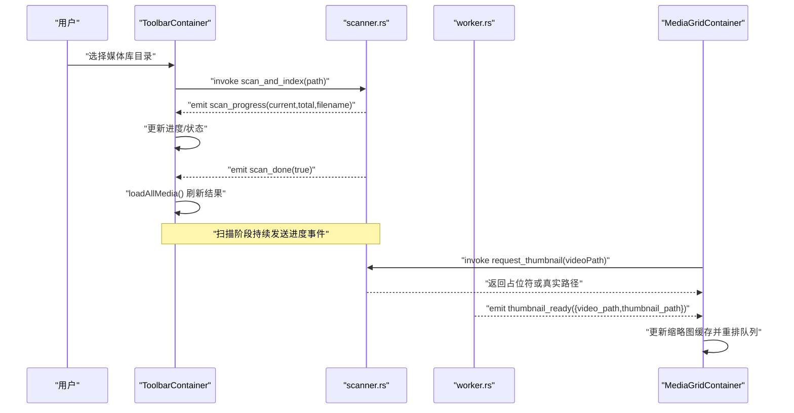
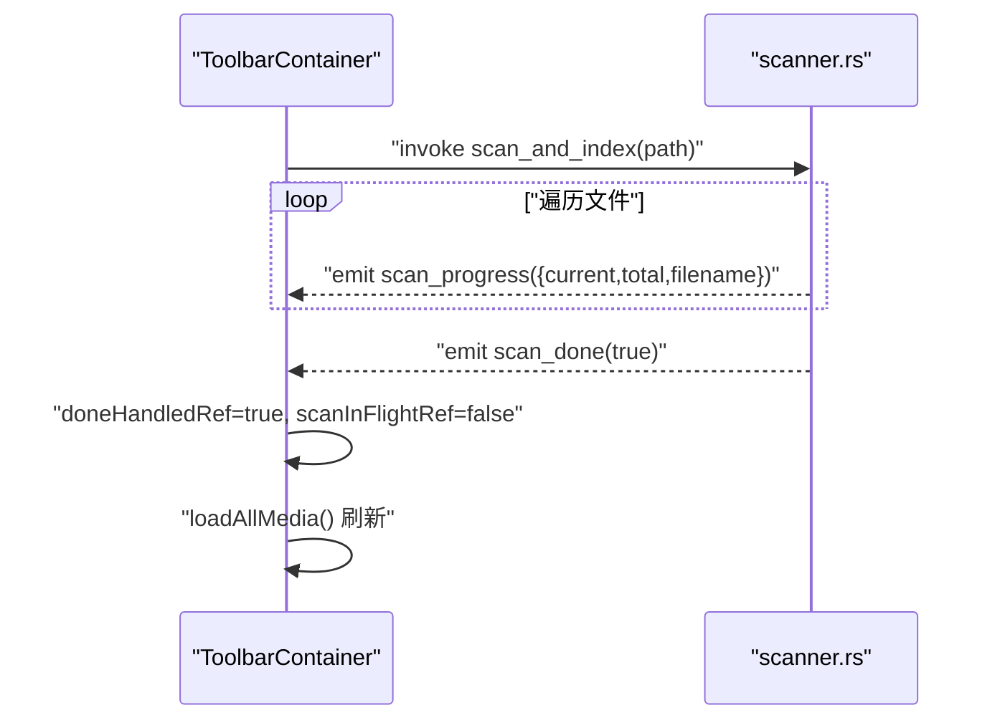
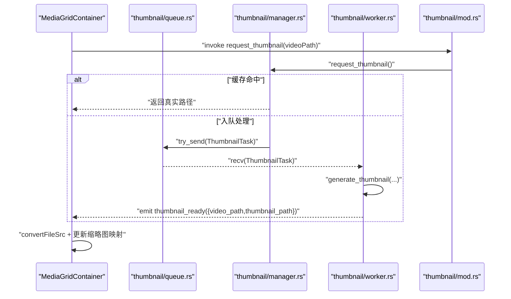
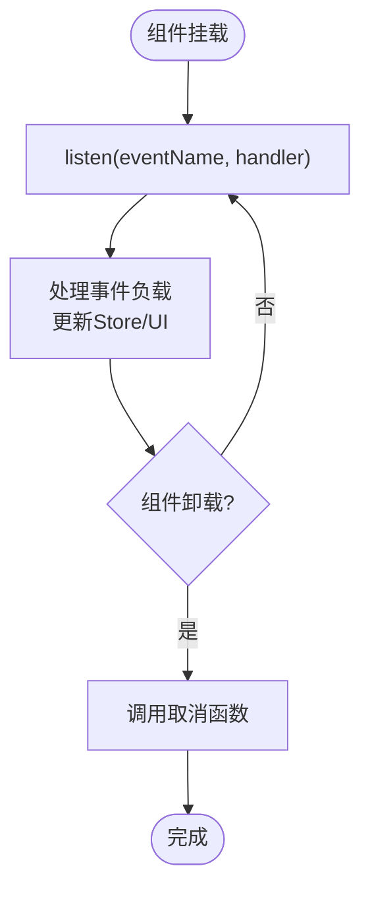

# 事件系统

<cite>
**本文引用的文件**
- [src-tauri/src/main.rs](file://src-tauri/src/main.rs)
- [src-tauri/src/services/scanner.rs](file://src-tauri/src/services/scanner.rs)
- [src-tauri/src/thumbnail/mod.rs](file://src-tauri/src/thumbnail/mod.rs)
- [src-tauri/src/thumbnail/manager.rs](file://src-tauri/src/thumbnail/manager.rs)
- [src-tauri/src/thumbnail/worker.rs](file://src-tauri/src/thumbnail/worker.rs)
- [src-tauri/src/thumbnail/queue.rs](file://src-tauri/src/thumbnail/queue.rs)
- [src/containers/ToolbarContainer.tsx](file://src/containers/ToolbarContainer.tsx)
- [src/containers/MediaGridContainer.tsx](file://src/containers/MediaGridContainer.tsx)
- [src/containers/SidebarContainer.tsx](file://src/containers/SidebarContainer.tsx)
- [src/store/useAppStore.ts](file://src/store/useAppStore.ts)
- [API_REFERENCE.md](file://API_REFERENCE.md)
- [DEVELOPMENT.md](file://DEVELOPMENT.md)
</cite>

## 目录
1. [简介](#简介)
2. [项目结构](#项目结构)
3. [核心组件](#核心组件)
4. [架构总览](#架构总览)
5. [详细组件分析](#详细组件分析)
6. [依赖分析](#依赖分析)
7. [性能考量](#性能考量)
8. [故障排查指南](#故障排查指南)
9. [结论](#结论)
10. [附录](#附录)

## 简介
本文件系统性梳理 Medex 应用的事件通信机制，覆盖以下事件：
- scan_progress（扫描进度事件）
- scan_done（扫描完成事件）
- thumbnail_ready（缩略图就绪事件）

内容涵盖事件定义、负载结构、触发时机、前端监听方式、事件驱动架构的设计理念与实现原理、最佳实践（注册、清理、错误处理）、性能与并发策略，以及完整的前端监听示例路径。

## 项目结构
Medex 的事件系统由后端 Rust 服务通过 Tauri 事件通道向前端 React 容器广播，前端容器负责订阅、消费并更新全局状态与 UI。

```mermaid
graph TB
subgraph "后端(Rust)"
MAIN["main.rs<br/>注册命令/菜单/事件监听"]
SCNR["services/scanner.rs<br/>扫描与进度事件"]
THUMB_MOD["thumbnail/mod.rs<br/>缩略图管理入口"]
THUMB_MGR["thumbnail/manager.rs<br/>队列/工作集/请求"]
THUMB_WRK["thumbnail/worker.rs<br/>工作线程/事件发射"]
THUMB_Q["thumbnail/queue.rs<br/>无阻塞同步通道"]
end
subgraph "前端(React)"
TOOLBAR["ToolbarContainer.tsx<br/>监听 scan_progress/scan_done"]
MEDIA_GRID["MediaGridContainer.tsx<br/>监听 thumbnail_ready"]
SIDEBAR["SidebarContainer.tsx<br/>窗口事件 medex:*"]
STORE["useAppStore.ts<br/>全局状态"]
end
MAIN --> SCNR
MAIN --> THUMB_MOD
THUMB_MOD --> THUMB_MGR
THUMB_MGR --> THUMB_WRK
THUMB_MGR --> THUMB_Q
SCNR -- emit("scan_progress") --> TOOLBAR
SCNR -- emit("scan_done") --> TOOLBAR
THUMB_WRK -- emit("thumbnail_ready") --> MEDIA_GRID
SIDEBAR -- dispatchEvent("medex:*") --> SIDEBAR
TOOLBAR --> STORE
MEDIA_GRID --> STORE
SIDEBAR --> STORE
```

图表来源
- [src-tauri/src/main.rs:10-68](file://src-tauri/src/main.rs#L10-L68)
- [src-tauri/src/services/scanner.rs:250-341](file://src-tauri/src/services/scanner.rs#L250-L341)
- [src-tauri/src/thumbnail/mod.rs:32-61](file://src-tauri/src/thumbnail/mod.rs#L32-L61)
- [src-tauri/src/thumbnail/manager.rs:24-107](file://src-tauri/src/thumbnail/manager.rs#L24-L107)
- [src-tauri/src/thumbnail/worker.rs:13-96](file://src-tauri/src/thumbnail/worker.rs#L13-L96)
- [src/containers/ToolbarContainer.tsx:58-87](file://src/containers/ToolbarContainer.tsx#L58-L87)
- [src/containers/MediaGridContainer.tsx:453-486](file://src/containers/MediaGridContainer.tsx#L453-L486)
- [src/containers/SidebarContainer.tsx:28-33](file://src/containers/SidebarContainer.tsx#L28-L33)

章节来源
- [src-tauri/src/main.rs:10-68](file://src-tauri/src/main.rs#L10-L68)
- [src-tauri/src/services/scanner.rs:250-341](file://src-tauri/src/services/scanner.rs#L250-L341)
- [src-tauri/src/thumbnail/mod.rs:32-61](file://src-tauri/src/thumbnail/mod.rs#L32-L61)
- [src-tauri/src/thumbnail/manager.rs:24-107](file://src-tauri/src/thumbnail/manager.rs#L24-L107)
- [src-tauri/src/thumbnail/worker.rs:13-96](file://src-tauri/src/thumbnail/worker.rs#L13-L96)
- [src/containers/ToolbarContainer.tsx:58-87](file://src/containers/ToolbarContainer.tsx#L58-L87)
- [src/containers/MediaGridContainer.tsx:453-486](file://src/containers/MediaGridContainer.tsx#L453-L486)
- [src/containers/SidebarContainer.tsx:28-33](file://src/containers/SidebarContainer.tsx#L28-L33)

## 核心组件
- 事件源与命令
  - 扫描命令与事件：后端在扫描过程中周期性发射 scan_progress，在完成后发射 scan_done。
  - 缩略图命令与事件：后端通过 request_thumbnail 发起任务，worker 成功生成后发射 thumbnail_ready。
- 前端监听与状态
  - ToolbarContainer 订阅 scan_progress/scan_done，用于 UI 进度反馈与刷新。
  - MediaGridContainer 订阅 thumbnail_ready，用于视频缩略图回填。
  - SidebarContainer 使用窗口事件 medex:tags-updated 实现跨容器同步。
- 全局状态
  - useAppStore 提供媒体项、标签、视图模式等状态，监听事件后更新 Store。

章节来源
- [src-tauri/src/services/scanner.rs:250-341](file://src-tauri/src/services/scanner.rs#L250-L341)
- [src-tauri/src/thumbnail/mod.rs:57-61](file://src-tauri/src/thumbnail/mod.rs#L57-L61)
- [src/containers/ToolbarContainer.tsx:58-87](file://src/containers/ToolbarContainer.tsx#L58-L87)
- [src/containers/MediaGridContainer.tsx:453-486](file://src/containers/MediaGridContainer.tsx#L453-L486)
- [src/containers/SidebarContainer.tsx:28-33](file://src/containers/SidebarContainer.tsx#L28-L33)
- [src/store/useAppStore.ts:145-394](file://src/store/useAppStore.ts#L145-L394)

## 架构总览
事件驱动的总体流程：
- 用户触发扫描（例如点击工具栏选择目录），前端调用后端命令 scan_and_index。
- 后端扫描文件，逐条插入数据库并发射 scan_progress；全部完成后发射 scan_done。
- 前端收到 scan_done 后刷新媒体列表。
- 前端在渲染视频卡片时，调用 request_thumbnail 获取或排队生成缩略图；worker 成功后发射 thumbnail_ready，前端回填缩略图路径。



图表来源
- [src/containers/ToolbarContainer.tsx:31-52](file://src/containers/ToolbarContainer.tsx#L31-L52)
- [src-tauri/src/services/scanner.rs:250-341](file://src-tauri/src/services/scanner.rs#L250-L341)
- [src-tauri/src/thumbnail/worker.rs:81-89](file://src-tauri/src/thumbnail/worker.rs#L81-L89)
- [src/containers/MediaGridContainer.tsx:453-486](file://src/containers/MediaGridContainer.tsx#L453-L486)

## 详细组件分析

### 扫描事件：scan_progress 与 scan_done
- 事件定义与负载
  - scan_progress：包含 current、total、filename 三项，用于展示当前处理进度与文件名。
  - scan_done：布尔值（当前固定为 true），表示扫描阶段结束。
- 触发时机
  - 在 scan_and_index 中逐文件插入数据库时发射 scan_progress；事务完成后发射 scan_done。
- 前端监听方式
  - ToolbarContainer 订阅 scan_done，完成后调用 filter_media 刷新媒体列表并提示结果数量。
  - 可扩展：在订阅 scan_progress 时更新进度条或日志面板。
- 最佳实践
  - 使用引用标记 scanInFlightRef 与 doneHandledRef 防止重复处理。
  - 在卸载时及时取消监听，避免内存泄漏。



图表来源
- [src-tauri/src/services/scanner.rs:250-341](file://src-tauri/src/services/scanner.rs#L250-L341)
- [src/containers/ToolbarContainer.tsx:58-87](file://src/containers/ToolbarContainer.tsx#L58-L87)

章节来源
- [src-tauri/src/services/scanner.rs:250-341](file://src-tauri/src/services/scanner.rs#L250-L341)
- [src/containers/ToolbarContainer.tsx:58-87](file://src/containers/ToolbarContainer.tsx#L58-L87)
- [API_REFERENCE.md:284-312](file://API_REFERENCE.md#L284-L312)

### 缩略图事件：thumbnail_ready
- 事件定义与负载
  - thumbnail_ready：包含 video_path 与 thumbnail_path，用于通知前端某视频的缩略图已生成。
- 触发时机
  - worker 在生成缩略图成功后发射该事件；若缓存存在则直接回填。
- 前端监听方式
  - MediaGridContainer 订阅 thumbnail_ready，解析 payload，将缩略图路径转换为可访问 URL 并更新缓存映射。
- 最佳实践
  - 对于返回占位符的请求，必须等待 thumbnail_ready 事件后才释放请求。
  - 结合并发与队列策略，避免过度占用资源。



图表来源
- [src-tauri/src/thumbnail/mod.rs:57-61](file://src-tauri/src/thumbnail/mod.rs#L57-L61)
- [src-tauri/src/thumbnail/manager.rs:51-107](file://src-tauri/src/thumbnail/manager.rs#L51-L107)
- [src-tauri/src/thumbnail/queue.rs:8-11](file://src-tauri/src/thumbnail/queue.rs#L8-L11)
- [src-tauri/src/thumbnail/worker.rs:52-89](file://src-tauri/src/thumbnail/worker.rs#L52-L89)
- [src/containers/MediaGridContainer.tsx:453-486](file://src/containers/MediaGridContainer.tsx#L453-L486)

章节来源
- [src-tauri/src/thumbnail/mod.rs:18-28](file://src-tauri/src/thumbnail/mod.rs#L18-L28)
- [src-tauri/src/thumbnail/manager.rs:51-107](file://src-tauri/src/thumbnail/manager.rs#L51-L107)
- [src-tauri/src/thumbnail/worker.rs:52-89](file://src-tauri/src/thumbnail/worker.rs#L52-L89)
- [src/containers/MediaGridContainer.tsx:453-486](file://src/containers/MediaGridContainer.tsx#L453-L486)
- [API_REFERENCE.md:314-329](file://API_REFERENCE.md#L314-L329)

### 事件驱动架构的设计理念与实现原理
- 设计理念
  - 松耦合：前端仅通过事件与命令接口感知后端状态变化，不直接依赖内部实现细节。
  - 异步解耦：扫描与缩略图生成在后台执行，前端通过事件驱动更新 UI，避免阻塞主线程。
  - 可扩展：新增事件只需在后端发射并在前端订阅，无需修改既有流程。
- 实现原理
  - 后端使用 Tauri 的 Emitter 接口发射命名事件。
  - 前端使用 @tauri-apps/api/event 的 listen 订阅事件，结合 React 生命周期进行注册与清理。
  - 缩略图系统采用多工作线程 + 有界同步通道，保障吞吐与稳定性。

章节来源
- [src-tauri/src/main.rs:49-65](file://src-tauri/src/main.rs#L49-L65)
- [src-tauri/src/services/scanner.rs:306-329](file://src-tauri/src/services/scanner.rs#L306-L329)
- [src-tauri/src/thumbnail/worker.rs:13-50](file://src-tauri/src/thumbnail/worker.rs#L13-L50)

### 前端监听最佳实践
- 事件注册
  - 在组件 mount 时注册监听，使用异步 listen 返回的取消函数。
- 清理
  - 在组件卸载时调用取消函数，防止事件泄漏。
- 错误处理
  - 对 invoke 与事件回调进行 try/catch，记录错误并提示用户。
- 状态同步
  - 将事件负载映射到 useAppStore，确保跨容器一致。



图表来源
- [src/containers/ToolbarContainer.tsx:58-87](file://src/containers/ToolbarContainer.tsx#L58-L87)
- [src/containers/MediaGridContainer.tsx:453-486](file://src/containers/MediaGridContainer.tsx#L453-L486)

章节来源
- [src/containers/ToolbarContainer.tsx:58-87](file://src/containers/ToolbarContainer.tsx#L58-L87)
- [src/containers/MediaGridContainer.tsx:453-486](file://src/containers/MediaGridContainer.tsx#L453-L486)
- [src/containers/SidebarContainer.tsx:28-33](file://src/containers/SidebarContainer.tsx#L28-L33)
- [API_REFERENCE.md:450-467](file://API_REFERENCE.md#L450-L467)

### 事件监听示例（路径）
- 监听扫描进度
  - [src/containers/ToolbarContainer.tsx:58-87](file://src/containers/ToolbarContainer.tsx#L58-L87)
- 监听扫描完成
  - [src/containers/ToolbarContainer.tsx:58-87](file://src/containers/ToolbarContainer.tsx#L58-L87)
- 监听缩略图就绪
  - [src/containers/MediaGridContainer.tsx:453-486](file://src/containers/MediaGridContainer.tsx#L453-L486)
- 请求缩略图
  - [src-tauri/src/thumbnail/mod.rs:57-61](file://src-tauri/src/thumbnail/mod.rs#L57-L61)
- 标签更新同步
  - [src/containers/SidebarContainer.tsx:28-33](file://src/containers/SidebarContainer.tsx#L28-L33)

章节来源
- [src/containers/ToolbarContainer.tsx:58-87](file://src/containers/ToolbarContainer.tsx#L58-L87)
- [src/containers/MediaGridContainer.tsx:453-486](file://src/containers/MediaGridContainer.tsx#L453-L486)
- [src-tauri/src/thumbnail/mod.rs:57-61](file://src-tauri/src/thumbnail/mod.rs#L57-L61)
- [src/containers/SidebarContainer.tsx:28-33](file://src/containers/SidebarContainer.tsx#L28-L33)
- [API_REFERENCE.md:411-438](file://API_REFERENCE.md#L411-L438)

## 依赖分析
- 组件耦合
  - 后端命令与事件：scanner.rs 与 thumbnail/* 模块分别向前端暴露命令与事件。
  - 前端容器：ToolbarContainer、MediaGridContainer、SidebarContainer 分别依赖不同事件与命令。
- 外部依赖
  - @tauri-apps/api：事件监听与命令调用。
  - Tauri Emitter：后端事件发射。
- 潜在循环依赖
  - 事件为单向传播，不存在循环依赖风险。

```mermaid
graph LR
SCNR["scanner.rs"] -- emit("scan_progress/done") --> FE["前端容器"]
THMOD["thumbnail/mod.rs"] -- cmd("request_thumbnail") --> FE
THWRK["thumbnail/worker.rs"] -- emit("thumbnail_ready") --> FE
FE --> STORE["useAppStore.ts"]
```

图表来源
- [src-tauri/src/services/scanner.rs:306-329](file://src-tauri/src/services/scanner.rs#L306-L329)
- [src-tauri/src/thumbnail/mod.rs:57-61](file://src-tauri/src/thumbnail/mod.rs#L57-L61)
- [src-tauri/src/thumbnail/worker.rs:81-89](file://src-tauri/src/thumbnail/worker.rs#L81-L89)
- [src/store/useAppStore.ts:145-394](file://src/store/useAppStore.ts#L145-L394)

章节来源
- [src-tauri/src/services/scanner.rs:306-329](file://src-tauri/src/services/scanner.rs#L306-L329)
- [src-tauri/src/thumbnail/mod.rs:57-61](file://src-tauri/src/thumbnail/mod.rs#L57-L61)
- [src-tauri/src/thumbnail/worker.rs:81-89](file://src-tauri/src/thumbnail/worker.rs#L81-L89)
- [src/store/useAppStore.ts:145-394](file://src/store/useAppStore.ts#L145-L394)

## 性能考量
- 前端缩略图调度
  - 并发上限与队列容量：MAX_CONCURRENT 与 MAX_QUEUE_SIZE 控制并发与积压。
  - 优先级：可见 > 下一屏 > overscan，保证首屏体验。
- 后端缩略图调度
  - 工作线程数量：默认 4，平衡 CPU 与 I/O。
  - 有界同步通道：避免内存暴涨，提升稳定性。
- 扫描性能
  - 事务批处理插入数据库，减少 IO 次数。
  - 进度事件频率适中，避免 UI 过度抖动。

章节来源
- [API_REFERENCE.md:469-479](file://API_REFERENCE.md#L469-L479)
- [src-tauri/src/thumbnail/mod.rs:14-16](file://src-tauri/src/thumbnail/mod.rs#L14-L16)
- [src-tauri/src/thumbnail/manager.rs:24-49](file://src-tauri/src/thumbnail/manager.rs#L24-L49)

## 故障排查指南
- 事件未触发
  - 确认后端是否正确发射事件（检查命令实现与 AppHandle 使用）。
  - 前端确认监听是否在组件挂载时注册且未提前取消。
- 事件丢失或重复
  - 使用引用标记（如 scanInFlightRef/doneHandledRef）避免重复处理。
  - 对缩略图场景，若返回占位符需等待 thumbnail_ready 事件。
- 错误处理
  - 统一 try/catch 并记录错误日志，必要时弹窗提示。
- 资源泄漏
  - 卸载时务必调用取消函数，清理定时器与事件监听。

章节来源
- [src/containers/ToolbarContainer.tsx:58-87](file://src/containers/ToolbarContainer.tsx#L58-L87)
- [src/containers/MediaGridContainer.tsx:453-486](file://src/containers/MediaGridContainer.tsx#L453-L486)
- [DEVELOPMENT.md:482-484](file://DEVELOPMENT.md#L482-L484)
- [API_REFERENCE.md:450-467](file://API_REFERENCE.md#L450-L467)

## 结论
Medex 的事件系统以 Tauri 事件与命令为核心，实现了扫描进度、扫描完成与缩略图就绪的异步通知，配合前端容器订阅与全局状态管理，形成清晰、可扩展的事件驱动架构。遵循注册/清理/错误处理的最佳实践，并结合并发与队列策略，可在大目录与大量视频场景下保持良好性能与用户体验。

## 附录
- 事件与命令参考
  - 事件列表与负载结构：[API_REFERENCE.md:282-329](file://API_REFERENCE.md#L282-L329)
  - 调用示例（扫描、监听、缩略图、标签）：[API_REFERENCE.md:397-438](file://API_REFERENCE.md#L397-L438)
- 开发建议
  - 缩略图超时回收与失败重试策略：[DEVELOPMENT.md:482-484](file://DEVELOPMENT.md#L482-L484)
  - 全局事件总线迁移建议：[DEVELOPMENT.md:486-491](file://DEVELOPMENT.md#L486-L491)