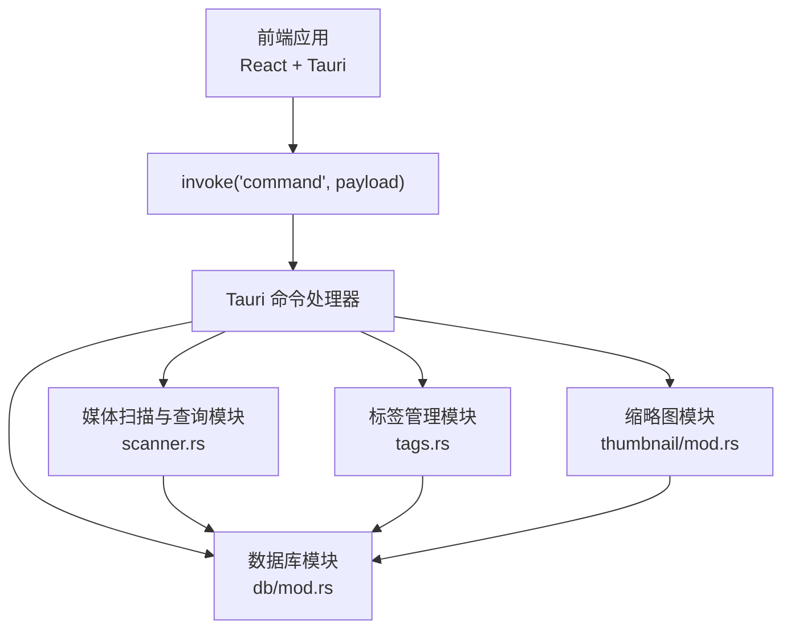
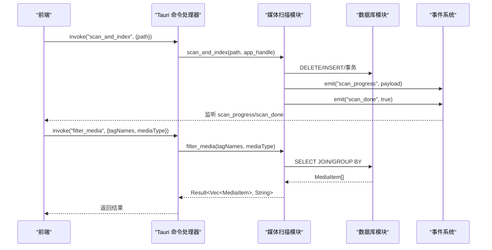
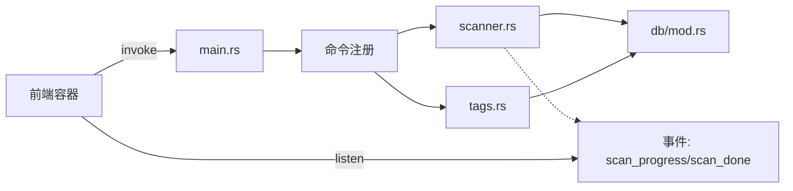

# 媒体相关命令

<cite>
**本文档引用的文件**
- [main.rs](file://src-tauri/src/main.rs)
- [scanner.rs](file://src-tauri/src/services/scanner.rs)
- [tags.rs](file://src-tauri/src/services/tags.rs)
- [db/mod.rs](file://src-tauri/src/db/mod.rs)
- [API_REFERENCE.md](file://API_REFERENCE.md)
- [MediaGridContainer.tsx](file://src/containers/MediaGridContainer.tsx)
- [ToolbarContainer.tsx](file://src/containers/ToolbarContainer.tsx)
- [useAppStore.ts](file://src/store/useAppStore.ts)
- [mod.rs](file://src-tauri/src/thumbnail/mod.rs)
</cite>

## 目录
1. [简介](#简介)
2. [项目结构](#项目结构)
3. [核心组件](#核心组件)
4. [架构概览](#架构概览)
5. [详细组件分析](#详细组件分析)
6. [依赖关系分析](#依赖关系分析)
7. [性能考量](#性能考量)
8. [故障排查指南](#故障排查指南)
9. [结论](#结论)
10. [附录](#附录)

## 简介
本文件面向前端与后端开发者，系统性梳理 Medex 应用中与媒体相关的命令，包括媒体扫描与查询、标签过滤、收藏与最近观看标记等。文档涵盖每个命令的函数签名、参数说明、返回值格式、错误处理策略、执行流程、数据库操作与副作用，并提供最佳实践与性能优化建议，以及前端调用示例路径，帮助读者在不同技术背景下的团队高效协作。

## 项目结构
Medex 的媒体命令主要位于 Tauri 后端的 Rust 模块中，前端通过 Tauri 的 invoke 与事件监听机制进行调用。核心模块如下：
- 命令注册与入口：main.rs
- 媒体扫描与查询：services/scanner.rs
- 标签管理：services/tags.rs
- 数据库初始化与连接：db/mod.rs
- 前端容器与调用示例：containers/* 与 store/useAppStore.ts
- 缩略图系统（与媒体浏览相关）：thumbnail/mod.rs

图表来源
- [main.rs:49-65](file://src-tauri/src/main.rs#L49-L65)
- [scanner.rs:160-341](file://src-tauri/src/services/scanner.rs#L160-L341)
- [tags.rs:19-220](file://src-tauri/src/services/tags.rs#L19-L220)
- [db/mod.rs:45-123](file://src-tauri/src/db/mod.rs#L45-L123)
- [mod.rs:32-62](file://src-tauri/src/thumbnail/mod.rs#L32-L62)

章节来源
- [main.rs:10-68](file://src-tauri/src/main.rs#L10-L68)
- [API_REFERENCE.md:35-330](file://API_REFERENCE.md#L35-L330)

## 核心组件
本节概述媒体相关命令的职责与交互关系：
- 媒体扫描与索引：扫描指定目录，插入媒体元数据，发出扫描进度与完成事件。
- 媒体查询：获取全部媒体或按标签与类型过滤。
- 收藏与最近观看：更新媒体收藏状态，记录最近观看并维护最近观看表大小。
- 标签管理：查询标签、创建/删除标签、为媒体添加/移除标签、按媒体查询标签。

章节来源
- [scanner.rs:160-389](file://src-tauri/src/services/scanner.rs#L160-L389)
- [tags.rs:19-220](file://src-tauri/src/services/tags.rs#L19-L220)
- [db/mod.rs:12-43](file://src-tauri/src/db/mod.rs#L12-L43)

## 架构概览
命令调用链路从前端发起，经由 Tauri 注册的命令处理器，访问数据库模块，执行 SQL 查询或更新，必要时发出事件通知前端。

图表来源
- [main.rs:49-65](file://src-tauri/src/main.rs#L49-L65)
- [scanner.rs:250-341](file://src-tauri/src/services/scanner.rs#L250-L341)
- [scanner.rs:170-247](file://src-tauri/src/services/scanner.rs#L170-L247)

## 详细组件分析

### 命令：scan_and_index（扫描与索引）
- 函数签名
  - Rust: `scan_and_index(path: String, app_handle: AppHandle) -> Result<(), String>`
- 参数
  - path: 目录绝对路径
  - app_handle: Tauri 应用句柄，用于事件广播
- 返回值
  - 成功：无返回值（Result<()>）
  - 失败：字符串错误信息
- 执行流程
  - 清理旧库数据：删除 media、media_tags、recent_views 表并重置自增
  - 扫描目录：遍历目录，识别媒体文件类型（图片/视频），构建 MediaFile 列表
  - 批量插入：事务内插入 media 表，同时逐条发出 scan_progress 事件
  - 结束：发出 scan_done 事件，刷新非设置窗口
- 数据库操作
  - 清理阶段：DELETE FROM media/media_tags/recent_views；DELETE FROM sqlite_sequence
  - 插入阶段：INSERT OR IGNORE INTO media (...) VALUES (?, ?, ?, ?, ?)
  - 事务：开始/提交事务保证一致性
- 副作用
  - 发出 scan_progress（current, total, filename）
  - 发出 scan_done（布尔值）
  - 刷新主界面窗口
- 错误处理
  - 任何阶段失败均返回字符串错误
  - 事件监听端需捕获并提示用户
- 性能与最佳实践
  - 使用事务批量插入，减少磁盘 I/O
  - 事件频率高，前端应节流渲染
  - 大库扫描建议异步执行，避免阻塞 UI
- 前端调用示例
  - 选择目录后调用：见 [MediaGridContainer.tsx:310-331](file://src/containers/MediaGridContainer.tsx#L310-L331)
  - 监听进度与完成：见 [ToolbarContainer.tsx:54-87](file://src/containers/ToolbarContainer.tsx#L54-L87)

章节来源
- [scanner.rs:250-341](file://src-tauri/src/services/scanner.rs#L250-L341)
- [API_REFERENCE.md:41-64](file://API_REFERENCE.md#L41-L64)

### 命令：get_all_media（获取所有媒体）
- 函数签名
  - Rust: `get_all_media() -> Result<Vec<MediaItem>, String>`
- 参数
  - 无
- 返回值
  - 成功：按 id 降序排列的 MediaItem 数组
  - 失败：字符串错误信息
- 执行流程
  - 查询 media 表，左连 recent_views 与 media_tags，按 id 分组，拼接标签
- 数据库操作
  - SELECT m.id,m.path,m.filename,m.type,m.is_favorite,rv.viewed_at,COALESCE(GROUP_CONCAT(t.name,'||'),'') AS tags_concat FROM media m LEFT JOIN recent_views rv ON rv.media_id=m.id LEFT JOIN media_tags mt ON mt.media_id=m.id LEFT JOIN tags t ON t.id=mt.tag_id GROUP BY m.id ORDER BY m.id DESC
- 副作用
  - 无
- 错误处理
  - 任何阶段失败返回字符串错误
- 性能与最佳实践
  - 大库建议配合分页或按类型过滤
  - 前端可缓存结果并在标签/类型变更时增量刷新
- 前端调用示例
  - 见 [MediaGridContainer.tsx:210-235](file://src/containers/MediaGridContainer.tsx#L210-L235)

章节来源
- [scanner.rs:160-163](file://src-tauri/src/services/scanner.rs#L160-L163)
- [API_REFERENCE.md:67-80](file://API_REFERENCE.md#L67-L80)

### 命令：filter_media_by_tags（按标签过滤媒体）
- 函数签名
  - Rust: `filter_media_by_tags(tag_names: Vec<String>) -> Result<Vec<MediaItem>, String>`
- 参数
  - tag_names: 标签名数组
- 返回值
  - 成功：按 id 降序排列的 MediaItem 数组
  - 失败：字符串错误信息
- 执行流程
  - 内部转调 filter_media(tag_names, None)
- 数据库操作
  - 与 filter_media 相同，但不传入类型过滤
- 副作用
  - 无
- 错误处理
  - 任何阶段失败返回字符串错误
- 性能与最佳实践
  - 标签交集查询使用子查询 + HAVING COUNT(DISTINCT t1.id)=?，避免重复标签计数
- 前端调用示例
  - 见 [MediaGridContainer.tsx:210-235](file://src/containers/MediaGridContainer.tsx#L210-L235)

章节来源
- [scanner.rs:165-168](file://src-tauri/src/services/scanner.rs#L165-L168)
- [API_REFERENCE.md:82-95](file://API_REFERENCE.md#L82-L95)

### 命令：filter_media（按标签和类型过滤媒体）
- 函数签名
  - Rust: `filter_media(tag_names: Vec<String>, media_type: Option<String>) -> Result<Vec<MediaItem>, String>`
- 参数
  - tag_names: 标签名数组（可为空）
  - media_type: 'image' | 'video' | null
- 返回值
  - 成功：按 id 降序排列的 MediaItem 数组
  - 失败：字符串错误信息
- 执行流程
  - 归一化 media_type：支持 'image' | 'video' | 'all'/'all' 等，空或 'all' 视为无类型过滤
  - tag_names 为空：按类型过滤或返回全部
  - tag_names 非空：按标签交集过滤 + 类型过滤
- 数据库操作
  - 子查询匹配满足所有标签的媒体 id，再与主表连接获取标签拼接
  - 使用 GROUP BY + HAVING COUNT(DISTINCT t1.id)=? 实现标签交集
- 副作用
  - 无
- 错误处理
  - 任何阶段失败返回字符串错误
- 性能与最佳实践
  - 使用 IN 子句与参数绑定，避免 SQL 注入
  - 大集合过滤建议前端先做标签去重
- 前端调用示例
  - 见 [MediaGridContainer.tsx:210-235](file://src/containers/MediaGridContainer.tsx#L210-L235)

章节来源
- [scanner.rs:170-247](file://src-tauri/src/services/scanner.rs#L170-L247)
- [API_REFERENCE.md:97-116](file://API_REFERENCE.md#L97-L116)

### 命令：set_media_favorite（设置媒体收藏）
- 函数签名
  - Rust: `set_media_favorite(media_id: i64, is_favorite: bool) -> Result<(), String>`
- 参数
  - media_id: 媒体 id
  - is_favorite: 是否收藏
- 返回值
  - 成功：无返回值
  - 失败：字符串错误信息
- 执行流程
  - 更新 media 表的 is_favorite 字段与 updated_at
- 数据库操作
  - UPDATE media SET is_favorite=?, updated_at=? WHERE id=?
- 副作用
  - 无
- 错误处理
  - 任何阶段失败返回字符串错误
- 性能与最佳实践
  - 单条更新，开销极小
  - 前端应立即本地切换收藏状态，若后端失败回滚
- 前端调用示例
  - 见 [MediaGridContainer.tsx:185-201](file://src/containers/MediaGridContainer.tsx#L185-L201)

章节来源
- [scanner.rs:343-354](file://src-tauri/src/services/scanner.rs#L343-L354)
- [API_REFERENCE.md:118-136](file://API_REFERENCE.md#L118-L136)

### 命令：mark_media_viewed（标记媒体已查看）
- 函数签名
  - Rust: `mark_media_viewed(media_id: i64) -> Result<(), String>`
- 参数
  - media_id: 媒体 id
- 返回值
  - 成功：无返回值
  - 失败：字符串错误信息
- 执行流程
  - upsert recent_views 表的 viewed_at 字段
  - 限制最近观看记录数量为 100 条
- 数据库操作
  - INSERT INTO recent_views (...) VALUES (...) ON CONFLICT(...) DO UPDATE SET viewed_at=excluded.viewed_at
  - DELETE FROM recent_views WHERE media_id NOT IN (SELECT media_id FROM recent_views ORDER BY viewed_at DESC LIMIT 100)
- 副作用
  - 无
- 错误处理
  - 任何阶段失败返回字符串错误
- 性能与最佳实践
  - upsert + 限制数量，避免表无限增长
  - 前端可本地标记 isRecent，后端成功后再持久化
- 前端调用示例
  - 可结合媒体点击/播放事件在前端触发，后端更新最近观看

章节来源
- [scanner.rs:356-389](file://src-tauri/src/services/scanner.rs#L356-L389)
- [API_REFERENCE.md:139-152](file://API_REFERENCE.md#L139-L152)

### 命令：clear_library_data（清空媒体库数据）
- 函数签名
  - Rust: `clear_library_data(app_handle: AppHandle) -> Result<(), String>`
- 参数
  - app_handle: Tauri 应用句柄
- 返回值
  - 成功：无返回值
  - 失败：字符串错误信息
- 执行流程
  - 清空 media、media_tags、recent_views 表并重置自增
  - 刷新非设置窗口
- 数据库操作
  - DELETE FROM media/media_tags/recent_views；DELETE FROM sqlite_sequence
- 副作用
  - 刷新主窗口
- 错误处理
  - 任何阶段失败返回字符串错误
- 前端调用示例
  - 可在设置或工具菜单中提供一键清空入口

章节来源
- [scanner.rs:475-524](file://src-tauri/src/services/scanner.rs#L475-L524)

## 依赖关系分析
- 命令注册：main.rs 将 scanner.rs 与 tags.rs 中的命令注册到 Tauri
- 数据库：db/mod.rs 提供 SQLite 初始化、表结构与连接池封装
- 事件：scanner.rs 在扫描过程中发出 scan_progress 与 scan_done 事件
- 前端：MediaGridContainer.tsx 与 ToolbarContainer.tsx 通过 invoke 调用命令并监听事件

图表来源
- [main.rs:49-65](file://src-tauri/src/main.rs#L49-L65)
- [scanner.rs:250-341](file://src-tauri/src/services/scanner.rs#L250-L341)
- [tags.rs:19-220](file://src-tauri/src/services/tags.rs#L19-L220)
- [db/mod.rs:45-123](file://src-tauri/src/db/mod.rs#L45-L123)

章节来源
- [main.rs:49-65](file://src-tauri/src/main.rs#L49-L65)

## 性能考量
- 扫描阶段
  - 使用事务批量插入，减少磁盘 I/O
  - 事件频率高，前端应节流渲染
- 查询阶段
  - filter_media 使用子查询 + HAVING COUNT(DISTINCT ...) 实现标签交集，注意索引与参数绑定
  - 建议前端对标签数组去重，避免重复查询
- 最近观看
  - upsert + 限制 100 条，避免表无限增长
- 前端缩略图
  - 并发与队列控制：MAX_CONCURRENT=5，MAX_QUEUE_SIZE=400
  - 优先级：可见 > 下一屏 > overscan

章节来源
- [API_REFERENCE.md:469-482](file://API_REFERENCE.md#L469-L482)
- [MediaGridContainer.tsx:27-28](file://src/containers/MediaGridContainer.tsx#L27-L28)

## 故障排查指南
- 常见错误
  - 数据库未初始化：检查 db/mod.rs 的 init_db 是否在应用启动时调用
  - 无效 media_type：filter_media 对类型参数有严格校验，'image' | 'video' | 'all'/'all' 等
  - 标签删除失败：标签仍被媒体引用时无法删除
- 前端调试
  - 监听 scan_progress/scan_done 事件，确认扫描生命周期
  - 捕获 invoke 异常并提示用户
- 数据库健康
  - 定期检查 recent_views 表是否超过 100 条
  - 确认索引是否存在（idx_media_path、idx_media_tags_media_id、idx_recent_views_viewed_at）

章节来源
- [db/mod.rs:45-95](file://src-tauri/src/db/mod.rs#L45-L95)
- [scanner.rs:460-472](file://src-tauri/src/services/scanner.rs#L460-L472)
- [tags.rs:96-124](file://src-tauri/src/services/tags.rs#L96-L124)

## 结论
本文档系统梳理了 Medex 的媒体相关命令，覆盖扫描、查询、收藏、最近观看与标签管理等核心功能。通过明确的函数签名、参数说明、返回值格式、错误处理与执行流程，结合数据库操作与副作用分析，为前后端协同开发提供了清晰的参考。建议在生产环境中配合分页、事件节流与索引优化，以获得更佳的用户体验与性能表现。

## 附录

### 命令一览与调用示例路径
- 扫描与索引
  - scan_and_index：见 [MediaGridContainer.tsx:310-331](file://src/containers/MediaGridContainer.tsx#L310-L331)，事件监听见 [ToolbarContainer.tsx:54-87](file://src/containers/ToolbarContainer.tsx#L54-L87)
- 媒体查询
  - get_all_media：见 [MediaGridContainer.tsx:210-235](file://src/containers/MediaGridContainer.tsx#L210-L235)
  - filter_media_by_tags：见 [MediaGridContainer.tsx:210-235](file://src/containers/MediaGridContainer.tsx#L210-L235)
  - filter_media：见 [MediaGridContainer.tsx:210-235](file://src/containers/MediaGridContainer.tsx#L210-L235)
- 收藏与最近观看
  - set_media_favorite：见 [MediaGridContainer.tsx:185-201](file://src/containers/MediaGridContainer.tsx#L185-L201)
  - mark_media_viewed：建议在媒体点击/播放事件中触发
- 标签管理
  - get_all_tags/get_all_tags_with_count：见 [useAppStore.ts:277-288](file://src/store/useAppStore.ts#L277-L288)
  - create_tag/delete_tag/add_tag_to_media/remove_tag_from_media/get_tags_by_media：见 [tags.rs:19-220](file://src-tauri/src/services/tags.rs#L19-L220)

章节来源
- [API_REFERENCE.md:35-330](file://API_REFERENCE.md#L35-L330)