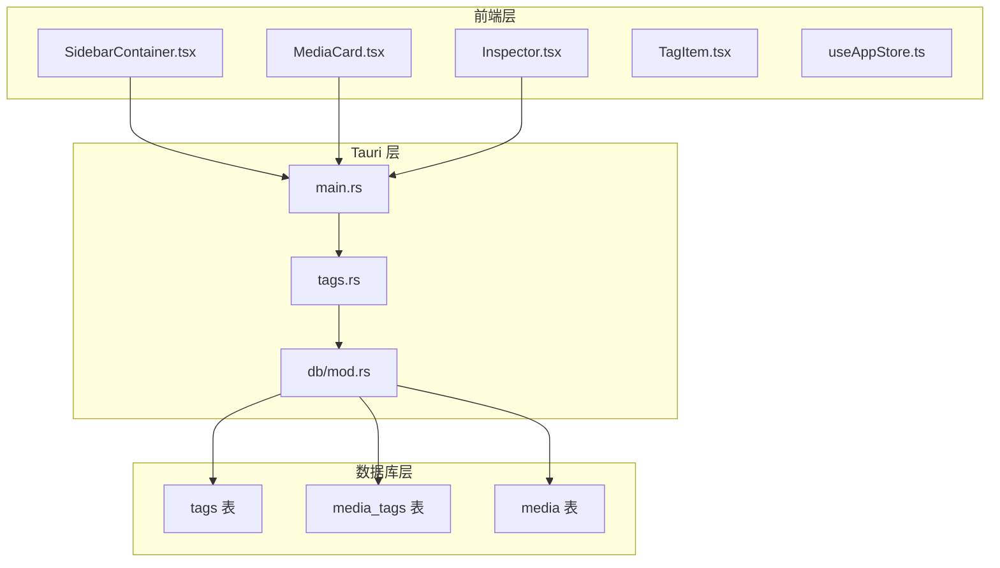
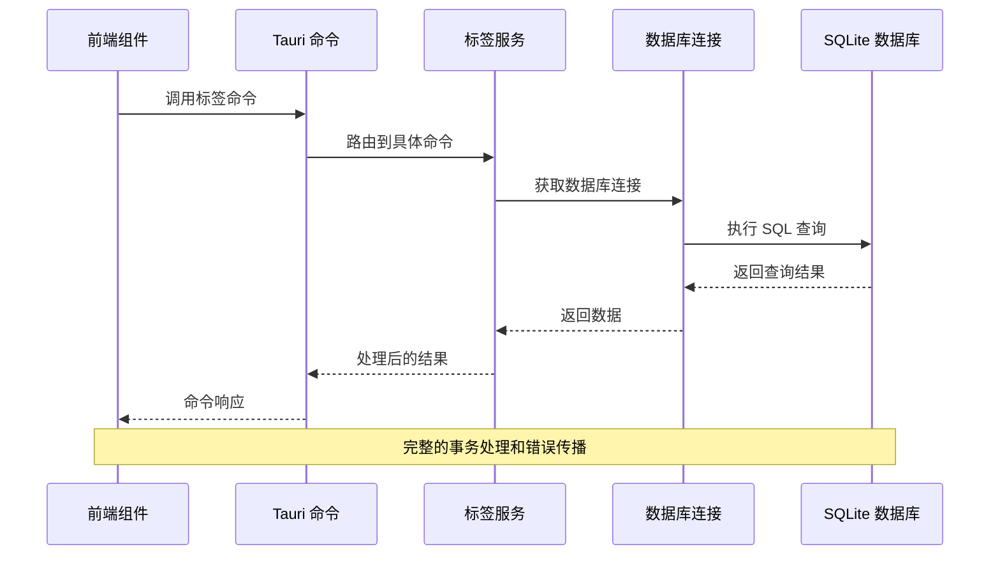
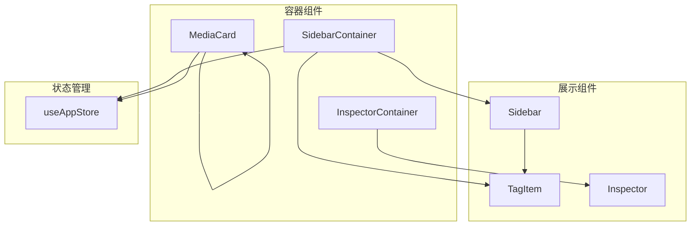
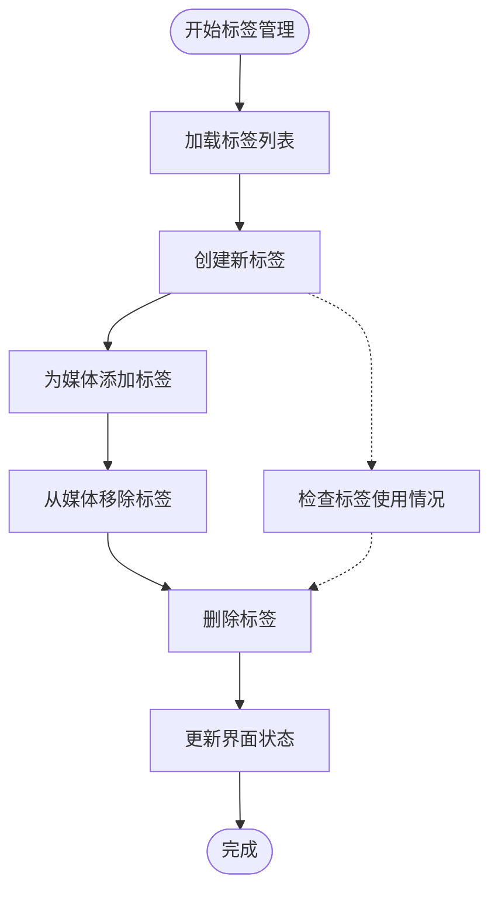

# 标签管理命令

<cite>
**本文档引用的文件**
- [src-tauri/src/services/tags.rs](file://src-tauri/src/services/tags.rs)
- [src-tauri/src/db/mod.rs](file://src-tauri/src/db/mod.rs)
- [src-tauri/src/main.rs](file://src-tauri/src/main.rs)
- [src/containers/SidebarContainer.tsx](file://src/containers/SidebarContainer.tsx)
- [src/components/MediaCard.tsx](file://src/components/MediaCard.tsx)
- [src/components/Inspector.tsx](file://src/components/Inspector.tsx)
- [src/components/Sidebar.tsx](file://src/components/Sidebar.tsx)
- [src/components/TagItem.tsx](file://src/components/TagItem.tsx)
- [src/store/useAppStore.ts](file://src/store/useAppStore.ts)
- [API_REFERENCE.md](file://API_REFERENCE.md)
</cite>

## 目录
1. [简介](#简介)
2. [项目结构](#项目结构)
3. [核心组件](#核心组件)
4. [架构概览](#架构概览)
5. [详细组件分析](#详细组件分析)
6. [依赖关系分析](#依赖关系分析)
7. [性能考虑](#性能考虑)
8. [故障排除指南](#故障排除指南)
9. [结论](#结论)
10. [附录](#附录)

## 简介
本文件详细记录 Medex 应用中的标签管理系统，涵盖所有标签相关的命令接口。标签系统采用 SQLite 数据库存储，通过 Tauri 命令在 Rust 后端与 React 前端之间进行通信。系统支持标签的创建、删除、查询以及与媒体的关联管理，并提供完整的事务处理和级联删除逻辑。

## 项目结构
标签管理功能分布在以下关键位置：



**图表来源**
- [src-tauri/src/main.rs:49-65](file://src-tauri/src/main.rs#L49-L65)
- [src-tauri/src/services/tags.rs:19-220](file://src-tauri/src/services/tags.rs#L19-L220)
- [src-tauri/src/db/mod.rs:23-42](file://src-tauri/src/db/mod.rs#L23-L42)

**章节来源**
- [src-tauri/src/main.rs:10-69](file://src-tauri/src/main.rs#L10-L69)
- [src-tauri/src/services/tags.rs:19-220](file://src-tauri/src/services/tags.rs#L19-L220)
- [src-tauri/src/db/mod.rs:12-43](file://src-tauri/src/db/mod.rs#L12-L43)

## 核心组件
标签系统由三个核心组件构成：

### 数据模型
系统采用三张核心表进行数据存储：
- **tags 表**：存储标签基本信息（id, name）
- **media_tags 表**：存储媒体与标签的多对多关系（media_id, tag_id）
- **media 表**：存储媒体文件信息

### 命令接口
系统提供六个主要命令接口，每个都经过精心设计以确保数据一致性和用户体验：

1. **get_all_tags** - 获取所有标签
2. **get_all_tags_with_count** - 获取带计数的标签
3. **create_tag** - 创建标签
4. **delete_tag** - 删除标签
5. **add_tag_to_media** - 为媒体添加标签
6. **remove_tag_from_media** - 从媒体移除标签
7. **get_tags_by_media** - 获取媒体的标签

**章节来源**
- [src-tauri/src/services/tags.rs:5-17](file://src-tauri/src/services/tags.rs#L5-L17)
- [src-tauri/src/db/mod.rs:23-32](file://src-tauri/src/db/mod.rs#L23-L32)

## 架构概览
标签系统的整体架构采用分层设计，确保前后端分离和数据一致性：



**图表来源**
- [src-tauri/src/main.rs:49-65](file://src-tauri/src/main.rs#L49-L65)
- [src-tauri/src/services/tags.rs:19-220](file://src-tauri/src/services/tags.rs#L19-L220)
- [src-tauri/src/db/mod.rs:97-110](file://src-tauri/src/db/mod.rs#L97-L110)

## 详细组件分析

### get_all_tags 命令
获取所有标签的命令接口，用于初始化标签列表和显示标签选择器。

**函数签名**
```typescript
// 前端调用
invoke('get_all_tags') returns Promise<Tag[]>

// Rust 实现
#[tauri::command]
pub fn get_all_tags() -> Result<Vec<Tag>, String>
```

**参数说明**
- 无参数

**返回值格式**
- `Tag[]` - 按名称升序排列的标签数组
- 每个 Tag 对象包含：`id: number`, `name: string`

**约束条件**
- 返回结果按标签名称进行升序排序
- 使用 `INSERT OR IGNORE` 避免重复标签

**使用示例**
```typescript
// 在侧边栏容器中使用
const tags = await invoke<Tag[]>('get_all_tags');
setTags(tags);

// 在媒体卡片中使用
const tags = await invoke<Tag[]>('get_all_tags');
```

**章节来源**
- [src-tauri/src/services/tags.rs:19-42](file://src-tauri/src/services/tags.rs#L19-L42)
- [API_REFERENCE.md:157-167](file://API_REFERENCE.md#L157-L167)

### get_all_tags_with_count 命令
获取带计数的标签列表，显示每个标签关联的媒体数量。

**函数签名**
```typescript
// 前端调用
invoke('get_all_tags_with_count') returns Promise<TagWithCount[]>

// Rust 实现
#[tauri::command]
pub fn get_all_tags_with_count() -> Result<Vec<TagWithCount>, String>
```

**参数说明**
- 无参数

**返回值格式**
- `TagWithCount[]` - 包含媒体计数的标签数组
- 每个 TagWithCount 对象包含：`id: number`, `name: string`, `mediaCount: number`

**约束条件**
- 使用 LEFT JOIN 确保即使没有关联媒体的标签也会显示
- 计数为 0 的标签也会出现在结果中

**使用示例**
```typescript
// 在侧边栏中显示标签统计
const tagsWithCount = await invoke<DbTagItem[]>('get_all_tags_with_count');
setTagsFromDb(tagsWithCount);
```

**章节来源**
- [src-tauri/src/services/tags.rs:44-74](file://src-tauri/src/services/tags.rs#L44-L74)
- [API_REFERENCE.md:170-181](file://API_REFERENCE.md#L170-L181)

### create_tag 命令
创建新标签的命令接口，支持标签的标准化处理。

**函数签名**
```typescript
// 前端调用
invoke('create_tag', { tagName: string }) returns Promise<void>

// Rust 实现
#[tauri::command]
pub fn create_tag(tag_name: String) -> Result<(), String>
```

**参数说明**
- `tagName: string` - 要创建的标签名称

**返回值格式**
- `void` - 成功时返回空值

**约束条件**
- 自动去除首尾空白字符
- 空字符串会被拒绝
- 使用 `INSERT OR IGNORE` 避免重复创建
- 支持中文标签名称

**使用示例**
```typescript
// 在侧边栏中创建新标签
await invoke('create_tag', { tagName: normalized });

// 错误处理示例
try {
  await invoke('create_tag', { tagName: '' });
} catch (error) {
  console.error('创建标签失败:', error);
}
```

**章节来源**
- [src-tauri/src/services/tags.rs:76-93](file://src-tauri/src/services/tags.rs#L76-L93)
- [API_REFERENCE.md:184-195](file://API_REFERENCE.md#L184-L195)

### delete_tag 命令
删除标签的命令接口，包含严格的使用检查机制。

**函数签名**
```typescript
// 前端调用
invoke('delete_tag', { tagId: number }) returns Promise<void>

// Rust 实现
#[tauri::command]
pub fn delete_tag(tag_id: i64) -> Result<(), String>
```

**参数说明**
- `tagId: number` - 要删除的标签 ID

**返回值格式**
- `void` - 成功时返回空值

**约束条件**
- 必须先检查标签是否仍在使用
- 如果标签已被任何媒体引用，则拒绝删除
- 使用事务确保操作的原子性
- 删除操作不会级联删除标签记录

**使用示例**
```typescript
// 删除标签时的安全检查
try {
  await invoke('delete_tag', { tagId: Number(tagId) });
} catch (error) {
  if (error.includes('still used by media')) {
    alert('该标签正在被媒体使用，无法删除');
  }
}
```

**章节来源**
- [src-tauri/src/services/tags.rs:95-124](file://src-tauri/src/services/tags.rs#L95-L124)
- [API_REFERENCE.md:198-209](file://API_REFERENCE.md#L198-L209)

### add_tag_to_media 命令
为媒体添加标签的复合命令，包含标签创建和关联操作。

**函数签名**
```typescript
// 前端调用
invoke('add_tag_to_media', { mediaId: number, tagName: string }) returns Promise<void>

// Rust 实现
#[tauri::command]
pub fn add_tag_to_media(media_id: i64, tag_name: String) -> Result<(), String>
```

**参数说明**
- `mediaId: number` - 媒体文件 ID
- `tagName: string` - 标签名称

**返回值格式**
- `void` - 成功时返回空值

**约束条件**
- 自动标准化标签名称（去除空白）
- 使用事务确保操作的原子性
- 先创建标签（如果不存在），再建立关联关系
- 使用 `INSERT OR IGNORE` 避免重复关联

**使用示例**
```typescript
// 为选中的媒体添加标签
await invoke('add_tag_to_media', { 
  mediaId: Number(selectedMediaId), 
  tagName: normalizedTagName 
});
```

**章节来源**
- [src-tauri/src/services/tags.rs:126-164](file://src-tauri/src/services/tags.rs#L126-L164)
- [API_REFERENCE.md:212-224](file://API_REFERENCE.md#L212-L224)

### remove_tag_from_media 命令
从媒体移除标签的命令接口，遵循最小化删除原则。

**函数签名**
```typescript
// 前端调用
invoke('remove_tag_from_media', { mediaId: number, tagId: number }) returns Promise<void>

// Rust 实现
#[tauri::command]
pub fn remove_tag_from_media(media_id: i64, tag_id: i64) -> Result<(), String>
```

**参数说明**
- `mediaId: number` - 媒体文件 ID
- `tagId: number` - 标签 ID

**返回值格式**
- `void` - 成功时返回空值

**约束条件**
- 仅删除媒体与标签的关联关系
- 不会自动删除孤立的标签记录
- 使用事务确保操作的原子性
- 不会级联删除标签

**使用示例**
```typescript
// 从媒体移除标签
await invoke('remove_tag_from_media', { 
  mediaId: mediaIdNum, 
  tagId: matched.id 
});
```

**章节来源**
- [src-tauri/src/services/tags.rs:166-188](file://src-tauri/src/services/tags.rs#L166-L188)
- [API_REFERENCE.md:227-238](file://API_REFERENCE.md#L227-L238)

### get_tags_by_media 命令
获取指定媒体的所有标签信息。

**函数签名**
```typescript
// 前端调用
invoke('get_tags_by_media', { mediaId: number }) returns Promise<Tag[]>

// Rust 实现
#[tauri::command]
pub fn get_tags_by_media(media_id: i64) -> Result<Vec<Tag>, String>
```

**参数说明**
- `mediaId: number` - 媒体文件 ID

**返回值格式**
- `Tag[]` - 指定媒体的标签数组

**约束条件**
- 返回与媒体关联的所有标签
- 结果按标签名称升序排列
- 不包含未使用的标签

**使用示例**
```typescript
// 获取媒体的标签列表
const dbTags = await invoke<DbTag[]>('get_tags_by_media', { mediaId: mediaIdNum });
```

**章节来源**
- [src-tauri/src/services/tags.rs:190-219](file://src-tauri/src/services/tags.rs#L190-L219)
- [API_REFERENCE.md:241-251](file://API_REFERENCE.md#L241-L251)

## 依赖关系分析

### 数据模型关系
标签系统采用标准的关系型数据库设计：

```mermaid
erDiagram
MEDIA {
integer id PK
text path UK
text filename
text type
integer is_favorite
integer created_at
integer updated_at
}
TAGS {
integer id PK
text name UK
}
MEDIA_TAGS {
integer media_id FK
integer tag_id FK
PRIMARY KEY (media_id, tag_id)
}
MEDIA_TAGS }o--|| TAGS : "关联"
MEDIA_TAGS }o--|| MEDIA : "关联"
```

**图表来源**
- [src-tauri/src/db/mod.rs:23-32](file://src-tauri/src/db/mod.rs#L23-L32)

### 前端依赖关系
前端组件之间的依赖关系：



**图表来源**
- [src/containers/SidebarContainer.tsx:1-79](file://src/containers/SidebarContainer.tsx#L1-L79)
- [src/components/MediaCard.tsx:1-318](file://src/components/MediaCard.tsx#L1-L318)
- [src/components/Sidebar.tsx:1-145](file://src/components/Sidebar.tsx#L1-L145)

**章节来源**
- [src/containers/SidebarContainer.tsx:1-79](file://src/containers/SidebarContainer.tsx#L1-L79)
- [src/components/MediaCard.tsx:1-318](file://src/components/MediaCard.tsx#L1-L318)
- [src/components/Sidebar.tsx:1-145](file://src/components/Sidebar.tsx#L1-L145)

## 性能考虑

### 数据库优化
系统采用了多项数据库优化策略：

1. **索引优化**
   - `idx_media_tags_media_id`: 加速媒体查询
   - `idx_media_tags_tag_id`: 加速标签查询
   - `idx_media_path`: 加速媒体路径查询

2. **查询优化**
   - 使用 `LEFT JOIN` 确保标签计数的准确性
   - 使用 `GROUP BY` 进行高效的聚合查询
   - 使用 `ORDER BY` 进行稳定的排序

3. **事务处理**
   - 所有标签操作都在事务中执行
   - 确保数据一致性和原子性
   - 减少数据库锁定时间

### 前端性能优化
1. **状态管理优化**
   - 使用 ZUSTAND 进行高效的状态管理
   - 避免不必要的组件重新渲染
   - 使用 memo 包装避免重复计算

2. **异步操作优化**
   - 批量加载标签数据
   - 使用事件系统通知状态更新
   - 避免频繁的数据库查询

3. **内存管理**
   - 及时清理事件监听器
   - 合理使用 React.memo
   - 避免内存泄漏

**章节来源**
- [src-tauri/src/db/mod.rs:39-42](file://src-tauri/src/db/mod.rs#L39-L42)
- [src/store/useAppStore.ts:145-395](file://src/store/useAppStore.ts#L145-L395)

## 故障排除指南

### 常见错误及解决方案

#### 标签创建失败
**问题描述**: 创建标签时报错，提示标签名称无效
**可能原因**:
- 标签名称为空或只包含空白字符
- 数据库连接异常

**解决方案**:
```typescript
// 前端验证
const normalized = newTagName.trim();
if (!normalized) {
  window.alert('标签名称不能为空');
  return;
}

// 错误处理
try {
  await invoke('create_tag', { tagName: normalized });
} catch (error) {
  console.error('创建标签失败:', error);
  window.alert(`新增标签失败：${String(error)}`);
}
```

#### 标签删除失败
**问题描述**: 删除标签时报错，提示标签正在使用中
**可能原因**:
- 标签仍被媒体引用
- 数据库事务冲突

**解决方案**:
```typescript
// 删除前检查
try {
  await invoke('delete_tag', { tagId: Number(tagId) });
} catch (error) {
  if (error.includes('still used by media')) {
    window.alert('该标签正在被媒体使用，无法删除');
  }
}
```

#### 标签关联失败
**问题描述**: 为媒体添加标签失败
**可能原因**:
- 媒体 ID 无效
- 标签名称格式不正确

**解决方案**:
```typescript
// 参数验证
const mediaIdNum = Number(id);
if (!Number.isFinite(mediaIdNum)) {
  console.error('无效的媒体 ID');
  return;
}

// 添加标签
try {
  await invoke('add_tag_to_media', { 
    mediaId: mediaIdNum, 
    tagName: normalized 
  });
} catch (error) {
  console.error('添加标签失败:', error);
}
```

### 调试技巧
1. **启用详细日志**
   ```typescript
   // 在调用前后添加日志
   console.log('调用前:', Date.now());
   const result = await invoke('get_all_tags_with_count');
   console.log('调用后:', Date.now(), result);
   ```

2. **使用浏览器开发者工具**
   - 检查网络面板中的 Tauri 调用
   - 监控数据库查询性能
   - 分析内存使用情况

3. **事件监听调试**
   ```typescript
   // 监听标签更新事件
   const unlisten = await listen('medex:tags-updated', (event) => {
     console.log('标签已更新:', event);
   });
   ```

**章节来源**
- [src/containers/SidebarContainer.tsx:42-63](file://src/containers/SidebarContainer.tsx#L42-L63)
- [src/components/MediaCard.tsx:65-84](file://src/components/MediaCard.tsx#L65-L84)

## 结论
Medex 的标签管理系统设计合理，实现了完整的标签生命周期管理。系统通过清晰的命令接口、严格的事务处理和合理的数据模型，提供了可靠的标签管理功能。前端与后端的分离设计确保了良好的可维护性和扩展性。

主要优势包括：
- 完整的标签 CRUD 操作
- 严格的数据一致性和完整性保证
- 用户友好的前端交互体验
- 良好的性能优化和错误处理机制

建议的改进方向：
- 添加批量标签操作接口
- 实现标签搜索和过滤功能
- 增强标签导入导出功能
- 提供标签统计和分析报告

## 附录

### 前端调用最佳实践

#### 标签管理流程


#### 错误处理模式
```typescript
// 统一的错误处理模式
const handleCommand = async (command: string, payload: any) => {
  try {
    const result = await invoke(command, payload);
    return { success: true, data: result };
  } catch (error) {
    return { success: false, error: String(error) };
  }
};

// 使用示例
const { success, error } = await handleCommand('create_tag', { tagName: 'test' });
if (!success) {
  console.error('操作失败:', error);
}
```

#### 性能监控
```typescript
// 性能监控装饰器
const withPerformance = (command: string, fn: Function) => {
  return async (...args: any[]) => {
    const start = performance.now();
    try {
      const result = await fn(...args);
      const end = performance.now();
      console.log(`${command} 执行时间: ${end - start}ms`);
      return result;
    } catch (error) {
      const end = performance.now();
      console.error(`${command} 执行失败: ${end - start}ms`, error);
      throw error;
    }
  };
};
```

**章节来源**
- [src/containers/SidebarContainer.tsx:16-33](file://src/containers/SidebarContainer.tsx#L16-L33)
- [src/components/MediaCard.tsx:65-84](file://src/components/MediaCard.tsx#L65-L84)