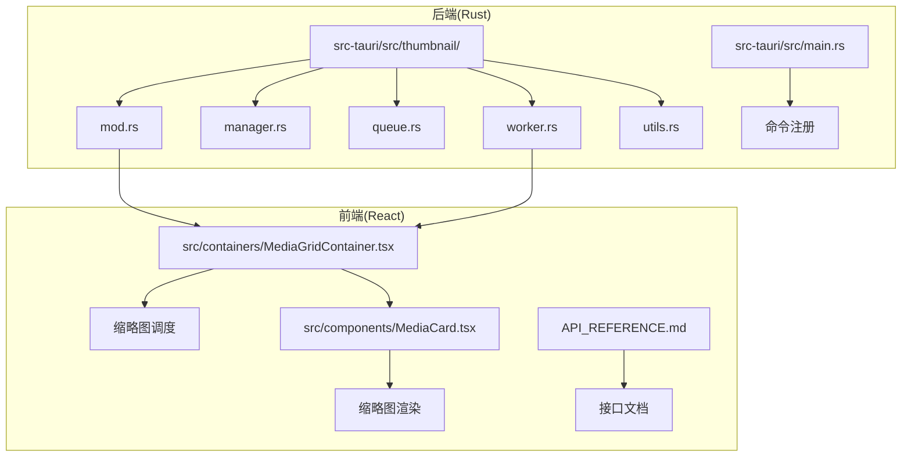
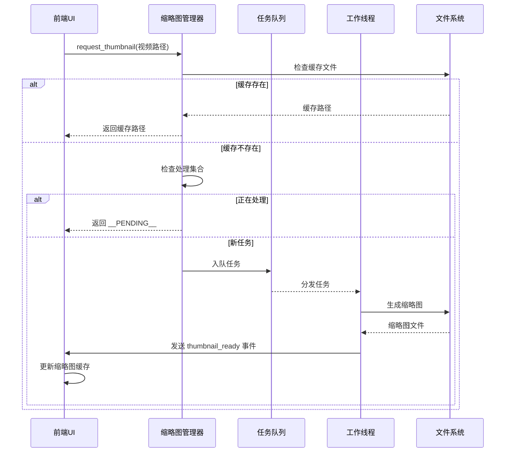
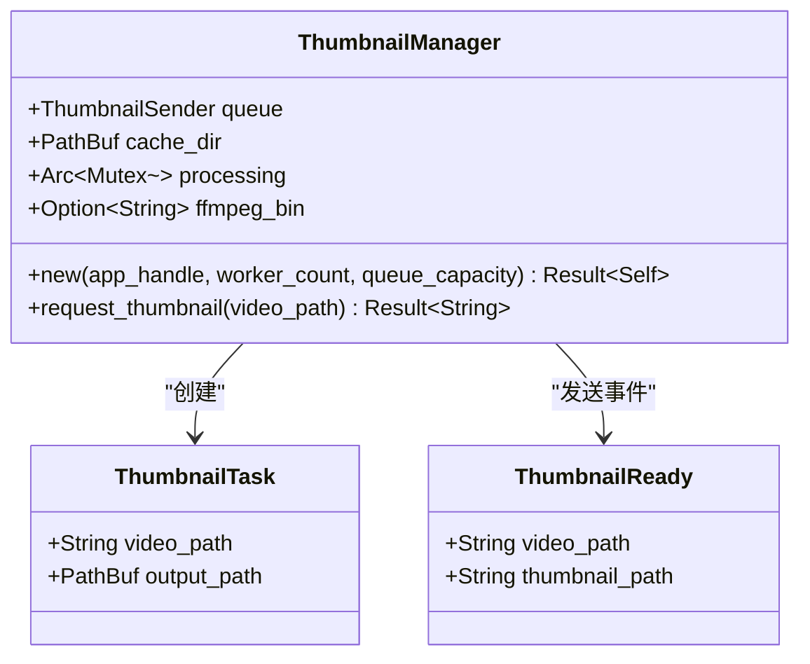
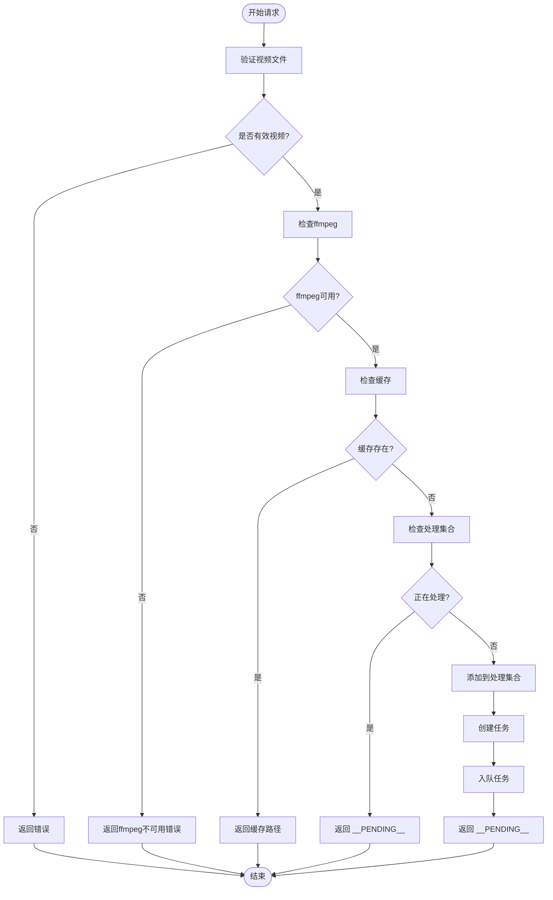
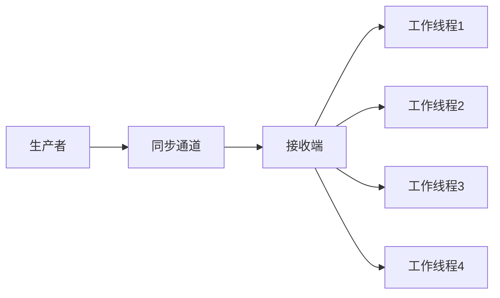
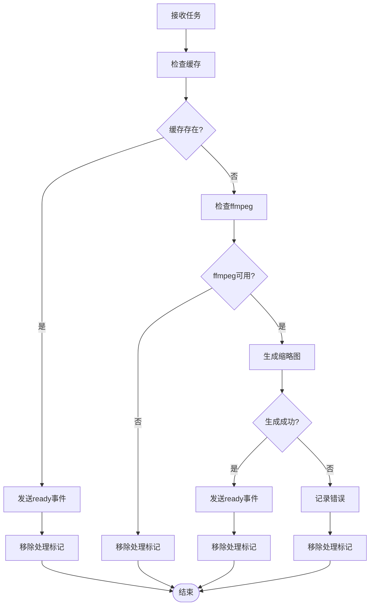
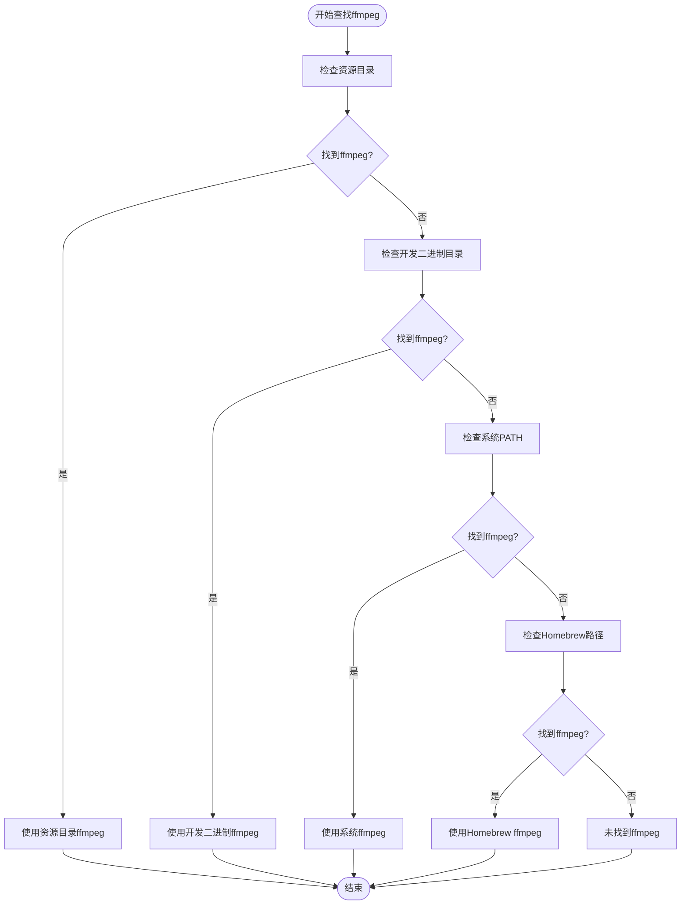
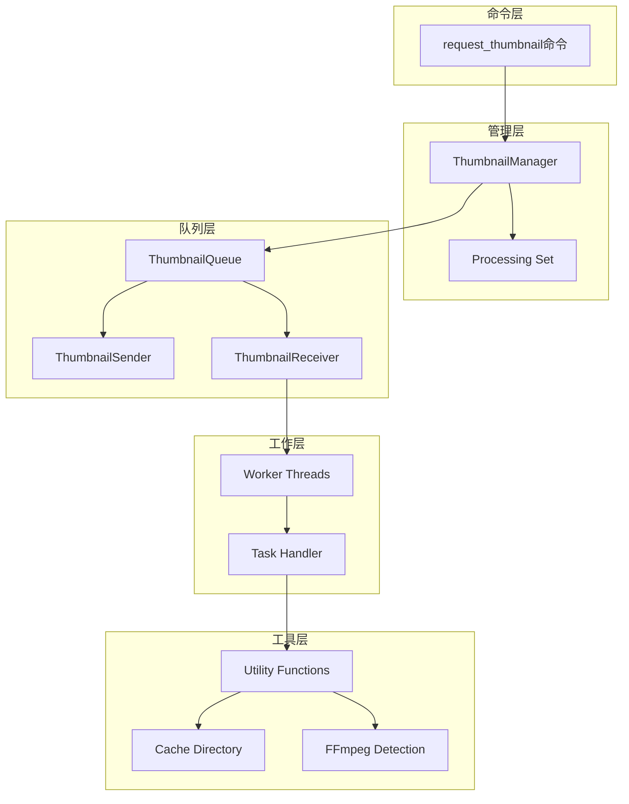

# 缩略图相关命令

<cite>
**本文档引用的文件**
- [src-tauri/src/thumbnail/mod.rs](file://src-tauri/src/thumbnail/mod.rs)
- [src-tauri/src/thumbnail/manager.rs](file://src-tauri/src/thumbnail/manager.rs)
- [src-tauri/src/thumbnail/queue.rs](file://src-tauri/src/thumbnail/queue.rs)
- [src-tauri/src/thumbnail/worker.rs](file://src-tauri/src/thumbnail/worker.rs)
- [src-tauri/src/thumbnail/utils.rs](file://src-tauri/src/thumbnail/utils.rs)
- [src-tauri/src/main.rs](file://src-tauri/src/main.rs)
- [src/containers/MediaGridContainer.tsx](file://src/containers/MediaGridContainer.tsx)
- [src/components/MediaCard.tsx](file://src/components/MediaCard.tsx)
- [API_REFERENCE.md](file://API_REFERENCE.md)
</cite>

## 目录
1. [简介](#简介)
2. [项目结构](#项目结构)
3. [核心组件](#核心组件)
4. [架构概览](#架构概览)
5. [详细组件分析](#详细组件分析)
6. [依赖关系分析](#依赖关系分析)
7. [性能考虑](#性能考虑)
8. [故障排除指南](#故障排除指南)
9. [结论](#结论)
10. [附录](#附录)

## 简介

本文档详细介绍了Medex应用中的缩略图相关命令系统，特别是`request_thumbnail`命令的完整实现和使用方法。该系统实现了高效的视频缩略图生成、缓存管理和事件通知机制，支持并发控制和队列管理，为用户提供流畅的媒体浏览体验。

## 项目结构

缩略图功能主要分布在以下模块中：



**图表来源**
- [src-tauri/src/thumbnail/mod.rs:1-62](file://src-tauri/src/thumbnail/mod.rs#L1-L62)
- [src-tauri/src/main.rs:1-69](file://src-tauri/src/main.rs#L1-L69)
- [src/containers/MediaGridContainer.tsx:1-200](file://src/containers/MediaGridContainer.tsx#L1-L200)

**章节来源**
- [src-tauri/src/thumbnail/mod.rs:1-62](file://src-tauri/src/thumbnail/mod.rs#L1-L62)
- [src-tauri/src/main.rs:1-69](file://src-tauri/src/main.rs#L1-L69)

## 核心组件

### 命令定义

`request_thumbnail`是缩略图系统的核心命令，负责处理缩略图请求并返回相应的状态信息。

**函数签名**: `request_thumbnail(path: String) -> Result<String, String>`

### 返回状态

系统支持三种不同的返回状态：

1. **已缓存路径**: 返回实际的缩略图文件路径
2. **__PENDING__ 标记**: 表示请求已被接受但仍在处理中
3. **错误信息**: 返回具体的错误描述字符串

### 关键常量

- `THUMBNAIL_WORKER_COUNT`: 4个工作线程
- `THUMBNAIL_QUEUE_CAPACITY`: 队列容量2048
- `THUMBNAIL_PLACEHOLDER`: "__PENDING__"占位符

**章节来源**
- [src-tauri/src/thumbnail/mod.rs:14-61](file://src-tauri/src/thumbnail/mod.rs#L14-L61)
- [API_REFERENCE.md:254-280](file://API_REFERENCE.md#L254-L280)

## 架构概览

缩略图系统采用生产者-消费者模式，结合缓存检查和异步处理机制：



**图表来源**
- [src-tauri/src/thumbnail/manager.rs:51-106](file://src-tauri/src/thumbnail/manager.rs#L51-L106)
- [src-tauri/src/thumbnail/worker.rs:52-79](file://src-tauri/src/thumbnail/worker.rs#L52-L79)

## 详细组件分析

### 缩略图管理器

缩略图管理器是整个系统的核心协调者，负责：

#### 主要职责
- 缓存目录管理
- 任务队列协调
- 并发处理控制
- ffmpeg二进制检测

#### 关键数据结构



**图表来源**
- [src-tauri/src/thumbnail/manager.rs:16-21](file://src-tauri/src/thumbnail/manager.rs#L16-L21)
- [src-tauri/src/thumbnail/mod.rs:18-28](file://src-tauri/src/thumbnail/mod.rs#L18-L28)

#### 请求处理流程



**图表来源**
- [src-tauri/src/thumbnail/manager.rs:51-106](file://src-tauri/src/thumbnail/manager.rs#L51-L106)

**章节来源**
- [src-tauri/src/thumbnail/manager.rs:1-108](file://src-tauri/src/thumbnail/manager.rs#L1-L108)

### 任务队列系统

任务队列采用同步通道实现，支持固定容量限制：

#### 队列特性
- **容量限制**: 2048个任务
- **同步传输**: 线程安全的任务传递
- **互斥访问**: 接收端使用互斥锁保护

#### 队列实现



**图表来源**
- [src-tauri/src/thumbnail/queue.rs:8-11](file://src-tauri/src/thumbnail/queue.rs#L8-L11)

**章节来源**
- [src-tauri/src/thumbnail/queue.rs:1-12](file://src-tauri/src/thumbnail/queue.rs#L1-L12)

### 工作线程系统

工作线程系统负责实际的缩略图生成任务：

#### 线程管理
- **线程数量**: 4个工作线程
- **生命周期**: 持续运行直到接收端断开
- **错误处理**: 线程崩溃不影响其他线程

#### 任务处理流程



**图表来源**
- [src-tauri/src/thumbnail/worker.rs:52-79](file://src-tauri/src/thumbnail/worker.rs#L52-L79)

**章节来源**
- [src-tauri/src/thumbnail/worker.rs:1-96](file://src-tauri/src/thumbnail/worker.rs#L1-L96)

### 工具函数系统

工具函数提供了缩略图生成所需的各种辅助功能：

#### 关键功能
- **路径哈希**: 使用默认哈希算法生成唯一文件名
- **缓存目录**: 自动创建和管理缩略图缓存目录
- **ffmpeg检测**: 多种方式查找ffmpeg可执行文件
- **缩略图生成**: 调用ffmpeg生成JPG格式缩略图

#### ffmpeg查找策略



**图表来源**
- [src-tauri/src/thumbnail/utils.rs:71-96](file://src-tauri/src/thumbnail/utils.rs#L71-L96)

**章节来源**
- [src-tauri/src/thumbnail/utils.rs:1-158](file://src-tauri/src/thumbnail/utils.rs#L1-L158)

## 依赖关系分析

缩略图系统的依赖关系清晰明确，遵循单一职责原则：



**图表来源**
- [src-tauri/src/thumbnail/mod.rs:32-61](file://src-tauri/src/thumbnail/mod.rs#L32-L61)
- [src-tauri/src/thumbnail/manager.rs:24-49](file://src-tauri/src/thumbnail/manager.rs#L24-L49)

**章节来源**
- [src-tauri/src/thumbnail/mod.rs:1-62](file://src-tauri/src/thumbnail/mod.rs#L1-L62)

## 性能考虑

### 并发控制

系统采用了多层次的并发控制机制：

#### 前端并发控制
- **最大并发数**: 5个同时进行的缩略图请求
- **队列大小**: 最大400个待处理任务
- **优先级调度**: 可见区域 > 下一屏 > 其他区域

#### 后端并发控制
- **工作线程**: 4个并发工作线程
- **队列容量**: 2048个任务
- **去重机制**: 使用HashSet避免重复处理相同视频

### 缓存策略

- **文件系统缓存**: 使用哈希命名确保唯一性
- **内存缓存**: 前端React状态管理
- **懒加载**: 使用React.lazy和Suspense优化性能

### 性能优化措施

1. **预取策略**: 对可见区域和下一屏进行预取
2. **去重处理**: 避免对同一视频的重复请求
3. **错误恢复**: 失败的任务会被重新尝试
4. **资源清理**: 及时释放不再需要的处理标记

**章节来源**
- [src/containers/MediaGridContainer.tsx:27-28](file://src/containers/MediaGridContainer.tsx#L27-L28)
- [API_REFERENCE.md:469-482](file://API_REFERENCE.md#L469-L482)

## 故障排除指南

### 常见问题及解决方案

#### ffmpeg未找到
**症状**: 缩略图生成失败，返回ffmpeg不可用错误
**解决方案**: 
1. 确保ffmpeg正确安装
2. 检查ffmpeg路径配置
3. 使用打包的ffmpeg二进制文件

#### 队列满载
**症状**: 大量缩略图请求返回__PENDING__状态
**解决方案**:
1. 增加队列容量
2. 减少同时进行的缩略图请求
3. 优化前端调度逻辑

#### 缓存问题
**症状**: 缩略图无法正常显示
**解决方案**:
1. 清理缓存目录
2. 检查磁盘空间
3. 验证文件权限

### 调试技巧

1. **启用日志**: 查看控制台输出的详细信息
2. **监控队列**: 使用任务统计信息
3. **性能分析**: 监控CPU和内存使用情况

**章节来源**
- [src-tauri/src/thumbnail/utils.rs:71-96](file://src-tauri/src/thumbnail/utils.rs#L71-L96)
- [src-tauri/src/thumbnail/manager.rs:83-102](file://src-tauri/src/thumbnail/manager.rs#L83-L102)

## 结论

Medex的缩略图系统通过精心设计的架构实现了高效、可靠的视频缩略图生成功能。系统采用生产者-消费者模式，结合缓存检查、并发控制和事件通知机制，为用户提供了流畅的媒体浏览体验。

关键优势包括：
- **高并发处理**: 支持多线程并行生成
- **智能缓存**: 避免重复计算
- **优雅降级**: 在资源不足时提供占位符
- **事件驱动**: 实时更新UI状态

该系统为类似的应用程序提供了优秀的缩略图处理参考实现。

## 附录

### 完整使用示例

#### 前端实现示例

```typescript
// 请求缩略图
const result = await invoke<string>('request_thumbnail', { path: videoPath });

// 处理不同返回状态
if (result === '__PENDING__') {
  // 等待thumbnail_ready事件
  const unlisten = await listen<ThumbnailReadyPayload>('thumbnail_ready', (event) => {
    // 更新缩略图缓存
    setThumbnails(prev => ({
      ...prev,
      [event.payload.video_path]: convertFileSrc(event.payload.thumbnail_path)
    }));
  });
} else if (result && result !== '__PENDING__') {
  // 直接使用返回的路径
  setThumbnails(prev => ({
    ...prev,
    [videoPath]: convertFileSrc(result)
  }));
}

// 监听缩略图生成完成事件
const unlisten = await listen<ThumbnailReadyPayload>('thumbnail_ready', (event) => {
  setThumbnails(prev => ({
    ...prev,
    [event.payload.video_path]: convertFileSrc(event.payload.thumbnail_path)
  }));
});
```

#### 后端命令注册

```rust
// 在main.rs中注册命令
.invoke_handler(tauri::generate_handler![
    // ... 其他命令
    thumbnail::request_thumbnail
])
```

**章节来源**
- [API_REFERENCE.md:421-437](file://API_REFERENCE.md#L421-L437)
- [src-tauri/src/main.rs:49-65](file://src-tauri/src/main.rs#L49-L65)