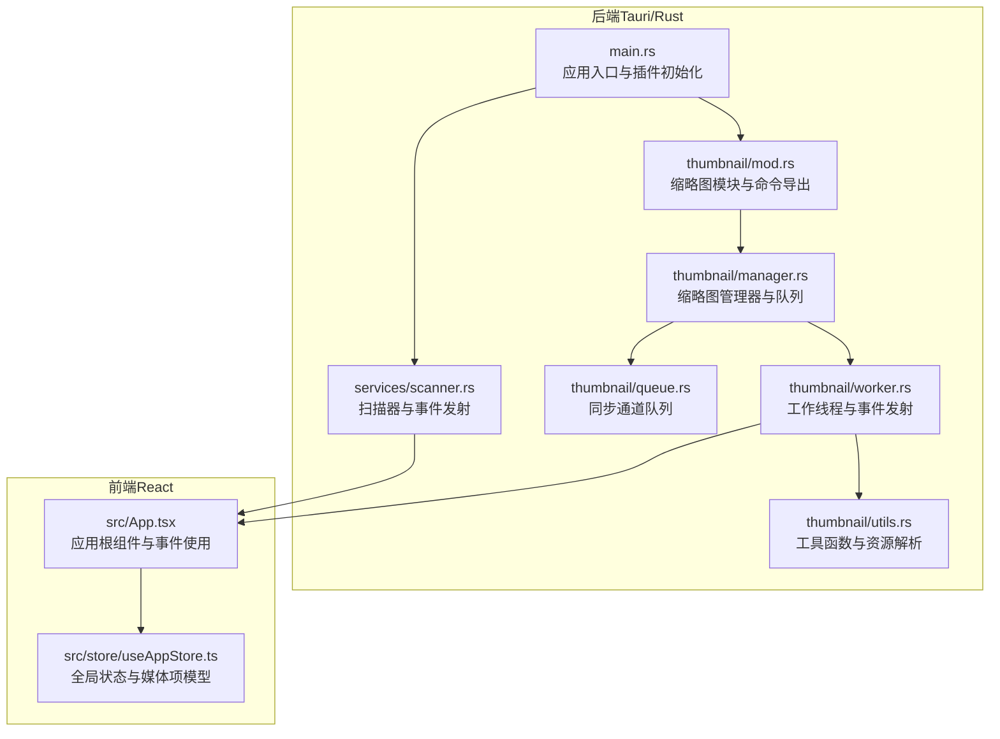
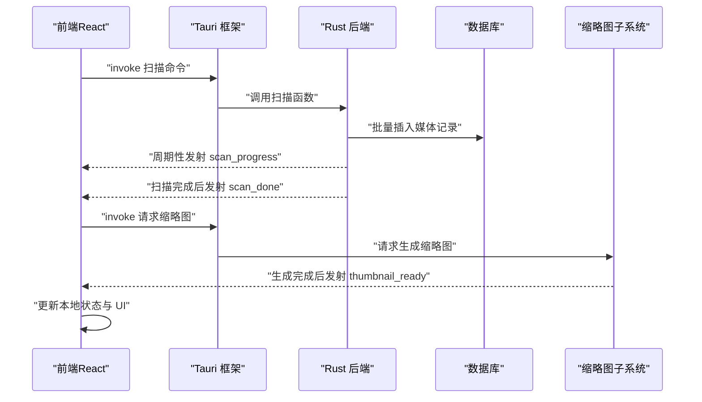
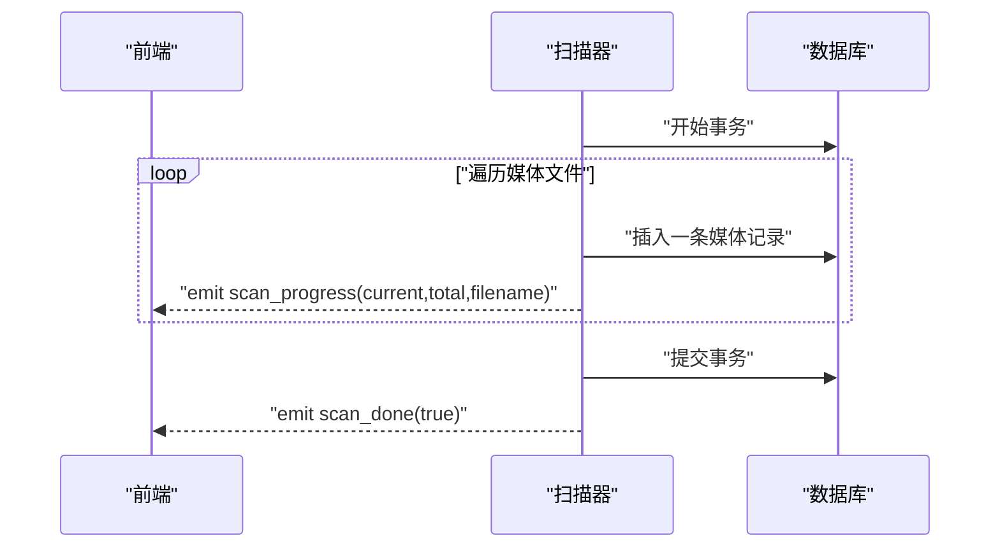
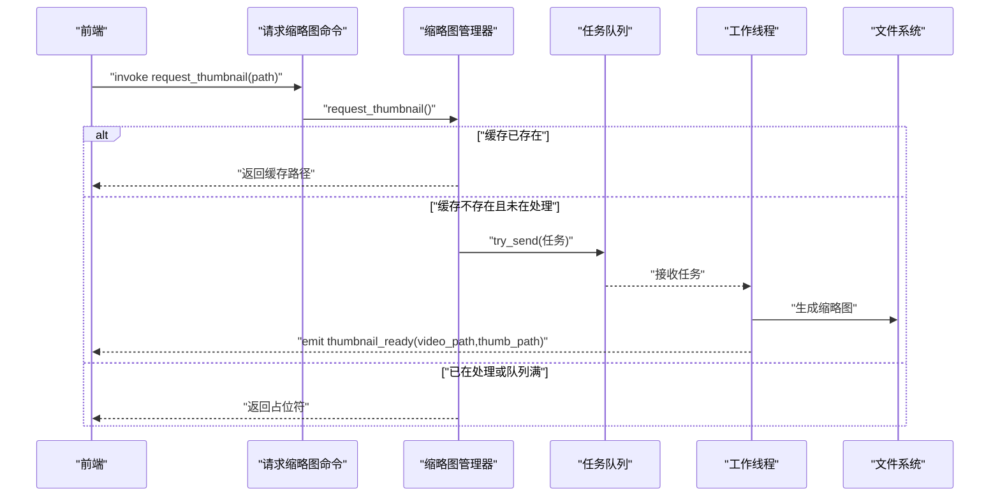
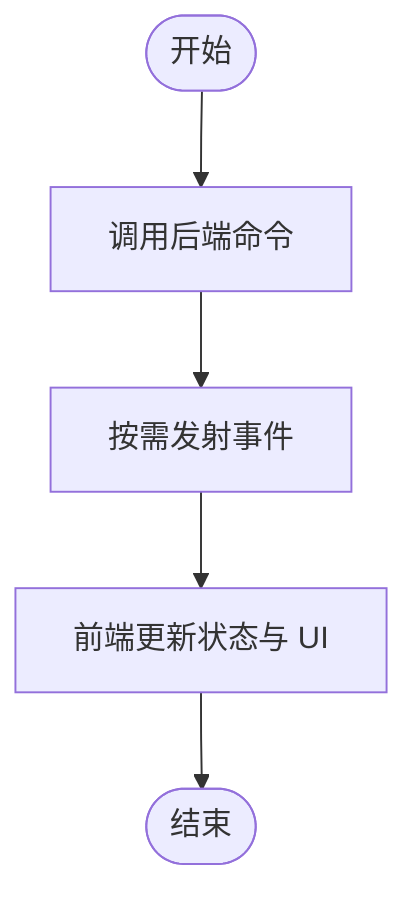
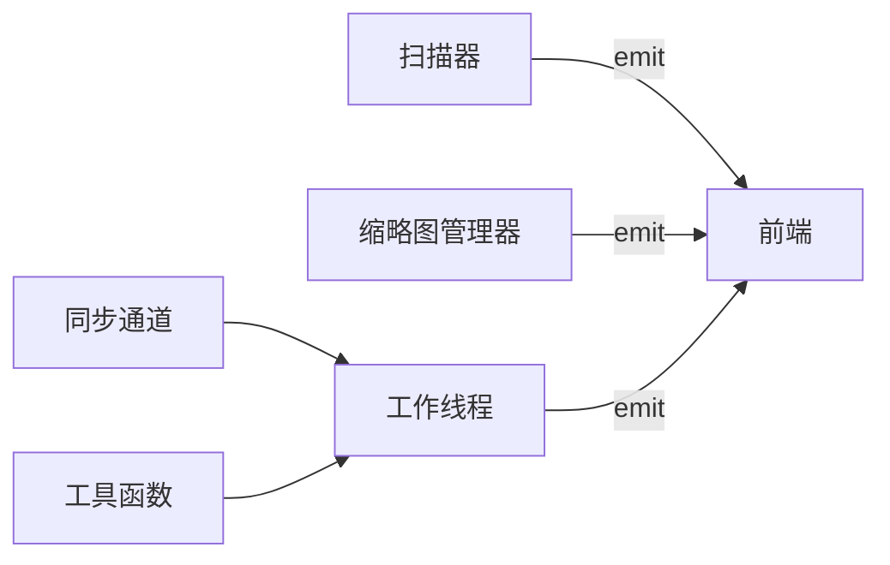

# 事件系统

<cite>
**本文引用的文件**
- [src-tauri/src/main.rs](file://src-tauri/src/main.rs)
- [src-tauri/src/services/scanner.rs](file://src-tauri/src/services/scanner.rs)
- [src-tauri/src/thumbnail/mod.rs](file://src-tauri/src/thumbnail/mod.rs)
- [src-tauri/src/thumbnail/manager.rs](file://src-tauri/src/thumbnail/manager.rs)
- [src-tauri/src/thumbnail/queue.rs](file://src-tauri/src/thumbnail/queue.rs)
- [src-tauri/src/thumbnail/worker.rs](file://src-tauri/src/thumbnail/worker.rs)
- [src-tauri/src/thumbnail/utils.rs](file://src-tauri/src/thumbnail/utils.rs)
- [src/App.tsx](file://src/App.tsx)
- [src/store/useAppStore.ts](file://src/store/useAppStore.ts)
</cite>

## 目录
1. [简介](#简介)
2. [项目结构](#项目结构)
3. [核心组件](#核心组件)
4. [架构总览](#架构总览)
5. [详细组件分析](#详细组件分析)
6. [依赖分析](#依赖分析)
7. [性能考虑](#性能考虑)
8. [故障排除指南](#故障排除指南)
9. [结论](#结论)
10. [附录](#附录)

## 简介
本文件系统性梳理 Medex 应用的事件系统，重点覆盖 Rust 向前端发出的事件，包括扫描进度事件（scan_progress）、扫描完成事件（scan_done）、缩略图生成完成事件（thumbnail_ready）。文档从事件结构定义、触发时机、监听方式与处理流程入手，解释事件生命周期管理、事件队列机制与事件处理最佳实践；同时说明事件系统与命令系统的协作关系及数据流转过程，并提供可操作的监听示例与错误处理策略。

## 项目结构
事件系统由后端（Rust/Tauri）与前端（React）协同构成：
- 后端负责事件的产生与分发：扫描器在扫描过程中周期性发出 scan_progress，完成后发出 scan_done；缩略图子系统在任务完成后发出 thumbnail_ready。
- 前端负责事件的订阅与状态更新：通过 @tauri-apps/api 的 invoke 与事件监听机制接收后端事件，更新本地状态与 UI。

图表来源
- [src-tauri/src/main.rs:10-68](file://src-tauri/src/main.rs#L10-L68)
- [src-tauri/src/services/scanner.rs:250-341](file://src-tauri/src/services/scanner.rs#L250-L341)
- [src-tauri/src/thumbnail/mod.rs:32-61](file://src-tauri/src/thumbnail/mod.rs#L32-L61)
- [src-tauri/src/thumbnail/manager.rs:24-49](file://src-tauri/src/thumbnail/manager.rs#L24-L49)
- [src-tauri/src/thumbnail/queue.rs:8-11](file://src-tauri/src/thumbnail/queue.rs#L8-L11)
- [src-tauri/src/thumbnail/worker.rs:13-49](file://src-tauri/src/thumbnail/worker.rs#L13-L49)
- [src-tauri/src/thumbnail/utils.rs:20-29](file://src-tauri/src/thumbnail/utils.rs#L20-L29)
- [src/App.tsx:1-73](file://src/App.tsx#L1-L73)
- [src/store/useAppStore.ts:16-46](file://src/store/useAppStore.ts#L16-L46)

章节来源
- [src-tauri/src/main.rs:10-68](file://src-tauri/src/main.rs#L10-L68)
- [src/App.tsx:1-73](file://src/App.tsx#L1-L73)

## 核心组件
- 扫描器事件
  - scan_progress：扫描过程中每插入一条媒体记录即发射一次，携带当前索引、总数与当前文件名。
  - scan_done：扫描完成后发射一次，携带布尔值表示成功。
- 缩略图事件
  - thumbnail_ready：视频缩略图生成完成后发射一次，携带源视频路径与生成的缩略图文件路径。
- 事件发射点
  - 扫描器在事务提交前逐条插入并发射 scan_progress，在最后发射 scan_done。
  - 缩略图工作线程在任务完成或跳过后发射 thumbnail_ready。
- 前端监听与处理
  - 前端通过 @tauri-apps/api 的 invoke 调用后端命令，同时在需要时订阅后端事件以更新 UI。

章节来源
- [src-tauri/src/services/scanner.rs:33-38](file://src-tauri/src/services/scanner.rs#L33-L38)
- [src-tauri/src/services/scanner.rs:306-329](file://src-tauri/src/services/scanner.rs#L306-L329)
- [src-tauri/src/thumbnail/worker.rs:81-89](file://src-tauri/src/thumbnail/worker.rs#L81-L89)

## 架构总览
事件系统采用“命令驱动 + 事件推送”的模式：
- 前端通过 invoke 触发后端命令（如扫描、请求缩略图），后端执行业务逻辑并在合适时机发射事件。
- 事件通过 Tauri 的 Emitter 接口向前端广播，前端订阅并更新状态，最终渲染到 UI。

图表来源
- [src-tauri/src/services/scanner.rs:250-341](file://src-tauri/src/services/scanner.rs#L250-L341)
- [src-tauri/src/thumbnail/worker.rs:81-89](file://src-tauri/src/thumbnail/worker.rs#L81-L89)
- [src/App.tsx:35-41](file://src/App.tsx#L35-L41)

## 详细组件分析

### 扫描进度与完成事件（scan_progress / scan_done）
- 事件结构
  - scan_progress：包含 current（当前索引）、total（总数）、filename（当前文件名）。
  - scan_done：布尔值，表示扫描是否成功。
- 触发时机
  - 在扫描目录阶段，逐条插入媒体记录时发射 scan_progress；全部完成后发射 scan_done。
- 监听方式与处理流程
  - 前端可在页面加载或开始扫描时注册事件监听器，收到 scan_progress 更新进度条，收到 scan_done 后停止进度并刷新媒体列表。
- 生命周期管理
  - 事件在扫描事务期间持续发射，事务结束后结束。
- 队列与并发
  - 该事件序列由单线程扫描流程产生，无需额外队列。
- 最佳实践
  - 前端应避免在每次事件回调中进行昂贵操作，建议节流或合并状态更新。
  - 对于大量媒体的扫描，建议在 UI 上显示预估剩余时间而非仅百分比。

图表来源
- [src-tauri/src/services/scanner.rs:299-329](file://src-tauri/src/services/scanner.rs#L299-L329)

章节来源
- [src-tauri/src/services/scanner.rs:33-38](file://src-tauri/src/services/scanner.rs#L33-L38)
- [src-tauri/src/services/scanner.rs:250-341](file://src-tauri/src/services/scanner.rs#L250-L341)

### 缩略图生成完成事件（thumbnail_ready）
- 事件结构
  - thumbnail_ready：包含 video_path（源视频路径）与 thumbnail_path（生成的缩略图文件路径）。
- 触发时机
  - 工作线程在任务完成或跳过（如 ffmpeg 不可用）后发射事件。
- 监听方式与处理流程
  - 前端在需要展示视频缩略图时先请求生成，收到 thumbnail_ready 后更新对应媒体项的缩略图路径。
- 生命周期管理
  - 事件与任务生命周期一致，任务完成后即发射事件并移除处理标记。
- 队列机制
  - 使用同步通道（SyncSender）承载任务，支持容量限制与丢弃策略；工作线程循环从通道接收任务并处理。
- 最佳实践
  - 前端在请求缩略图时返回占位符，收到事件后再替换为真实缩略图路径。
  - 对于队列满的情况，前端应避免频繁重复请求同一视频。

图表来源
- [src-tauri/src/thumbnail/mod.rs:57-61](file://src-tauri/src/thumbnail/mod.rs#L57-L61)
- [src-tauri/src/thumbnail/manager.rs:51-106](file://src-tauri/src/thumbnail/manager.rs#L51-L106)
- [src-tauri/src/thumbnail/queue.rs:8-11](file://src-tauri/src/thumbnail/queue.rs#L8-L11)
- [src-tauri/src/thumbnail/worker.rs:26-79](file://src-tauri/src/thumbnail/worker.rs#L26-L79)

章节来源
- [src-tauri/src/thumbnail/mod.rs:18-28](file://src-tauri/src/thumbnail/mod.rs#L18-L28)
- [src-tauri/src/thumbnail/manager.rs:51-106](file://src-tauri/src/thumbnail/manager.rs#L51-L106)
- [src-tauri/src/thumbnail/worker.rs:81-89](file://src-tauri/src/thumbnail/worker.rs#L81-L89)

### 事件与命令的协作关系
- 命令（invoke）用于触发后端动作（如扫描、请求缩略图），事件（emit）用于异步通知前端状态变化。
- 典型协作流程
  - 前端调用命令启动扫描，后端在扫描过程中发射 scan_progress，完成后发射 scan_done。
  - 前端调用命令请求缩略图，后端将任务入队，工作线程完成后发射 thumbnail_ready。

图表来源
- [src-tauri/src/services/scanner.rs:250-341](file://src-tauri/src/services/scanner.rs#L250-L341)
- [src-tauri/src/thumbnail/worker.rs:81-89](file://src-tauri/src/thumbnail/worker.rs#L81-L89)

章节来源
- [src-tauri/src/main.rs:49-65](file://src-tauri/src/main.rs#L49-L65)
- [src/App.tsx:35-41](file://src/App.tsx#L35-L41)

## 依赖分析
- 组件耦合
  - 扫描器依赖数据库事务与 AppHandle 以发射事件。
  - 缩略图管理器依赖同步通道与工作线程池，工作线程依赖 AppHandle 发射事件。
- 外部依赖
  - Tauri 的 Emitter、Manager、AppHandle 提供事件与资源访问能力。
  - ffmpeg 可执行文件用于视频缩略图生成，若不可用则禁用该功能。
- 潜在循环依赖
  - 当前模块间无循环依赖，职责清晰：扫描器负责扫描与事件，缩略图子系统负责生成与事件。

图表来源
- [src-tauri/src/services/scanner.rs:306-329](file://src-tauri/src/services/scanner.rs#L306-L329)
- [src-tauri/src/thumbnail/manager.rs:33-41](file://src-tauri/src/thumbnail/manager.rs#L33-L41)
- [src-tauri/src/thumbnail/worker.rs:13-49](file://src-tauri/src/thumbnail/worker.rs#L13-L49)
- [src-tauri/src/thumbnail/queue.rs:8-11](file://src-tauri/src/thumbnail/queue.rs#L8-L11)
- [src-tauri/src/thumbnail/utils.rs:71-96](file://src-tauri/src/thumbnail/utils.rs#L71-L96)

章节来源
- [src-tauri/src/thumbnail/utils.rs:71-96](file://src-tauri/src/thumbnail/utils.rs#L71-L96)

## 性能考虑
- 扫描事件频率
  - 对于大量媒体文件，scan_progress 发射频率较高，前端应避免在回调中执行昂贵操作，建议节流或批量更新。
- 缩略图队列容量
  - 队列容量固定，满载时会丢弃新任务并返回占位符，前端应避免重复请求同一视频。
- ffmpeg 可用性
  - 若 ffmpeg 不可用，缩略图生成被禁用，前端应提供降级提示或默认占位图。
- 数据库事务
  - 扫描使用事务批量插入，减少磁盘写入次数，提升吞吐量。

## 故障排除指南
- 事件未到达前端
  - 检查后端是否正确调用 emit，确认事件名称拼写与类型匹配。
  - 确认前端已注册对应事件监听器。
- 缩略图未生成
  - 检查 ffmpeg 是否可用与路径解析是否正确。
  - 查看工作线程日志输出，确认任务是否入队与处理。
- 扫描进度异常
  - 检查事务是否正常提交，确保每条插入后都发射 scan_progress。
  - 确认 total 计算与 current 自增逻辑正确。
- 错误处理策略
  - 后端在 emit 失败时打印错误日志，前端应在监听回调中捕获异常并降级处理。
  - 对于队列满或断开情况，返回占位符并在后续事件中替换为真实路径。

章节来源
- [src-tauri/src/thumbnail/manager.rs:83-103](file://src-tauri/src/thumbnail/manager.rs#L83-L103)
- [src-tauri/src/thumbnail/worker.rs:86-88](file://src-tauri/src/thumbnail/worker.rs#L86-L88)

## 结论
Medex 的事件系统以命令驱动与事件推送为核心，扫描器与缩略图子系统分别在各自生命周期内向前端发送 scan_progress、scan_done 与 thumbnail_ready 事件。通过同步通道与工作线程池实现高吞吐的缩略图生成，前端通过 @tauri-apps/api 的 invoke 与事件监听机制实现响应式 UI 更新。遵循本文的最佳实践与故障排除策略，可获得稳定、高效的事件交互体验。

## 附录
- 事件清单与结构
  - scan_progress：current（当前索引）、total（总数）、filename（当前文件名）
  - scan_done：true（表示成功）
  - thumbnail_ready：video_path（源视频路径）、thumbnail_path（缩略图文件路径）
- 前端监听与处理示例（路径）
  - 注册事件监听与状态更新：[src/App.tsx:1-73](file://src/App.tsx#L1-L73)
  - 全局状态模型与媒体项字段：[src/store/useAppStore.ts:16-46](file://src/store/useAppStore.ts#L16-L46)
- 后端事件发射点（路径）
  - 扫描进度与完成事件：[src-tauri/src/services/scanner.rs:306-329](file://src-tauri/src/services/scanner.rs#L306-L329)
  - 缩略图生成完成事件：[src-tauri/src/thumbnail/worker.rs:81-89](file://src-tauri/src/thumbnail/worker.rs#L81-L89)