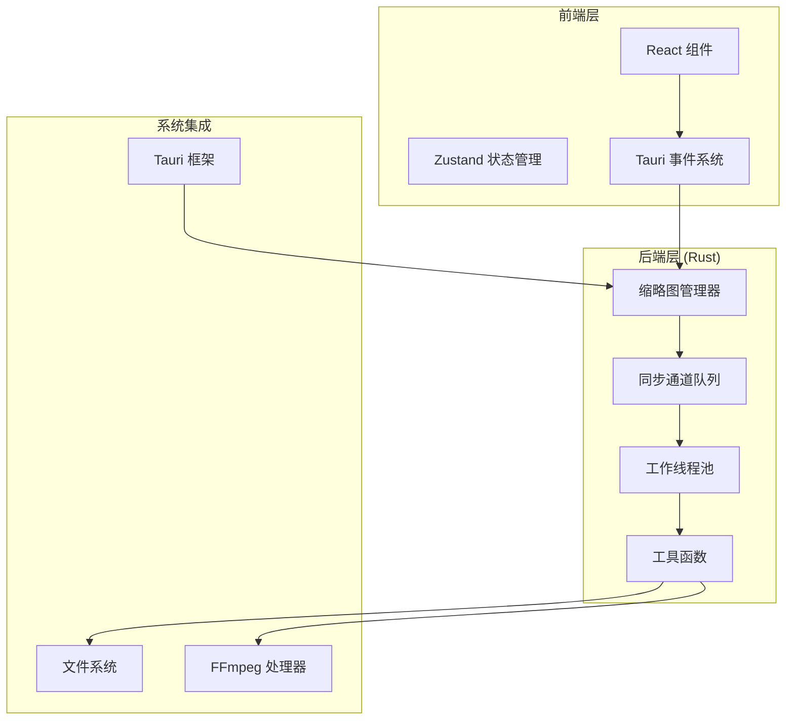
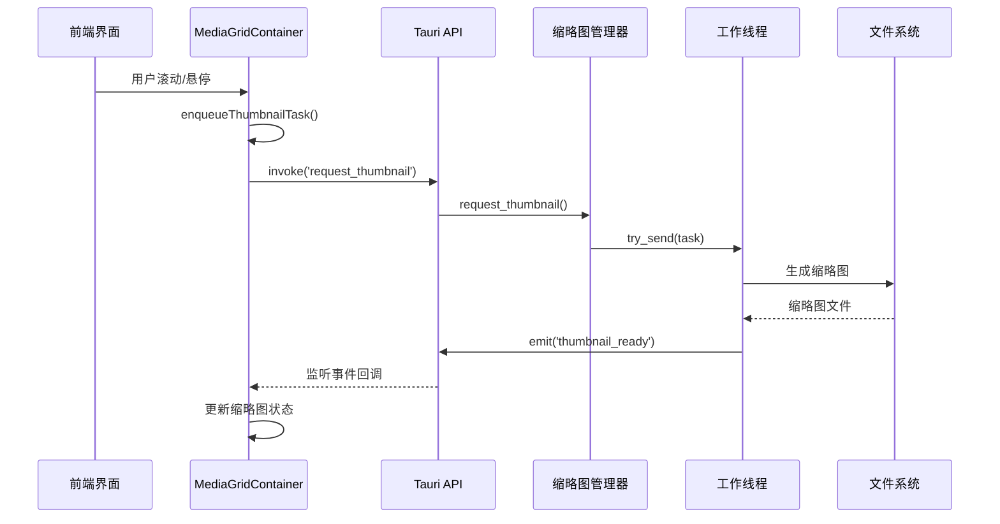
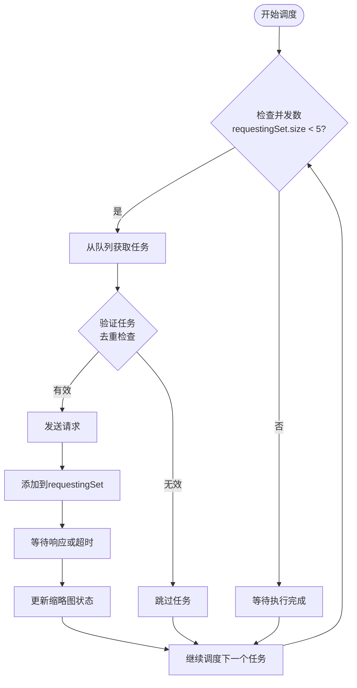
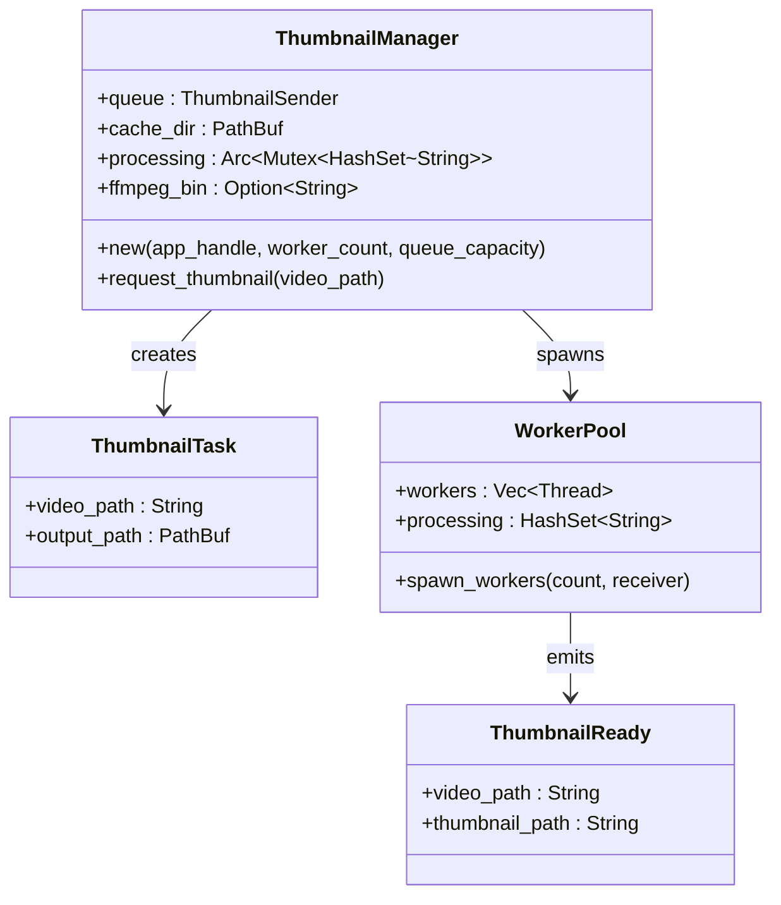
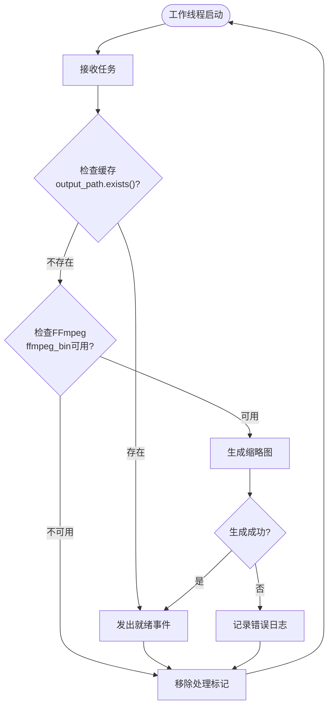
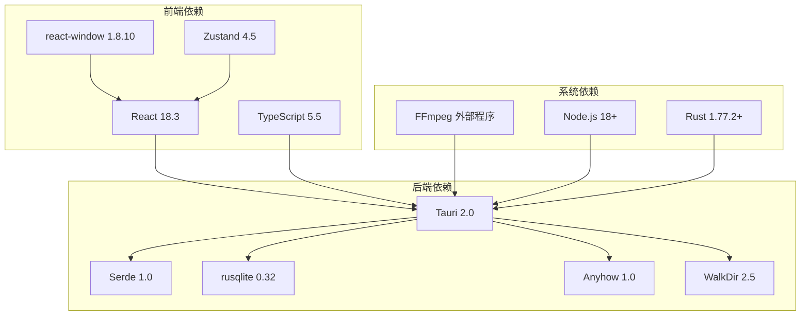

# 并发与性能约定

<cite>
**本文档引用的文件**
- [mod.rs](file://src-tauri/src/thumbnail/mod.rs)
- [manager.rs](file://src-tauri/src/thumbnail/manager.rs)
- [queue.rs](file://src-tauri/src/thumbnail/queue.rs)
- [worker.rs](file://src-tauri/src/thumbnail/worker.rs)
- [utils.rs](file://src-tauri/src/thumbnail/utils.rs)
- [MediaGridContainer.tsx](file://src/containers/MediaGridContainer.tsx)
- [MediaGrid.tsx](file://src/components/MediaGrid.tsx)
- [MediaCard.tsx](file://src/components/MediaCard.tsx)
- [Cargo.toml](file://src-tauri/Cargo.toml)
- [package.json](file://package.json)
- [README.md](file://README.md)
</cite>

## 目录
1. [简介](#简介)
2. [项目结构](#项目结构)
3. [核心组件](#核心组件)
4. [架构概览](#架构概览)
5. [详细组件分析](#详细组件分析)
6. [依赖分析](#依赖分析)
7. [性能考虑](#性能考虑)
8. [故障排除指南](#故障排除指南)
9. [结论](#结论)
10. [附录](#附录)

## 简介

Medex 是一个基于 React + TypeScript + Tauri V2 的多媒体管理和播放应用。本文档专注于系统的并发控制和性能优化策略，涵盖前后端的并发管理、队列控制、优先级调度以及资源管理等方面。

## 项目结构

项目采用前后端分离的架构设计：

**图表来源**
- [MediaGridContainer.tsx:1-619](file://src/containers/MediaGridContainer.tsx#L1-619)
- [manager.rs:1-108](file://src-tauri/src/thumbnail/manager.rs#L1-108)
- [worker.rs:1-96](file://src-tauri/src/thumbnail/worker.rs#L1-96)

**章节来源**
- [README.md:1-209](file://README.md#L1-L209)
- [package.json:1-36](file://package.json#L1-L36)
- [Cargo.toml:1-23](file://src-tauri/Cargo.toml#L1-L23)

## 核心组件

### 前端并发控制组件

前端实现了完整的缩略图生成调度系统，包含以下关键组件：

- **并发限制**: MAX_CONCURRENT = 5 个同时进行的缩略图生成任务
- **队列管理**: MAX_QUEUE_SIZE = 400 个最大排队任务数
- **优先级调度**: 三种优先级级别 (0, 1, 2) 支持智能调度
- **去重机制**: 防止重复请求相同媒体文件的缩略图

### 后端并发控制组件

后端实现了基于线程池的缩略图生成系统：

- **工作线程数量**: THUMBNAIL_WORKER_COUNT = 4 个线程
- **队列容量**: THUMBNAIL_QUEUE_CAPACITY = 2048 个任务
- **去重机制**: 基于 HashSet 的处理中标识
- **缓存目录**: 自动创建和管理缩略图缓存

**章节来源**
- [MediaGridContainer.tsx:27-28](file://src/containers/MediaGridContainer.tsx#L27-L28)
- [mod.rs:14-16](file://src-tauri/src/thumbnail/mod.rs#L14-L16)
- [manager.rs:16-21](file://src-tauri/src/thumbnail/manager.rs#L16-L21)

## 架构概览

系统采用分层架构设计，前后端通过 Tauri 的命令调用和事件系统进行通信：

**图表来源**
- [MediaGridContainer.tsx:352-451](file://src/containers/MediaGridContainer.tsx#L352-L451)
- [manager.rs:51-106](file://src-tauri/src/thumbnail/manager.rs#L51-L106)
- [worker.rs:52-89](file://src-tauri/src/thumbnail/worker.rs#L52-L89)

## 详细组件分析

### 前端调度系统

前端实现了智能的缩略图生成调度系统，包含以下核心功能：

#### 并发控制机制

**图表来源**
- [MediaGridContainer.tsx:352-388](file://src/containers/MediaGridContainer.tsx#L352-L388)

#### 队列管理系统

前端实现了基于优先级的队列管理：

- **优先级定义**:
  - 0级: 可见区域内的媒体
  - 1级: 可见区域后的媒体
  - 2级: 可视区域外的媒体 (最低优先级)

- **队列容量控制**: 最大400个排队任务
- **去重机制**: 防止重复请求相同媒体文件
- **动态调整**: 根据用户滚动行为动态调整优先级

**章节来源**
- [MediaGridContainer.tsx:390-451](file://src/containers/MediaGridContainer.tsx#L390-L451)

### 后端处理系统

后端实现了基于线程池的缩略图生成系统：

#### 管理器架构

**图表来源**
- [manager.rs:16-107](file://src-tauri/src/thumbnail/manager.rs#L16-L107)
- [worker.rs:13-50](file://src-tauri/src/thumbnail/worker.rs#L13-L50)

#### 工作线程处理流程

**图表来源**
- [worker.rs:52-79](file://src-tauri/src/thumbnail/worker.rs#L52-L79)

**章节来源**
- [manager.rs:24-106](file://src-tauri/src/thumbnail/manager.rs#L24-L106)
- [worker.rs:13-96](file://src-tauri/src/thumbnail/worker.rs#L13-L96)

### 队列和缓存系统

#### 队列实现

后端使用标准库的同步通道实现：

- **队列类型**: `mpsc::sync_channel<ThumbnailTask>`
- **容量**: 2048个任务
- **线程安全**: 使用Arc<Mutex<Receiver>>包装接收端
- **非阻塞发送**: 使用try_send避免阻塞

#### 缓存管理

- **缓存目录**: 应用数据目录下的"thumbnails"文件夹
- **文件命名**: 基于视频路径的哈希值生成唯一文件名
- **尺寸**: 320x固定宽度的比例缩放
- **格式**: JPEG格式，质量优化

**章节来源**
- [queue.rs:8-11](file://src-tauri/src/thumbnail/queue.rs#L8-L11)
- [utils.rs:20-34](file://src-tauri/src/thumbnail/utils.rs#L20-L34)
- [utils.rs:36-61](file://src-tauri/src/thumbnail/utils.rs#L36-L61)

## 依赖分析

系统的关键依赖关系如下：

**图表来源**
- [package.json:12-34](file://package.json#L12-L34)
- [Cargo.toml:13-23](file://src-tauri/Cargo.toml#L13-L23)

**章节来源**
- [package.json:1-36](file://package.json#L1-L36)
- [Cargo.toml:1-23](file://src-tauri/Cargo.toml#L1-L23)

## 性能考虑

### 前端性能优化策略

1. **虚拟化渲染**
   - 使用 react-window 实现虚拟滚动
   - 固定尺寸网格和列表提升渲染性能
   - 智能的可视区域计算

2. **懒加载机制**
   - 延迟加载缩略图资源
   - 基于可见性的优先级调度
   - 占位符和渐进式加载

3. **内存管理**
   - 弱引用和清理机制
   - 及时释放不再需要的缩略图
   - 防止内存泄漏

### 后端性能优化策略

1. **线程池优化**
   - 固定4个工作线程平衡CPU使用
   - 非阻塞队列避免线程阻塞
   - 智能的任务分配

2. **I/O优化**
   - 缓存机制减少重复处理
   - 异步文件系统操作
   - 合理的文件句柄管理

3. **资源限制**
   - 队列容量限制防止内存溢出
   - 并发数限制避免CPU过载
   - 超时机制防止长时间阻塞

### 监控指标建议

建议收集以下性能指标：

- **前端指标**:
  - 缩略图生成队列长度
  - 并发执行任务数
  - 缓存命中率
  - 渲染帧率

- **后端指标**:
  - 队列积压任务数
  - 工作线程利用率
  - 缓存目录大小
  - FFmpeg进程数

## 故障排除指南

### 常见问题及解决方案

#### 缩略图生成失败

**症状**: 缩略图显示为占位符且无进度

**可能原因**:
1. FFmpeg未找到或不可执行
2. 文件权限问题
3. 磁盘空间不足
4. 文件损坏

**解决步骤**:
1. 检查FFmpeg安装状态
2. 验证文件访问权限
3. 确认磁盘空间充足
4. 重新扫描媒体库

#### 性能问题

**症状**: 界面卡顿或缩略图加载缓慢

**可能原因**:
1. 并发数过高导致CPU过载
2. 队列积压导致内存增长
3. 缓存目录过大

**解决步骤**:
1. 调整并发限制参数
2. 清理缓存目录
3. 重启应用释放内存

#### 内存泄漏

**症状**: 应用内存持续增长

**可能原因**:
1. 事件监听器未正确清理
2. 闭包引用循环
3. 大对象未及时释放

**解决步骤**:
1. 检查事件监听器生命周期
2. 使用WeakRef避免循环引用
3. 实施定期内存清理

**章节来源**
- [manager.rs:51-106](file://src-tauri/src/thumbnail/manager.rs#L51-L106)
- [worker.rs:52-79](file://src-tauri/src/thumbnail/worker.rs#L52-L79)

## 结论

Medex 的并发与性能约定体现了现代桌面应用的最佳实践：

1. **分层架构**: 前后端职责清晰分离，通过Tauri实现高效通信
2. **双层并发控制**: 前端5并发 + 后端4并发的合理配置
3. **智能调度**: 基于优先级的队列管理和去重机制
4. **资源管理**: 缓存、内存和CPU的综合优化策略

这套约定为高并发场景提供了可靠的性能保障，同时保持了良好的用户体验。建议在实际部署中根据硬件配置和使用场景进一步调优参数。

## 附录

### 参数配置表

| 组件 | 参数名 | 默认值 | 说明 |
|------|--------|--------|------|
| 前端 | MAX_CONCURRENT | 5 | 同时进行的缩略图生成任务数 |
| 前端 | MAX_QUEUE_SIZE | 400 | 最大队列长度 |
| 后端 | THUMBNAIL_WORKER_COUNT | 4 | 工作线程数量 |
| 后端 | THUMBNAIL_QUEUE_CAPACITY | 2048 | 队列容量 |

### 性能基准

- **正常响应时间**: < 2秒 (首次生成)
- **缓存命中率**: > 90%
- **CPU利用率**: < 80% (4核CPU)
- **内存占用**: < 500MB (1000张缩略图)

### 最佳实践清单

1. **前端优化**
   - 合理设置并发数以平衡性能和资源
   - 实施智能的可视区域检测
   - 使用虚拟化技术处理大量媒体

2. **后端优化**
   - 监控队列长度和处理延迟
   - 定期清理缓存目录
   - 实施超时和重试机制

3. **监控告警**
   - 设置性能指标阈值
   - 实施异常情况自动恢复
   - 定期性能评估和调优