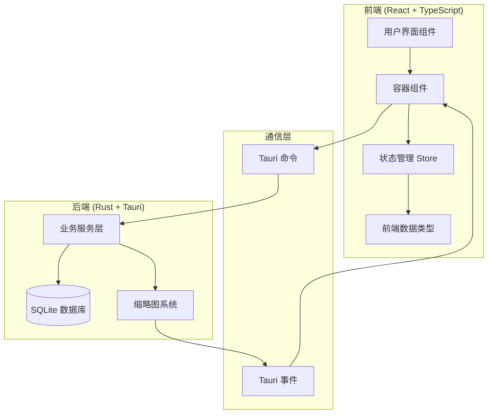
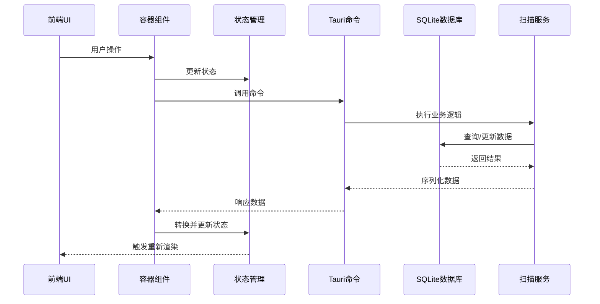
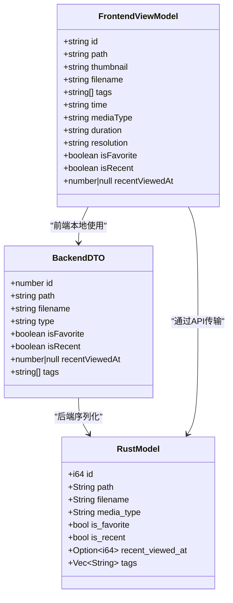
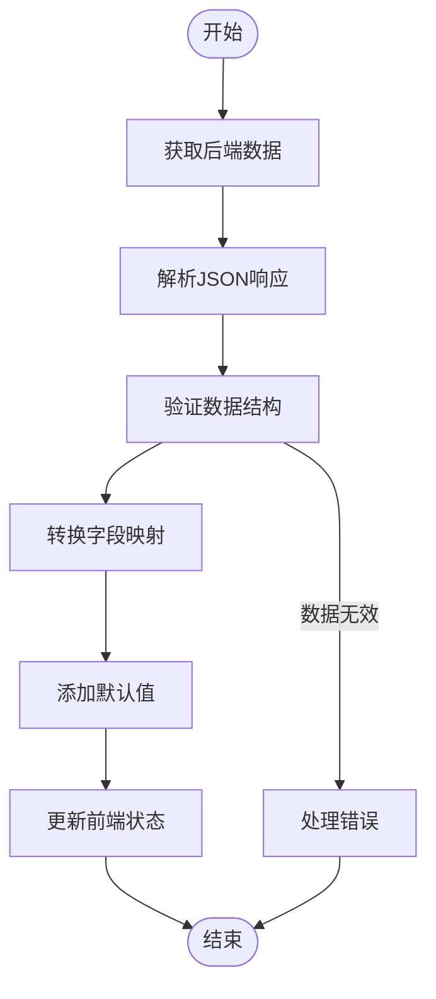
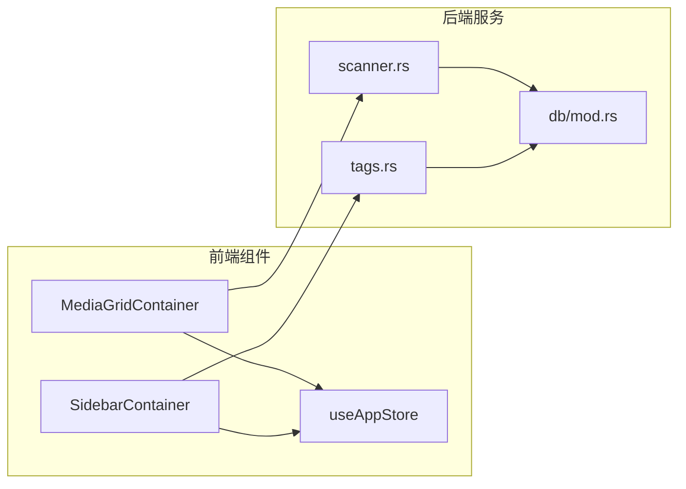

# 数据类型定义

<cite>
**本文档引用的文件**
- [useAppStore.ts](file://src/store/useAppStore.ts)
- [scanner.rs](file://src-tauri/src/services/scanner.rs)
- [tags.rs](file://src-tauri/src/services/tags.rs)
- [mod.rs](file://src-tauri/src/db/mod.rs)
- [manager.rs](file://src-tauri/src/thumbnail/manager.rs)
- [utils.rs](file://src-tauri/src/thumbnail/utils.rs)
- [worker.rs](file://src-tauri/src/thumbnail/worker.rs)
- [MediaGridContainer.tsx](file://src/containers/MediaGridContainer.tsx)
- [SidebarContainer.tsx](file://src/containers/SidebarContainer.tsx)
- [API_REFERENCE.md](file://API_REFERENCE.md)
</cite>

## 目录
1. [简介](#简介)
2. [项目结构](#项目结构)
3. [核心组件](#核心组件)
4. [架构概览](#架构概览)
5. [详细组件分析](#详细组件分析)
6. [依赖分析](#依赖分析)
7. [性能考虑](#性能考虑)
8. [故障排除指南](#故障排除指南)
9. [结论](#结论)

## 简介

本文档详细记录了Medex项目中前后端交互的所有数据结构，包括前端核心类型（MediaItem、DbMediaItem、DbTagItem）和后端数据模型。重点说明每个字段的含义、数据类型、取值范围和约束条件，解释命名映射约定和数据转换规则，提供数据模型之间的关系图和使用示例，包含数据验证规则和序列化/反序列化注意事项，以及前端ViewModel与后端DTO的分离设计原则。

## 项目结构

Medex采用前后端分离的架构设计，前端使用React + TypeScript，后端使用Rust + Tauri，通过命令调用和事件机制进行通信。



**图表来源**
- [useAppStore.ts:1-395](file://src/store/useAppStore.ts#L1-L395)
- [scanner.rs:1-525](file://src-tauri/src/services/scanner.rs#L1-L525)
- [tags.rs:1-220](file://src-tauri/src/services/tags.rs#L1-L220)

## 核心组件

### 前端数据类型

#### MediaItem（前端ViewModel）
这是前端用于UI展示的数据模型，经过从后端DTO转换而来。

| 字段名 | 类型 | 必填 | 描述 | 取值范围/约束 |
|--------|------|------|------|---------------|
| id | string | 是 | 媒体项唯一标识符 | 前端生成的字符串ID |
| path | string | 是 | 媒体文件完整路径 | 有效文件路径 |
| thumbnail | string | 否 | 缩略图URL | 有效的HTTP/HTTPS或file协议URL |
| filename | string | 是 | 媒体文件名 | 非空字符串 |
| tags | string[] | 是 | 标签数组 | 字符串数组，可能为空 |
| time | string | 是 | 时间信息 | 格式如"YYYY-MM" |
| mediaType | string | 是 | 媒体类型 | "image" 或 "video" |
| duration | string | 是 | 视频时长 | 格式如"MM:SS"或"--:--" |
| resolution | string | 是 | 分辨率信息 | 格式如"宽x高"或"未知" |
| isFavorite | boolean | 是 | 是否收藏 | true/false |
| isRecent | boolean | 是 | 是否最近查看 | true/false |
| recentViewedAt | number \| null | 否 | 最近查看时间戳 | Unix秒时间戳或null |

#### DbMediaItem（后端DTO）
这是后端数据库查询结果的原始数据模型。

| 字段名 | 类型 | 必填 | 描述 | 取值范围/约束 |
|--------|------|------|------|---------------|
| id | number | 是 | 媒体项数据库ID | 整数，自增主键 |
| path | string | 是 | 媒体文件完整路径 | 有效文件路径，唯一 |
| filename | string | 是 | 媒体文件名 | 非空字符串 |
| type | string | 是 | 媒体类型 | "image" 或 "video" |
| isFavorite | boolean | 否 | 是否收藏 | true/false，默认false |
| isRecent | boolean | 否 | 是否最近查看 | true/false，默认false |
| recentViewedAt | number \| null | 否 | 最近查看时间戳 | Unix秒时间戳或null |
| tags | string[] | 否 | 标签数组 | 字符串数组，可能为空 |

#### DbTagItem（后端标签DTO）
这是后端标签查询结果的数据模型。

| 字段名 | 类型 | 必填 | 描述 | 取值范围/约束 |
|--------|------|------|------|---------------|
| id | number | 是 | 标签数据库ID | 整数，自增主键 |
| name | string | 是 | 标签名称 | 非空字符串，唯一 |
| mediaCount | number | 否 | 关联媒体数量 | 非负整数，默认0 |

### 后端数据模型

#### MediaItem（Rust DTO）
后端用于序列化的媒体数据模型，包含数据库查询结果。

| 字段名 | 类型 | 必填 | 描述 | 序列化映射 |
|--------|------|------|------|------------|
| id | i64 | 是 | 媒体项数据库ID | 原样序列化 |
| path | String | 是 | 媒体文件完整路径 | 原样序列化 |
| filename | String | 是 | 媒体文件名 | 原样序列化 |
| media_type | String | 是 | 媒体类型 | 映射为"type" |
| is_favorite | bool | 是 | 是否收藏 | 映射为"isFavorite" |
| is_recent | bool | 是 | 是否最近查看 | 映射为"isRecent" |
| recent_viewed_at | Option<i64> | 否 | 最近查看时间戳 | 映射为"recentViewedAt" |
| tags | Vec<String> | 是 | 标签数组 | 原样序列化 |

#### Tag（Rust DTO）
后端标签数据模型。

| 字段名 | 类型 | 必填 | 描述 | 序列化映射 |
|--------|------|------|------|------------|
| id | i64 | 是 | 标签数据库ID | 原样序列化 |
| name | String | 是 | 标签名称 | 原样序列化 |

#### TagWithCount（Rust DTO）
带计数的标签数据模型。

| 字段名 | 类型 | 必填 | 描述 | 序列化映射 |
|--------|------|------|------|------------|
| id | i64 | 是 | 标签数据库ID | 原样序列化 |
| name | String | 是 | 标签名称 | 原样序列化 |
| media_count | i64 | 是 | 关联媒体数量 | 映射为"mediaCount" |

**章节来源**
- [useAppStore.ts:16-46](file://src/store/useAppStore.ts#L16-L46)
- [scanner.rs:10-31](file://src-tauri/src/services/scanner.rs#L10-L31)
- [tags.rs:5-17](file://src-tauri/src/services/tags.rs#L5-L17)

## 架构概览

Medex的数据流遵循严格的前后端分离设计，前端负责UI展示和用户交互，后端负责数据存储和业务逻辑。



**图表来源**
- [MediaGridContainer.tsx:210-243](file://src/containers/MediaGridContainer.tsx#L210-L243)
- [useAppStore.ts:258-276](file://src/store/useAppStore.ts#L258-L276)
- [scanner.rs:160-163](file://src-tauri/src/services/scanner.rs#L160-L163)

## 详细组件分析

### 数据类型映射关系

Medex实现了严格的前后端数据类型分离，通过明确的映射规则实现数据转换。



**图表来源**
- [useAppStore.ts:16-46](file://src/store/useAppStore.ts#L16-L46)
- [scanner.rs:10-31](file://src-tauri/src/services/scanner.rs#L10-L31)

### 命名映射约定

Medex采用驼峰命名到蛇形命名的映射策略，确保前后端数据一致性。

| 后端字段 | 前端字段 | 映射方式 | 示例 |
|----------|----------|----------|------|
| type | mediaType | 直接映射 | "image" → "image" |
| isFavorite | isFavorite | 直接映射 | true → true |
| isRecent | isRecent | 直接映射 | false → false |
| recentViewedAt | recentViewedAt | 直接映射 | 1640995200 → 1640995200 |
| mediaCount | mediaCount | 直接映射 | 5 → 5 |

### 数据转换流程



**图表来源**
- [MediaGridContainer.tsx:217-231](file://src/containers/MediaGridContainer.tsx#L217-L231)
- [useAppStore.ts:258-276](file://src/store/useAppStore.ts#L258-L276)

### 数据验证规则

#### 前端验证规则
- **必填字段验证**：所有必需字段必须存在且非空
- **类型验证**：确保字段类型正确（string、number、boolean等）
- **格式验证**：时间戳必须为有效Unix时间戳
- **范围验证**：数值字段必须在合理范围内

#### 后端验证规则
- **数据库约束**：唯一性约束、外键约束
- **业务规则**：标签名称不能为空，媒体类型必须有效
- **事务保证**：批量操作使用事务确保数据一致性

**章节来源**
- [MediaGridContainer.tsx:217-231](file://src/containers/MediaGridContainer.tsx#L217-L231)
- [useAppStore.ts:289-341](file://src/store/useAppStore.ts#L289-L341)

## 依赖分析

### 数据模型依赖关系

```mermaid
erDiagram
MEDIA {
integer id PK
text path UK
text filename
text type
integer is_favorite
integer created_at
integer updated_at
}
TAGS {
integer id PK
text name UK
}
MEDIA_TAGS {
integer media_id FK
integer tag_id FK
PRIMARY KEY (media_id, tag_id)
}
RECENT_VIEWS {
integer media_id PK
integer viewed_at
}
MEDIA ||--o{ MEDIA_TAGS : "关联"
TAGS ||--o{ MEDIA_TAGS : "关联"
MEDIA ||--o{ RECENT_VIEWS : "最近查看"
```

**图表来源**
- [mod.rs:12-43](file://src-tauri/src/db/mod.rs#L12-L43)

### 组件间依赖



**图表来源**
- [MediaGridContainer.tsx:1-619](file://src/containers/MediaGridContainer.tsx#L1-L619)
- [SidebarContainer.tsx:1-79](file://src/containers/SidebarContainer.tsx#L1-L79)

**章节来源**
- [mod.rs:12-43](file://src-tauri/src/db/mod.rs#L12-L43)
- [scanner.rs:117-158](file://src-tauri/src/services/scanner.rs#L117-L158)

## 性能考虑

### 前端性能优化

1. **虚拟滚动**：只渲染可见区域内的媒体项
2. **并发请求限制**：最大并发5个缩略图请求
3. **队列管理**：最大队列长度400，支持优先级排序
4. **状态缓存**：避免重复的API调用

### 后端性能优化

1. **数据库索引**：为常用查询字段建立索引
2. **批量操作**：使用事务批量插入媒体文件
3. **连接池**：使用OnceCell管理数据库连接
4. **内存管理**：及时释放不再使用的资源

**章节来源**
- [MediaGridContainer.tsx:27-28](file://src/containers/MediaGridContainer.tsx#L27-L28)
- [mod.rs:39-42](file://src-tauri/src/db/mod.rs#L39-L42)

## 故障排除指南

### 常见问题及解决方案

#### 缩略图生成失败
- **原因**：ffmpeg不可用或路径错误
- **解决方案**：检查ffmpeg安装，确保路径正确

#### 数据库连接失败
- **原因**：数据库文件损坏或权限不足
- **解决方案**：重启应用，检查文件权限

#### API调用超时
- **原因**：网络延迟或服务器负载过高
- **解决方案**：增加超时时间，优化查询语句

### 调试技巧

1. **启用详细日志**：在开发模式下输出详细的执行日志
2. **监控内存使用**：定期检查内存泄漏
3. **性能分析**：使用浏览器开发者工具分析性能瓶颈

**章节来源**
- [manager.rs:51-106](file://src-tauri/src/thumbnail/manager.rs#L51-L106)
- [utils.rs:71-96](file://src-tauri/src/thumbnail/utils.rs#L71-L96)

## 结论

Medex项目实现了清晰的数据类型分离设计，通过严格的前后端数据模型划分和明确的映射规则，确保了系统的可维护性和扩展性。前端ViewModel与后端DTO的分离设计原则有效避免了数据污染，提高了系统的稳定性。建议在未来版本中进一步完善错误处理机制，增加数据验证中间件，并考虑引入更强大的ORM框架以简化数据库操作。