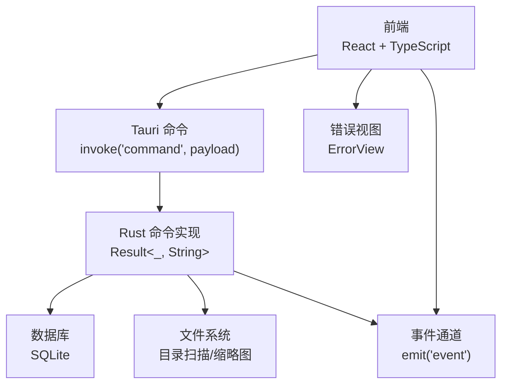
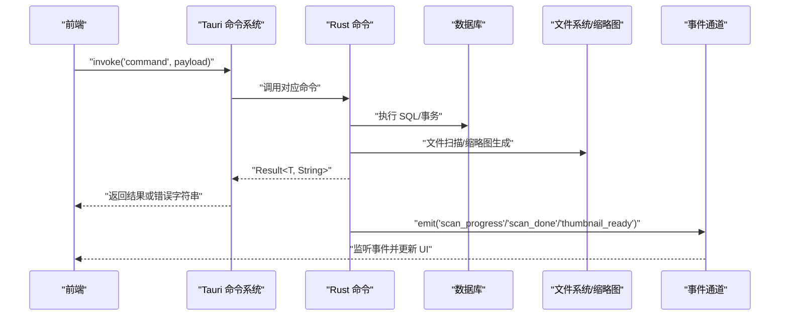
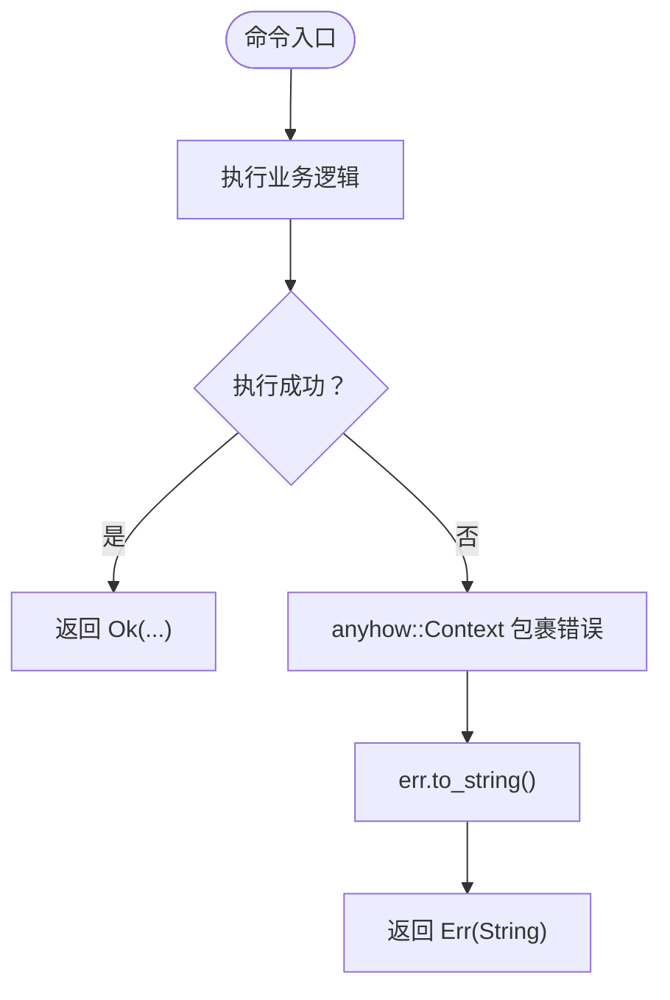
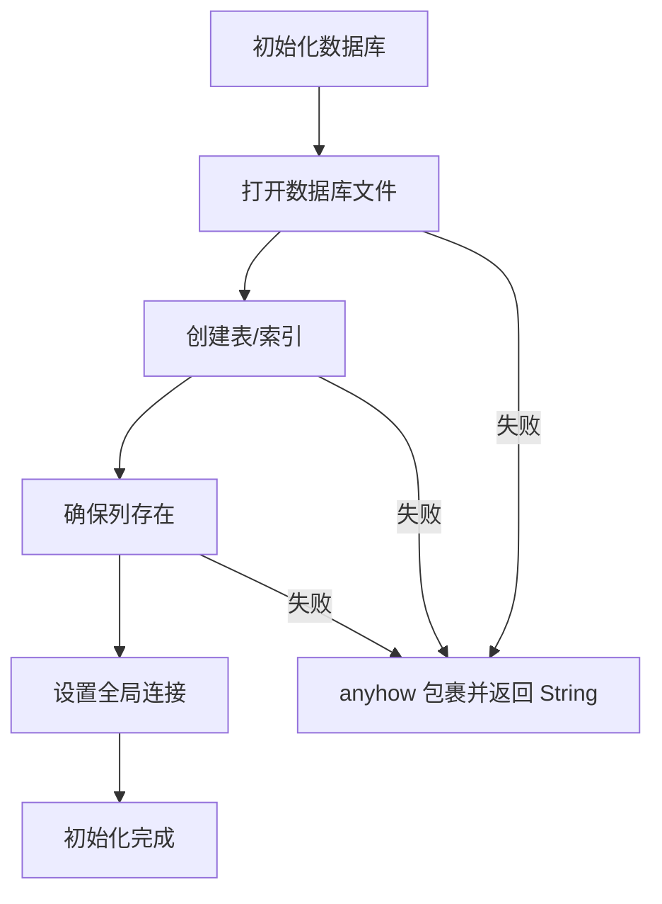
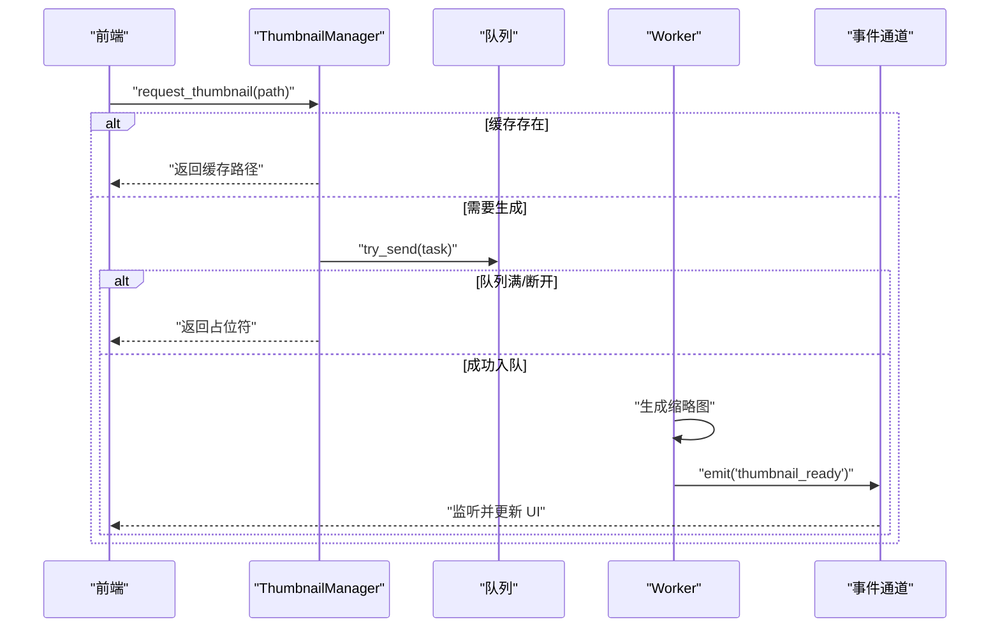
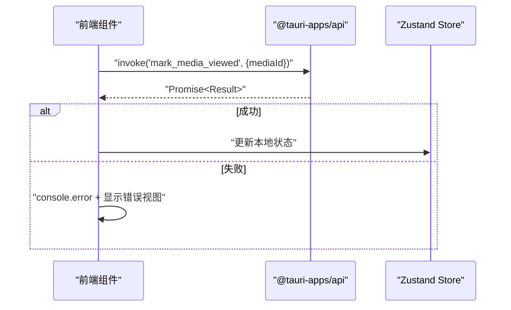
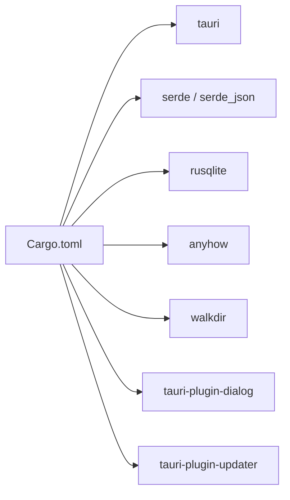

# 错误处理约定

<cite>
**本文引用的文件**
- [README.md](file://README.md)
- [API_REFERENCE.md](file://API_REFERENCE.md)
- [src-tauri/Cargo.toml](file://src-tauri/Cargo.toml)
- [src-tauri/src/main.rs](file://src-tauri/src/main.rs)
- [src-tauri/src/db/mod.rs](file://src-tauri/src/db/mod.rs)
- [src-tauri/src/services/scanner.rs](file://src-tauri/src/services/scanner.rs)
- [src-tauri/src/services/tags.rs](file://src-tauri/src/services/tags.rs)
- [src-tauri/src/thumbnail/manager.rs](file://src-tauri/src/thumbnail/manager.rs)
- [src-tauri/src/thumbnail/worker.rs](file://src-tauri/src/thumbnail/worker.rs)
- [src-tauri/src/thumbnail/queue.rs](file://src-tauri/src/thumbnail/queue.rs)
- [src/App.tsx](file://src/App.tsx)
- [src/store/useAppStore.ts](file://src/store/useAppStore.ts)
- [src/pages/views/ErrorView.tsx](file://src/pages/views/ErrorView.tsx)
</cite>

## 目录
1. [简介](#简介)
2. [项目结构](#项目结构)
3. [核心组件](#核心组件)
4. [架构总览](#架构总览)
5. [详细组件分析](#详细组件分析)
6. [依赖关系分析](#依赖关系分析)
7. [性能考量](#性能考量)
8. [故障排查指南](#故障排查指南)
9. [结论](#结论)
10. [附录](#附录)

## 简介
本文件系统性梳理 Medex 项目的错误处理约定，覆盖 Rust 命令的统一错误返回格式（Result<_, String>）、前端 invoke 的错误捕获与处理机制、事件通道的错误传播、以及数据库/文件系统/缩略图子系统的错误策略。同时给出错误码设计建议、错误信息结构化方案、常见错误场景与处理策略、最佳实践与调试技巧，以及错误恢复与用户友好提示的设计方法。

## 项目结构
Medex 采用前端（React + TypeScript）与后端（Tauri + Rust）分离的架构。错误处理贯穿命令调用链（前端 invoke -> Rust 命令 -> 数据库/文件系统/缩略图），并通过事件通道（emit/listen）向前端推送异步状态与错误。

图表来源
- [src-tauri/src/main.rs:49-65](file://src-tauri/src/main.rs#L49-L65)
- [API_REFERENCE.md:19-31](file://API_REFERENCE.md#L19-L31)
- [src/App.tsx:35-41](file://src/App.tsx#L35-L41)

章节来源
- [README.md:35-47](file://README.md#L35-L47)
- [API_REFERENCE.md:19-31](file://API_REFERENCE.md#L19-L31)

## 核心组件
- 前端错误捕获与处理
  - 使用 @tauri-apps/api 的 invoke 与 listen，统一在调用处进行 try/catch，并打印错误与显示提示。
  - 示例：在媒体查看器中调用 mark_media_viewed 后捕获异常并记录日志。
- Rust 命令统一返回格式
  - 所有命令返回 Result<T, String>，错误以字符串形式传递给前端。
  - 前端收到字符串错误后统一处理。
- 事件通道错误传播
  - 扫描进度与完成事件用于异步反馈；缩略图生成失败通过日志输出并在前端监听 thumbnail_ready 事件。
- 数据库与文件系统错误
  - 数据库初始化、连接、事务、DDL 变更均使用 anyhow 上下文包装，最终转换为字符串错误。
  - 文件系统扫描与缩略图生成在异常时返回错误字符串或日志输出。
- 错误视图组件
  - ErrorView 提供统一的错误提示与重试按钮，便于用户在 UI 层面对错误进行响应。

章节来源
- [API_REFERENCE.md:450-467](file://API_REFERENCE.md#L450-L467)
- [src/App.tsx:35-41](file://src/App.tsx#L35-L41)
- [src/pages/views/ErrorView.tsx:1-48](file://src/pages/views/ErrorView.tsx#L1-L48)

## 架构总览
下图展示了从前端命令调用到 Rust 实现再到数据库/文件系统/事件通道的整体错误处理流程。

图表来源
- [src-tauri/src/main.rs:49-65](file://src-tauri/src/main.rs#L49-L65)
- [src-tauri/src/services/scanner.rs:250-341](file://src-tauri/src/services/scanner.rs#L250-L341)
- [src-tauri/src/thumbnail/worker.rs:81-89](file://src-tauri/src/thumbnail/worker.rs#L81-L89)

## 详细组件分析

### 命令层错误处理（Rust）
- 统一返回格式
  - 所有命令返回 Result<T, String>，错误通过 err.to_string() 转换为字符串传递给前端。
- 常见命令与错误点
  - 扫描与索引：目录扫描失败、事务提交失败、事件发射失败。
  - 标签管理：标签名为空、标签仍被使用不可删除、关联插入失败。
  - 媒体收藏与最近观看：SQL 更新失败、最近观看 upsert/裁剪失败。
  - 缩略图请求：非支持视频、ffmpeg 不存在、队列满/断开、处理集合锁失败。
- 错误传播路径
  - 命令层捕获 anyhow::Result 并转换为 String，前端接收后统一处理。

图表来源
- [src-tauri/src/services/scanner.rs:160-163](file://src-tauri/src/services/scanner.rs#L160-L163)
- [src-tauri/src/services/tags.rs:77-93](file://src-tauri/src/services/tags.rs#L77-L93)
- [src-tauri/src/thumbnail/manager.rs:51-106](file://src-tauri/src/thumbnail/manager.rs#L51-L106)

章节来源
- [API_REFERENCE.md:450-467](file://API_REFERENCE.md#L450-L467)
- [src-tauri/src/services/scanner.rs:160-163](file://src-tauri/src/services/scanner.rs#L160-L163)
- [src-tauri/src/services/tags.rs:76-93](file://src-tauri/src/services/tags.rs#L76-L93)
- [src-tauri/src/thumbnail/manager.rs:51-106](file://src-tauri/src/thumbnail/manager.rs#L51-L106)

### 数据库层错误处理（SQLite）
- 初始化与迁移
  - 初始化数据库连接、创建表与索引、确保列存在（如 is_favorite），失败则返回错误字符串。
- 事务与并发
  - 多处使用事务保证一致性；连接池使用 OnceCell + Mutex 保护；锁失败返回错误字符串。
- 查询与更新
  - 查询失败、解析行失败、更新失败均通过 anyhow 包裹并转换为字符串。

图表来源
- [src-tauri/src/db/mod.rs:45-64](file://src-tauri/src/db/mod.rs#L45-L64)
- [src-tauri/src/db/mod.rs:97-110](file://src-tauri/src/db/mod.rs#L97-L110)

章节来源
- [src-tauri/src/db/mod.rs:45-64](file://src-tauri/src/db/mod.rs#L45-L64)
- [src-tauri/src/db/mod.rs:97-110](file://src-tauri/src/db/mod.rs#L97-L110)

### 缩略图系统错误处理
- 请求流程
  - 校验视频类型与 ffmpeg 存在性；若缓存存在直接返回路径；否则标记 processing 并尝试入队；队列满/断开返回占位符并清理 processing；生成成功发出 thumbnail_ready 事件。
- Worker 处理
  - 接收任务后检查输出是否存在；若 ffmpeg 不可用则跳过；生成失败记录日志；完成后移除 processing 并发出事件。

图表来源
- [src-tauri/src/thumbnail/manager.rs:51-106](file://src-tauri/src/thumbnail/manager.rs#L51-L106)
- [src-tauri/src/thumbnail/worker.rs:52-89](file://src-tauri/src/thumbnail/worker.rs#L52-L89)
- [src-tauri/src/thumbnail/queue.rs:8-11](file://src-tauri/src/thumbnail/queue.rs#L8-L11)

章节来源
- [src-tauri/src/thumbnail/manager.rs:51-106](file://src-tauri/src/thumbnail/manager.rs#L51-L106)
- [src-tauri/src/thumbnail/worker.rs:52-89](file://src-tauri/src/thumbnail/worker.rs#L52-L89)
- [src-tauri/src/thumbnail/queue.rs:8-11](file://src-tauri/src/thumbnail/queue.rs#L8-L11)

### 前端错误捕获与处理
- 统一调用方式
  - 使用 @tauri-apps/api 的 invoke 与 listen，命令调用处进行 try/catch。
- 典型场景
  - 媒体查看后调用 mark_media_viewed，捕获错误并打印日志。
- 错误视图
  - ErrorView 提供错误信息展示与重试回调，便于用户主动恢复。

图表来源
- [src/App.tsx:35-41](file://src/App.tsx#L35-L41)
- [src/store/useAppStore.ts:382-393](file://src/store/useAppStore.ts#L382-L393)

章节来源
- [API_REFERENCE.md:450-467](file://API_REFERENCE.md#L450-L467)
- [src/App.tsx:35-41](file://src/App.tsx#L35-L41)
- [src/pages/views/ErrorView.tsx:1-48](file://src/pages/views/ErrorView.tsx#L1-L48)

## 依赖关系分析
- Rust 依赖
  - tauri、serde、rusqlite、anyhow、walkdir、tauri-plugin-dialog、tauri-plugin-updater。
- 错误处理相关
  - anyhow::Context 用于在关键节点包裹上下文信息，最终转换为字符串错误。
  - tauri::Emitter 用于事件通道的错误输出与日志记录。

图表来源
- [src-tauri/Cargo.toml:13-22](file://src-tauri/Cargo.toml#L13-L22)

章节来源
- [src-tauri/Cargo.toml:13-22](file://src-tauri/Cargo.toml#L13-L22)

## 性能考量
- 前端缩略图调度
  - 最大并发与队列容量限制，避免资源耗尽；优先级策略提升用户体验。
- 后端缩略图调度
  - 固定 worker 数量与队列容量，同一路径去重避免重复处理。
- 数据库事务
  - 大批量插入使用事务，减少磁盘写入次数，提高吞吐。

章节来源
- [API_REFERENCE.md:469-482](file://API_REFERENCE.md#L469-L482)
- [src-tauri/src/services/scanner.rs:90-115](file://src-tauri/src/services/scanner.rs#L90-L115)
- [src-tauri/src/thumbnail/manager.rs:24-49](file://src-tauri/src/thumbnail/manager.rs#L24-L49)

## 故障排查指南
- 常见错误场景与定位
  - 数据库初始化失败：检查应用数据目录权限与路径解析。
  - 扫描目录错误：确认路径存在且可访问，关注 walkdir 错误日志。
  - 缩略图生成失败：确认 ffmpeg 是否可用与可执行；检查队列是否满载或断开。
  - 标签删除失败：确认标签仍被媒体引用，需先移除关联再删除。
- 日志与事件
  - 前端：命令调用失败时打印错误日志。
  - 后端：缩略图 worker 与管理器均有详细的错误日志输出。
  - 事件：通过 scan_progress/scan_done/thumbnail_ready 监听异步状态。
- 用户提示
  - 使用 ErrorView 提供统一错误提示与重试按钮，提升可恢复性。

章节来源
- [src-tauri/src/db/mod.rs:112-122](file://src-tauri/src/db/mod.rs#L112-L122)
- [src-tauri/src/services/scanner.rs:57-64](file://src-tauri/src/services/scanner.rs#L57-L64)
- [src-tauri/src/thumbnail/manager.rs:83-102](file://src-tauri/src/thumbnail/manager.rs#L83-L102)
- [src-tauri/src/thumbnail/worker.rs:32-39](file://src-tauri/src/thumbnail/worker.rs#L32-L39)
- [src/App.tsx:39-41](file://src/App.tsx#L39-L41)
- [src/pages/views/ErrorView.tsx:1-48](file://src/pages/views/ErrorView.tsx#L1-L48)

## 结论
Medex 的错误处理约定以“统一返回格式 + 事件通道 + 前端统一捕获”为核心，结合 anyhow 的上下文包装与字符串错误传递，形成清晰的前后端协作机制。建议后续引入结构化错误码与错误详情字段，进一步提升可观测性与可维护性。

## 附录

### 错误码设计建议（建议方案）
- 建议结构
  - code: 错误码字符串（便于程序识别与日志检索）
  - message: 人类可读的错误信息
  - detail: 可选的详细上下文（如字段名、期望值、实际值）
- 设计原则
  - 前缀分层：如 DB_、FS_、THUMB_、VALIDATION_ 等区分域
  - 语义明确：避免模糊描述，尽量包含失败原因与修复建议
  - 向后兼容：新增错误码时保留旧码一段时间

章节来源
- [API_REFERENCE.md:457-465](file://API_REFERENCE.md#L457-L465)

### 错误信息结构化方案（建议方案）
- 前端 ApiError 接口
  - code: string
  - message: string
  - detail?: string
- 建议在前端 store 或工具函数中统一转换后端字符串错误为结构化对象，便于 UI 与日志系统消费。

章节来源
- [API_REFERENCE.md:457-465](file://API_REFERENCE.md#L457-L465)

### 常见错误场景与处理策略
- 网络错误
  - 建议：重试与退避、降级加载、用户提示与重试按钮。
- 数据库错误
  - 建议：事务回滚、连接池健康检查、DDL 变更前置校验。
- 文件系统错误
  - 建议：路径存在性检查、权限检查、临时文件清理。
- 缩略图生成错误
  - 建议：ffmpeg 可用性检测、队列容量与并发控制、占位符与事件驱动更新。

章节来源
- [src-tauri/src/db/mod.rs:112-122](file://src-tauri/src/db/mod.rs#L112-L122)
- [src-tauri/src/services/scanner.rs:54-88](file://src-tauri/src/services/scanner.rs#L54-L88)
- [src-tauri/src/thumbnail/manager.rs:51-106](file://src-tauri/src/thumbnail/manager.rs#L51-L106)

### 最佳实践与调试技巧
- 前端
  - 在 invoke 调用处统一 try/catch，记录错误并显示 ErrorView。
  - 对于可恢复错误（如缩略图占位符），提供重试与自动刷新策略。
- 后端
  - 使用 anyhow::Context 在关键节点添加上下文信息，便于定位问题。
  - 对外部依赖（如 ffmpeg）进行可用性检测与降级处理。
  - 事件通道失败时记录日志并考虑补偿机制。
- 调试
  - 利用浏览器开发者工具与 Tauri 日志输出双通道定位问题。
  - 对缩略图生成失败，重点检查 ffmpeg 路径与权限。

章节来源
- [API_REFERENCE.md:450-467](file://API_REFERENCE.md#L450-L467)
- [src-tauri/src/thumbnail/worker.rs:64-76](file://src-tauri/src/thumbnail/worker.rs#L64-L76)
- [src/pages/views/ErrorView.tsx:1-48](file://src/pages/views/ErrorView.tsx#L1-L48)