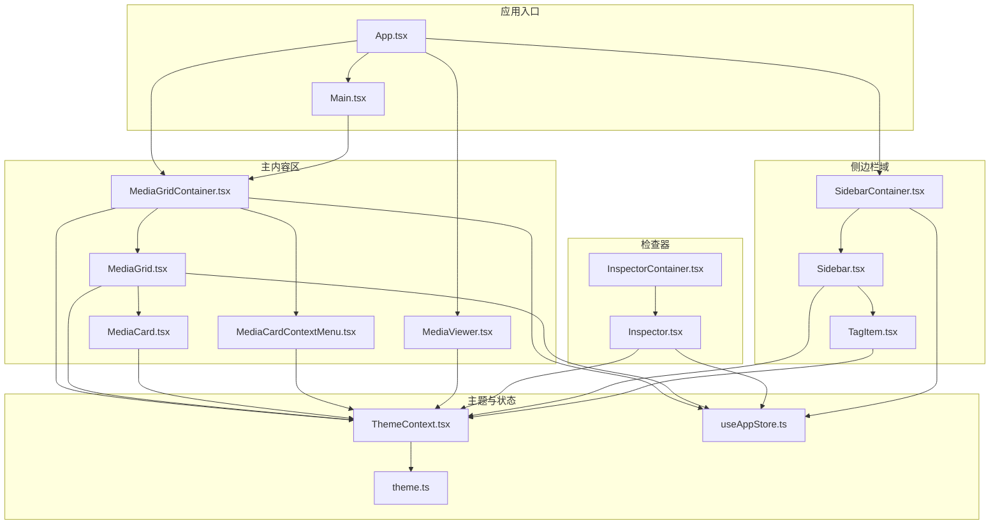
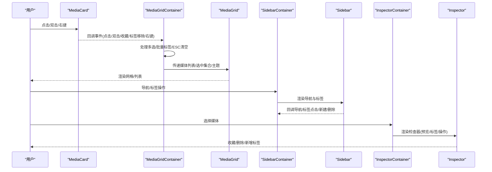
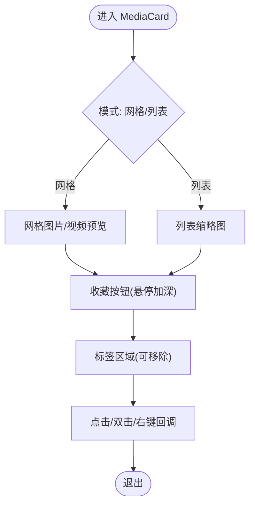
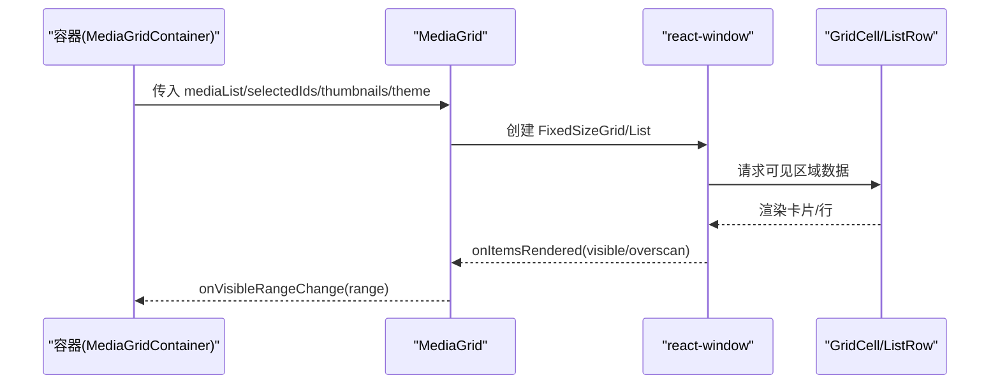
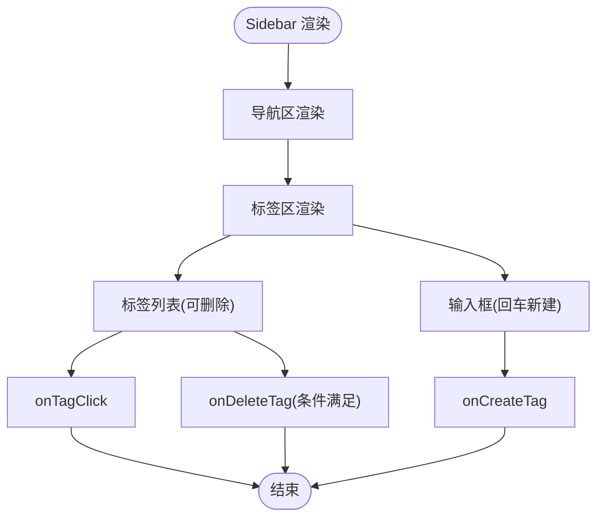
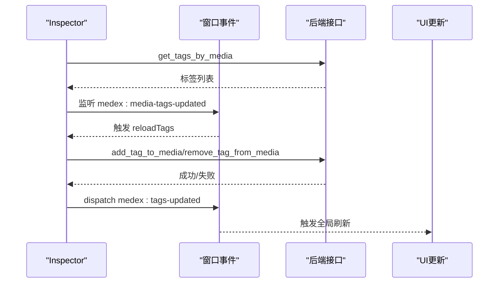
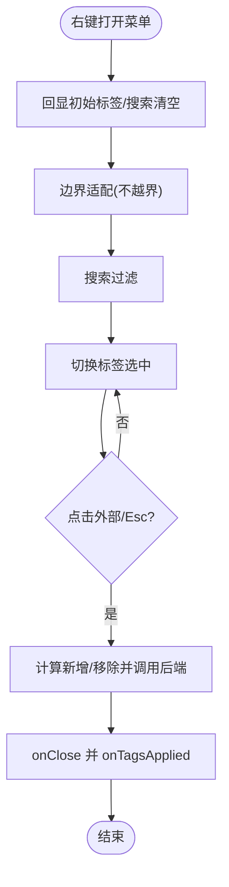
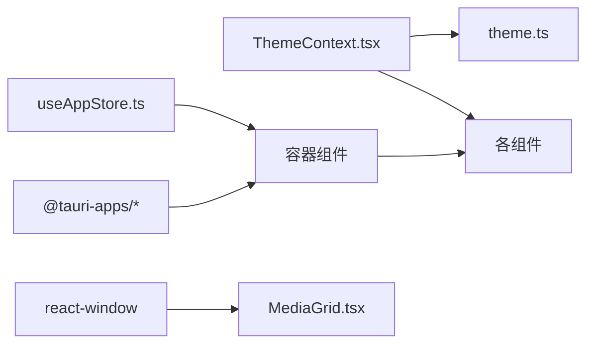

# UI 组件

<cite>
**本文引用的文件**
- [MediaCard.tsx](file://src/components/MediaCard.tsx)
- [MediaGrid.tsx](file://src/components/MediaGrid.tsx)
- [Sidebar.tsx](file://src/components/Sidebar.tsx)
- [Inspector.tsx](file://src/components/Inspector.tsx)
- [MediaCardContextMenu.tsx](file://src/components/MediaCardContextMenu.tsx)
- [TagItem.tsx](file://src/components/TagItem.tsx)
- [MediaGridContainer.tsx](file://src/containers/MediaGridContainer.tsx)
- [SidebarContainer.tsx](file://src/containers/SidebarContainer.tsx)
- [InspectorContainer.tsx](file://src/containers/InspectorContainer.tsx)
- [Main.tsx](file://src/components/Main.tsx)
- [MediaViewer.tsx](file://src/components/MediaViewer.tsx)
- [App.tsx](file://src/App.tsx)
- [ThemeContext.tsx](file://src/contexts/ThemeContext.tsx)
- [theme.ts](file://src/theme/theme.ts)
- [useAppStore.ts](file://src/store/useAppStore.ts)
- [package.json](file://package.json)
</cite>

## 目录
1. [简介](#简介)
2. [项目结构](#项目结构)
3. [核心组件](#核心组件)
4. [架构总览](#架构总览)
5. [组件详解](#组件详解)
6. [依赖关系分析](#依赖关系分析)
7. [性能与可访问性](#性能与可访问性)
8. [故障排查指南](#故障排查指南)
9. [结论](#结论)
10. [附录](#附录)

## 简介
本文件为 Medex UI 组件系统的权威文档，聚焦 MediaCard、MediaGrid、Sidebar、Inspector 等核心组件，系统阐述其视觉外观、行为与交互模式，完整记录属性（props）、事件、插槽与自定义选项；提供使用示例与代码片段路径；覆盖响应式设计与无障碍访问合规性；说明组件状态、动画与过渡效果；给出样式自定义与主题支持方案；解释跨浏览器兼容性与性能优化策略；并详述组件组合模式与与其他 UI 元素的集成方式。

## 项目结构
Medex 采用容器-展示分离的组织方式：容器负责状态管理与业务逻辑，展示组件负责渲染与交互；主题通过上下文统一注入；媒体网格采用虚拟化渲染以支撑大规模媒体浏览。

图表来源
- [App.tsx:1-73](file://src/App.tsx#L1-L73)
- [Main.tsx:1-25](file://src/components/Main.tsx#L1-L25)
- [SidebarContainer.tsx:1-79](file://src/containers/SidebarContainer.tsx#L1-L79)
- [Sidebar.tsx:1-145](file://src/components/Sidebar.tsx#L1-L145)
- [TagItem.tsx:1-70](file://src/components/TagItem.tsx#L1-L70)
- [MediaGridContainer.tsx:1-620](file://src/containers/MediaGridContainer.tsx#L1-L620)
- [MediaGrid.tsx:1-351](file://src/components/MediaGrid.tsx#L1-L351)
- [MediaCard.tsx:1-318](file://src/components/MediaCard.tsx#L1-L318)
- [MediaCardContextMenu.tsx:1-255](file://src/components/MediaCardContextMenu.tsx#L1-L255)
- [MediaViewer.tsx:1-186](file://src/components/MediaViewer.tsx#L1-L186)
- [InspectorContainer.tsx:1-32](file://src/containers/InspectorContainer.tsx#L1-L32)
- [Inspector.tsx:1-277](file://src/components/Inspector.tsx#L1-L277)
- [ThemeContext.tsx:1-99](file://src/contexts/ThemeContext.tsx#L1-L99)
- [theme.ts:1-159](file://src/theme/theme.ts#L1-L159)
- [useAppStore.ts:1-395](file://src/store/useAppStore.ts#L1-L395)

章节来源
- [App.tsx:1-73](file://src/App.tsx#L1-L73)
- [Main.tsx:1-25](file://src/components/Main.tsx#L1-L25)
- [package.json:1-37](file://package.json#L1-L37)

## 核心组件
- MediaCard：媒体卡片，支持图片/视频预览、收藏、标签、悬停与选中态、右键上下文菜单等。
- MediaGrid：媒体网格/列表视图，基于 react-window 实现虚拟滚动，支持可见范围回调、列数计算与布局偏移。
- Sidebar：导航与标签管理，支持新建、删除标签与导航切换。
- Inspector：媒体详情检查器，展示预览、标签、信息与操作（收藏、删除、新增标签）。
- MediaCardContextMenu：媒体卡片右键上下文菜单，支持标签多选、搜索、批量应用。
- MediaGridContainer、SidebarContainer、InspectorContainer：容器组件，负责状态、事件与主题注入。

章节来源
- [MediaCard.tsx:1-318](file://src/components/MediaCard.tsx#L1-L318)
- [MediaGrid.tsx:1-351](file://src/components/MediaGrid.tsx#L1-L351)
- [Sidebar.tsx:1-145](file://src/components/Sidebar.tsx#L1-L145)
- [Inspector.tsx:1-277](file://src/components/Inspector.tsx#L1-L277)
- [MediaCardContextMenu.tsx:1-255](file://src/components/MediaCardContextMenu.tsx#L1-L255)
- [MediaGridContainer.tsx:1-620](file://src/containers/MediaGridContainer.tsx#L1-L620)
- [SidebarContainer.tsx:1-79](file://src/containers/SidebarContainer.tsx#L1-L79)
- [InspectorContainer.tsx:1-32](file://src/containers/InspectorContainer.tsx#L1-L32)

## 架构总览
组件间通过容器-展示分层解耦，主题通过 ThemeContext 注入，状态通过 Zustand store 管理，媒体网格通过虚拟化提升性能，上下文菜单支持批量标签操作。

图表来源
- [MediaCard.tsx:86-264](file://src/components/MediaCard.tsx#L86-L264)
- [MediaGridContainer.tsx:60-92](file://src/containers/MediaGridContainer.tsx#L60-L92)
- [MediaGrid.tsx:70-212](file://src/components/MediaGrid.tsx#L70-L212)
- [SidebarContainer.tsx:1-79](file://src/containers/SidebarContainer.tsx#L1-L79)
- [Sidebar.tsx:17-145](file://src/components/Sidebar.tsx#L17-L145)
- [InspectorContainer.tsx:1-32](file://src/containers/InspectorContainer.tsx#L1-L32)
- [Inspector.tsx:19-264](file://src/components/Inspector.tsx#L19-L264)

## 组件详解

### MediaCard 组件
- 视觉外观
  - 支持网格与列表两种模式，网格默认尺寸与间距固定，列表行高固定。
  - 图片/视频预览：图片优先；视频时优先使用视频缩略图，否则显示占位与加载提示。
  - 选中态：外层环形高亮与半透明遮罩层叠加，突出选中媒体。
  - 收藏按钮：悬停时背景加深，收藏图标颜色随主题色。
  - 标签区域：网格紧凑一行，列表支持纵向滚动，标签可点击移除。
- 行为与交互
  - 点击/双击/右键回调由父级传入，支持 Ctrl/Cmd+点击多选、Shift 连续选择。
  - 标签移除：调用后端接口移除标签，并触发全局“标签已更新”事件。
  - 视频缩略图懒加载与过渡：加载完成时淡入。
- 属性（props）
  - 必填：id、thumbnail、filename、tags、selected、onClick、theme。
  - 可选：path、time、mediaType、duration、resolution、onDoubleClick、onToggleFavorite、onTagRemoved、onContextMenu、videoThumbnail、className、mode。
- 事件
  - onClick(e, id)、onDoubleClick(id)、onToggleFavorite(id)、onTagRemoved(id, tagName)、onContextMenu(e, id)。
- 插槽与自定义
  - 通过 className 自定义宽度；通过 theme 自定义颜色体系。
- 无障碍
  - 收藏按钮提供 aria-label 与 title；标签按钮提供 title 提示。
- 性能
  - 使用 memo 包裹，自定义比较函数仅在关键字段变化时重渲染。
  - 图片错误回退与视频缩略图加载状态控制。
- 代码片段路径
  - [MediaCardProps 接口与渲染主体:6-52](file://src/components/MediaCard.tsx#L6-L52)
  - [标签移除流程:65-84](file://src/components/MediaCard.tsx#L65-L84)
  - [toPreviewSrc 转换逻辑:266-275](file://src/components/MediaCard.tsx#L266-L275)
  - [memo 与相等性比较:277-317](file://src/components/MediaCard.tsx#L277-L317)

图表来源
- [MediaCard.tsx:86-264](file://src/components/MediaCard.tsx#L86-L264)

章节来源
- [MediaCard.tsx:1-318](file://src/components/MediaCard.tsx#L1-L318)

### MediaGrid 组件
- 视觉外观
  - 网格：固定卡片宽高与间距，支持内边距与偏移，单元格尺寸按列宽与行高计算。
  - 列表：固定表头高度与行高，网格头部展示列标题，行内展示缩略图、名称、标签、时间、类型。
- 行为与交互
  - 虚拟化：使用 react-window 的 FixedSizeGrid 与 FixedSizeList，支持 overscan 与可见范围回调。
  - 背景点击取消选择：点击网格背景区域触发 onBackgroundClick。
  - 列表行悬停与选中态：背景色与描边高亮。
- 属性（props）
  - 必填：mediaList、selectedIds、onCardClick、onCardDoubleClick、onToggleFavorite、onTagAdded、onTagRemoved、thumbnails、viewMode、theme。
  - 可选：onCardContextMenu、onBackgroundClick、onVisibleRangeChange。
- 事件
  - onVisibleRangeChange(range)：返回可见与预渲染范围索引及列数。
- 无障碍
  - 列表行具备可访问的语义化网格结构。
- 性能
  - 使用 useMemo 缓存列表与网格数据，减少子组件重渲染。
  - GridCell/ListRow 使用 memo 包裹，避免重复渲染。
- 代码片段路径
  - [网格/列表分支与虚拟化:133-212](file://src/components/MediaGrid.tsx#L133-L212)
  - [GridCell 渲染与偏移:214-240](file://src/components/MediaGrid.tsx#L214-L240)
  - [ListRow 渲染与悬停/选中态:242-297](file://src/components/MediaGrid.tsx#L242-L297)
  - [列数/行数计算与尺寸:92-96](file://src/components/MediaGrid.tsx#L92-L96)
  - [toPreviewSrc 转换:312-321](file://src/components/MediaGrid.tsx#L312-L321)

图表来源
- [MediaGrid.tsx:70-212](file://src/components/MediaGrid.tsx#L70-L212)

章节来源
- [MediaGrid.tsx:1-351](file://src/components/MediaGrid.tsx#L1-L351)

### Sidebar 组件
- 视觉外观
  - 顶部品牌区、导航区、标签区三段式布局。
  - 导航项：激活态背景与文字色高亮；悬停时背景色过渡。
  - 标签输入：支持回车新建；新增按钮悬停加深。
  - 标签项：选中态背景与文字色高亮；可删除态提供删除按钮。
- 行为与交互
  - 导航点击：触发 onNavClick；容器侧维护 active 状态。
  - 标签输入：回车触发 onCreateTag；新增后清空输入并刷新标签列表。
  - 标签点击：触发 onTagClick；容器侧维护 selected 状态。
  - 标签删除：仅在选中且计数为 0 时显示删除按钮。
- 属性（props）
  - 必填：navItems、tags、onNewTagNameChange、onCreateTag、onDeleteTag、onTagClick、onNavClick、theme。
  - 可选：newTagName。
- 无障碍
  - 输入框与按钮提供 aria-label/title；标签项提供计数提示。
- 代码片段路径
  - [导航渲染与悬停态:46-71](file://src/components/Sidebar.tsx#L46-L71)
  - [标签输入与新增按钮:77-128](file://src/components/Sidebar.tsx#L77-L128)
  - [标签项渲染与删除条件:131-141](file://src/components/Sidebar.tsx#L131-L141)
  - [TagItem 子组件:11-70](file://src/components/TagItem.tsx#L11-L70)

图表来源
- [Sidebar.tsx:27-145](file://src/components/Sidebar.tsx#L27-L145)
- [TagItem.tsx:11-70](file://src/components/TagItem.tsx#L11-L70)

章节来源
- [Sidebar.tsx:1-145](file://src/components/Sidebar.tsx#L1-L145)
- [TagItem.tsx:1-70](file://src/components/TagItem.tsx#L1-L70)

### Inspector 组件
- 视觉外观
  - 顶部“Inspector”标题；无媒体时显示占位提示。
  - 媒体预览区：视频自动播放首帧（暂停）、图片悬停放大。
  - 标签区：加载中状态、标签列表与移除按钮。
  - 信息区：时长、分辨率等元信息。
  - 操作区：新增标签输入与按钮、收藏/删除按钮。
- 行为与交互
  - 标签加载：首次挂载与窗口事件触发时重新加载。
  - 新增标签：去重后调用后端接口，成功后刷新列表并派发全局事件。
  - 移除标签：调用后端接口，成功后刷新列表并派发全局事件。
  - 收藏/删除：回调父级 onToggleFavorite/onDeleteMedia。
- 属性（props）
  - 必填：media、onToggleFavorite、onDeleteMedia。
- 无障碍
  - 按钮提供 aria-label 与 title；输入框提供占位符与键盘事件。
- 代码片段路径
  - [标签加载与事件监听:27-53](file://src/components/Inspector.tsx#L27-L53)
  - [新增标签流程:67-88](file://src/components/Inspector.tsx#L67-L88)
  - [移除标签流程:55-65](file://src/components/Inspector.tsx#L55-L65)
  - [toPreviewSrc 转换:267-276](file://src/components/Inspector.tsx#L267-L276)

图表来源
- [Inspector.tsx:27-88](file://src/components/Inspector.tsx#L27-L88)

章节来源
- [Inspector.tsx:1-277](file://src/components/Inspector.tsx#L1-L277)

### MediaCardContextMenu 组件
- 视觉外观
  - 右键弹出菜单，支持搜索过滤、Chip 风格标签选择、已选数量提示。
  - 悬停态与选中态颜色区分。
- 行为与交互
  - 初始化：回显媒体已有标签或批量共有标签。
  - 边界适配：自动调整位置避免超出屏幕。
  - 点击外部或 Esc 自动提交变更。
  - 批量应用：计算新增与移除标签，逐个调用后端接口，最后回调 onTagsApplied。
- 属性（props）
  - 必填：visible、x、y、mediaId、mediaTags、allTags、onClose、onTagsApplied。
  - 可选：selectedCount、commonTags。
- 无障碍
  - 搜索框具备键盘交互；标签项具备可访问的选中状态。
- 代码片段路径
  - [初始化与边界适配:44-78](file://src/components/MediaCardContextMenu.tsx#L44-L78)
  - [关闭并提交流程:81-93](file://src/components/MediaCardContextMenu.tsx#L81-L93)
  - [应用标签变更:96-132](file://src/components/MediaCardContextMenu.tsx#L96-L132)
  - [点击外部与 Esc 关闭:135-161](file://src/components/MediaCardContextMenu.tsx#L135-L161)

图表来源
- [MediaCardContextMenu.tsx:23-161](file://src/components/MediaCardContextMenu.tsx#L23-L161)

章节来源
- [MediaCardContextMenu.tsx:1-255](file://src/components/MediaCardContextMenu.tsx#L1-L255)

### 容器组件与状态集成
- MediaGridContainer
  - 状态：selectedIds、thumbnails、上下文菜单状态、任务队列与并发控制。
  - 交互：多选（Ctrl/Cmd/Shift）、背景点击取消、右键菜单、批量标签应用、ESC 清空。
  - 性能：虚拟化可见范围回调驱动缩略图请求队列，限流并发与队列大小。
  - 事件：监听媒体更新、库路径变化、缩略图就绪事件。
  - 代码片段路径：[多选与右键菜单:60-124](file://src/containers/MediaGridContainer.tsx#L60-L124)，[批量标签应用:146-176](file://src/containers/MediaGridContainer.tsx#L146-L176)，[缩略图队列与并发:353-452](file://src/containers/MediaGridContainer.tsx#L353-L452)。
- SidebarContainer
  - 加载标签、新建/删除标签、监听标签更新事件并刷新。
  - 代码片段路径：[加载与刷新:16-33](file://src/containers/SidebarContainer.tsx#L16-L33)，[新建标签:35-51](file://src/containers/SidebarContainer.tsx#L35-L51)，[删除标签:53-63](file://src/containers/SidebarContainer.tsx#L53-L63)。
- InspectorContainer
  - 从 store 选择当前选中媒体，透传给 Inspector。
  - 代码片段路径：[选择媒体与透传:13-22](file://src/containers/InspectorContainer.tsx#L13-L22)。

章节来源
- [MediaGridContainer.tsx:1-620](file://src/containers/MediaGridContainer.tsx#L1-L620)
- [SidebarContainer.tsx:1-79](file://src/containers/SidebarContainer.tsx#L1-L79)
- [InspectorContainer.tsx:1-32](file://src/containers/InspectorContainer.tsx#L1-L32)

## 依赖关系分析
- 主题系统
  - ThemeContext 提供主题模式切换与持久化，注入到各组件。
  - theme.ts 定义 ThemeColors 结构与深/浅主题生成规则。
- 状态系统
  - useAppStore 提供导航、标签、媒体列表、视图模式、筛选器等状态与动作。
- 第三方库
  - react-window：虚拟化网格/列表。
  - @tauri-apps/*：系统对话框、存储、事件与文件路径转换。
  - zustand：轻量状态管理。
- 代码片段路径
  - [ThemeContext 提供者与切换:17-90](file://src/contexts/ThemeContext.tsx#L17-L90)
  - [主题颜色定义与生成:8-159](file://src/theme/theme.ts#L8-L159)
  - [Zustand store 定义:48-395](file://src/store/useAppStore.ts#L48-L395)
  - [依赖声明:12-35](file://package.json#L12-L35)

图表来源
- [ThemeContext.tsx:17-90](file://src/contexts/ThemeContext.tsx#L17-L90)
- [theme.ts:1-159](file://src/theme/theme.ts#L1-L159)
- [useAppStore.ts:1-395](file://src/store/useAppStore.ts#L1-L395)
- [MediaGrid.tsx:1-351](file://src/components/MediaGrid.tsx#L1-L351)
- [package.json:12-35](file://package.json#L12-L35)

章节来源
- [ThemeContext.tsx:1-99](file://src/contexts/ThemeContext.tsx#L1-L99)
- [theme.ts:1-159](file://src/theme/theme.ts#L1-L159)
- [useAppStore.ts:1-395](file://src/store/useAppStore.ts#L1-L395)
- [package.json:12-35](file://package.json#L12-L35)

## 性能与可访问性
- 性能
  - 虚拟化：MediaGrid 使用 react-window，合理设置 overscan 与可见范围回调，降低 DOM 数量。
  - 缓存与防抖：MediaGridContainer 对 thumbnails 使用对象缓存与 ref 同步；对过滤查询进行延迟执行。
  - 并发控制：缩略图请求队列限制最大并发与队列长度，避免资源争用。
  - 渲染优化：MediaCard 使用 memo 与自定义相等性比较，减少重渲染。
- 可访问性
  - 所有交互元素提供 aria-label 或 title；输入框提供占位符与键盘事件；列表行具备语义化网格结构。
  - 颜色对比度：主题提供 text/textSecondary/textTertiary，确保文本可读性。
- 跨浏览器兼容性
  - 使用 @tauri-apps/api 进行文件路径转换与事件通信，避免浏览器沙箱限制。
  - react-window 在主流浏览器中表现稳定；Tailwind CSS 提供基础样式一致性。

章节来源
- [MediaGrid.tsx:173-212](file://src/components/MediaGrid.tsx#L173-L212)
- [MediaGridContainer.tsx:353-452](file://src/containers/MediaGridContainer.tsx#L353-L452)
- [MediaCard.tsx:277-317](file://src/components/MediaCard.tsx#L277-L317)
- [Inspector.tsx:118-143](file://src/components/Inspector.tsx#L118-L143)
- [Sidebar.tsx:111-128](file://src/components/Sidebar.tsx#L111-L128)

## 故障排查指南
- 标签操作失败
  - 现象：新增/移除标签弹窗提示失败。
  - 排查：检查后端接口调用是否抛错；确认 mediaId/tagName 正确；查看控制台错误日志。
  - 代码片段路径：[标签移除失败处理:80-83](file://src/components/MediaCard.tsx#L80-L83)，[Inspector 标签失败处理:62-64](file://src/components/Inspector.tsx#L62-L64)。
- 缩略图不显示或加载慢
  - 现象：视频卡片显示“生成缩略图...”或空白。
  - 排查：确认缩略图队列与并发控制；检查 thumbnail_ready 事件是否到达；验证 toPreviewSrc 转换。
  - 代码片段路径：[缩略图队列与并发:353-452](file://src/containers/MediaGridContainer.tsx#L353-L452)，[toPreviewSrc:366-382](file://src/containers/MediaGridContainer.tsx#L366-L382)。
- 右键菜单无法关闭或未提交
  - 现象：点击外部或 Esc 后仍保持打开或未应用标签。
  - 排查：确认点击外部与 Esc 监听是否生效；检查 isClosing 状态；确认 onTagsApplied 回调。
  - 代码片段路径：[点击外部与 Esc:135-161](file://src/components/MediaCardContextMenu.tsx#L135-L161)，[关闭并提交:81-93](file://src/components/MediaCardContextMenu.tsx#L81-L93)。
- 主题切换不同步
  - 现象：切换主题后部分组件颜色未更新。
  - 排查：确认 ThemeContext 是否正确注入；localStorage 与 storage 事件监听；HTML data-theme 属性是否更新。
  - 代码片段路径：[ThemeContext Provider:17-90](file://src/contexts/ThemeContext.tsx#L17-L90)，[主题持久化:46-54](file://src/contexts/ThemeContext.tsx#L46-L54)。

章节来源
- [MediaCard.tsx:80-83](file://src/components/MediaCard.tsx#L80-L83)
- [Inspector.tsx:62-64](file://src/components/Inspector.tsx#L62-L64)
- [MediaGridContainer.tsx:353-452](file://src/containers/MediaGridContainer.tsx#L353-L452)
- [MediaCardContextMenu.tsx:135-161](file://src/components/MediaCardContextMenu.tsx#L135-L161)
- [ThemeContext.tsx:46-54](file://src/contexts/ThemeContext.tsx#L46-L54)

## 结论
Medex UI 组件系统以容器-展示分层、主题上下文与 Zustand 状态管理为核心，结合 react-window 虚拟化渲染与 Tauri 事件通信，实现了高性能、可扩展、可访问的媒体管理界面。MediaCard、MediaGrid、Sidebar、Inspector 等核心组件职责清晰、交互完备、主题一致，适合在大型媒体库场景中稳定运行。

## 附录
- 使用示例与代码片段路径
  - [渲染媒体网格:173-212](file://src/components/MediaGrid.tsx#L173-L212)
  - [容器注入主题与事件:42-604](file://src/containers/MediaGridContainer.tsx#L42-L604)
  - [侧边栏标签管理:16-63](file://src/containers/SidebarContainer.tsx#L16-L63)
  - [检查器标签操作:13-31](file://src/containers/InspectorContainer.tsx#L13-L31)
  - [主题切换与持久化:17-90](file://src/contexts/ThemeContext.tsx#L17-L90)
- 组合模式与集成
  - App 作为根容器，协调 Sidebar、Main、MediaViewer；Main 内部组合 Toolbar 与 MediaGridContainer；InspectorContainer 与 SidebarContainer 分别承载检查器与侧边栏功能。
  - 代码片段路径：[应用布局:59-72](file://src/App.tsx#L59-L72)，[主内容区:8-24](file://src/components/Main.tsx#L8-L24)，[媒体查看器:65-173](file://src/components/MediaViewer.tsx#L65-L173)