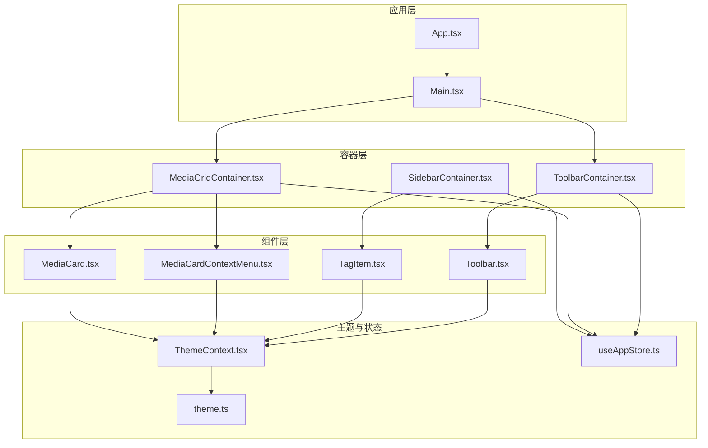
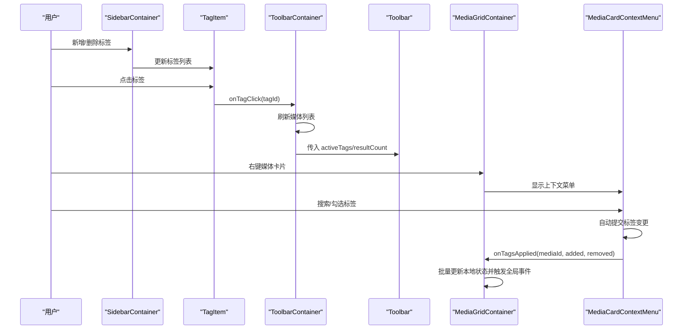
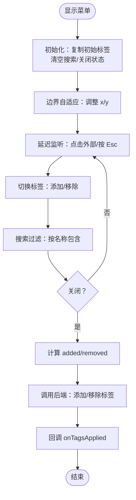
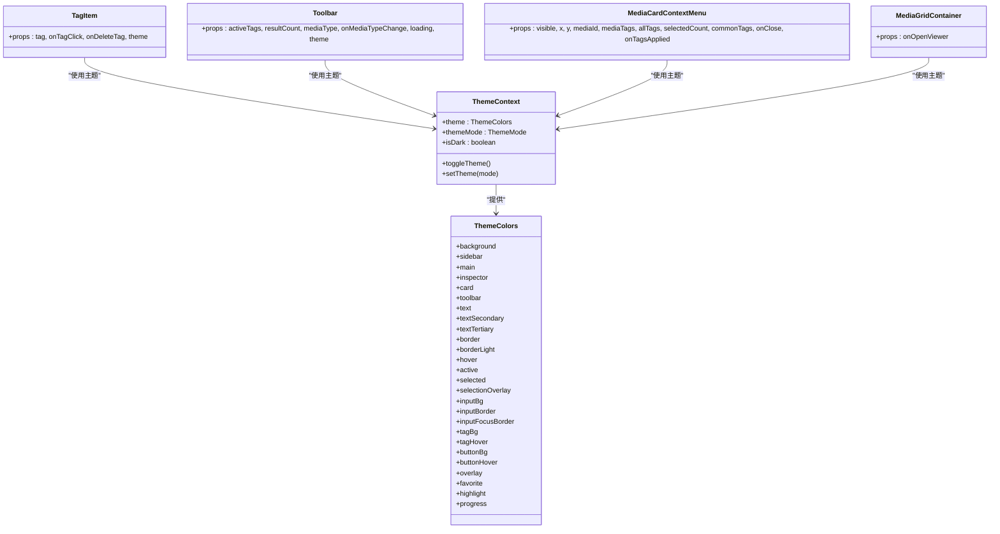

# 工具组件

<cite>
**本文引用的文件**
- [src/components/TagItem.tsx](file://src/components/TagItem.tsx)
- [src/components/Toolbar.tsx](file://src/components/Toolbar.tsx)
- [src/components/Main.tsx](file://src/components/Main.tsx)
- [src/components/MediaCardContextMenu.tsx](file://src/components/MediaCardContextMenu.tsx)
- [src/containers/ToolbarContainer.tsx](file://src/containers/ToolbarContainer.tsx)
- [src/containers/MediaGridContainer.tsx](file://src/containers/MediaGridContainer.tsx)
- [src/containers/SidebarContainer.tsx](file://src/containers/SidebarContainer.tsx)
- [src/components/MediaCard.tsx](file://src/components/MediaCard.tsx)
- [src/contexts/ThemeContext.tsx](file://src/contexts/ThemeContext.tsx)
- [src/theme/theme.ts](file://src/theme/theme.ts)
- [src/store/useAppStore.ts](file://src/store/useAppStore.ts)
- [src/App.tsx](file://src/App.tsx)
</cite>

## 目录
1. [简介](#简介)
2. [项目结构](#项目结构)
3. [核心组件](#核心组件)
4. [架构总览](#架构总览)
5. [组件详解](#组件详解)
6. [依赖关系分析](#依赖关系分析)
7. [性能与可扩展性](#性能与可扩展性)
8. [故障排查指南](#故障排查指南)
9. [结论](#结论)
10. [附录：使用示例与最佳实践](#附录使用示例与最佳实践)

## 简介
本文件聚焦 Medex 工具组件中的 TagItem、Toolbar、Main、MediaCardContextMenu 四个关键辅助组件，系统阐述其设计思路、实现细节、属性配置、事件处理、状态管理、样式定制与主题适配，并给出复用模式与扩展建议。这些组件在整体架构中承担“标签展示与筛选”、“工具栏控制与状态反馈”、“主区域布局与媒体网格容器”以及“媒体卡片上下文菜单与批量标签操作”的职责，是用户与媒体库交互的核心入口。

## 项目结构
Medex 采用容器-组件分层架构：
- 容器负责数据获取、状态管理与事件监听（如 ToolbarContainer、MediaGridContainer、SidebarContainer）。
- 组件负责 UI 呈现与交互（如 Toolbar、TagItem、MediaCardContextMenu、Main）。
- 主题系统通过 ThemeContext 提供主题模式切换与颜色变量注入。
- 全局状态通过 Zustand Store（useAppStore）集中管理导航、标签、媒体项等。

图表来源
- [src/App.tsx:1-73](file://src/App.tsx#L1-L73)
- [src/components/Main.tsx:1-25](file://src/components/Main.tsx#L1-L25)
- [src/containers/ToolbarContainer.tsx:1-113](file://src/containers/ToolbarContainer.tsx#L1-L113)
- [src/containers/MediaGridContainer.tsx:1-619](file://src/containers/MediaGridContainer.tsx#L1-L619)
- [src/containers/SidebarContainer.tsx:1-79](file://src/containers/SidebarContainer.tsx#L1-L79)
- [src/components/Toolbar.tsx:1-75](file://src/components/Toolbar.tsx#L1-L75)
- [src/components/TagItem.tsx:1-70](file://src/components/TagItem.tsx#L1-L70)
- [src/components/MediaCardContextMenu.tsx:1-255](file://src/components/MediaCardContextMenu.tsx#L1-L255)
- [src/components/MediaCard.tsx:1-200](file://src/components/MediaCard.tsx#L1-L200)
- [src/contexts/ThemeContext.tsx:1-99](file://src/contexts/ThemeContext.tsx#L1-L99)
- [src/theme/theme.ts:1-159](file://src/theme/theme.ts#L1-L159)
- [src/store/useAppStore.ts:1-200](file://src/store/useAppStore.ts#L1-L200)

章节来源
- [src/App.tsx:1-73](file://src/App.tsx#L1-L73)
- [src/components/Main.tsx:1-25](file://src/components/Main.tsx#L1-L25)
- [src/containers/ToolbarContainer.tsx:1-113](file://src/containers/ToolbarContainer.tsx#L1-L113)
- [src/containers/MediaGridContainer.tsx:1-619](file://src/containers/MediaGridContainer.tsx#L1-L619)
- [src/containers/SidebarContainer.tsx:1-79](file://src/containers/SidebarContainer.tsx#L1-L79)
- [src/components/Toolbar.tsx:1-75](file://src/components/Toolbar.tsx#L1-L75)
- [src/components/TagItem.tsx:1-70](file://src/components/TagItem.tsx#L1-L70)
- [src/components/MediaCardContextMenu.tsx:1-255](file://src/components/MediaCardContextMenu.tsx#L1-L255)
- [src/components/MediaCard.tsx:1-200](file://src/components/MediaCard.tsx#L1-L200)
- [src/contexts/ThemeContext.tsx:1-99](file://src/contexts/ThemeContext.tsx#L1-L99)
- [src/theme/theme.ts:1-159](file://src/theme/theme.ts#L1-L159)
- [src/store/useAppStore.ts:1-200](file://src/store/useAppStore.ts#L1-L200)

## 核心组件
- TagItem：侧边栏标签项，支持点击选择、悬停高亮、条件删除（仅在未被选中且媒体计数为 0 时显示删除按钮），使用主题色进行视觉反馈。
- Toolbar：顶部工具栏，展示已选标签集合、结果数量、媒体类型过滤（全部/图片/视频），并提供切换交互。
- Main：主区域布局容器，组织标题、工具栏与媒体网格容器，作为页面主骨架。
- MediaCardContextMenu：媒体卡片上下文菜单，支持标签搜索、批量选择、边界自适应定位、Esc/点击外部自动提交，与后端通过 Tauri 事件通信。

章节来源
- [src/components/TagItem.tsx:1-70](file://src/components/TagItem.tsx#L1-L70)
- [src/components/Toolbar.tsx:1-75](file://src/components/Toolbar.tsx#L1-L75)
- [src/components/Main.tsx:1-25](file://src/components/Main.tsx#L1-L25)
- [src/components/MediaCardContextMenu.tsx:1-255](file://src/components/MediaCardContextMenu.tsx#L1-L255)

## 架构总览
组件间协作流程（以标签筛选与媒体网格为例）：
- SidebarContainer 从数据库加载标签并维护本地状态，向 TagItem 传递 onTagClick 与 onDeleteTag。
- ToolbarContainer 基于选中标签与媒体类型过滤调用后端接口，刷新媒体列表并在 UI 上展示结果数量。
- MediaGridContainer 负责媒体网格渲染、多选、右键上下文菜单、缩略图队列与异步加载、收藏切换、批量标签应用。
- MediaCardContextMenu 在可见状态下计算边界位置、处理搜索与选中状态变更，并在关闭时自动提交标签变更。

图表来源
- [src/containers/SidebarContainer.tsx:1-79](file://src/containers/SidebarContainer.tsx#L1-L79)
- [src/components/TagItem.tsx:1-70](file://src/components/TagItem.tsx#L1-L70)
- [src/containers/ToolbarContainer.tsx:1-113](file://src/containers/ToolbarContainer.tsx#L1-L113)
- [src/components/Toolbar.tsx:1-75](file://src/components/Toolbar.tsx#L1-L75)
- [src/containers/MediaGridContainer.tsx:1-619](file://src/containers/MediaGridContainer.tsx#L1-L619)
- [src/components/MediaCardContextMenu.tsx:1-255](file://src/components/MediaCardContextMenu.tsx#L1-L255)

## 组件详解

### TagItem 组件
- 设计目标：在侧边栏中直观展示标签，支持选择与删除；在未选中且无媒体关联时允许删除。
- 关键属性
  - tag: SidebarTagItem（包含 id、name、selected、mediaCount）
  - onTagClick: (tagId: string) => void
  - onDeleteTag: (tagId: string) => void
  - theme: ThemeColors
- 行为与交互
  - 点击标签：触发 onTagClick(tagId)，用于切换选中状态。
  - 删除按钮：仅当 tag.selected 为真且 mediaCount 为 0 时显示；点击时阻止事件冒泡并调用 onDeleteTag(tagId)。
  - 悬停高亮：未选中时鼠标进入改变背景色，离开恢复透明。
  - 标题提示：显示标签名与媒体数量。
- 样式与主题
  - 背景色与文字色根据是否选中切换 theme.selected 与 theme.text 或 theme.textSecondary。
  - 删除按钮悬停使用红色系高亮。
- 复用与扩展
  - 可封装为通用标签项，支持禁用态、只读态、批量操作等扩展点。
  - 可引入图标、快捷键、右键菜单等增强交互。

章节来源
- [src/components/TagItem.tsx:1-70](file://src/components/TagItem.tsx#L1-L70)
- [src/store/useAppStore.ts:9-14](file://src/store/useAppStore.ts#L9-L14)
- [src/theme/theme.ts:8-52](file://src/theme/theme.ts#L8-L52)

### Toolbar 组件
- 设计目标：顶部工具栏，展示当前选中标签、结果数量与媒体类型过滤按钮。
- 关键属性
  - activeTags: string[]
  - resultCount: number
  - mediaType: 'all' | 'image' | 'video'
  - onMediaTypeChange: (mode: 'all' | 'image' | 'video') => void
  - loading?: boolean
  - theme: ThemeColors
- 行为与交互
  - 标签集合：遍历 activeTags 渲染标签徽章，未选择时显示占位文案。
  - 结果数量：右侧显示 resultCount。
  - 类型切换：三个按钮（All/Image/Video），当前模式高亮，悬停改变背景与文字色。
- 样式与主题
  - 整体背景使用 theme.toolbar，标签徽章使用 theme.tagBg 与 theme.text。
  - 按钮在非当前模式下悬停使用 theme.tagHover 与 theme.text，当前模式使用 theme.active 与 theme.text。
- 复用与扩展
  - 可增加搜索框、排序控件、批量操作按钮等。
  - 可引入 loading 状态指示器。

章节来源
- [src/components/Toolbar.tsx:1-75](file://src/components/Toolbar.tsx#L1-L75)
- [src/theme/theme.ts:8-52](file://src/theme/theme.ts#L8-L52)

### Main 组件
- 设计目标：主区域布局，承载标题、工具栏与媒体网格容器。
- 关键属性
  - onOpenViewer: (mediaId: string) => void
- 行为与交互
  - 渲染标题与工具栏容器 ToolbarContainer。
  - 媒体网格容器 MediaGridContainer 接收 onOpenViewer，用于双击打开媒体查看器。
- 复用与扩展
  - 可拆分为 Header、Content 区域，便于在不同页面复用。
  - 可引入分页、加载更多、空态占位等。

章节来源
- [src/components/Main.tsx:1-25](file://src/components/Main.tsx#L1-L25)

### MediaCardContextMenu 组件
- 设计目标：媒体卡片右键上下文菜单，支持标签搜索、批量选择、自动提交与边界自适应。
- 关键属性
  - visible: boolean
  - x: number, y: number
  - mediaId: string
  - mediaTags: string[]
  - allTags: Tag[]
  - selectedCount?: number
  - commonTags?: string[]
  - onClose: () => void
  - onTagsApplied: (mediaId: string, addedTags: string[], removedTags: string[]) => void
- 行为与交互
  - 初始化：visible 为真时复制初始标签，清空搜索，重置关闭状态。
  - 边界处理：根据菜单尺寸与窗口尺寸调整 x/y，避免溢出。
  - 自动提交：关闭时计算 added/removed 并调用后端接口，随后回调 onTagsApplied。
  - 外部点击与 Esc：延迟添加监听，避免立即触发；Esc 触发关闭。
  - 标签切换：toggleTag 切换选中状态；搜索过滤 allTags。
- 数据与状态
  - 使用 useRef 存储初始标签，useState 管理选中标签、搜索词、调整后的坐标与关闭状态。
  - 通过 ThemeContext 获取主题色，统一风格。
- 后端集成
  - 使用 @tauri-apps/api 的 invoke 调用后端命令：add_tag_to_media、get_tags_by_media、remove_tag_from_media。
- 复用与扩展
  - 可扩展为“批量标签编辑器”，支持多选媒体、公共标签高亮、一键移除等。
  - 可加入撤销/重做、标签历史、标签云等高级功能。

图表来源
- [src/components/MediaCardContextMenu.tsx:1-255](file://src/components/MediaCardContextMenu.tsx#L1-L255)

章节来源
- [src/components/MediaCardContextMenu.tsx:1-255](file://src/components/MediaCardContextMenu.tsx#L1-L255)
- [src/contexts/ThemeContext.tsx:1-99](file://src/contexts/ThemeContext.tsx#L1-L99)

## 依赖关系分析
- 主题系统
  - ThemeContext 提供 themeMode（dark/light/system）、isDark、toggleTheme、setTheme 与 theme 对象。
  - theme.ts 定义 ThemeColors 接口与深/浅主题颜色映射，支持根据深色主题自动生成浅色主题。
- 状态管理
  - useAppStore 提供 navItems、tags、mediaItems、selectedMediaId、viewMode、mediaTypeFilter 等状态与相关动作。
- 容器与组件
  - SidebarContainer 与 ToolbarContainer 分别消费 useAppStore 并通过 invoke 与后端交互。
  - MediaGridContainer 负责媒体网格渲染、多选、上下文菜单、缩略图队列与事件监听。
- 组件间耦合
  - TagItem 与 SidebarContainer 通过 onTagClick/onDeleteTag 解耦。
  - MediaCardContextMenu 与 MediaGridContainer 通过 visible/x/y/mediaId/mediaTags/allTags/onClose/onTagsApplied 解耦。
  - Toolbar 与 ToolbarContainer 通过 activeTags/resultCount/mediaType/onMediaTypeChange 解耦。

图表来源
- [src/contexts/ThemeContext.tsx:1-99](file://src/contexts/ThemeContext.tsx#L1-L99)
- [src/theme/theme.ts:8-52](file://src/theme/theme.ts#L8-L52)
- [src/components/TagItem.tsx:1-70](file://src/components/TagItem.tsx#L1-L70)
- [src/components/Toolbar.tsx:1-75](file://src/components/Toolbar.tsx#L1-L75)
- [src/components/MediaCardContextMenu.tsx:1-255](file://src/components/MediaCardContextMenu.tsx#L1-L255)
- [src/containers/MediaGridContainer.tsx:1-619](file://src/containers/MediaGridContainer.tsx#L1-L619)

章节来源
- [src/contexts/ThemeContext.tsx:1-99](file://src/contexts/ThemeContext.tsx#L1-L99)
- [src/theme/theme.ts:1-159](file://src/theme/theme.ts#L1-L159)
- [src/store/useAppStore.ts:1-200](file://src/store/useAppStore.ts#L1-L200)

## 性能与可扩展性
- 性能优化
  - 缩略图队列与并发控制：MediaGridContainer 中通过任务队列与并发上限控制缩略图请求，避免阻塞 UI。
  - 可见范围渲染：根据可视区域动态入队视频缩略图，减少不必要的请求。
  - 事件监听去抖：对媒体过滤与库路径检查使用定时器与事件监听，降低频繁刷新。
- 可扩展性
  - 主题系统：ThemeContext 支持系统跟随、深浅主题切换，主题变量集中管理，便于扩展新颜色语义。
  - 容器-组件解耦：通过 props 与回调解耦，便于替换或扩展子组件。
  - 批量操作：MediaCardContextMenu 已支持批量标签应用，可进一步扩展为“标签策略引擎”。

[本节为通用性能讨论，不直接分析具体文件]

## 故障排查指南
- 标签删除不可见
  - 检查 TagItem 的删除条件：仅在 tag.selected 为真且 mediaCount 为 0 时显示删除按钮。
  - 确认 onDeleteTag 回调正确绑定至 SidebarContainer 的删除逻辑。
- 上下文菜单不显示或无法提交
  - 检查 visible 与初始标签复制逻辑，确认 mediaId 有效且为数字。
  - 确认外部点击与 Esc 监听已延迟添加，避免立即关闭。
  - 检查后端命令调用返回值与错误日志。
- 工具栏标签不更新
  - 确认 ToolbarContainer 正确订阅标签选中状态变化并调用 filter_media。
  - 检查 resultCount 来源与媒体列表长度一致性。
- 主题不生效
  - 确认 ThemeProvider 已包裹应用根节点，ThemeContext 返回的 theme 对象有效。
  - 检查主题模式存储与系统偏好同步逻辑。

章节来源
- [src/components/TagItem.tsx:12-12](file://src/components/TagItem.tsx#L12-L12)
- [src/components/MediaCardContextMenu.tsx:81-93](file://src/components/MediaCardContextMenu.tsx#L81-L93)
- [src/containers/ToolbarContainer.tsx:25-56](file://src/containers/ToolbarContainer.tsx#L25-L56)
- [src/contexts/ThemeContext.tsx:17-90](file://src/contexts/ThemeContext.tsx#L17-L90)

## 结论
TagItem、Toolbar、Main、MediaCardContextMenu 在 Medex 中分别承担“标签交互”、“筛选控制”、“页面布局”与“批量标签编辑”的职责。它们通过容器-组件分层、主题系统与全局状态协同工作，形成清晰的职责边界与良好的可扩展性。建议在后续迭代中进一步抽象通用交互模式、增强批量操作能力与主题定制灵活性。

[本节为总结性内容，不直接分析具体文件]

## 附录：使用示例与最佳实践
- 使用示例
  - 在侧边栏中渲染标签项：传入 SidebarTagItem、onTagClick、onDeleteTag 与 theme。
  - 在工具栏中展示选中标签与结果数量：传入 activeTags、resultCount、mediaType 与 onMediaTypeChange。
  - 在主区域中组合工具栏与媒体网格：传入 onOpenViewer 以支持双击打开媒体查看器。
  - 在媒体网格中启用上下文菜单：传入 visible、x、y、mediaId、mediaTags、allTags、onClose、onTagsApplied。
- 最佳实践
  - 保持组件纯函数式：通过 props 传递行为与状态，避免在组件内直接访问全局状态。
  - 主题统一：所有组件使用 ThemeContext 注入的颜色变量，确保视觉一致性。
  - 事件解耦：通过回调与全局事件（如 medex:tags-updated）进行跨组件通信。
  - 错误处理：对后端调用进行 try/catch 并提供用户友好的提示。
  - 可访问性：为按钮与输入框提供 aria-label 与 title，提升可访问性。
  - 性能优先：对高频操作（如滚动、缩略图请求）使用队列与节流策略。

[本节为通用指导，不直接分析具体文件]