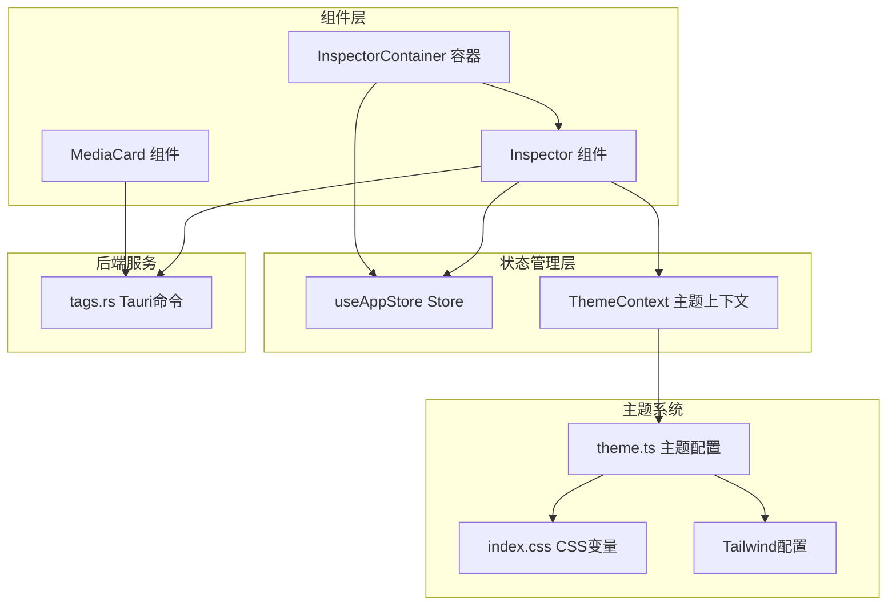
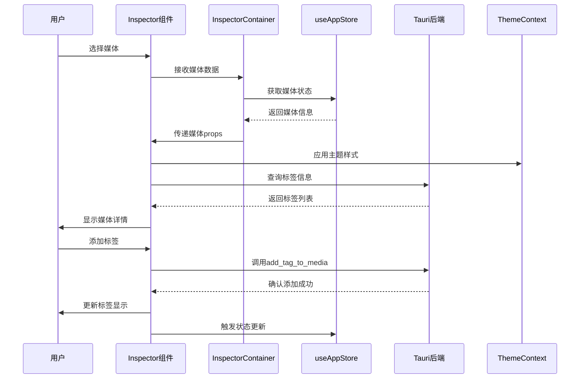
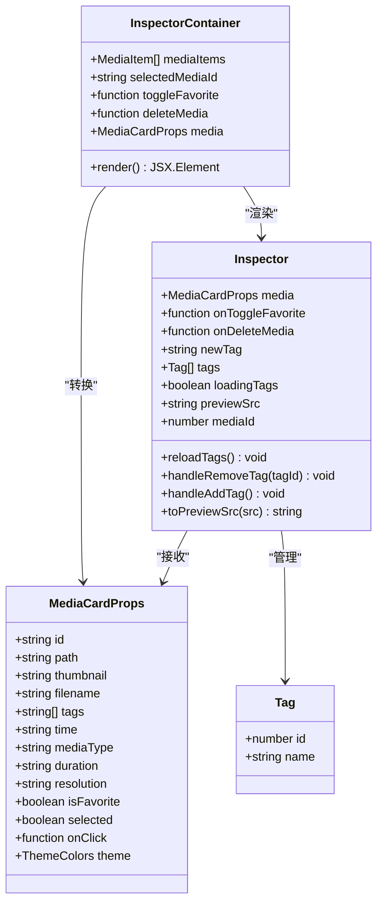
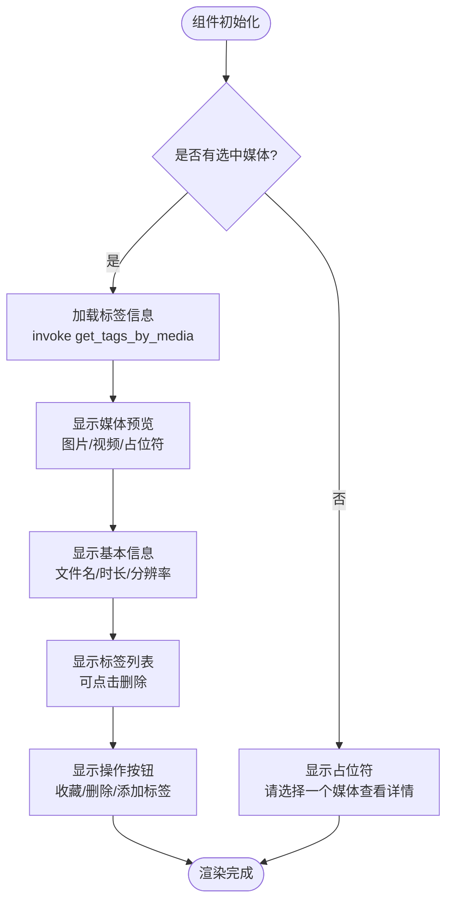
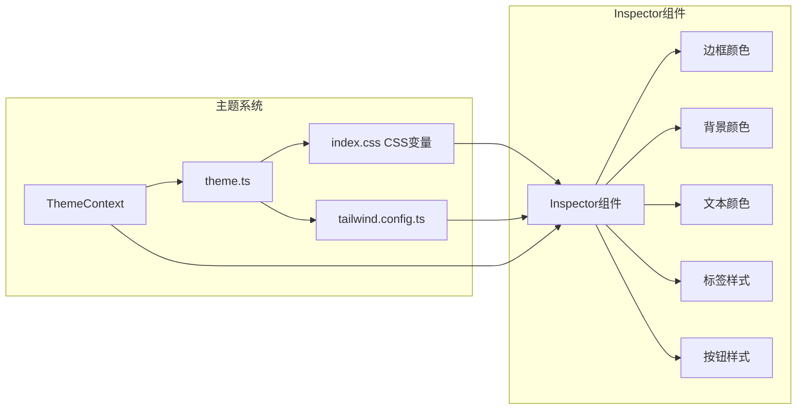
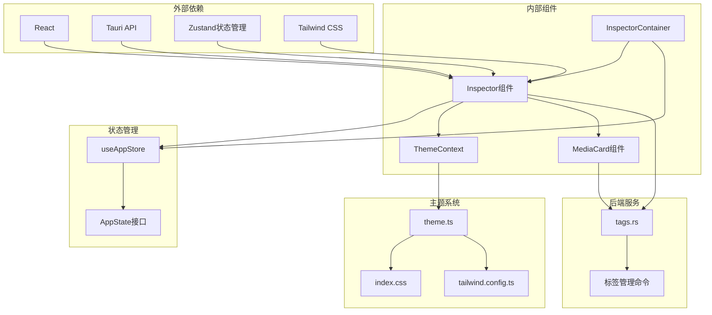

# Inspector 检查器组件

<cite>
**本文档引用的文件**
- [Inspector.tsx](file://src/components/Inspector.tsx)
- [InspectorContainer.tsx](file://src/containers/InspectorContainer.tsx)
- [useAppStore.ts](file://src/store/useAppStore.ts)
- [ThemeContext.tsx](file://src/contexts/ThemeContext.tsx)
- [theme.ts](file://src/theme/theme.ts)
- [MediaCard.tsx](file://src/components/MediaCard.tsx)
- [App.tsx](file://src/App.tsx)
- [tags.rs](file://src-tauri/src/services/tags.rs)
- [index.css](file://src/index.css)
- [tailwind.config.ts](file://tailwind.config.ts)
</cite>

## 目录
1. [简介](#简介)
2. [项目结构](#项目结构)
3. [核心组件](#核心组件)
4. [架构概览](#架构概览)
5. [详细组件分析](#详细组件分析)
6. [依赖关系分析](#依赖关系分析)
7. [性能考虑](#性能考虑)
8. [故障排除指南](#故障排除指南)
9. [结论](#结论)
10. [附录](#附录)

## 简介

Inspector 检查器组件是 Medex 媒体管理应用中的核心信息展示组件，负责显示所选媒体的详细信息、元数据管理和标签操作。该组件提供了完整的媒体信息查看、标签管理、收藏操作和删除功能，支持响应式设计和主题适配。

## 项目结构

Inspector 组件在项目中的位置和组织方式如下：



**图表来源**
- [Inspector.tsx:1-277](file://src/components/Inspector.tsx#L1-L277)
- [InspectorContainer.tsx:1-32](file://src/containers/InspectorContainer.tsx#L1-L32)
- [useAppStore.ts:1-395](file://src/store/useAppStore.ts#L1-L395)

**章节来源**
- [Inspector.tsx:1-277](file://src/components/Inspector.tsx#L1-L277)
- [InspectorContainer.tsx:1-32](file://src/containers/InspectorContainer.tsx#L1-L32)

## 核心组件

Inspector 组件是一个功能完整的媒体信息检查器，具有以下核心特性：

### 主要功能模块

1. **媒体预览展示**
   - 支持图片和视频预览
   - 自动检测远程和本地资源
   - 悬停缩放效果

2. **标签管理系统**
   - 实时标签显示和编辑
   - 标签添加和删除功能
   - 标签去重和验证

3. **媒体信息展示**
   - 文件名显示
   - 时长和分辨率信息
   - 收藏状态管理

4. **操作控制面板**
   - 收藏/取消收藏
   - 删除媒体
   - 标签输入和提交

**章节来源**
- [Inspector.tsx:13-277](file://src/components/Inspector.tsx#L13-L277)

## 架构概览

Inspector 组件采用容器-组件模式，通过状态管理实现数据流控制：



**图表来源**
- [InspectorContainer.tsx:6-31](file://src/containers/InspectorContainer.tsx#L6-L31)
- [useAppStore.ts:145-394](file://src/store/useAppStore.ts#L145-L394)
- [tags.rs:127-164](file://src-tauri/src/services/tags.rs#L127-L164)

## 详细组件分析

### Inspector 组件架构



**图表来源**
- [Inspector.tsx:8-277](file://src/components/Inspector.tsx#L8-L277)
- [InspectorContainer.tsx:15-22](file://src/containers/InspectorContainer.tsx#L15-L22)

### 数据绑定和状态管理

Inspector 组件通过以下方式实现数据绑定：

1. **单向数据流**
   - 从 useAppStore 获取媒体状态
   - 通过 props 传递给 Inspector 组件
   - 状态变更触发重新渲染

2. **事件处理机制**
   - 收藏状态切换
   - 媒体删除操作
   - 标签管理操作

3. **实时更新机制**
   - 监听全局标签更新事件
   - 自动刷新标签列表
   - 实时同步后端状态

**章节来源**
- [Inspector.tsx:19-265](file://src/components/Inspector.tsx#L19-L265)
- [InspectorContainer.tsx:6-31](file://src/containers/InspectorContainer.tsx#L6-L31)

### 媒体信息展示逻辑

Inspector 组件实现了完整的媒体信息展示功能：



**图表来源**
- [Inspector.tsx:101-262](file://src/components/Inspector.tsx#L101-L262)

### 标签管理系统

标签管理是 Inspector 组件的核心功能之一：

1. **标签获取**
   - 通过 Tauri 命令 `get_tags_by_media` 获取标签
   - 异步加载，显示加载状态
   - 错误处理和用户提示

2. **标签添加**
   - 输入验证和去重检查
   - 调用 `add_tag_to_media` 命令
   - 实时更新界面显示

3. **标签删除**
   - 点击标签触发删除
   - 调用 `remove_tag_from_media` 命令
   - 更新全局状态和界面

**章节来源**
- [Inspector.tsx:27-88](file://src/components/Inspector.tsx#L27-L88)
- [tags.rs:127-188](file://src-tauri/src/services/tags.rs#L127-L188)

### 主题适配和样式系统

Inspector 组件完全集成到主题系统中：



**图表来源**
- [ThemeContext.tsx:17-98](file://src/contexts/ThemeContext.tsx#L17-L98)
- [theme.ts:54-158](file://src/theme/theme.ts#L54-L158)
- [index.css:9-108](file://src/index.css#L9-L108)

**章节来源**
- [Inspector.tsx:90-98](file://src/components/Inspector.tsx#L90-L98)
- [ThemeContext.tsx:76-83](file://src/contexts/ThemeContext.tsx#L76-L83)

## 依赖关系分析

Inspector 组件的依赖关系图：



**图表来源**
- [Inspector.tsx:1-6](file://src/components/Inspector.tsx#L1-L6)
- [InspectorContainer.tsx:2-4](file://src/containers/InspectorContainer.tsx#L2-L4)
- [useAppStore.ts:145-146](file://src/store/useAppStore.ts#L145-L146)

**章节来源**
- [Inspector.tsx:1-277](file://src/components/Inspector.tsx#L1-L277)
- [useAppStore.ts:145-394](file://src/store/useAppStore.ts#L145-L394)

## 性能考虑

Inspector 组件在性能方面采用了多种优化策略：

### 渲染优化
- 使用 React.memo 优化 MediaCard 组件渲染
- 条件渲染避免不必要的 DOM 更新
- 图片懒加载和错误处理

### 状态管理优化
- 局部状态管理减少全局状态更新
- 事件监听器清理防止内存泄漏
- 异步操作的错误边界处理

### 资源管理
- 预览视频的 metadata 预加载
- 主题切换的 CSS 变量缓存
- 标签操作的防抖处理

**章节来源**
- [MediaCard.tsx:317-318](file://src/components/MediaCard.tsx#L317-L318)
- [Inspector.tsx:47-53](file://src/components/Inspector.tsx#L47-L53)

## 故障排除指南

### 常见问题和解决方案

1. **标签无法加载**
   - 检查 Tauri 命令 `get_tags_by_media` 是否正常工作
   - 验证媒体 ID 是否有效
   - 查看控制台错误日志

2. **标签添加失败**
   - 确认标签名称非空且唯一
   - 检查数据库连接状态
   - 验证权限设置

3. **媒体预览显示异常**
   - 检查文件路径格式
   - 验证 Tauri convertFileSrc 转换
   - 确认文件访问权限

4. **主题样式不生效**
   - 检查 CSS 变量是否正确设置
   - 验证 Tailwind 配置
   - 确认主题模式切换逻辑

**章节来源**
- [Inspector.tsx:36-40](file://src/components/Inspector.tsx#L36-L40)
- [Inspector.tsx:82-85](file://src/components/Inspector.tsx#L82-L85)

## 结论

Inspector 检查器组件是一个功能完整、架构清晰的媒体信息管理组件。它通过容器-组件模式实现了良好的关注点分离，通过状态管理确保了数据的一致性，通过主题系统提供了优秀的视觉体验。组件的设计充分考虑了性能优化和用户体验，在标签管理、媒体预览和状态同步等方面都表现出色。

## 附录

### 使用示例

#### 基本使用
```typescript
// 在容器中使用 Inspector
<InspectorContainer />

// 直接使用 Inspector 组件
<Inspector 
  media={selectedMedia}
  onToggleFavorite={toggleFavorite}
  onDeleteMedia={deleteMedia}
/>
```

#### 配置选项
- `media`: 媒体对象，包含路径、缩略图、文件名等信息
- `onToggleFavorite`: 收藏状态切换回调函数
- `onDeleteMedia`: 媒体删除回调函数

#### 扩展指南
1. **自定义主题**
   - 修改 theme.ts 中的颜色配置
   - 更新 CSS 变量定义
   - 调整 Tailwind 配置

2. **添加新功能**
   - 扩展 InspectorProps 接口
   - 实现新的事件处理器
   - 更新状态管理逻辑

3. **性能优化**
   - 添加更多的 React.memo 优化
   - 实现虚拟滚动用于大量标签
   - 优化图片加载策略

**章节来源**
- [Inspector.tsx:13-17](file://src/components/Inspector.tsx#L13-L17)
- [theme.ts:8-52](file://src/theme/theme.ts#L8-L52)