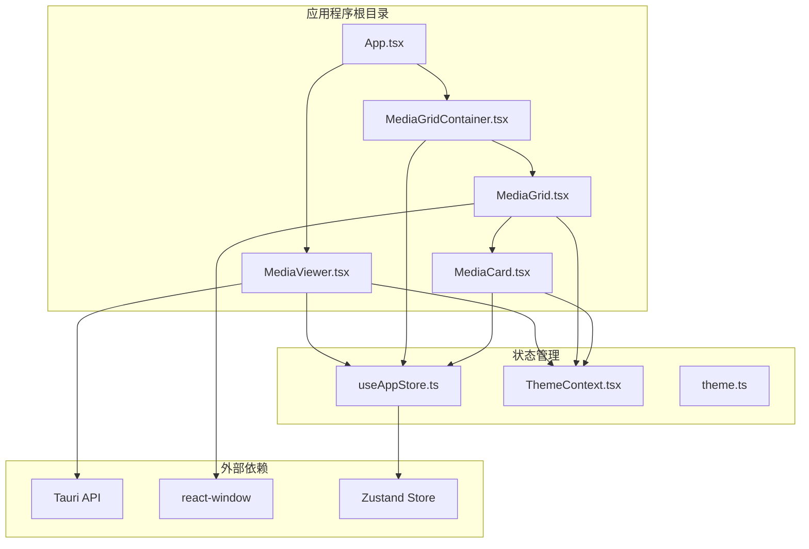
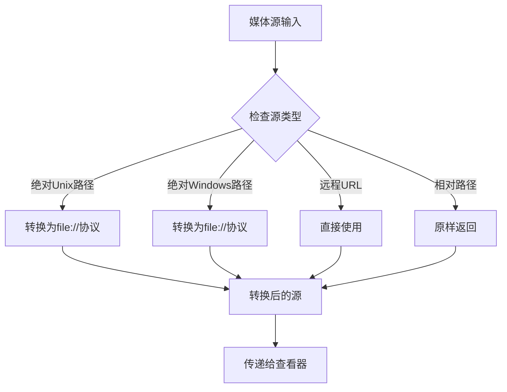
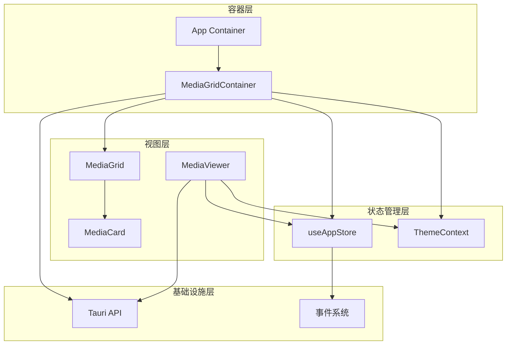
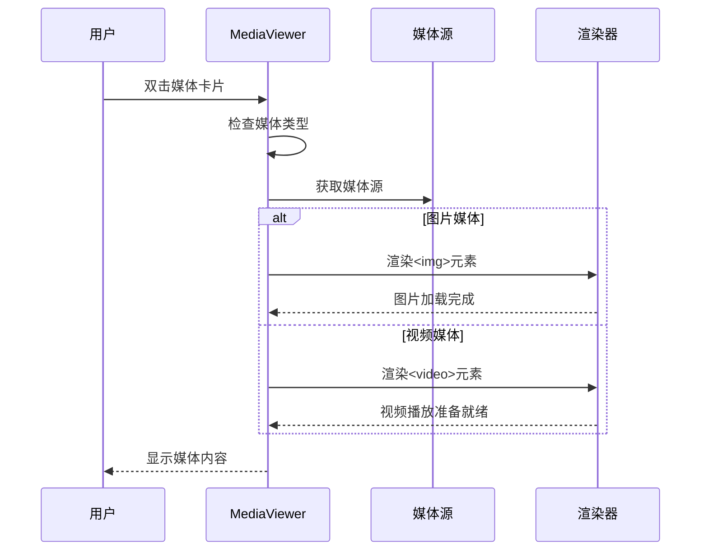
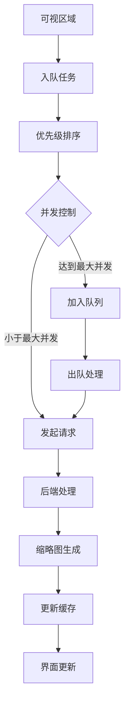
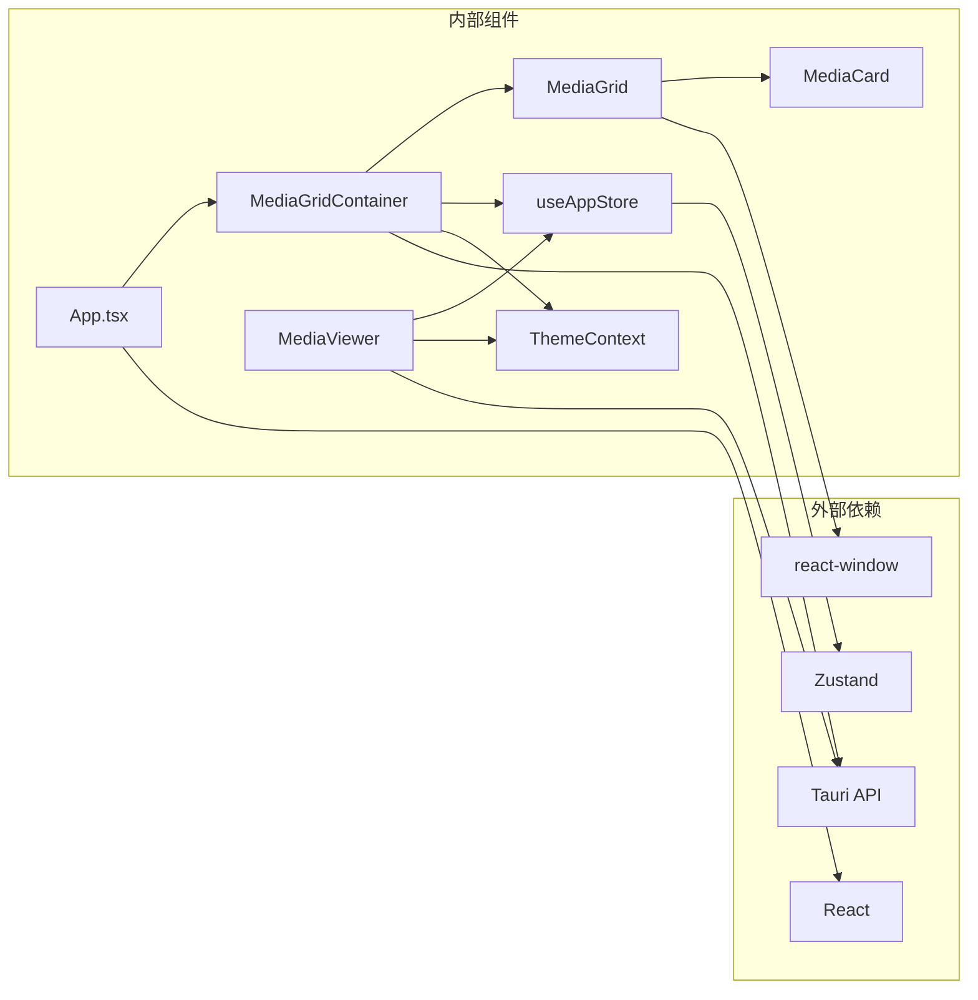
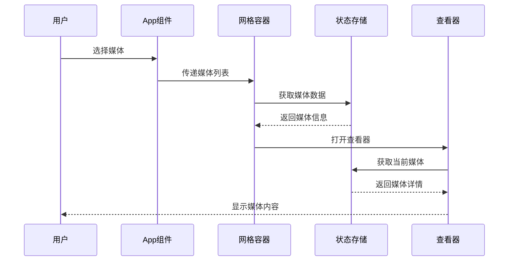

# MediaViewer 媒体查看器组件

<cite>
**本文档引用的文件**
- [MediaViewer.tsx](file://src/components/MediaViewer.tsx)
- [MediaGrid.tsx](file://src/components/MediaGrid.tsx)
- [MediaCard.tsx](file://src/components/MediaCard.tsx)
- [MediaGridContainer.tsx](file://src/containers/MediaGridContainer.tsx)
- [useAppStore.ts](file://src/store/useAppStore.ts)
- [App.tsx](file://src/App.tsx)
- [ThemeContext.tsx](file://src/contexts/ThemeContext.tsx)
- [theme.ts](file://src/theme/theme.ts)
- [DEVELOPMENT.md](file://DEVELOPMENT.md)
</cite>

## 目录
1. [简介](#简介)
2. [项目结构](#项目结构)
3. [核心组件](#核心组件)
4. [架构概览](#架构概览)
5. [详细组件分析](#详细组件分析)
6. [依赖关系分析](#依赖关系分析)
7. [性能考虑](#性能考虑)
8. [故障排除指南](#故障排除指南)
9. [结论](#结论)
10. [附录](#附录)

## 简介

MediaViewer 是 Medex 应用程序中的媒体查看器组件，负责提供高质量的媒体预览体验。该组件支持图片和视频两种媒体类型的预览，具备完整的导航控制、键盘快捷键支持和响应式设计。

组件采用现代化的 React 架构，结合 Tauri 平台特性，实现了高效的本地文件访问和跨平台兼容性。通过智能的媒体源处理和缓存策略，确保用户获得流畅的媒体浏览体验。

## 项目结构

MediaViewer 组件位于应用程序的组件层次结构中，与媒体网格、存储管理和主题系统紧密集成：



**图表来源**
- [App.tsx:1-73](file://src/App.tsx#L1-L73)
- [MediaViewer.tsx:1-186](file://src/components/MediaViewer.tsx#L1-L186)
- [MediaGridContainer.tsx:1-619](file://src/containers/MediaGridContainer.tsx#L1-L619)

**章节来源**
- [App.tsx:1-73](file://src/App.tsx#L1-L73)
- [MediaViewer.tsx:1-186](file://src/components/MediaViewer.tsx#L1-L186)
- [MediaGridContainer.tsx:1-619](file://src/containers/MediaGridContainer.tsx#L1-L619)

## 核心组件

### MediaViewer 组件

MediaViewer 是媒体查看器的核心组件，提供全屏媒体预览功能。该组件具有以下关键特性：

- **双模式媒体支持**：同时支持图片和视频媒体类型
- **键盘导航**：支持 Esc、左右箭头键进行关闭和导航
- **响应式设计**：自适应不同屏幕尺寸
- **主题集成**：与应用主题系统无缝集成
- **安全索引管理**：防止数组越界访问

### 媒体源处理机制

组件实现了智能的媒体源转换系统，支持多种媒体源类型：



**图表来源**
- [MediaViewer.tsx:176-185](file://src/components/MediaViewer.tsx#L176-L185)

**章节来源**
- [MediaViewer.tsx:6-12](file://src/components/MediaViewer.tsx#L6-L12)
- [MediaViewer.tsx:176-185](file://src/components/MediaViewer.tsx#L176-L185)

## 架构概览

MediaViewer 采用分层架构设计，各组件职责明确：



**图表来源**
- [App.tsx:28-72](file://src/App.tsx#L28-L72)
- [MediaGridContainer.tsx:30-619](file://src/containers/MediaGridContainer.tsx#L30-L619)
- [useAppStore.ts:145-395](file://src/store/useAppStore.ts#L145-L395)

## 详细组件分析

### MediaViewer 组件详解

#### 组件接口定义

MediaViewer 接受以下属性：

| 属性名 | 类型 | 必需 | 描述 |
|--------|------|------|------|
| open | boolean | 是 | 控制查看器显示/隐藏 |
| mediaList | MediaItem[] | 是 | 媒体项目数组 |
| currentIndex | number | 是 | 当前选中媒体的索引 |
| onClose | () => void | 是 | 关闭查看器回调函数 |
| onChangeIndex | (index: number) => void | 是 | 切换媒体索引回调函数 |

#### 媒体类型处理逻辑

组件根据媒体类型选择不同的渲染方式：



**图表来源**
- [MediaViewer.tsx:153-171](file://src/components/MediaViewer.tsx#L153-L171)

#### 键盘交互处理

组件支持以下键盘快捷键：

| 键位 | 功能 | 说明 |
|------|------|------|
| Escape | 关闭查看器 | 退出全屏预览模式 |
| ← ArrowLeft | 上一张 | 切换到前一个媒体 |
| → ArrowRight | 下一张 | 切换到后一个媒体 |

#### 主题系统集成

MediaViewer 与应用主题系统深度集成，支持：

- **动态主题切换**：支持深色、浅色和系统主题
- **透明遮罩层**：使用主题色生成半透明背景
- **交互元素样式**：按钮、导航等元素遵循主题色彩

**章节来源**
- [MediaViewer.tsx:14-174](file://src/components/MediaViewer.tsx#L14-L174)
- [ThemeContext.tsx:17-99](file://src/contexts/ThemeContext.tsx#L17-L99)
- [theme.ts:8-52](file://src/theme/theme.ts#L8-L52)

### 媒体网格与卡片系统

#### MediaGrid 组件

MediaGrid 提供高性能的媒体网格渲染，采用虚拟滚动技术：

- **固定大小网格**：使用 react-window 实现高性能渲染
- **响应式布局**：根据容器宽度自动计算列数
- **可视区域检测**：智能预加载可见区域媒体
- **主题适配**：完全支持主题系统

#### MediaCard 组件

每个媒体卡片包含以下功能：

- **媒体预览**：支持图片和视频缩略图
- **标签管理**：支持标签的添加和删除
- **收藏功能**：支持媒体收藏状态管理
- **上下文菜单**：右键菜单支持标签操作

**章节来源**
- [MediaGrid.tsx:70-212](file://src/components/MediaGrid.tsx#L70-L212)
- [MediaCard.tsx:34-264](file://src/components/MediaCard.tsx#L34-L264)

### 缓存与性能优化

#### 缩略图缓存系统

MediaGridContainer 实现了智能的缩略图缓存机制：



**图表来源**
- [MediaGridContainer.tsx:352-486](file://src/containers/MediaGridContainer.tsx#L352-L486)

#### 性能优化策略

组件采用了多项性能优化措施：

- **虚拟滚动**：使用 react-window 减少 DOM 元素数量
- **懒加载**：图片和视频采用懒加载策略
- **缓存机制**：缩略图和媒体源结果缓存
- **并发控制**：限制同时进行的缩略图请求数量
- **内存管理**：及时清理不再使用的资源

**章节来源**
- [MediaGridContainer.tsx:27-28](file://src/containers/MediaGridContainer.tsx#L27-L28)
- [MediaGridContainer.tsx:352-486](file://src/containers/MediaGridContainer.tsx#L352-L486)

## 依赖关系分析

### 组件间依赖关系



**图表来源**
- [App.tsx:1-73](file://src/App.tsx#L1-L73)
- [MediaGridContainer.tsx:1-619](file://src/containers/MediaGridContainer.tsx#L1-L619)
- [MediaViewer.tsx:1-186](file://src/components/MediaViewer.tsx#L1-L186)

### 数据流分析

组件间的数据流向清晰明确：



**图表来源**
- [App.tsx:28-57](file://src/App.tsx#L28-L57)
- [MediaGridContainer.tsx:210-243](file://src/containers/MediaGridContainer.tsx#L210-L243)

**章节来源**
- [useAppStore.ts:145-395](file://src/store/useAppStore.ts#L145-L395)
- [App.tsx:16-26](file://src/App.tsx#L16-L26)

## 性能考虑

### 内存管理

组件实现了完善的内存管理策略：

- **自动清理**：组件卸载时自动清理事件监听器
- **资源释放**：视频元素暂停播放并释放资源
- **缓存控制**：合理控制缓存大小，避免内存泄漏

### 加载优化

- **渐进式加载**：缩略图采用渐进式加载，提升用户体验
- **预加载策略**：智能预加载下一个媒体，减少等待时间
- **错误处理**：完善的错误处理机制，确保应用稳定性

### 渲染优化

- **虚拟滚动**：仅渲染可见区域内的媒体卡片
- **记忆化**：使用 useMemo 和 useCallback 优化渲染性能
- **批量更新**：合并状态更新，减少不必要的重渲染

## 故障排除指南

### 常见问题及解决方案

#### 本地文件无法预览

**问题描述**：使用绝对路径访问本地文件时无法显示

**解决方案**：
1. 确保使用 `convertFileSrc()` 函数转换文件路径
2. 检查文件权限和路径有效性
3. 验证 Tauri 权限配置

#### 缩略图加载失败

**问题描述**：视频缩略图无法正常加载

**解决方案**：
1. 检查系统是否安装了 ffmpeg
2. 验证视频文件格式是否受支持
3. 确认缩略图生成服务正常运行

#### 性能问题

**问题描述**：页面出现卡顿或白屏现象

**解决方案**：
1. 检查是否正确使用了虚拟滚动
2. 确认缩略图请求并发数量合理
3. 避免在网格中批量挂载视频元素

**章节来源**
- [DEVELOPMENT.md:564-596](file://DEVELOPMENT.md#L564-L596)

## 结论

MediaViewer 媒体查看器组件是一个功能完整、性能优异的媒体预览解决方案。通过精心设计的架构和多项优化策略，该组件能够为用户提供流畅、稳定的媒体浏览体验。

组件的主要优势包括：

- **全面的媒体支持**：同时支持图片和视频媒体类型
- **优秀的性能表现**：采用虚拟滚动和智能缓存策略
- **良好的用户体验**：支持键盘导航和主题切换
- **可靠的错误处理**：完善的异常处理和降级策略

未来可以考虑的功能增强方向：
- 支持更多媒体格式
- 添加手势控制支持
- 实现媒体缩放和旋转功能
- 增强离线缓存能力

## 附录

### 使用示例

#### 基本使用方法

```typescript
// 在应用中使用 MediaViewer
const handleOpenViewer = (mediaId: string) => {
  // 实现媒体查看器打开逻辑
};

// 传递给组件
<MediaViewer
  open={viewerOpen}
  mediaList={viewerMediaList}
  currentIndex={currentIndex}
  onClose={handleCloseViewer}
  onChangeIndex={setCurrentIndex}
/>
```

#### 配置选项

| 选项名 | 类型 | 默认值 | 描述 |
|--------|------|--------|------|
| open | boolean | false | 控制查看器显示状态 |
| mediaList | MediaItem[] | [] | 媒体项目数组 |
| currentIndex | number | 0 | 当前选中媒体索引 |
| onClose | function | required | 关闭回调函数 |
| onChangeIndex | function | required | 索引变更回调函数 |

### 兼容性说明

- **操作系统**：支持 Windows、macOS、Linux
- **浏览器**：基于 WebKit 内核的现代浏览器
- **文件格式**：支持常见的图片和视频格式
- **屏幕尺寸**：响应式设计，适配各种屏幕尺寸

### 扩展功能指南

#### 自定义主题

可以通过修改主题配置来自定义查看器外观：

```typescript
// 在 ThemeContext 中配置自定义主题
const customTheme = {
  overlay: 'rgba(0, 0, 0, 0.8)',
  hover: 'rgba(255, 255, 255, 0.1)',
  textSecondary: 'rgba(255, 255, 255, 0.7)'
};
```

#### 添加新功能

如需添加新功能，建议遵循以下步骤：

1. 分析现有架构，确定扩展点
2. 设计新的组件或修改现有组件
3. 实现相应的状态管理和事件处理
4. 测试功能的完整性和性能影响