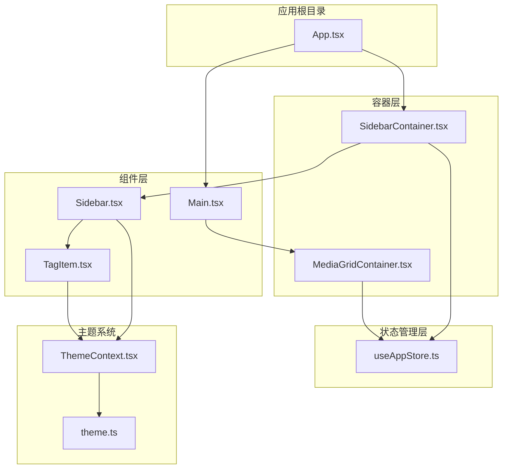
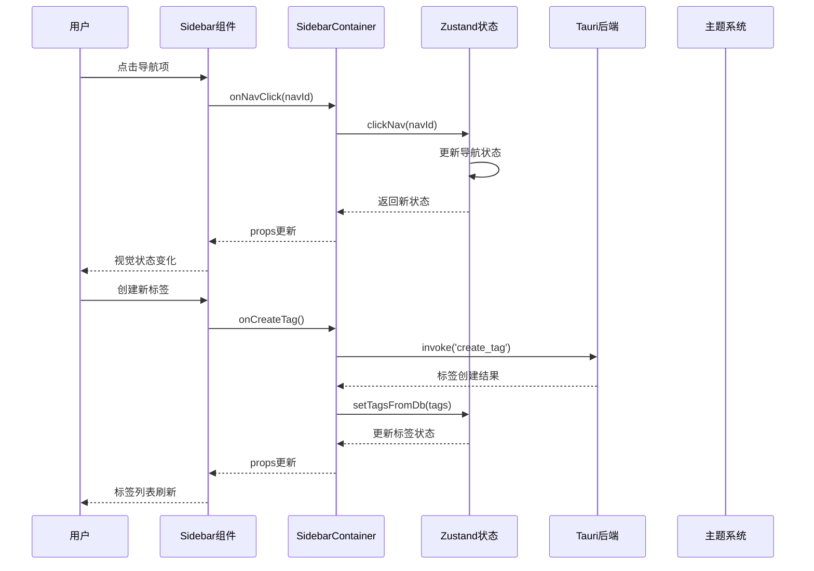
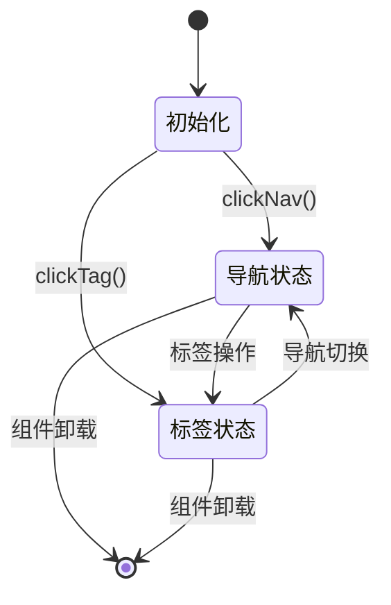
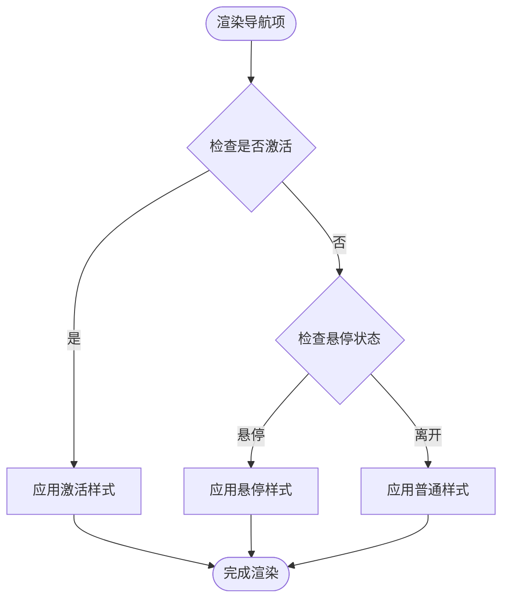
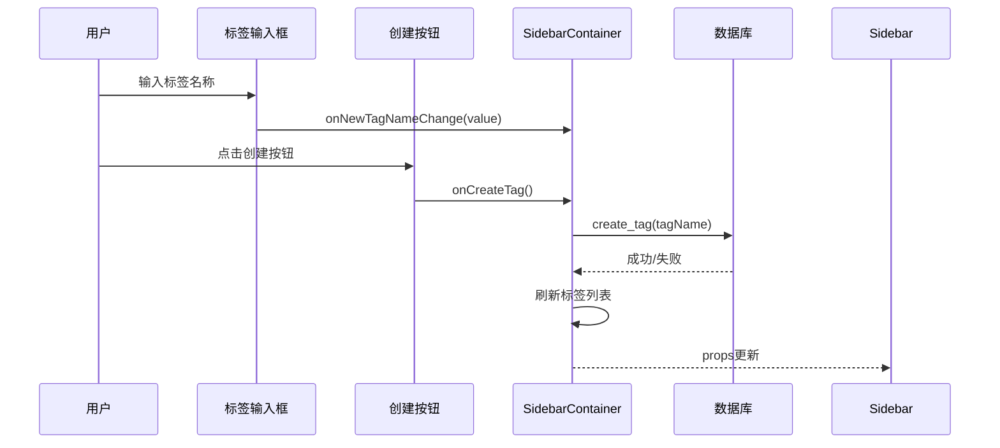
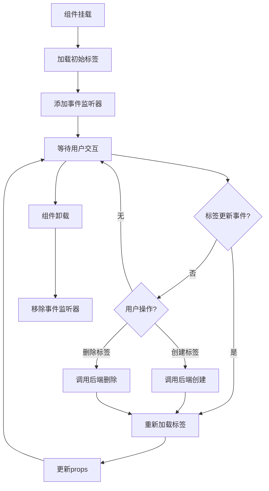
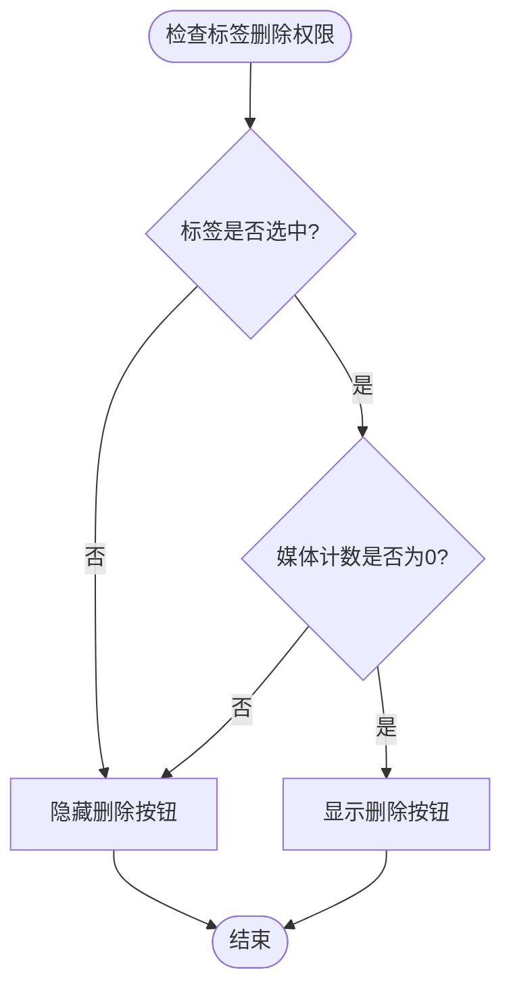
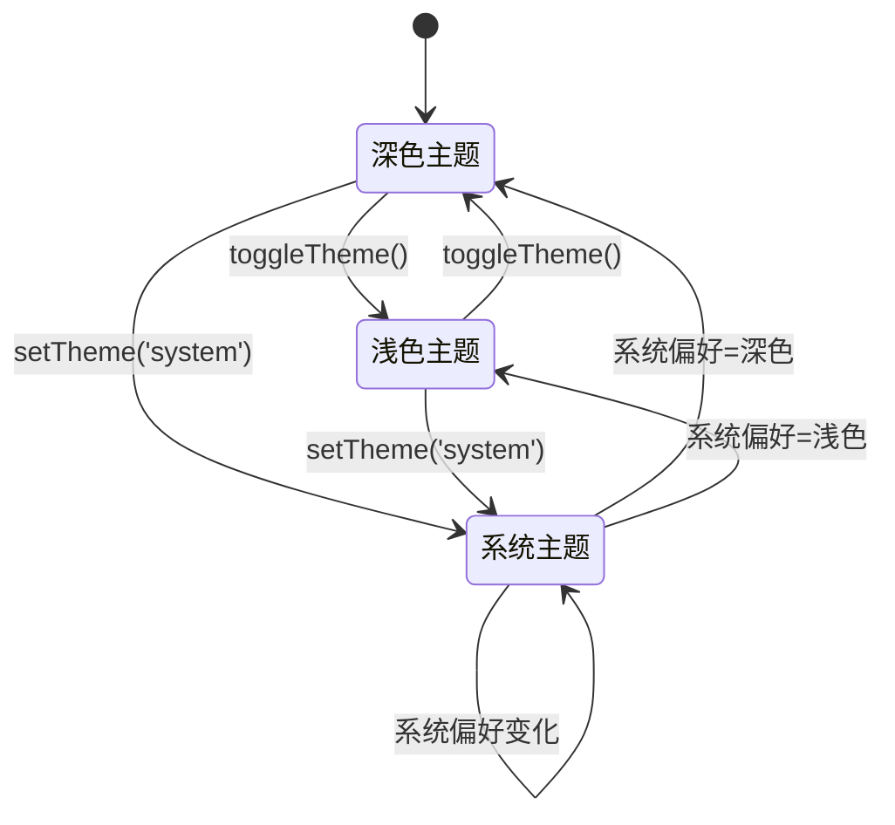
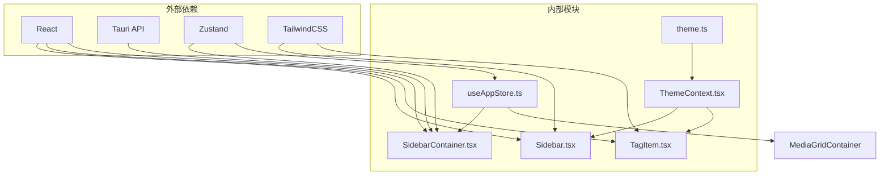
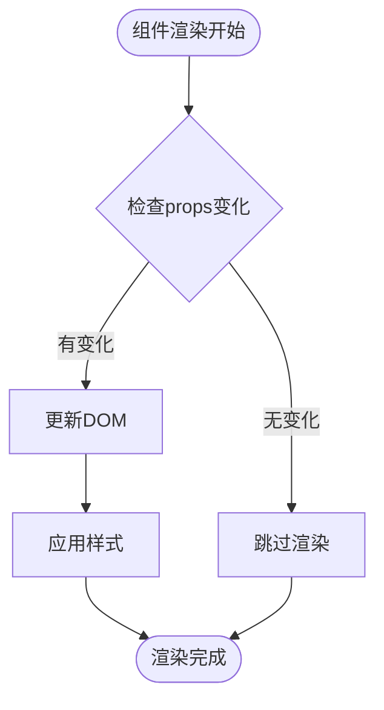

# Sidebar 侧边栏组件

<cite>
**本文档引用的文件**
- [Sidebar.tsx](file://src/components/Sidebar.tsx)
- [SidebarContainer.tsx](file://src/containers/SidebarContainer.tsx)
- [TagItem.tsx](file://src/components/TagItem.tsx)
- [useAppStore.ts](file://src/store/useAppStore.ts)
- [ThemeContext.tsx](file://src/contexts/ThemeContext.tsx)
- [theme.ts](file://src/theme/theme.ts)
- [App.tsx](file://src/App.tsx)
- [MediaGridContainer.tsx](file://src/containers/MediaGridContainer.tsx)
- [Main.tsx](file://src/components/Main.tsx)
</cite>

## 目录
1. [简介](#简介)
2. [项目结构](#项目结构)
3. [核心组件](#核心组件)
4. [架构概览](#架构概览)
5. [详细组件分析](#详细组件分析)
6. [依赖关系分析](#依赖关系分析)
7. [性能考虑](#性能考虑)
8. [故障排除指南](#故障排除指南)
9. [结论](#结论)
10. [附录](#附录)

## 简介

Sidebar 侧边栏组件是 Medex 媒体管理系统的核心导航组件，负责提供媒体库的导航结构、标签管理和用户界面控制。该组件实现了完整的侧边栏功能，包括导航项管理、标签创建和删除、主题集成以及响应式设计。

Sidebar 组件采用现代化的 React 架构，结合 Zustand 状态管理、Tauri 后端通信和 TailwindCSS 样式系统，为用户提供流畅的媒体管理体验。组件支持深色/浅色主题切换、键盘导航、无障碍访问等现代 Web 应用特性。

## 项目结构

Sidebar 组件位于项目的组件层次结构中，与状态管理、主题系统和容器组件协同工作：



**图表来源**
- [App.tsx:1-73](file://src/App.tsx#L1-L73)
- [Sidebar.tsx:1-145](file://src/components/Sidebar.tsx#L1-L145)
- [SidebarContainer.tsx:1-79](file://src/containers/SidebarContainer.tsx#L1-L79)

**章节来源**
- [App.tsx:1-73](file://src/App.tsx#L1-L73)
- [Sidebar.tsx:1-145](file://src/components/Sidebar.tsx#L1-L145)
- [SidebarContainer.tsx:1-79](file://src/containers/SidebarContainer.tsx#L1-L79)

## 核心组件

Sidebar 侧边栏组件由三个主要部分组成：

### 导航区域
- **导航项列表**：包含媒体库的主要导航入口
- **活动状态管理**：实时反映当前选中的导航项
- **悬停交互效果**：提供视觉反馈的鼠标悬停状态

### 标签管理区域
- **标签输入框**：支持新标签的创建功能
- **标签列表渲染**：动态显示现有标签及其统计信息
- **标签删除控制**：条件性显示删除按钮（仅限空标签）

### 主题集成
- **颜色系统**：完全集成主题上下文的颜色配置
- **样式动态绑定**：运行时根据主题状态更新样式
- **响应式设计**：适配不同屏幕尺寸和设备类型

**章节来源**
- [Sidebar.tsx:42-141](file://src/components/Sidebar.tsx#L42-L141)
- [TagItem.tsx:11-69](file://src/components/TagItem.tsx#L11-L69)

## 架构概览

Sidebar 组件采用分层架构设计，实现了清晰的关注点分离：



**图表来源**
- [SidebarContainer.tsx:35-51](file://src/containers/SidebarContainer.tsx#L35-L51)
- [useAppStore.ts:152-173](file://src/store/useAppStore.ts#L152-L173)

### 状态管理模式

Sidebar 组件采用集中式状态管理，通过 Zustand 提供的状态存储实现：



**图表来源**
- [useAppStore.ts:145-173](file://src/store/useAppStore.ts#L145-L173)

**章节来源**
- [SidebarContainer.tsx:7-33](file://src/containers/SidebarContainer.tsx#L7-L33)
- [useAppStore.ts:48-68](file://src/store/useAppStore.ts#L48-L68)

## 详细组件分析

### Sidebar 主组件

Sidebar 是核心展示组件，负责渲染完整的侧边栏界面：

#### 属性接口定义

| 属性名 | 类型 | 必需 | 描述 |
|--------|------|------|------|
| navItems | SidebarNavItem[] | 是 | 导航项数组，包含 id、label、active 状态 |
| tags | SidebarTagItem[] | 是 | 标签数组，包含 id、name、selected、mediaCount |
| newTagName | string | 是 | 新标签输入框的当前值 |
| onNewTagNameChange | (value: string) => void | 是 | 输入框值变更回调 |
| onCreateTag | () => void | 是 | 创建新标签的回调函数 |
| onDeleteTag | (tagId: string) => void | 是 | 删除标签的回调函数 |
| onTagClick | (tagId: string) => void | 是 | 标签点击的回调函数 |
| onNavClick | (navId: string) => void | 是 | 导航项点击的回调函数 |
| theme | ThemeColors | 是 | 主题颜色配置对象 |

#### 导航项渲染逻辑

导航项采用条件渲染策略，根据活动状态动态应用样式：



**图表来源**
- [Sidebar.tsx:47-69](file://src/components/Sidebar.tsx#L47-L69)

#### 标签管理功能

标签管理区域提供了完整的 CRUD 操作能力：



**图表来源**
- [Sidebar.tsx:77-128](file://src/components/Sidebar.tsx#L77-L128)
- [SidebarContainer.tsx:35-51](file://src/containers/SidebarContainer.tsx#L35-L51)

**章节来源**
- [Sidebar.tsx:5-15](file://src/components/Sidebar.tsx#L5-L15)
- [Sidebar.tsx:42-141](file://src/components/Sidebar.tsx#L42-L141)

### SidebarContainer 容器组件

SidebarContainer 作为状态容器，负责管理组件的状态和业务逻辑：

#### 核心功能实现

| 功能 | 实现方式 | 数据流 |
|------|----------|--------|
| 标签加载 | Tauri 调用 `get_all_tags_with_count` | 后端 → 容器 → 状态 → 组件 |
| 标签创建 | Tauri 调用 `create_tag` | 用户输入 → 容器 → 后端 → 刷新 |
| 标签删除 | Tauri 调用 `delete_tag` | 用户操作 → 容器 → 后端 → 刷新 |
| 状态同步 | 事件监听 `medex:tags-updated` | 全局事件 → 容器 → 自动刷新 |

#### 生命周期管理



**图表来源**
- [SidebarContainer.tsx:16-33](file://src/containers/SidebarContainer.tsx#L16-L33)

**章节来源**
- [SidebarContainer.tsx:1-79](file://src/containers/SidebarContainer.tsx#L1-L79)

### TagItem 子组件

TagItem 是标签项的独立渲染组件，负责单个标签的显示和交互：

#### 条件删除逻辑

标签删除按钮的显示遵循严格的条件判断：



**图表来源**
- [TagItem.tsx:12](file://src/components/TagItem.tsx#L12)

#### 交互状态管理

标签项支持多种交互状态，每种状态都有相应的视觉反馈：

| 状态 | 样式特征 | 触发条件 |
|------|----------|----------|
| 普通状态 | 透明背景，次要文字色 | 非选中，非悬停 |
| 选中状态 | 选中背景色，主文字色 | 标签被选中 |
| 悬停状态 | 悬停背景色，透明过渡 | 鼠标悬停 |
| 删除悬停 | 红色背景，红色文字 | 删除按钮悬停 |

**章节来源**
- [TagItem.tsx:11-69](file://src/components/TagItem.tsx#L11-L69)

### 主题系统集成

Sidebar 组件深度集成了主题系统，提供完整的主题支持：

#### 主题颜色配置

| 颜色类别 | 具体用途 | 颜色值来源 |
|----------|----------|------------|
| 背景色 | 整体背景、卡片背景 | ThemeColors 接口定义 |
| 文本色 | 主要文字、标题文字 | ThemeColors 接口定义 |
| 边框色 | 分割线、输入框边框 | ThemeColors 接口定义 |
| 交互色 | 悬停效果、选中状态 | ThemeColors 接口定义 |
| 功能色 | 收藏、高亮等特殊状态 | ThemeColors 接口定义 |

#### 主题切换机制



**图表来源**
- [ThemeContext.tsx:68-83](file://src/contexts/ThemeContext.tsx#L68-L83)

**章节来源**
- [ThemeContext.tsx:1-99](file://src/contexts/ThemeContext.tsx#L1-L99)
- [theme.ts:8-52](file://src/theme/theme.ts#L8-L52)

## 依赖关系分析

Sidebar 组件的依赖关系体现了清晰的分层架构：



**图表来源**
- [Sidebar.tsx:1-3](file://src/components/Sidebar.tsx#L1-L3)
- [SidebarContainer.tsx:2-5](file://src/containers/SidebarContainer.tsx#L2-L5)

### 关键依赖关系

1. **状态管理依赖**：SidebarContainer 依赖 useAppStore 进行状态管理
2. **主题依赖**：所有组件都依赖 ThemeContext 获取主题配置
3. **后端通信**：SidebarContainer 通过 Tauri API 与 Rust 后端通信
4. **样式依赖**：组件使用 TailwindCSS 类进行样式定义

**章节来源**
- [Sidebar.tsx:1-3](file://src/components/Sidebar.tsx#L1-L3)
- [SidebarContainer.tsx:2-5](file://src/containers/SidebarContainer.tsx#L2-L5)

## 性能考虑

Sidebar 组件在设计时充分考虑了性能优化：

### 渲染优化

1. **条件渲染**：根据状态动态决定组件渲染，避免不必要的 DOM 更新
2. **事件委托**：使用事件冒泡减少事件处理器数量
3. **样式缓存**：主题颜色通过上下文传递，避免重复计算

### 状态管理优化

1. **局部状态**：输入框状态在容器组件中管理，减少全局状态污染
2. **批量更新**：标签操作通过事件系统批量处理，避免频繁重渲染
3. **记忆化**：使用 useMemo 优化复杂计算的结果缓存

### 性能监控



## 故障排除指南

### 常见问题及解决方案

#### 标签无法创建
**症状**：点击创建按钮无反应或出现错误提示
**可能原因**：
1. 输入为空或只包含空白字符
2. Tauri 后端服务未启动
3. 数据库连接失败

**解决步骤**：
1. 检查输入框是否有有效内容
2. 查看浏览器控制台错误日志
3. 确认 Tauri 后端服务状态
4. 重新加载页面尝试

#### 标签删除失败
**症状**：删除按钮不可见或删除操作无效
**可能原因**：
1. 标签仍有媒体关联
2. 标签未被选中
3. 权限不足

**解决步骤**：
1. 确保标签未被选中或媒体计数为0
2. 先选中目标标签
3. 检查用户权限设置

#### 主题切换异常
**症状**：主题切换后样式不更新
**可能原因**：
1. 主题上下文未正确提供
2. 浏览器缓存问题
3. CSS 优先级冲突

**解决步骤**：
1. 确认 ThemeProvider 包裹了应用根组件
2. 清除浏览器缓存
3. 检查自定义 CSS 是否覆盖了主题样式

**章节来源**
- [SidebarContainer.tsx:47-62](file://src/containers/SidebarContainer.tsx#L47-L62)

## 结论

Sidebar 侧边栏组件是一个设计精良、功能完整的 React 组件，具有以下特点：

1. **架构清晰**：采用分层架构，职责分离明确
2. **状态管理**：使用 Zustand 实现高效的状态管理
3. **主题集成**：完整支持深色/浅色主题切换
4. **性能优化**：通过条件渲染和事件委托提升性能
5. **用户体验**：提供流畅的交互体验和视觉反馈

组件的设计充分考虑了现代 Web 应用的需求，为 Medex 媒体管理系统提供了稳定可靠的侧边栏基础。通过合理的抽象和模块化设计，Sidebar 组件为后续的功能扩展和维护奠定了良好的基础。

## 附录

### 使用示例

#### 基本使用
```typescript
// 在应用中引入 Sidebar 组件
import SidebarContainer from './containers/SidebarContainer';

function App() {
  return (
    <div className="flex h-screen">
      <SidebarContainer />
      {/* 其他组件 */}
    </div>
  );
}
```

#### 自定义主题
```typescript
// 创建自定义主题
const customTheme: ThemeColors = {
  sidebar: '#2D3748',
  text: '#E2E8F0',
  // ... 其他颜色配置
};

// 在 ThemeProvider 中使用
<ThemeProvider theme={customTheme}>
  <SidebarContainer />
</ThemeProvider>
```

### 配置选项

| 选项 | 类型 | 默认值 | 描述 |
|------|------|--------|------|
| navItems | SidebarNavItem[] | 内置导航项 | 导航项配置数组 |
| tags | SidebarTagItem[] | 内置标签 | 标签配置数组 |
| theme | ThemeColors | 主题上下文 | 主题颜色配置 |
| onNavClick | (navId: string) => void | 必需 | 导航项点击回调 |
| onTagClick | (tagId: string) => void | 必需 | 标签点击回调 |
| onCreateTag | () => void | 必需 | 创建标签回调 |
| onDeleteTag | (tagId: string) => void | 必需 | 删除标签回调 |

### 定制指南

#### 修改导航项
1. 在 `useAppStore.ts` 中修改 `initialNavItems`
2. 确保每个导航项包含 `id`、`label`、`active` 字段
3. 更新对应的事件处理逻辑

#### 添加新标签字段
1. 在 `SidebarTagItem` 接口中添加新字段
2. 更新 `useAppStore.ts` 中的标签状态管理逻辑
3. 修改 UI 组件以显示新字段

#### 自定义样式
1. 在 `theme.ts` 中扩展 `ThemeColors` 接口
2. 添加新的颜色配置
3. 在组件中使用新的样式变量