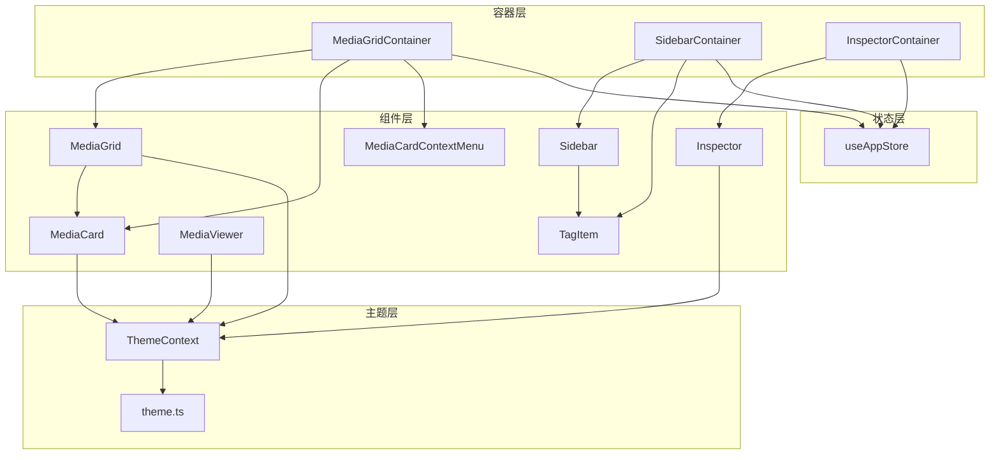
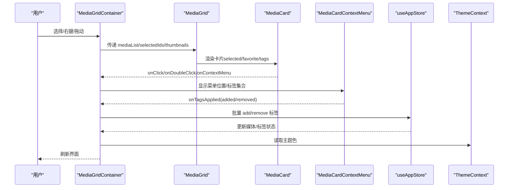
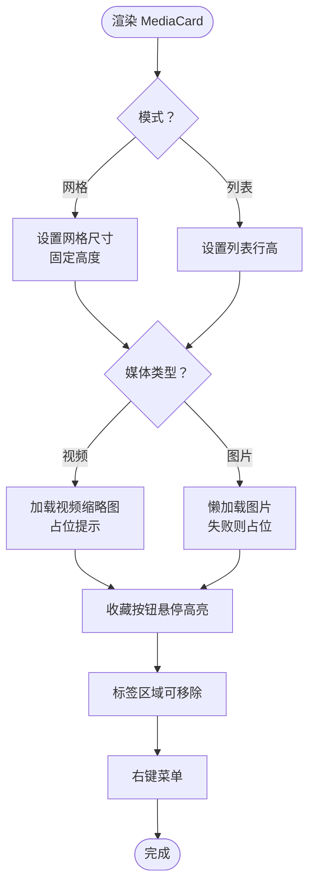
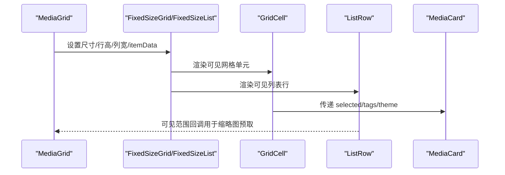
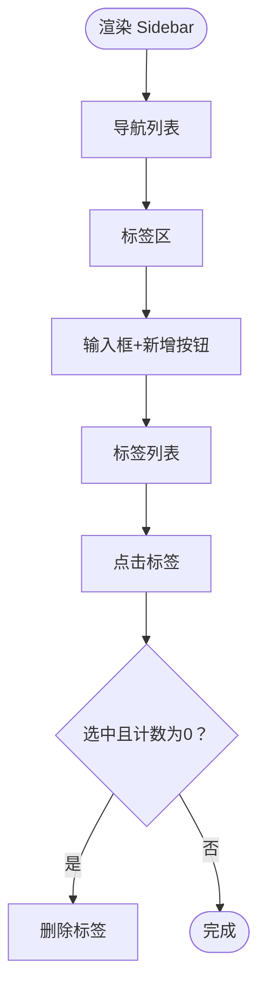
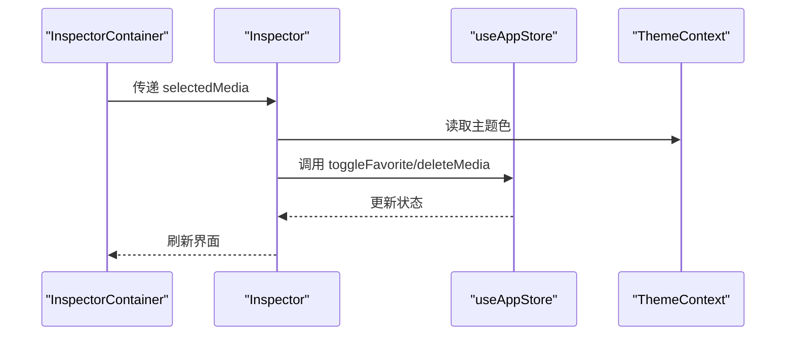
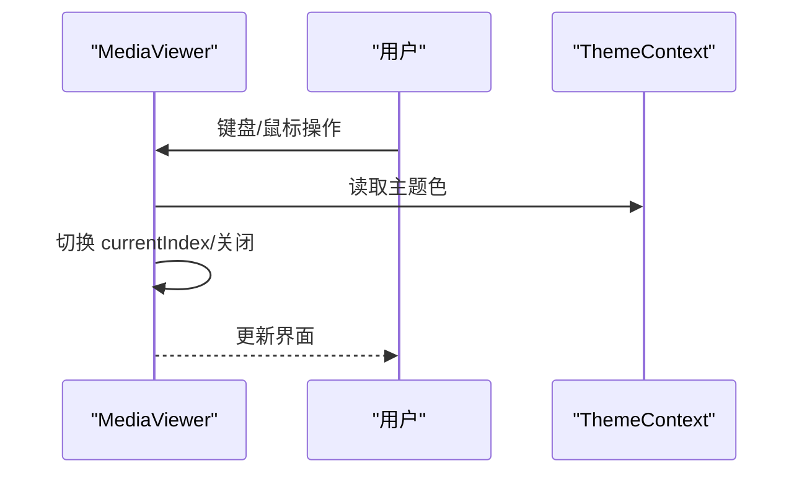
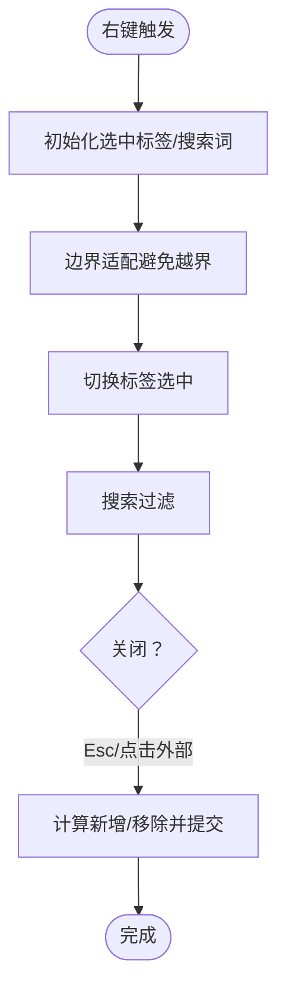
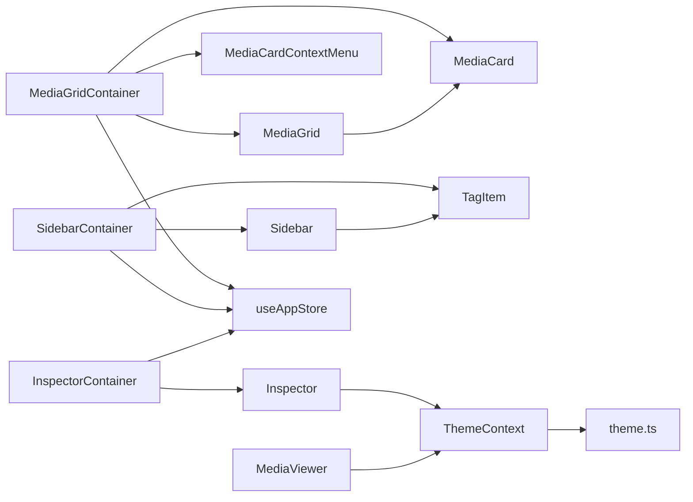

# 核心组件

<cite>
**本文引用的文件**
- [MediaCard.tsx](file://src/components/MediaCard.tsx)
- [MediaGrid.tsx](file://src/components/MediaGrid.tsx)
- [Sidebar.tsx](file://src/components/Sidebar.tsx)
- [Inspector.tsx](file://src/components/Inspector.tsx)
- [MediaViewer.tsx](file://src/components/MediaViewer.tsx)
- [MediaCardContextMenu.tsx](file://src/components/MediaCardContextMenu.tsx)
- [MediaGridContainer.tsx](file://src/containers/MediaGridContainer.tsx)
- [SidebarContainer.tsx](file://src/containers/SidebarContainer.tsx)
- [InspectorContainer.tsx](file://src/containers/InspectorContainer.tsx)
- [theme.ts](file://src/theme/theme.ts)
- [ThemeContext.tsx](file://src/contexts/ThemeContext.tsx)
- [useAppStore.ts](file://src/store/useAppStore.ts)
- [TagItem.tsx](file://src/components/TagItem.tsx)
</cite>

## 目录
1. [简介](#简介)
2. [项目结构](#项目结构)
3. [核心组件](#核心组件)
4. [架构总览](#架构总览)
5. [组件详解](#组件详解)
6. [依赖关系分析](#依赖关系分析)
7. [性能与响应式设计](#性能与响应式设计)
8. [故障排查指南](#故障排查指南)
9. [结论](#结论)
10. [附录](#附录)

## 简介
本文件聚焦 Medex 的核心 UI 组件，系统性梳理 MediaCard、MediaGrid、Sidebar、Inspector、MediaViewer 等组件的视觉外观、行为与交互模式，明确各组件的属性、事件、状态管理与使用场景，并解释组件间协作关系与数据流。同时提供定制化与样式覆盖建议、响应式设计实现思路以及性能优化策略，特别强调 MediaCard 上下文菜单、MediaGrid 虚拟滚动、Sidebar 标签管理等关键特性。

## 项目结构
Medex 采用按功能域组织的组件与容器分层：
- 组件层：纯展示组件，负责渲染与基础交互（如 MediaCard、MediaGrid、Sidebar、Inspector、MediaViewer、MediaCardContextMenu、TagItem）
- 容器层：连接组件与状态/数据源，封装业务逻辑（如 MediaGridContainer、SidebarContainer、InspectorContainer）
- 状态层：Zustand Store 提供全局状态（导航、标签、媒体列表、视图模式等）
- 主题层：ThemeContext 提供主题上下文，theme.ts 定义主题色板与明暗主题生成

图表来源
- [MediaGridContainer.tsx:30-618](file://src/containers/MediaGridContainer.tsx#L30-L618)
- [SidebarContainer.tsx:7-78](file://src/containers/SidebarContainer.tsx#L7-L78)
- [InspectorContainer.tsx:6-31](file://src/containers/InspectorContainer.tsx#L6-L31)
- [MediaGrid.tsx:70-212](file://src/components/MediaGrid.tsx#L70-L212)
- [MediaCard.tsx:34-264](file://src/components/MediaCard.tsx#L34-L264)
- [Sidebar.tsx:17-144](file://src/components/Sidebar.tsx#L17-L144)
- [Inspector.tsx:19-264](file://src/components/Inspector.tsx#L19-L264)
- [MediaViewer.tsx:14-173](file://src/components/MediaViewer.tsx#L14-L173)
- [MediaCardContextMenu.tsx:23-254](file://src/components/MediaCardContextMenu.tsx#L23-L254)
- [TagItem.tsx:11-69](file://src/components/TagItem.tsx#L11-L69)
- [useAppStore.ts:145-394](file://src/store/useAppStore.ts#L145-L394)
- [ThemeContext.tsx:17-89](file://src/contexts/ThemeContext.tsx#L17-L89)
- [theme.ts:8-52](file://src/theme/theme.ts#L8-L52)

章节来源
- [MediaGridContainer.tsx:30-618](file://src/containers/MediaGridContainer.tsx#L30-L618)
- [SidebarContainer.tsx:7-78](file://src/containers/SidebarContainer.tsx#L7-L78)
- [InspectorContainer.tsx:6-31](file://src/containers/InspectorContainer.tsx#L6-L31)
- [MediaGrid.tsx:70-212](file://src/components/MediaGrid.tsx#L70-L212)
- [MediaCard.tsx:34-264](file://src/components/MediaCard.tsx#L34-L264)
- [Sidebar.tsx:17-144](file://src/components/Sidebar.tsx#L17-L144)
- [Inspector.tsx:19-264](file://src/components/Inspector.tsx#L19-L264)
- [MediaViewer.tsx:14-173](file://src/components/MediaViewer.tsx#L14-L173)
- [MediaCardContextMenu.tsx:23-254](file://src/components/MediaCardContextMenu.tsx#L23-L254)
- [TagItem.tsx:11-69](file://src/components/TagItem.tsx#L11-L69)
- [useAppStore.ts:145-394](file://src/store/useAppStore.ts#L145-L394)
- [ThemeContext.tsx:17-89](file://src/contexts/ThemeContext.tsx#L17-L89)
- [theme.ts:8-52](file://src/theme/theme.ts#L8-L52)

## 核心组件
- MediaCard：媒体卡片，支持网格/列表两种模式，收藏、标签、右键上下文菜单、视频缩略图懒加载与占位提示。
- MediaGrid：网格/列表视图容器，基于 react-window 实现虚拟滚动，计算列数与行高，透传主题与缩略图映射。
- Sidebar：侧边导航与标签管理，支持新建、删除、点击标签，标签计数与选中态。
- Inspector：媒体详情面板，展示预览、标签、信息与操作（收藏、删除、新增标签）。
- MediaViewer：全屏媒体查看器，支持键盘左右键与上一张/下一张切换，自动播放与视频控制。
- MediaCardContextMenu：卡片右键上下文菜单，支持标签搜索、批量应用、边界适配与自动提交。

章节来源
- [MediaCard.tsx:6-27](file://src/components/MediaCard.tsx#L6-L27)
- [MediaGrid.tsx:13-27](file://src/components/MediaGrid.tsx#L13-L27)
- [Sidebar.tsx:5-15](file://src/components/Sidebar.tsx#L5-L15)
- [Inspector.tsx:13-17](file://src/components/Inspector.tsx#L13-L17)
- [MediaViewer.tsx:6-12](file://src/components/MediaViewer.tsx#L6-L12)
- [MediaCardContextMenu.tsx:10-21](file://src/components/MediaCardContextMenu.tsx#L10-L21)

## 架构总览
组件间协作与数据流概览：
- 容器层负责从全局状态与后端接口获取数据，向组件传递 props 与回调。
- 组件层专注渲染与交互，通过主题上下文统一风格。
- Inspector 与 MediaViewer 作为独立面板/模态，不直接参与虚拟滚动，但共享主题与媒体数据。
- MediaGridContainer 管理多选、右键菜单、标签批量应用、缩略图队列与请求调度。

图表来源
- [MediaGridContainer.tsx:58-175](file://src/containers/MediaGridContainer.tsx#L58-L175)
- [MediaGrid.tsx:70-212](file://src/components/MediaGrid.tsx#L70-L212)
- [MediaCard.tsx:34-264](file://src/components/MediaCard.tsx#L34-L264)
- [MediaCardContextMenu.tsx:23-254](file://src/components/MediaCardContextMenu.tsx#L23-L254)
- [useAppStore.ts:289-381](file://src/store/useAppStore.ts#L289-L381)
- [ThemeContext.tsx:76-83](file://src/contexts/ThemeContext.tsx#L76-L83)

## 组件详解

### MediaCard 组件
- 视觉与行为
  - 支持网格与列表两种模式，网格高度固定，列表行高固定。
  - 收藏按钮悬停高亮，选中状态有外环高亮与半透明遮罩。
  - 图片/视频预览懒加载，图片失败时显示占位；视频缩略图加载中显示占位与“生成缩略图”提示。
  - 标签区域支持点击移除，移除调用后端接口并触发全局事件。
  - 右键菜单用于打开上下文菜单，阻止默认菜单。
- 关键属性（props）
  - id、path、thumbnail、filename、tags、time、mediaType、duration、resolution、isFavorite、selected、onClick、onDoubleClick、onToggleFavorite、onTagRemoved、onContextMenu、videoThumbnail、className、mode、theme
- 事件与回调
  - onClick、onDoubleClick、onToggleFavorite、onTagRemoved、onContextMenu
- 状态管理
  - 本地状态：图片加载失败标记、视频缩略图加载完成标记。
  - 全局状态：通过回调与容器层联动，实现收藏、标签变更与全局刷新。
- 交互模式
  - 鼠标悬停改变背景色；点击收藏切换；右键打开上下文菜单；双击进入查看器。
- 性能与优化
  - 使用 memo 包装，自定义比较函数减少重渲染；图片懒加载与解码异步；视频缩略图仅在需要时加载。
- 定制与样式覆盖
  - 通过 className 覆盖宽度；通过 theme 覆盖颜色体系；hover/selected/overlay 等均来自主题。

图表来源
- [MediaCard.tsx:34-264](file://src/components/MediaCard.tsx#L34-L264)

章节来源
- [MediaCard.tsx:6-27](file://src/components/MediaCard.tsx#L6-L27)
- [MediaCard.tsx:34-264](file://src/components/MediaCard.tsx#L34-L264)
- [MediaCard.tsx:277-317](file://src/components/MediaCard.tsx#L277-L317)

### MediaGrid 组件
- 视觉与行为
  - 网格模式：固定卡片宽高与间距，动态计算列数与行数，使用 FixedSizeGrid 虚拟渲染。
  - 列表模式：固定头部与行高，使用 FixedSizeList 虚拟渲染，支持可见范围回调。
  - 背景点击取消选择，支持主题色与缩略图映射。
- 关键属性（props）
  - mediaList、selectedIds、onCardClick、onCardDoubleClick、onToggleFavorite、onTagAdded、onTagRemoved、onCardContextMenu、onBackgroundClick、thumbnails、onVisibleRangeChange、viewMode、theme
- 数据流
  - 容器层计算列数与行数，传递给 GridCell/ListRow；子组件再渲染 MediaCard 或行内容。
- 性能与优化
  - 虚拟滚动：Grid 使用 overscanRowCount/overscanColumnCount，List 使用 overscanCount。
  - 可见范围回调：用于触发缩略图请求队列与预取。
- 定制与样式覆盖
  - 通过 theme 控制选中/悬停/边框/文字颜色；GridCell/ListRow 内部也使用主题色。

图表来源
- [MediaGrid.tsx:70-212](file://src/components/MediaGrid.tsx#L70-L212)
- [MediaGrid.tsx:214-297](file://src/components/MediaGrid.tsx#L214-L297)

章节来源
- [MediaGrid.tsx:13-27](file://src/components/MediaGrid.tsx#L13-L27)
- [MediaGrid.tsx:70-212](file://src/components/MediaGrid.tsx#L70-L212)
- [MediaGrid.tsx:214-297](file://src/components/MediaGrid.tsx#L214-L297)

### Sidebar 组件
- 视觉与行为
  - 导航区：激活态高亮与悬停效果；非激活态悬停变色。
  - 标签区：输入框支持回车新建；新增按钮悬停高亮；标签项支持点击与删除（仅在选中且计数为 0 时显示删除按钮）。
  - 主题色：侧边栏背景、边框、文字、输入框、按钮等均来自主题。
- 关键属性（props）
  - navItems、tags、newTagName、onNewTagNameChange、onCreateTag、onDeleteTag、onTagClick、onNavClick、theme
- 交互模式
  - 点击导航切换 active；点击标签切换 selected；输入回车或点击新增创建标签；点击标签项触发删除（条件满足时）。
- 定制与样式覆盖
  - 通过 theme 覆盖所有交互态与背景色。

图表来源
- [Sidebar.tsx:17-144](file://src/components/Sidebar.tsx#L17-L144)
- [TagItem.tsx:11-69](file://src/components/TagItem.tsx#L11-L69)

章节来源
- [Sidebar.tsx:5-15](file://src/components/Sidebar.tsx#L5-L15)
- [Sidebar.tsx:17-144](file://src/components/Sidebar.tsx#L17-L144)
- [TagItem.tsx:11-69](file://src/components/TagItem.tsx#L11-L69)

### Inspector 组件
- 视觉与行为
  - 顶部预览区：视频自动播放首帧，图片悬停放大；无预览显示占位。
  - 标签区：支持加载中状态、逐个删除标签；输入框回车新增标签。
  - 信息区：展示时长与分辨率。
  - 操作区：收藏/取消收藏、删除媒体。
- 关键属性（props）
  - media、onToggleFavorite、onDeleteMedia
- 数据流
  - 从容器层获取选中媒体，通过主题上下文获取主题色；标签 CRUD 通过后端接口与全局事件驱动。
- 交互模式
  - 新增标签回车提交；删除标签点击按钮；收藏/删除按钮悬停高亮。
- 定制与样式覆盖
  - 通过 theme 控制背景、边框、文字与按钮样式。

图表来源
- [InspectorContainer.tsx:6-31](file://src/containers/InspectorContainer.tsx#L6-L31)
- [Inspector.tsx:19-264](file://src/components/Inspector.tsx#L19-L264)
- [useAppStore.ts:236-257](file://src/store/useAppStore.ts#L236-L257)

章节来源
- [Inspector.tsx:13-17](file://src/components/Inspector.tsx#L13-L17)
- [Inspector.tsx:19-264](file://src/components/Inspector.tsx#L19-L264)
- [InspectorContainer.tsx:6-31](file://src/containers/InspectorContainer.tsx#L6-L31)

### MediaViewer 组件
- 视觉与行为
  - 全屏覆盖层，背景半透明遮罩；关闭按钮、上一张/下一张按钮悬停高亮；禁用态半透明。
  - 视频自动播放，图片居中显示；ESC 关闭。
- 关键属性（props）
  - open、mediaList、currentIndex、onClose、onChangeIndex
- 交互模式
  - 键盘左右箭头切换；点击左右按钮切换；点击背景关闭；点击关闭按钮关闭。
- 性能与优化
  - 仅在 open 且 media 存在时渲染；视频在切换时暂停；懒加载资源。

图表来源
- [MediaViewer.tsx:14-173](file://src/components/MediaViewer.tsx#L14-L173)

章节来源
- [MediaViewer.tsx:6-12](file://src/components/MediaViewer.tsx#L6-L12)
- [MediaViewer.tsx:14-173](file://src/components/MediaViewer.tsx#L14-L173)

### MediaCardContextMenu 组件
- 视觉与行为
  - 右键弹出菜单，自动调整位置避免越界；支持标签搜索与批量应用；点击外部或按 Esc 自动提交。
  - 标签项悬停高亮，选中态不同颜色。
- 关键属性（props）
  - visible、x、y、mediaId、mediaTags、allTags、selectedCount、commonTags、onClose、onTagsApplied
- 交互模式
  - 切换标签选中；搜索过滤；点击外部/按 Esc 关闭并提交；提交时区分新增与移除。
- 性能与优化
  - 使用 memo 与回调优化；延迟绑定外部点击与键盘事件，避免误触。

图表来源
- [MediaCardContextMenu.tsx:23-254](file://src/components/MediaCardContextMenu.tsx#L23-L254)

章节来源
- [MediaCardContextMenu.tsx:10-21](file://src/components/MediaCardContextMenu.tsx#L10-L21)
- [MediaCardContextMenu.tsx:23-254](file://src/components/MediaCardContextMenu.tsx#L23-L254)

## 依赖关系分析
- 组件依赖
  - MediaGrid 依赖 MediaCard；Sidebar 依赖 TagItem；Inspector 依赖 ThemeContext；MediaViewer 依赖 ThemeContext。
- 容器依赖
  - MediaGridContainer 依赖 useAppStore、ThemeContext、MediaGrid、MediaCardContextMenu；SidebarContainer 依赖 useAppStore、ThemeContext、Sidebar、TagItem；InspectorContainer 依赖 useAppStore、ThemeContext、Inspector。
- 主题依赖
  - 所有组件通过 ThemeContext 获取主题色，theme.ts 定义主题色板与明暗主题生成。

图表来源
- [MediaGridContainer.tsx:30-618](file://src/containers/MediaGridContainer.tsx#L30-L618)
- [SidebarContainer.tsx:7-78](file://src/containers/SidebarContainer.tsx#L7-L78)
- [InspectorContainer.tsx:6-31](file://src/containers/InspectorContainer.tsx#L6-L31)
- [MediaGrid.tsx:70-212](file://src/components/MediaGrid.tsx#L70-L212)
- [MediaCard.tsx:34-264](file://src/components/MediaCard.tsx#L34-L264)
- [Sidebar.tsx:17-144](file://src/components/Sidebar.tsx#L17-L144)
- [Inspector.tsx:19-264](file://src/components/Inspector.tsx#L19-L264)
- [MediaViewer.tsx:14-173](file://src/components/MediaViewer.tsx#L14-L173)
- [MediaCardContextMenu.tsx:23-254](file://src/components/MediaCardContextMenu.tsx#L23-L254)
- [TagItem.tsx:11-69](file://src/components/TagItem.tsx#L11-L69)
- [useAppStore.ts:145-394](file://src/store/useAppStore.ts#L145-L394)
- [ThemeContext.tsx:17-89](file://src/contexts/ThemeContext.tsx#L17-L89)
- [theme.ts:8-52](file://src/theme/theme.ts#L8-L52)

章节来源
- [MediaGridContainer.tsx:30-618](file://src/containers/MediaGridContainer.tsx#L30-L618)
- [SidebarContainer.tsx:7-78](file://src/containers/SidebarContainer.tsx#L7-L78)
- [InspectorContainer.tsx:6-31](file://src/containers/InspectorContainer.tsx#L6-L31)
- [MediaGrid.tsx:70-212](file://src/components/MediaGrid.tsx#L70-L212)
- [MediaCard.tsx:34-264](file://src/components/MediaCard.tsx#L34-L264)
- [Sidebar.tsx:17-144](file://src/components/Sidebar.tsx#L17-L144)
- [Inspector.tsx:19-264](file://src/components/Inspector.tsx#L19-L264)
- [MediaViewer.tsx:14-173](file://src/components/MediaViewer.tsx#L14-L173)
- [MediaCardContextMenu.tsx:23-254](file://src/components/MediaCardContextMenu.tsx#L23-L254)
- [TagItem.tsx:11-69](file://src/components/TagItem.tsx#L11-L69)
- [useAppStore.ts:145-394](file://src/store/useAppStore.ts#L145-L394)
- [ThemeContext.tsx:17-89](file://src/contexts/ThemeContext.tsx#L17-L89)
- [theme.ts:8-52](file://src/theme/theme.ts#L8-L52)

## 性能与响应式设计
- 虚拟滚动
  - MediaGrid 在网格与列表模式下均使用 react-window 的虚拟滚动，设置合理的 overscan 数量，降低 DOM 节点数量，提升滚动性能。
- 缩略图请求与队列
  - MediaGridContainer 维护缩略图任务队列与并发限制，优先级排序与去重，避免重复请求与过多并发。
- 懒加载与解码
  - MediaCard 对图片与视频缩略图使用懒加载与解码异步，失败时降级显示占位。
- 主题与样式
  - 通过 ThemeContext 与 theme.ts 提供统一主题色，组件内部通过 style 与类名组合实现响应式与一致性。
- 响应式布局
  - MediaGrid 使用 ResizeObserver 计算容器尺寸，动态计算列数与行高，适配不同窗口大小。

章节来源
- [MediaGrid.tsx:323-350](file://src/components/MediaGrid.tsx#L323-L350)
- [MediaGridContainer.tsx:27-48](file://src/containers/MediaGridContainer.tsx#L27-L48)
- [MediaGridContainer.tsx:352-451](file://src/containers/MediaGridContainer.tsx#L352-L451)
- [MediaCard.tsx:57-59](file://src/components/MediaCard.tsx#L57-L59)
- [MediaCard.tsx:171-184](file://src/components/MediaCard.tsx#L171-L184)

## 故障排查指南
- 标签操作失败
  - 现象：新增/删除标签弹窗错误提示。
  - 排查：确认 mediaId 是否有效；检查后端接口返回；查看控制台错误日志；确认全局事件是否正确派发。
  - 相关文件
    - [MediaCard.tsx:65-84](file://src/components/MediaCard.tsx#L65-L84)
    - [Inspector.tsx:55-65](file://src/components/Inspector.tsx#L55-L65)
    - [MediaCardContextMenu.tsx:96-132](file://src/components/MediaCardContextMenu.tsx#L96-L132)
- 缩略图不显示
  - 现象：视频缩略图占位或长时间加载。
  - 排查：检查缩略图队列与并发限制；确认 thumbnail_ready 事件是否到达；查看请求结果与 convertFileSrc 转换。
  - 相关文件
    - [MediaGridContainer.tsx:417-486](file://src/containers/MediaGridContainer.tsx#L417-L486)
- 右键菜单无法关闭
  - 现象：菜单关闭后仍显示或无法再次打开。
  - 排查：确认外部点击与键盘事件监听是否正确清理；检查 isClosing 状态避免重复提交。
  - 相关文件
    - [MediaCardContextMenu.tsx:80-93](file://src/components/MediaCardContextMenu.tsx#L80-L93)
    - [MediaCardContextMenu.tsx:135-161](file://src/components/MediaCardContextMenu.tsx#L135-L161)
- 主题不生效
  - 现象：组件颜色异常或与预期不符。
  - 排查：确认 ThemeContext 是否正确提供 theme；检查 data-theme 属性；确认主题模式与系统偏好。
  - 相关文件
    - [ThemeContext.tsx:46-54](file://src/contexts/ThemeContext.tsx#L46-L54)
    - [theme.ts:104-150](file://src/theme/theme.ts#L104-L150)

章节来源
- [MediaCard.tsx:65-84](file://src/components/MediaCard.tsx#L65-L84)
- [Inspector.tsx:55-65](file://src/components/Inspector.tsx#L55-L65)
- [MediaCardContextMenu.tsx:96-132](file://src/components/MediaCardContextMenu.tsx#L96-L132)
- [MediaGridContainer.tsx:417-486](file://src/containers/MediaGridContainer.tsx#L417-L486)
- [MediaCardContextMenu.tsx:80-93](file://src/components/MediaCardContextMenu.tsx#L80-L93)
- [MediaCardContextMenu.tsx:135-161](file://src/components/MediaCardContextMenu.tsx#L135-L161)
- [ThemeContext.tsx:46-54](file://src/contexts/ThemeContext.tsx#L46-L54)
- [theme.ts:104-150](file://src/theme/theme.ts#L104-L150)

## 结论
Medex 的核心 UI 组件围绕“主题一致、交互清晰、性能优先”的原则构建。MediaCard 提供丰富的媒体卡片能力；MediaGrid 通过虚拟滚动与缩略图队列保障大列表性能；Sidebar 的标签管理与交互体验良好；Inspector 与 MediaViewer 提供完整的媒体详情与浏览体验；MediaCardContextMenu 支持便捷的标签批量操作。整体组件间职责清晰、耦合度低，便于扩展与维护。

## 附录
- 组件属性与事件速查
  - MediaCard：id、path、thumbnail、filename、tags、time、mediaType、duration、resolution、isFavorite、selected、onClick、onDoubleClick、onToggleFavorite、onTagRemoved、onContextMenu、videoThumbnail、className、mode、theme
  - MediaGrid：mediaList、selectedIds、onCardClick、onCardDoubleClick、onToggleFavorite、onTagAdded、onTagRemoved、onCardContextMenu、onBackgroundClick、thumbnails、onVisibleRangeChange、viewMode、theme
  - Sidebar：navItems、tags、newTagName、onNewTagNameChange、onCreateTag、onDeleteTag、onTagClick、onNavClick、theme
  - Inspector：media、onToggleFavorite、onDeleteMedia
  - MediaViewer：open、mediaList、currentIndex、onClose、onChangeIndex
  - MediaCardContextMenu：visible、x、y、mediaId、mediaTags、allTags、selectedCount、commonTags、onClose、onTagsApplied
- 主题定制要点
  - 通过 ThemeContext 注入主题色，组件内部使用 style 与类名组合实现一致风格；可覆盖背景、文字、边框、按钮、标签等颜色。
- 使用模式示例（路径）
  - MediaGridContainer 中的多选与批量标签应用：[MediaGridContainer.tsx:58-175](file://src/containers/MediaGridContainer.tsx#L58-L175)
  - Inspector 的标签 CRUD 与收藏切换：[Inspector.tsx:27-88](file://src/components/Inspector.tsx#L27-L88)
  - MediaCardContextMenu 的标签搜索与自动提交：[MediaCardContextMenu.tsx:169-170](file://src/components/MediaCardContextMenu.tsx#L169-L170)