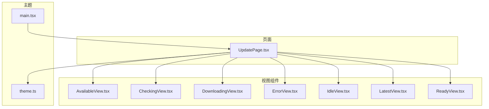
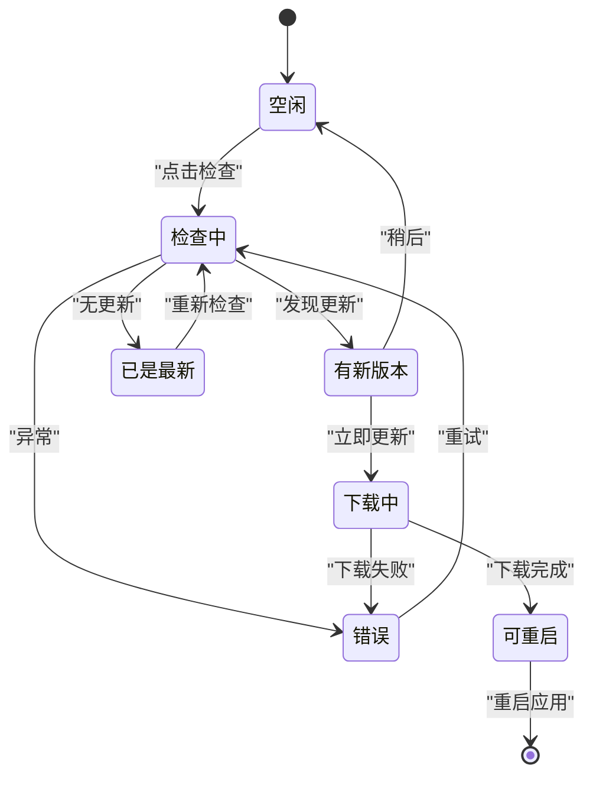
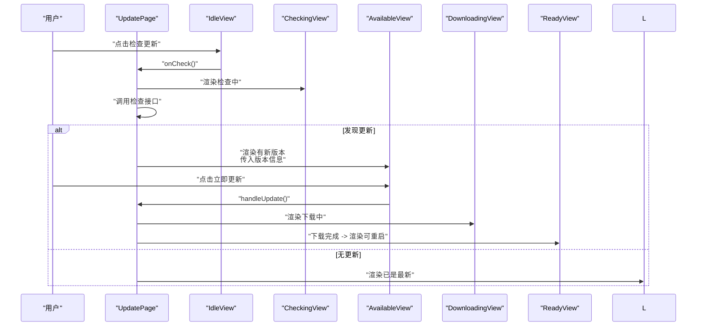
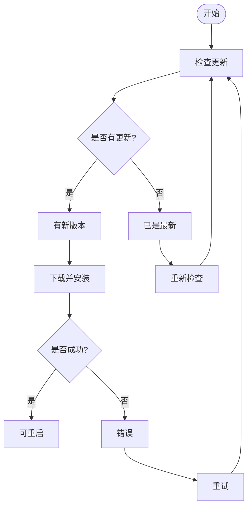
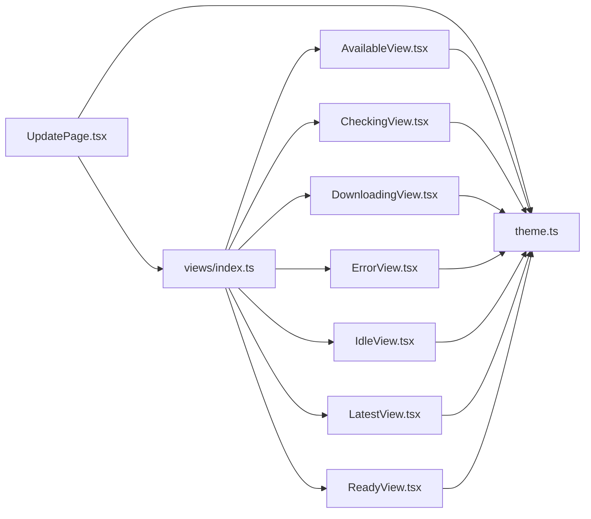

# 视图组件

<cite>
**本文引用的文件**
- [src/pages/views/AvailableView.tsx](file://src/pages/views/AvailableView.tsx)
- [src/pages/views/CheckingView.tsx](file://src/pages/views/CheckingView.tsx)
- [src/pages/views/DownloadingView.tsx](file://src/pages/views/DownloadingView.tsx)
- [src/pages/views/ErrorView.tsx](file://src/pages/views/ErrorView.tsx)
- [src/pages/views/IdleView.tsx](file://src/pages/views/IdleView.tsx)
- [src/pages/views/LatestView.tsx](file://src/pages/views/LatestView.tsx)
- [src/pages/views/ReadyView.tsx](file://src/pages/views/ReadyView.tsx)
- [src/pages/views/index.ts](file://src/pages/views/index.ts)
- [src/pages/UpdatePage.tsx](file://src/pages/UpdatePage.tsx)
- [src/theme/theme.ts](file://src/theme/theme.ts)
- [src/main.tsx](file://src/main.tsx)
</cite>

## 目录
1. [简介](#简介)
2. [项目结构](#项目结构)
3. [核心组件](#核心组件)
4. [架构总览](#架构总览)
5. [详细组件分析](#详细组件分析)
6. [依赖分析](#依赖分析)
7. [性能考虑](#性能考虑)
8. [故障排查指南](#故障排查指南)
9. [结论](#结论)
10. [附录](#附录)

## 简介
本文件聚焦于 Medex 的“更新视图”组件体系，系统性梳理并说明以下视图组件的功能特性、状态管理、数据绑定与用户交互：AvailableView（有新版本）、CheckingView（检查中）、DownloadingView（下载中）、ErrorView（错误）、IdleView（空闲）、LatestView（已是最新）、ReadyView（可重启）。文档还涵盖视图间切换机制与状态同步、定制与扩展方法、错误处理与异常处理、加载状态管理与用户体验优化，并给出使用示例与集成模式。

## 项目结构
更新视图组件位于页面目录下的 views 子目录，统一由 UpdatePage 页面进行状态驱动与内容渲染；主题系统通过 ThemeContext 注入，主题颜色类型定义在 theme.ts 中；入口文件 main.tsx 根据路径决定渲染 Update 页面。

图表来源
- [src/pages/UpdatePage.tsx](file://src/pages/UpdatePage.tsx)
- [src/pages/views/AvailableView.tsx](file://src/pages/views/AvailableView.tsx)
- [src/pages/views/CheckingView.tsx](file://src/pages/views/CheckingView.tsx)
- [src/pages/views/DownloadingView.tsx](file://src/pages/views/DownloadingView.tsx)
- [src/pages/views/ErrorView.tsx](file://src/pages/views/ErrorView.tsx)
- [src/pages/views/IdleView.tsx](file://src/pages/views/IdleView.tsx)
- [src/pages/views/LatestView.tsx](file://src/pages/views/LatestView.tsx)
- [src/pages/views/ReadyView.tsx](file://src/pages/views/ReadyView.tsx)
- [src/theme/theme.ts](file://src/theme/theme.ts)
- [src/main.tsx](file://src/main.tsx)

章节来源
- [src/pages/views/index.ts](file://src/pages/views/index.ts)
- [src/pages/UpdatePage.tsx](file://src/pages/UpdatePage.tsx)
- [src/theme/theme.ts](file://src/theme/theme.ts)
- [src/main.tsx](file://src/main.tsx)

## 核心组件
- IdleView：初始状态，提供“检查更新”入口，触发检查流程。
- CheckingView：展示检查中的加载动画与提示文案。
- AvailableView：当检测到新版本时展示版本信息与更新日志，并提供“立即更新/稍后”操作。
- LatestView：当已是最新版本时提示用户并允许重新检查。
- DownloadingView：展示下载进度动画与提示，强调不要关闭窗口。
- ReadyView：下载完成后提示需要重启以完成更新。
- ErrorView：展示错误信息与“重试”按钮，支持再次发起检查。

这些组件均接收主题颜色对象作为 props，确保在深色/浅色主题下具备一致的视觉表现。

章节来源
- [src/pages/views/IdleView.tsx](file://src/pages/views/IdleView.tsx)
- [src/pages/views/CheckingView.tsx](file://src/pages/views/CheckingView.tsx)
- [src/pages/views/AvailableView.tsx](file://src/pages/views/AvailableView.tsx)
- [src/pages/views/LatestView.tsx](file://src/pages/views/LatestView.tsx)
- [src/pages/views/DownloadingView.tsx](file://src/pages/views/DownloadingView.tsx)
- [src/pages/views/ReadyView.tsx](file://src/pages/views/ReadyView.tsx)
- [src/pages/views/ErrorView.tsx](file://src/pages/views/ErrorView.tsx)

## 架构总览
UpdatePage 维护更新流程的状态机，根据状态选择渲染对应的视图组件。各视图组件通过回调函数与父组件通信，实现状态变更与流程推进。

图表来源
- [src/pages/UpdatePage.tsx](file://src/pages/UpdatePage.tsx)

## 详细组件分析

### IdleView（空闲）
- 功能：展示当前版本与“检查更新”按钮，触发检查流程。
- 数据绑定：接收 onCheck 回调与主题对象。
- 用户交互：点击按钮进入“检查中”状态。
- 主题适配：使用主题文本与高亮色，按钮采用圆角与过渡动效。

章节来源
- [src/pages/views/IdleView.tsx](file://src/pages/views/IdleView.tsx)

### CheckingView（检查中）
- 功能：展示旋转加载动画与提示文案，表示正在检查更新。
- 数据绑定：接收主题对象。
- 用户交互：无交互，仅用于状态占位。
- 主题适配：加载圈边框与高亮色来自主题，提升可读性。

章节来源
- [src/pages/views/CheckingView.tsx](file://src/pages/views/CheckingView.tsx)

### AvailableView（有新版本）
- 功能：展示当前版本与最新版本信息、更新日志，并提供“立即更新/稍后”操作。
- 数据绑定：currentVersion、updateInfo（版本号与日志）、onUpdate、onLater、theme。
- 用户交互：点击“立即更新”进入下载流程；点击“稍后”回到空闲状态。
- 主题适配：版本信息卡片与日志区域使用主题背景与文本色，按钮采用主题高亮色。

章节来源
- [src/pages/views/AvailableView.tsx](file://src/pages/views/AvailableView.tsx)

### LatestView（已是最新）
- 功能：提示已是最新版本，并提供“重新检查”按钮。
- 数据绑定：onRecheck 回调与主题对象。
- 用户交互：点击“重新检查”触发一次新的检查流程。
- 主题适配：使用主题文本与高亮色，按钮采用圆角与过渡动效。

章节来源
- [src/pages/views/LatestView.tsx](file://src/pages/views/LatestView.tsx)

### DownloadingView（下载中）
- 功能：展示下载动画与提示，强调不要关闭窗口。
- 数据绑定：接收主题对象。
- 用户交互：无交互，仅用于状态占位。
- 主题适配：下载图标与高亮色来自主题，增强可感知性。

章节来源
- [src/pages/views/DownloadingView.tsx](file://src/pages/views/DownloadingView.tsx)

### ReadyView（可重启）
- 功能：提示更新已准备就绪，需要重启应用以完成更新。
- 数据绑定：onRestart 回调与主题对象。
- 用户交互：点击“立即重启”触发页面刷新，完成更新。
- 主题适配：使用主题文本与高亮色，按钮采用圆角与阴影。

章节来源
- [src/pages/views/ReadyView.tsx](file://src/pages/views/ReadyView.tsx)

### ErrorView（错误）
- 功能：展示错误信息与“重试”按钮。
- 数据绑定：message（错误消息）、onRetry 回调、theme。
- 用户交互：点击“重试”触发一次新的检查流程。
- 主题适配：错误图标与文本使用警示色，按钮采用圆角与过渡动效。

章节来源
- [src/pages/views/ErrorView.tsx](file://src/pages/views/ErrorView.tsx)

### 视图切换与状态同步
- 状态机：UpdatePage 维护更新状态（idle/checking/available/latest/downloading/downloaded/error），通过 useEffect 自动发起一次检查。
- 切换机制：根据状态值在 renderContent 中返回对应视图组件；AvailableView 的“稍后”将状态切回 idle；LatestView 与 ErrorView 的“重新检查/重试”回到 checking。
- 数据同步：AvailableView 接收 updateInfo（版本号与日志）；ReadyView 在下载完成后触发重启；ErrorView 展示错误消息并允许重试。

图表来源
- [src/pages/UpdatePage.tsx](file://src/pages/UpdatePage.tsx)
- [src/pages/views/IdleView.tsx](file://src/pages/views/IdleView.tsx)
- [src/pages/views/CheckingView.tsx](file://src/pages/views/CheckingView.tsx)
- [src/pages/views/AvailableView.tsx](file://src/pages/views/AvailableView.tsx)
- [src/pages/views/DownloadingView.tsx](file://src/pages/views/DownloadingView.tsx)
- [src/pages/views/ReadyView.tsx](file://src/pages/views/ReadyView.tsx)

章节来源
- [src/pages/UpdatePage.tsx](file://src/pages/UpdatePage.tsx)

### 视图定制与扩展
- 新增状态与视图：在 UpdatePage 的状态枚举中添加新状态，在 renderContent 中新增分支；新建对应视图组件并在 index.ts 导出。
- 主题一致性：所有视图组件均接收 theme 参数，遵循主题色表中的文本、高亮、背景等字段，确保跨主题一致体验。
- 行为扩展：通过回调函数（如 onUpdate/onLater/onRestart/onRetry）与父组件解耦，便于替换具体行为（例如改为调用外部更新服务）。

章节来源
- [src/pages/UpdatePage.tsx](file://src/pages/UpdatePage.tsx)
- [src/pages/views/index.ts](file://src/pages/views/index.ts)
- [src/theme/theme.ts](file://src/theme/theme.ts)

### 错误处理与异常情况
- 检查阶段异常：捕获检查接口异常，区分“未激活/无发布”与其它错误，设置友好提示或通用错误消息，并进入 error 状态。
- 下载阶段异常：捕获下载与安装异常，设置错误消息并进入 error 状态。
- 用户恢复：ErrorView 提供“重试”按钮，回到检查流程；LatestView 提供“重新检查”。

图表来源
- [src/pages/UpdatePage.tsx](file://src/pages/UpdatePage.tsx)

章节来源
- [src/pages/UpdatePage.tsx](file://src/pages/UpdatePage.tsx)

### 加载状态管理与用户体验优化
- 状态过渡：UpdatePage 对内容容器启用过渡动画，避免状态切换时的突兀跳变。
- 加载反馈：CheckingView 与 DownloadingView 提供旋转动画与提示文案，减少用户等待焦虑。
- 主题一致性：所有视图组件使用主题色，确保在深色/浅色模式下具备良好的可读性与情感一致性。
- 交互提示：按钮提供悬停态样式变化，增强可点击性与反馈感。

章节来源
- [src/pages/UpdatePage.tsx](file://src/pages/UpdatePage.tsx)
- [src/pages/views/CheckingView.tsx](file://src/pages/views/CheckingView.tsx)
- [src/pages/views/DownloadingView.tsx](file://src/pages/views/DownloadingView.tsx)
- [src/theme/theme.ts](file://src/theme/theme.ts)

### 使用示例与集成模式
- 页面集成：在 main.tsx 中通过路径判断渲染 Update 页面；Update 页面内部根据状态渲染对应视图组件。
- 主题注入：通过 ThemeProvider 将主题上下文注入到 Update 页面及其子视图组件。
- 状态驱动：UpdatePage 内部维护状态机，通过回调函数与视图组件通信，实现无样板代码的状态切换。

章节来源
- [src/main.tsx](file://src/main.tsx)
- [src/pages/UpdatePage.tsx](file://src/pages/UpdatePage.tsx)

## 依赖分析
- UpdatePage 依赖各视图组件与其导出索引；各视图组件依赖主题类型定义。
- 视图组件之间无直接依赖，通过 UpdatePage 的状态机进行编排。
- 主题系统提供统一的颜色语义，降低视图组件对具体颜色值的耦合。

图表来源
- [src/pages/UpdatePage.tsx](file://src/pages/UpdatePage.tsx)
- [src/pages/views/index.ts](file://src/pages/views/index.ts)
- [src/theme/theme.ts](file://src/theme/theme.ts)

章节来源
- [src/pages/views/index.ts](file://src/pages/views/index.ts)
- [src/theme/theme.ts](file://src/theme/theme.ts)

## 性能考虑
- 状态切换最小化：仅在必要时更新状态与渲染，避免不必要的重绘。
- 主题计算：主题色表集中管理，减少重复计算与硬编码颜色值。
- 动画与过渡：适度使用过渡动画提升体验，避免过度动画影响性能。

## 故障排查指南
- 无法进入“检查中”：确认 IdleView 的 onCheck 回调正确传递至 UpdatePage。
- 无更新但显示错误：检查检查接口返回值与错误分支逻辑，确保“未激活/无发布”的友好提示生效。
- 下载失败：确认 handleUpdate 中的下载与安装流程，查看错误消息并定位网络或权限问题。
- 主题不生效：确认 ThemeProvider 正确包裹 Update 页面，且各视图组件正确接收 theme 参数。

章节来源
- [src/pages/UpdatePage.tsx](file://src/pages/UpdatePage.tsx)
- [src/theme/theme.ts](file://src/theme/theme.ts)

## 结论
Medex 的更新视图组件通过清晰的状态机与主题驱动，实现了从“检查更新”到“下载完成”的完整闭环。各视图组件职责单一、交互明确、主题一致，便于扩展与维护。建议在新增功能时遵循现有模式：在状态机中新增状态、在 renderContent 中新增分支、新建对应视图组件并通过回调与父组件解耦。

## 附录
- 主题类型与颜色语义：参见主题定义文件，确保视图组件使用统一的文本、高亮、背景与交互色。
- 入口页面路由：main.tsx 根据路径决定渲染 Update 页面，确保 Update 页面在独立页面中运行。

章节来源
- [src/theme/theme.ts](file://src/theme/theme.ts)
- [src/main.tsx](file://src/main.tsx)