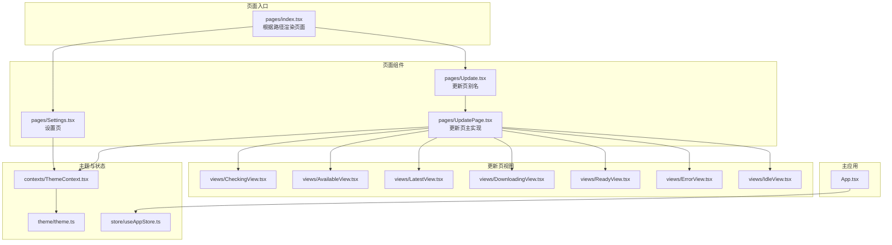
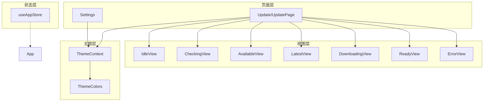
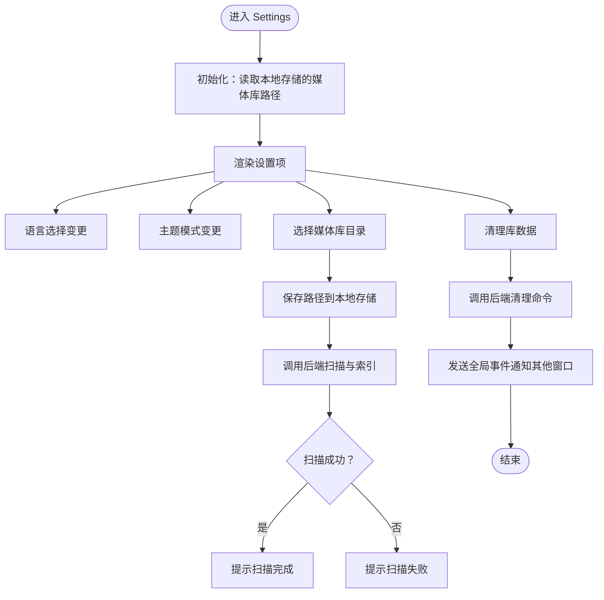
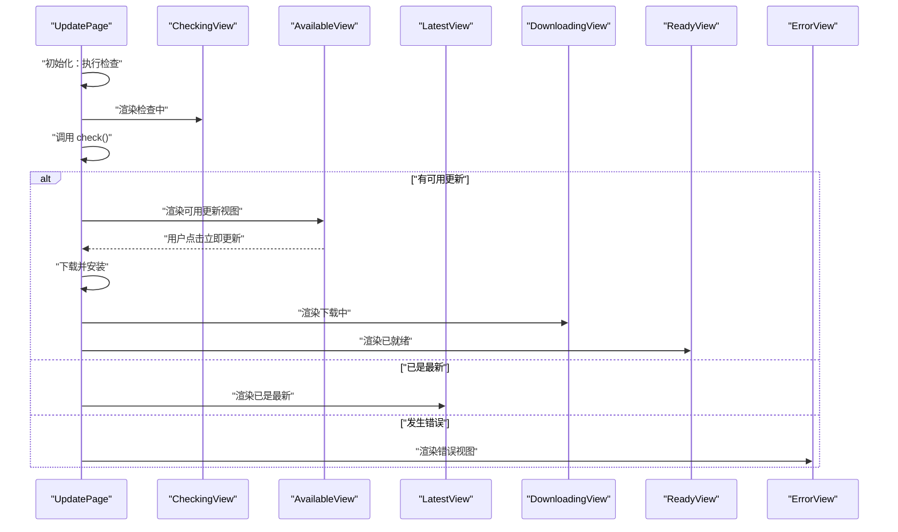
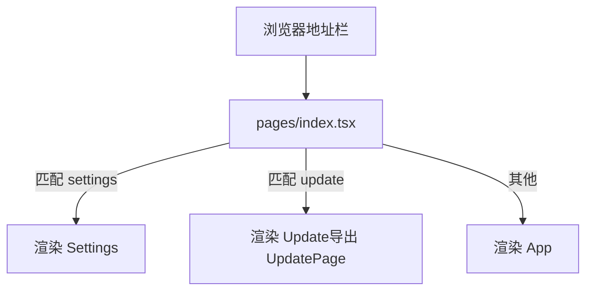
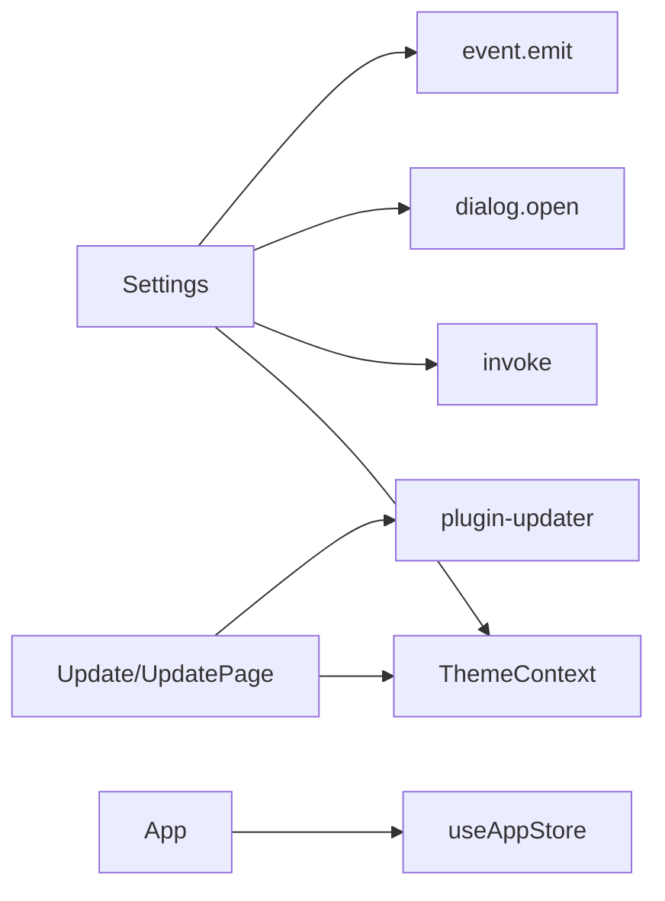

# 页面组件

<cite>
**本文引用的文件**
- [src/pages/Settings.tsx](file://src/pages/Settings.tsx)
- [src/pages/Update.tsx](file://src/pages/Update.tsx)
- [src/pages/UpdatePage.tsx](file://src/pages/UpdatePage.tsx)
- [src/pages/index.tsx](file://src/pages/index.tsx)
- [src/pages/views/CheckingView.tsx](file://src/pages/views/CheckingView.tsx)
- [src/pages/views/AvailableView.tsx](file://src/pages/views/AvailableView.tsx)
- [src/pages/views/LatestView.tsx](file://src/pages/views/LatestView.tsx)
- [src/pages/views/DownloadingView.tsx](file://src/pages/views/DownloadingView.tsx)
- [src/pages/views/ReadyView.tsx](file://src/pages/views/ReadyView.tsx)
- [src/pages/views/ErrorView.tsx](file://src/pages/views/ErrorView.tsx)
- [src/pages/views/IdleView.tsx](file://src/pages/views/IdleView.tsx)
- [src/contexts/ThemeContext.tsx](file://src/contexts/ThemeContext.tsx)
- [src/theme/theme.ts](file://src/theme/theme.ts)
- [src/store/useAppStore.ts](file://src/store/useAppStore.ts)
- [src/App.tsx](file://src/App.tsx)
</cite>

## 目录
1. [简介](#简介)
2. [项目结构](#项目结构)
3. [核心组件](#核心组件)
4. [架构总览](#架构总览)
5. [详细组件分析](#详细组件分析)
6. [依赖分析](#依赖分析)
7. [性能考虑](#性能考虑)
8. [故障排查指南](#故障排查指南)
9. [结论](#结论)
10. [附录](#附录)

## 简介
本章节面向 Medex 的页面级组件，重点解析 Settings、Update、UpdatePage 等页面的设计理念、布局结构与功能实现；梳理页面组件的路由集成、状态管理与用户导航流程；总结生命周期管理、数据获取与错误处理机制；提供页面定制与扩展指南，并说明页面间导航关系与数据传递方式，最后阐述响应式设计与用户体验优化策略。

## 项目结构
Medex 的页面组件位于 src/pages 目录，采用“按页面分文件”的组织方式，并通过一个轻量的路由入口根据 URL 路径决定渲染哪个页面。页面内部通过视图组件模块化展示不同状态下的 UI 内容。主题系统通过 ThemeContext 提供统一的颜色与样式变量，Store 则负责主界面的状态管理。

图表来源
- [src/pages/index.tsx:1-37](file://src/pages/index.tsx#L1-L37)
- [src/pages/Settings.tsx:1-272](file://src/pages/Settings.tsx#L1-L272)
- [src/pages/Update.tsx:1-5](file://src/pages/Update.tsx#L1-L5)
- [src/pages/UpdatePage.tsx:1-138](file://src/pages/UpdatePage.tsx#L1-L138)
- [src/pages/views/CheckingView.tsx:1-21](file://src/pages/views/CheckingView.tsx#L1-L21)
- [src/pages/views/AvailableView.tsx:1-87](file://src/pages/views/AvailableView.tsx#L1-L87)
- [src/pages/views/LatestView.tsx:1-48](file://src/pages/views/LatestView.tsx#L1-L48)
- [src/pages/views/DownloadingView.tsx:1-40](file://src/pages/views/DownloadingView.tsx#L1-L40)
- [src/pages/views/ReadyView.tsx:1-48](file://src/pages/views/ReadyView.tsx#L1-L48)
- [src/pages/views/ErrorView.tsx:1-49](file://src/pages/views/ErrorView.tsx#L1-L49)
- [src/pages/views/IdleView.tsx:1-32](file://src/pages/views/IdleView.tsx#L1-L32)
- [src/contexts/ThemeContext.tsx:1-99](file://src/contexts/ThemeContext.tsx#L1-L99)
- [src/theme/theme.ts:1-159](file://src/theme/theme.ts#L1-L159)
- [src/store/useAppStore.ts:1-395](file://src/store/useAppStore.ts#L1-L395)
- [src/App.tsx:1-73](file://src/App.tsx#L1-L73)

章节来源
- [src/pages/index.tsx:1-37](file://src/pages/index.tsx#L1-L37)

## 核心组件
- Settings（设置页）：提供语言、主题、媒体库路径、自动扫描等设置项，支持选择媒体库目录并触发扫描与索引，支持清理库数据并通过全局事件通知其他窗口。
- Update/UpdatePage（更新页）：通过 @tauri-apps/plugin-updater 检查更新，按状态渲染不同视图（空闲、检查中、有更新、已是最新、下载中、已就绪、错误），支持立即更新、稍后、重试、重启等操作。
- 页面路由入口：根据 window.location.pathname 匹配 /pages/settings.html 或 /pages/update.html，分别渲染 Settings 或 Update（Update.tsx 导出 UpdatePage）。
- 主应用 App：承载主界面布局，配合 Store 管理媒体列表、导航与查看器状态。

章节来源
- [src/pages/Settings.tsx:1-272](file://src/pages/Settings.tsx#L1-L272)
- [src/pages/Update.tsx:1-5](file://src/pages/Update.tsx#L1-L5)
- [src/pages/UpdatePage.tsx:1-138](file://src/pages/UpdatePage.tsx#L1-L138)
- [src/pages/index.tsx:1-37](file://src/pages/index.tsx#L1-L37)
- [src/App.tsx:1-73](file://src/App.tsx#L1-L73)

## 架构总览
页面组件与主题系统、状态管理的关系如下：

图表来源
- [src/pages/Settings.tsx:1-272](file://src/pages/Settings.tsx#L1-L272)
- [src/pages/UpdatePage.tsx:1-138](file://src/pages/UpdatePage.tsx#L1-L138)
- [src/pages/views/IdleView.tsx:1-32](file://src/pages/views/IdleView.tsx#L1-L32)
- [src/pages/views/CheckingView.tsx:1-21](file://src/pages/views/CheckingView.tsx#L1-L21)
- [src/pages/views/AvailableView.tsx:1-87](file://src/pages/views/AvailableView.tsx#L1-L87)
- [src/pages/views/LatestView.tsx:1-48](file://src/pages/views/LatestView.tsx#L1-L48)
- [src/pages/views/DownloadingView.tsx:1-40](file://src/pages/views/DownloadingView.tsx#L1-L40)
- [src/pages/views/ReadyView.tsx:1-48](file://src/pages/views/ReadyView.tsx#L1-L48)
- [src/pages/views/ErrorView.tsx:1-49](file://src/pages/views/ErrorView.tsx#L1-L49)
- [src/contexts/ThemeContext.tsx:1-99](file://src/contexts/ThemeContext.tsx#L1-L99)
- [src/theme/theme.ts:1-159](file://src/theme/theme.ts#L1-L159)
- [src/store/useAppStore.ts:1-395](file://src/store/useAppStore.ts#L1-L395)
- [src/App.tsx:1-73](file://src/App.tsx#L1-L73)

## 详细组件分析

### Settings 组件分析
设计理念
- 将设置项集中在一个页面内，提供统一的视觉风格与交互体验。
- 通过 ThemeContext 获取主题变量，确保深色/浅色/跟随系统模式的一致性。
- 与本地存储协作持久化部分设置（如媒体库路径），并与后端服务交互触发扫描与清理。

布局结构
- 顶部标题区：显示“设置”标题。
- 设置列表区：包含语言、主题、媒体库路径、自动扫描等设置项，每个设置项使用统一的边框与间距样式。

功能实现
- 语言切换：下拉选择语言并更新状态。
- 主题切换：提供深色/浅色/跟随系统三种模式，变更后写入本地存储并同步到 HTML 的 data-theme 属性。
- 媒体库路径：打开系统对话框选择目录，保存至 localStorage 并调用后端 scan_and_index 触发扫描；扫描完成后提示用户。
- 清理库数据：调用后端 clear_library_data，清理本地存储与状态，并通过全局事件通知其他窗口。

生命周期与状态管理
- 初始化：从 localStorage 读取媒体库路径。
- 用户交互：通过 useState 管理语言、主题、路径、自动扫描等状态。
- 事件与通信：使用 @tauri-apps/api/event 发送全局事件，跨窗口同步状态。

数据获取与错误处理
- 数据来源：本地存储与后端 Tauri 命令。
- 错误处理：捕获扫描与清理过程中的异常，弹窗提示用户。

图表来源
- [src/pages/Settings.tsx:15-70](file://src/pages/Settings.tsx#L15-L70)

章节来源
- [src/pages/Settings.tsx:1-272](file://src/pages/Settings.tsx#L1-L272)
- [src/contexts/ThemeContext.tsx:1-99](file://src/contexts/ThemeContext.tsx#L1-L99)
- [src/theme/theme.ts:1-159](file://src/theme/theme.ts#L1-L159)

### Update/UpdatePage 组件分析
设计理念
- 将更新流程拆分为多个状态视图，清晰表达“检查—下载—安装—重启”的完整生命周期。
- 通过 @tauri-apps/plugin-updater 提供真实更新能力，当前版本以模拟为主，便于后续对接。

布局结构
- 顶层容器：全屏居中布局，最大宽度约束，统一背景与文字颜色。
- 内容区：根据状态动态渲染对应视图组件，过渡动画提升交互体验。

功能实现
- 状态类型：idle/checking/available/latest/downloading/downloaded/error。
- 当前版本常量：固定为 1.0.0，用于对比展示。
- 检查更新：调用 check，若存在更新则携带版本号与更新日志；否则标记为 latest。
- 下载与安装：调用 downloadAndInstall 完成下载并准备重启。
- 错误处理：对 updater 未激活或无法获取 release 的场景给出友好提示。
- 重启：刷新页面以完成更新。

图表来源
- [src/pages/UpdatePage.tsx:34-86](file://src/pages/UpdatePage.tsx#L34-L86)
- [src/pages/views/CheckingView.tsx:1-21](file://src/pages/views/CheckingView.tsx#L1-L21)
- [src/pages/views/AvailableView.tsx:1-87](file://src/pages/views/AvailableView.tsx#L1-L87)
- [src/pages/views/LatestView.tsx:1-48](file://src/pages/views/LatestView.tsx#L1-L48)
- [src/pages/views/DownloadingView.tsx:1-40](file://src/pages/views/DownloadingView.tsx#L1-L40)
- [src/pages/views/ReadyView.tsx:1-48](file://src/pages/views/ReadyView.tsx#L1-L48)
- [src/pages/views/ErrorView.tsx:1-49](file://src/pages/views/ErrorView.tsx#L1-L49)

章节来源
- [src/pages/Update.tsx:1-5](file://src/pages/Update.tsx#L1-L5)
- [src/pages/UpdatePage.tsx:1-138](file://src/pages/UpdatePage.tsx#L1-L138)
- [src/pages/views/IdleView.tsx:1-32](file://src/pages/views/IdleView.tsx#L1-L32)

### 页面路由集成与导航流程
- 路由入口：pages/index.tsx 根据 window.location.pathname 判断是否为 /pages/settings.html 或 /pages/update.html，分别渲染 Settings 或 Update（Update.tsx 导出 UpdatePage）。
- 主应用：默认渲染 App，承载主界面布局与媒体查看器。
- 导航关系：Settings 与 UpdatePage 为独立页面，通过浏览器地址访问；主应用 App 与页面组件并存，互不冲突。

图表来源
- [src/pages/index.tsx:8-34](file://src/pages/index.tsx#L8-L34)

章节来源
- [src/pages/index.tsx:1-37](file://src/pages/index.tsx#L1-L37)

### 生命周期管理、数据获取与错误处理
- Settings
  - 生命周期：组件挂载时读取本地存储；用户交互时更新状态；清理数据时发出全局事件。
  - 数据获取：本地存储、Tauri 后端命令。
  - 错误处理：捕获扫描与清理异常，弹窗提示。
- UpdatePage
  - 生命周期：组件挂载时自动检查更新；根据用户操作切换状态。
  - 数据获取：@tauri-apps/plugin-updater 的 check/downloadAndInstall。
  - 错误处理：区分 updater 未激活与网络错误，给出友好提示；下载失败时进入 error 状态。

章节来源
- [src/pages/Settings.tsx:15-70](file://src/pages/Settings.tsx#L15-L70)
- [src/pages/UpdatePage.tsx:34-86](file://src/pages/UpdatePage.tsx#L34-L86)

### 响应式设计与用户体验优化
- 主题系统：ThemeContext 提供深色/浅色/跟随系统三种模式，主题变量集中定义于 theme.ts，页面组件通过 useThemeContext 获取样式属性，确保一致的视觉体验。
- 视图组件：各状态视图均使用统一的字体、间距与交互反馈（悬停、过渡动画），提升可感知性与一致性。
- 主应用：最小宽度约束与分栏布局，保证在桌面端的良好显示效果。

章节来源
- [src/contexts/ThemeContext.tsx:1-99](file://src/contexts/ThemeContext.tsx#L1-L99)
- [src/theme/theme.ts:1-159](file://src/theme/theme.ts#L1-L159)
- [src/App.tsx:59-72](file://src/App.tsx#L59-L72)

### 页面定制与扩展指南
- 新增设置项：在 Settings 中添加新的表单项，使用 ThemeContext 的主题变量控制样式；必要时调用 Tauri 命令与本地存储协同。
- 新增更新状态：在 UpdatePage 的状态枚举与 switch 分支中新增分支；新增对应的视图组件并在 UpdatePage 中渲染。
- 主题扩展：在 theme.ts 中扩展 ThemeColors 字段或新增主题模式，ThemeContext 自动适配。
- 状态扩展：在 useAppStore 中新增状态字段与派生逻辑，避免破坏现有行为。

章节来源
- [src/pages/Settings.tsx:92-266](file://src/pages/Settings.tsx#L92-L266)
- [src/pages/UpdatePage.tsx:12-119](file://src/pages/UpdatePage.tsx#L12-L119)
- [src/theme/theme.ts:8-52](file://src/theme/theme.ts#L8-L52)
- [src/store/useAppStore.ts:48-68](file://src/store/useAppStore.ts#L48-L68)

## 依赖分析
- 页面组件依赖 ThemeContext 获取主题变量，确保 UI 与主题一致。
- UpdatePage 依赖 @tauri-apps/plugin-updater 提供的 check/downloadAndInstall 能力。
- Settings 依赖 @tauri-apps/api/core 的 invoke 与 @tauri-apps/plugin-dialog 的 open，以及 @tauri-apps/api/event 的 emit。
- 主应用 App 依赖 useAppStore 管理媒体列表与导航状态。

图表来源
- [src/pages/Settings.tsx:1-7](file://src/pages/Settings.tsx#L1-L7)
- [src/pages/UpdatePage.tsx:1-10](file://src/pages/UpdatePage.tsx#L1-L10)
- [src/App.tsx:1-6](file://src/App.tsx#L1-L6)

章节来源
- [src/pages/Settings.tsx:1-7](file://src/pages/Settings.tsx#L1-L7)
- [src/pages/UpdatePage.tsx:1-10](file://src/pages/UpdatePage.tsx#L1-L10)
- [src/App.tsx:1-6](file://src/App.tsx#L1-L6)

## 性能考虑
- 状态粒度：Settings 与 UpdatePage 的状态相对简单，使用 useState 即可满足需求；如需复杂状态，建议拆分更细的子状态或引入 Zustand 的局部 store。
- 主题切换：ThemeContext 仅在模式变化时更新 HTML 的 data-theme 属性，开销极小。
- 视图渲染：UpdatePage 使用 switch 渲染不同视图，避免不必要的组件实例化；IdleView/CheckingView 等轻量组件，渲染成本低。
- 主应用：App 对媒体列表进行过滤与计算，建议在 Store 中维护派生状态，减少重复计算。

## 故障排查指南
- 设置页扫描失败
  - 现象：弹窗提示扫描失败。
  - 排查：确认 Tauri 命令 scan_and_index 是否正确注册；检查路径权限与磁盘空间。
- 清理库数据无效
  - 现象：清理后仍显示旧数据。
  - 排查：确认后端命令 clear_library_data 是否成功；检查全局事件是否被其他窗口监听。
- 更新页检查失败
  - 现象：进入 error 视图。
  - 排查：检查网络连通性；确认 release 是否已发布；查看错误消息中的关键字（如 not active、Could not fetch）。
- 更新页下载失败
  - 现象：下载中后进入 error 视图。
  - 排查：检查下载链接有效性与磁盘空间；尝试重试或稍后再试。

章节来源
- [src/pages/Settings.tsx:46-70](file://src/pages/Settings.tsx#L46-L70)
- [src/pages/UpdatePage.tsx:55-85](file://src/pages/UpdatePage.tsx#L55-L85)

## 结论
Settings 与 UpdatePage 两个页面组件分别覆盖“设置管理”和“更新流程”，通过 ThemeContext 实现一致的主题体验，通过 @tauri-apps 插件实现与原生能力的无缝集成。页面采用轻量路由入口与视图组件化渲染，具备良好的可维护性与扩展性。建议在后续迭代中完善 UpdatePage 的真实更新对接，并持续优化主题与状态管理的边界。

## 附录
- 使用示例
  - 访问设置页：在浏览器地址栏输入 /pages/settings.html。
  - 访问更新页：在浏览器地址栏输入 /pages/update.html。
- 集成模式
  - 在主应用 App 中通过路由或菜单跳转至页面组件。
  - 通过全局事件（如 medex:library-path-cleared）实现跨窗口状态同步。