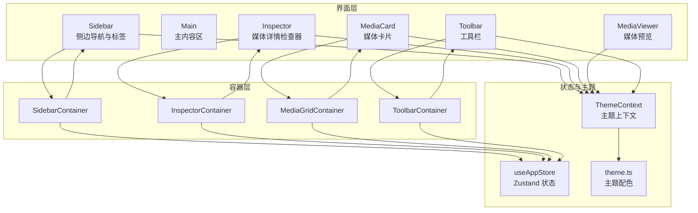
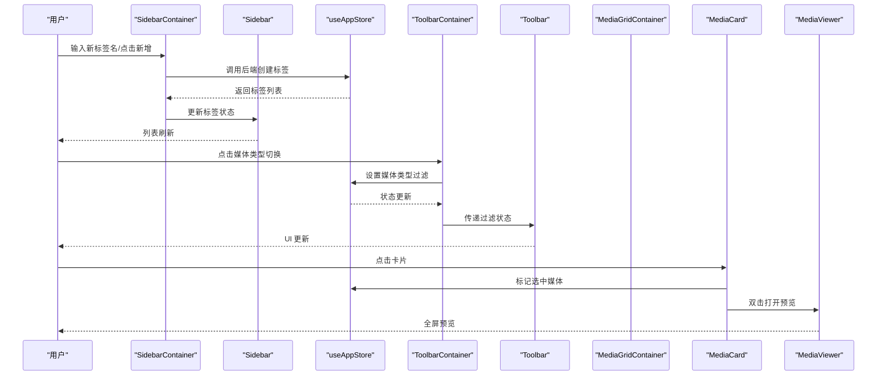
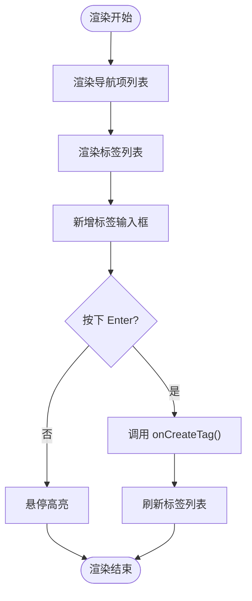
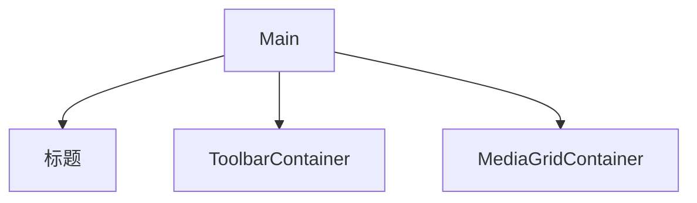
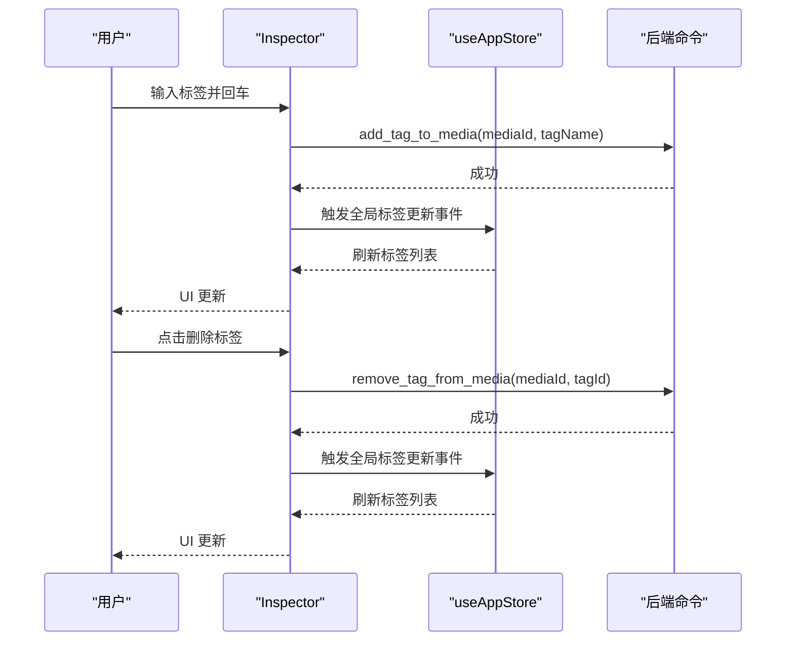
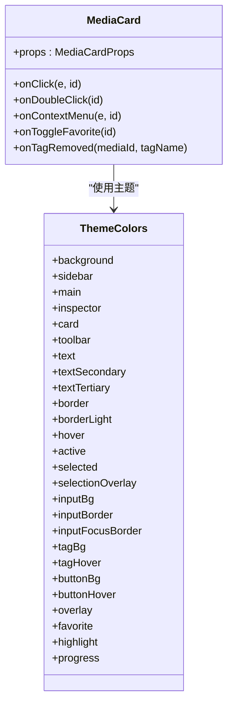
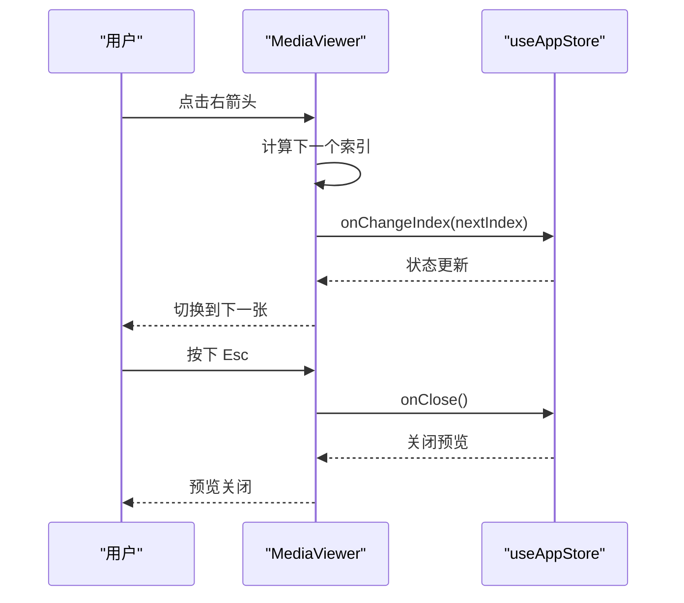
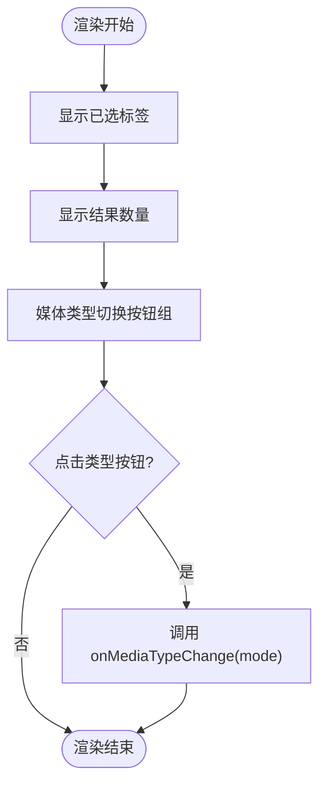
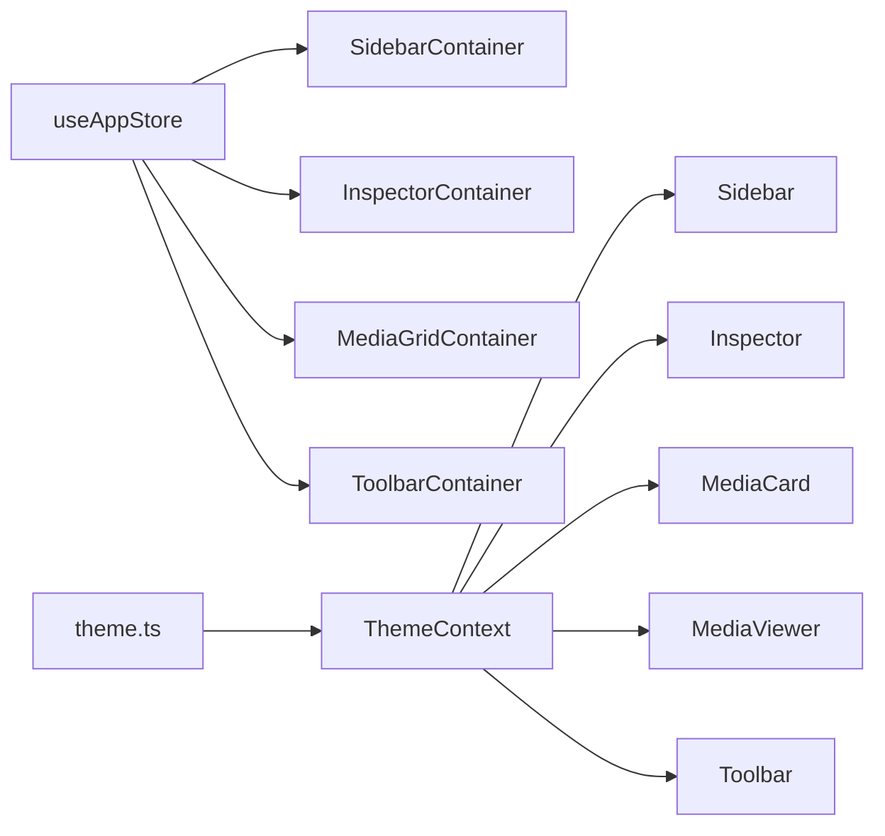

# UI 组件详解

<cite>
**本文引用的文件**
- [Sidebar.tsx](file://src/components/Sidebar.tsx)
- [SidebarContainer.tsx](file://src/containers/SidebarContainer.tsx)
- [Main.tsx](file://src/components/Main.tsx)
- [Inspector.tsx](file://src/components/Inspector.tsx)
- [InspectorContainer.tsx](file://src/containers/InspectorContainer.tsx)
- [MediaCard.tsx](file://src/components/MediaCard.tsx)
- [MediaCardContextMenu.tsx](file://src/components/MediaCardContextMenu.tsx)
- [MediaGridContainer.tsx](file://src/containers/MediaGridContainer.tsx)
- [MediaViewer.tsx](file://src/components/MediaViewer.tsx)
- [Toolbar.tsx](file://src/components/Toolbar.tsx)
- [ToolbarContainer.tsx](file://src/containers/ToolbarContainer.tsx)
- [ThemeContext.tsx](file://src/contexts/ThemeContext.tsx)
- [theme.ts](file://src/theme/theme.ts)
- [useAppStore.ts](file://src/store/useAppStore.ts)
</cite>

## 目录
1. [简介](#简介)
2. [项目结构](#项目结构)
3. [核心组件](#核心组件)
4. [架构总览](#架构总览)
5. [详细组件分析](#详细组件分析)
6. [依赖关系分析](#依赖关系分析)
7. [性能考量](#性能考量)
8. [故障排查指南](#故障排查指南)
9. [结论](#结论)
10. [附录](#附录)

## 简介
本文件面向 Medex 的 UI 组件体系，围绕 Sidebar、Main、Inspector、MediaCard、MediaViewer、Toolbar 六大核心组件进行深入解析。内容涵盖各组件的职责边界、props 接口、事件处理、样式与主题集成、可访问性与响应式设计、性能优化策略、最佳实践与常见问题解决方案，并辅以可视化流程与时序图帮助理解。

## 项目结构
Medex 采用“容器组件 + 展示组件”的分层组织方式：
- 展示组件：直接负责渲染与交互，如 Sidebar、Main、Inspector、MediaCard、MediaViewer、Toolbar。
- 容器组件：负责状态管理、事件桥接与业务逻辑，如 SidebarContainer、MediaGridContainer、ToolbarContainer、InspectorContainer。
- 状态与主题：通过 Zustand store 与 ThemeContext 提供全局状态与主题上下文。

图表来源
- [Sidebar.tsx:17-144](file://src/components/Sidebar.tsx#L17-L144)
- [SidebarContainer.tsx:7-78](file://src/containers/SidebarContainer.tsx#L7-L78)
- [Main.tsx:8-24](file://src/components/Main.tsx#L8-L24)
- [Inspector.tsx:19-265](file://src/components/Inspector.tsx#L19-L265)
- [InspectorContainer.tsx:6-31](file://src/containers/InspectorContainer.tsx#L6-L31)
- [MediaCard.tsx:34-264](file://src/components/MediaCard.tsx#L34-L264)
- [MediaGridContainer.tsx:30-618](file://src/containers/MediaGridContainer.tsx#L30-L618)
- [MediaViewer.tsx:14-174](file://src/components/MediaViewer.tsx#L14-L174)
- [Toolbar.tsx:12-74](file://src/components/Toolbar.tsx#L12-L74)
- [ToolbarContainer.tsx:14-112](file://src/containers/ToolbarContainer.tsx#L14-L112)
- [ThemeContext.tsx:17-98](file://src/contexts/ThemeContext.tsx#L17-L98)
- [theme.ts:54-158](file://src/theme/theme.ts#L54-L158)
- [useAppStore.ts:145-394](file://src/store/useAppStore.ts#L145-L394)

章节来源
- [Sidebar.tsx:17-144](file://src/components/Sidebar.tsx#L17-L144)
- [SidebarContainer.tsx:7-78](file://src/containers/SidebarContainer.tsx#L7-L78)
- [Main.tsx:8-24](file://src/components/Main.tsx#L8-L24)
- [Inspector.tsx:19-265](file://src/components/Inspector.tsx#L19-L265)
- [InspectorContainer.tsx:6-31](file://src/containers/InspectorContainer.tsx#L6-L31)
- [MediaCard.tsx:34-264](file://src/components/MediaCard.tsx#L34-L264)
- [MediaGridContainer.tsx:30-618](file://src/containers/MediaGridContainer.tsx#L30-L618)
- [MediaViewer.tsx:14-174](file://src/components/MediaViewer.tsx#L14-L174)
- [Toolbar.tsx:12-74](file://src/components/Toolbar.tsx#L12-L74)
- [ToolbarContainer.tsx:14-112](file://src/containers/ToolbarContainer.tsx#L14-L112)
- [ThemeContext.tsx:17-98](file://src/contexts/ThemeContext.tsx#L17-L98)
- [theme.ts:54-158](file://src/theme/theme.ts#L54-L158)
- [useAppStore.ts:145-394](file://src/store/useAppStore.ts#L145-L394)

## 核心组件
本节概述六大组件的职责与关键接口，便于快速定位与使用。

- Sidebar（侧边导航与标签）
  - 负责导航项与标签列表的渲染与交互，支持新增、删除、点击等操作。
  - 关键 props：导航项数组、标签数组、新标签名输入回调、创建/删除/点击回调、主题对象。
  - 事件：onNavClick、onCreateTag、onDeleteTag、onTagClick。
  - 主题：通过 theme 注入背景、文字、边框、输入框、按钮等颜色。

- Main（主内容区）
  - 定义主区域布局，承载工具栏与媒体网格容器。
  - 关键 props：打开媒体预览的回调 onOpenViewer。
  - 子组件：ToolbarContainer、MediaGridContainer。

- Inspector（媒体详情检查器）
  - 展示选中媒体的预览、标签、信息与操作（收藏、删除、新增标签）。
  - 关键 props：媒体对象、收藏切换回调、删除媒体回调。
  - 事件：onToggleFavorite、onDeleteMedia。
  - 与后端通信：通过 invoke 调用后端命令获取/添加/移除标签。

- MediaCard（媒体卡片）
  - 媒体网格中的单个卡片，支持收藏、标签移除、双击打开预览、右键上下文菜单。
  - 关键 props：媒体标识、路径、缩略图、文件名、标签、是否收藏、是否选中、主题、模式(grid/list)。
  - 事件：onClick、onDoubleClick、onToggleFavorite、onTagRemoved、onContextMenu。
  - 性能：使用 memo 与自定义相等函数减少重渲染。

- MediaViewer（媒体预览）
  - 全屏预览当前媒体列表中的媒体，支持键盘左右键与左右按钮切换。
  - 关键 props：是否打开、媒体列表、当前索引、关闭回调、索引变更回调。
  - 事件：onClose、onChangeIndex。
  - 无障碍：提供关闭与上一张/下一张的 aria-label。

- Toolbar（工具栏）
  - 显示已选标签与结果数量，切换媒体类型过滤（全部/图片/视频）。
  - 关键 props：已选标签数组、结果数量、媒体类型、类型变更回调、主题。
  - 事件：onMediaTypeChange。

章节来源
- [Sidebar.tsx:5-15](file://src/components/Sidebar.tsx#L5-L15)
- [Main.tsx:4-6](file://src/components/Main.tsx#L4-L6)
- [Inspector.tsx:13-17](file://src/components/Inspector.tsx#L13-L17)
- [MediaCard.tsx:6-27](file://src/components/MediaCard.tsx#L6-L27)
- [MediaViewer.tsx:6-12](file://src/components/MediaViewer.tsx#L6-L12)
- [Toolbar.tsx:3-10](file://src/components/Toolbar.tsx#L3-L10)

## 架构总览
Medex 的 UI 架构遵循“容器-展示”分层，容器组件负责与状态与后端交互，展示组件专注渲染与用户交互。主题通过 ThemeContext 注入，统一风格。

图表来源
- [SidebarContainer.tsx:35-63](file://src/containers/SidebarContainer.tsx#L35-L63)
- [Sidebar.tsx:111-128](file://src/components/Sidebar.tsx#L111-L128)
- [useAppStore.ts:152-172](file://src/store/useAppStore.ts#L152-L172)
- [ToolbarContainer.tsx:27-29](file://src/containers/ToolbarContainer.tsx#L27-L29)
- [Toolbar.tsx:44-69](file://src/components/Toolbar.tsx#L44-L69)
- [MediaGridContainer.tsx:59-91](file://src/containers/MediaGridContainer.tsx#L59-L91)
- [MediaViewer.tsx:31-37](file://src/components/MediaViewer.tsx#L31-L37)

## 详细组件分析

### Sidebar 组件
- 职责
  - 渲染导航项与标签列表，支持新增标签、删除标签、标签点击与导航点击。
- Props 接口
  - navItems: SidebarNavItem[]
  - tags: SidebarTagItem[]
  - newTagName: string
  - onNewTagNameChange(value: string): void
  - onCreateTag(): void
  - onDeleteTag(tagId: string): void
  - onTagClick(tagId: string): void
  - onNavClick(navId: string): void
  - theme: ThemeColors
- 事件处理
  - 输入框支持 Enter 键快速创建标签。
  - 标签项支持删除（仅在未选中且计数为 0 时显示删除按钮）。
- 样式与主题
  - 通过内联 style 注入背景、文字、边框、输入框与按钮颜色。
- 可访问性
  - 按钮提供 title 与 aria-label（如收藏按钮）。
- 响应式
  - 固定宽度侧边栏，滚动区域适配小屏。

图表来源
- [Sidebar.tsx:42-141](file://src/components/Sidebar.tsx#L42-L141)
- [SidebarContainer.tsx:35-63](file://src/containers/SidebarContainer.tsx#L35-L63)

章节来源
- [Sidebar.tsx:5-15](file://src/components/Sidebar.tsx#L5-L15)
- [Sidebar.tsx:17-144](file://src/components/Sidebar.tsx#L17-L144)
- [SidebarContainer.tsx:7-78](file://src/containers/SidebarContainer.tsx#L7-L78)

### Main 组件
- 职责
  - 主内容区布局容器，包含标题、工具栏与媒体网格。
- Props 接口
  - onOpenViewer(mediaId: string): void
- 子组件
  - ToolbarContainer：工具栏容器
  - MediaGridContainer：媒体网格容器

图表来源
- [Main.tsx:8-24](file://src/components/Main.tsx#L8-L24)

章节来源
- [Main.tsx:4-6](file://src/components/Main.tsx#L4-L6)
- [Main.tsx:8-24](file://src/components/Main.tsx#L8-L24)

### Inspector 组件
- 职责
  - 展示媒体预览、标签、信息与操作（收藏、删除、新增标签）。
- Props 接口
  - media: MediaCardProps | null
  - onToggleFavorite(mediaId: string): void
  - onDeleteMedia(mediaId: string): void
- 事件处理
  - 新增标签：输入回车或点击按钮触发，去重后调用后端命令。
  - 删除标签：点击标签按钮触发，调用后端命令并刷新。
  - 收藏/取消收藏：调用 onToggleFavorite。
  - 删除媒体：调用 onDeleteMedia。
- 后端通信
  - 通过 invoke 调用 get_tags_by_media、add_tag_to_media、remove_tag_from_media。
- 可访问性
  - 按钮提供 aria-label 与 title。
- 响应式
  - 固定右侧面板宽度，内部内容自适应。

图表来源
- [Inspector.tsx:27-88](file://src/components/Inspector.tsx#L27-L88)
- [InspectorContainer.tsx:15-22](file://src/containers/InspectorContainer.tsx#L15-L22)

章节来源
- [Inspector.tsx:13-17](file://src/components/Inspector.tsx#L13-L17)
- [Inspector.tsx:19-265](file://src/components/Inspector.tsx#L19-L265)
- [InspectorContainer.tsx:6-31](file://src/containers/InspectorContainer.tsx#L6-L31)

### MediaCard 组件
- 职责
  - 媒体网格中的单个卡片，支持收藏、标签移除、双击打开预览、右键上下文菜单。
- Props 接口
  - id, path?, thumbnail, filename, tags, mediaType?, duration?, resolution?, isFavorite?, selected, onClick, onDoubleClick?, onToggleFavorite?, onTagRemoved?, onContextMenu?, videoThumbnail?, className?, mode, theme
- 事件处理
  - 收藏按钮：阻止冒泡，调用 onToggleFavorite。
  - 标签按钮：阻止冒泡，调用后端命令移除标签并触发全局事件。
  - 上下文菜单：阻止默认行为，调用 onContextMenu。
- 性能
  - 使用 memo 与自定义相等函数，避免不必要的重渲染。
- 可访问性
  - 收藏按钮提供 aria-label 与 title。
- 响应式
  - 支持 grid/list 两种模式，标签区域在 list 模式下使用多行溢出滚动。

图表来源
- [MediaCard.tsx:6-27](file://src/components/MediaCard.tsx#L6-L27)
- [theme.ts:8-52](file://src/theme/theme.ts#L8-L52)

章节来源
- [MediaCard.tsx:6-27](file://src/components/MediaCard.tsx#L6-L27)
- [MediaCard.tsx:34-264](file://src/components/MediaCard.tsx#L34-L264)
- [theme.ts:54-158](file://src/theme/theme.ts#L54-L158)

### MediaViewer 组件
- 职责
  - 全屏预览媒体，支持键盘左右键与左右按钮切换，ESC 关闭。
- Props 接口
  - open: boolean, mediaList: MediaItem[], currentIndex: number, onClose(): void, onChangeIndex(index: number): void
- 事件处理
  - 键盘事件：Escape 关闭，ArrowLeft/Right 切换。
  - 鼠标事件：左右按钮禁用态与透明度控制。
- 可访问性
  - 关闭与上一张/下一张按钮提供 aria-label。
- 响应式
  - 图片自适应容器，视频自动播放。

图表来源
- [MediaViewer.tsx:31-55](file://src/components/MediaViewer.tsx#L31-L55)
- [MediaViewer.tsx:14-20](file://src/components/MediaViewer.tsx#L14-L20)

章节来源
- [MediaViewer.tsx:6-12](file://src/components/MediaViewer.tsx#L6-L12)
- [MediaViewer.tsx:14-174](file://src/components/MediaViewer.tsx#L14-L174)

### Toolbar 组件
- 职责
  - 显示已选标签与结果数量，切换媒体类型过滤。
- Props 接口
  - activeTags: string[], resultCount: number, mediaType: 'all' | 'image' | 'video', onMediaTypeChange(mode): void, loading?: boolean, theme: ThemeColors
- 事件处理
  - 切换媒体类型：调用 onMediaTypeChange。
- 响应式
  - 标签区域可滚动，类型切换按钮组紧凑排列。

图表来源
- [Toolbar.tsx:25-71](file://src/components/Toolbar.tsx#L25-L71)
- [ToolbarContainer.tsx:27-29](file://src/containers/ToolbarContainer.tsx#L27-L29)

章节来源
- [Toolbar.tsx:3-10](file://src/components/Toolbar.tsx#L3-L10)
- [Toolbar.tsx:12-74](file://src/components/Toolbar.tsx#L12-L74)
- [ToolbarContainer.tsx:14-112](file://src/containers/ToolbarContainer.tsx#L14-L112)

## 依赖关系分析
- 组件间依赖
  - Sidebar 依赖 SidebarContainer 与 useAppStore。
  - Inspector 依赖 InspectorContainer 与 useAppStore。
  - MediaCard 由 MediaGridContainer 渲染并传入主题与事件。
  - MediaViewer 由 MediaGridContainer 的双击事件触发。
  - Toolbar 由 ToolbarContainer 渲染并绑定过滤逻辑。
- 主题依赖
  - 所有组件通过 ThemeContext 获取主题色，ThemeContext 从 theme.ts 读取深/浅主题配置。
- 状态依赖
  - useAppStore 提供导航、标签、媒体列表、选中媒体、视图模式、类型过滤等状态。

图表来源
- [useAppStore.ts:145-394](file://src/store/useAppStore.ts#L145-L394)
- [SidebarContainer.tsx:7-78](file://src/containers/SidebarContainer.tsx#L7-L78)
- [InspectorContainer.tsx:6-31](file://src/containers/InspectorContainer.tsx#L6-L31)
- [MediaGridContainer.tsx:30-618](file://src/containers/MediaGridContainer.tsx#L30-L618)
- [ToolbarContainer.tsx:14-112](file://src/containers/ToolbarContainer.tsx#L14-L112)
- [ThemeContext.tsx:17-98](file://src/contexts/ThemeContext.tsx#L17-L98)
- [theme.ts:54-158](file://src/theme/theme.ts#L54-L158)

章节来源
- [useAppStore.ts:145-394](file://src/store/useAppStore.ts#L145-L394)
- [ThemeContext.tsx:17-98](file://src/contexts/ThemeContext.tsx#L17-L98)
- [theme.ts:54-158](file://src/theme/theme.ts#L54-L158)

## 性能考量
- MediaCard 渲染优化
  - 使用 memo 与自定义相等函数，避免 props 变化导致的重渲染。
  - 标签移除采用后端命令异步执行，避免阻塞 UI。
- 媒体缩略图加载
  - MediaGridContainer 实现任务队列与并发限制，优先级调度，避免大量请求同时发起。
  - 监听 thumbnail_ready 事件，及时更新缩略图缓存并继续出队。
- 预览与全屏
  - MediaViewer 在切换媒体时销毁视频元素，避免资源占用。
- 主题切换
  - ThemeContext 将 data-theme 写入 html，确保 Tailwind 等样式系统正确响应。

章节来源
- [MediaCard.tsx:277-317](file://src/components/MediaCard.tsx#L277-L317)
- [MediaGridContainer.tsx:352-486](file://src/containers/MediaGridContainer.tsx#L352-L486)
- [MediaViewer.tsx:57-63](file://src/components/MediaViewer.tsx#L57-L63)
- [ThemeContext.tsx:46-54](file://src/contexts/ThemeContext.tsx#L46-L54)

## 故障排查指南
- 标签无法删除
  - 检查标签是否被选中且媒体计数为 0，否则不会显示删除按钮。
  - 确认后端命令返回成功，查看控制台错误日志。
- 新增标签失败
  - 确认输入非空且不重复，查看 alert 提示与控制台错误。
- 媒体预览空白
  - 检查路径是否为远程地址或本地绝对路径，必要时使用 convertFileSrc。
- 缩略图不显示
  - 确认 thumbnail_ready 事件是否触发，检查队列与并发限制。
- 主题不生效
  - 确认 ThemeContext 正常注入，data-theme 是否写入 html。

章节来源
- [Sidebar.tsx:12-13](file://src/components/Sidebar.tsx#L12-L13)
- [Inspector.tsx:67-88](file://src/components/Inspector.tsx#L67-L88)
- [MediaViewer.tsx:176-185](file://src/components/MediaViewer.tsx#L176-L185)
- [MediaGridContainer.tsx:453-486](file://src/containers/MediaGridContainer.tsx#L453-L486)
- [ThemeContext.tsx:56-66](file://src/contexts/ThemeContext.tsx#L56-L66)

## 结论
Medex 的 UI 组件体系通过清晰的分层与主题系统实现了良好的可维护性与一致性。Sidebar、Main、Inspector、MediaCard、MediaViewer、Toolbar 各司其职，配合容器组件与 Zustand 状态管理，形成完整的媒体浏览与管理体验。建议在扩展新功能时遵循现有模式：容器负责状态与事件，展示组件专注渲染与交互，主题通过 ThemeContext 统一注入，确保可访问性与响应式设计的一致性。

## 附录
- 最佳实践
  - 为所有交互元素提供 aria-label 或 title，提升可访问性。
  - 对于耗时操作（标签增删、媒体扫描）提供状态提示与防抖。
  - 使用 memo 与不可变更新减少重渲染。
  - 主题色统一来源于 ThemeContext，避免硬编码颜色。
- 常见问题
  - 标签删除按钮不显示：确认标签未被选中且媒体计数为 0。
  - 预览视频无法播放：确认路径转换与权限。
  - 缩略图加载缓慢：检查队列长度与并发上限，适当增大或优化优先级。