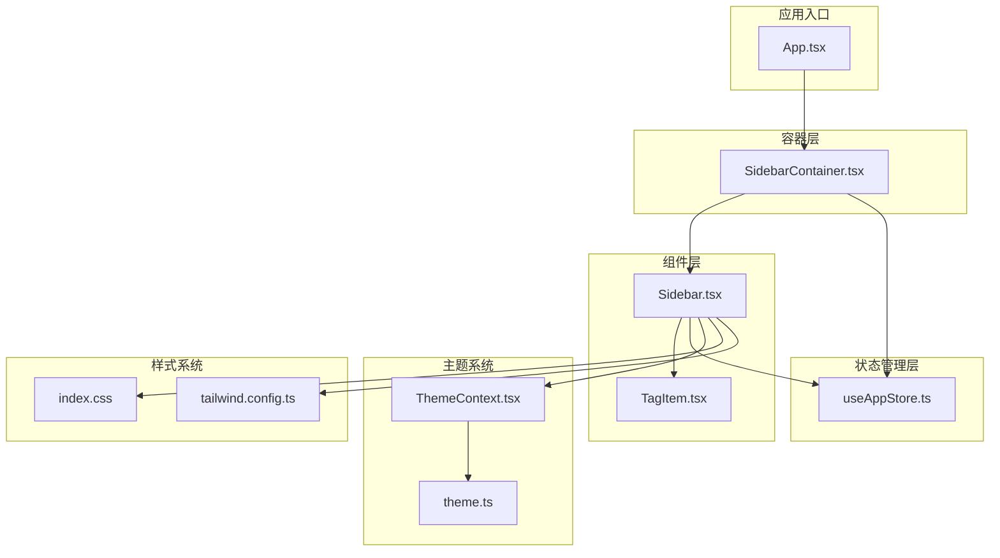
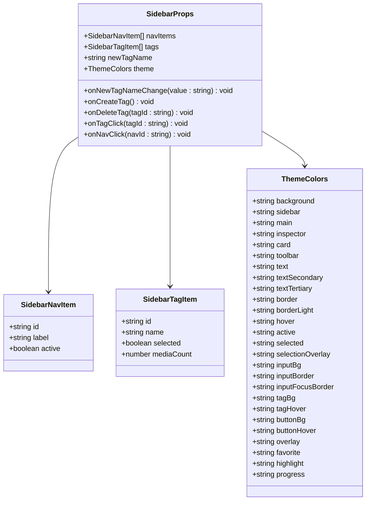
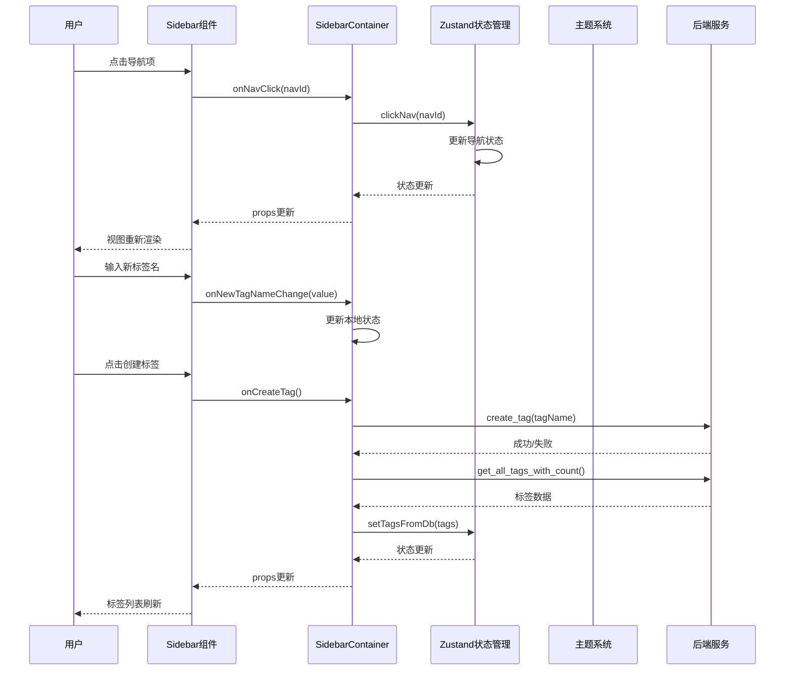
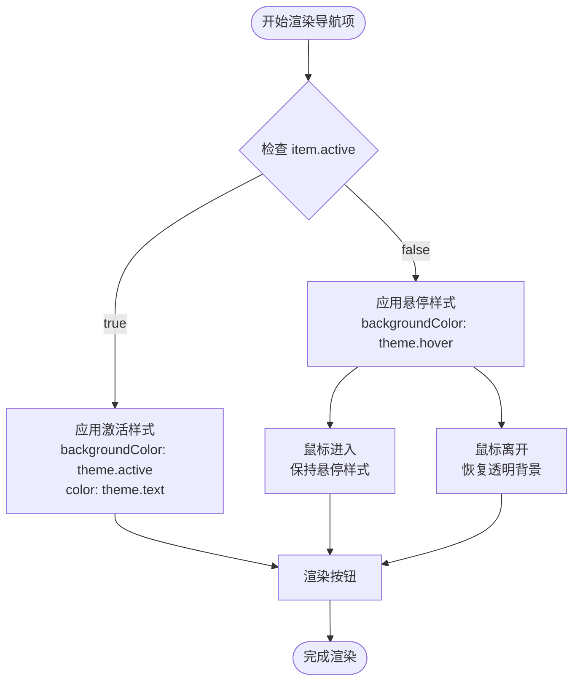
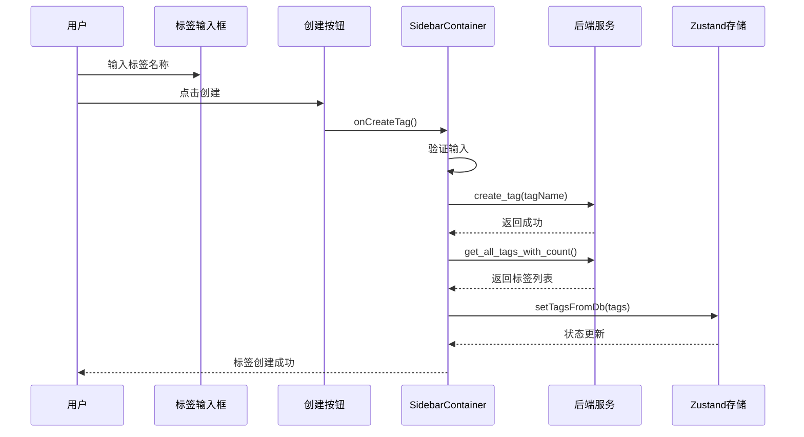
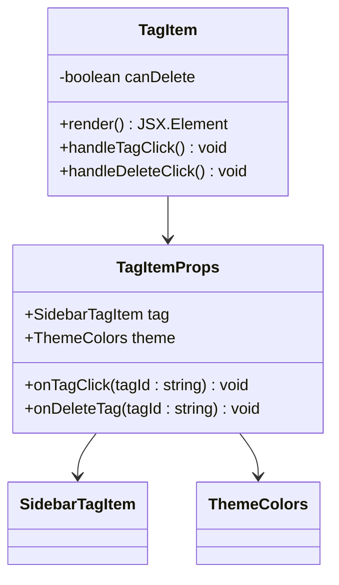
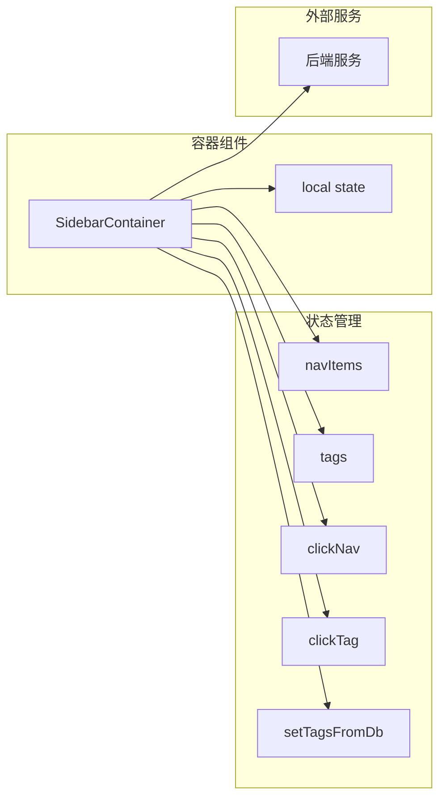
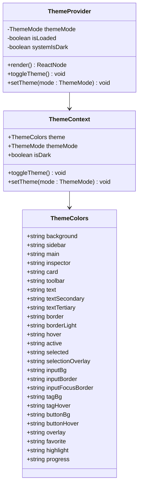
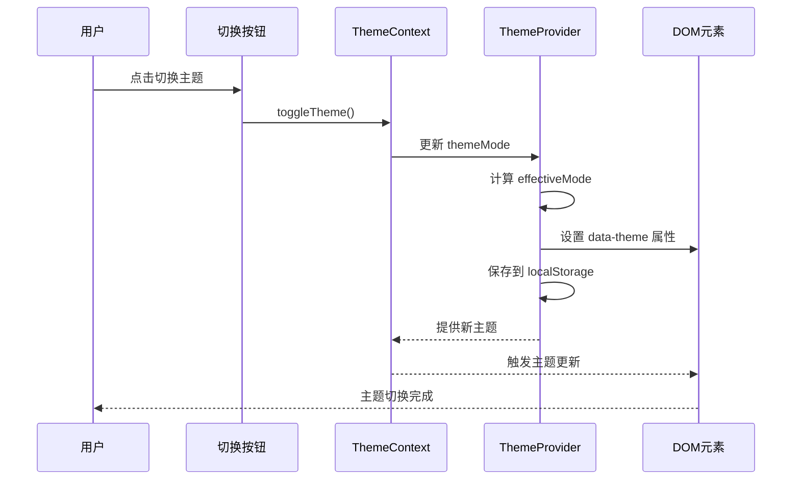
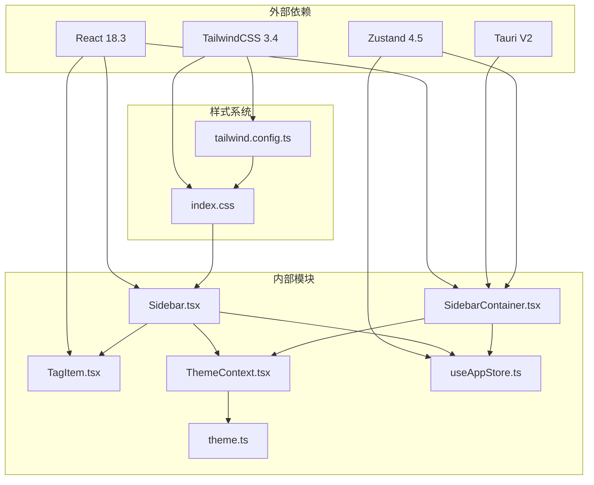

# 侧边栏组件 (Sidebar)

<cite>
**本文档引用的文件**
- [Sidebar.tsx](file://src/components/Sidebar.tsx)
- [SidebarContainer.tsx](file://src/containers/SidebarContainer.tsx)
- [TagItem.tsx](file://src/components/TagItem.tsx)
- [ThemeContext.tsx](file://src/contexts/ThemeContext.tsx)
- [theme.ts](file://src/theme/theme.ts)
- [useAppStore.ts](file://src/store/useAppStore.ts)
- [index.css](file://src/index.css)
- [tailwind.config.ts](file://src/tailwind.config.ts)
- [App.tsx](file://src/App.tsx)
- [README.md](file://README.md)
</cite>

## 目录
1. [简介](#简介)
2. [项目结构](#项目结构)
3. [核心组件](#核心组件)
4. [架构概览](#架构概览)
5. [详细组件分析](#详细组件分析)
6. [依赖关系分析](#依赖关系分析)
7. [性能考虑](#性能考虑)
8. [故障排除指南](#故障排除指南)
9. [结论](#结论)
10. [附录](#附录)

## 简介

Sidebar 侧边栏组件是 Medex 多媒体管理应用的核心导航组件，负责提供应用的主要导航功能和标签管理系统。该组件采用现代化的 React + TypeScript 架构，集成了完整的主题系统、响应式设计和可访问性特性。

Medex 应用采用三栏式布局：Sidebar（侧边栏）+ Main（主内容区）+ Inspector（检查器），Sidebar 作为用户与应用交互的主要入口点，提供导航菜单和标签管理功能。

## 项目结构

Sidebar 组件在项目中的组织结构如下：



**图表来源**
- [Sidebar.tsx:1-145](file://src/components/Sidebar.tsx#L1-L145)
- [SidebarContainer.tsx:1-79](file://src/containers/SidebarContainer.tsx#L1-L79)
- [useAppStore.ts:1-395](file://src/store/useAppStore.ts#L1-L395)
- [ThemeContext.tsx:1-99](file://src/contexts/ThemeContext.tsx#L1-L99)
- [theme.ts:1-159](file://src/theme/theme.ts#L1-L159)

**章节来源**
- [README.md:123-140](file://README.md#L123-L140)
- [App.tsx:59-72](file://src/App.tsx#L59-L72)

## 核心组件

### SidebarProps 接口定义

Sidebar 组件通过清晰的 TypeScript 接口定义了所有必要的属性和回调函数：



**图表来源**
- [Sidebar.tsx:5-15](file://src/components/Sidebar.tsx#L5-L15)
- [useAppStore.ts:3-14](file://src/store/useAppStore.ts#L3-L14)
- [theme.ts:8-52](file://src/theme/theme.ts#L8-L52)

### 主要功能特性

1. **导航功能**：提供应用主要页面的导航链接
2. **标签管理**：支持标签的创建、选择和删除
3. **主题适配**：完全集成的深色/浅色主题系统
4. **响应式设计**：适应不同屏幕尺寸的布局
5. **可访问性**：支持键盘导航和屏幕阅读器

**章节来源**
- [Sidebar.tsx:17-144](file://src/components/Sidebar.tsx#L17-L144)
- [useAppStore.ts:70-81](file://src/store/useAppStore.ts#L70-L81)

## 架构概览

Sidebar 组件采用了分层架构设计，确保了良好的关注点分离和可维护性：



**图表来源**
- [SidebarContainer.tsx:35-63](file://src/containers/SidebarContainer.tsx#L35-L63)
- [useAppStore.ts:152-173](file://src/store/useAppStore.ts#L152-L173)
- [ThemeContext.tsx:68-83](file://src/contexts/ThemeContext.tsx#L68-L83)

## 详细组件分析

### Sidebar 主组件

Sidebar 组件实现了完整的侧边栏功能，包括导航菜单和标签管理区域。

#### 导航项渲染逻辑

导航项的渲染采用了条件样式绑定，根据激活状态动态调整外观：



**图表来源**
- [Sidebar.tsx:47-69](file://src/components/Sidebar.tsx#L47-L69)

#### 标签创建和删除机制

标签管理功能提供了完整的 CRUD 操作：



**图表来源**
- [SidebarContainer.tsx:35-51](file://src/containers/SidebarContainer.tsx#L35-L51)
- [Sidebar.tsx:77-128](file://src/components/Sidebar.tsx#L77-L128)

#### 标签项组件

TagItem 子组件负责单个标签的显示和交互：



**图表来源**
- [TagItem.tsx:4-9](file://src/components/TagItem.tsx#L4-L9)
- [TagItem.tsx:11-69](file://src/components/TagItem.tsx#L11-L69)

**章节来源**
- [Sidebar.tsx:17-144](file://src/components/Sidebar.tsx#L17-L144)
- [TagItem.tsx:11-69](file://src/components/TagItem.tsx#L11-L69)

### SidebarContainer 容器组件

SidebarContainer 作为容器组件，负责处理业务逻辑和数据流：

#### 状态管理集成



**图表来源**
- [SidebarContainer.tsx:7-33](file://src/containers/SidebarContainer.tsx#L7-L33)
- [useAppStore.ts:145-394](file://src/store/useAppStore.ts#L145-L394)

#### 标签生命周期管理

容器组件实现了完整的标签生命周期管理：

**章节来源**
- [SidebarContainer.tsx:16-33](file://src/containers/SidebarContainer.tsx#L16-L33)
- [SidebarContainer.tsx:35-63](file://src/containers/SidebarContainer.tsx#L35-L63)

### 主题系统集成

Sidebar 组件完全集成了 Medex 的主题系统，支持深色/浅色主题切换：

#### 主题颜色配置



**图表来源**
- [theme.ts:8-52](file://src/theme/theme.ts#L8-L52)
- [ThemeContext.tsx:6-13](file://src/contexts/ThemeContext.tsx#L6-L13)
- [ThemeContext.tsx:17-89](file://src/contexts/ThemeContext.tsx#L17-L89)

#### 主题切换机制



**图表来源**
- [ThemeContext.tsx:68-83](file://src/contexts/ThemeContext.tsx#L68-L83)
- [ThemeContext.tsx:43-54](file://src/contexts/ThemeContext.tsx#L43-L54)

**章节来源**
- [theme.ts:54-159](file://src/theme/theme.ts#L54-L159)
- [ThemeContext.tsx:17-89](file://src/contexts/ThemeContext.tsx#L17-L89)

## 依赖关系分析

Sidebar 组件的依赖关系展现了清晰的分层架构：



**图表来源**
- [Sidebar.tsx:1-3](file://src/components/Sidebar.tsx#L1-L3)
- [SidebarContainer.tsx:2-5](file://src/containers/SidebarContainer.tsx#L2-L5)
- [useAppStore.ts:1](file://src/store/useAppStore.ts#L1)
- [ThemeContext.tsx:2](file://src/contexts/ThemeContext.tsx#L2)
- [theme.ts:2](file://src/theme/theme.ts#L2)

### 组件耦合度分析

- **低耦合高内聚**：Sidebar 组件专注于 UI 渲染，业务逻辑集中在容器组件
- **清晰的职责分离**：导航逻辑、标签管理、主题处理各自独立
- **松散耦合**：通过 props 和回调函数进行通信，减少直接依赖

**章节来源**
- [Sidebar.tsx:17-27](file://src/components/Sidebar.tsx#L17-L27)
- [SidebarContainer.tsx:65-77](file://src/containers/SidebarContainer.tsx#L65-L77)

## 性能考虑

### 渲染优化策略

1. **条件渲染**：仅在必要时重新渲染标签项
2. **事件委托**：使用事件冒泡减少事件处理器数量
3. **样式缓存**：主题颜色通过上下文传递，避免重复计算

### 内存管理

- **清理事件监听器**：在组件卸载时移除事件监听器
- **防抖处理**：对频繁触发的操作进行防抖优化
- **状态最小化**：只存储必要的状态数据

### 性能监控

- **控制台日志**：关键操作添加日志输出便于调试
- **错误边界**：异常情况下的优雅降级处理

## 故障排除指南

### 常见问题及解决方案

#### 标签无法创建

**问题症状**：输入标签名称后点击创建按钮无反应

**可能原因**：
1. 输入为空或仅包含空白字符
2. 后端服务调用失败
3. 网络连接问题

**解决步骤**：
1. 检查输入框是否为空
2. 查看浏览器控制台错误信息
3. 验证后端服务状态
4. 确认网络连接正常

#### 标签删除失败

**问题症状**：点击删除按钮后标签仍然存在

**可能原因**：
1. 标签被选中且仍有媒体关联
2. 删除权限不足
3. 数据库事务失败

**解决步骤**：
1. 确保标签未被选中
2. 检查标签媒体计数是否为 0
3. 验证用户权限
4. 查看后端错误日志

#### 主题切换无效

**问题症状**：切换主题后界面颜色未改变

**可能原因**：
1. localStorage 权限问题
2. CSS 变量未正确更新
3. 缓存问题

**解决步骤**：
1. 检查浏览器 localStorage 支持
2. 刷新页面强制重新加载样式
3. 清除浏览器缓存
4. 验证 CSS 变量定义

**章节来源**
- [SidebarContainer.tsx:21-23](file://src/containers/SidebarContainer.tsx#L21-L23)
- [SidebarContainer.tsx:47-50](file://src/containers/SidebarContainer.tsx#L47-L50)

## 结论

Sidebar 侧边栏组件展现了现代前端开发的最佳实践，通过清晰的架构设计、完善的主题系统集成和优秀的用户体验设计，为 Medex 应用提供了强大的导航和标签管理功能。

组件的主要优势包括：

1. **架构清晰**：分层设计确保了良好的可维护性和扩展性
2. **主题完整**：深色/浅色主题的无缝切换提升了用户体验
3. **功能完整**：导航和标签管理功能一应俱全
4. **性能优秀**：合理的渲染策略和内存管理
5. **易于使用**：直观的 API 设计和丰富的配置选项

未来可以考虑的功能增强：
- 添加标签搜索和过滤功能
- 实现标签拖拽排序
- 增加标签分组和层级管理
- 优化移动端响应式设计

## 附录

### 组件使用模式

#### 基本使用模式

```typescript
// 在应用中使用 Sidebar 组件
<Sidebar
  navItems={navItems}
  tags={tags}
  newTagName={newTagName}
  onNewTagNameChange={setNewTagName}
  onCreateTag={handleCreateTag}
  onDeleteTag={handleDeleteTag}
  onTagClick={handleTagClick}
  onNavClick={handleNavClick}
  theme={theme}
/>
```

#### 最佳实践建议

1. **状态管理**：使用容器组件处理复杂的状态逻辑
2. **主题适配**：始终通过 ThemeContext 获取主题颜色
3. **错误处理**：为异步操作提供适当的错误处理
4. **性能优化**：合理使用 React.memo 和 useMemo
5. **可访问性**：确保组件支持键盘导航和屏幕阅读器

### API 参考

#### SidebarProps 接口方法

| 方法名 | 参数类型 | 返回值 | 描述 |
|--------|----------|--------|------|
| onNavClick | (navId: string) => void | void | 导航项点击事件处理器 |
| onTagClick | (tagId: string) => void | void | 标签点击事件处理器 |
| onDeleteTag | (tagId: string) => void | void | 标签删除事件处理器 |
| onCreateTag | () => void | void | 标签创建事件处理器 |
| onNewTagNameChange | (value: string) => void | void | 新标签名称变更处理器 |

#### 主题颜色配置

组件支持以下主题颜色变量：
- `background`: 基础背景色
- `sidebar`: 侧边栏背景色
- `text`: 主要文本颜色
- `textSecondary`: 次要文本颜色
- `border`: 主要边框颜色
- `hover`: 悬停状态颜色
- `active`: 激活状态颜色
- `selected`: 选中状态颜色
- `inputBg`: 输入框背景色
- `buttonBg`: 按钮背景色