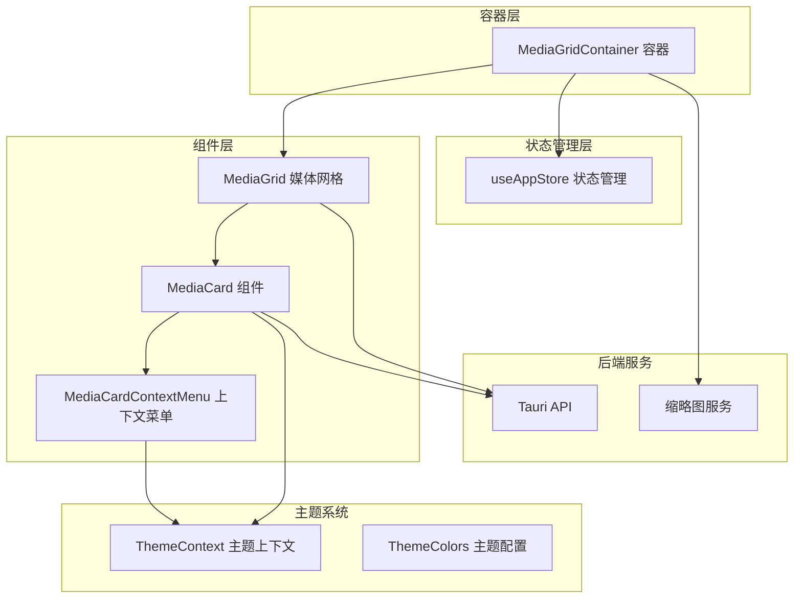
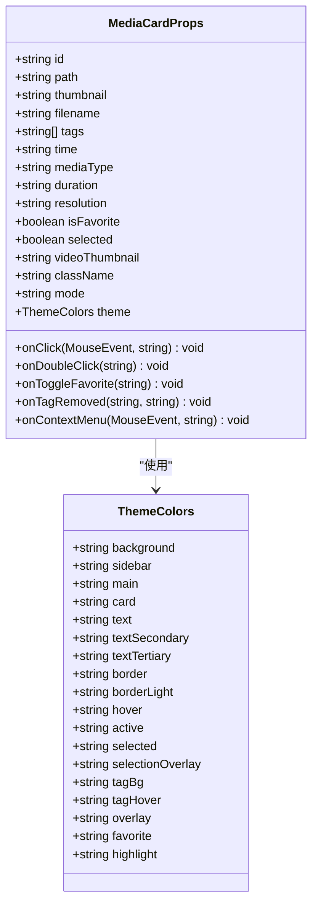
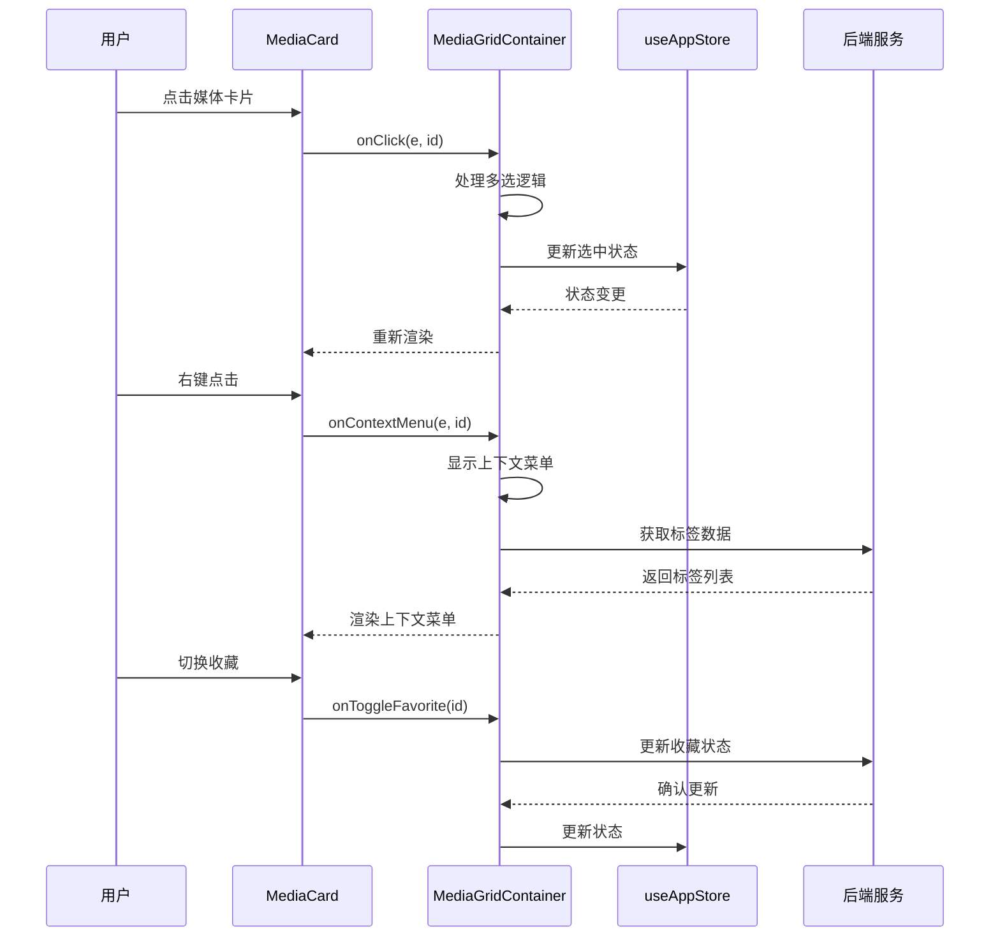
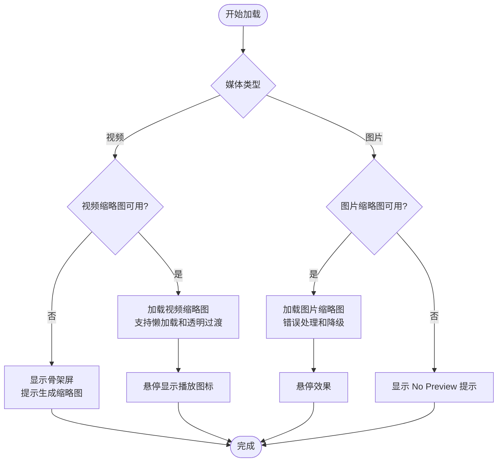
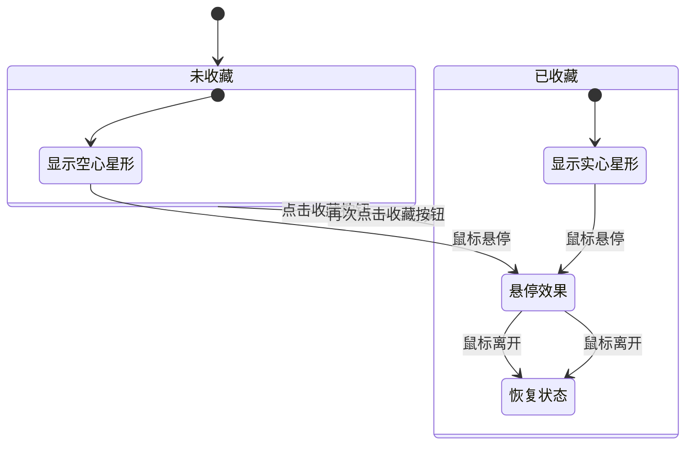
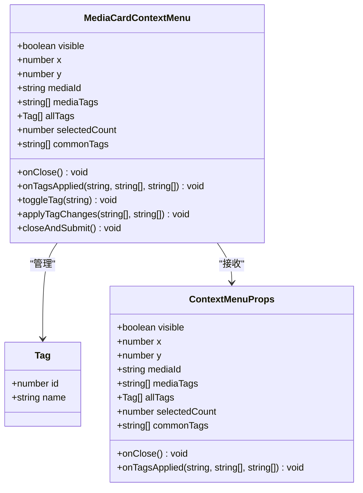
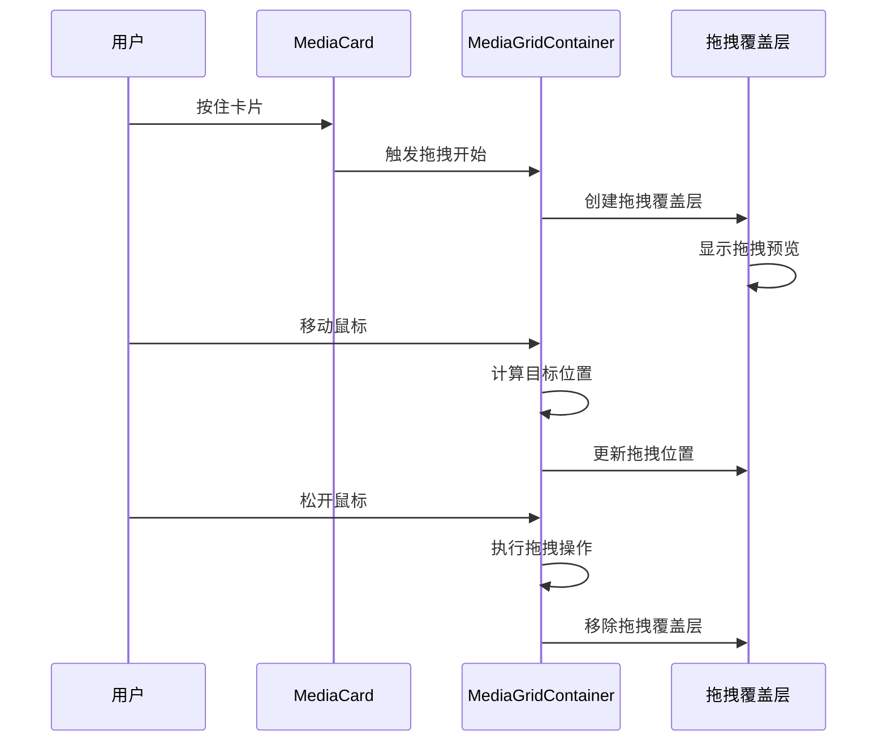
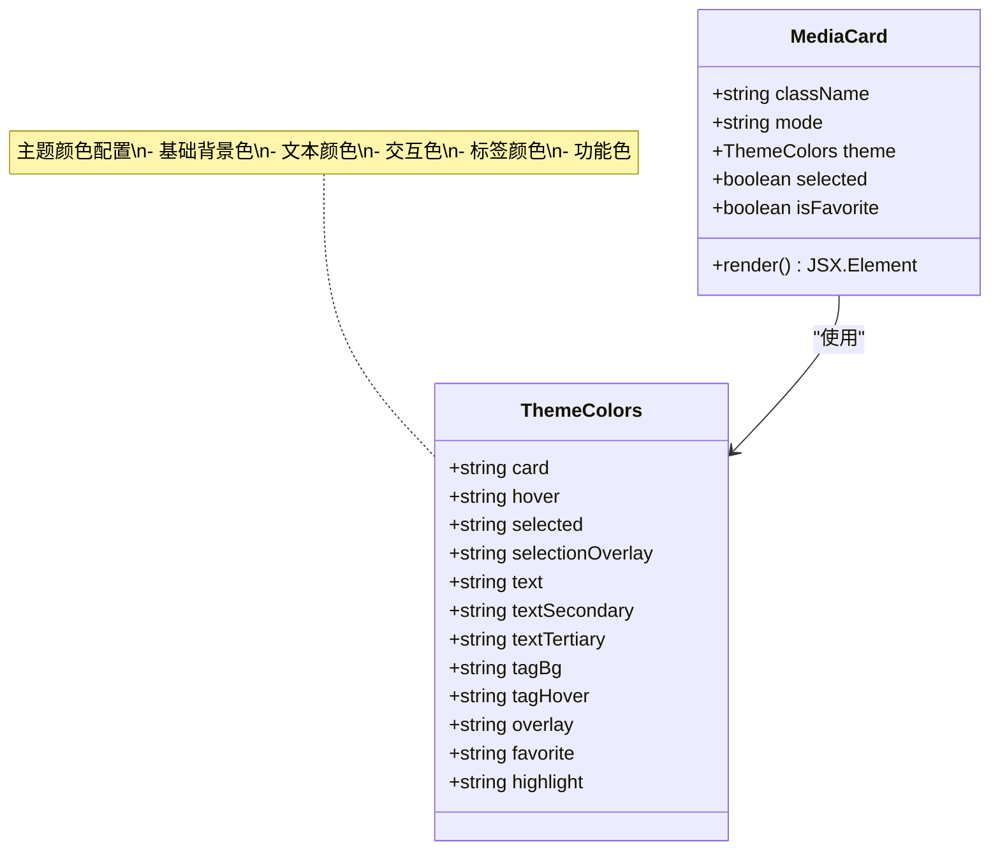

# 媒体卡片组件 (MediaCard)

<cite>
**本文档引用的文件**
- [MediaCard.tsx](file://src/components/MediaCard.tsx)
- [MediaCardContextMenu.tsx](file://src/components/MediaCardContextMenu.tsx)
- [MediaGrid.tsx](file://src/components/MediaGrid.tsx)
- [MediaGridContainer.tsx](file://src/containers/MediaGridContainer.tsx)
- [useAppStore.ts](file://src/store/useAppStore.ts)
- [ThemeContext.tsx](file://src/contexts/ThemeContext.tsx)
- [theme.ts](file://src/theme/theme.ts)
- [index.css](file://src/index.css)
</cite>

## 目录
1. [简介](#简介)
2. [项目结构](#项目结构)
3. [核心组件](#核心组件)
4. [架构概览](#架构概览)
5. [详细组件分析](#详细组件分析)
6. [依赖关系分析](#依赖关系分析)
7. [性能考虑](#性能考虑)
8. [故障排除指南](#故障排除指南)
9. [结论](#结论)

## 简介

MediaCard 是 Medex 应用程序中的核心媒体展示组件，负责显示媒体文件的缩略图、元数据和交互功能。该组件实现了完整的媒体卡片功能，包括缩略图懒加载、收藏状态管理、右键上下文菜单、标签管理和拖拽支持等特性。

组件采用响应式设计，支持网格和列表两种视图模式，并提供了丰富的主题定制选项。通过与状态管理系统深度集成，MediaCard 能够提供流畅的用户体验和高性能的媒体浏览体验。

## 项目结构

MediaCard 组件位于应用程序的组件层，与容器层、状态管理层和主题系统紧密协作：



**图表来源**
- [MediaCard.tsx:1-318](file://src/components/MediaCard.tsx#L1-L318)
- [MediaGridContainer.tsx:1-619](file://src/containers/MediaGridContainer.tsx#L1-L619)
- [useAppStore.ts:1-395](file://src/store/useAppStore.ts#L1-L395)

**章节来源**
- [MediaCard.tsx:1-318](file://src/components/MediaCard.tsx#L1-L318)
- [MediaGridContainer.tsx:1-619](file://src/containers/MediaGridContainer.tsx#L1-L619)

## 核心组件

### MediaCardProps 接口

MediaCard 组件定义了完整的属性接口，支持丰富的媒体展示功能：



**图表来源**
- [MediaCard.tsx:6-27](file://src/components/MediaCard.tsx#L6-L27)
- [theme.ts:8-52](file://src/theme/theme.ts#L8-L52)

### 主要功能特性

1. **缩略图懒加载**: 支持图片和视频缩略图的智能加载
2. **收藏状态管理**: 实时收藏/取消收藏功能
3. **标签系统**: 支持标签的添加、删除和管理
4. **上下文菜单**: 右键菜单提供标签编辑功能
5. **主题定制**: 完整的暗黑/亮色主题支持
6. **多选交互**: 支持 Ctrl/Cmd、Shift 和单击选择

**章节来源**
- [MediaCard.tsx:34-264](file://src/components/MediaCard.tsx#L34-L264)
- [theme.ts:54-98](file://src/theme/theme.ts#L54-L98)

## 架构概览

MediaCard 组件采用分层架构设计，确保组件间的职责分离和可维护性：



**图表来源**
- [MediaCard.tsx:87-94](file://src/components/MediaCard.tsx#L87-L94)
- [MediaGridContainer.tsx:59-91](file://src/containers/MediaGridContainer.tsx#L59-L91)
- [useAppStore.ts:236-246](file://src/store/useAppStore.ts#L236-L246)

## 详细组件分析

### 缩略图加载机制

MediaCard 实现了智能的缩略图加载策略，支持多种媒体类型的预览：



**图表来源**
- [MediaCard.tsx:153-184](file://src/components/MediaCard.tsx#L153-L184)
- [MediaCard.tsx:186-197](file://src/components/MediaCard.tsx#L186-L197)

#### 缩略图加载策略

1. **视频缩略图**: 使用后端生成的首帧缩略图，支持懒加载和透明过渡效果
2. **图片缩略图**: 直接加载原图，包含错误处理机制
3. **占位符**: 当缩略图不可用时显示骨架屏或"No Preview"提示

**章节来源**
- [MediaCard.tsx:55-84](file://src/components/MediaCard.tsx#L55-L84)
- [MediaGridContainer.tsx:417-451](file://src/containers/MediaGridContainer.tsx#L417-L451)

### 收藏状态显示

MediaCard 提供直观的收藏状态指示器，支持实时状态切换：



**图表来源**
- [MediaCard.tsx:138-150](file://src/components/MediaCard.tsx#L138-L150)
- [MediaCard.tsx:127-136](file://src/components/MediaCard.tsx#L127-L136)

#### 收藏状态管理

1. **视觉反馈**: 通过不同样式的星形图标区分收藏状态
2. **交互效果**: 按钮悬停时的背景色变化
3. **状态同步**: 与后端数据库保持实时同步

**章节来源**
- [MediaCard.tsx:125-150](file://src/components/MediaCard.tsx#L125-L150)
- [MediaGridContainer.tsx:185-201](file://src/containers/MediaGridContainer.tsx#L185-L201)

### 右键菜单功能

MediaCardContextMenu 提供强大的标签管理功能，支持单个和批量标签操作：



**图表来源**
- [MediaCardContextMenu.tsx:10-21](file://src/components/MediaCardContextMenu.tsx#L10-L21)
- [MediaCardContextMenu.tsx:5-8](file://src/components/MediaCardContextMenu.tsx#L5-L8)

#### 上下文菜单特性

1. **标签搜索**: 支持实时标签过滤和搜索
2. **批量操作**: 支持多选媒体的批量标签管理
3. **边界检测**: 自动调整菜单位置避免超出屏幕
4. **键盘导航**: 支持 Esc 键关闭菜单

**章节来源**
- [MediaCardContextMenu.tsx:23-254](file://src/components/MediaCardContextMenu.tsx#L23-L254)
- [MediaGridContainer.tsx:111-175](file://src/containers/MediaGridContainer.tsx#L111-L175)

### 拖拽操作支持

虽然 MediaCard 本身不直接实现拖拽功能，但通过与容器层的协作实现了完整的拖拽支持：



**图表来源**
- [MediaGridContainer.tsx:59-91](file://src/containers/MediaGridContainer.tsx#L59-L91)
- [MediaGrid.tsx:214-240](file://src/components/MediaGrid.tsx#L214-L240)

#### 拖拽数据格式

拖拽操作涉及以下数据结构：

1. **拖拽源数据**: 包含媒体 ID、类型和元数据
2. **拖拽目标**: 目标位置和容器信息
3. **拖拽状态**: 当前拖拽进度和视觉反馈

**章节来源**
- [MediaGridContainer.tsx:58-91](file://src/containers/MediaGridContainer.tsx#L58-L91)
- [MediaGrid.tsx:214-240](file://src/components/MediaGrid.tsx#L214-L240)

### 样式定制选项

MediaCard 提供丰富的样式定制选项，支持完整的主题系统：



**图表来源**
- [theme.ts:8-52](file://src/theme/theme.ts#L8-L52)
- [MediaCard.tsx:95-113](file://src/components/MediaCard.tsx#L95-L113)

#### 悬停效果和选中状态

1. **悬停效果**: 非选中状态下显示 hover 背景色
2. **选中状态**: 选中时显示高亮边框和遮罩层
3. **过渡动画**: 所有状态变化都带有平滑的过渡效果

**章节来源**
- [MediaCard.tsx:95-118](file://src/components/MediaCard.tsx#L95-L118)
- [index.css:123-155](file://src/index.css#L123-L155)

## 依赖关系分析

MediaCard 组件的依赖关系体现了清晰的分层架构：

```mermaid
graph TB
subgraph "外部依赖"
React[React]
Tauri[@tauri-apps/api]
Window[react-window]
end
subgraph "内部模块"
MediaCard[MediaCard]
ContextMenu[MediaCardContextMenu]
ThemeContext[ThemeContext]
Theme[ThemeColors]
Store[useAppStore]
end
subgraph "后端服务"
Thumbnail[缩略图服务]
Database[数据库]
end
MediaCard --> React
MediaCard --> Tauri
MediaCard --> ThemeContext
MediaCard --> Store
ContextMenu --> ThemeContext
ContextMenu --> Tauri
MediaCard --> Window
MediaCard --> Thumbnail
MediaCard --> Database
Store --> Database
ThemeContext --> Theme
```

**图表来源**
- [MediaCard.tsx:1-4](file://src/components/MediaCard.tsx#L1-L4)
- [MediaCardContextMenu.tsx:1-3](file://src/components/MediaCardContextMenu.tsx#L1-L3)
- [useAppStore.ts:1](file://src/store/useAppStore.ts#L1)

### 组件耦合度分析

1. **低耦合设计**: MediaCard 与其他组件通过接口通信
2. **单一职责**: 每个组件专注于特定功能领域
3. **可测试性**: 清晰的接口定义便于单元测试

**章节来源**
- [MediaCard.tsx:277-317](file://src/components/MediaCard.tsx#L277-L317)
- [MediaGrid.tsx:13-27](file://src/components/MediaGrid.tsx#L13-L27)

## 性能考虑

### 缩略图懒加载优化

MediaCard 实现了高效的缩略图加载策略：

1. **懒加载**: 仅在需要时加载缩略图
2. **优先级调度**: 可见区域优先，后续区域延后
3. **并发控制**: 限制同时进行的缩略图生成数量
4. **缓存机制**: 避免重复生成相同的缩略图

### 渲染性能优化

1. **React.memo**: 使用记忆化避免不必要的重渲染
2. **虚拟滚动**: 大列表使用 react-window 实现虚拟滚动
3. **状态分离**: 将昂贵的状态计算移到容器层
4. **事件委托**: 减少事件处理器的数量

### 内存管理

1. **任务队列**: 控制缩略图生成任务的数量
2. **去重机制**: 避免重复请求相同的缩略图
3. **清理机制**: 组件卸载时清理定时器和事件监听器

**章节来源**
- [MediaCard.tsx:277-317](file://src/components/MediaCard.tsx#L277-L317)
- [MediaGridContainer.tsx:352-451](file://src/containers/MediaGridContainer.tsx#L352-L451)

## 故障排除指南

### 常见问题及解决方案

#### 缩略图加载失败

**问题**: 视频缩略图无法加载
**原因**: 
- ffmpeg 未安装或不可用
- 文件路径无效
- 缓存损坏

**解决方案**:
1. 检查 ffmpeg 是否正确安装
2. 验证文件路径的有效性
3. 清理缩略图缓存目录

#### 收藏状态不同步

**问题**: 收藏状态在界面和数据库之间不同步
**原因**:
- 网络请求失败
- 状态更新延迟
- 并发更新冲突

**解决方案**:
1. 检查网络连接状态
2. 重试收藏状态更新操作
3. 确保使用最新的状态管理方法

#### 上下文菜单显示异常

**问题**: 右键菜单位置不正确或无法关闭
**原因**:
- 屏幕边界检测失败
- 事件监听器未正确清理
- DOM 元素未正确渲染

**解决方案**:
1. 检查屏幕尺寸和边界条件
2. 确保组件正确卸载
3. 验证 DOM 结构完整性

**章节来源**
- [MediaCard.tsx:80-84](file://src/components/MediaCard.tsx#L80-L84)
- [MediaCardContextMenu.tsx:135-161](file://src/components/MediaCardContextMenu.tsx#L135-L161)

## 结论

MediaCard 组件是一个功能完整、性能优化的媒体展示组件。它通过以下关键特性提供了优秀的用户体验：

1. **完整的功能集**: 支持缩略图加载、收藏管理、标签系统、上下文菜单等核心功能
2. **优秀的性能**: 通过懒加载、虚拟滚动和记忆化等技术确保流畅的用户体验
3. **灵活的定制**: 完整的主题系统和样式定制选项
4. **可靠的架构**: 清晰的分层设计和良好的依赖管理

该组件为 Medex 应用程序提供了坚实的媒体展示基础，能够满足各种媒体浏览场景的需求。通过持续的优化和改进，MediaCard 将继续为用户提供优质的媒体管理体验。