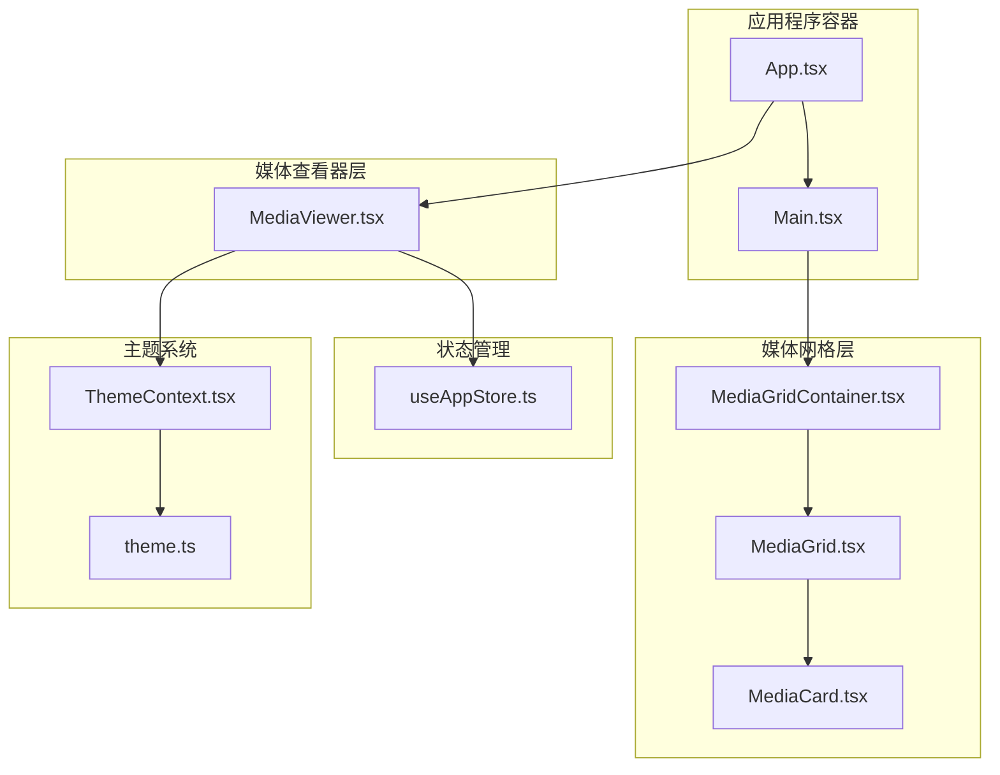
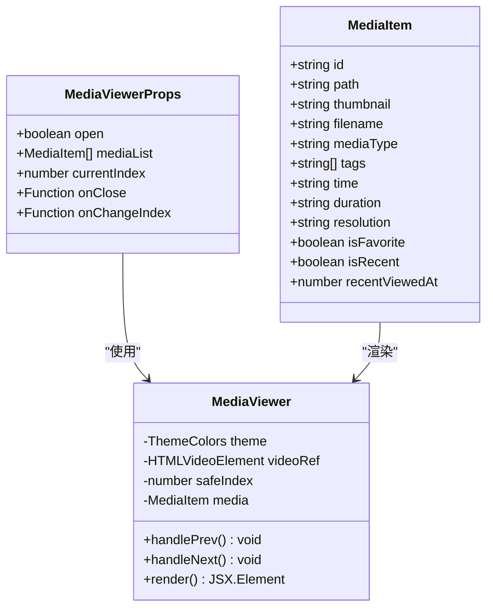
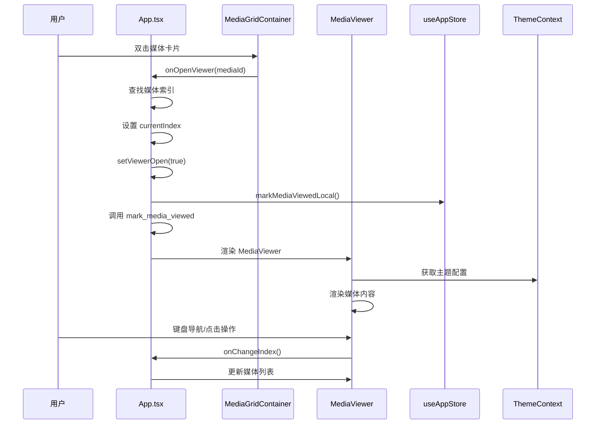
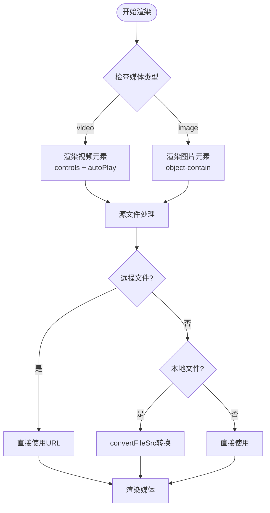
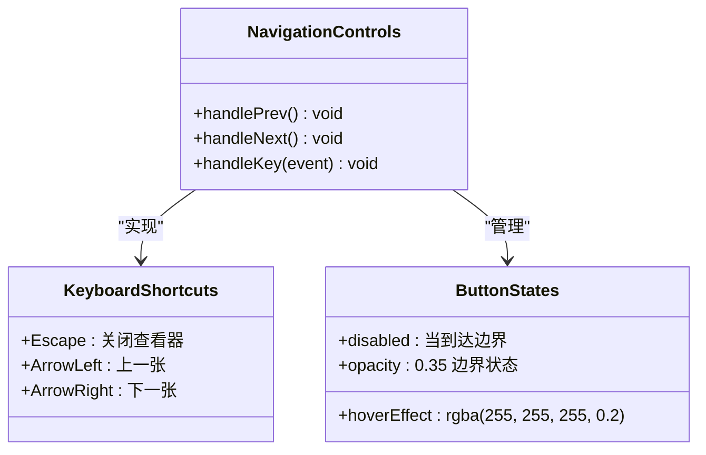
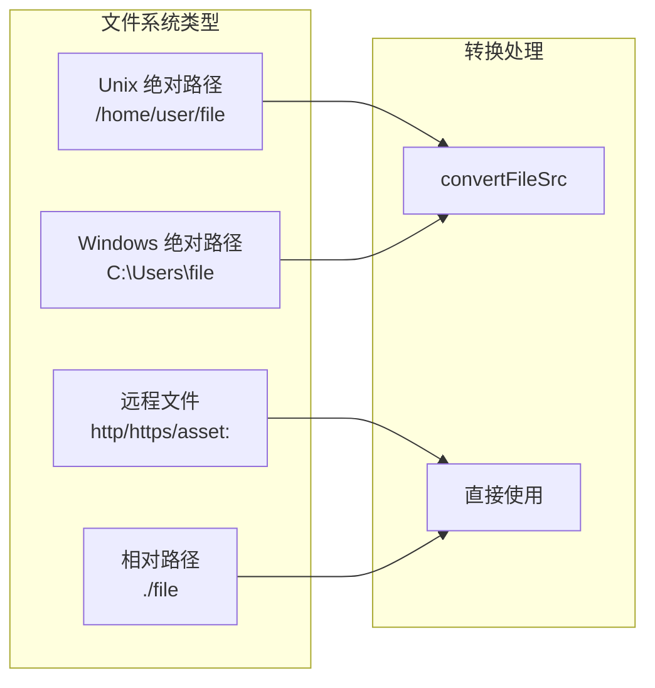
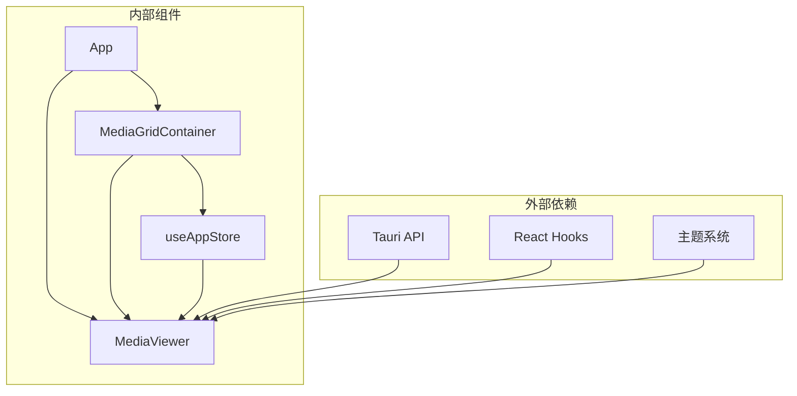
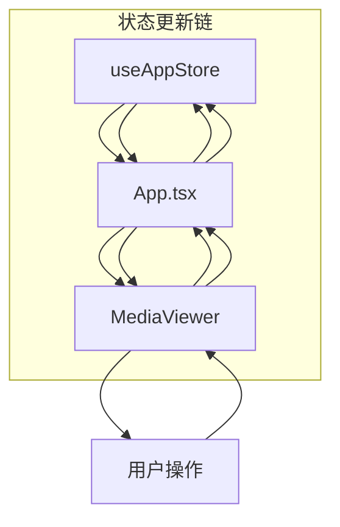

# 媒体查看器组件 (MediaViewer)

<cite>
**本文档引用的文件**
- [MediaViewer.tsx](file://src/components/MediaViewer.tsx)
- [MediaGridContainer.tsx](file://src/containers/MediaGridContainer.tsx)
- [App.tsx](file://src/App.tsx)
- [useAppStore.ts](file://src/store/useAppStore.ts)
- [ThemeContext.tsx](file://src/contexts/ThemeContext.tsx)
- [theme.ts](file://src/theme/theme.ts)
- [MediaCard.tsx](file://src/components/MediaCard.tsx)
- [MediaGrid.tsx](file://src/components/MediaGrid.tsx)
</cite>

## 目录
1. [简介](#简介)
2. [项目结构](#项目结构)
3. [核心组件](#核心组件)
4. [架构概览](#架构概览)
5. [详细组件分析](#详细组件分析)
6. [依赖关系分析](#依赖关系分析)
7. [性能考量](#性能考量)
8. [故障排除指南](#故障排除指南)
9. [结论](#结论)
10. [附录](#附录)

## 简介

MediaViewer 是 Medex 应用程序中的媒体查看器组件，负责提供图片和视频的全屏预览功能。该组件实现了完整的媒体浏览体验，包括键盘导航、主题适配、文件系统集成和缓存机制。

MediaViewer 作为应用程序的核心交互组件之一，为用户提供了一个直观、高效的媒体浏览界面，支持多种媒体格式的预览和控制。

## 项目结构

MediaViewer 组件位于应用程序的组件层次结构中，与其它媒体管理组件协同工作：

**图表来源**
- [App.tsx:1-73](file://src/App.tsx#L1-L73)
- [MediaViewer.tsx:1-186](file://src/components/MediaViewer.tsx#L1-L186)
- [MediaGridContainer.tsx:1-619](file://src/containers/MediaGridContainer.tsx#L1-L619)

**章节来源**
- [App.tsx:1-73](file://src/App.tsx#L1-L73)
- [MediaViewer.tsx:1-186](file://src/components/MediaViewer.tsx#L1-L186)

## 核心组件

### MediaViewer 组件接口定义

MediaViewer 组件采用简洁而强大的接口设计，支持完整的媒体查看功能：

**图表来源**
- [MediaViewer.tsx:6-12](file://src/components/MediaViewer.tsx#L6-L12)
- [useAppStore.ts:16-29](file://src/store/useAppStore.ts#L16-L29)

### 主题系统集成

MediaViewer 深度集成了应用程序的主题系统，提供统一的视觉体验：

| 主题属性 | 用途 | 示例值 |
|---------|------|--------|
| `overlay` | 背景遮罩层 | `rgba(0, 0, 0, 0.40)` |
| `hover` | 悬停状态 | `rgba(255, 255, 255, 0.10)` |
| `textSecondary` | 次要文本 | `rgba(255, 255, 255, 0.85)` |
| `selectionOverlay` | 选中遮罩 | `rgba(59, 130, 246, 0.20)` |

**章节来源**
- [MediaViewer.tsx:21](file://src/components/MediaViewer.tsx#L21)
- [ThemeContext.tsx:1-99](file://src/contexts/ThemeContext.tsx#L1-L99)
- [theme.ts:8-52](file://src/theme/theme.ts#L8-L52)

## 架构概览

MediaViewer 的整体架构体现了清晰的关注点分离和模块化设计：

**图表来源**
- [App.tsx:28-42](file://src/App.tsx#L28-L42)
- [MediaGridContainer.tsx:592-593](file://src/containers/MediaGridContainer.tsx#L592-L593)
- [MediaViewer.tsx:14-20](file://src/components/MediaViewer.tsx#L14-L20)

## 详细组件分析

### 媒体类型检测与处理

MediaViewer 实现了智能的媒体类型检测机制，能够正确处理不同类型的媒体文件：

**图表来源**
- [MediaViewer.tsx:153-170](file://src/components/MediaViewer.tsx#L153-L170)
- [MediaViewer.tsx:176-185](file://src/components/MediaViewer.tsx#L176-L185)

### 媒体加载机制

组件采用了渐进式的加载策略，优化用户体验和性能表现：

| 加载阶段 | 实现方式 | 性能影响 |
|----------|----------|----------|
| 预览加载 | `loading="lazy"` | 减少初始渲染时间 |
| 缓存机制 | `key={media.id}` 强制重新渲染 | 确保媒体切换正确性 |
| 错误处理 | 条件渲染和降级方案 | 提升稳定性 |
| 主题适配 | 动态样式计算 | 保持视觉一致性 |

**章节来源**
- [MediaViewer.tsx:162-170](file://src/components/MediaViewer.tsx#L162-L170)

### 导航与交互控制

MediaViewer 提供了丰富的导航和交互功能：

**图表来源**
- [MediaViewer.tsx:31-55](file://src/components/MediaViewer.tsx#L31-L55)
- [MediaViewer.tsx:95-143](file://src/components/MediaViewer.tsx#L95-L143)

### 主题定制与样式系统

组件完全集成到应用程序的主题系统中，支持深色/浅色主题切换：

| 主题类别 | 配置项 | 动态效果 |
|----------|--------|----------|
| 背景遮罩 | `theme.overlay` | 全屏覆盖 |
| 悬停效果 | `theme.hover` | 按钮高亮 |
| 文本颜色 | `theme.textSecondary` | 次要信息 |
| 选中状态 | `theme.selectionOverlay` | 选中反馈 |

**章节来源**
- [MediaViewer.tsx:72-89](file://src/components/MediaViewer.tsx#L72-L89)
- [theme.ts:54-98](file://src/theme/theme.ts#L54-L98)

### 文件系统集成

MediaViewer 与 Tauri 文件系统无缝集成，支持本地和远程文件访问：

**图表来源**
- [MediaViewer.tsx:176-185](file://src/components/MediaViewer.tsx#L176-L185)

**章节来源**
- [MediaViewer.tsx:69](file://src/components/MediaViewer.tsx#L69)
- [MediaGridContainer.tsx:365-387](file://src/containers/MediaGridContainer.tsx#L365-L387)

## 依赖关系分析

### 组件间依赖关系

**图表来源**
- [MediaViewer.tsx:1-4](file://src/components/MediaViewer.tsx#L1-L4)
- [MediaGridContainer.tsx:1-11](file://src/containers/MediaGridContainer.tsx#L1-L11)

### 数据流分析

组件的数据流体现了单向数据绑定的设计原则：

**图表来源**
- [useAppStore.ts:145-394](file://src/store/useAppStore.ts#L145-L394)
- [App.tsx:16-26](file://src/App.tsx#L16-L26)

**章节来源**
- [MediaViewer.tsx:14-20](file://src/components/MediaViewer.tsx#L14-L20)
- [useAppStore.ts:145-394](file://src/store/useAppStore.ts#L145-L394)

## 性能考量

### 内存管理

MediaViewer 在组件卸载时自动清理视频资源，防止内存泄漏：

- **视频资源清理**: 组件卸载时自动调用 `pause()` 方法
- **索引安全检查**: 使用 `Math.min/Math.max` 确保数组访问安全
- **条件渲染**: 通过 `open && media` 条件避免不必要的渲染

### 渲染优化

组件采用了多项渲染优化技术：

| 优化技术 | 实现方式 | 效果 |
|----------|----------|------|
| 条件渲染 | `!open || !media` | 避免空状态渲染 |
| 键盘事件 | 仅在打开时监听 | 减少事件处理开销 |
| 引用缓存 | `useMemo` 计算安全索引 | 防止重复计算 |
| 强制重渲染 | `key={media.id}` | 确保媒体切换正确 |

### 缓存机制

虽然 MediaViewer 本身不实现复杂的缓存逻辑，但与上层组件形成了完整的缓存体系：

- **缩略图缓存**: MediaGridContainer 实现了智能的缩略图请求队列
- **媒体列表缓存**: App 组件维护了视图专用的媒体列表
- **主题缓存**: ThemeContext 提供了主题状态的持久化

**章节来源**
- [MediaViewer.tsx:57-63](file://src/components/MediaViewer.tsx#L57-L63)
- [MediaGridContainer.tsx:352-451](file://src/containers/MediaGridContainer.tsx#L352-L451)

## 故障排除指南

### 常见问题诊断

| 问题症状 | 可能原因 | 解决方案 |
|----------|----------|----------|
| 媒体无法加载 | 文件路径错误 | 检查 `toViewerSrc` 转换逻辑 |
| 视频无法播放 | 源文件格式不支持 | 确认浏览器支持的视频格式 |
| 键盘导航失效 | 事件监听未正确绑定 | 检查 `open` 状态和事件监听器 |
| 主题显示异常 | 主题上下文未正确提供 | 确认 ThemeProvider 包装 |

### 调试技巧

1. **开发者工具**: 使用浏览器开发者工具检查网络请求和媒体加载状态
2. **日志输出**: 在关键函数中添加 `console.log` 输出调试信息
3. **状态检查**: 通过 React DevTools 检查组件状态变化
4. **事件监听**: 确认键盘事件监听器的生命周期管理

### 性能监控

- **渲染计数**: 监控组件重新渲染次数
- **内存使用**: 使用浏览器内存面板检查内存泄漏
- **网络请求**: 分析媒体文件的加载时间和成功率

**章节来源**
- [MediaViewer.tsx:39-55](file://src/components/MediaViewer.tsx#L39-L55)
- [MediaGridContainer.tsx:453-486](file://src/containers/MediaGridContainer.tsx#L453-L486)

## 结论

MediaViewer 组件展现了现代前端开发的最佳实践，通过精心设计的架构和实现细节，提供了优秀的用户体验。组件的主要优势包括：

- **完整的媒体支持**: 同时支持图片和视频格式
- **流畅的交互体验**: 键盘导航、主题适配、响应式设计
- **健壮的错误处理**: 完善的边界条件检查和降级方案
- **高性能实现**: 智能的渲染优化和资源管理

该组件为 Medex 应用程序提供了可靠的媒体查看基础，为后续的功能扩展奠定了坚实的技术基础。

## 附录

### 使用场景

MediaViewer 适用于以下使用场景：

1. **媒体库浏览**: 在大型媒体库中快速预览媒体文件
2. **批量处理**: 结合标签系统进行媒体分类和管理
3. **演示展示**: 为用户提供高质量的媒体展示体验
4. **内容审核**: 支持视频和图片内容的详细审查

### 最佳实践

- **性能优化**: 合理使用懒加载和条件渲染
- **错误处理**: 实现完善的错误边界和降级策略
- **可访问性**: 确保键盘导航和屏幕阅读器支持
- **主题一致性**: 严格遵循应用程序的设计系统

### 扩展建议

未来可以考虑的功能增强：

1. **手势支持**: 添加触摸设备的手势控制
2. **播放控制**: 实现更精细的视频播放控制
3. **缩放功能**: 添加图片缩放和旋转功能
4. **全屏模式**: 实现完整的全屏显示模式