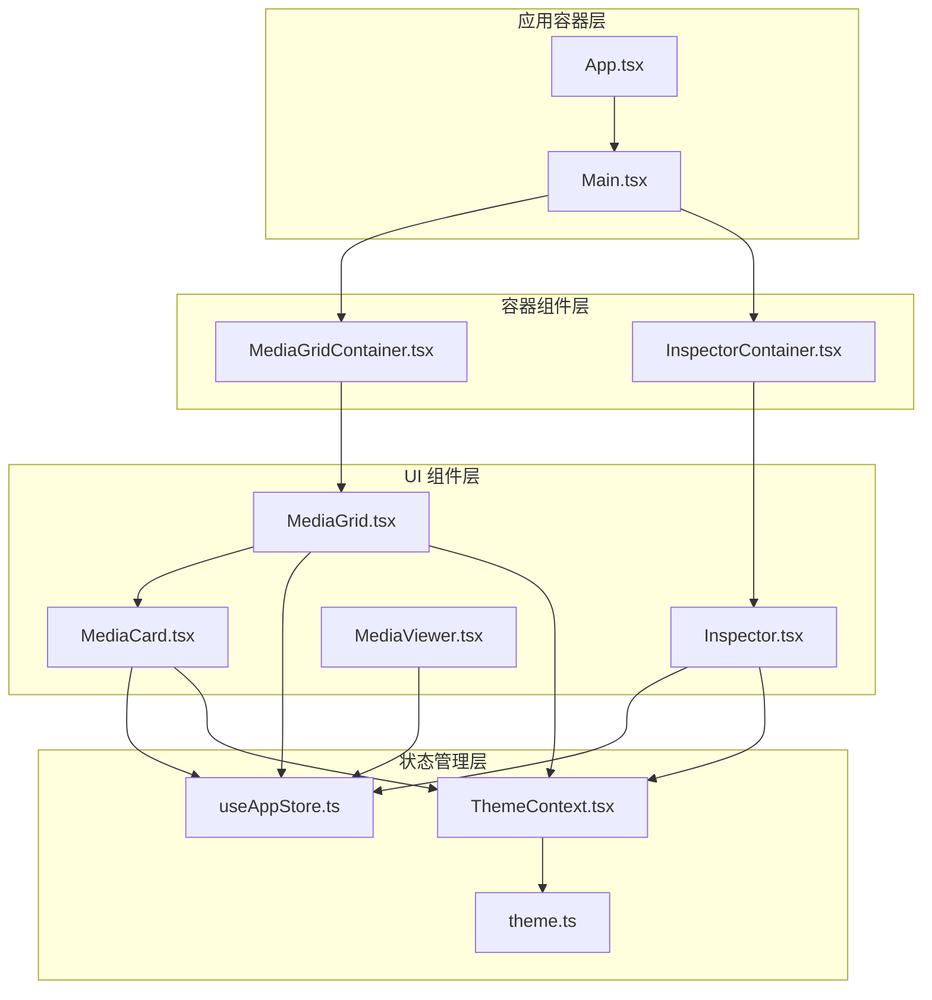
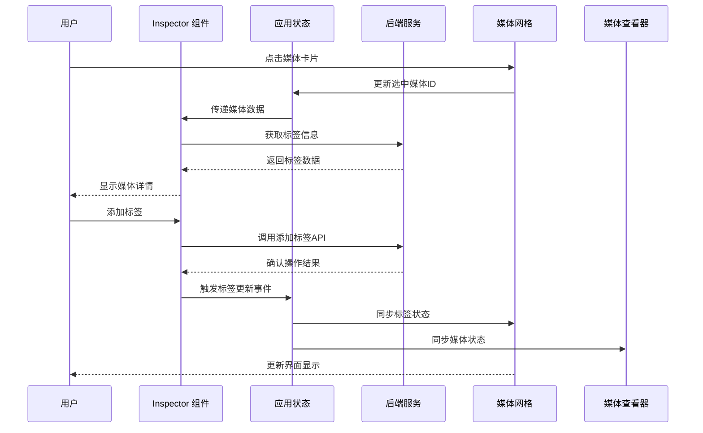
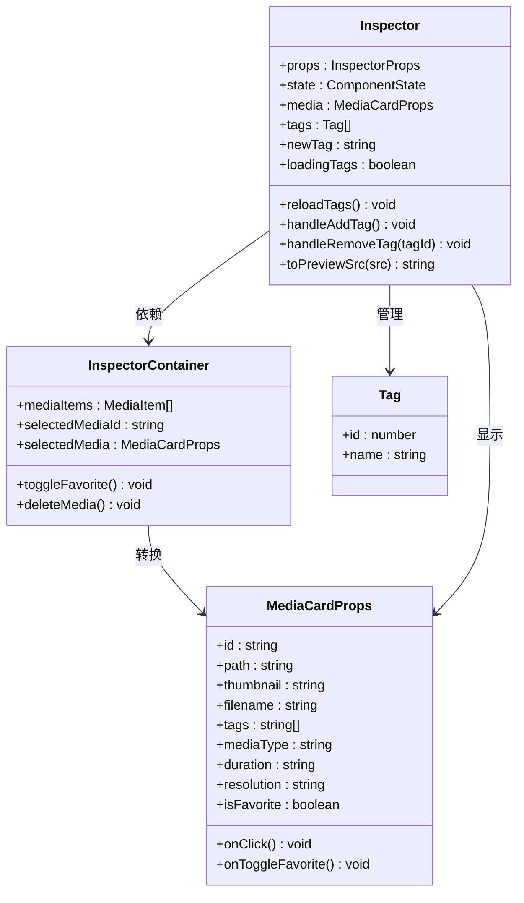
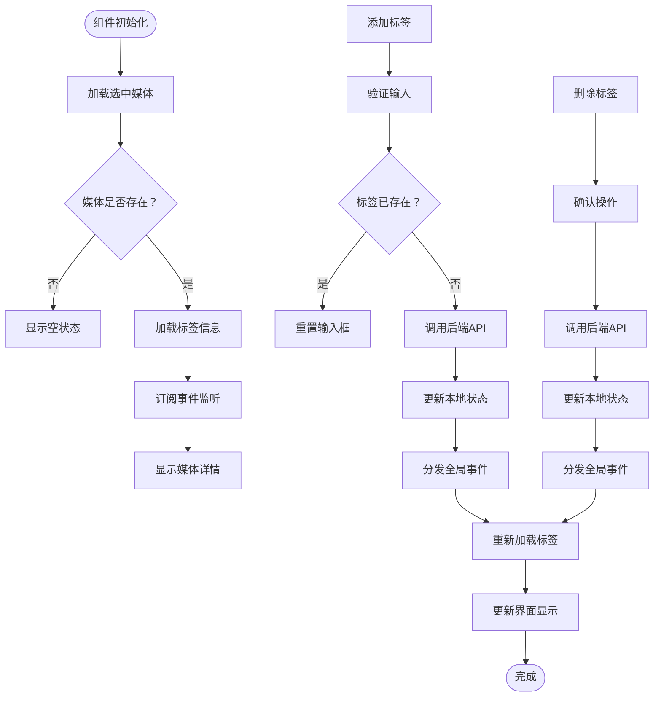
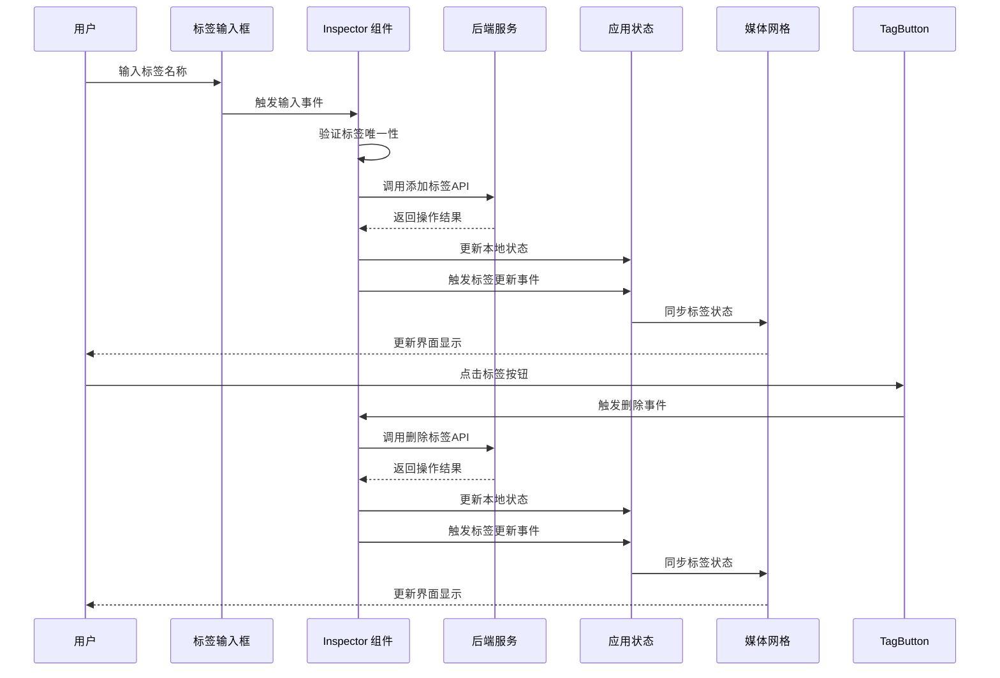
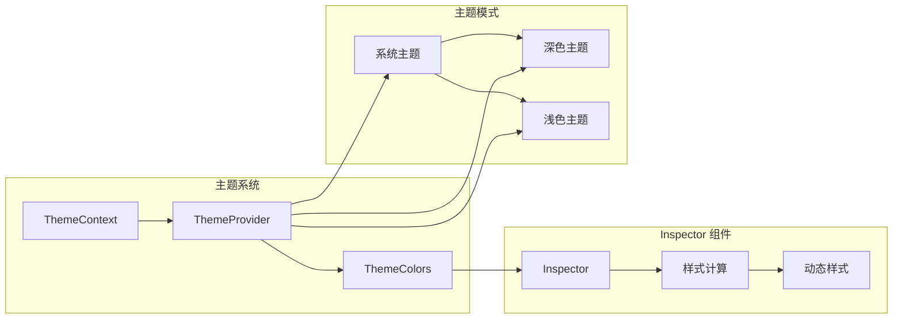
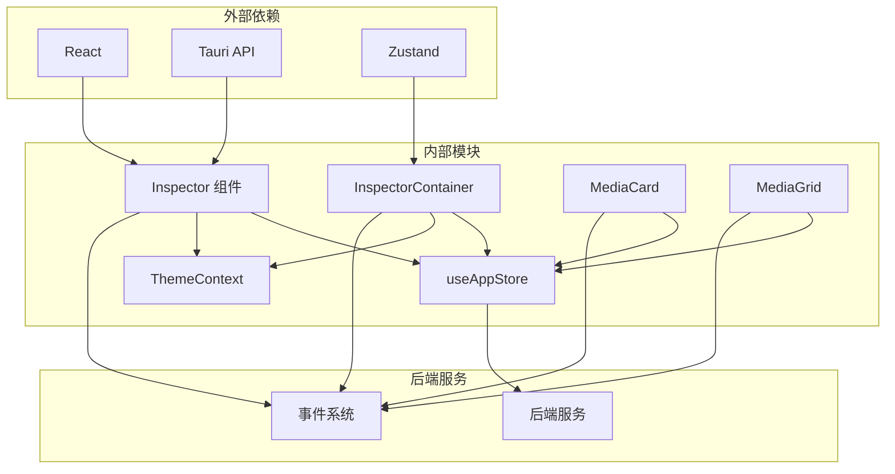

# 检查器组件 (Inspector)

<cite>
**本文档引用的文件**
- [Inspector.tsx](file://src/components/Inspector.tsx)
- [InspectorContainer.tsx](file://src/containers/InspectorContainer.tsx)
- [MediaGrid.tsx](file://src/components/MediaGrid.tsx)
- [MediaCard.tsx](file://src/components/MediaCard.tsx)
- [MediaViewer.tsx](file://src/components/MediaViewer.tsx)
- [useAppStore.ts](file://src/store/useAppStore.ts)
- [ThemeContext.tsx](file://src/contexts/ThemeContext.tsx)
- [theme.ts](file://src/theme/theme.ts)
- [MediaGridContainer.tsx](file://src/containers/MediaGridContainer.tsx)
- [App.tsx](file://src/App.tsx)
</cite>

## 目录
1. [简介](#简介)
2. [项目结构](#项目结构)
3. [核心组件](#核心组件)
4. [架构概览](#架构概览)
5. [详细组件分析](#详细组件分析)
6. [依赖关系分析](#依赖关系分析)
7. [性能考虑](#性能考虑)
8. [故障排除指南](#故障排除指南)
9. [结论](#结论)
10. [附录](#附录)

## 简介

Inspector 检查器组件是 Medex 媒体管理应用中的关键界面元素，负责显示和管理媒体文件的详细信息。该组件提供了媒体预览、标签管理、收藏状态切换和删除操作等功能，是用户与媒体数据进行深度交互的主要入口。

检查器组件采用现代化的 React 架构设计，结合 Tauri 后端服务，实现了高性能的媒体数据处理和实时更新机制。组件支持深色和浅色主题模式，具备完整的键盘导航和无障碍访问支持。

## 项目结构

Medex 应用采用模块化的组件架构，Inspector 组件位于组件层次结构的中央位置，与媒体网格、媒体查看器等核心组件紧密协作。

**图表来源**
- [App.tsx:1-73](file://src/App.tsx#L1-L73)
- [Main.tsx:1-25](file://src/components/Main.tsx#L1-L25)
- [InspectorContainer.tsx:1-32](file://src/containers/InspectorContainer.tsx#L1-L32)
- [MediaGridContainer.tsx:1-619](file://src/containers/MediaGridContainer.tsx#L1-L619)

**章节来源**
- [App.tsx:1-73](file://src/App.tsx#L1-L73)
- [Main.tsx:1-25](file://src/components/Main.tsx#L1-L25)

## 核心组件

Inspector 组件是媒体详情检查器的核心实现，具有以下主要功能特性：

### 数据绑定机制
- **单向数据流**：通过 props 接收媒体数据，确保数据流向清晰可控
- **状态同步**：监听全局事件实现与其他组件的数据同步
- **本地状态管理**：管理标签输入、加载状态等临时数据

### 用户交互设计
- **标签管理**：支持标签的添加、删除和搜索功能
- **媒体预览**：提供缩略图和视频预览功能
- **操作按钮**：收藏切换、删除等核心操作
- **键盘导航**：完整的键盘快捷键支持

### 样式定制选项
- **主题适配**：完全支持深色和浅色主题模式
- **动态样式**：根据主题变量动态计算样式属性
- **响应式设计**：适配不同屏幕尺寸和设备

**章节来源**
- [Inspector.tsx:13-265](file://src/components/Inspector.tsx#L13-L265)
- [InspectorContainer.tsx:6-31](file://src/containers/InspectorContainer.tsx#L6-L31)

## 架构概览

Inspector 组件在整个应用架构中扮演着数据展示和用户交互的关键角色，与多个组件形成紧密的协作关系。

**图表来源**
- [Inspector.tsx:27-88](file://src/components/Inspector.tsx#L27-L88)
- [useAppStore.ts:145-394](file://src/store/useAppStore.ts#L145-L394)
- [MediaGridContainer.tsx:488-494](file://src/containers/MediaGridContainer.tsx#L488-L494)

## 详细组件分析

### Inspector 组件架构

Inspector 组件采用函数式组件设计，结合 React Hooks 实现复杂的状态管理和副作用处理。

**图表来源**
- [Inspector.tsx:13-265](file://src/components/Inspector.tsx#L13-L265)
- [InspectorContainer.tsx:6-31](file://src/containers/InspectorContainer.tsx#L6-L31)
- [MediaCard.tsx:6-27](file://src/components/MediaCard.tsx#L6-L27)

### 数据流处理机制

Inspector 组件实现了完整的数据流处理机制，确保媒体信息的实时更新和一致性。

**图表来源**
- [Inspector.tsx:27-88](file://src/components/Inspector.tsx#L27-L88)
- [Inspector.tsx:43-53](file://src/components/Inspector.tsx#L43-L53)

### 标签管理系统

Inspector 组件提供了完整的标签管理功能，支持标签的添加、删除和搜索操作。

**图表来源**
- [Inspector.tsx:67-88](file://src/components/Inspector.tsx#L67-L88)
- [Inspector.tsx:55-65](file://src/components/Inspector.tsx#L55-L65)

**章节来源**
- [Inspector.tsx:19-265](file://src/components/Inspector.tsx#L19-L265)

### 主题适配机制

Inspector 组件完全支持动态主题切换，能够根据用户偏好自动调整界面外观。

**图表来源**
- [ThemeContext.tsx:17-99](file://src/contexts/ThemeContext.tsx#L17-L99)
- [theme.ts:8-159](file://src/theme/theme.ts#L8-L159)

**章节来源**
- [ThemeContext.tsx:17-99](file://src/contexts/ThemeContext.tsx#L17-L99)
- [theme.ts:54-159](file://src/theme/theme.ts#L54-L159)

## 依赖关系分析

Inspector 组件与应用中的多个模块存在紧密的依赖关系，形成了复杂的依赖网络。

**图表来源**
- [Inspector.tsx:1-7](file://src/components/Inspector.tsx#L1-L7)
- [InspectorContainer.tsx:2-4](file://src/containers/InspectorContainer.tsx#L2-L4)
- [useAppStore.ts:1-2](file://src/store/useAppStore.ts#L1-L2)

### 组件耦合度分析

Inspector 组件的设计遵循低耦合高内聚的原则，通过接口抽象和事件驱动的方式降低组件间的依赖关系。

**章节来源**
- [Inspector.tsx:13-265](file://src/components/Inspector.tsx#L13-L265)
- [InspectorContainer.tsx:6-31](file://src/containers/InspectorContainer.tsx#L6-L31)

## 性能考虑

Inspector 组件在设计时充分考虑了性能优化，采用了多种策略确保良好的用户体验。

### 渲染优化
- **条件渲染**：根据媒体状态动态渲染不同的内容区域
- **懒加载**：标签信息按需加载，避免不必要的请求
- **事件节流**：对频繁触发的事件进行防抖处理

### 内存管理
- **清理机制**：正确清理事件监听器和定时器
- **状态复用**：利用 React.memo 和 useMemo 优化重渲染
- **资源释放**：及时释放视频播放器等资源

### 网络优化
- **缓存策略**：合理利用浏览器缓存减少重复请求
- **并发控制**：限制同时进行的网络请求数量
- **错误恢复**：实现优雅的错误处理和重试机制

## 故障排除指南

### 常见问题及解决方案

**标签操作失败**
- 检查网络连接状态
- 验证后端服务是否正常运行
- 查看浏览器控制台错误信息

**媒体预览无法加载**
- 确认媒体文件路径有效
- 检查文件权限设置
- 验证文件格式支持情况

**主题切换异常**
- 刷新页面重新加载主题
- 检查系统主题设置
- 清除浏览器缓存

**章节来源**
- [Inspector.tsx:55-88](file://src/components/Inspector.tsx#L55-L88)
- [Inspector.tsx:36-40](file://src/components/Inspector.tsx#L36-L40)

## 结论

Inspector 检查器组件作为 Medex 应用的核心界面元素，展现了现代前端开发的最佳实践。组件通过精心设计的架构、完善的错误处理机制和优秀的性能优化，在提供丰富功能的同时保持了良好的可维护性和扩展性。

组件的主要优势包括：
- **模块化设计**：清晰的职责分离和接口定义
- **响应式交互**：流畅的用户操作反馈和状态更新
- **主题适配**：完整的深色和浅色主题支持
- **性能优化**：高效的渲染策略和资源管理

未来可以考虑的改进方向：
- 增加更多的键盘快捷键支持
- 优化移动端的触摸交互体验
- 扩展标签管理的高级功能
- 加强离线状态下的数据同步能力

## 附录

### 使用场景和交互模式

**场景一：媒体详情查看**
用户通过点击媒体网格中的项目来查看详细的媒体信息，包括标签、元数据和操作按钮。

**场景二：标签管理**
用户可以在检查器中添加或删除标签，实现对媒体内容的分类和组织。

**场景三：收藏管理**
用户可以通过检查器快速切换媒体的收藏状态，便于后续查找和管理。

**场景四：批量操作**
结合媒体网格的选择功能，用户可以在检查器中执行批量标签操作。

### 样式定制指南

**主题变量映射**
- `sidebar`: 检查器背景色
- `borderLight`: 边框颜色
- `text`: 主要文本颜色
- `tagBg`: 标签背景色
- `tagHover`: 标签悬停效果
- `buttonBg`: 按钮背景色
- `buttonHover`: 按钮悬停效果
- `inputBg`: 输入框背景色
- `inputBorder`: 输入框边框色

**章节来源**
- [Inspector.tsx:90-264](file://src/components/Inspector.tsx#L90-L264)
- [theme.ts:8-52](file://src/theme/theme.ts#L8-L52)