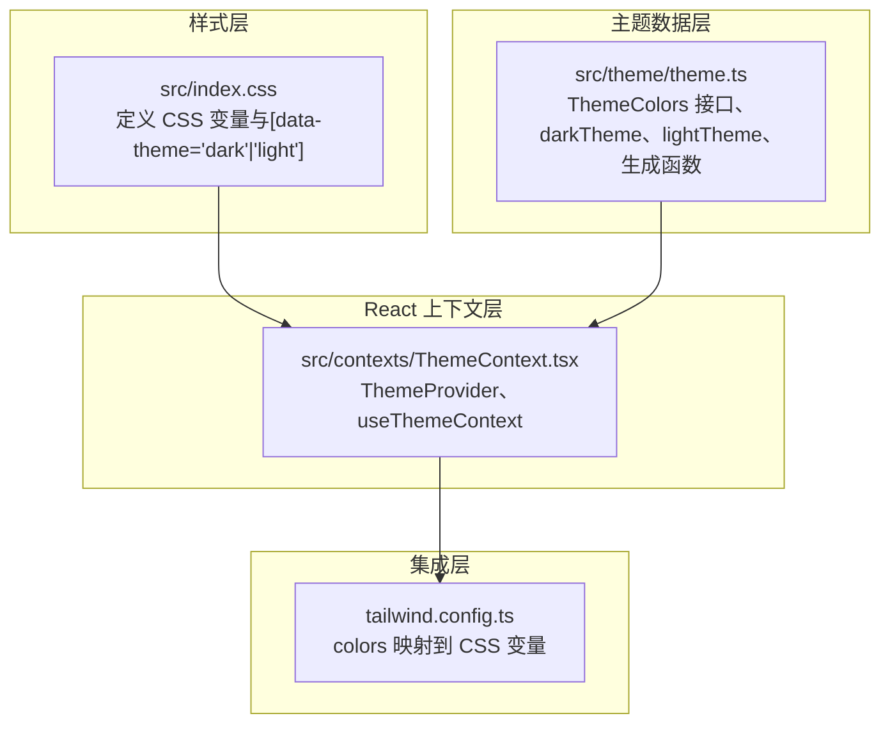
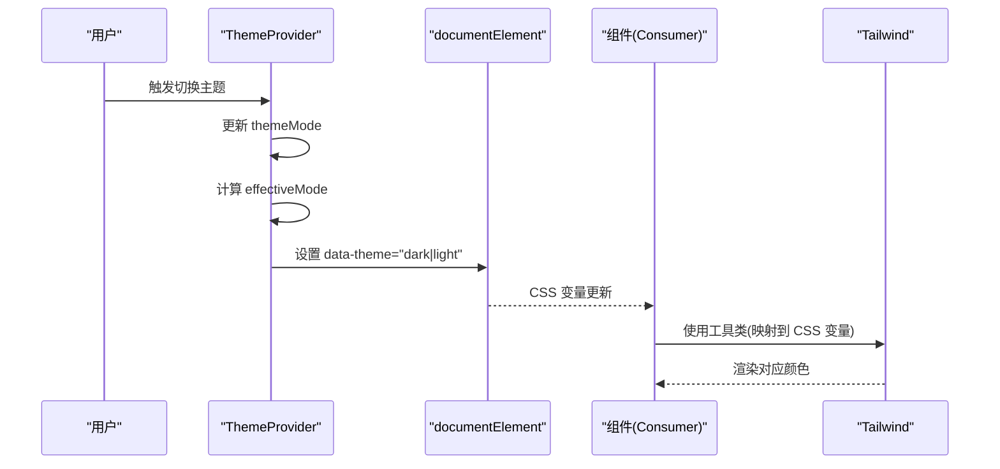
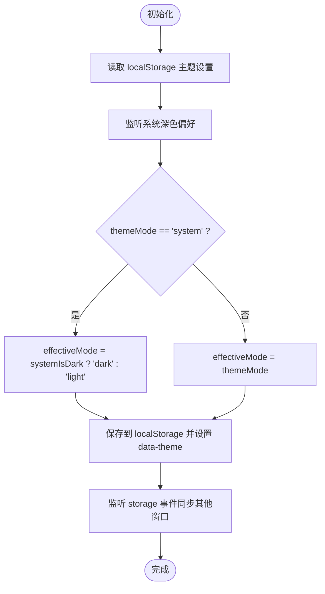
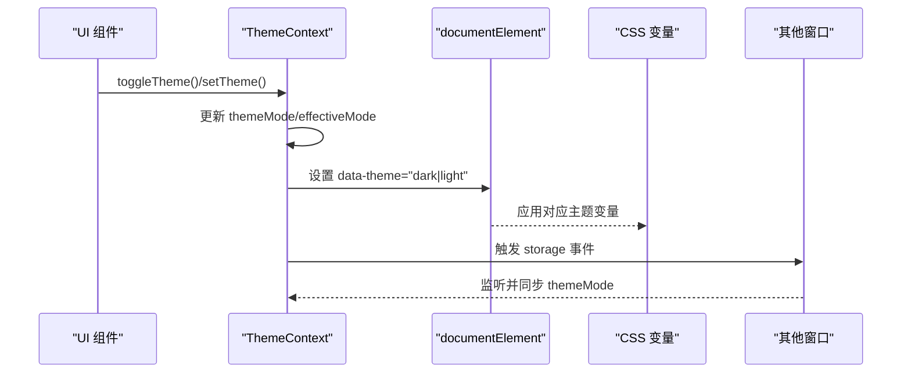
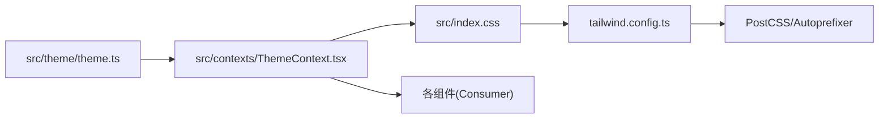

# 主题系统

<cite>
**本文引用的文件**
- [src/contexts/ThemeContext.tsx](file://src/contexts/ThemeContext.tsx)
- [src/theme/theme.ts](file://src/theme/theme.ts)
- [src/index.css](file://src/index.css)
- [tailwind.config.ts](file://tailwind.config.ts)
- [THEME_GUIDE.md](file://THEME_GUIDE.md)
- [src/components/Sidebar.tsx](file://src/components/Sidebar.tsx)
- [src/containers/SidebarContainer.tsx](file://src/containers/SidebarContainer.tsx)
- [src/components/TagItem.tsx](file://src/components/TagItem.tsx)
- [src/containers/ToolbarContainer.tsx](file://src/containers/ToolbarContainer.tsx)
- [src/App.tsx](file://src/App.tsx)
- [src/main.tsx](file://src/main.tsx)
- [package.json](file://package.json)
- [vite.config.ts](file://vite.config.ts)
- [postcss.config.js](file://postcss.config.js)
</cite>

## 目录
1. [简介](#简介)
2. [项目结构](#项目结构)
3. [核心组件](#核心组件)
4. [架构总览](#架构总览)
5. [详细组件分析](#详细组件分析)
6. [依赖关系分析](#依赖关系分析)
7. [性能考量](#性能考量)
8. [故障排查指南](#故障排查指南)
9. [结论](#结论)
10. [附录](#附录)

## 简介
本文件系统性阐述 Medex 主题系统的设计与实现，涵盖 CSS 变量体系、深色/浅色主题定义与切换机制、ThemeContext 提供者与消费者模式、TailwindCSS 与自定义主题的集成方式、响应式设计与屏幕适配策略，以及主题定制与扩展指南。文档面向开发者与产品设计师，既提供高层概览也包含可操作的实践步骤与参考路径。

## 项目结构
主题系统由三层协同构成：
- CSS 变量层：在全局样式中定义主题变量，并通过 data-theme 属性在根元素上切换。
- 主题数据层：在 TypeScript 中定义主题接口与深/浅两套主题配置，并提供生成浅色主题的函数。
- React 上下文层：通过 ThemeProvider 提供主题上下文，暴露主题模式、颜色对象与切换函数；组件通过 useThemeContext 获取主题并应用到样式。

图表来源
- [src/index.css:1-156](file://src/index.css#L1-L156)
- [src/theme/theme.ts:1-159](file://src/theme/theme.ts#L1-L159)
- [src/contexts/ThemeContext.tsx:1-99](file://src/contexts/ThemeContext.tsx#L1-L99)
- [tailwind.config.ts:1-36](file://tailwind.config.ts#L1-L36)

章节来源
- [src/index.css:1-156](file://src/index.css#L1-L156)
- [src/theme/theme.ts:1-159](file://src/theme/theme.ts#L1-L159)
- [src/contexts/ThemeContext.tsx:1-99](file://src/contexts/ThemeContext.tsx#L1-L99)
- [tailwind.config.ts:1-36](file://tailwind.config.ts#L1-L36)

## 核心组件
- CSS 变量系统
  - 在根元素与 data-theme 属性上定义主题变量，覆盖基础背景、文本、边框、交互、输入、标签、按钮、遮罩层与功能色等。
  - 通过切换 data-theme='dark' 或 'light' 实现主题切换。
- 主题数据模型
  - ThemeColors 定义完整颜色键集合。
  - darkTheme 提供深色主题的完整配置。
  - generateLightTheme 基于深色主题生成浅色主题，确保对比度与可用性。
  - themes 记录三种模式映射。
- ThemeContext
  - 提供 theme、themeMode、isDark、toggleTheme、setTheme、isLoaded 等上下文值。
  - 自动检测系统主题偏好，持久化到 localStorage，并监听多窗口同步。
  - 将 effectiveMode 写入 document.documentElement 的 data-theme 属性，驱动 CSS 变量切换。

章节来源
- [src/index.css:5-108](file://src/index.css#L5-L108)
- [src/theme/theme.ts:6-159](file://src/theme/theme.ts#L6-L159)
- [src/contexts/ThemeContext.tsx:6-99](file://src/contexts/ThemeContext.tsx#L6-L99)

## 架构总览
主题系统采用“CSS 变量 + React Context + Tailwind 集成”的分层架构。根元素的 data-theme 属性作为主题开关，CSS 变量随之生效；React Context 提供主题状态与切换能力；Tailwind 通过 colors 映射到 CSS 变量，使工具类也能响应主题。

图表来源
- [src/contexts/ThemeContext.tsx:44-54](file://src/contexts/ThemeContext.tsx#L44-L54)
- [src/index.css:10-108](file://src/index.css#L10-L108)
- [tailwind.config.ts:7-29](file://tailwind.config.ts#L7-L29)

## 详细组件分析

### CSS 变量系统与主题切换
- 变量命名规范
  - 以 --medex- 前缀命名，覆盖背景、文本、边框、交互、输入、标签、按钮、遮罩层与功能色等。
- 主题切换机制
  - 通过设置 document.documentElement 的 data-theme 属性，自动激活对应主题块中的 CSS 变量。
  - 支持暗色与亮色两种主题块，根元素同时支持 :root 与 [data-theme='dark'] 以兼容旧逻辑。
- 过渡动画
  - 为常见属性添加过渡，提升主题切换的视觉体验。

章节来源
- [src/index.css:5-108](file://src/index.css#L5-L108)
- [src/index.css:123-126](file://src/index.css#L123-L126)

### 主题数据模型与生成
- ThemeColors 接口
  - 定义背景、文本、边框、交互、输入、标签、按钮、遮罩层与功能色等键。
- 深色主题
  - darkTheme 提供完整颜色值，满足暗环境下的高对比度需求。
- 浅色主题生成
  - generateLightTheme 基于深色主题进行颜色反转与对比度调整，确保浅色模式下的可读性与一致性。
- 主题映射
  - themes 记录 'dark'、'light'、'system' 三态映射；'system' 默认指向深色，实际生效取决于系统偏好。

章节来源
- [src/theme/theme.ts:8-52](file://src/theme/theme.ts#L8-L52)
- [src/theme/theme.ts:54-98](file://src/theme/theme.ts#L54-L98)
- [src/theme/theme.ts:104-150](file://src/theme/theme.ts#L104-L150)
- [src/theme/theme.ts:154-159](file://src/theme/theme.ts#L154-L159)

### ThemeContext 实现（提供者与消费者）
- 提供者职责
  - 管理 themeMode、effectiveMode、isLoaded 状态。
  - 监听系统主题偏好变化，读写 localStorage，监听 storage 事件以实现多窗口同步。
  - 将 effectiveMode 写入 data-theme，驱动 CSS 变量切换。
- 消费者职责
  - useThemeContext 返回 theme、themeMode、isDark、toggleTheme、setTheme、isLoaded。
  - 组件通过 theme 对象直接应用样式或向子组件传递 theme。
- 生命周期与副作用
  - 初始化加载、系统偏好监听、本地存储同步、HTML 属性更新均在 useEffect 中处理，避免重复渲染与竞态。

图表来源
- [src/contexts/ThemeContext.tsx:17-66](file://src/contexts/ThemeContext.tsx#L17-L66)

章节来源
- [src/contexts/ThemeContext.tsx:17-99](file://src/contexts/ThemeContext.tsx#L17-L99)

### TailwindCSS 与自定义主题的集成
- 集成方式
  - tailwind.config.ts 在 theme.extend.colors 中将 medex* 键映射到 CSS 变量，使工具类如 text-medexText、bg-medexBackground 等可直接使用主题变量。
- 使用建议
  - 优先使用主题变量控制颜色，布局类（如 p-4、flex）可保留。
  - 对于需要动态切换的交互态，仍推荐通过 style 属性结合 theme 对象实现。

章节来源
- [tailwind.config.ts:5-30](file://tailwind.config.ts#L5-L30)

### 组件中的主题使用范式
- 直接使用主题对象
  - Sidebar、TagItem、ToolbarContainer 等组件通过 props 接收 theme，并在 style 中应用主题颜色。
- 容器组件传递主题
  - SidebarContainer、ToolbarContainer 通过 useThemeContext 获取 theme，并将其传递给子组件，形成“容器-展示”分层。
- 事件驱动的交互态
  - 通过 onMouseEnter/onMouseLeave 动态切换 hover 状态，保持与主题一致的视觉反馈。

章节来源
- [src/components/Sidebar.tsx:17-144](file://src/components/Sidebar.tsx#L17-L144)
- [src/containers/SidebarContainer.tsx:7-78](file://src/containers/SidebarContainer.tsx#L7-L78)
- [src/components/TagItem.tsx:11-70](file://src/components/TagItem.tsx#L11-L70)
- [src/containers/ToolbarContainer.tsx:14-112](file://src/containers/ToolbarContainer.tsx#L14-L112)

### 主题切换流程（端到端）
- 用户触发切换
  - 通过 UI 按钮调用 toggleTheme 或 setTheme。
- 上下文更新
  - ThemeProvider 更新 themeMode，计算 effectiveMode。
- DOM 同步
  - 设置 document.documentElement 的 data-theme，CSS 变量随之生效。
- 多窗口同步
  - 通过 storage 事件在其他窗口同步主题设置。

图表来源
- [src/contexts/ThemeContext.tsx:68-74](file://src/contexts/ThemeContext.tsx#L68-L74)
- [src/contexts/ThemeContext.tsx:56-66](file://src/contexts/ThemeContext.tsx#L56-L66)
- [src/index.css:10-108](file://src/index.css#L10-L108)

## 依赖关系分析
- 主题系统依赖
  - React Context 用于状态共享与跨层级通信。
  - TailwindCSS 通过 CSS 变量映射实现工具类与主题的一致性。
  - PostCSS 与 Autoprefixer 保障构建链路稳定。
- 关键耦合点
  - CSS 变量名与 ThemeColors 接口必须保持一致，否则 Tailwind 映射失效。
  - ThemeProvider 与 documentElement 的 data-theme 属性强绑定，影响全局样式。
- 潜在风险
  - 若 CSS 变量名变更而未同步更新 Tailwind 映射，工具类将无法正确应用主题。
  - 若组件直接硬编码颜色值，将绕过主题系统，导致视觉不一致。

图表来源
- [src/theme/theme.ts:1-159](file://src/theme/theme.ts#L1-L159)
- [src/contexts/ThemeContext.tsx:1-99](file://src/contexts/ThemeContext.tsx#L1-L99)
- [src/index.css:1-156](file://src/index.css#L1-L156)
- [tailwind.config.ts:1-36](file://tailwind.config.ts#L1-L36)
- [postcss.config.js:1-7](file://postcss.config.js#L1-L7)

章节来源
- [package.json:23-34](file://package.json#L23-L34)
- [vite.config.ts:1-11](file://vite.config.ts#L1-L11)
- [postcss.config.js:1-7](file://postcss.config.js#L1-L7)

## 性能考量
- 主题切换成本低
  - 仅更新 documentElement 的 data-theme 属性，CSS 变量即时生效，无需重绘整个应用。
- 渲染优化建议
  - 将主题对象通过 props 下传至子组件，避免重复消费 Context。
  - 对高频交互态（hover、focus）使用 style 动态切换，减少额外类名切换开销。
- 构建与打包
  - Tailwind 仅生成必要的工具类，CSS 变量映射不会引入额外运行时开销。

## 故障排查指南
- 症状：切换主题后部分组件颜色未更新
  - 检查是否直接使用了硬编码颜色值，应改为使用 theme 对象。
  - 确认 CSS 变量名与 ThemeColors 接口一致，Tailwind 映射正常。
- 症状：工具类颜色不随主题变化
  - 检查 tailwind.config.ts 中 colors 映射是否正确指向 CSS 变量。
- 症状：多窗口主题不同步
  - 确认 ThemeProvider 正确监听 storage 事件并更新 themeMode。
- 症状：系统主题偏好未生效
  - 检查 prefers-color-scheme 监听逻辑与 themeMode='system' 的处理。

章节来源
- [THEME_GUIDE.md:187-192](file://THEME_GUIDE.md#L187-L192)
- [src/contexts/ThemeContext.tsx:22-32](file://src/contexts/ThemeContext.tsx#L22-L32)
- [tailwind.config.ts:7-29](file://tailwind.config.ts#L7-L29)

## 结论
Medex 主题系统通过 CSS 变量、React Context 与 Tailwind 集成，实现了统一、可扩展且高性能的主题管理方案。深色/浅色主题通过数据层生成与根元素属性切换实现，组件层通过主题对象与工具类实现一致的视觉体验。建议在后续开发中持续遵循主题约定，逐步迁移更多组件，完善主题变量覆盖范围。

## 附录

### 响应式设计与屏幕适配
- 当前主题系统未显式声明断点或媒体查询，主要通过 CSS 变量与 Tailwind 工具类实现跨设备一致性。
- 如需针对特定屏幕尺寸进行主题微调，可在组件层面使用 Tailwind 断点类组合，或在 CSS 变量层增加条件规则（需谨慎评估复杂度与维护成本）。

### 主题定制指南
- 新增颜色变量
  - 在 ThemeColors 接口中添加新键。
  - 在 darkTheme 与 generateLightTheme 中补充对应值。
  - 在 tailwind.config.ts 的 colors 映射中添加新键，使其可通过工具类使用。
- 修改现有样式
  - 优先通过主题变量调整，避免硬编码颜色值。
  - 对于交互态（hover、active、selected），建议通过事件动态切换 style，保持与主题一致。
- 组件迁移清单
  - 参考 THEME_GUIDE.md 中的待更新组件列表，逐步将硬编码颜色替换为主题变量。

章节来源
- [THEME_GUIDE.md:161-182](file://THEME_GUIDE.md#L161-L182)
- [THEME_GUIDE.md:135-160](file://THEME_GUIDE.md#L135-L160)

### 使用示例与扩展路径
- 在组件中使用主题
  - 通过 useThemeContext 获取 theme，直接在 style 中应用颜色。
  - 参考路径：[src/components/Sidebar.tsx:17-144](file://src/components/Sidebar.tsx#L17-L144)
- 在容器组件中传递主题
  - 通过 useThemeContext 获取 theme，并向下传递给子组件。
  - 参考路径：[src/containers/SidebarContainer.tsx:7-78](file://src/containers/SidebarContainer.tsx#L7-L78)
- 在工具类中使用主题变量
  - 通过 Tailwind 的 medex* 工具类应用主题颜色。
  - 参考路径：[tailwind.config.ts:7-29](file://tailwind.config.ts#L7-L29)
- 主题切换入口
  - 在应用入口处包裹 ThemeProvider，确保全应用可用。
  - 参考路径：[src/main.tsx:6-38](file://src/main.tsx#L6-L38)