# 状态管理

<cite>
**本文档引用的文件**
- [useAppStore.ts](file://src/store/useAppStore.ts)
- [Sidebar.tsx](file://src/components/Sidebar.tsx)
- [TagItem.tsx](file://src/components/TagItem.tsx)
- [SidebarContainer.tsx](file://src/containers/SidebarContainer.tsx)
- [MediaGrid.tsx](file://src/components/MediaGrid.tsx)
- [MediaGridContainer.tsx](file://src/containers/MediaGridContainer.tsx)
- [MediaCard.tsx](file://src/components/MediaCard.tsx)
- [App.tsx](file://src/App.tsx)
- [mod.rs](file://src-tauri/src/db/mod.rs)
- [tags.rs](file://src-tauri/src/services/tags.rs)
- [package.json](file://package.json)
</cite>

## 目录
1. [简介](#简介)
2. [项目结构](#项目结构)
3. [核心组件](#核心组件)
4. [架构概览](#架构概览)
5. [详细组件分析](#详细组件分析)
6. [依赖关系分析](#依赖关系分析)
7. [性能考虑](#性能考虑)
8. [故障排除指南](#故障排除指南)
9. [结论](#结论)

## 简介

Medex 是一个基于 React 和 Tauri 的媒体管理系统，采用 Zustand 作为其状态管理解决方案。本系统实现了完整的媒体库管理功能，包括媒体浏览、标签管理、收藏功能和最近查看记录等特性。

Zustand 是一个轻量级的状态管理库，提供了简单直观的状态管理模式，避免了 Redux 的样板代码复杂性。在 Medex 中，Zustand 负责管理全局状态，包括媒体项目、侧边栏导航项、标签项以及用户界面状态等。

## 项目结构

Medex 的状态管理架构围绕着单一的全局状态存储展开，该存储通过 Zustand 提供的状态管理能力实现：

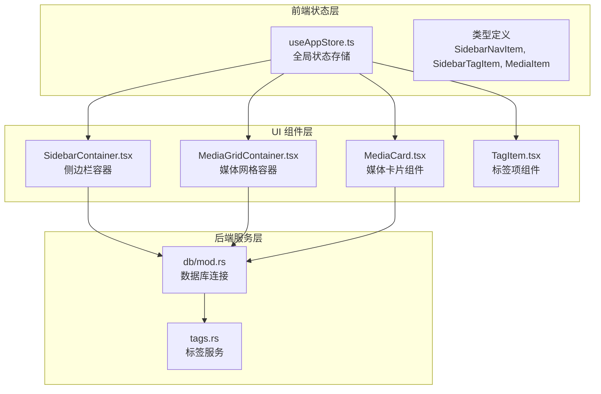

**图表来源**
- [useAppStore.ts:1-395](file://src/store/useAppStore.ts#L1-L395)
- [SidebarContainer.tsx:1-79](file://src/containers/SidebarContainer.tsx#L1-L79)
- [MediaGridContainer.tsx:1-619](file://src/containers/MediaGridContainer.tsx#L1-L619)

**章节来源**
- [useAppStore.ts:1-395](file://src/store/useAppStore.ts#L1-L395)
- [package.json:12-21](file://package.json#L12-L21)

## 核心组件

### 全局状态存储 (useAppStore)

useAppStore 是 Medex 应用的核心状态管理器，使用 Zustand 的 create 函数创建。它定义了完整的应用状态结构和所有相关的操作方法。

#### 数据模型定义

系统定义了三个主要的数据模型：

**SidebarNavItem - 侧边栏导航项**
```typescript
export type SidebarNavItem = {
  id: string;
  label: string;
  active: boolean;
};
```

**SidebarTagItem - 侧边栏标签项**
```typescript
export type SidebarTagItem = {
  id: string;
  name: string;
  selected: boolean;
  mediaCount: number;
};
```

**MediaItem - 媒体项目**
```typescript
export type MediaItem = {
  id: string;
  path: string;
  thumbnail: string;
  filename: string;
  tags: string[];
  time: string;
  mediaType: string;
  duration: string;
  resolution: string;
  isFavorite: boolean;
  isRecent: boolean;
  recentViewedAt?: number | null;
};
```

#### 状态结构

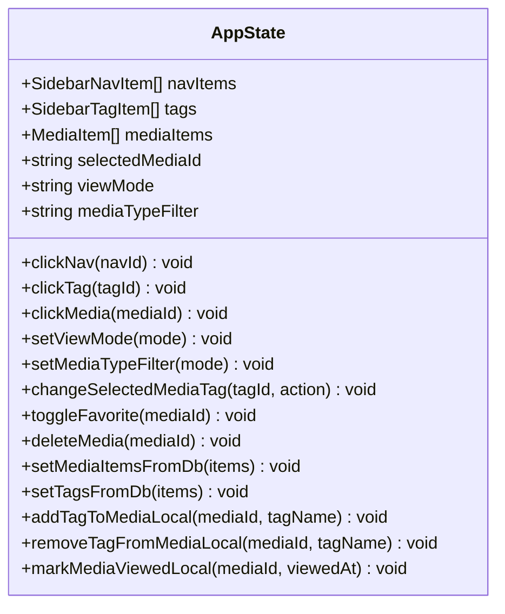

**图表来源**
- [useAppStore.ts:48-68](file://src/store/useAppStore.ts#L48-L68)

#### 初始化状态

系统提供了预定义的初始状态：
- 导航项：全部媒体、收藏、最近三个选项
- 标签：UI、素材、猫、夜晚四个示例标签
- 媒体项目：四个示例媒体条目，包含不同的标签和属性

**章节来源**
- [useAppStore.ts:3-46](file://src/store/useAppStore.ts#L3-L46)
- [useAppStore.ts:70-136](file://src/store/useAppStore.ts#L70-L136)

## 架构概览

Medex 的状态管理采用分层架构设计，实现了清晰的关注点分离：

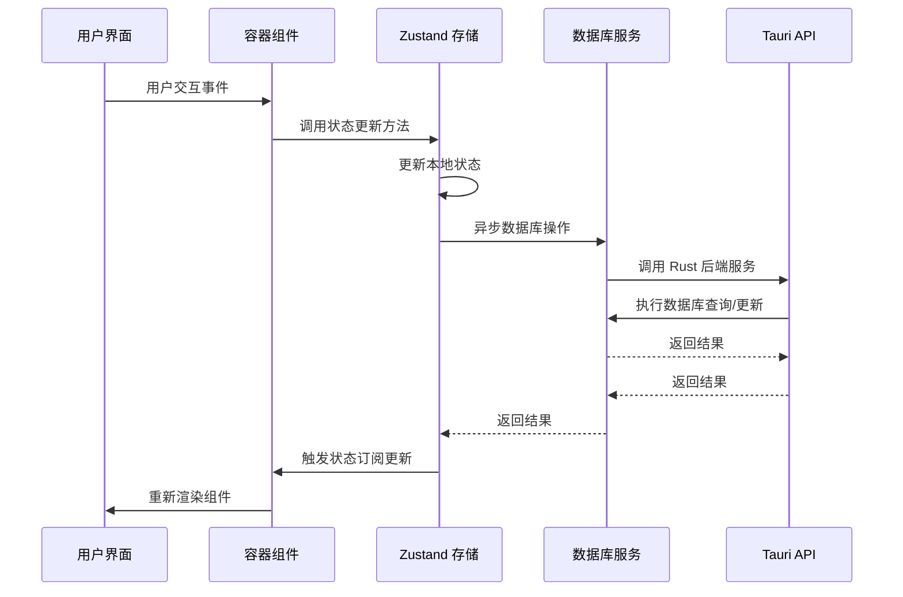

**图表来源**
- [SidebarContainer.tsx:16-33](file://src/containers/SidebarContainer.tsx#L16-L33)
- [MediaGridContainer.tsx:210-243](file://src/containers/MediaGridContainer.tsx#L210-L243)

## 详细组件分析

### 状态更新机制

#### 导航状态更新 (clickNav)

导航状态更新是最简单的状态操作，通过映射所有导航项来设置当前激活的导航项：

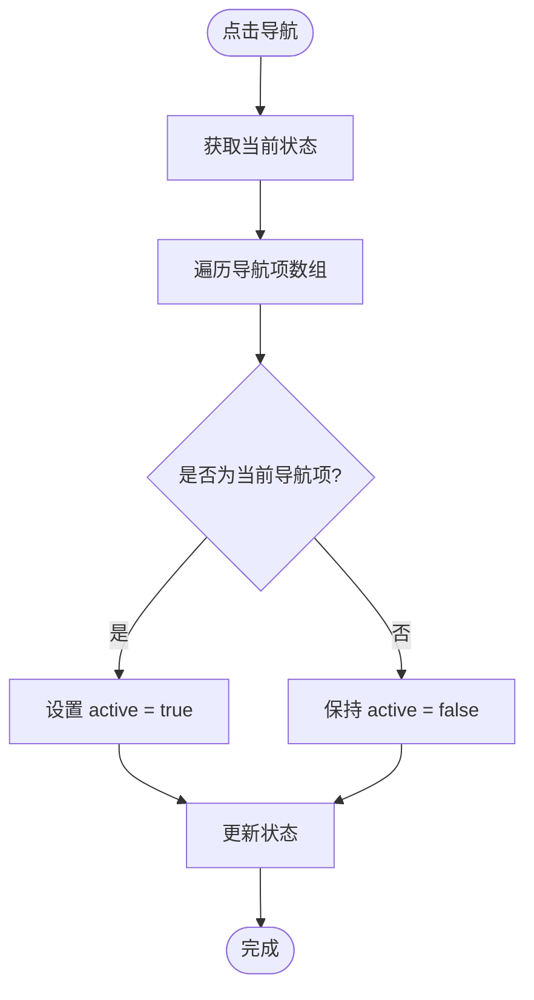

**图表来源**
- [useAppStore.ts:152-160](file://src/store/useAppStore.ts#L152-L160)

#### 标签状态更新 (clickTag)

标签状态更新涉及状态的切换和选择逻辑：

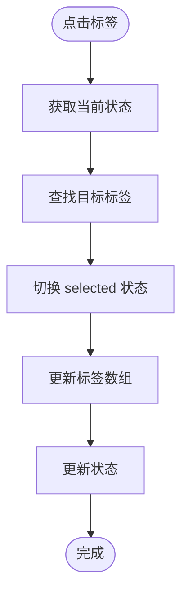

**图表来源**
- [useAppStore.ts:161-173](file://src/store/useAppStore.ts#L161-L173)

#### 媒体标签管理 (changeSelectedMediaTag)

这是最复杂的状态更新操作，涉及多个状态的协调更新：

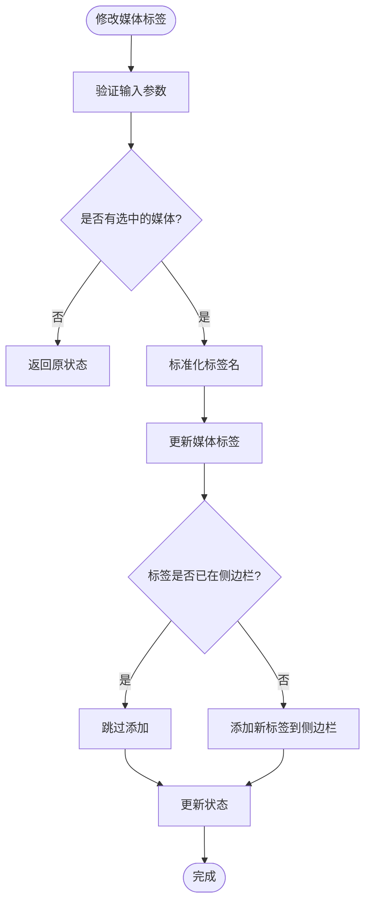

**图表来源**
- [useAppStore.ts:180-235](file://src/store/useAppStore.ts#L180-L235)

#### 收藏状态切换 (toggleFavorite)

收藏状态切换是一个简单的布尔值切换操作：

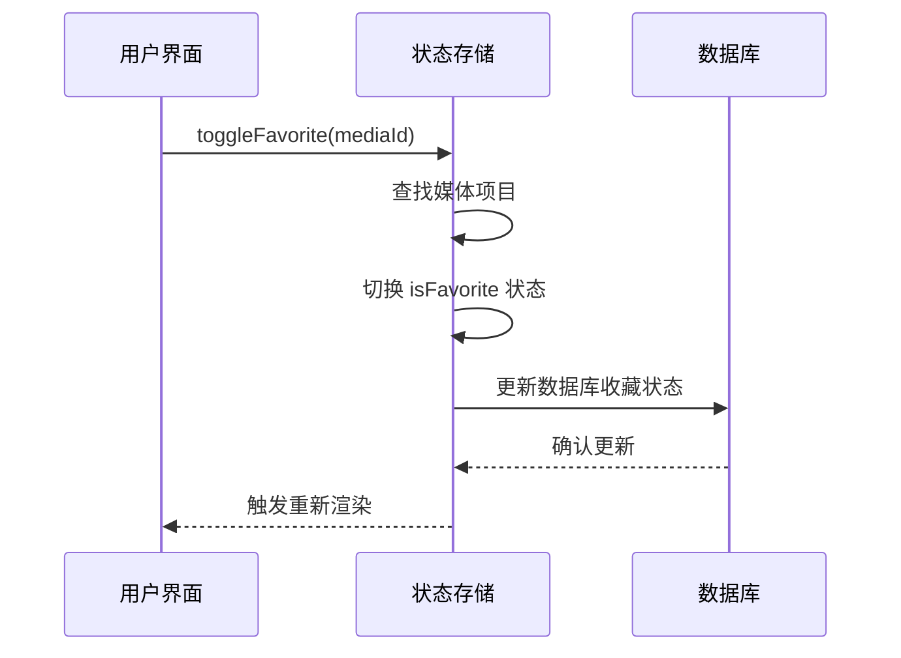

**图表来源**
- [useAppStore.ts:236-246](file://src/store/useAppStore.ts#L236-L246)

### 本地状态与数据库同步

#### 数据库状态合并 (setMediaItemsFromDb)

数据库状态同步采用了智能合并策略，保留本地状态的重要属性：

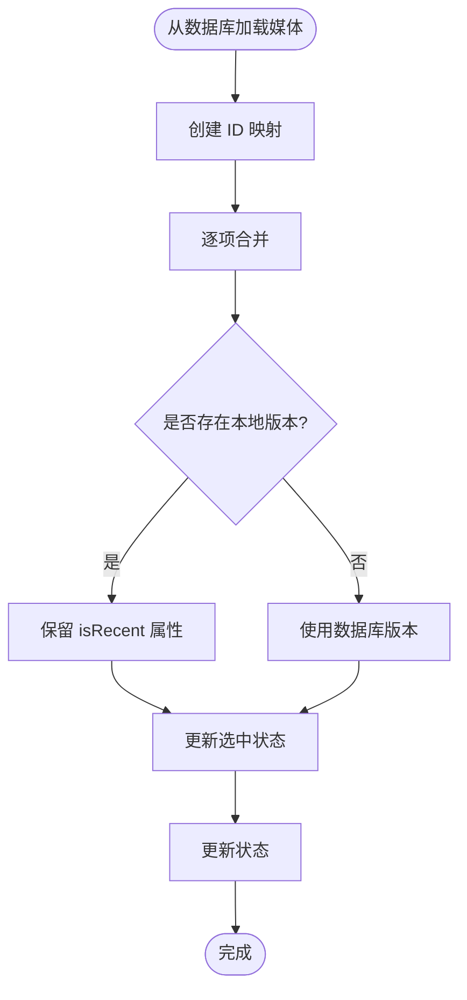

**图表来源**
- [useAppStore.ts:258-276](file://src/store/useAppStore.ts#L258-L276)

#### 标签状态同步 (setTagsFromDb)

标签状态同步保持了用户的标签选择状态：

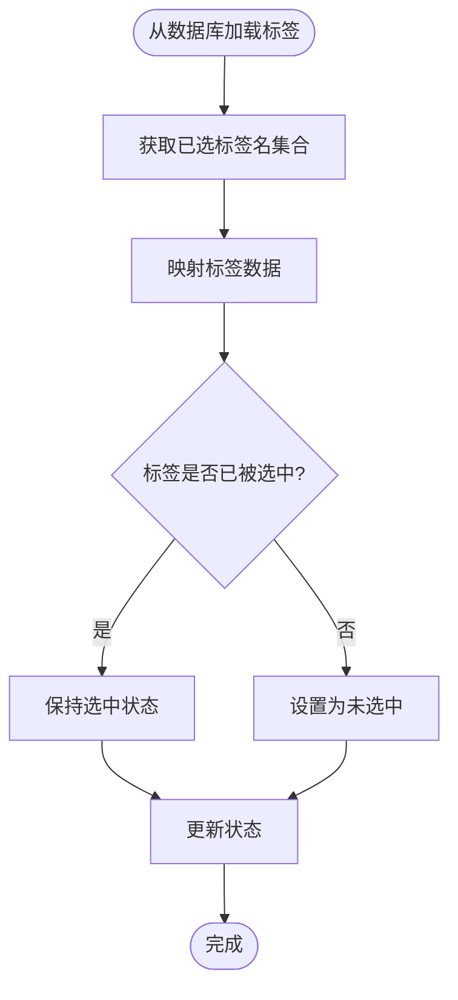

**图表来源**
- [useAppStore.ts:277-288](file://src/store/useAppStore.ts#L277-L288)

### 组件状态订阅模式

#### 容器组件模式

Medex 采用容器组件模式，将状态管理和 UI 分离：

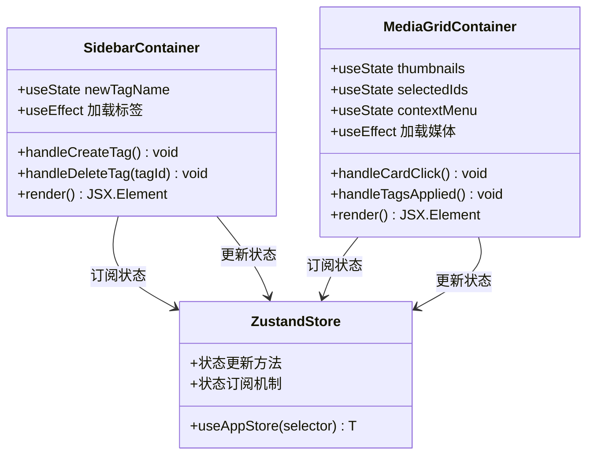

**图表来源**
- [SidebarContainer.tsx:1-79](file://src/containers/SidebarContainer.tsx#L1-L79)
- [MediaGridContainer.tsx:1-619](file://src/containers/MediaGridContainer.tsx#L1-L619)

**章节来源**
- [SidebarContainer.tsx:1-79](file://src/containers/SidebarContainer.tsx#L1-L79)
- [MediaGridContainer.tsx:1-619](file://src/containers/MediaGridContainer.tsx#L1-L619)

## 依赖关系分析

### 外部依赖

Medex 的状态管理依赖于以下关键库：

```mermaid
graph LR
subgraph "状态管理"
Zustand[zustand ^4.5.5]
end
subgraph "UI 框架"
React[react ^18.3.1]
ReactDOM[react-dom ^18.3.1]
end
subgraph "工具库"
Window[react-window ^1.8.10]
DnD[react-dnd ^16.0.1]
end
subgraph "Tauri 集成"
TauriAPI[@tauri-apps/api ^2.0.0]
Dialog[@tauri-apps/plugin-dialog ^2.0.0]
end
Zustand --> React
Zustand --> ReactDOM
Window --> React
DnD --> React
TauriAPI --> React
Dialog --> React
```

**图表来源**
- [package.json:12-21](file://package.json#L12-L21)

### 内部模块依赖

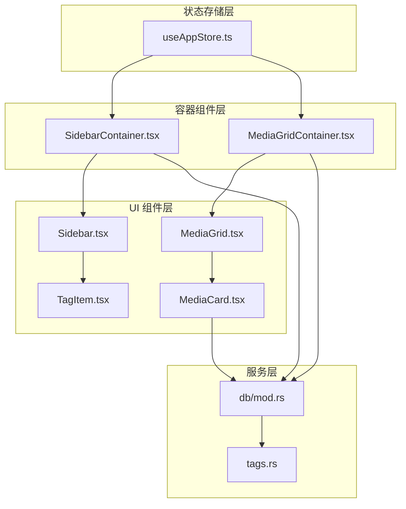

**图表来源**
- [useAppStore.ts:1-395](file://src/store/useAppStore.ts#L1-L395)
- [SidebarContainer.tsx:1-79](file://src/containers/SidebarContainer.tsx#L1-L79)
- [MediaGridContainer.tsx:1-619](file://src/containers/MediaGridContainer.tsx#L1-L619)

**章节来源**
- [useAppStore.ts:1-395](file://src/store/useAppStore.ts#L1-L395)
- [SidebarContainer.tsx:1-79](file://src/containers/SidebarContainer.tsx#L1-L79)
- [MediaGridContainer.tsx:1-619](file://src/containers/MediaGridContainer.tsx#L1-L619)

## 性能考虑

### 状态分割策略

Medex 实现了有效的状态分割，将不同类型的 UI 状态分离：

1. **导航状态**：独立的状态管理，避免不必要的重渲染
2. **标签状态**：独立的状态管理，支持快速筛选
3. **媒体状态**：包含大量媒体项目的复杂状态
4. **视图状态**：包括网格/列表视图切换

### 更新策略优化

#### 批量更新
系统使用批量更新策略来减少状态更新的频率：

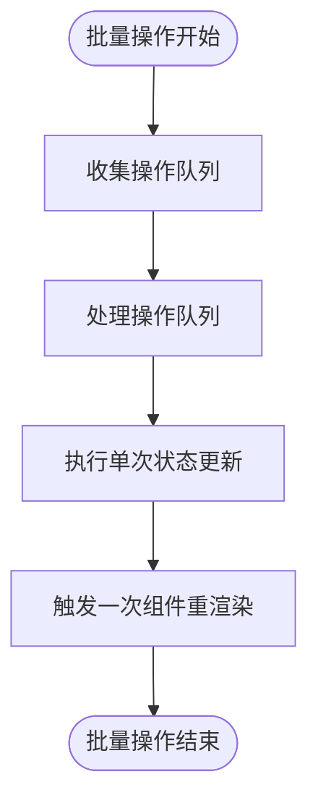

#### 条件更新
所有状态更新都包含条件检查，避免无效的更新：

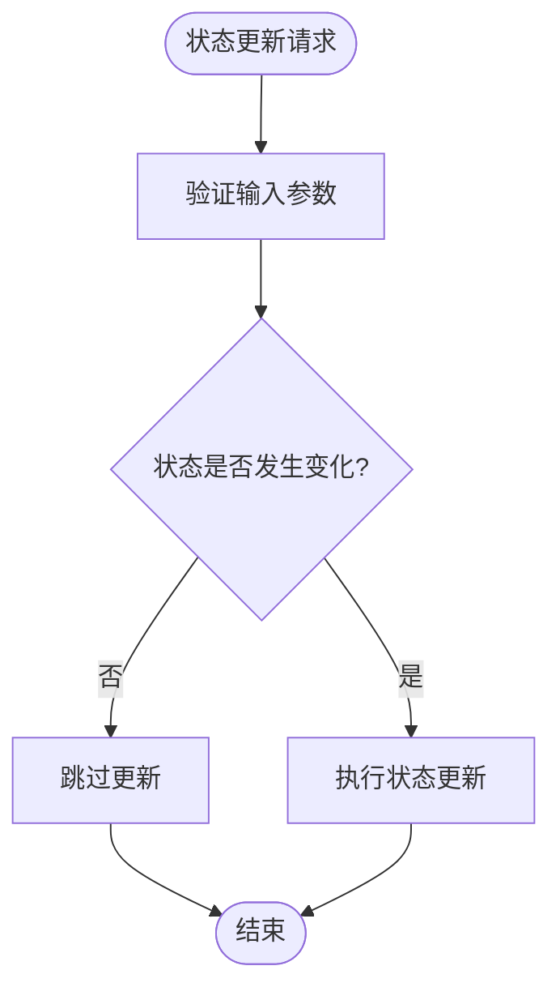

#### 内存优化
- 使用 `memo` 包装组件以避免不必要的重渲染
- 实现自定义相等性检查函数
- 及时清理事件监听器和定时器

**章节来源**
- [MediaCard.tsx:277-317](file://src/components/MediaCard.tsx#L277-L317)
- [MediaGrid.tsx:323-350](file://src/components/MediaGrid.tsx#L323-L350)

## 故障排除指南

### 常见问题诊断

#### 状态不一致问题

当出现状态不一致时，检查以下方面：

1. **数据库同步**：确认 `setMediaItemsFromDb` 和 `setTagsFromDb` 方法正确执行
2. **事件监听**：验证窗口事件监听器是否正确设置和清理
3. **异步操作**：检查异步数据库操作的错误处理

#### 性能问题排查

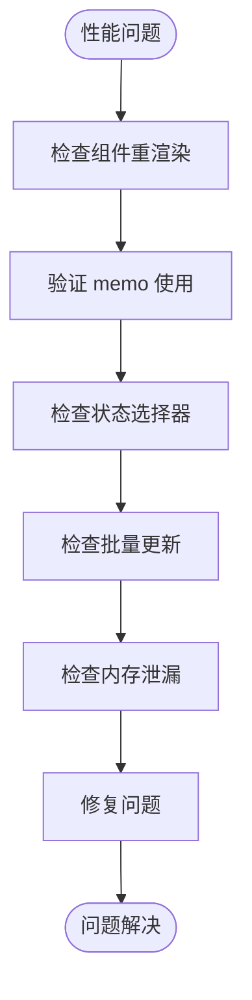

#### 数据库连接问题

1. **初始化检查**：确认数据库正确初始化
2. **事务处理**：验证数据库事务的正确使用
3. **错误处理**：检查数据库操作的错误处理机制

**章节来源**
- [mod.rs:45-64](file://src-tauri/src/db/mod.rs#L45-L64)
- [tags.rs:76-93](file://src-tauri/src/services/tags.rs#L76-L93)

## 结论

Medex 的 Zustand 状态管理系统展现了现代前端应用的最佳实践：

### 设计优势

1. **简洁性**：Zustand 的简单 API 减少了样板代码
2. **类型安全**：完整的 TypeScript 类型定义确保类型安全
3. **可维护性**：清晰的状态分割和职责分离
4. **性能优化**：合理的更新策略和组件优化

### 最佳实践总结

1. **状态分割**：将不同类型的状态分离到独立的存储中
2. **批量更新**：使用单次状态更新减少重渲染
3. **条件检查**：在更新前进行必要的条件验证
4. **内存管理**：及时清理事件监听器和定时器
5. **错误处理**：完善的异步操作错误处理机制

### 未来改进方向

1. **状态持久化**：考虑实现状态的本地持久化
2. **状态调试**：集成状态调试工具
3. **性能监控**：添加状态更新性能监控
4. **测试覆盖**：增加状态管理的单元测试

通过这些设计和实现，Medex 展示了一个高效、可维护且性能优异的状态管理解决方案，为类似的媒体管理应用提供了良好的参考模板。