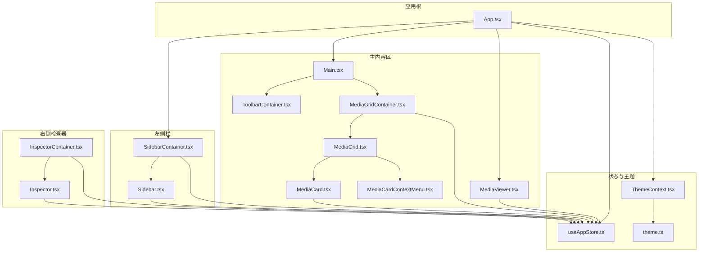
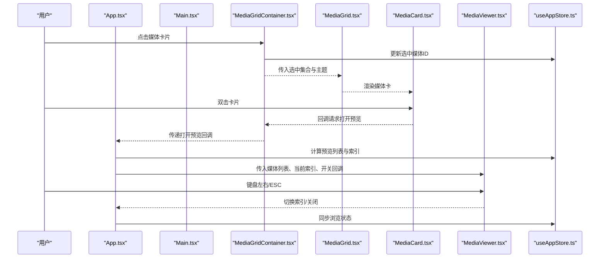
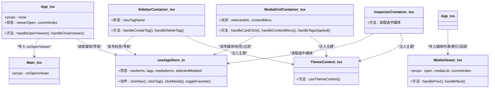

# 组件架构

<cite>
**本文引用的文件**
- [src/App.tsx](file://src/App.tsx)
- [src/components/Main.tsx](file://src/components/Main.tsx)
- [src/containers/SidebarContainer.tsx](file://src/containers/SidebarContainer.tsx)
- [src/components/Sidebar.tsx](file://src/components/Sidebar.tsx)
- [src/containers/MediaGridContainer.tsx](file://src/containers/MediaGridContainer.tsx)
- [src/components/MediaGrid.tsx](file://src/components/MediaGrid.tsx)
- [src/components/MediaCard.tsx](file://src/components/MediaCard.tsx)
- [src/components/MediaCardContextMenu.tsx](file://src/components/MediaCardContextMenu.tsx)
- [src/components/MediaViewer.tsx](file://src/components/MediaViewer.tsx)
- [src/containers/InspectorContainer.tsx](file://src/containers/InspectorContainer.tsx)
- [src/components/Inspector.tsx](file://src/components/Inspector.tsx)
- [src/containers/ToolbarContainer.tsx](file://src/containers/ToolbarContainer.tsx)
- [src/store/useAppStore.ts](file://src/store/useAppStore.ts)
- [src/contexts/ThemeContext.tsx](file://src/contexts/ThemeContext.tsx)
- [src/theme/theme.ts](file://src/theme/theme.ts)
</cite>

## 目录
1. [简介](#简介)
2. [项目结构](#项目结构)
3. [核心组件](#核心组件)
4. [架构总览](#架构总览)
5. [详细组件分析](#详细组件分析)
6. [依赖关系分析](#依赖关系分析)
7. [性能考量](#性能考量)
8. [故障排查指南](#故障排查指南)
9. [结论](#结论)
10. [附录](#附录)

## 简介
本文件系统性梳理 Medex 的组件架构与容器-组件模式设计，聚焦以下目标：
- 解释 React 组件层次结构与职责划分
- 说明容器组件与展示组件的边界与协作方式
- 详解五大核心组件：App.tsx、SidebarContainer.tsx、MediaGridContainer.tsx、MediaViewer.tsx、InspectorContainer.tsx 的功能与交互
- 描述组件间通信机制（props 传递、状态共享、事件处理）
- 总结生命周期管理与性能优化策略
- 提供可追溯的代码片段路径，帮助读者定位实现细节

## 项目结构
Medex 采用“容器-组件”分层组织：
- 容器层：负责状态管理、业务逻辑与外部集成（如数据库调用），典型如 SidebarContainer、MediaGridContainer、InspectorContainer、ToolbarContainer
- 组件层：纯展示或轻交互，负责渲染与基础用户反馈，典型如 Sidebar、MediaGrid、MediaCard、Inspector、MediaViewer
- 全局状态：通过 Zustand store 统一管理导航、标签、媒体项等状态
- 主题系统：通过 ThemeProvider 提供主题上下文，贯穿容器与组件

图表来源
- [src/App.tsx:1-73](file://src/App.tsx#L1-L73)
- [src/components/Main.tsx:1-25](file://src/components/Main.tsx#L1-L25)
- [src/containers/SidebarContainer.tsx:1-79](file://src/containers/SidebarContainer.tsx#L1-L79)
- [src/components/Sidebar.tsx:1-145](file://src/components/Sidebar.tsx#L1-L145)
- [src/containers/MediaGridContainer.tsx:1-619](file://src/containers/MediaGridContainer.tsx#L1-L619)
- [src/components/MediaGrid.tsx:1-351](file://src/components/MediaGrid.tsx#L1-L351)
- [src/components/MediaCard.tsx:1-318](file://src/components/MediaCard.tsx#L1-L318)
- [src/components/MediaCardContextMenu.tsx](file://src/components/MediaCardContextMenu.tsx)
- [src/components/MediaViewer.tsx:1-186](file://src/components/MediaViewer.tsx#L1-L186)
- [src/containers/InspectorContainer.tsx:1-32](file://src/containers/InspectorContainer.tsx#L1-L32)
- [src/components/Inspector.tsx:1-277](file://src/components/Inspector.tsx#L1-L277)
- [src/containers/ToolbarContainer.tsx:1-113](file://src/containers/ToolbarContainer.tsx#L1-L113)
- [src/store/useAppStore.ts:1-395](file://src/store/useAppStore.ts#L1-L395)
- [src/contexts/ThemeContext.tsx:1-99](file://src/contexts/ThemeContext.tsx#L1-L99)
- [src/theme/theme.ts:1-159](file://src/theme/theme.ts#L1-L159)

章节来源
- [src/App.tsx:1-73](file://src/App.tsx#L1-L73)
- [src/components/Main.tsx:1-25](file://src/components/Main.tsx#L1-L25)
- [src/containers/SidebarContainer.tsx:1-79](file://src/containers/SidebarContainer.tsx#L1-L79)
- [src/components/Sidebar.tsx:1-145](file://src/components/Sidebar.tsx#L1-L145)
- [src/containers/MediaGridContainer.tsx:1-619](file://src/containers/MediaGridContainer.tsx#L1-L619)
- [src/components/MediaGrid.tsx:1-351](file://src/components/MediaGrid.tsx#L1-L351)
- [src/components/MediaCard.tsx:1-318](file://src/components/MediaCard.tsx#L1-L318)
- [src/components/MediaCardContextMenu.tsx](file://src/components/MediaCardContextMenu.tsx)
- [src/components/MediaViewer.tsx:1-186](file://src/components/MediaViewer.tsx#L1-L186)
- [src/containers/InspectorContainer.tsx:1-32](file://src/containers/InspectorContainer.tsx#L1-L32)
- [src/components/Inspector.tsx:1-277](file://src/components/Inspector.tsx#L1-L277)
- [src/containers/ToolbarContainer.tsx:1-113](file://src/containers/ToolbarContainer.tsx#L1-L113)
- [src/store/useAppStore.ts:1-395](file://src/store/useAppStore.ts#L1-L395)
- [src/contexts/ThemeContext.tsx:1-99](file://src/contexts/ThemeContext.tsx#L1-L99)
- [src/theme/theme.ts:1-159](file://src/theme/theme.ts#L1-L159)

## 核心组件
- App.tsx：应用主容器，协调左侧栏、主内容区与媒体预览器；负责根据导航状态筛选预览列表、维护预览索引与打开状态，并与后端进行媒体浏览标记的同步
- SidebarContainer.tsx：左侧栏容器，负责标签加载与增删、导航点击响应、主题注入；通过全局 store 更新标签与导航状态
- MediaGridContainer.tsx：媒体网格容器，负责媒体筛选、多选、批量标签操作、视频缩略图队列调度、库路径变更监听、空态提示与“添加媒体库”流程
- MediaViewer.tsx：媒体预览器，负责图片/视频预览、键盘导航、左右切换、ESC 关闭、视频播放控制与资源清理
- InspectorContainer.tsx：媒体详情检查器容器，负责根据选中媒体构建检查器所需数据，提供收藏切换与删除操作回调

章节来源
- [src/App.tsx:1-73](file://src/App.tsx#L1-L73)
- [src/containers/SidebarContainer.tsx:1-79](file://src/containers/SidebarContainer.tsx#L1-L79)
- [src/containers/MediaGridContainer.tsx:1-619](file://src/containers/MediaGridContainer.tsx#L1-L619)
- [src/components/MediaViewer.tsx:1-186](file://src/components/MediaViewer.tsx#L1-L186)
- [src/containers/InspectorContainer.tsx:1-32](file://src/containers/InspectorContainer.tsx#L1-L32)

## 架构总览
Medex 采用“容器-组件”模式，配合 Zustand 全局状态与主题上下文，形成清晰的数据流与职责边界。

图表来源
- [src/App.tsx:28-46](file://src/App.tsx#L28-L46)
- [src/components/Main.tsx:8-21](file://src/components/Main.tsx#L8-L21)
- [src/containers/MediaGridContainer.tsx:59-91](file://src/containers/MediaGridContainer.tsx#L59-L91)
- [src/components/MediaGrid.tsx:70-212](file://src/components/MediaGrid.tsx#L70-L212)
- [src/components/MediaCard.tsx:34-52](file://src/components/MediaCard.tsx#L34-L52)
- [src/components/MediaViewer.tsx:14-63](file://src/components/MediaViewer.tsx#L14-L63)
- [src/store/useAppStore.ts:174-177](file://src/store/useAppStore.ts#L174-L177)

## 详细组件分析

### App.tsx：主容器与预览协调
- 职责
  - 从全局 store 读取媒体与导航项，计算当前激活导航下的预览媒体列表
  - 维护预览器打开状态与当前索引，处理双击打开预览
  - 在打开预览时标记媒体为已浏览，并与后端同步
  - 生命周期内校正索引边界，避免越界
- 关键点
  - 预览列表由导航状态筛选，支持“全部/收藏/最近”
  - 通过 invoke 与后端通信，完成后触发全局事件以刷新界面
- 代码片段路径
  - [src/App.tsx:15-26](file://src/App.tsx#L15-L26)
  - [src/App.tsx:28-42](file://src/App.tsx#L28-L42)
  - [src/App.tsx:48-57](file://src/App.tsx#L48-L57)

章节来源
- [src/App.tsx:1-73](file://src/App.tsx#L1-L73)

### SidebarContainer.tsx：侧边栏导航与标签管理
- 职责
  - 加载标签并注入计数，支持创建/删除标签
  - 响应导航点击与标签点击，更新全局状态
  - 通过窗口事件与全局 store 同步标签变更
- 关键点
  - 使用 invoke 获取标签统计并写回 store
  - 创建/删除标签后触发全局事件，驱动其他组件刷新
- 代码片段路径
  - [src/containers/SidebarContainer.tsx:16-33](file://src/containers/SidebarContainer.tsx#L16-L33)
  - [src/containers/SidebarContainer.tsx:35-51](file://src/containers/SidebarContainer.tsx#L35-L51)
  - [src/containers/SidebarContainer.tsx:53-63](file://src/containers/SidebarContainer.tsx#L53-L63)

章节来源
- [src/containers/SidebarContainer.tsx:1-79](file://src/containers/SidebarContainer.tsx#L1-L79)

### MediaGridContainer.tsx：网格展示、过滤与缩略图调度
- 职责
  - 媒体筛选：按标签与类型过滤，支持“全部/图片/视频”
  - 多选与批量标签：支持 Ctrl/Cmd、Shift 连续选择，批量增删标签
  - 缩略图队列：并发限制、队列长度限制、优先级排序、缺省占位与异步填充
  - 库路径监听：本地存储变化与 Tauri 事件联动，自动刷新媒体列表
  - 空态处理：无库路径与无媒体数据的不同提示
- 关键点
  - 通过 store 的过滤函数与防抖式定时器实现“延迟+去抖”的筛选
  - 通过 react-window 的可见范围回调，按可见/预加载区域入队缩略图任务
  - 通过窗口事件与 Tauri 事件统一刷新
- 代码片段路径
  - [src/containers/MediaGridContainer.tsx:210-243](file://src/containers/MediaGridContainer.tsx#L210-L243)
  - [src/containers/MediaGridContainer.tsx:417-451](file://src/containers/MediaGridContainer.tsx#L417-L451)
  - [src/containers/MediaGridContainer.tsx:352-388](file://src/containers/MediaGridContainer.tsx#L352-L388)
  - [src/containers/MediaGridContainer.tsx:294-308](file://src/containers/MediaGridContainer.tsx#L294-L308)
  - [src/containers/MediaGridContainer.tsx:488-494](file://src/containers/MediaGridContainer.tsx#L488-L494)

章节来源
- [src/containers/MediaGridContainer.tsx:1-619](file://src/containers/MediaGridContainer.tsx#L1-L619)

### MediaGrid.tsx 与 MediaCard.tsx：虚拟化网格与媒体卡
- 职责
  - MediaGrid：根据容器尺寸计算列数/行数，使用 react-window 实现虚拟化渲染；支持网格与列表两种视图
  - MediaCard：渲染单个媒体项，支持收藏按钮、标签删除、双击打开预览、视频缩略图懒加载与错误兜底
- 关键点
  - MediaGrid 对可见范围变化进行回调，驱动上层容器进行缩略图入队
  - MediaCard 对标签删除、收藏切换、右键菜单等事件进行处理，并与 store 同步
- 代码片段路径
  - [src/components/MediaGrid.tsx:70-212](file://src/components/MediaGrid.tsx#L70-L212)
  - [src/components/MediaCard.tsx:34-52](file://src/components/MediaCard.tsx#L34-L52)
  - [src/components/MediaCard.tsx:65-84](file://src/components/MediaCard.tsx#L65-L84)

章节来源
- [src/components/MediaGrid.tsx:1-351](file://src/components/MediaGrid.tsx#L1-L351)
- [src/components/MediaCard.tsx:1-318](file://src/components/MediaCard.tsx#L1-L318)

### MediaViewer.tsx：媒体预览器
- 职责
  - 根据当前索引安全裁剪媒体列表边界，支持键盘左右与 ESC 关闭
  - 自动播放视频，清理视频资源，适配图片/视频不同源格式
- 关键点
  - 键盘事件监听与卸载清理
  - 预览源转换函数兼容绝对路径、远程地址与本地文件
- 代码片段路径
  - [src/components/MediaViewer.tsx:23-29](file://src/components/MediaViewer.tsx#L23-L29)
  - [src/components/MediaViewer.tsx:39-55](file://src/components/MediaViewer.tsx#L39-L55)
  - [src/components/MediaViewer.tsx:176-185](file://src/components/MediaViewer.tsx#L176-L185)

章节来源
- [src/components/MediaViewer.tsx:1-186](file://src/components/MediaViewer.tsx#L1-L186)

### InspectorContainer.tsx 与 Inspector.tsx：媒体详情检查器
- 职责
  - InspectorContainer：从 store 读取选中媒体，映射为检查器所需属性，注入主题
  - Inspector：展示媒体预览、标签列表、信息与操作（收藏、删除、新增标签）
- 关键点
  - 标签增删通过 invoke 与全局事件联动，实时刷新
  - 预览视频仅加载元数据并暂停，避免资源浪费
- 代码片段路径
  - [src/containers/InspectorContainer.tsx:6-31](file://src/containers/InspectorContainer.tsx#L6-L31)
  - [src/components/Inspector.tsx:19-53](file://src/components/Inspector.tsx#L19-L53)
  - [src/components/Inspector.tsx:55-88](file://src/components/Inspector.tsx#L55-L88)

章节来源
- [src/containers/InspectorContainer.tsx:1-32](file://src/containers/InspectorContainer.tsx#L1-L32)
- [src/components/Inspector.tsx:1-277](file://src/components/Inspector.tsx#L1-L277)

### ToolbarContainer.tsx：工具栏与媒体类型过滤
- 职责
  - 响应媒体类型过滤（全部/图片/视频），加载媒体列表
  - 监听扫描完成事件，刷新结果并展示状态消息
- 关键点
  - 通过监听 Tauri 事件与 invoke 调用，实现扫描与刷新闭环
- 代码片段路径
  - [src/containers/ToolbarContainer.tsx:27-29](file://src/containers/ToolbarContainer.tsx#L27-L29)
  - [src/containers/ToolbarContainer.tsx:31-52](file://src/containers/ToolbarContainer.tsx#L31-L52)
  - [src/containers/ToolbarContainer.tsx:58-87](file://src/containers/ToolbarContainer.tsx#L58-L87)

章节来源
- [src/containers/ToolbarContainer.tsx:1-113](file://src/containers/ToolbarContainer.tsx#L1-L113)

## 依赖关系分析
- 容器与组件的依赖
  - SidebarContainer 依赖 Sidebar 与 useAppStore
  - MediaGridContainer 依赖 MediaGrid、MediaCard、MediaCardContextMenu 与 useAppStore
  - InspectorContainer 依赖 Inspector 与 useAppStore
  - App 依赖 Main、MediaViewer 与 useAppStore
- 状态与主题
  - ThemeContext 提供主题上下文，各容器与组件通过 useThemeContext 注入主题色
  - useAppStore 提供全局状态，包括导航、标签、媒体项、视图模式与过滤条件
- 外部集成
  - invoke 用于与后端服务交互（标签增删、媒体过滤、缩略图请求、扫描触发等）
  - listen 用于接收后端事件（缩略图就绪、扫描完成、库路径清除等）

图表来源
- [src/App.tsx:1-73](file://src/App.tsx#L1-L73)
- [src/components/Main.tsx:1-25](file://src/components/Main.tsx#L1-L25)
- [src/containers/SidebarContainer.tsx:1-79](file://src/containers/SidebarContainer.tsx#L1-L79)
- [src/containers/MediaGridContainer.tsx:1-619](file://src/containers/MediaGridContainer.tsx#L1-L619)
- [src/containers/InspectorContainer.tsx:1-32](file://src/containers/InspectorContainer.tsx#L1-L32)
- [src/components/MediaViewer.tsx:1-186](file://src/components/MediaViewer.tsx#L1-L186)
- [src/store/useAppStore.ts:1-395](file://src/store/useAppStore.ts#L1-L395)
- [src/contexts/ThemeContext.tsx:1-99](file://src/contexts/ThemeContext.tsx#L1-L99)

章节来源
- [src/store/useAppStore.ts:1-395](file://src/store/useAppStore.ts#L1-L395)
- [src/contexts/ThemeContext.tsx:1-99](file://src/contexts/ThemeContext.tsx#L1-L99)

## 性能考量
- 虚拟化渲染
  - MediaGrid 使用 react-window 的 FixedSizeGrid/List，仅渲染可视区域与少量预渲染，显著降低 DOM 节点数量
- 缩略图异步与限流
  - 通过任务队列与并发上限控制缩略图请求，避免阻塞主线程；对重复请求与已在请求中的任务进行去重
- 状态与渲染优化
  - 使用 useMemo/memo 避免不必要重渲染；容器内部对可见范围变化进行节流式筛选
- 资源释放
  - 预览器在索引切换或关闭时清理视频资源，减少内存占用
- 主题与样式
  - 主题通过上下文注入，避免重复计算；组件内部使用主题色变量，减少样式切换成本

章节来源
- [src/components/MediaGrid.tsx:173-211](file://src/components/MediaGrid.tsx#L173-L211)
- [src/containers/MediaGridContainer.tsx:352-388](file://src/containers/MediaGridContainer.tsx#L352-L388)
- [src/components/MediaCard.tsx:317-318](file://src/components/MediaCard.tsx#L317-L318)
- [src/components/MediaViewer.tsx:57-63](file://src/components/MediaViewer.tsx#L57-L63)
- [src/contexts/ThemeContext.tsx:17-90](file://src/contexts/ThemeContext.tsx#L17-L90)

## 故障排查指南
- 标签无法刷新
  - 确认创建/删除标签后是否触发“标签更新”事件，以及是否调用 setTagsFromDb 写回 store
  - 代码片段路径：[src/containers/SidebarContainer.tsx:46](file://src/containers/SidebarContainer.tsx#L46)
- 媒体列表不更新
  - 检查筛选条件（标签名拼接键）与媒体类型过滤是否正确；确认防抖定时器是否被清理
  - 代码片段路径：[src/containers/MediaGridContainer.tsx:204-243](file://src/containers/MediaGridContainer.tsx#L204-L243)
- 缩略图不显示
  - 检查任务队列是否入队、并发是否达到上限、后端事件是否到达；确认 convertFileSrc 是否正确转换
  - 代码片段路径：[src/containers/MediaGridContainer.tsx:390-451](file://src/containers/MediaGridContainer.tsx#L390-L451)
- 预览器无法打开
  - 确认导航状态是否正确筛选出预览列表，索引是否越界；检查后端标记浏览接口是否成功
  - 代码片段路径：[src/App.tsx:15-26](file://src/App.tsx#L15-L26), [src/App.tsx:35-42](file://src/App.tsx#L35-L42)
- 主题不生效
  - 检查 ThemeProvider 是否包裹应用根节点，localStorage 主题键是否正确
  - 代码片段路径：[src/contexts/ThemeContext.tsx:17-90](file://src/contexts/ThemeContext.tsx#L17-L90)

章节来源
- [src/containers/SidebarContainer.tsx:35-63](file://src/containers/SidebarContainer.tsx#L35-L63)
- [src/containers/MediaGridContainer.tsx:204-243](file://src/containers/MediaGridContainer.tsx#L204-L243)
- [src/containers/MediaGridContainer.tsx:390-451](file://src/containers/MediaGridContainer.tsx#L390-L451)
- [src/App.tsx:15-26](file://src/App.tsx#L15-L26)
- [src/App.tsx:35-42](file://src/App.tsx#L35-L42)
- [src/contexts/ThemeContext.tsx:17-90](file://src/contexts/ThemeContext.tsx#L17-L90)

## 结论
Medex 的组件架构清晰地遵循容器-组件分离原则：容器专注状态与业务，组件专注渲染与交互；通过全局 store 与主题上下文实现解耦与复用；借助虚拟化与异步任务队列保障性能。该设计使媒体资产管理功能（导航、筛选、预览、检查、标签管理）在可维护性与性能之间取得良好平衡。

## 附录
- 组件间通信机制总结
  - Props 传递：容器向组件传递数据与回调（如 onOpenViewer、mediaList、selectedIds、theme）
  - 状态共享：useAppStore 统一管理导航、标签、媒体项与过滤条件
  - 事件处理：窗口事件与 Tauri 事件用于跨组件同步（标签更新、媒体更新、扫描完成、库路径清除）
- 生命周期管理
  - 容器内 useEffect 用于初始化加载、事件监听与资源清理
  - 组件内 useEffect 用于键盘事件、视频资源释放与尺寸监听
- 性能优化建议
  - 保持 useMemo/memo 的粒度，避免过度拆分导致缓存失效
  - 控制缩略图队列大小与并发，结合可见范围回调进行智能预取
  - 使用主题上下文集中管理样式，减少重复计算