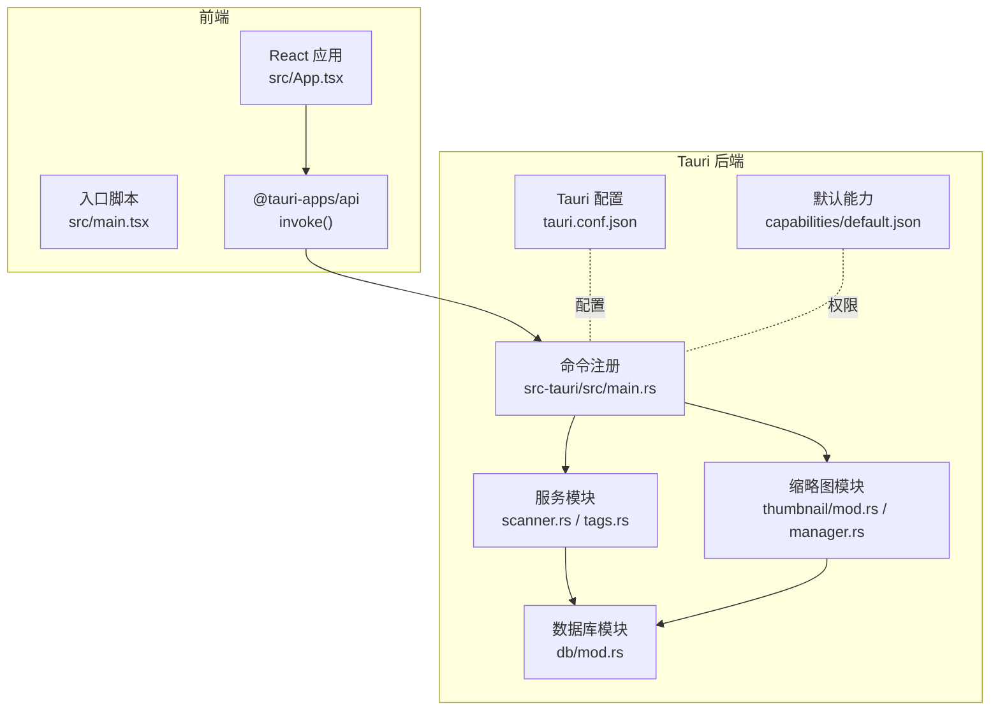
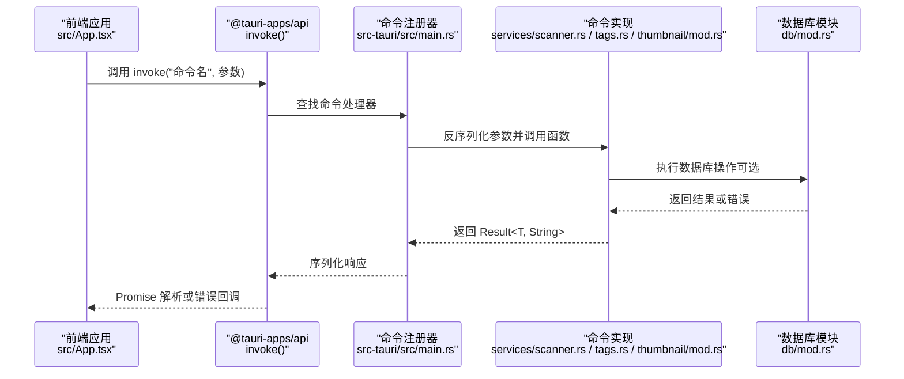
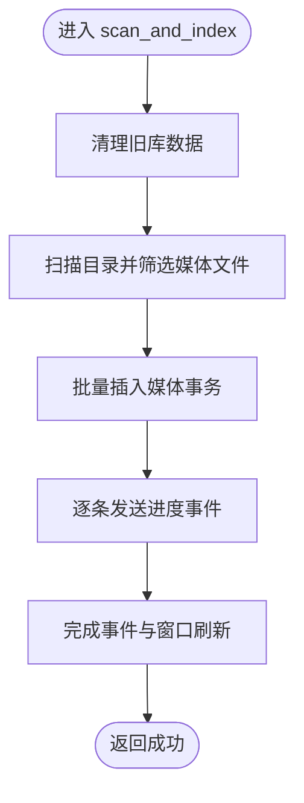
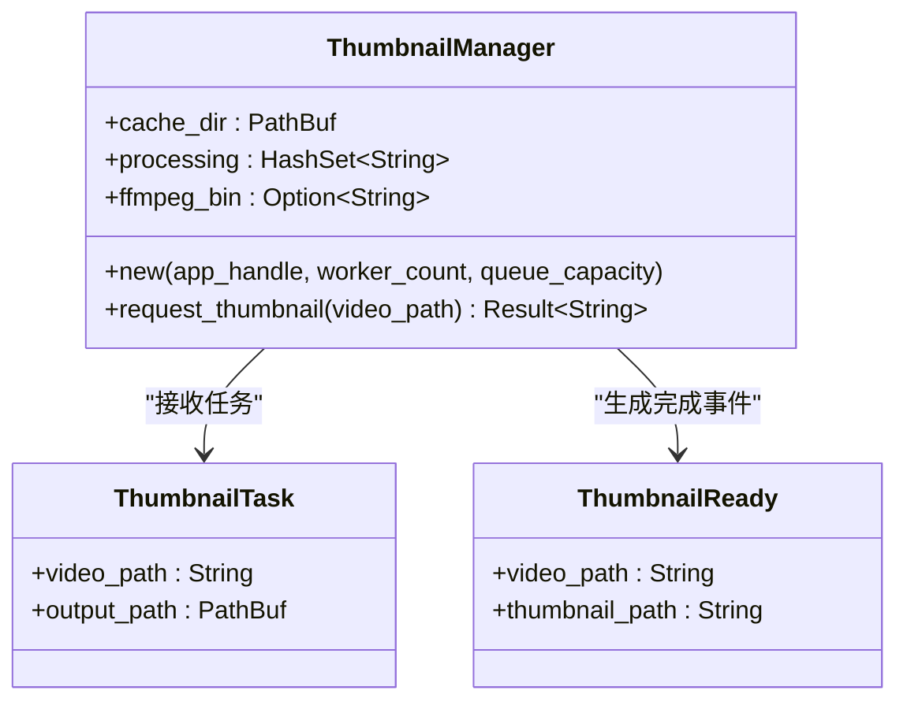
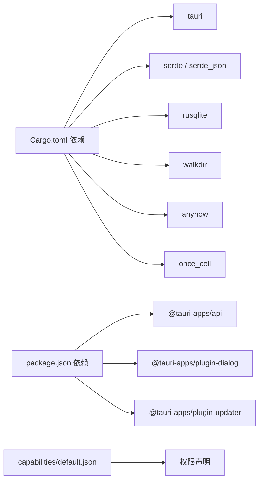

# Tauri 命令系统

<cite>
**本文引用的文件**
- [src-tauri/src/main.rs](file://src-tauri/src/main.rs)
- [src-tauri/src/services/scanner.rs](file://src-tauri/src/services/scanner.rs)
- [src-tauri/src/services/tags.rs](file://src-tauri/src/services/tags.rs)
- [src-tauri/src/thumbnail/mod.rs](file://src-tauri/src/thumbnail/mod.rs)
- [src-tauri/src/thumbnail/manager.rs](file://src-tauri/src/thumbnail/manager.rs)
- [src-tauri/src/db/mod.rs](file://src-tauri/src/db/mod.rs)
- [src-tauri/tauri.conf.json](file://src-tauri/tauri.conf.json)
- [src-tauri/capabilities/default.json](file://src-tauri/capabilities/default.json)
- [src-tauri/gen/schemas/capabilities.json](file://src-tauri/gen/schemas/capabilities.json)
- [src-tauri/Cargo.toml](file://src-tauri/Cargo.toml)
- [package.json](file://package.json)
- [src/main.tsx](file://src/main.tsx)
- [src/App.tsx](file://src/App.tsx)
</cite>

## 目录
1. [简介](#简介)
2. [项目结构](#项目结构)
3. [核心组件](#核心组件)
4. [架构总览](#架构总览)
5. [详细组件分析](#详细组件分析)
6. [依赖关系分析](#依赖关系分析)
7. [性能考虑](#性能考虑)
8. [故障排除指南](#故障排除指南)
9. [结论](#结论)
10. [附录：命令参考](#附录命令参考)

## 简介
本文件面向 Medex Tauri V2 桌面应用的命令系统，系统性梳理命令注册机制、参数序列化与返回值处理、命令调用链路（前端 invoke 到后端处理）、安全与权限控制、输入验证策略、前后端通信协议（消息格式、错误传播、超时处理）、性能优化与批量操作支持，并提供调试与排障建议。内容基于实际源码进行分析，确保可操作性与准确性。

## 项目结构
Medex 的命令系统由 Rust 后端通过 Tauri V2 的命令宏导出，前端使用 @tauri-apps/api 的 invoke 进行调用。命令主要分布在以下模块：
- 媒体扫描与索引：扫描目录、插入媒体、过滤媒体、收藏与最近观看标记、清空媒体库等
- 标签管理：查询标签、创建/删除标签、为媒体添加/移除标签、按媒体查询标签
- 缩略图生成：请求缩略图、队列与工作线程管理
- 数据库：SQLite 初始化、表结构与索引、连接池封装
- 配置与能力：Tauri 配置、能力清单、权限声明

图表来源
- [src-tauri/src/main.rs:49-65](file://src-tauri/src/main.rs#L49-L65)
- [src-tauri/src/services/scanner.rs:160-163](file://src-tauri/src/services/scanner.rs#L160-L163)
- [src-tauri/src/services/tags.rs:19-42](file://src-tauri/src/services/tags.rs#L19-L42)
- [src-tauri/src/thumbnail/mod.rs:57-61](file://src-tauri/src/thumbnail/mod.rs#L57-L61)
- [src-tauri/src/db/mod.rs:45-64](file://src-tauri/src/db/mod.rs#L45-L64)
- [src-tauri/tauri.conf.json:1-46](file://src-tauri/tauri.conf.json#L1-L46)
- [src-tauri/capabilities/default.json:1-15](file://src-tauri/capabilities/default.json#L1-L15)

章节来源
- [src-tauri/src/main.rs:10-68](file://src-tauri/src/main.rs#L10-L68)
- [src-tauri/tauri.conf.json:1-46](file://src-tauri/tauri.conf.json#L1-L46)
- [src-tauri/capabilities/default.json:1-15](file://src-tauri/capabilities/default.json#L1-L15)

## 核心组件
- 命令注册器：在应用启动时集中注册所有命令，统一暴露给前端调用
- 服务层命令：媒体扫描、过滤、收藏、最近观看、标签 CRUD、按媒体查询标签
- 缩略图子系统：请求缩略图、任务队列、工作线程、缓存与占位符
- 数据库模块：SQLite 初始化、表结构、索引、连接封装
- 能力与权限：能力清单声明允许的权限集合，限制命令访问范围

章节来源
- [src-tauri/src/main.rs:49-65](file://src-tauri/src/main.rs#L49-L65)
- [src-tauri/src/services/scanner.rs:160-163](file://src-tauri/src/services/scanner.rs#L160-L163)
- [src-tauri/src/services/tags.rs:19-42](file://src-tauri/src/services/tags.rs#L19-L42)
- [src-tauri/src/thumbnail/mod.rs:57-61](file://src-tauri/src/thumbnail/mod.rs#L57-L61)
- [src-tauri/src/db/mod.rs:45-64](file://src-tauri/src/db/mod.rs#L45-L64)
- [src-tauri/capabilities/default.json:6-13](file://src-tauri/capabilities/default.json#L6-L13)

## 架构总览
Tauri V2 命令系统采用“命令宏 + 注册器”的模式：
- 后端函数通过 #[tauri::command] 宏导出，自动序列化参数与返回值
- 前端通过 @tauri-apps/api 的 invoke 发起调用，遵循 JSON-RPC 风格的消息格式
- 错误以字符串形式返回，前端捕获并处理
- 命令执行上下文可访问 AppHandle，用于事件广播或窗口控制

图表来源
- [src-tauri/src/main.rs:49-65](file://src-tauri/src/main.rs#L49-L65)
- [src-tauri/src/services/scanner.rs:160-163](file://src-tauri/src/services/scanner.rs#L160-L163)
- [src-tauri/src/services/tags.rs:19-42](file://src-tauri/src/services/tags.rs#L19-L42)
- [src-tauri/src/thumbnail/mod.rs:57-61](file://src-tauri/src/thumbnail/mod.rs#L57-L61)
- [src-tauri/src/db/mod.rs:97-110](file://src-tauri/src/db/mod.rs#L97-L110)

## 详细组件分析

### 命令注册与生命周期
- 应用启动时，Builder::default() 链式配置插件与菜单，随后通过 generate_handler! 将多个命令一次性注册到 invoke_handler
- 注册列表包含媒体扫描、过滤、收藏、最近观看、清空库、标签 CRUD、按媒体查询标签、缩略图请求等
- 注册器负责将命令名映射到对应函数，自动处理参数反序列化与返回值序列化

章节来源
- [src-tauri/src/main.rs:49-65](file://src-tauri/src/main.rs#L49-L65)

### 媒体扫描与索引命令
- 命令：scan_and_index(path: String, app_handle: AppHandle)
- 功能：清理旧库数据 → 扫描目录 → 批量插入媒体 → 广播进度事件 → 结束后刷新主窗口
- 参数与返回：接收路径字符串与 AppHandle；返回 Result<(), String>
- 输入验证：对媒体类型进行白名单校验，跳过不支持扩展名
- 性能优化：事务批量插入、分段提交、事件驱动进度反馈
- 错误处理：任何阶段失败均转换为字符串错误返回

图表来源
- [src-tauri/src/services/scanner.rs:250-341](file://src-tauri/src/services/scanner.rs#L250-L341)

章节来源
- [src-tauri/src/services/scanner.rs:250-341](file://src-tauri/src/services/scanner.rs#L250-L341)

### 媒体过滤与查询命令
- 命令：filter_media_by_tags(tag_names: Vec<String>) → Result<Vec<MediaItem>, String>
- 命令：filter_media(tag_names: Vec<String>, media_type: Option<String>) → Result<Vec<MediaItem>, String>
- 功能：按标签集合过滤媒体，支持可选媒体类型；内部将标签名标准化为空间与大小写无关
- 参数序列化：Vec<String> 与 Option<String> 自动序列化/反序列化
- SQL 构造：动态拼接占位符与类型过滤条件，使用参数绑定防止注入
- 返回值：序列化为 MediaItem 列表（包含 id、路径、类型、是否收藏、是否最近、最近观看时间、标签列表）

章节来源
- [src-tauri/src/services/scanner.rs:165-247](file://src-tauri/src/services/scanner.rs#L165-L247)

### 收藏与最近观看命令
- 命令：set_media_favorite(media_id: i64, is_favorite: bool) → Result<(), String>
- 命令：mark_media_viewed(media_id: i64) → Result<(), String>
- 功能：收藏状态更新；最近观看记录插入/更新，并限制历史数量（仅保留最近 N 条）
- 数据一致性：使用事务保证最近观看插入与裁剪的一致性

章节来源
- [src-tauri/src/services/scanner.rs:343-389](file://src-tauri/src/services/scanner.rs#L343-L389)

### 清空媒体库命令
- 命令：clear_library_data(app_handle: AppHandle) → Result<(), String>
- 功能：清空 media、media_tags、recent_views 表并重置自增 ID；刷新非设置窗口
- 错误传播：异常转为字符串错误并记录日志

章节来源
- [src-tauri/src/services/scanner.rs:475-524](file://src-tauri/src/services/scanner.rs#L475-L524)

### 标签管理命令
- 命令：get_all_tags() → Result<Vec<Tag>, String>
- 命令：get_all_tags_with_count() → Result<Vec<TagWithCount>, String>
- 命令：create_tag(tag_name: String) → Result<(), String>
- 命令：delete_tag(tag_id: i64) → Result<(), String>
- 命令：add_tag_to_media(media_id: i64, tag_name: String) → Result<(), String>
- 命令：remove_tag_from_media(media_id: i64, tag_id: i64) → Result<(), String>
- 命令：get_tags_by_media(media_id: i64) → Result<Vec<Tag>, String>
- 输入验证：创建/添加标签前对名称进行修剪与空值校验
- 删除约束：若标签仍被使用则拒绝删除
- 返回值：Tag、TagWithCount、Tag 列表等结构化对象

章节来源
- [src-tauri/src/services/tags.rs:19-220](file://src-tauri/src/services/tags.rs#L19-L220)

### 缩略图请求命令
- 命令：request_thumbnail(path: String) → Result<String, String>
- 功能：请求视频缩略图；若缓存存在直接返回路径；否则入队等待异步生成；队列满或未初始化时返回占位符
- 子系统：ThumbnailManager 维护队列、工作线程、处理中集合与缓存目录；支持 ffmpeg 可用性检测
- 返回值：返回缓存路径或占位符字符串

图表来源
- [src-tauri/src/thumbnail/manager.rs:16-107](file://src-tauri/src/thumbnail/manager.rs#L16-L107)
- [src-tauri/src/thumbnail/mod.rs:18-28](file://src-tauri/src/thumbnail/mod.rs#L18-L28)

章节来源
- [src-tauri/src/thumbnail/mod.rs:57-61](file://src-tauri/src/thumbnail/mod.rs#L57-L61)
- [src-tauri/src/thumbnail/manager.rs:51-106](file://src-tauri/src/thumbnail/manager.rs#L51-L106)

### 数据库模块
- 初始化：首次运行创建表与索引，确保必要列存在
- 连接：OnceCell + Mutex 线程安全持有连接；提供 with_connection 封装
- 索引：针对 path、media_tags 主键、recent_views 视图时间等建立索引
- 事务：批量插入与多表更新使用事务保证原子性

章节来源
- [src-tauri/src/db/mod.rs:45-123](file://src-tauri/src/db/mod.rs#L45-L123)

### 前端调用示例与交互
- 前端入口根据路径渲染不同页面；主应用通过 @tauri-apps/api 的 invoke 调用后端命令
- 示例：打开媒体查看器时调用 mark_media_viewed，并在完成后触发自定义事件通知界面刷新

章节来源
- [src/main.tsx:9-44](file://src/main.tsx#L9-L44)
- [src/App.tsx:28-42](file://src/App.tsx#L28-L42)

## 依赖关系分析
- 后端依赖：tauri、serde、rusqlite、walkdir、anyhow、once_cell
- 前端依赖：@tauri-apps/api、@tauri-apps/plugin-dialog、@tauri-apps/plugin-updater
- 能力与权限：default 能力声明允许对话框与更新器插件的特定权限

图表来源
- [src-tauri/Cargo.toml:13-22](file://src-tauri/Cargo.toml#L13-L22)
- [package.json:12-21](file://package.json#L12-L21)
- [src-tauri/capabilities/default.json:6-13](file://src-tauri/capabilities/default.json#L6-L13)

章节来源
- [src-tauri/Cargo.toml:13-22](file://src-tauri/Cargo.toml#L13-L22)
- [package.json:12-21](file://package.json#L12-L21)
- [src-tauri/capabilities/default.json:6-13](file://src-tauri/capabilities/default.json#L6-L13)

## 性能考虑
- 批量操作
  - 媒体扫描：使用事务包裹批量插入，减少磁盘写入次数
  - 标签添加：先插入标签，再插入关联表，避免重复查询
- 查询优化
  - 使用参数绑定与索引（path、media_tags 主键、recent_views 视图时间）
  - 分组聚合时避免不必要的排序与大字段传输
- 异步与并发
  - 缩略图：固定工作线程数与队列容量，避免资源耗尽；队列满时返回占位符，前端轮询或监听完成事件
- I/O 与缓存
  - 缩略图缓存命中直接返回路径，减少重复生成
- 前端刷新
  - 通过事件广播触发局部刷新，避免全量重载

章节来源
- [src-tauri/src/services/scanner.rs:90-115](file://src-tauri/src/services/scanner.rs#L90-L115)
- [src-tauri/src/services/scanner.rs:174-247](file://src-tauri/src/services/scanner.rs#L174-L247)
- [src-tauri/src/thumbnail/manager.rs:24-49](file://src-tauri/src/thumbnail/manager.rs#L24-L49)
- [src-tauri/src/db/mod.rs:39-43](file://src-tauri/src/db/mod.rs#L39-L43)

## 故障排除指南
- 命令无响应或超时
  - 检查前端 invoke 是否正确传入参数与命令名
  - 后端命令是否已注册（generate_handler! 列表）
  - 若涉及数据库或文件系统操作，确认线程安全与锁竞争
- 错误传播
  - 后端命令统一返回 Result<T, String>，前端通过 catch 捕获错误
  - 日志输出包含详细上下文，便于定位失败点
- 权限问题
  - 能力清单需包含所需权限；如对话框、更新器等插件权限
  - 确认 tauri.conf.json 中的安全策略与协议配置
- 缩略图不生成
  - 检查 ffmpeg 是否可用；队列是否已满；缓存目录是否存在
  - 请求返回占位符时，前端应监听完成事件或轮询缓存路径

章节来源
- [src-tauri/src/main.rs:49-65](file://src-tauri/src/main.rs#L49-L65)
- [src-tauri/src/services/scanner.rs:327-329](file://src-tauri/src/services/scanner.rs#L327-L329)
- [src-tauri/src/thumbnail/manager.rs:55-106](file://src-tauri/src/thumbnail/manager.rs#L55-L106)
- [src-tauri/capabilities/default.json:6-13](file://src-tauri/capabilities/default.json#L6-L13)
- [src-tauri/tauri.conf.json:21-27](file://src-tauri/tauri.conf.json#L21-L27)

## 结论
Medex 的 Tauri V2 命令系统以“命令宏 + 注册器”为核心，结合能力与权限控制、参数与返回值的自动序列化、数据库事务与索引优化、以及缩略图异步队列，构建了稳定高效的桌面应用后端。通过清晰的职责划分与一致的错误处理策略，既满足功能需求，又兼顾性能与可维护性。

## 附录：命令参考
- 媒体扫描与索引
  - 命令：scan_and_index
  - 参数：path: String, app_handle: AppHandle
  - 返回：Result<(), String>
  - 说明：清理旧库 → 扫描目录 → 批量插入 → 广播进度 → 刷新窗口
- 媒体查询
  - 命令：get_all_media
  - 参数：无
  - 返回：Result<Vec<MediaItem>, String>
- 媒体过滤
  - 命令：filter_media_by_tags
  - 参数：tag_names: Vec<String>
  - 返回：Result<Vec<MediaItem>, String>
  - 命令：filter_media
  - 参数：tag_names: Vec<String>, media_type: Option<String>
  - 返回：Result<Vec<MediaItem>, String>
- 收藏与最近观看
  - 命令：set_media_favorite
  - 参数：media_id: i64, is_favorite: bool
  - 返回：Result<(), String>
  - 命令：mark_media_viewed
  - 参数：media_id: i64
  - 返回：Result<(), String>
- 清空媒体库
  - 命令：clear_library_data
  - 参数：app_handle: AppHandle
  - 返回：Result<(), String>
- 标签管理
  - 命令：get_all_tags
  - 参数：无
  - 返回：Result<Vec<Tag>, String>
  - 命令：get_all_tags_with_count
  - 参数：无
  - 返回：Result<Vec<TagWithCount>, String>
  - 命令：create_tag
  - 参数：tag_name: String
  - 返回：Result<(), String>
  - 命令：delete_tag
  - 参数：tag_id: i64
  - 返回：Result<(), String>
  - 命令：add_tag_to_media
  - 参数：media_id: i64, tag_name: String
  - 返回：Result<(), String>
  - 命令：remove_tag_from_media
  - 参数：media_id: i64, tag_id: i64
  - 返回：Result<(), String>
  - 命令：get_tags_by_media
  - 参数：media_id: i64
  - 返回：Result<Vec<Tag>, String>
- 缩略图请求
  - 命令：request_thumbnail
  - 参数：path: String
  - 返回：Result<String, String>

章节来源
- [src-tauri/src/services/scanner.rs:160-524](file://src-tauri/src/services/scanner.rs#L160-L524)
- [src-tauri/src/services/tags.rs:19-220](file://src-tauri/src/services/tags.rs#L19-L220)
- [src-tauri/src/thumbnail/mod.rs:57-61](file://src-tauri/src/thumbnail/mod.rs#L57-L61)