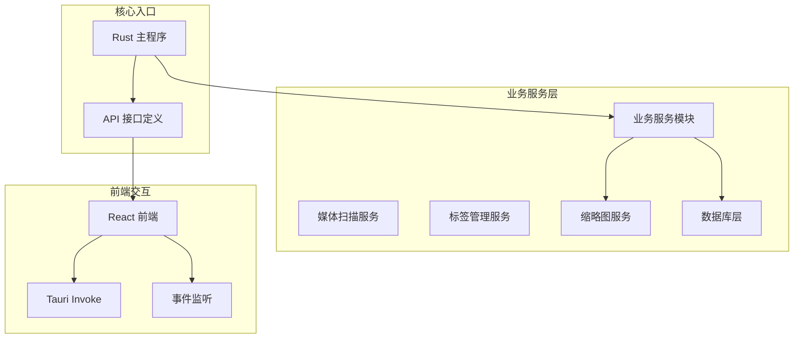
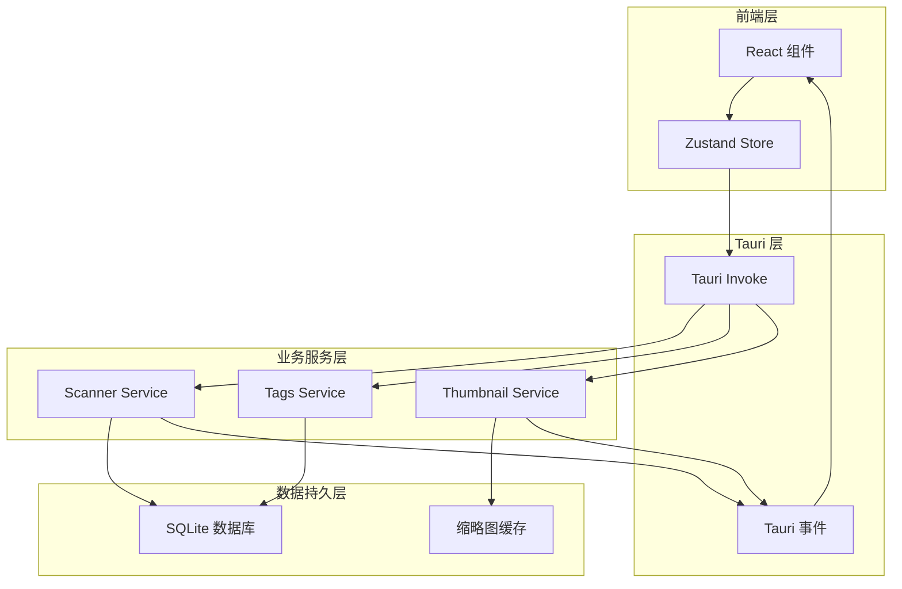
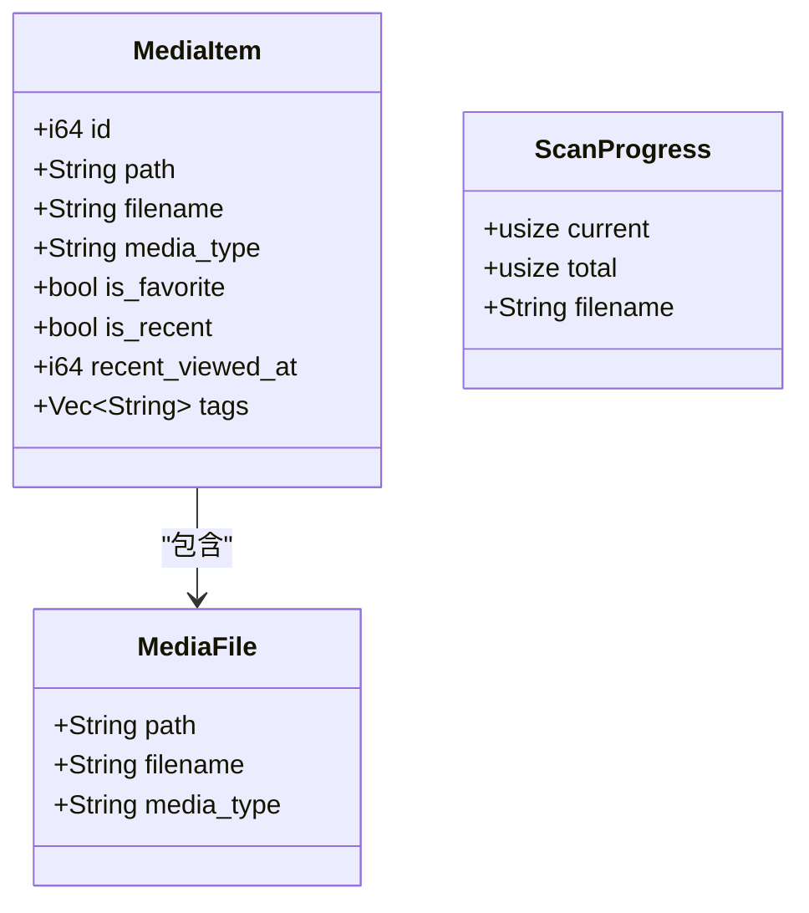
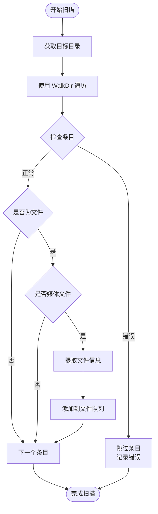
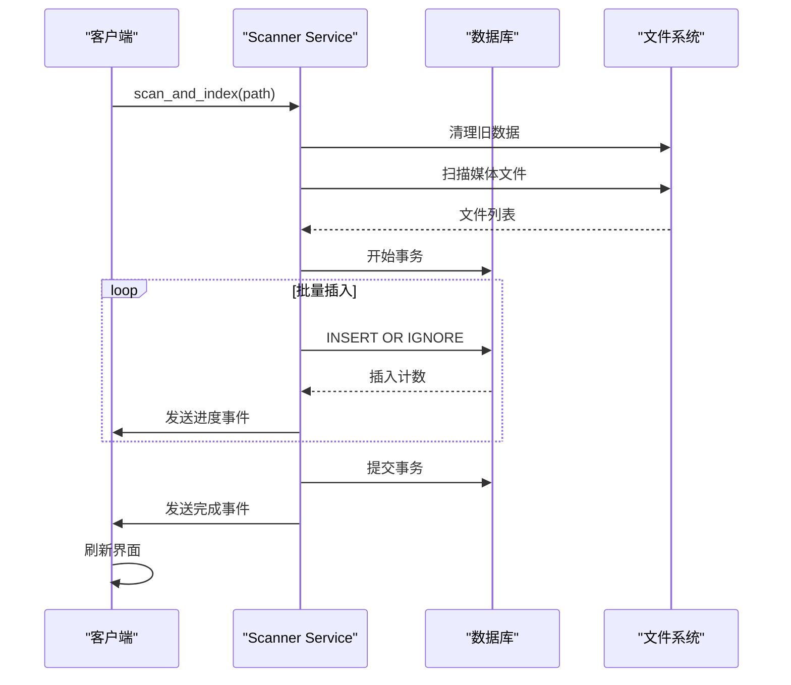
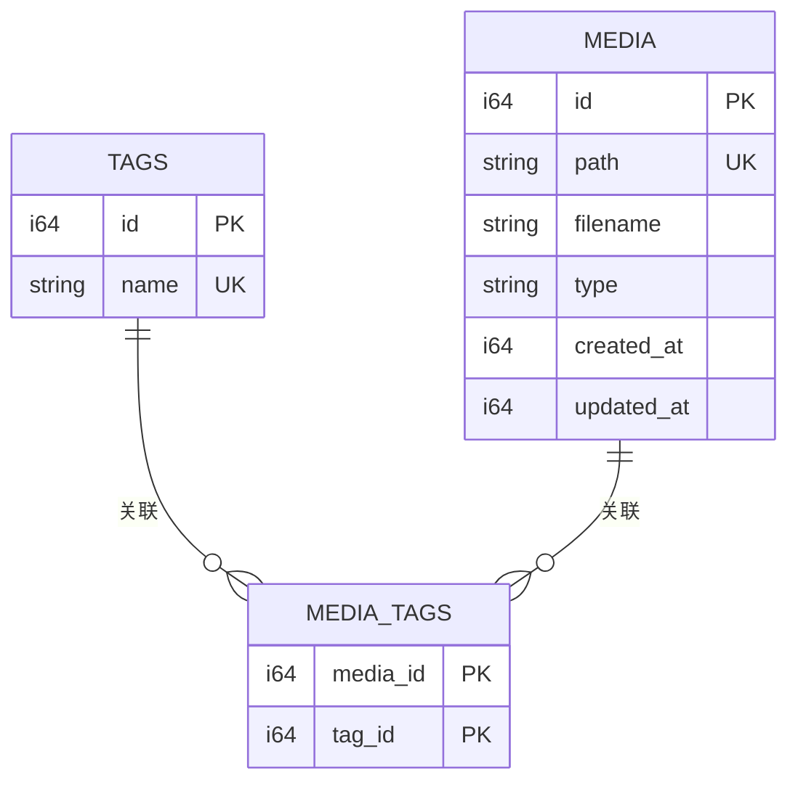
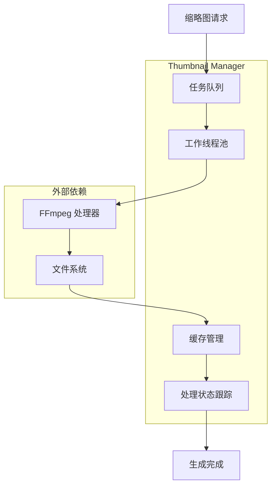
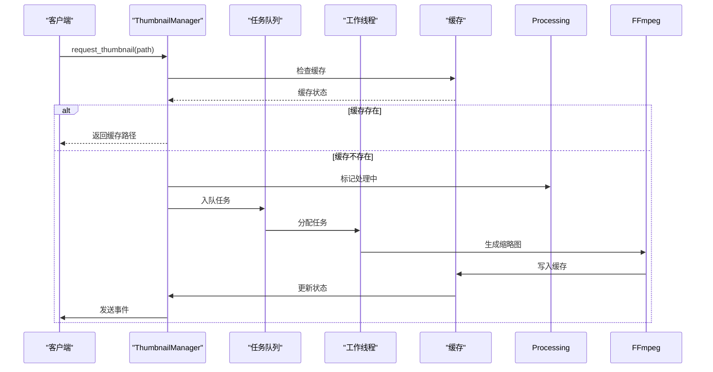
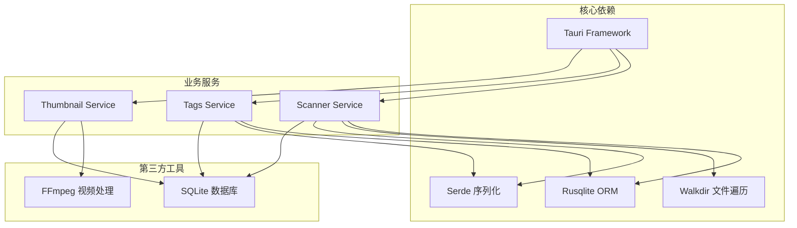

# 业务服务层

<cite>
**本文档引用的文件**
- [src-tauri/src/services/scanner.rs](file://src-tauri/src/services/scanner.rs)
- [src-tauri/src/services/tags.rs](file://src-tauri/src/services/tags.rs)
- [src-tauri/src/db/mod.rs](file://src-tauri/src/db/mod.rs)
- [src-tauri/src/main.rs](file://src-tauri/src/main.rs)
- [src-tauri/src/thumbnail/mod.rs](file://src-tauri/src/thumbnail/mod.rs)
- [src-tauri/src/thumbnail/manager.rs](file://src-tauri/src/thumbnail/manager.rs)
- [src-tauri/src/thumbnail/queue.rs](file://src-tauri/src/thumbnail/queue.rs)
- [src-tauri/src/thumbnail/worker.rs](file://src-tauri/src/thumbnail/worker.rs)
- [src-tauri/src/thumbnail/utils.rs](file://src-tauri/src/thumbnail/utils.rs)
- [API_REFERENCE.md](file://API_REFERENCE.md)
- [README.md](file://README.md)
</cite>

## 目录
1. [简介](#简介)
2. [项目结构](#项目结构)
3. [核心组件](#核心组件)
4. [架构概览](#架构概览)
5. [详细组件分析](#详细组件分析)
6. [依赖关系分析](#依赖关系分析)
7. [性能考虑](#性能考虑)
8. [故障排除指南](#故障排除指南)
9. [结论](#结论)
10. [附录](#附录)

## 简介

Medex 是一个基于 Tauri V2 + React + TypeScript 的多媒体管理和播放应用。本文档专注于业务服务层的实现，深入解析媒体扫描服务、标签管理服务和文件处理服务的工作原理。

项目采用三层架构设计：
- **前端层**：React + TypeScript + Tauri V2
- **业务服务层**：Rust 实现的核心业务逻辑
- **数据持久层**：SQLite 数据库

## 项目结构

业务服务层主要分布在以下目录结构中：

**图表来源**
- [src-tauri/src/main.rs:10-69](file://src-tauri/src/main.rs#L10-L69)
- [src-tauri/src/services/mod.rs:1-3](file://src-tauri/src/services/mod.rs#L1-L3)

**章节来源**
- [src-tauri/src/main.rs:10-69](file://src-tauri/src/main.rs#L10-L69)
- [src-tauri/src/services/mod.rs:1-3](file://src-tauri/src/services/mod.rs#L1-L3)

## 核心组件

业务服务层包含三个核心组件：

### 1. 媒体扫描服务 (Scanner Service)
负责媒体文件的发现、索引和查询功能，支持文件系统遍历、媒体类型识别和批量索引。

### 2. 标签管理服务 (Tags Service)  
提供完整的标签 CRUD 操作，支持标签统计和批量标签处理。

### 3. 缩略图服务 (Thumbnail Service)
实现异步缩略图生成，包含工作线程池、任务队列和缓存管理。

**章节来源**
- [src-tauri/src/services/scanner.rs:10-525](file://src-tauri/src/services/scanner.rs#L10-L525)
- [src-tauri/src/services/tags.rs:1-220](file://src-tauri/src/services/tags.rs#L1-L220)
- [src-tauri/src/thumbnail/mod.rs:1-62](file://src-tauri/src/thumbnail/mod.rs#L1-L62)

## 架构概览

**图表来源**
- [src-tauri/src/main.rs:49-65](file://src-tauri/src/main.rs#L49-L65)
- [src-tauri/src/db/mod.rs:12-43](file://src-tauri/src/db/mod.rs#L12-L43)

## 详细组件分析

### 媒体扫描服务 (Scanner Service)

媒体扫描服务是整个应用的核心，负责媒体文件的发现、索引和查询。

#### 核心数据结构

**图表来源**
- [src-tauri/src/services/scanner.rs:10-38](file://src-tauri/src/services/scanner.rs#L10-L38)

#### 文件系统遍历算法

媒体扫描服务使用 `walkdir` 库进行深度优先遍历，支持符号链接跟随和错误处理：

**图表来源**
- [src-tauri/src/services/scanner.rs:54-88](file://src-tauri/src/services/scanner.rs#L54-L88)

#### 媒体类型识别算法

支持的媒体类型包括：
- **图像格式**：JPG/JPEG、PNG、WebP、GIF
- **视频格式**：MP4、MOV、MKV、WebM

识别过程：
1. 获取文件扩展名
2. 转换为小写
3. 与支持的格式列表匹配
4. 返回对应的媒体类型标识

#### 批量索引处理

**图表来源**
- [src-tauri/src/services/scanner.rs:250-341](file://src-tauri/src/services/scanner.rs#L250-L341)

#### 查询过滤机制

支持多种查询条件组合：
- **标签过滤**：多标签交集过滤
- **类型过滤**：图像/视频类型筛选
- **综合过滤**：标签 + 类型联合过滤

**章节来源**
- [src-tauri/src/services/scanner.rs:40-88](file://src-tauri/src/services/scanner.rs#L40-L88)
- [src-tauri/src/services/scanner.rs:160-247](file://src-tauri/src/services/scanner.rs#L160-L247)
- [src-tauri/src/services/scanner.rs:250-341](file://src-tauri/src/services/scanner.rs#L250-L341)

### 标签管理服务 (Tags Service)

标签管理系统提供完整的标签生命周期管理。

#### 标签数据模型

**图表来源**
- [src-tauri/src/db/mod.rs:23-37](file://src-tauri/src/db/mod.rs#L23-L37)

#### 标签 CRUD 操作

| 操作 | 方法 | 功能描述 |
|------|------|----------|
| 创建 | `create_tag` | 创建新标签，支持去重 |
| 读取 | `get_all_tags` | 获取所有标签列表 |
| 删除 | `delete_tag` | 删除标签（需无引用） |
| 更新 | `add_tag_to_media` | 为媒体添加标签 |
| 移除 | `remove_tag_from_media` | 从媒体移除标签 |

#### 批量标签处理

支持批量标签操作以提高性能：
- **批量创建**：避免重复标签创建
- **批量查询**：使用 SQL JOIN 优化查询
- **批量删除**：事务内执行确保一致性

**章节来源**
- [src-tauri/src/services/tags.rs:19-220](file://src-tauri/src/services/tags.rs#L19-L220)
- [src-tauri/src/db/mod.rs:12-43](file://src-tauri/src/db/mod.rs#L12-L43)

### 缩略图服务 (Thumbnail Service)

缩略图服务实现异步视频缩略图生成，包含完整的并发控制机制。

#### 服务架构

**图表来源**
- [src-tauri/src/thumbnail/manager.rs:16-50](file://src-tauri/src/thumbnail/manager.rs#L16-L50)

#### 并发控制机制

**图表来源**
- [src-tauri/src/thumbnail/manager.rs:51-106](file://src-tauri/src/thumbnail/manager.rs#L51-L106)

#### 性能优化策略

- **工作线程池**：默认4个线程并行处理
- **队列容量**：2048个任务的缓冲队列
- **去重机制**：防止重复处理相同文件
- **缓存策略**：基于文件路径哈希的本地缓存

**章节来源**
- [src-tauri/src/thumbnail/mod.rs:14-62](file://src-tauri/src/thumbnail/mod.rs#L14-L62)
- [src-tauri/src/thumbnail/manager.rs:16-108](file://src-tauri/src/thumbnail/manager.rs#L16-L108)
- [src-tauri/src/thumbnail/worker.rs:13-96](file://src-tauri/src/thumbnail/worker.rs#L13-L96)

## 依赖关系分析

**图表来源**
- [src-tauri/src/main.rs:10-69](file://src-tauri/src/main.rs#L10-L69)
- [src-tauri/src/db/mod.rs:12-43](file://src-tauri/src/db/mod.rs#L12-L43)

**章节来源**
- [src-tauri/src/main.rs:10-69](file://src-tauri/src/main.rs#L10-L69)
- [src-tauri/src/db/mod.rs:12-43](file://src-tauri/src/db/mod.rs#L12-L43)

## 性能考虑

### 数据库性能优化

1. **索引策略**
   - `media(path)`：加速路径查找
   - `media_tags(media_id)`：加速媒体标签查询
   - `media_tags(tag_id)`：加速标签媒体查询
   - `recent_views(viewed_at DESC)`：加速最近查看排序

2. **事务处理**
   - 使用批量事务减少磁盘 I/O
   - 原子性保证数据一致性

3. **查询优化**
   - 使用 `GROUP_CONCAT` 合并标签查询
   - 避免 N+1 查询问题

### 并发控制

1. **线程安全**
   - 使用 `Mutex` 保护数据库连接
   - `OnceCell` 确保单例初始化

2. **内存管理**
   - `Arc<Mutex<HashSet>>` 管理处理状态
   - 及时释放锁和临时对象

3. **资源限制**
   - 队列容量限制防止内存溢出
   - 工作线程数量可配置

**章节来源**
- [src-tauri/src/db/mod.rs:39-43](file://src-tauri/src/db/mod.rs#L39-L43)
- [src-tauri/src/thumbnail/manager.rs:32-48](file://src-tauri/src/thumbnail/manager.rs#L32-L48)

## 故障排除指南

### 常见问题及解决方案

#### 1. 媒体扫描失败

**症状**：扫描过程中断或部分文件未被识别

**可能原因**：
- 文件权限不足
- 路径包含无效字符
- 磁盘空间不足

**解决方法**：
- 检查文件访问权限
- 验证路径有效性
- 清理磁盘空间

#### 2. 标签删除失败

**症状**：尝试删除标签时报错

**可能原因**：
- 标签仍被媒体引用
- 数据库连接异常

**解决方法**：
- 先移除所有关联媒体
- 检查数据库连接状态

#### 3. 缩略图生成失败

**症状**：视频缩略图无法生成

**可能原因**：
- FFmpeg 未安装
- 视频格式不受支持
- 缓存目录权限问题

**解决方法**：
- 安装 FFmpeg 并配置环境变量
- 检查视频格式兼容性
- 验证缓存目录权限

**章节来源**
- [src-tauri/src/services/tags.rs:96-124](file://src-tauri/src/services/tags.rs#L96-L124)
- [src-tauri/src/thumbnail/utils.rs:71-96](file://src-tauri/src/thumbnail/utils.rs#L71-L96)

## 结论

Medex 的业务服务层展现了现代桌面应用的最佳实践：

1. **模块化设计**：清晰的职责分离，便于维护和扩展
2. **性能优化**：合理的并发控制和资源管理
3. **错误处理**：完善的异常处理和恢复机制
4. **用户体验**：流畅的异步操作和实时反馈

未来可以进一步优化的方向包括：
- 批量标签处理接口
- 分页查询支持
- 更丰富的媒体元数据提取
- 增强的搜索和过滤功能

## 附录

### API 接口定义

#### 媒体扫描接口

| 接口名 | 参数 | 返回值 | 描述 |
|--------|------|--------|------|
| `scan_and_index` | `path: string` | `void` | 扫描并索引媒体文件 |
| `get_all_media` | 无 | `MediaItem[]` | 获取所有媒体项 |
| `filter_media` | `tag_names: string[]`, `media_type: string` | `MediaItem[]` | 按标签和类型过滤 |
| `set_media_favorite` | `media_id: number`, `is_favorite: boolean` | `void` | 设置收藏状态 |
| `mark_media_viewed` | `media_id: number` | `void` | 标记媒体已查看 |

#### 标签管理接口

| 接口名 | 参数 | 返回值 | 描述 |
|--------|------|--------|------|
| `get_all_tags` | 无 | `Tag[]` | 获取所有标签 |
| `get_all_tags_with_count` | 无 | `TagWithCount[]` | 获取标签及使用计数 |
| `create_tag` | `tag_name: string` | `void` | 创建新标签 |
| `delete_tag` | `tag_id: number` | `void` | 删除标签 |
| `add_tag_to_media` | `media_id: number`, `tag_name: string` | `void` | 为媒体添加标签 |
| `remove_tag_from_media` | `media_id: number`, `tag_id: number` | `void` | 从媒体移除标签 |
| `get_tags_by_media` | `media_id: number` | `Tag[]` | 获取媒体的所有标签 |

#### 缩略图接口

| 接口名 | 参数 | 返回值 | 描述 |
|--------|------|--------|------|
| `request_thumbnail` | `path: string` | `string` | 请求视频缩略图 |

### 事件定义

| 事件名 | 负载类型 | 触发时机 | 描述 |
|--------|----------|----------|------|
| `scan_progress` | `ScanProgress` | 每处理一个文件 | 扫描进度通知 |
| `scan_done` | `boolean` | 扫描完成后 | 扫描完成通知 |
| `thumbnail_ready` | `ThumbnailReady` | 缩略图生成完成后 | 缩略图就绪通知 |

**章节来源**
- [API_REFERENCE.md:35-545](file://API_REFERENCE.md#L35-L545)