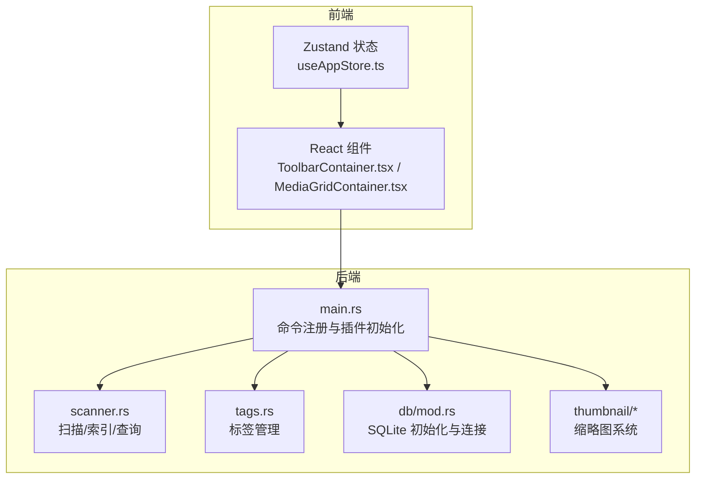
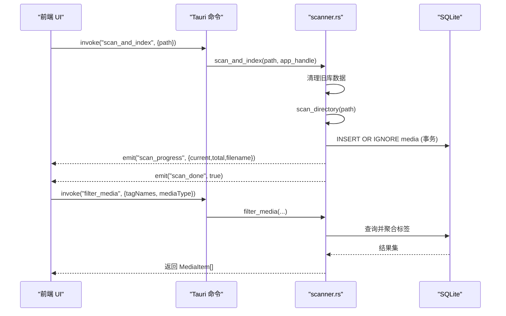
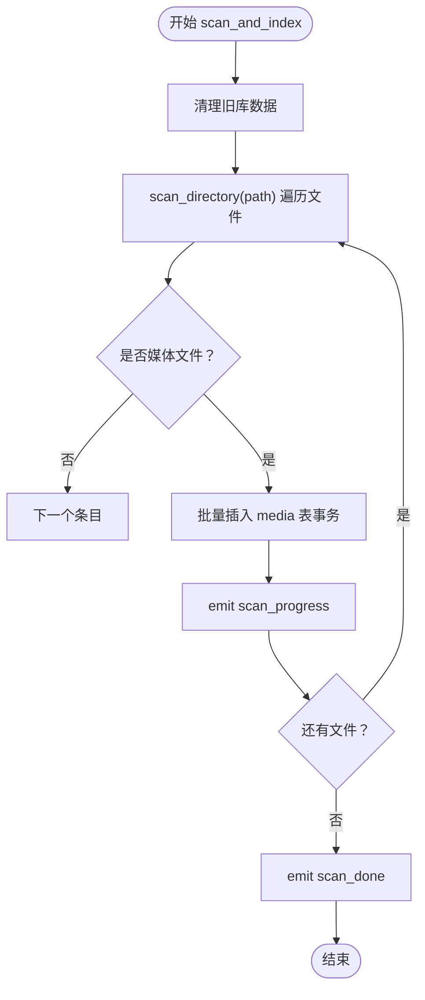
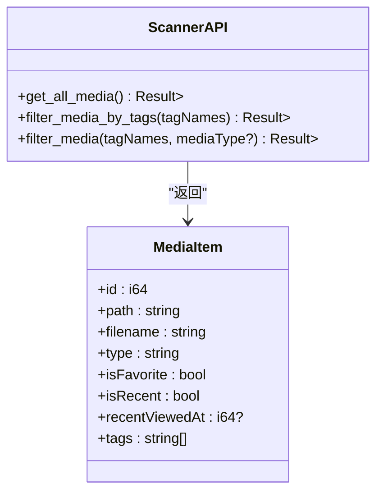
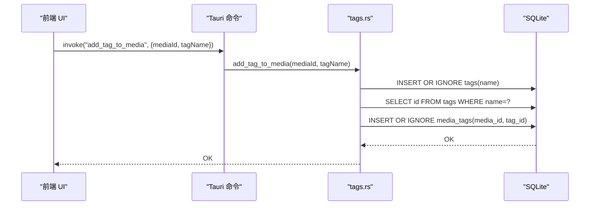
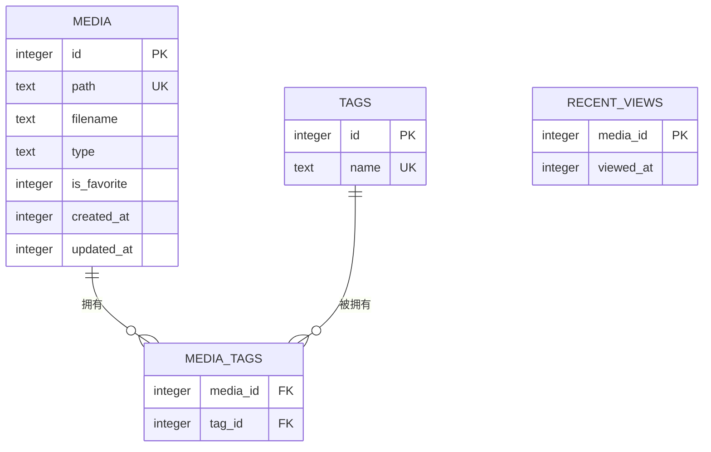
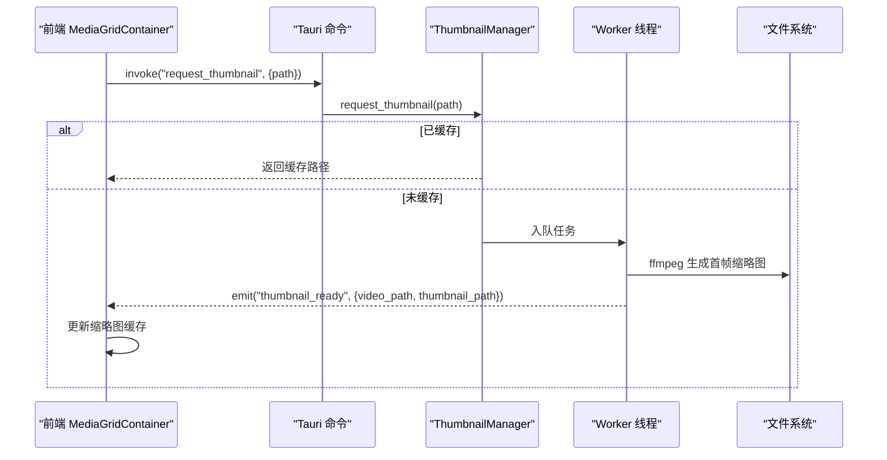
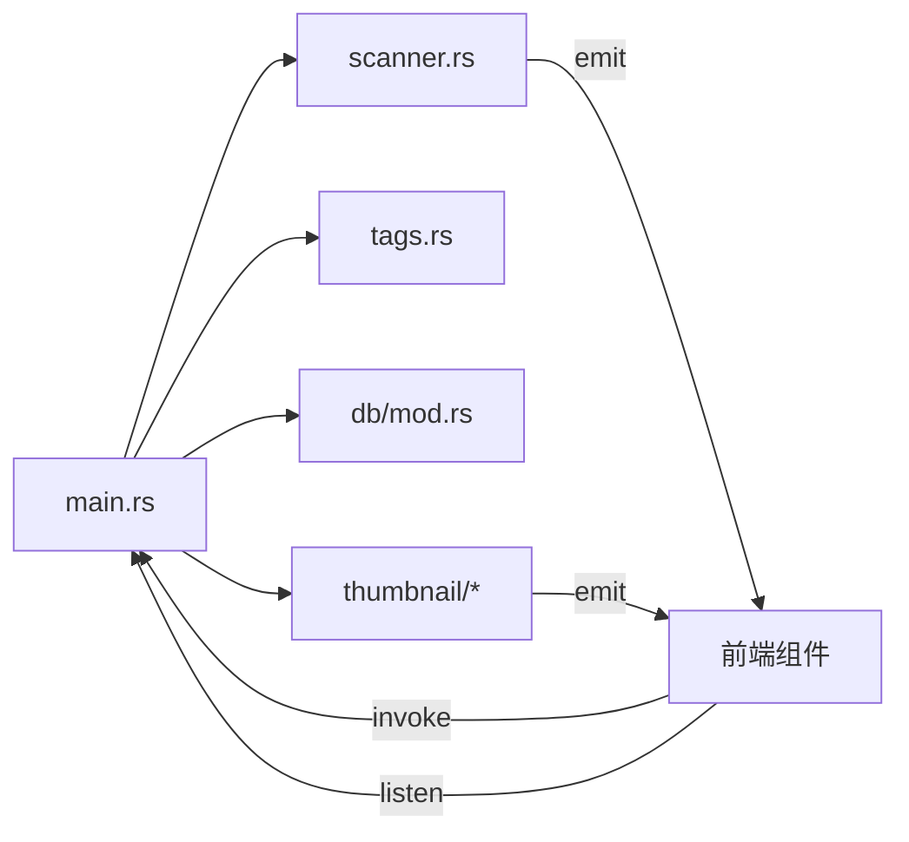

# 媒体扫描服务

<cite>
**本文引用的文件**
- [src-tauri/src/services/scanner.rs](file://src-tauri/src/services/scanner.rs)
- [src-tauri/src/main.rs](file://src-tauri/src/main.rs)
- [src-tauri/src/db/mod.rs](file://src-tauri/src/db/mod.rs)
- [src-tauri/src/services/tags.rs](file://src-tauri/src/services/tags.rs)
- [src-tauri/src/thumbnail/mod.rs](file://src-tauri/src/thumbnail/mod.rs)
- [src-tauri/src/thumbnail/manager.rs](file://src-tauri/src/thumbnail/manager.rs)
- [src-tauri/src/thumbnail/queue.rs](file://src-tauri/src/thumbnail/queue.rs)
- [src-tauri/src/thumbnail/worker.rs](file://src-tauri/src/thumbnail/worker.rs)
- [src-tauri/src/thumbnail/utils.rs](file://src-tauri/src/thumbnail/utils.rs)
- [API_REFERENCE.md](file://API_REFERENCE.md)
- [DEVELOPMENT.md](file://DEVELOPMENT.md)
- [src/containers/ToolbarContainer.tsx](file://src/containers/ToolbarContainer.tsx)
- [src/containers/MediaGridContainer.tsx](file://src/containers/MediaGridContainer.tsx)
- [src/store/useAppStore.ts](file://src/store/useAppStore.ts)
</cite>

## 目录
1. [简介](#简介)
2. [项目结构](#项目结构)
3. [核心组件](#核心组件)
4. [架构总览](#架构总览)
5. [详细组件分析](#详细组件分析)
6. [依赖分析](#依赖分析)
7. [性能考量](#性能考量)
8. [故障排查指南](#故障排查指南)
9. [结论](#结论)
10. [附录](#附录)

## 简介
本文件面向 Medex 媒体扫描服务，系统性阐述媒体文件扫描的实现原理与工程细节，包括：
- 文件系统遍历算法与过滤规则
- 媒体文件识别与索引生成流程
- 扫描进度事件与错误处理机制
- 媒体元数据提取与时间戳解析
- 扫描配置、过滤规则与批量处理能力
- API 接口定义、使用示例与最佳实践

## 项目结构
后端采用 Tauri + Rust + SQLite 架构，前端使用 React + TypeScript。扫描服务位于 Rust 后端的 services 子模块，数据库初始化与命令注册在 main.rs 中完成。

**图表来源**
- [src-tauri/src/main.rs:10-68](file://src-tauri/src/main.rs#L10-L68)
- [src-tauri/src/services/scanner.rs:54-341](file://src-tauri/src/services/scanner.rs#L54-L341)
- [src-tauri/src/db/mod.rs:45-122](file://src-tauri/src/db/mod.rs#L45-L122)
- [src-tauri/src/services/tags.rs:19-220](file://src-tauri/src/services/tags.rs#L19-L220)
- [src-tauri/src/thumbnail/mod.rs:32-61](file://src-tauri/src/thumbnail/mod.rs#L32-L61)

**章节来源**
- [src-tauri/src/main.rs:10-68](file://src-tauri/src/main.rs#L10-L68)
- [DEVELOPMENT.md:51-116](file://DEVELOPMENT.md#L51-L116)

## 核心组件
- 扫描与索引：负责目录遍历、媒体文件识别、批量写入数据库、进度事件与完成事件。
- 查询与过滤：提供按标签交集与媒体类型过滤的查询接口。
- 标签系统：提供标签的增删、绑定、解绑与统计。
- 数据库：SQLite 初始化、表结构与索引。
- 缩略图系统：视频首帧缩略图生成与缓存。

**章节来源**
- [src-tauri/src/services/scanner.rs:54-341](file://src-tauri/src/services/scanner.rs#L54-L341)
- [src-tauri/src/services/tags.rs:19-220](file://src-tauri/src/services/tags.rs#L19-L220)
- [src-tauri/src/db/mod.rs:12-43](file://src-tauri/src/db/mod.rs#L12-L43)
- [src-tauri/src/thumbnail/mod.rs:18-61](file://src-tauri/src/thumbnail/mod.rs#L18-L61)

## 架构总览
后端通过 Tauri 暴露命令与事件，前端通过 invoke 与 listen 与后端交互。扫描流程采用事务批量写入，结合进度事件驱动前端 UI 更新。

**图表来源**
- [src-tauri/src/main.rs:49-65](file://src-tauri/src/main.rs#L49-L65)
- [src-tauri/src/services/scanner.rs:250-341](file://src-tauri/src/services/scanner.rs#L250-L341)
- [src-tauri/src/services/scanner.rs:165-247](file://src-tauri/src/services/scanner.rs#L165-L247)

## 详细组件分析

### 扫描与索引组件（scanner.rs）
- 文件系统遍历：使用 walkdir 递归遍历目录，禁用符号链接跟随，跳过不可读条目。
- 媒体文件识别：基于扩展名判断图片（jpg/jpeg/png/webp/gif）与视频（mp4/mov/mkv/webm）。
- 索引生成：批量插入 media 表，使用事务保证原子性与性能。
- 进度事件：每处理一个文件发出 scan_progress，完成后发出 scan_done。
- 清理策略：扫描前清空 media、media_tags、recent_views 并重置自增。

**图表来源**
- [src-tauri/src/services/scanner.rs:250-341](file://src-tauri/src/services/scanner.rs#L250-L341)
- [src-tauri/src/services/scanner.rs:54-88](file://src-tauri/src/services/scanner.rs#L54-L88)

**章节来源**
- [src-tauri/src/services/scanner.rs:40-88](file://src-tauri/src/services/scanner.rs#L40-L88)
- [src-tauri/src/services/scanner.rs:90-115](file://src-tauri/src/services/scanner.rs#L90-L115)
- [src-tauri/src/services/scanner.rs:250-341](file://src-tauri/src/services/scanner.rs#L250-L341)

### 查询与过滤组件（scanner.rs）
- 全量查询：按 id 降序返回媒体列表，合并标签与最近查看状态。
- 标签交集过滤：通过子查询匹配标签集合，使用 HAVING COUNT(DISTINCT t.id) = 选中标签数实现交集。
- 媒体类型过滤：支持 image/video/all，空值表示不限制类型。
- 性能优化：使用 GROUP BY + COALESCE 聚合标签，避免 N+1 查询。

**图表来源**
- [src-tauri/src/services/scanner.rs:160-163](file://src-tauri/src/services/scanner.rs#L160-L163)
- [src-tauri/src/services/scanner.rs:165-247](file://src-tauri/src/services/scanner.rs#L165-L247)
- [src-tauri/src/services/scanner.rs:18-31](file://src-tauri/src/services/scanner.rs#L18-L31)

**章节来源**
- [src-tauri/src/services/scanner.rs:117-158](file://src-tauri/src/services/scanner.rs#L117-L158)
- [src-tauri/src/services/scanner.rs:165-247](file://src-tauri/src/services/scanner.rs#L165-L247)
- [src-tauri/src/services/scanner.rs:460-472](file://src-tauri/src/services/scanner.rs#L460-L472)

### 标签管理组件（tags.rs）
- 新增标签：INSERT OR IGNORE，防止重复。
- 删除标签：仅当未被任何媒体引用时允许删除。
- 绑定/解绑标签：通过 media_tags 关系表维护多对多。
- 标签统计：按标签统计媒体数量。

**图表来源**
- [src-tauri/src/services/tags.rs:127-164](file://src-tauri/src/services/tags.rs#L127-L164)

**章节来源**
- [src-tauri/src/services/tags.rs:19-220](file://src-tauri/src/services/tags.rs#L19-L220)

### 数据库模块（db/mod.rs）
- 初始化：创建 media、tags、media_tags、recent_views 表及必要索引。
- 连接：OnceCell + Mutex 管理全局连接，with_connection 封装访问。
- 兼容性：动态检查并添加 is_favorite 列。

**图表来源**
- [src-tauri/src/db/mod.rs:12-43](file://src-tauri/src/db/mod.rs#L12-L43)

**章节来源**
- [src-tauri/src/db/mod.rs:45-122](file://src-tauri/src/db/mod.rs#L45-L122)

### 缩略图系统（thumbnail/*）
- 管理器：初始化队列、工作线程、缓存目录与 ffmpeg 路径解析。
- 队列：有界同步通道，去重集合防止重复任务。
- 工作线程：固定数量 worker 消费任务，生成缩略图并发出 thumbnail_ready 事件。
- 前端调度：MediaGridContainer 基于可视区域与优先级入队，监听事件更新 UI。

**图表来源**
- [src-tauri/src/thumbnail/mod.rs:32-61](file://src-tauri/src/thumbnail/mod.rs#L32-L61)
- [src-tauri/src/thumbnail/manager.rs:24-107](file://src-tauri/src/thumbnail/manager.rs#L24-L107)
- [src-tauri/src/thumbnail/worker.rs:13-96](file://src-tauri/src/thumbnail/worker.rs#L13-L96)
- [src-tauri/src/thumbnail/utils.rs:36-61](file://src-tauri/src/thumbnail/utils.rs#L36-L61)

**章节来源**
- [src-tauri/src/thumbnail/mod.rs:18-61](file://src-tauri/src/thumbnail/mod.rs#L18-L61)
- [src-tauri/src/thumbnail/manager.rs:24-107](file://src-tauri/src/thumbnail/manager.rs#L24-L107)
- [src-tauri/src/thumbnail/worker.rs:13-96](file://src-tauri/src/thumbnail/worker.rs#L13-L96)
- [src-tauri/src/thumbnail/utils.rs:71-96](file://src-tauri/src/thumbnail/utils.rs#L71-L96)

## 依赖分析
- 命令注册：main.rs 统一注册 scanner、tags、thumbnail 的命令。
- 事件通道：scanner.rs 发出 scan_progress/scan_done；thumbnail/* 发出 thumbnail_ready。
- 前端集成：ToolbarContainer.tsx 监听扫描完成事件并刷新列表；MediaGridContainer.tsx 监听缩略图事件并更新缓存。

**图表来源**
- [src-tauri/src/main.rs:49-65](file://src-tauri/src/main.rs#L49-L65)
- [src-tauri/src/services/scanner.rs:306-329](file://src-tauri/src/services/scanner.rs#L306-L329)
- [src-tauri/src/thumbnail/worker.rs:81-89](file://src-tauri/src/thumbnail/worker.rs#L81-L89)

**章节来源**
- [src-tauri/src/main.rs:49-65](file://src-tauri/src/main.rs#L49-L65)
- [src/containers/ToolbarContainer.tsx:62-87](file://src/containers/ToolbarContainer.tsx#L62-L87)
- [src/containers/MediaGridContainer.tsx:457-486](file://src/containers/MediaGridContainer.tsx#L457-L486)

## 性能考量
- 扫描阶段
  - 事务批量写入：INSERT OR IGNORE + 事务提交，显著提升写入吞吐。
  - 错误容错：walkdir 错误跳过，避免中断整个扫描。
  - 递归策略：禁用符号链接跟随，减少无效遍历。
- 查询阶段
  - 聚合查询：使用 GROUP BY + COALESCE 聚合标签，避免 N+1。
  - 索引优化：对 media(path)、media_tags(tag_id/media_id)、recent_views(viewed_at DESC) 建立索引。
- 缩略图阶段
  - 固定并发：4 个工作线程，队列容量 2048。
  - 前端并发控制：MAX_CONCURRENT=5，MAX_QUEUE_SIZE=400，按优先级调度。

**章节来源**
- [src-tauri/src/services/scanner.rs:90-115](file://src-tauri/src/services/scanner.rs#L90-L115)
- [src-tauri/src/db/mod.rs:39-42](file://src-tauri/src/db/mod.rs#L39-L42)
- [DEVELOPMENT.md:470-482](file://DEVELOPMENT.md#L470-L482)

## 故障排查指南
- 扫描失败
  - 检查目录权限与磁盘空间。
  - 查看后端日志中 scan_and_index 输出。
- 进度事件未达预期
  - 确认前端已监听 scan_progress/scan_done。
  - 检查事务是否正常提交。
- 缩略图失败
  - 确认 ffmpeg 可用：内置资源 > 开发目录 > PATH > 常见路径。
  - 检查队列是否满导致丢弃任务。
- 前端 UI 未刷新
  - 确认 scan_done 后调用 filter_media 刷新列表。
  - 检查 store 的 setMediaItemsFromDb 是否正确合并状态。

**章节来源**
- [src-tauri/src/services/scanner.rs:250-341](file://src-tauri/src/services/scanner.rs#L250-L341)
- [src-tauri/src/thumbnail/manager.rs:83-106](file://src-tauri/src/thumbnail/manager.rs#L83-L106)
- [src/containers/ToolbarContainer.tsx:62-87](file://src/containers/ToolbarContainer.tsx#L62-L87)

## 结论
Medex 的媒体扫描服务以清晰的模块划分与稳健的工程实践实现了高性能的媒体索引与查询能力。通过事务批量写入、索引优化与事件驱动的前端刷新，系统在大目录场景下仍能保持良好的响应性。缩略图系统进一步完善了用户体验，配合前端的优先级调度与并发控制，确保了流畅的媒体浏览体验。

## 附录

### API 接口定义与使用示例
- 扫描与索引
  - scan_and_index(path): 触发扫描，发出 scan_progress 与 scan_done。
  - 使用示例：前端选择目录后调用 invoke，监听 scan_done 后刷新 filter_media。
- 查询与过滤
  - get_all_media(): 返回全部媒体。
  - filter_media_by_tags(tagNames)/filter_media(tagNames, mediaType?): 返回交集标签与类型过滤后的媒体。
- 标签管理
  - get_all_tags()/get_all_tags_with_count()
  - create_tag(name)/delete_tag(id)
  - add_tag_to_media(mediaId, name)/remove_tag_from_media(mediaId, tagId)
  - get_tags_by_media(mediaId)
- 缩略图
  - request_thumbnail(path): 返回缓存路径或占位符 "__PENDING__"，随后监听 thumbnail_ready。

**章节来源**
- [API_REFERENCE.md:39-312](file://API_REFERENCE.md#L39-L312)
- [API_REFERENCE.md:314-438](file://API_REFERENCE.md#L314-L438)

### 前端集成要点
- ToolbarContainer.tsx
  - 监听 scan_done，刷新媒体列表。
  - 通过 convertFileSrc 预览图片。
- MediaGridContainer.tsx
  - 基于可视区域与优先级入队缩略图任务。
  - 监听 thumbnail_ready 更新缓存映射。
  - 支持多选、批量打标签与收藏状态切换。

**章节来源**
- [src/containers/ToolbarContainer.tsx:14-112](file://src/containers/ToolbarContainer.tsx#L14-L112)
- [src/containers/MediaGridContainer.tsx:310-331](file://src/containers/MediaGridContainer.tsx#L310-L331)
- [src/containers/MediaGridContainer.tsx:417-451](file://src/containers/MediaGridContainer.tsx#L417-L451)
- [src/containers/MediaGridContainer.tsx:457-486](file://src/containers/MediaGridContainer.tsx#L457-L486)
- [src/store/useAppStore.ts:16-68](file://src/store/useAppStore.ts#L16-L68)