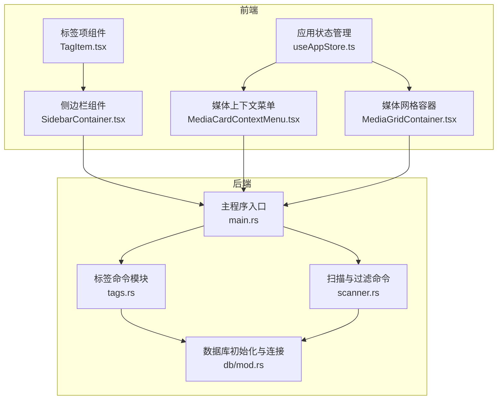
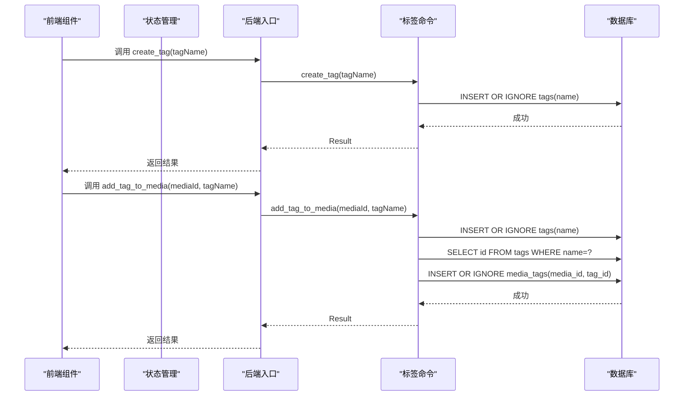
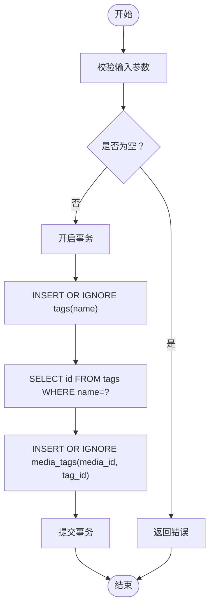
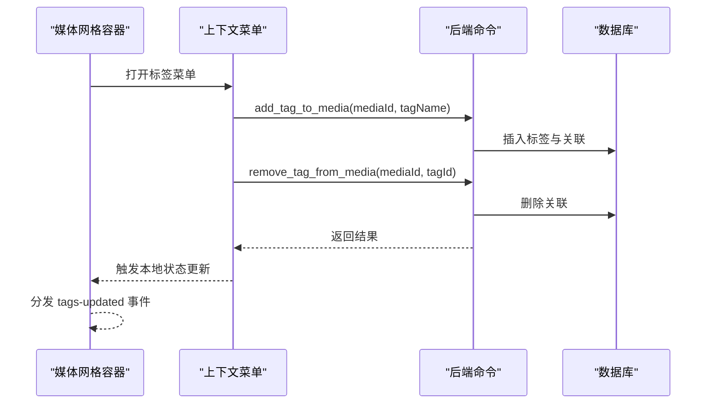
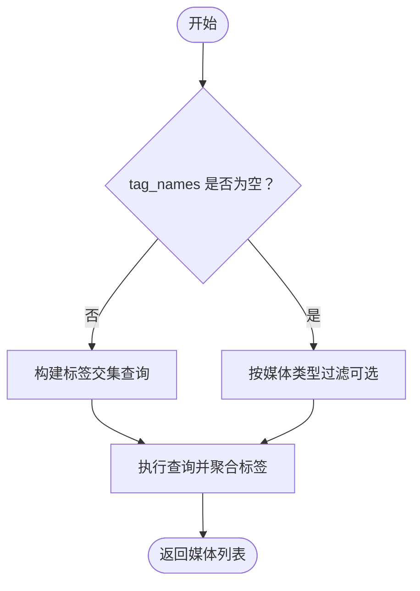
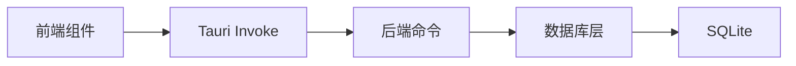

# 标签管理服务

<cite>
**本文档引用的文件**
- [src-tauri/src/services/tags.rs](file://src-tauri/src/services/tags.rs)
- [src-tauri/src/db/mod.rs](file://src-tauri/src/db/mod.rs)
- [src-tauri/src/main.rs](file://src-tauri/src/main.rs)
- [src-tauri/src/services/scanner.rs](file://src-tauri/src/services/scanner.rs)
- [src/components/TagItem.tsx](file://src/components/TagItem.tsx)
- [src/components/MediaCardContextMenu.tsx](file://src/components/MediaCardContextMenu.tsx)
- [src/containers/SidebarContainer.tsx](file://src/containers/SidebarContainer.tsx)
- [src/containers/MediaGridContainer.tsx](file://src/containers/MediaGridContainer.tsx)
- [src/store/useAppStore.ts](file://src/store/useAppStore.ts)
- [API_REFERENCE.md](file://API_REFERENCE.md)
</cite>

## 目录
1. [简介](#简介)
2. [项目结构](#项目结构)
3. [核心组件](#核心组件)
4. [架构总览](#架构总览)
5. [详细组件分析](#详细组件分析)
6. [依赖关系分析](#依赖关系分析)
7. [性能考虑](#性能考虑)
8. [故障排除指南](#故障排除指南)
9. [结论](#结论)
10. [附录](#附录)

## 简介
本文件为 Medex 标签管理服务的详细技术文档，聚焦于标签系统的实现架构与数据模型，涵盖标签树结构与层级关系管理、CRUD 操作、批量标签处理、标签过滤与搜索、冲突处理与重复检测、以及 API 接口与使用示例。文档旨在帮助开发者快速理解并扩展标签功能。

## 项目结构
Medex 的标签系统由前端 UI 组件、状态管理、后端命令与数据库层协同完成。前端通过 Tauri 命令调用后端，后端通过 SQLite 存储标签与媒体的多对多关系。



**图表来源**
- [src-tauri/src/main.rs:10-68](file://src-tauri/src/main.rs#L10-L68)
- [src-tauri/src/services/tags.rs:19-220](file://src-tauri/src/services/tags.rs#L19-L220)
- [src-tauri/src/services/scanner.rs:160-247](file://src-tauri/src/services/scanner.rs#L160-L247)
- [src-tauri/src/db/mod.rs:45-123](file://src-tauri/src/db/mod.rs#L45-L123)

**章节来源**
- [src-tauri/src/main.rs:10-68](file://src-tauri/src/main.rs#L10-L68)
- [src-tauri/src/db/mod.rs:45-123](file://src-tauri/src/db/mod.rs#L45-L123)

## 核心组件
- 标签数据模型
  - Tag：包含 id 与 name 字段，用于表示标签的基本信息。
  - TagWithCount：在 Tag 基础上增加 mediaCount，用于展示标签关联的媒体数量。
- 标签命令
  - 查询：获取所有标签、带计数的标签列表。
  - 创建：插入或忽略重复标签（去重）。
  - 删除：仅在标签未被任何媒体引用时允许删除。
  - 关联：为媒体添加标签或从媒体移除标签；移除时不自动删除标签。
  - 查询媒体标签：根据媒体 id 获取其标签列表。
- 数据库层
  - 表结构：media、tags、media_tags、recent_views。
  - 索引：对 path、media_tags 的 media_id 与 tag_id 建立索引，提升查询性能。
- 前端集成
  - 侧边栏：展示标签列表、计数与删除入口。
  - 上下文菜单：支持标签搜索、批量应用标签。
  - 状态管理：本地维护标签计数与选中状态，配合后端持久化。

**章节来源**
- [src-tauri/src/services/tags.rs:5-17](file://src-tauri/src/services/tags.rs#L5-L17)
- [src-tauri/src/services/tags.rs:19-220](file://src-tauri/src/services/tags.rs#L19-L220)
- [src-tauri/src/db/mod.rs:12-43](file://src-tauri/src/db/mod.rs#L12-L43)
- [src/components/TagItem.tsx:11-70](file://src/components/TagItem.tsx#L11-L70)
- [src/components/MediaCardContextMenu.tsx:23-255](file://src/components/MediaCardContextMenu.tsx#L23-L255)
- [src/containers/SidebarContainer.tsx:7-79](file://src/containers/SidebarContainer.tsx#L7-L79)
- [src/store/useAppStore.ts:9-46](file://src/store/useAppStore.ts#L9-L46)

## 架构总览
标签管理采用前后端分离的命令式调用模式：
- 前端通过 invoke 调用后端命令，命令在后端执行数据库事务与查询。
- 标签与媒体通过中间表 media_tags 建立多对多关系。
- 前端状态管理负责本地 UI 展示与交互，后端负责持久化与一致性保证。



**图表来源**
- [src-tauri/src/main.rs:49-65](file://src-tauri/src/main.rs#L49-L65)
- [src-tauri/src/services/tags.rs:76-164](file://src-tauri/src/services/tags.rs#L76-L164)
- [src-tauri/src/db/mod.rs:97-110](file://src-tauri/src/db/mod.rs#L97-L110)

## 详细组件分析

### 标签数据模型与数据库设计
- 表结构
  - tags：存储标签 id 与唯一 name。
  - media：存储媒体元数据。
  - media_tags：中间表，建立媒体与标签的多对多关系。
  - recent_views：存储最近观看记录。
- 索引
  - 对 media(path)、media_tags(media_id)、media_tags(tag_id) 建立索引，优化查询与关联性能。
- 数据一致性
  - 标签创建使用 INSERT OR IGNORE，避免重复。
  - 删除标签前检查是否被引用，未引用才允许删除。

```mermaid
erDiagram
MEDIA {
integer id PK
text path UK
text filename
text type
integer is_favorite
integer created_at
integer updated_at
}
TAGS {
integer id PK
text name UK
}
MEDIA_TAGS {
integer media_id
integer tag_id
PK media_id, tag_id
}
RECENT_VIEWS {
integer media_id PK
integer viewed_at
}
MEDIA ||--o{ MEDIA_TAGS : "拥有"
TAGS ||--o{ MEDIA_TAGS : "被拥有"
```

**图表来源**
- [src-tauri/src/db/mod.rs:12-43](file://src-tauri/src/db/mod.rs#L12-L43)

**章节来源**
- [src-tauri/src/db/mod.rs:12-43](file://src-tauri/src/db/mod.rs#L12-L43)

### 标签 CRUD 实现细节
- 查询标签
  - get_all_tags：按名称升序返回标签列表。
  - get_all_tags_with_count：按名称升序返回标签及媒体计数。
- 创建标签
  - create_tag：去除空白后若为空则报错；否则 INSERT OR IGNORE，避免重复。
- 删除标签
  - delete_tag：开启事务，先检查是否被媒体引用；若被引用则返回错误；否则删除标签并提交事务。
- 关联标签
  - add_tag_to_media：去除空白后若为空则报错；事务内先插入或忽略标签，再查询标签 id，最后插入或忽略中间表记录。
  - remove_tag_from_media：删除中间表记录；不自动删除标签（即使计数归零）。
- 查询媒体标签
  - get_tags_by_media：返回指定媒体的标签列表。



**图表来源**
- [src-tauri/src/services/tags.rs:127-164](file://src-tauri/src/services/tags.rs#L127-L164)

**章节来源**
- [src-tauri/src/services/tags.rs:19-220](file://src-tauri/src/services/tags.rs#L19-L220)

### 批量标签处理
- 批量应用标签
  - 在媒体网格上下文菜单中，用户可多选媒体并批量添加/移除标签。
  - 后端逐条执行 add_tag_to_media 与 remove_tag_from_media，前端本地同步更新标签计数与 UI。
- 事件驱动刷新
  - 批量操作完成后，前端触发 medex:tags-updated 与 medex:media-tags-updated 事件，通知侧边栏与媒体列表刷新。



**图表来源**
- [src/containers/MediaGridContainer.tsx:144-175](file://src/containers/MediaGridContainer.tsx#L144-L175)
- [src/components/MediaCardContextMenu.tsx:95-132](file://src/components/MediaCardContextMenu.tsx#L95-L132)
- [src-tauri/src/services/tags.rs:127-188](file://src-tauri/src/services/tags.rs#L127-L188)

**章节来源**
- [src/containers/MediaGridContainer.tsx:144-175](file://src/containers/MediaGridContainer.tsx#L144-L175)
- [src/components/MediaCardContextMenu.tsx:95-132](file://src/components/MediaCardContextMenu.tsx#L95-L132)

### 标签过滤机制与搜索算法
- 标签过滤
  - filter_media_by_tags：按标签交集过滤媒体，支持可选的媒体类型过滤。
  - filter_media：综合标签与媒体类型过滤，内部使用子查询与分组聚合，确保交集完全匹配。
- 前端搜索
  - 上下文菜单支持按名称模糊搜索标签，实时筛选候选列表。
- 标签统计
  - get_all_tags_with_count：基于 LEFT JOIN 与 GROUP BY 统计每个标签的媒体数量。



**图表来源**
- [src-tauri/src/services/scanner.rs:165-247](file://src-tauri/src/services/scanner.rs#L165-L247)
- [src/components/MediaCardContextMenu.tsx:169-170](file://src/components/MediaCardContextMenu.tsx#L169-L170)

**章节来源**
- [src-tauri/src/services/scanner.rs:165-247](file://src-tauri/src/services/scanner.rs#L165-L247)
- [src/components/MediaCardContextMenu.tsx:169-170](file://src/components/MediaCardContextMenu.tsx#L169-L170)

### 标签冲突处理与重复检测
- 重复标签检测
  - 标签创建使用 INSERT OR IGNORE，避免重复标签写入。
- 冲突处理
  - 删除标签前检查是否被媒体引用，若仍被引用则拒绝删除并返回错误。
  - 移除标签时仅删除关联记录，不自动删除标签，避免误删。

**章节来源**
- [src-tauri/src/services/tags.rs:76-124](file://src-tauri/src/services/tags.rs#L76-L124)

### 标签继承规则
- 当前实现未提供标签继承规则。标签关系为直接的多对多关联，不存在层级或继承链。
- 如需引入层级结构，可在数据库中增加父标签字段并在查询时递归展开。

## 依赖关系分析
- 前端依赖
  - 通过 @tauri-apps/api 调用后端命令。
  - 使用 Zustand 管理应用状态，本地维护标签计数与选中状态。
- 后端依赖
  - Tauri 命令注册与事件系统。
  - rusqlite 进行数据库操作，with_connection 提供线程安全连接。
- 数据库依赖
  - 通过索引优化查询性能，事务保证一致性。



**图表来源**
- [src-tauri/src/main.rs:49-65](file://src-tauri/src/main.rs#L49-L65)
- [src-tauri/src/db/mod.rs:97-110](file://src-tauri/src/db/mod.rs#L97-L110)

**章节来源**
- [src-tauri/src/main.rs:49-65](file://src-tauri/src/main.rs#L49-L65)
- [src-tauri/src/db/mod.rs:97-110](file://src-tauri/src/db/mod.rs#L97-L110)

## 性能考虑
- 查询优化
  - 为 media(path)、media_tags(media_id)、media_tags(tag_id) 建立索引，减少 JOIN 与过滤成本。
  - 使用 LEFT JOIN 与 GROUP BY 统计标签计数，避免 N+1 查询。
- 批量操作
  - 前端逐条调用后端命令，简单可靠；如需更高性能，可在后端实现批量插入/删除接口。
- 事务使用
  - 关键操作（创建标签、添加/删除关联、删除标签）均使用事务，保证原子性与一致性。
- 前端渲染
  - 上下文菜单对标签进行前端搜索，避免频繁网络请求；媒体列表使用防抖与节流策略。

[本节为通用性能建议，无需特定文件引用]

## 故障排除指南
- 常见错误
  - 标签名为空：创建标签时若去除空白后为空，将返回错误。
  - 标签仍被引用：尝试删除标签时若仍有媒体引用，将返回错误。
  - 无效媒体 ID：上下文菜单应用标签时若媒体 ID 非法，将记录错误并跳过。
- 日志与调试
  - 前端在调用失败时打印错误日志并弹出提示。
  - 后端命令包装错误信息为字符串返回，便于前端展示。
- 事件刷新
  - 批量操作完成后，确保触发 medex:tags-updated 与 medex:media-tags-updated 事件，避免 UI 不一致。

**章节来源**
- [src-tauri/src/services/tags.rs:78-82](file://src-tauri/src/services/tags.rs#L78-L82)
- [src-tauri/src/services/tags.rs:111-113](file://src-tauri/src/services/tags.rs#L111-L113)
- [src/components/MediaCardContextMenu.tsx:100-103](file://src/components/MediaCardContextMenu.tsx#L100-L103)
- [src/containers/MediaGridContainer.tsx:162-172](file://src/containers/MediaGridContainer.tsx#L162-L172)

## 结论
Medex 的标签管理服务通过简洁的命令式接口与可靠的数据库事务，实现了标签的创建、查询、关联与删除。前端提供直观的交互体验，后端保证数据一致性与性能。当前未实现标签层级与继承，后续可根据需求扩展数据库结构与查询逻辑。

## 附录

### API 接口文档
- get_all_tags
  - 返回：按名称排序的标签数组。
- get_all_tags_with_count
  - 返回：包含媒体计数的标签数组。
- create_tag
  - 规则：去除空白后空字符串报错；重复不报错。
- delete_tag
  - 规则：仅当标签未被任何媒体引用时可删除。
- add_tag_to_media
  - 流程：插入或忽略标签 → 查询标签 id → 插入或忽略中间表记录。
- remove_tag_from_media
  - 流程：删除中间表记录；不自动删除标签。
- get_tags_by_media
  - 返回：指定媒体的标签数组。

**章节来源**
- [API_REFERENCE.md:157-252](file://API_REFERENCE.md#L157-L252)

### 使用示例
- 批量标签应用
  - 在媒体网格中右键打开上下文菜单，勾选/取消标签后关闭菜单自动提交。
- 侧边栏标签管理
  - 在侧边栏输入新标签名并点击新增，或在标签项右侧删除按钮删除标签。

**章节来源**
- [src/containers/MediaGridContainer.tsx:144-175](file://src/containers/MediaGridContainer.tsx#L144-L175)
- [src/containers/SidebarContainer.tsx:35-63](file://src/containers/SidebarContainer.tsx#L35-L63)