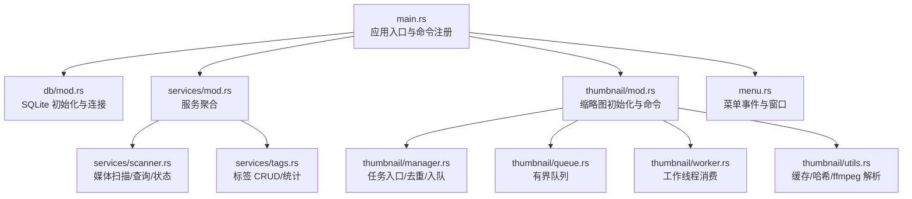
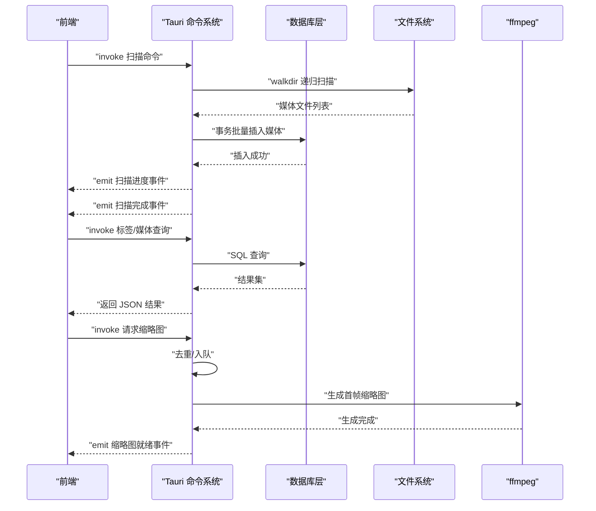
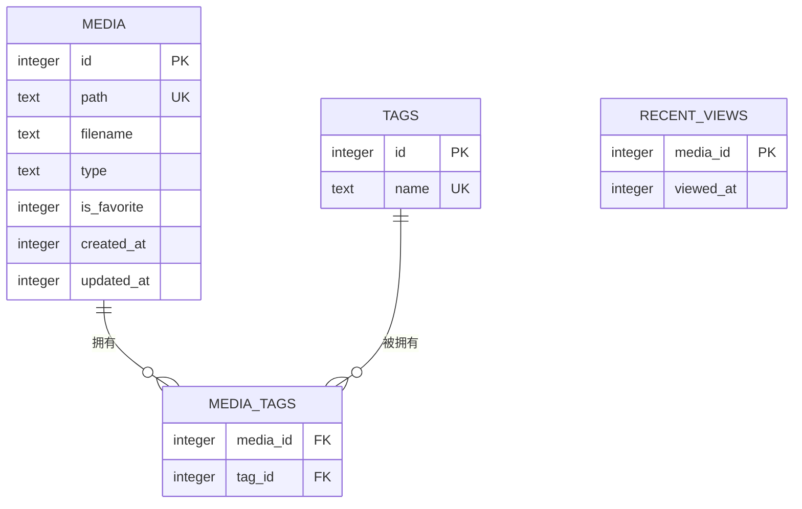
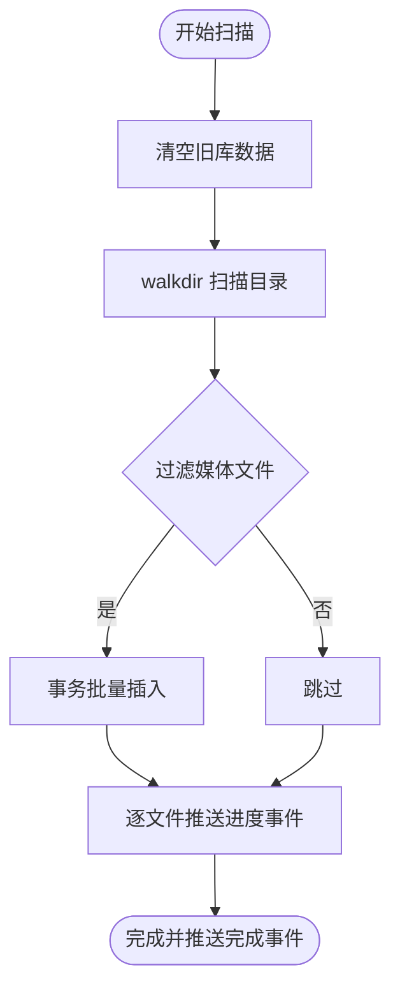
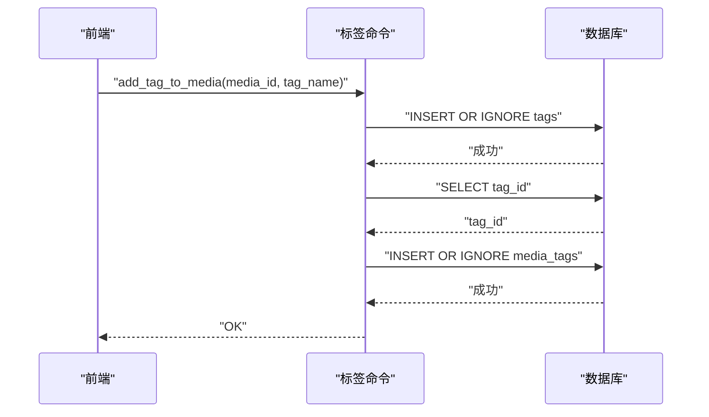
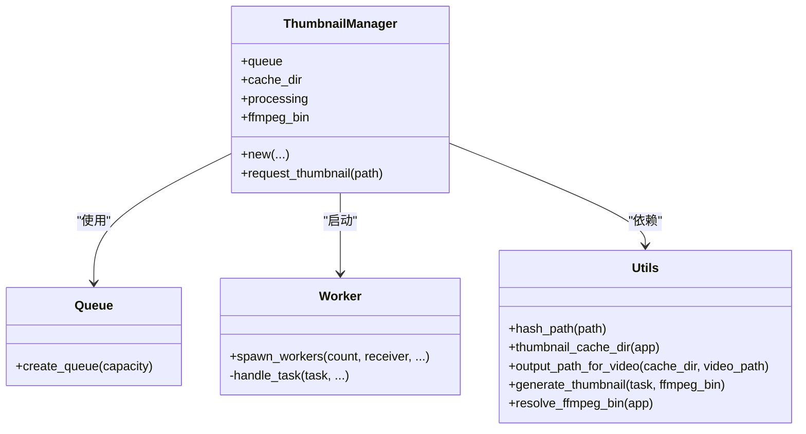
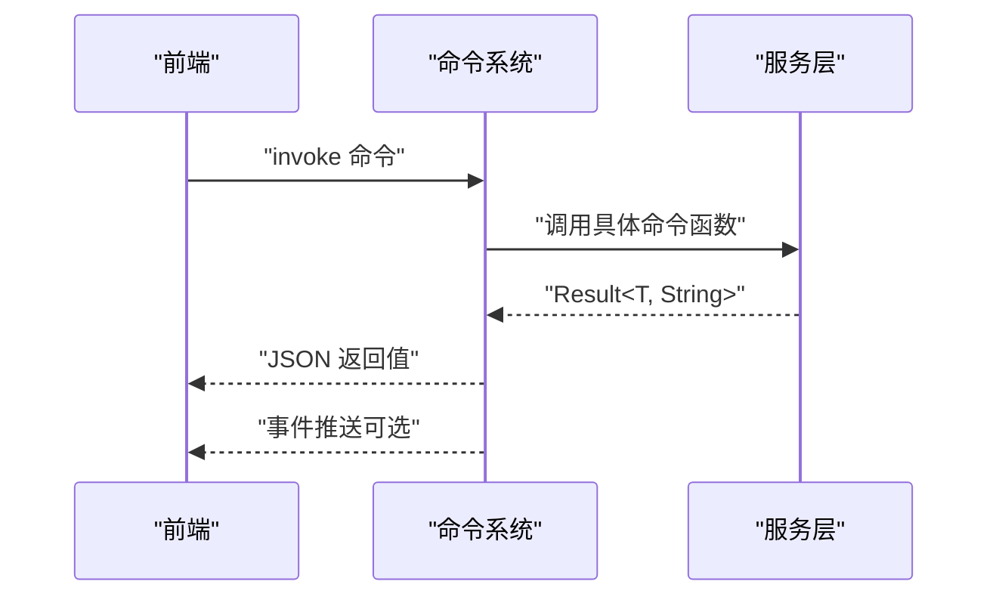
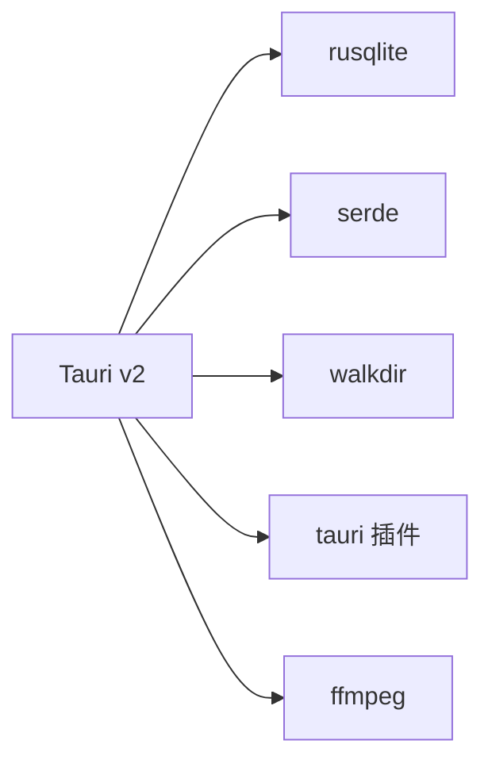

# 后端开发

<cite>
**本文引用的文件**
- [Cargo.toml](file://src-tauri/Cargo.toml)
- [main.rs](file://src-tauri/src/main.rs)
- [tauri.conf.json](file://src-tauri/tauri.conf.json)
- [db/mod.rs](file://src-tauri/src/db/mod.rs)
- [services/mod.rs](file://src-tauri/src/services/mod.rs)
- [services/scanner.rs](file://src-tauri/src/services/scanner.rs)
- [services/tags.rs](file://src-tauri/src/services/tags.rs)
- [thumbnail/mod.rs](file://src-tauri/src/thumbnail/mod.rs)
- [thumbnail/manager.rs](file://src-tauri/src/thumbnail/manager.rs)
- [thumbnail/queue.rs](file://src-tauri/src/thumbnail/queue.rs)
- [thumbnail/utils.rs](file://src-tauri/src/thumbnail/utils.rs)
- [thumbnail/worker.rs](file://src-tauri/src/thumbnail/worker.rs)
- [menu.rs](file://src-tauri/src/menu.rs)
- [README.md](file://README.md)
- [DEVELOPMENT.md](file://DEVELOPMENT.md)
</cite>

## 目录
1. [简介](#简介)
2. [项目结构](#项目结构)
3. [核心组件](#核心组件)
4. [架构总览](#架构总览)
5. [详细组件分析](#详细组件分析)
6. [依赖分析](#依赖分析)
7. [性能考虑](#性能考虑)
8. [故障排查指南](#故障排查指南)
9. [结论](#结论)
10. [附录](#附录)

## 简介
本文件面向 Medex 后端（Rust + Tauri V2）开发者，系统性梳理数据库层、业务服务层（媒体扫描、标签管理、文件处理）、缩略图系统、异步并发模型、Tauri 命令系统、错误处理与性能优化策略。文档以“可读性优先”的方式呈现，既覆盖代码级细节，也提供高层架构图与流程图，帮助不同背景读者快速理解与扩展。

## 项目结构
后端位于 src-tauri 目录，采用模块化分层：
- 入口与插件：main.rs 负责插件初始化、菜单、命令注册与应用生命周期
- 数据层：db/mod.rs 封装 SQLite 初始化、连接池与 DDL/DML
- 业务服务：services/mod.rs 汇总 scanner.rs（媒体扫描/查询）与 tags.rs（标签管理）
- 缩略图系统：thumbnail/... 子模块实现异步队列、工作线程、缓存与生成
- 菜单与窗口：menu.rs 管理菜单事件与设置/更新窗口

图表来源
- [main.rs:11-97](file://src-tauri/src/main.rs#L11-L97)
- [db/mod.rs:45-64](file://src-tauri/src/db/mod.rs#L45-L64)
- [services/mod.rs:1-3](file://src-tauri/src/services/mod.rs#L1-L3)
- [services/scanner.rs:160-163](file://src-tauri/src/services/scanner.rs#L160-L163)
- [services/tags.rs:19-42](file://src-tauri/src/services/tags.rs#L19-L42)
- [thumbnail/mod.rs:32-49](file://src-tauri/src/thumbnail/mod.rs#L32-L49)
- [thumbnail/manager.rs:24-49](file://src-tauri/src/thumbnail/manager.rs#L24-L49)
- [thumbnail/queue.rs:8-11](file://src-tauri/src/thumbnail/queue.rs#L8-L11)
- [thumbnail/worker.rs:13-50](file://src-tauri/src/thumbnail/worker.rs#L13-L50)
- [thumbnail/utils.rs:20-29](file://src-tauri/src/thumbnail/utils.rs#L20-L29)
- [menu.rs:31-51](file://src-tauri/src/menu.rs#L31-L51)

章节来源
- [main.rs:11-97](file://src-tauri/src/main.rs#L11-L97)
- [DEVELOPMENT.md:51-116](file://DEVELOPMENT.md#L51-L116)

## 核心组件
- 数据库层（SQLite）
  - 初始化：在应用启动时解析应用数据目录，创建数据库文件并执行建表/索引脚本
  - 连接：使用 OnceCell + Mutex 包裹 rusqlite 连接，提供 with_connection 闭包式访问
  - 迁移：运行时检测并添加缺失列（如 is_favorite）
- 业务服务层
  - 媒体扫描与索引：walkdir 递归扫描，按扩展名过滤，批量插入，事务提交，进度事件推送
  - 标签管理：标签 CRUD、媒体-标签关系维护、带计数的标签查询
  - 媒体状态：收藏标记、最近查看 upsert 与裁剪
- 缩略图系统
  - 异步队列：有界同步通道，工作线程池消费
  - 去重：处理中集合避免重复入队
  - 缓存：按视频路径哈希命名，缓存目录位于应用数据目录
  - 生成：调用 ffmpeg 截取首帧缩略图
- Tauri 命令系统
  - 命令注册：在 main.rs 中集中注册，前端通过 invoke 调用
  - 参数与返回：命令函数接收 AppHandle（用于事件推送）与参数，返回 Result 包裹业务结果
  - 事件：扫描进度、扫描完成、缩略图生成完成

章节来源
- [db/mod.rs:45-122](file://src-tauri/src/db/mod.rs#L45-L122)
- [services/scanner.rs:54-88](file://src-tauri/src/services/scanner.rs#L54-L88)
- [services/scanner.rs:90-115](file://src-tauri/src/services/scanner.rs#L90-L115)
- [services/scanner.rs:160-163](file://src-tauri/src/services/scanner.rs#L160-L163)
- [services/tags.rs:19-42](file://src-tauri/src/services/tags.rs#L19-L42)
- [thumbnail/mod.rs:32-61](file://src-tauri/src/thumbnail/mod.rs#L32-L61)
- [thumbnail/manager.rs:24-107](file://src-tauri/src/thumbnail/manager.rs#L24-L107)
- [thumbnail/queue.rs:8-11](file://src-tauri/src/thumbnail/queue.rs#L8-L11)
- [thumbnail/worker.rs:13-96](file://src-tauri/src/thumbnail/worker.rs#L13-L96)
- [thumbnail/utils.rs:20-61](file://src-tauri/src/thumbnail/utils.rs#L20-L61)

## 架构总览
后端采用“命令驱动 + 事件推送”的模式：
- 前端通过 Tauri invoke 调用后端命令
- 后端命令在数据库/文件系统/外部进程之间协调
- 后端通过事件向前端推送扫描进度与缩略图生成结果
- 应用生命周期中完成数据库与缩略图系统初始化

图表来源
- [main.rs:78-94](file://src-tauri/src/main.rs#L78-L94)
- [services/scanner.rs:322-413](file://src-tauri/src/services/scanner.rs#L322-L413)
- [services/scanner.rs:160-163](file://src-tauri/src/services/scanner.rs#L160-L163)
- [services/tags.rs:19-42](file://src-tauri/src/services/tags.rs#L19-L42)
- [thumbnail/mod.rs:57-61](file://src-tauri/src/thumbnail/mod.rs#L57-L61)
- [thumbnail/manager.rs:51-106](file://src-tauri/src/thumbnail/manager.rs#L51-L106)
- [thumbnail/utils.rs:36-61](file://src-tauri/src/thumbnail/utils.rs#L36-L61)

## 详细组件分析

### 数据库层（SQLite）
- 初始化与连接
  - 解析应用数据目录，创建数据库文件与目录
  - 执行建表/索引脚本，确保必要列存在（如 is_favorite）
  - 提供 with_connection 闭包，统一加锁访问
- 数据模型与索引
  - 媒体表：主键、唯一路径、类型、收藏、时间戳
  - 标签表：唯一名称
  - 关系表：媒体-标签多对多
  - 最近查看表：按时间倒序索引，便于裁剪
- 查询优化
  - 使用事务批量插入，减少 IO
  - 为高频查询字段建立索引
  - 使用 GROUP_CONCAT 与 LEFT JOIN 一次性拼接标签字符串

图表来源
- [db/mod.rs:12-43](file://src-tauri/src/db/mod.rs#L12-L43)

章节来源
- [db/mod.rs:45-122](file://src-tauri/src/db/mod.rs#L45-L122)
- [DEVELOPMENT.md:159-204](file://DEVELOPMENT.md#L159-L204)

### 媒体扫描服务
- 扫描与过滤
  - walkdir 递归遍历，按扩展名过滤图片/视频
  - 插入时使用 INSERT OR IGNORE 防止重复
  - 事务包裹批量写入，提升吞吐
- 查询与筛选
  - 全量查询：LEFT JOIN 近期查看与标签，GROUP_CONCAT 拼接标签
  - 多标签交集筛选：子查询 + HAVING COUNT(DISTINCT tag_id) = 选中数量
  - 媒体类型过滤：支持 image/video/all
- 状态管理
  - 收藏：更新 is_favorite 与 updated_at
  - 最近查看：upsert 近期记录并裁剪至 100 条
- 自动扫描
  - 应用启动后读取设置，若启用则执行扫描

图表来源
- [services/scanner.rs:249-319](file://src-tauri/src/services/scanner.rs#L249-L319)
- [services/scanner.rs:322-413](file://src-tauri/src/services/scanner.rs#L322-L413)

章节来源
- [services/scanner.rs:54-88](file://src-tauri/src/services/scanner.rs#L54-L88)
- [services/scanner.rs:90-115](file://src-tauri/src/services/scanner.rs#L90-L115)
- [services/scanner.rs:117-158](file://src-tauri/src/services/scanner.rs#L117-L158)
- [services/scanner.rs:170-247](file://src-tauri/src/services/scanner.rs#L170-L247)
- [services/scanner.rs:415-461](file://src-tauri/src/services/scanner.rs#L415-L461)
- [services/scanner.rs:547-596](file://src-tauri/src/services/scanner.rs#L547-L596)

### 标签管理服务
- 标签 CRUD
  - 新增：INSERT OR IGNORE，去空白
  - 删除：检查使用后再删除
- 关系维护
  - 给媒体加标签：先保证标签存在，再建立关系
  - 从媒体移除标签：仅删除关系，不自动删除标签
- 统计查询
  - 带计数的标签查询：LEFT JOIN 统计使用次数

图表来源
- [services/tags.rs:127-164](file://src-tauri/src/services/tags.rs#L127-L164)

章节来源
- [services/tags.rs:19-42](file://src-tauri/src/services/tags.rs#L19-L42)
- [services/tags.rs:95-124](file://src-tauri/src/services/tags.rs#L95-L124)
- [services/tags.rs:166-188](file://src-tauri/src/services/tags.rs#L166-L188)
- [services/tags.rs:190-219](file://src-tauri/src/services/tags.rs#L190-L219)

### 缩略图系统
- 架构组成
  - 管理器：负责去重、入队、缓存目录与 ffmpeg 解析
  - 队列：有界同步通道
  - 工作线程：固定数量工作线程循环消费
  - 工具：哈希、缓存路径、ffmpeg 调用与二进制解析
- 并发与缓存
  - 去重集合防止重复任务
  - 缓存目录按哈希命名，命中直接返回
  - 队列满时返回占位符，避免阻塞
- 生成算法
  - 使用 ffmpeg 截取第 1 秒首帧，缩放至指定宽度，输出 JPG

图表来源
- [thumbnail/manager.rs:16-107](file://src-tauri/src/thumbnail/manager.rs#L16-L107)
- [thumbnail/queue.rs:8-11](file://src-tauri/src/thumbnail/queue.rs#L8-L11)
- [thumbnail/worker.rs:13-96](file://src-tauri/src/thumbnail/worker.rs#L13-L96)
- [thumbnail/utils.rs:14-96](file://src-tauri/src/thumbnail/utils.rs#L14-L96)

章节来源
- [thumbnail/mod.rs:32-61](file://src-tauri/src/thumbnail/mod.rs#L32-L61)
- [thumbnail/manager.rs:24-107](file://src-tauri/src/thumbnail/manager.rs#L24-L107)
- [thumbnail/queue.rs:8-11](file://src-tauri/src/thumbnail/queue.rs#L8-L11)
- [thumbnail/worker.rs:13-96](file://src-tauri/src/thumbnail/worker.rs#L13-L96)
- [thumbnail/utils.rs:20-61](file://src-tauri/src/thumbnail/utils.rs#L20-L61)

### Tauri 命令系统
- 注册
  - 在 main.rs 中集中注册命令，涵盖扫描、查询、标签与缩略图
- 参数与返回
  - 命令函数接收 AppHandle（用于事件推送）与参数，返回 Result
  - 前端通过 invoke 调用，后端返回 JSON 序列化结果
- 事件
  - 扫描：scan_progress、scan_done
  - 缩略图：thumbnail_ready

图表来源
- [main.rs:78-94](file://src-tauri/src/main.rs#L78-L94)
- [services/scanner.rs:160-163](file://src-tauri/src/services/scanner.rs#L160-L163)
- [services/tags.rs:19-42](file://src-tauri/src/services/tags.rs#L19-L42)
- [thumbnail/mod.rs:57-61](file://src-tauri/src/thumbnail/mod.rs#L57-L61)

章节来源
- [main.rs:78-94](file://src-tauri/src/main.rs#L78-L94)
- [DEVELOPMENT.md:207-234](file://DEVELOPMENT.md#L207-L234)

## 依赖分析
- Rust 生态
  - Tauri v2：桌面应用框架与命令系统
  - rusqlite：SQLite 访问与事务
  - walkdir：目录扫描
  - serde：序列化
  - once_cell：全局单例
  - anyhow：错误处理
- 外部依赖
  - ffmpeg：视频首帧缩略图生成

图表来源
- [Cargo.toml:13-24](file://src-tauri/Cargo.toml#L13-L24)

章节来源
- [Cargo.toml:13-24](file://src-tauri/Cargo.toml#L13-L24)
- [DEVELOPMENT.md:44-48](file://DEVELOPMENT.md#L44-L48)

## 性能考虑
- 数据库
  - 事务批量插入，减少磁盘写放大
  - 为高频查询字段建立索引，避免全表扫描
  - 使用 GROUP_CONCAT 与 JOIN 一次性拼接标签，减少往返
- 缩略图
  - 固定工作线程数与有界队列，控制并发与内存占用
  - 哈希缓存命中直接返回，避免重复生成
  - 队列满时返回占位符，保障 UI 流畅
- 异步与并发
  - 使用 OnceCell + Mutex 管理共享连接，避免竞争
  - 工作线程独立消费，避免阻塞主线程
- 前端配合
  - 开发文档建议前端采用虚拟列表与缩略图懒加载，减少 DOM 与网络请求

章节来源
- [db/mod.rs:97-110](file://src-tauri/src/db/mod.rs#L97-L110)
- [thumbnail/manager.rs:51-106](file://src-tauri/src/thumbnail/manager.rs#L51-L106)
- [thumbnail/queue.rs:8-11](file://src-tauri/src/thumbnail/queue.rs#L8-L11)
- [thumbnail/utils.rs:36-61](file://src-tauri/src/thumbnail/utils.rs#L36-L61)
- [DEVELOPMENT.md:306-341](file://DEVELOPMENT.md#L306-L341)

## 故障排查指南
- 数据库未初始化
  - 现象：命令执行报“数据库未初始化”
  - 排查：确认应用启动阶段已调用 init_db，检查应用数据目录权限
- ffmpeg 未找到
  - 现象：缩略图请求返回错误或一直占位
  - 排查：确认内置二进制或系统 PATH 是否可用；参考 ffmpeg 解析策略
- 事件未送达
  - 现象：前端未收到 scan_progress 或 thumbnail_ready
  - 排查：确认命令已注册、事件监听已建立、AppHandle 有效
- 权限与资源协议
  - 现象：本地文件无法预览
  - 排查：确认 tauri.conf.json 中 assetProtocol 已启用

章节来源
- [db/mod.rs:45-64](file://src-tauri/src/db/mod.rs#L45-L64)
- [thumbnail/utils.rs:71-96](file://src-tauri/src/thumbnail/utils.rs#L71-L96)
- [thumbnail/manager.rs:51-106](file://src-tauri/src/thumbnail/manager.rs#L51-L106)
- [tauri.conf.json:21-27](file://src-tauri/tauri.conf.json#L21-L27)

## 结论
Medex 后端以 Tauri V2 + Rust + SQLite 为基础，围绕“命令 + 事件”的交互模式构建了媒体扫描、标签管理与缩略图生成的完整能力。数据库层通过事务与索引保障性能，缩略图系统通过队列与工作线程实现高并发与缓存命中，命令系统提供简洁稳定的前后端接口。整体架构清晰、扩展性强，适合进一步增强批处理、搜索与分页等能力。

## 附录
- 开发与运行
  - 前端开发：npm run dev
  - 完整开发：npm run tauri dev
  - 构建：npm run build && npm run tauri build
- 目录与文件索引
  - 前端入口：src/App.tsx
  - 主布局：src/components/Main.tsx
  - 媒体网格：src/components/MediaGrid.tsx
  - 网格容器：src/containers/MediaGridContainer.tsx
  - 顶栏容器：src/containers/ToolbarContainer.tsx
  - 侧栏容器：src/containers/SidebarContainer.tsx
  - 全局状态：src/store/useAppStore.ts
  - DB 初始化：src-tauri/src/db/mod.rs
  - 媒体服务：src-tauri/src/services/scanner.rs
  - 标签服务：src-tauri/src/services/tags.rs
  - 缩略图系统：src-tauri/src/thumbnail/*
  - Tauri 命令注册：src-tauri/src/main.rs

章节来源
- [README.md:50-94](file://README.md#L50-L94)
- [DEVELOPMENT.md:620-636](file://DEVELOPMENT.md#L620-L636)