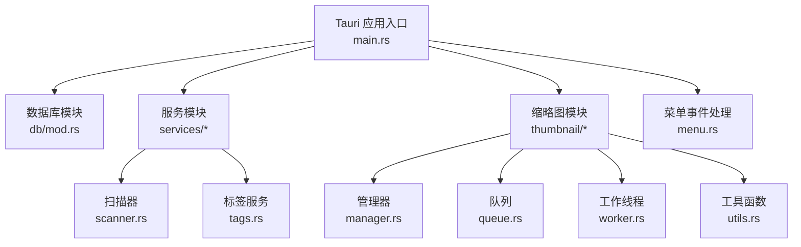
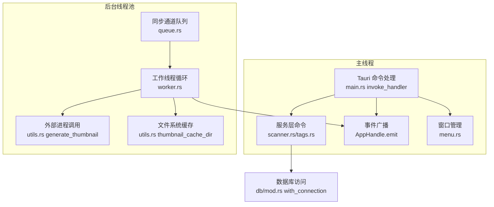
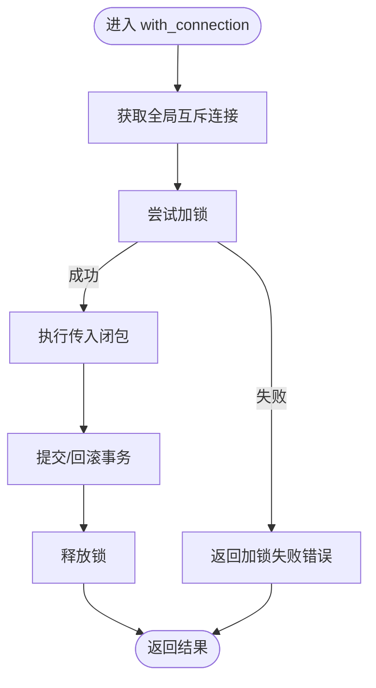
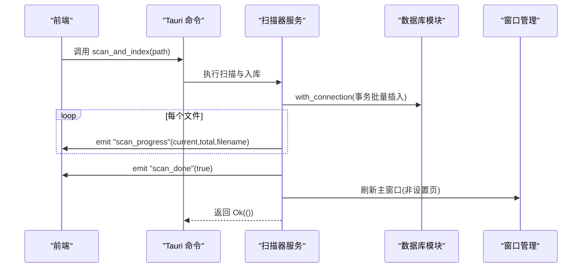
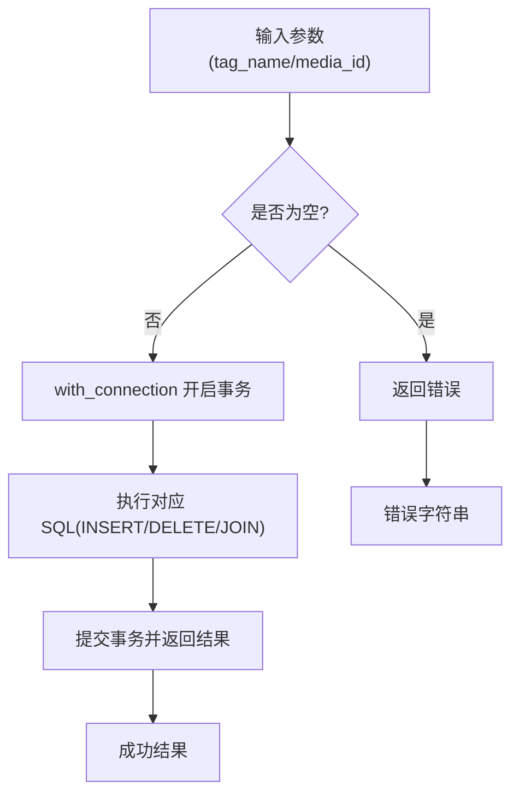
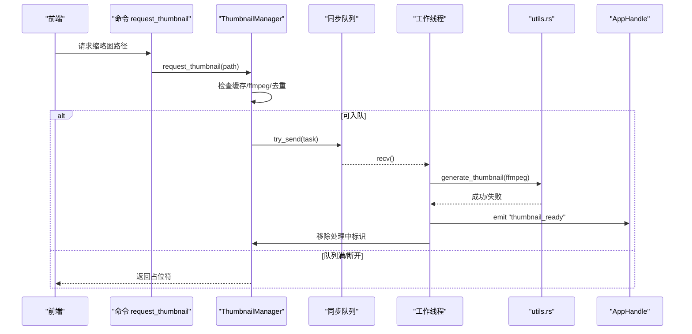
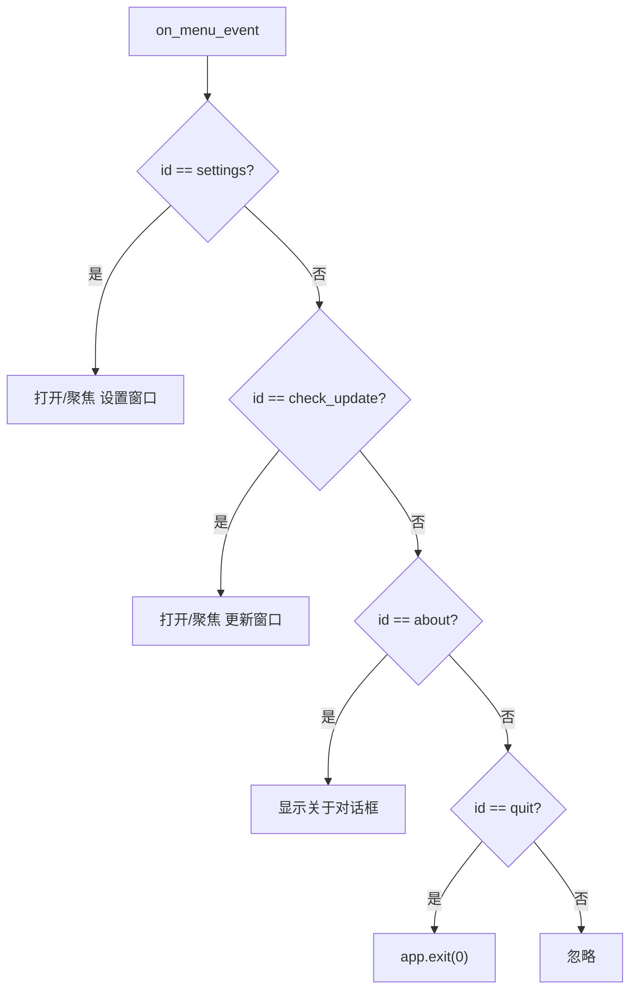
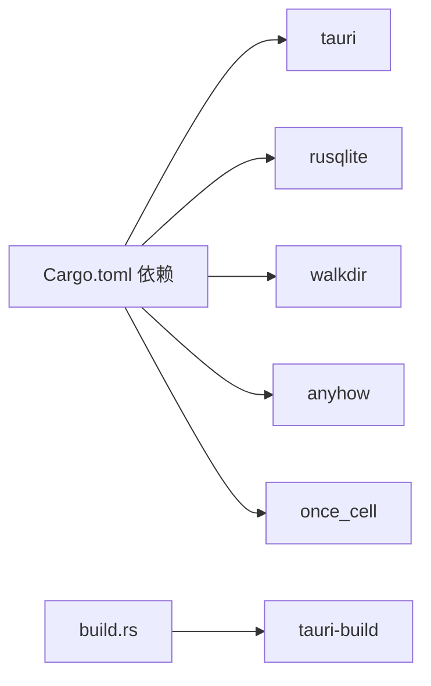

# 异步编程与并发

<cite>
**本文引用的文件**
- [Cargo.toml](file://src-tauri/Cargo.toml)
- [main.rs](file://src-tauri/src/main.rs)
- [mod.rs](file://src-tauri/src/db/mod.rs)
- [scanner.rs](file://src-tauri/src/services/scanner.rs)
- [tags.rs](file://src-tauri/src/services/tags.rs)
- [manager.rs](file://src-tauri/src/thumbnail/manager.rs)
- [queue.rs](file://src-tauri/src/thumbnail/queue.rs)
- [worker.rs](file://src-tauri/src/thumbnail/worker.rs)
- [utils.rs](file://src-tauri/src/thumbnail/utils.rs)
- [menu.rs](file://src-tauri/src/menu.rs)
- [.cargo/config.toml](file://src-tauri/.cargo/config.toml)
- [build.rs](file://src-tauri/build.rs)
</cite>

## 目录
1. [简介](#简介)
2. [项目结构](#项目结构)
3. [核心组件](#核心组件)
4. [架构总览](#架构总览)
5. [详细组件分析](#详细组件分析)
6. [依赖关系分析](#依赖关系分析)
7. [性能考虑](#性能考虑)
8. [故障排查指南](#故障排查指南)
9. [结论](#结论)
10. [附录](#附录)

## 简介
本文件面向 Medex 的异步编程与并发处理，聚焦于 Rust 异步模型在 Tauri 应用中的落地方式。当前代码库未直接使用 tokio 运行时或 async/await 语法；其并发策略主要基于：
- Tauri 默认运行时（主线程承载 UI 与命令处理）
- 后台线程池（通过标准库线程与同步通道实现）
- 数据库连接串行化访问（通过互斥锁保护）

本文将系统梳理：
- 并发策略与线程模型
- 任务调度与队列机制
- 异步 I/O 实现（文件系统、外部进程、数据库）
- 内存管理、资源清理与生命周期
- 错误传播、异常处理与优雅关闭
- 性能监控、调试技巧与最佳实践
- 与前端的事件通信模式

## 项目结构
后端以 Tauri 插件与命令为中心，服务层模块化组织，缩略图子系统独立实现后台工作线程池。

图表来源
- [main.rs:10-69](file://src-tauri/src/main.rs#L10-L69)
- [mod.rs:1-123](file://src-tauri/src/db/mod.rs#L1-L123)
- [scanner.rs:1-525](file://src-tauri/src/services/scanner.rs#L1-L525)
- [tags.rs:1-220](file://src-tauri/src/services/tags.rs#L1-L220)
- [manager.rs:1-108](file://src-tauri/src/thumbnail/manager.rs#L1-L108)
- [queue.rs:1-12](file://src-tauri/src/thumbnail/queue.rs#L1-L12)
- [worker.rs:1-96](file://src-tauri/src/thumbnail/worker.rs#L1-L96)
- [utils.rs:1-158](file://src-tauri/src/thumbnail/utils.rs#L1-L158)
- [menu.rs:1-52](file://src-tauri/src/menu.rs#L1-L52)

章节来源
- [main.rs:10-69](file://src-tauri/src/main.rs#L10-L69)
- [Cargo.toml:13-23](file://src-tauri/Cargo.toml#L13-L23)

## 核心组件
- 数据库模块：负责 SQLite 初始化、表结构迁移、连接池化（互斥锁包裹单连接）与事务封装。
- 扫描器服务：文件系统遍历、批量入库、进度事件推送、收藏与最近观看标记。
- 标签服务：标签 CRUD、关联查询与计数统计。
- 缩略图子系统：基于多线程工作池的视频缩略图生成，支持队列容量控制与占位符返回。
- 菜单与窗口：菜单事件到窗口打开的桥接逻辑。

章节来源
- [mod.rs:45-123](file://src-tauri/src/db/mod.rs#L45-L123)
- [scanner.rs:160-341](file://src-tauri/src/services/scanner.rs#L160-L341)
- [tags.rs:19-220](file://src-tauri/src/services/tags.rs#L19-L220)
- [manager.rs:24-108](file://src-tauri/src/thumbnail/manager.rs#L24-L108)
- [menu.rs:31-51](file://src-tauri/src/menu.rs#L31-L51)

## 架构总览
Tauri 应用采用“主线程 + 后台线程池”的混合并发模型：
- 主线程负责 UI、菜单事件、命令处理与事件广播
- 后台线程池负责 I/O 密集型任务（文件扫描、缩略图生成）
- 数据库访问通过互斥锁串行化，避免并发写入竞争

图表来源
- [main.rs:49-65](file://src-tauri/src/main.rs#L49-L65)
- [scanner.rs:306-329](file://src-tauri/src/services/scanner.rs#L306-L329)
- [queue.rs:8-11](file://src-tauri/src/thumbnail/queue.rs#L8-L11)
- [worker.rs:26-50](file://src-tauri/src/thumbnail/worker.rs#L26-L50)
- [utils.rs:36-61](file://src-tauri/src/thumbnail/utils.rs#L36-L61)
- [utils.rs:20-29](file://src-tauri/src/thumbnail/utils.rs#L20-L29)
- [mod.rs:97-110](file://src-tauri/src/db/mod.rs#L97-L110)

## 详细组件分析

### 数据库并发与事务封装
- 单连接串行化：通过 OnceCell 保存 Mutex 包裹的 rusqlite 连接，确保并发安全。
- 事务封装：批量插入与复杂查询均在事务内执行，减少锁竞争与 WAL 压力。
- 迁移与索引：启动时初始化表结构与索引，保证查询效率。

图表来源
- [mod.rs:97-110](file://src-tauri/src/db/mod.rs#L97-L110)

章节来源
- [mod.rs:45-123](file://src-tauri/src/db/mod.rs#L45-L123)

### 文件扫描与进度事件
- 遍历策略：使用 walkdir 遍历目录，过滤媒体类型，构建批量插入列表。
- 批量入库：事务内批量插入，显著降低 I/O 次数。
- 进度事件：逐条插入时向前端广播 scan_progress，完成后广播 scan_done。
- 清理流程：支持清空媒体库并刷新主窗口。

图表来源
- [scanner.rs:250-341](file://src-tauri/src/services/scanner.rs#L250-L341)
- [scanner.rs:306-329](file://src-tauri/src/services/scanner.rs#L306-L329)
- [scanner.rs:475-525](file://src-tauri/src/services/scanner.rs#L475-L525)

章节来源
- [scanner.rs:54-88](file://src-tauri/src/services/scanner.rs#L54-L88)
- [scanner.rs:90-115](file://src-tauri/src/services/scanner.rs#L90-L115)
- [scanner.rs:160-163](file://src-tauri/src/services/scanner.rs#L160-L163)
- [scanner.rs:170-247](file://src-tauri/src/services/scanner.rs#L170-L247)

### 标签服务与查询优化
- 标签 CRUD：创建、删除、添加/移除标签到媒体。
- 统计查询：按标签统计媒体数量，支持分组聚合。
- 关联查询：通过 JOIN 获取媒体的标签集合，序列化传输给前端。

图表来源
- [tags.rs:77-93](file://src-tauri/src/services/tags.rs#L77-L93)
- [tags.rs:127-164](file://src-tauri/src/services/tags.rs#L127-L164)
- [tags.rs:191-219](file://src-tauri/src/services/tags.rs#L191-L219)

章节来源
- [tags.rs:19-74](file://src-tauri/src/services/tags.rs#L19-L74)
- [tags.rs:95-124](file://src-tauri/src/services/tags.rs#L95-L124)
- [tags.rs:166-188](file://src-tauri/src/services/tags.rs#L166-L188)

### 缩略图生成：线程池与队列
- 线程池：创建固定数量的工作线程，从同步通道接收任务。
- 队列：有界同步通道，满载时拒绝新任务并返回占位符。
- 处理流程：去重处理中集合、检查缓存、调用 ffmpeg 生成、事件通知。
- 容错：ffmpeg 不存在或生成失败时记录日志并清理处理状态。

图表来源
- [manager.rs:51-106](file://src-tauri/src/thumbnail/manager.rs#L51-L106)
- [queue.rs:8-11](file://src-tauri/src/thumbnail/queue.rs#L8-L11)
- [worker.rs:26-50](file://src-tauri/src/thumbnail/worker.rs#L26-L50)
- [worker.rs:52-79](file://src-tauri/src/thumbnail/worker.rs#L52-L79)
- [utils.rs:36-61](file://src-tauri/src/thumbnail/utils.rs#L36-L61)

章节来源
- [manager.rs:24-49](file://src-tauri/src/thumbnail/manager.rs#L24-L49)
- [queue.rs:8-11](file://src-tauri/src/thumbnail/queue.rs#L8-L11)
- [worker.rs:13-50](file://src-tauri/src/thumbnail/worker.rs#L13-L50)
- [utils.rs:71-96](file://src-tauri/src/thumbnail/utils.rs#L71-L96)

### 菜单事件与窗口管理
- 菜单事件监听：在 setup 中注册菜单回调。
- 窗口打开：根据窗口 ID 复用或新建设置/更新窗口。
- 退出应用：调用 app.exit 触发优雅关闭。

图表来源
- [main.rs:42-45](file://src-tauri/src/main.rs#L42-L45)
- [menu.rs:31-51](file://src-tauri/src/menu.rs#L31-L51)

章节来源
- [main.rs:10-69](file://src-tauri/src/main.rs#L10-L69)
- [menu.rs:1-52](file://src-tauri/src/menu.rs#L1-L52)

## 依赖关系分析
- 运行时与插件：Tauri 默认运行时承载命令与事件；dialog/updater 插件提供系统级能力。
- 外部依赖：rusqlite（SQLite）、walkdir（文件遍历）、anyhow（错误处理）、once_cell（单例）。
- 构建配置：通过 .cargo/config.toml 使用镜像源加速 crates.io 访问。

图表来源
- [Cargo.toml:13-23](file://src-tauri/Cargo.toml#L13-L23)
- [build.rs:1-4](file://src-tauri/build.rs#L1-L4)
- [.cargo/config.toml:1-5](file://src-tauri/.cargo/config.toml#L1-L5)

章节来源
- [Cargo.toml:13-23](file://src-tauri/Cargo.toml#L13-L23)
- [build.rs:1-4](file://src-tauri/build.rs#L1-L4)
- [.cargo/config.toml:1-5](file://src-tauri/.cargo/config.toml#L1-L5)

## 性能考虑
- 数据库
  - 批量插入使用事务，显著降低磁盘写入次数。
  - 索引建立在常用查询字段上，提升 JOIN 与排序性能。
- 文件系统
  - 使用同步通道限制队列长度，防止内存膨胀。
  - 生成前先检查缓存，避免重复计算。
- 外部进程
  - ffmpeg 查找优先级：资源目录 > 开发目录 > PATH > Homebrew 路径，减少启动失败。
- 并发
  - 工作线程数固定，避免过多上下文切换。
  - 互斥锁保护处理中集合，避免重复任务。
- 前端事件
  - 进度事件按文件粒度发送，避免一次性大量消息导致 UI 卡顿。

章节来源
- [scanner.rs:90-115](file://src-tauri/src/services/scanner.rs#L90-L115)
- [scanner.rs:306-329](file://src-tauri/src/services/scanner.rs#L306-L329)
- [manager.rs:51-106](file://src-tauri/src/thumbnail/manager.rs#L51-L106)
- [utils.rs:20-29](file://src-tauri/src/thumbnail/utils.rs#L20-L29)
- [utils.rs:71-96](file://src-tauri/src/thumbnail/utils.rs#L71-L96)

## 故障排查指南
- 数据库初始化失败
  - 检查应用数据目录可写性与路径解析。
  - 确认表结构初始化 SQL 正确执行。
- 数据库连接加锁失败
  - 排查并发访问是否正确使用 with_connection。
- 扫描进度不更新
  - 确认事件广播调用成功且前端监听正常。
- 缩略图生成失败
  - 检查 ffmpeg 是否可用与路径解析。
  - 查看队列是否已满导致任务被丢弃。
- 窗口无法打开
  - 确认窗口 ID 未被占用且 URL 正确。
- 退出无响应
  - 检查是否存在阻塞线程或未关闭的句柄。

章节来源
- [mod.rs:45-64](file://src-tauri/src/db/mod.rs#L45-L64)
- [scanner.rs:306-329](file://src-tauri/src/services/scanner.rs#L306-L329)
- [manager.rs:83-103](file://src-tauri/src/thumbnail/manager.rs#L83-L103)
- [utils.rs:36-61](file://src-tauri/src/thumbnail/utils.rs#L36-L61)
- [menu.rs:31-51](file://src-tauri/src/menu.rs#L31-L51)

## 结论
Medex 当前采用“主线程 + 后台线程池”的混合并发模型，结合 Tauri 命令与事件机制，实现了稳定的文件扫描、数据库访问与缩略图生成能力。虽然未使用 tokio 或 async/await，但通过同步通道与互斥锁保障了线程安全与性能平衡。后续如需扩展高并发场景，可在保持 UI 线程安全的前提下引入 tokio 运行时与异步 I/O，同时注意与 Tauri 命令系统的兼容性。

## 附录
- 最佳实践
  - 将 CPU 密集型任务放入后台线程池，UI 与命令处理保持在主线程。
  - 对外设/网络等异步 I/O 使用异步运行时时，确保与 Tauri 的事件系统解耦。
  - 使用 once_cell 管理全局单例，避免重复初始化。
  - 在命令处理中统一错误转换为字符串，便于前端处理。
- 调试建议
  - 为关键路径增加日志输出，定位阻塞点。
  - 使用队列容量与处理中集合控制任务并发度。
  - 对数据库事务进行单元测试，覆盖边界条件。