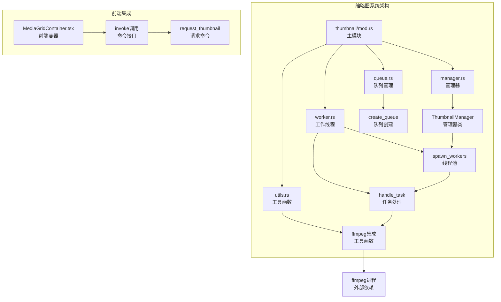
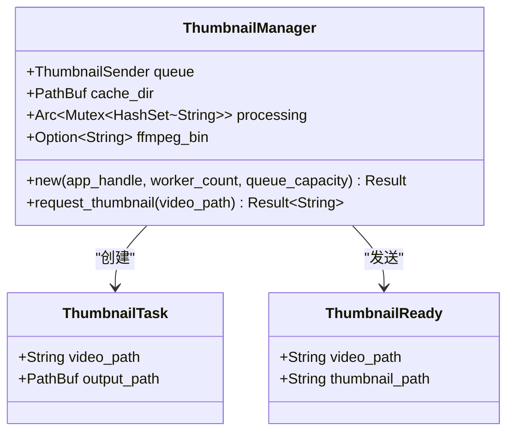
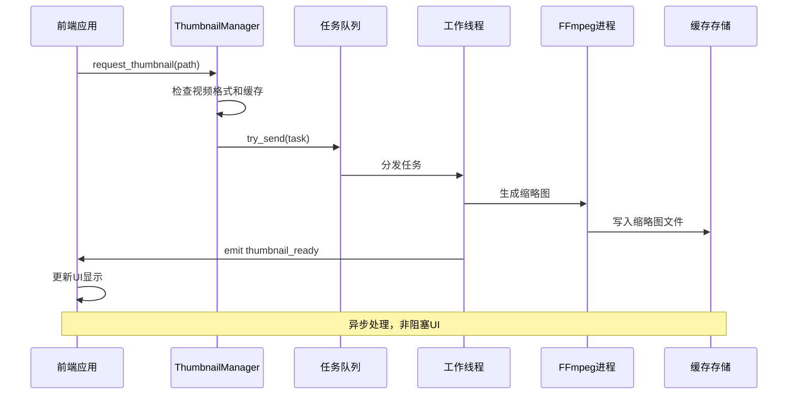
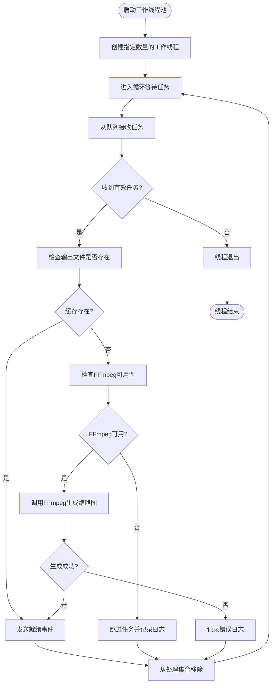
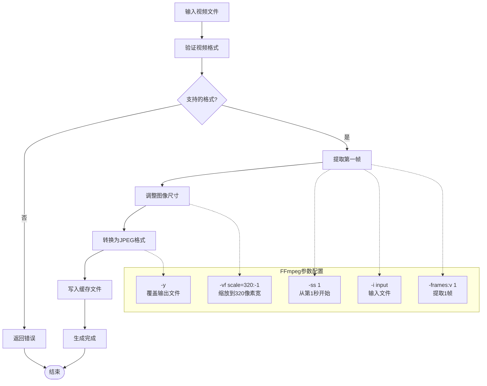
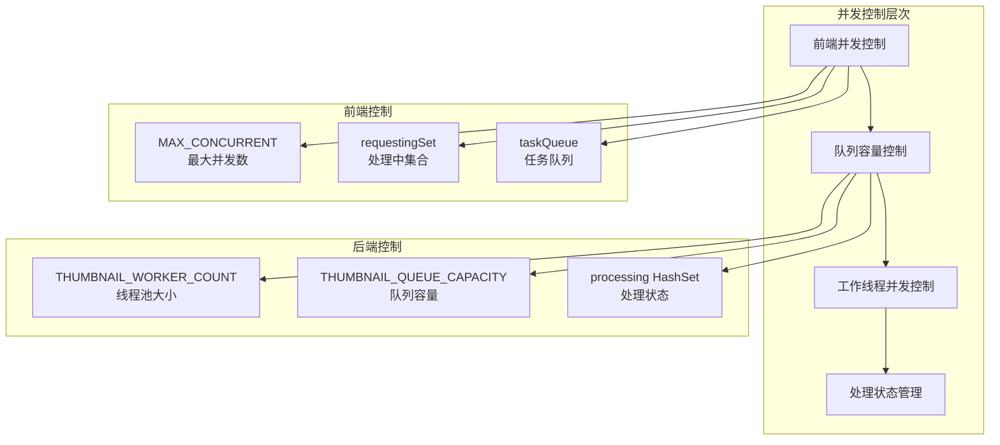
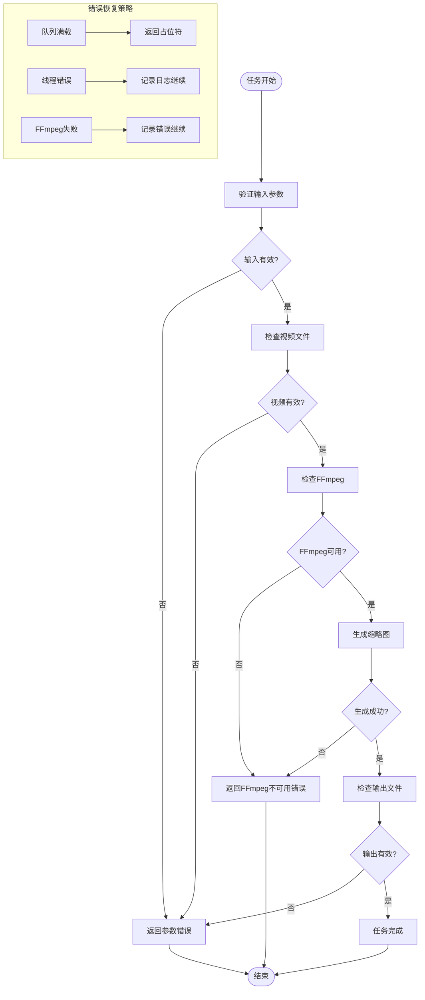
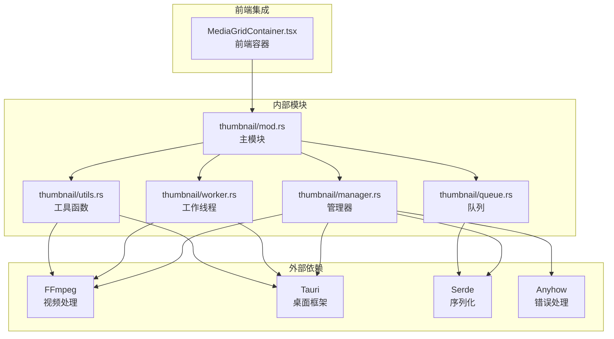

# 缩略图工作线程

<cite>
**本文档引用的文件**
- [src-tauri/src/thumbnail/mod.rs](file://src-tauri/src/thumbnail/mod.rs)
- [src-tauri/src/thumbnail/worker.rs](file://src-tauri/src/thumbnail/worker.rs)
- [src-tauri/src/thumbnail/manager.rs](file://src-tauri/src/thumbnail/manager.rs)
- [src-tauri/src/thumbnail/queue.rs](file://src-tauri/src/thumbnail/queue.rs)
- [src-tauri/src/thumbnail/utils.rs](file://src-tauri/src/thumbnail/utils.rs)
- [src-tauri/src/main.rs](file://src-tauri/src/main.rs)
- [src/containers/MediaGridContainer.tsx](file://src/containers/MediaGridContainer.tsx)
</cite>

## 目录
1. [简介](#简介)
2. [项目结构](#项目结构)
3. [核心组件](#核心组件)
4. [架构概览](#架构概览)
5. [详细组件分析](#详细组件分析)
6. [依赖关系分析](#依赖关系分析)
7. [性能考虑](#性能考虑)
8. [故障排除指南](#故障排除指南)
9. [结论](#结论)

## 简介

缩略图工作线程是 Medex 多媒体管理应用中的关键组件，负责高效地生成和缓存视频文件的缩略图。该系统采用多线程架构，通过工作线程池并发处理缩略图生成请求，结合队列管理和缓存机制，确保在大量媒体文件场景下的流畅性能表现。

系统的核心目标是在保证缩略图质量的同时，最大化并发处理能力和资源利用率，为用户提供快速响应的媒体浏览体验。

## 项目结构

缩略图系统位于 Rust 后端的 `src-tauri/src/thumbnail/` 目录下，采用模块化设计，包含以下核心文件：

**图表来源**
- [src-tauri/src/thumbnail/mod.rs:1-62](file://src-tauri/src/thumbnail/mod.rs#L1-L62)
- [src-tauri/src/thumbnail/manager.rs:1-108](file://src-tauri/src/thumbnail/manager.rs#L1-L108)
- [src-tauri/src/thumbnail/worker.rs:1-96](file://src-tauri/src/thumbnail/worker.rs#L1-L96)

**章节来源**
- [src-tauri/src/thumbnail/mod.rs:1-62](file://src-tauri/src/thumbnail/mod.rs#L1-L62)
- [src-tauri/src/thumbnail/manager.rs:1-108](file://src-tauri/src/thumbnail/manager.rs#L1-L108)
- [src-tauri/src/thumbnail/worker.rs:1-96](file://src-tauri/src/thumbnail/worker.rs#L1-L96)

## 核心组件

### 系统常量与配置

缩略图系统定义了关键的配置参数：

| 参数名称 | 默认值 | 描述 |
|---------|--------|------|
| THUMBNAIL_WORKER_COUNT | 4 | 工作线程数量 |
| THUMBNAIL_QUEUE_CAPACITY | 2048 | 队列容量限制 |
| THUMBNAIL_PLACEHOLDER | "__PENDING__" | 待处理占位符 |

### 数据结构定义

系统使用两个核心数据结构来管理缩略图生成流程：

**图表来源**
- [src-tauri/src/thumbnail/mod.rs:18-28](file://src-tauri/src/thumbnail/mod.rs#L18-L28)
- [src-tauri/src/thumbnail/manager.rs:16-21](file://src-tauri/src/thumbnail/manager.rs#L16-L21)

**章节来源**
- [src-tauri/src/thumbnail/mod.rs:14-28](file://src-tauri/src/thumbnail/mod.rs#L14-L28)
- [src-tauri/src/thumbnail/manager.rs:16-21](file://src-tauri/src/thumbnail/manager.rs#L16-L21)

## 架构概览

缩略图系统采用生产者-消费者模式，结合多线程并发处理：

**图表来源**
- [src-tauri/src/thumbnail/manager.rs:51-106](file://src-tauri/src/thumbnail/manager.rs#L51-L106)
- [src-tauri/src/thumbnail/worker.rs:26-79](file://src-tauri/src/thumbnail/worker.rs#L26-L79)
- [src-tauri/src/thumbnail/utils.rs:36-61](file://src-tauri/src/thumbnail/utils.rs#L36-L61)

系统架构特点：
- **异步处理**：前端请求立即返回，后台异步生成缩略图
- **并发控制**：多个工作线程并行处理不同视频文件
- **缓存机制**：生成的缩略图存储在本地缓存目录
- **错误隔离**：单个任务失败不影响其他任务处理

## 详细组件分析

### 工作线程池实现

工作线程池是缩略图系统的核心执行单元：

**图表来源**
- [src-tauri/src/thumbnail/worker.rs:13-50](file://src-tauri/src/thumbnail/worker.rs#L13-L50)
- [src-tauri/src/thumbnail/worker.rs:52-79](file://src-tauri/src/thumbnail/worker.rs#L52-L79)

#### 线程创建与生命周期管理

工作线程池通过 `spawn_workers` 函数创建固定数量的工作线程：

- **线程命名**：每个线程都有唯一的标识符 `thumbnail-worker-{id}`
- **生命周期**：线程持续运行直到队列断开或发生致命错误
- **错误处理**：线程内部错误会被捕获并记录，不影响其他线程

#### 任务执行流程

每个工作线程的任务执行包含以下步骤：

1. **队列接收**：从共享队列安全接收任务
2. **缓存检查**：验证输出文件是否已存在
3. **FFmpeg验证**：确认FFmpeg二进制文件可用
4. **缩略图生成**：调用FFmpeg执行实际生成
5. **结果通知**：通过事件系统通知前端
6. **状态清理**：从处理集合中移除任务状态

**章节来源**
- [src-tauri/src/thumbnail/worker.rs:13-79](file://src-tauri/src/thumbnail/worker.rs#L13-L79)

### 缩略图生成算法

缩略图生成算法基于FFmpeg实现，采用以下策略：

**图表来源**
- [src-tauri/src/thumbnail/utils.rs:36-61](file://src-tauri/src/thumbnail/utils.rs#L36-L61)

#### 图像处理流程

缩略图生成算法包含以下关键步骤：

1. **时间选择**：从视频第1秒位置提取关键帧
2. **帧提取**：仅提取单帧图像，避免处理整个视频
3. **尺寸调整**：按宽度320像素的比例缩放
4. **格式转换**：输出为高质量JPEG格式
5. **质量控制**：保持原始图像质量和细节

#### 质量控制机制

- **分辨率控制**：固定宽度320像素，高度按比例自动计算
- **编码质量**：使用FFmpeg默认质量设置
- **格式兼容**：输出标准JPEG格式，确保跨平台兼容性

**章节来源**
- [src-tauri/src/thumbnail/utils.rs:36-61](file://src-tauri/src/thumbnail/utils.rs#L36-L61)

### 并发控制机制

系统采用多层并发控制机制确保稳定性和性能：

**图表来源**
- [src/containers/MediaGridContainer.tsx:352-388](file://src/containers/MediaGridContainer.tsx#L352-L388)
- [src-tauri/src/thumbnail/manager.rs:66-106](file://src-tauri/src/thumbnail/manager.rs#L66-L106)

#### 任务分配策略

前端和后端分别实施任务分配控制：

**前端控制**：
- `MAX_CONCURRENT`：限制同时处理的缩略图数量
- `requestingSet`：跟踪正在处理的视频路径
- `taskQueue`：优先级队列管理待处理任务

**后端控制**：
- 固定工作线程数量，避免过度并发
- 队列容量限制防止内存溢出
- 处理状态集合避免重复处理

#### 执行监控机制

系统通过多种机制监控执行状态：

1. **处理状态跟踪**：使用HashSet记录正在处理的视频路径
2. **队列状态监控**：检查队列满载情况
3. **错误日志记录**：详细记录处理过程中的问题
4. **资源使用监控**：监控内存和CPU使用情况

**章节来源**
- [src/containers/MediaGridContainer.tsx:352-388](file://src/containers/MediaGridContainer.tsx#L352-L388)
- [src-tauri/src/thumbnail/manager.rs:66-106](file://src-tauri/src/thumbnail/manager.rs#L66-L106)

### 错误处理与异常恢复

系统实现了多层次的错误处理和异常恢复策略：

**图表来源**
- [src-tauri/src/thumbnail/manager.rs:51-106](file://src-tauri/src/thumbnail/manager.rs#L51-L106)
- [src-tauri/src/thumbnail/worker.rs:52-79](file://src-tauri/src/thumbnail/worker.rs#L52-L79)

#### 错误分类与处理

系统识别并处理以下类型的错误：

1. **参数错误**：无效的视频路径或格式
2. **文件系统错误**：无法访问视频文件或缓存目录
3. **FFmpeg错误**：FFmpeg进程启动失败或执行错误
4. **队列错误**：队列满载或断开连接
5. **并发错误**：线程锁获取失败

#### 重试机制

系统采用智能的重试策略：

- **队列满载**：返回占位符，稍后重试
- **FFmpeg临时失败**：记录错误但不中断其他任务
- **线程崩溃**：重启工作线程，不影响整体系统

**章节来源**
- [src-tauri/src/thumbnail/manager.rs:51-106](file://src-tauri/src/thumbnail/manager.rs#L51-L106)
- [src-tauri/src/thumbnail/worker.rs:52-79](file://src-tauri/src/thumbnail/worker.rs#L52-L79)

### 性能优化技术

系统采用了多项性能优化技术：

#### 内存管理优化

1. **缓存策略**：生成的缩略图存储在本地缓存目录
2. **哈希索引**：使用视频路径哈希作为缓存文件名
3. **内存映射**：避免重复加载相同视频文件

#### 资源清理机制

1. **自动清理**：应用启动时检查并清理过期缓存
2. **错误回滚**：任务失败时自动清理临时文件
3. **资源释放**：线程退出时自动释放占用的资源

#### 并发优化

1. **工作线程池**：固定大小的线程池避免过度并发
2. **队列缓冲**：2048个任务的队列缓冲防止内存溢出
3. **优先级调度**：前端实现任务优先级排序

**章节来源**
- [src-tauri/src/thumbnail/utils.rs:20-34](file://src-tauri/src/thumbnail/utils.rs#L20-L34)
- [src-tauri/src/thumbnail/manager.rs:24-49](file://src-tauri/src/thumbnail/manager.rs#L24-L49)

## 依赖关系分析

缩略图系统的依赖关系清晰明确：

**图表来源**
- [src-tauri/src/thumbnail/mod.rs:1-62](file://src-tauri/src/thumbnail/mod.rs#L1-L62)
- [src-tauri/src/thumbnail/manager.rs:1-15](file://src-tauri/src/thumbnail/manager.rs#L1-L15)
- [src-tauri/src/thumbnail/worker.rs:1-11](file://src-tauri/src/thumbnail/worker.rs#L1-L11)

### 外部依赖管理

系统对外部依赖的管理策略：

1. **FFmpeg集成**：支持多种安装方式（系统PATH、资源目录、开发目录）
2. **Tauri集成**：利用Tauri的事件系统进行前后端通信
3. **错误处理**：使用Anyhow提供统一的错误处理机制

### 内部模块耦合

各模块之间的耦合度控制良好：

- **低耦合**：模块间通过明确定义的接口交互
- **高内聚**：每个模块专注于特定的功能领域
- **清晰边界**：职责分离明确，便于维护和扩展

**章节来源**
- [src-tauri/src/thumbnail/mod.rs:1-62](file://src-tauri/src/thumbnail/mod.rs#L1-L62)
- [src-tauri/src/thumbnail/manager.rs:1-15](file://src-tauri/src/thumbnail/manager.rs#L1-L15)

## 性能考虑

### 系统性能基准

基于当前实现，缩略图系统具有以下性能特征：

| 组件 | 配置 | 性能特征 |
|------|------|----------|
| 工作线程数 | 4个 | 平衡CPU利用率和内存占用 |
| 队列容量 | 2048个任务 | 支持大量并发请求 |
| 缓存策略 | 基于视频路径哈希 | 快速查找和去重 |
| 缩略图尺寸 | 320像素宽 | 平衡质量与性能 |

### 内存使用优化

1. **缓存管理**：使用哈希索引避免重复计算
2. **资源复用**：工作线程池复用线程资源
3. **内存限制**：队列容量限制防止内存泄漏

### 并发性能优化

1. **CPU利用率**：4个工作线程充分利用多核处理器
2. **I/O优化**：异步处理减少I/O等待时间
3. **网络优化**：本地文件处理避免网络延迟

## 故障排除指南

### 常见问题诊断

#### FFmpeg相关问题

**症状**：缩略图生成失败，日志显示FFmpeg不可用

**诊断步骤**：
1. 检查FFmpeg是否正确安装
2. 验证FFmpeg路径配置
3. 确认FFmpeg权限设置

**解决方案**：
- 安装FFmpeg到系统PATH
- 将FFmpeg打包到应用资源中
- 配置正确的FFmpeg路径

#### 队列满载问题

**症状**：部分缩略图请求返回占位符

**诊断方法**：
1. 检查队列长度和处理速度
2. 监控工作线程状态
3. 分析任务处理时间

**解决策略**：
- 增加工作线程数量
- 扩大队列容量
- 优化任务处理逻辑

#### 内存使用过高

**症状**：应用内存使用持续增长

**排查方法**：
1. 检查缓存文件清理机制
2. 监控处理状态集合大小
3. 分析内存泄漏点

**优化措施**：
- 实施缓存清理策略
- 限制处理状态集合大小
- 优化内存使用模式

**章节来源**
- [src-tauri/src/thumbnail/utils.rs:71-96](file://src-tauri/src/thumbnail/utils.rs#L71-L96)
- [src-tauri/src/thumbnail/manager.rs:83-106](file://src-tauri/src/thumbnail/manager.rs#L83-L106)

### 调试工具和监控

系统提供了完善的调试和监控能力：

1. **日志记录**：详细的错误日志和状态信息
2. **性能监控**：任务处理时间和队列状态监控
3. **资源监控**：内存使用和CPU利用率监控

## 结论

缩略图工作线程系统是一个设计精良的并发处理架构，具有以下显著优势：

### 技术优势

1. **高并发处理能力**：4个工作线程提供充足的并发处理能力
2. **稳定的错误处理**：多层次的错误处理和恢复机制
3. **高效的资源管理**：智能的缓存策略和内存管理
4. **良好的扩展性**：模块化设计便于功能扩展

### 架构特点

1. **异步非阻塞**：前端请求立即响应，后台异步处理
2. **容错性强**：单点故障不影响整体系统运行
3. **性能优化**：多层优化确保最佳性能表现
4. **易于维护**：清晰的模块划分和接口设计

### 改进建议

1. **动态线程调整**：根据系统负载动态调整工作线程数量
2. **智能缓存策略**：实现LRU缓存淘汰机制
3. **进度反馈**：提供缩略图生成进度反馈
4. **性能监控**：增加更详细的性能指标监控

该系统为Medex应用提供了可靠的缩略图生成功能，为用户提供了流畅的媒体浏览体验。其模块化设计和健壮的错误处理机制使其成为桌面应用中缩略图处理的优秀实现。