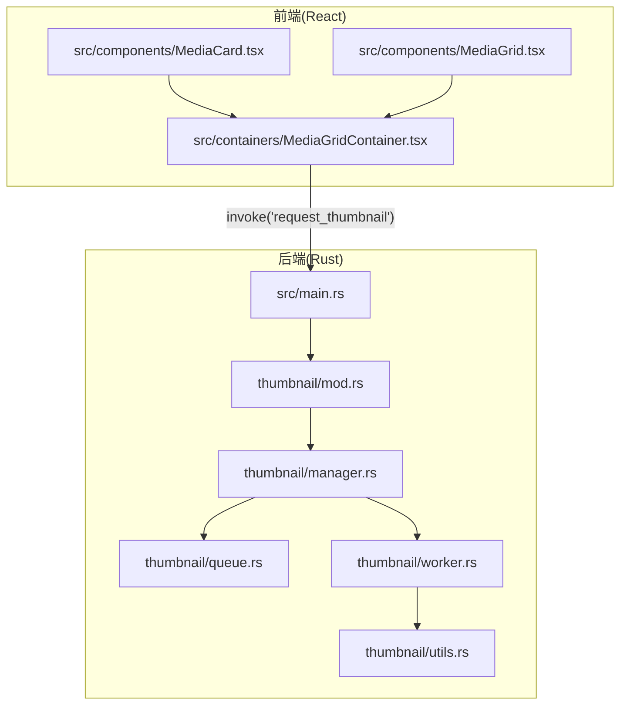
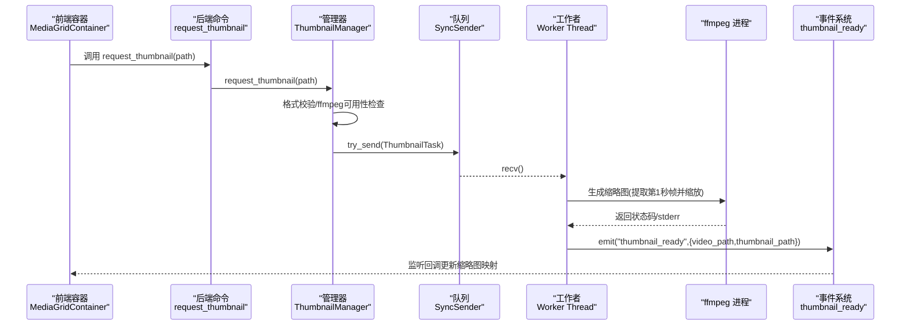
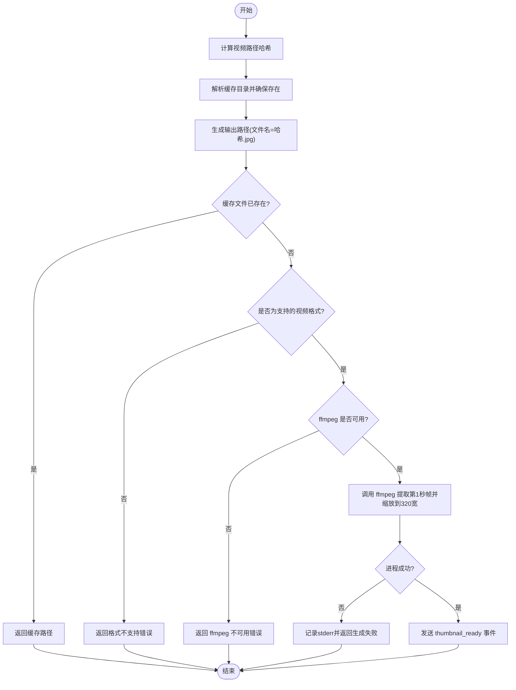
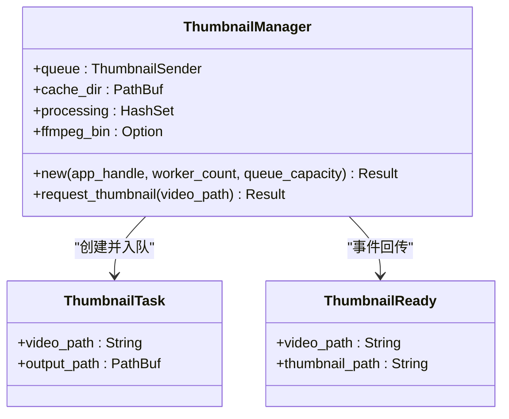
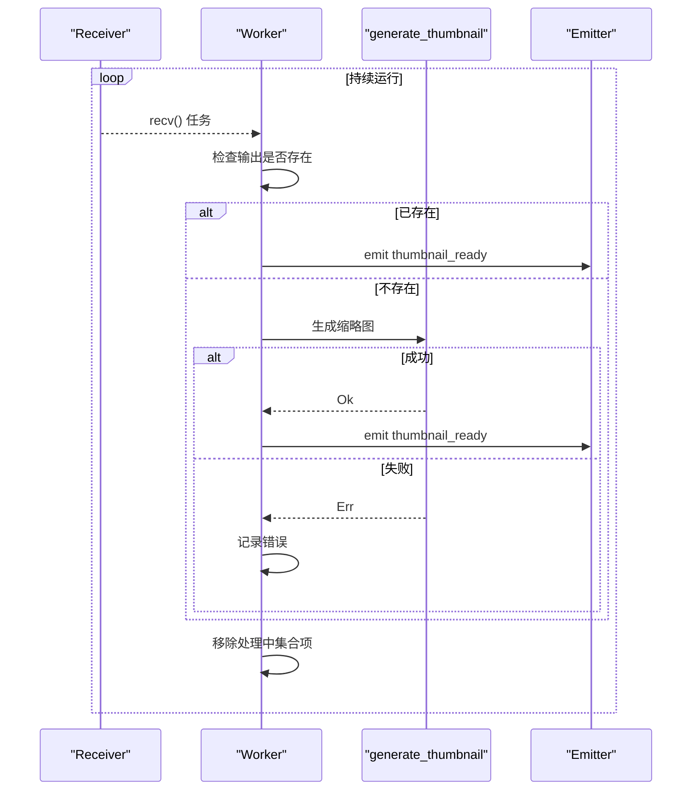
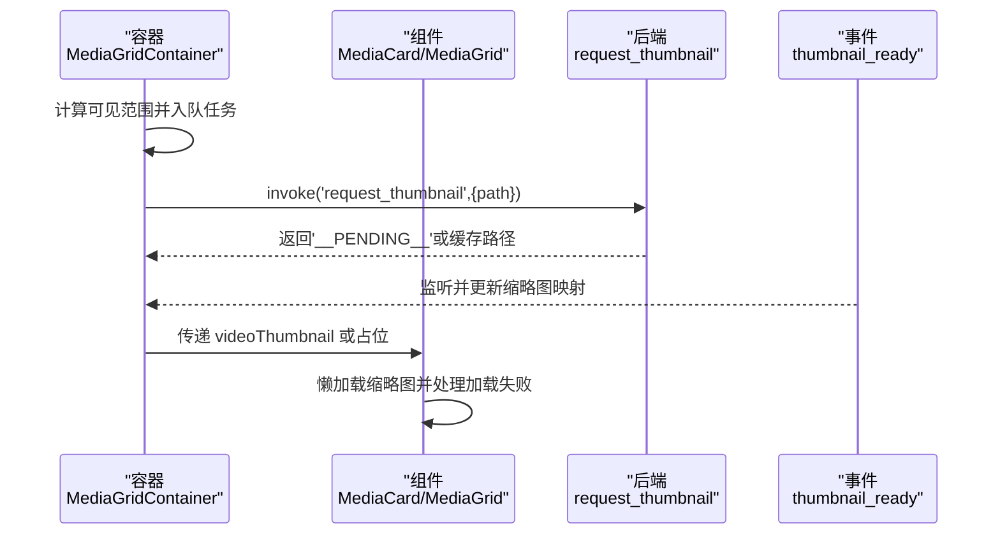
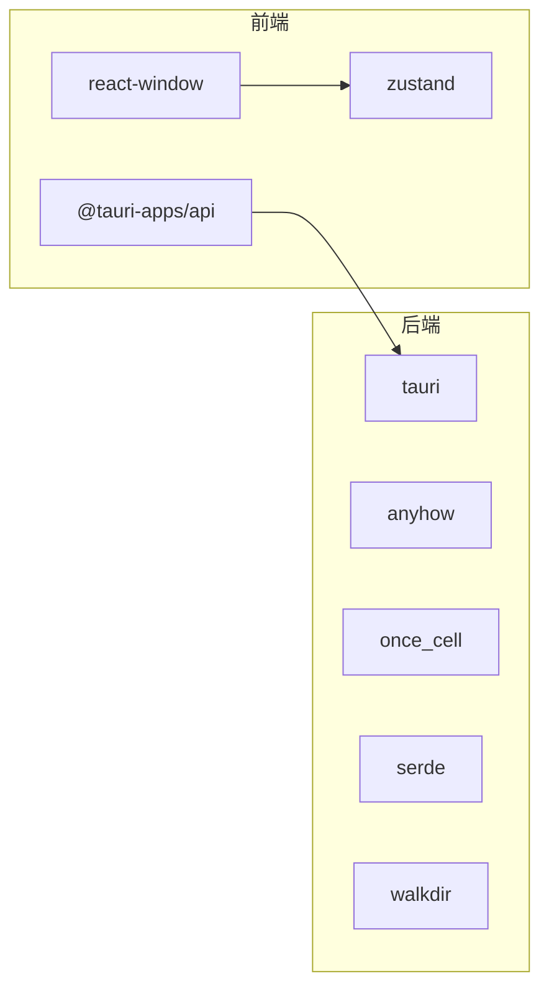

# 缩略图工具函数

<cite>
**本文档引用的文件**
- [src-tauri/src/thumbnail/mod.rs](file://src-tauri/src/thumbnail/mod.rs)
- [src-tauri/src/thumbnail/utils.rs](file://src-tauri/src/thumbnail/utils.rs)
- [src-tauri/src/thumbnail/manager.rs](file://src-tauri/src/thumbnail/manager.rs)
- [src-tauri/src/thumbnail/queue.rs](file://src-tauri/src/thumbnail/queue.rs)
- [src-tauri/src/thumbnail/worker.rs](file://src-tauri/src/thumbnail/worker.rs)
- [src-tauri/src/main.rs](file://src-tauri/src/main.rs)
- [src-tauri/Cargo.toml](file://src-tauri/Cargo.toml)
- [src/containers/MediaGridContainer.tsx](file://src/containers/MediaGridContainer.tsx)
- [src/components/MediaCard.tsx](file://src/components/MediaCard.tsx)
- [src/components/MediaGrid.tsx](file://src/components/MediaGrid.tsx)
- [RELEASE_GUIDE.md](file://RELEASE_GUIDE.md)
</cite>

## 目录
1. [简介](#简介)
2. [项目结构](#项目结构)
3. [核心组件](#核心组件)
4. [架构总览](#架构总览)
5. [详细组件分析](#详细组件分析)
6. [依赖关系分析](#依赖关系分析)
7. [性能考虑](#性能考虑)
8. [故障排除指南](#故障排除指南)
9. [结论](#结论)
10. [附录](#附录)

## 简介
本文件面向缩略图工具函数的技术文档，聚焦于视频缩略图生成的完整流程与实现细节。内容涵盖：
- 文件路径处理、格式验证与元数据提取（通过扩展名判断）
- 图像处理算法（基于 ffmpeg 的帧提取与缩放）
- 缓存文件管理、文件系统操作与权限控制
- 错误处理、边界条件检查与异常防护
- 性能优化技巧、内存使用优化与资源管理策略
- 工具函数的使用示例、参数说明与最佳实践

## 项目结构
缩略图功能位于 Tauri 后端模块 src-tauri 的 thumbnail 子模块中，前端通过 Tauri 命令调用后端能力，并在 UI 层渲染缩略图。

**图表来源**
- [src-tauri/src/thumbnail/mod.rs:1-62](file://src-tauri/src/thumbnail/mod.rs#L1-L62)
- [src-tauri/src/thumbnail/utils.rs:1-158](file://src-tauri/src/thumbnail/utils.rs#L1-L158)
- [src-tauri/src/thumbnail/manager.rs:1-108](file://src-tauri/src/thumbnail/manager.rs#L1-L108)
- [src-tauri/src/thumbnail/queue.rs:1-12](file://src-tauri/src/thumbnail/queue.rs#L1-L12)
- [src-tauri/src/thumbnail/worker.rs:1-96](file://src-tauri/src/thumbnail/worker.rs#L1-L96)
- [src-tauri/src/main.rs:1-69](file://src-tauri/src/main.rs#L1-L69)
- [src/containers/MediaGridContainer.tsx:1-619](file://src/containers/MediaGridContainer.tsx#L1-L619)
- [src/components/MediaCard.tsx:1-318](file://src/components/MediaCard.tsx#L1-L318)
- [src/components/MediaGrid.tsx:1-351](file://src/components/MediaGrid.tsx#L1-L351)

**章节来源**
- [src-tauri/src/thumbnail/mod.rs:1-62](file://src-tauri/src/thumbnail/mod.rs#L1-L62)
- [src-tauri/src/main.rs:1-69](file://src-tauri/src/main.rs#L1-L69)

## 核心组件
- 模块入口与命令导出：定义缩略图任务结构、结果结构、全局管理器初始化与对外命令接口。
- 工具函数：路径哈希、缓存目录解析、输出路径生成、ffmpeg 调用、视频格式判断、ffmpeg 二进制定位。
- 管理器：队列创建、工作线程池启动、请求入队与并发控制、处理中集合管理。
- 队列：同步通道封装，容量受控。
- 工作者：循环从队列取任务、执行生成、事件回传、处理中集合清理。

**章节来源**
- [src-tauri/src/thumbnail/mod.rs:18-61](file://src-tauri/src/thumbnail/mod.rs#L18-L61)
- [src-tauri/src/thumbnail/utils.rs:14-158](file://src-tauri/src/thumbnail/utils.rs#L14-L158)
- [src-tauri/src/thumbnail/manager.rs:16-107](file://src-tauri/src/thumbnail/manager.rs#L16-L107)
- [src-tauri/src/thumbnail/queue.rs:8-11](file://src-tauri/src/thumbnail/queue.rs#L8-L11)
- [src-tauri/src/thumbnail/worker.rs:13-96](file://src-tauri/src/thumbnail/worker.rs#L13-L96)

## 架构总览
缩略图系统采用“请求-队列-工作线程-事件回传”的异步流水线模式。前端在可见区域触发缩略图请求，后端将任务投递到有界队列，多个工作线程并发执行生成，完成后通过 Tauri 事件通知前端更新 UI。

**图表来源**
- [src-tauri/src/thumbnail/manager.rs:51-106](file://src-tauri/src/thumbnail/manager.rs#L51-L106)
- [src-tauri/src/thumbnail/worker.rs:52-89](file://src-tauri/src/thumbnail/worker.rs#L52-L89)
- [src-tauri/src/thumbnail/utils.rs:36-61](file://src-tauri/src/thumbnail/utils.rs#L36-L61)
- [src/containers/MediaGridContainer.tsx:453-486](file://src/containers/MediaGridContainer.tsx#L453-L486)

## 详细组件分析

### 工具函数与算法实现
- 路径哈希与缓存目录
  - 使用默认哈希器对视频路径进行哈希，生成稳定且唯一的缓存文件名，避免冲突。
  - 缓存目录通过应用数据目录拼接得到，并确保目录存在。
- 输出路径生成
  - 以哈希值作为文件名，扩展名为 JPEG，便于浏览器直接渲染。
- ffmpeg 调用与图像处理
  - 从视频第1秒抽取一帧，按宽度 320、高度等比缩放，覆盖到目标输出路径。
  - 对输出状态进行检查，失败时返回详细错误信息（包含 ffmpeg 的 stderr）。
- 视频格式验证
  - 仅允许 mp4、mov、mkv、webm 四种扩展名，其余路径直接拒绝。
- ffmpeg 二进制定位
  - 优先从 Tauri 资源目录查找；开发环境从本地 binaries 目录查找；其次从 PATH 查找；最后尝试常见 Homebrew 路径。
- 事件回传
  - 成功生成后通过 Tauri Emitter 发送 thumbnail_ready 事件，携带视频路径与缩略图路径。

**图表来源**
- [src-tauri/src/thumbnail/utils.rs:14-96](file://src-tauri/src/thumbnail/utils.rs#L14-L96)
- [src-tauri/src/thumbnail/utils.rs:36-61](file://src-tauri/src/thumbnail/utils.rs#L36-L61)
- [src-tauri/src/thumbnail/manager.rs:51-106](file://src-tauri/src/thumbnail/manager.rs#L51-L106)

**章节来源**
- [src-tauri/src/thumbnail/utils.rs:14-158](file://src-tauri/src/thumbnail/utils.rs#L14-L158)

### 管理器与队列
- 初始化
  - 解析缓存目录与 ffmpeg 路径，打印日志；创建有界同步通道；启动固定数量的工作线程。
- 请求处理
  - 校验格式与 ffmpeg 可用性；若缓存存在则直接返回；否则检查“处理中”集合防止重复请求；将任务入队；队列满或断开时进行相应处理与回退。
- 并发控制
  - 使用互斥集合记录正在处理的视频路径，避免重复生成；通过有界队列限制并发压力。

**图表来源**
- [src-tauri/src/thumbnail/manager.rs:16-49](file://src-tauri/src/thumbnail/manager.rs#L16-L49)
- [src-tauri/src/thumbnail/mod.rs:18-28](file://src-tauri/src/thumbnail/mod.rs#L18-L28)

**章节来源**
- [src-tauri/src/thumbnail/manager.rs:24-107](file://src-tauri/src/thumbnail/manager.rs#L24-L107)
- [src-tauri/src/thumbnail/queue.rs:8-11](file://src-tauri/src/thumbnail/queue.rs#L8-L11)

### 工作者与事件回传
- 循环从队列接收任务；若输出已存在则直接回传事件；若 ffmpeg 不可用则清理处理中并跳过；否则调用生成函数，成功则回传事件，失败记录错误；最后清理处理中集合。
- 事件负载包含原始视频路径与生成的缩略图路径，前端监听后更新本地映射并继续调度队列。

**图表来源**
- [src-tauri/src/thumbnail/worker.rs:26-79](file://src-tauri/src/thumbnail/worker.rs#L26-L79)
- [src-tauri/src/thumbnail/utils.rs:36-61](file://src-tauri/src/thumbnail/utils.rs#L36-L61)

**章节来源**
- [src-tauri/src/thumbnail/worker.rs:52-96](file://src-tauri/src/thumbnail/worker.rs#L52-L96)

### 前端集成与使用
- 容器层
  - 维护缩略图映射、请求中集合、排队集合与任务队列；根据可见范围动态入队；并发上限与队列容量受控；监听 thumbnail_ready 事件更新 UI。
- 组件层
  - 在视频卡片中展示缩略图占位与加载态；当缩略图可用时懒加载渲染；图片加载失败时回退到占位提示。
- 路由与转换
  - 将绝对路径转换为可访问的 file:// URL；对远程资源与相对资源进行区分处理。

**图表来源**
- [src/containers/MediaGridContainer.tsx:390-486](file://src/containers/MediaGridContainer.tsx#L390-L486)
- [src/components/MediaCard.tsx:153-170](file://src/components/MediaCard.tsx#L153-L170)
- [src/components/MediaGrid.tsx:312-321](file://src/components/MediaGrid.tsx#L312-L321)

**章节来源**
- [src/containers/MediaGridContainer.tsx:390-486](file://src/containers/MediaGridContainer.tsx#L390-L486)
- [src/components/MediaCard.tsx:55-170](file://src/components/MediaCard.tsx#L55-L170)
- [src/components/MediaGrid.tsx:312-321](file://src/components/MediaGrid.tsx#L312-L321)

## 依赖关系分析
- 后端依赖
  - Tauri：命令注册、事件发射、资源目录解析。
  - anyhow：统一错误处理与上下文包装。
  - once_cell：全局静态管理器初始化。
  - serde：序列化事件负载。
  - walkdir：目录遍历（在缩略图模块中未直接使用，但为通用依赖）。
- 前端依赖
  - @tauri-apps/api：命令调用与事件监听。
  - react-window：虚拟化渲染，减少 DOM 数量。
  - zustand：全局状态管理。

**图表来源**
- [src-tauri/Cargo.toml:13-23](file://src-tauri/Cargo.toml#L13-L23)
- [src/containers/MediaGridContainer.tsx:1-11](file://src/containers/MediaGridContainer.tsx#L1-L11)

**章节来源**
- [src-tauri/Cargo.toml:13-23](file://src-tauri/Cargo.toml#L13-L23)

## 性能考虑
- 并发与限流
  - 后端：固定工作线程数与有界队列容量，避免过多并发导致资源争用。
  - 前端：最大并发与队列长度限制，结合可见范围动态入队，降低无效请求。
- 缓存与去重
  - 基于路径哈希的稳定缓存文件名；“处理中”集合避免重复请求。
- I/O 与 CPU
  - ffmpeg 仅提取首帧并进行等比缩放，计算量可控；输出路径直接复用，减少二次处理。
- 渲染优化
  - 前端使用虚拟化网格与懒加载，显著降低渲染成本。

[本节为通用性能讨论，无需特定文件引用]

## 故障排除指南
- ffmpeg 未找到
  - 现象：请求返回“ffmpeg 不可用”错误。
  - 排查：确认资源目录、本地 binaries、PATH 与 Homebrew 路径中是否存在 ffmpeg；检查权限与可执行位。
  - 参考：二进制定位顺序与日志输出。
- 队列满或断开
  - 现象：返回占位字符串，日志提示队列满或断开。
  - 排查：增大队列容量或减少并发；检查工作线程是否存活。
- 生成失败
  - 现象：stderr 包含具体错误信息。
  - 排查：检查输入视频是否损坏、权限是否正确、磁盘空间是否充足。
- 缓存目录不可写
  - 现象：无法创建缓存目录或写入文件。
  - 排查：确认应用数据目录权限与磁盘配额。

**章节来源**
- [src-tauri/src/thumbnail/manager.rs:55-102](file://src-tauri/src/thumbnail/manager.rs#L55-L102)
- [src-tauri/src/thumbnail/utils.rs:71-96](file://src-tauri/src/thumbnail/utils.rs#L71-L96)
- [src-tauri/src/thumbnail/utils.rs:55-58](file://src-tauri/src/thumbnail/utils.rs#L55-L58)

## 结论
该缩略图系统通过清晰的模块划分与严格的错误处理，实现了高效、稳定的视频缩略图生成与缓存。后端采用有界队列与固定线程池保障稳定性，前端通过虚拟化与可见范围调度提升渲染性能。配合内置 ffmpeg 的打包策略，可在多平台上提供一致的用户体验。

[本节为总结性内容，无需特定文件引用]

## 附录

### 使用示例与最佳实践
- 后端命令调用
  - 前端通过 invoke 调用 request_thumbnail(path)，传入视频绝对路径。
  - 返回值可能是缓存路径或占位字符串（表示正在生成或队列满）。
- 前端集成要点
  - 监听 thumbnail_ready 事件，更新缩略图映射。
  - 在可见范围内入队任务，控制最大并发与队列长度。
  - 对视频缩略图使用懒加载与加载失败回退。
- 最佳实践
  - 保持缓存目录可写，避免频繁重建。
  - 合理设置工作线程数与队列容量，平衡吞吐与资源占用。
  - 优先使用内置 ffmpeg，减少用户环境差异带来的问题。

**章节来源**
- [src-tauri/src/thumbnail/mod.rs:57-61](file://src-tauri/src/thumbnail/mod.rs#L57-L61)
- [src/containers/MediaGridContainer.tsx:390-486](file://src/containers/MediaGridContainer.tsx#L390-L486)
- [RELEASE_GUIDE.md:73-115](file://RELEASE_GUIDE.md#L73-L115)