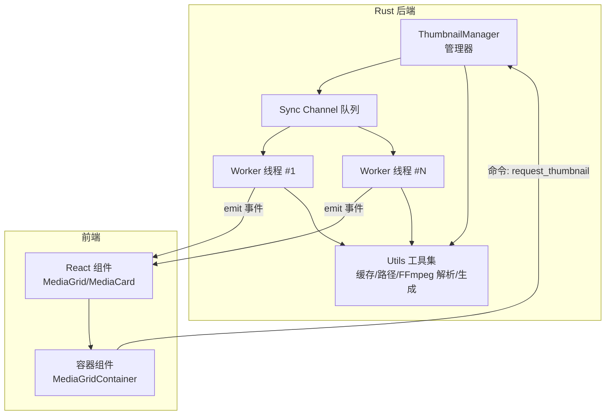
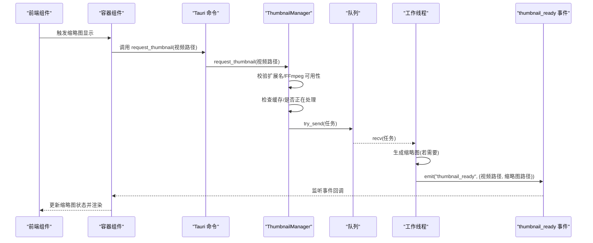
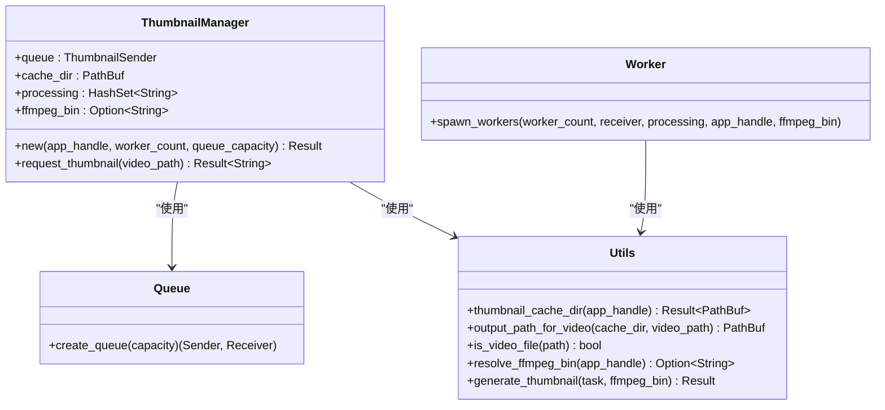
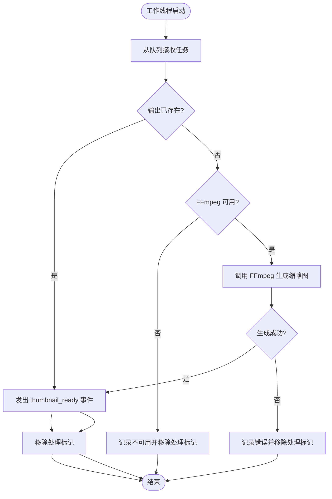
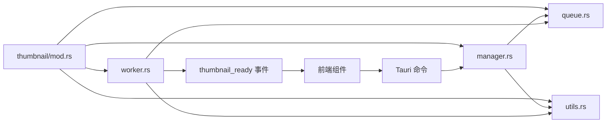

# 缩略图管理器

<cite>
**本文引用的文件**
- [src-tauri/src/thumbnail/mod.rs](file://src-tauri/src/thumbnail/mod.rs)
- [src-tauri/src/thumbnail/manager.rs](file://src-tauri/src/thumbnail/manager.rs)
- [src-tauri/src/thumbnail/queue.rs](file://src-tauri/src/thumbnail/queue.rs)
- [src-tauri/src/thumbnail/worker.rs](file://src-tauri/src/thumbnail/worker.rs)
- [src-tauri/src/thumbnail/utils.rs](file://src-tauri/src/thumbnail/utils.rs)
- [src-tauri/src/main.rs](file://src-tauri/src/main.rs)
- [src-tauri/Cargo.toml](file://src-tauri/Cargo.toml)
- [src/components/MediaGrid.tsx](file://src/components/MediaGrid.tsx)
- [src/components/MediaCard.tsx](file://src/components/MediaCard.tsx)
- [src/containers/MediaGridContainer.tsx](file://src/containers/MediaGridContainer.tsx)
</cite>

## 目录
1. [简介](#简介)
2. [项目结构](#项目结构)
3. [核心组件](#核心组件)
4. [架构总览](#架构总览)
5. [详细组件分析](#详细组件分析)
6. [依赖关系分析](#依赖关系分析)
7. [性能考量](#性能考量)
8. [故障排查指南](#故障排查指南)
9. [结论](#结论)
10. [附录](#附录)

## 简介
本技术文档围绕缩略图管理器（ThumbnailManager）进行系统化说明，覆盖其初始化流程、配置参数、生命周期管理、请求处理流程（任务分发、状态跟踪、结果回调）、与队列、工作线程、缓存系统的协作机制、并发控制与资源限制、性能优化策略、错误处理与降级机制，并提供前端使用示例、配置选项与监控指标建议。

## 项目结构
缩略图子系统位于 Rust 后端模块 src-tauri/src/thumbnail 下，采用模块化组织：管理器负责生命周期与调度；队列提供有界同步通道；工作线程池消费任务并调用外部工具生成缩略图；工具模块封装路径解析、缓存目录、FFmpeg 可执行文件定位与缩略图生成逻辑。前端通过 Tauri 命令与事件与后端交互，实现缩略图的请求与渲染。

图表来源
- [src-tauri/src/thumbnail/manager.rs:16-49](file://src-tauri/src/thumbnail/manager.rs#L16-L49)
- [src-tauri/src/thumbnail/queue.rs:8-11](file://src-tauri/src/thumbnail/queue.rs#L8-L11)
- [src-tauri/src/thumbnail/worker.rs:13-50](file://src-tauri/src/thumbnail/worker.rs#L13-L50)
- [src-tauri/src/thumbnail/utils.rs:20-61](file://src-tauri/src/thumbnail/utils.rs#L20-L61)
- [src-tauri/src/thumbnail/mod.rs:32-61](file://src-tauri/src/thumbnail/mod.rs#L32-L61)
- [src-tauri/src/main.rs:19-64](file://src-tauri/src/main.rs#L19-L64)

章节来源
- [src-tauri/src/thumbnail/mod.rs:1-62](file://src-tauri/src/thumbnail/mod.rs#L1-L62)
- [src-tauri/src/thumbnail/manager.rs:1-108](file://src-tauri/src/thumbnail/manager.rs#L1-L108)
- [src-tauri/src/thumbnail/queue.rs:1-12](file://src-tauri/src/thumbnail/queue.rs#L1-L12)
- [src-tauri/src/thumbnail/worker.rs:1-96](file://src-tauri/src/thumbnail/worker.rs#L1-L96)
- [src-tauri/src/thumbnail/utils.rs:1-158](file://src-tauri/src/thumbnail/utils.rs#L1-L158)
- [src-tauri/src/main.rs:1-69](file://src-tauri/src/main.rs#L1-L69)

## 核心组件
- 管理器（ThumbnailManager）
  - 负责初始化缓存目录与 FFmpeg 路径，创建有界队列，启动工作线程池，接收缩略图请求并入队。
  - 提供并发安全的状态跟踪（正在处理集合），避免重复排队同一视频。
- 队列（Sync Channel）
  - 使用有界同步通道承载任务，满载时拒绝新任务并返回占位符，防止阻塞。
- 工作线程（Worker Pool）
  - 多线程从队列取任务，检查输出缓存是否存在，若不存在则调用 FFmpeg 生成缩略图，完成后通过 Tauri 事件通知前端。
- 工具集（Utils）
  - 计算视频路径哈希作为缓存文件名，解析缓存目录，定位 FFmpeg 可执行文件（资源内优先、开发目录回退、系统 PATH、Homebrew macOS 路径），执行 FFmpeg 并处理失败场景。
- 前端集成
  - 通过 Tauri 命令发起请求，监听 thumbnail_ready 事件更新缩略图状态，支持占位符与懒加载。

章节来源
- [src-tauri/src/thumbnail/manager.rs:16-106](file://src-tauri/src/thumbnail/manager.rs#L16-L106)
- [src-tauri/src/thumbnail/queue.rs:8-11](file://src-tauri/src/thumbnail/queue.rs#L8-L11)
- [src-tauri/src/thumbnail/worker.rs:13-96](file://src-tauri/src/thumbnail/worker.rs#L13-L96)
- [src-tauri/src/thumbnail/utils.rs:20-157](file://src-tauri/src/thumbnail/utils.rs#L20-L157)
- [src-tauri/src/thumbnail/mod.rs:32-61](file://src-tauri/src/thumbnail/mod.rs#L32-L61)

## 架构总览
缩略图系统采用“命令-事件”模式与“生产者-消费者”队列模型：
- 前端通过命令请求缩略图；
- 管理器校验输入、检查缓存、登记处理状态并尝试入队；
- 工作线程从队列取出任务，生成缩略图并发出 thumbnail_ready 事件；
- 前端监听事件，更新本地状态并渲染图片。

图表来源
- [src-tauri/src/thumbnail/mod.rs:57-61](file://src-tauri/src/thumbnail/mod.rs#L57-L61)
- [src-tauri/src/thumbnail/manager.rs:51-106](file://src-tauri/src/thumbnail/manager.rs#L51-L106)
- [src-tauri/src/thumbnail/queue.rs:8-11](file://src-tauri/src/thumbnail/queue.rs#L8-L11)
- [src-tauri/src/thumbnail/worker.rs:26-89](file://src-tauri/src/thumbnail/worker.rs#L26-L89)
- [src/containers/MediaGridContainer.tsx:456-458](file://src/containers/MediaGridContainer.tsx#L456-L458)

章节来源
- [src-tauri/src/thumbnail/mod.rs:32-61](file://src-tauri/src/thumbnail/mod.rs#L32-L61)
- [src-tauri/src/thumbnail/manager.rs:24-106](file://src-tauri/src/thumbnail/manager.rs#L24-L106)
- [src-tauri/src/thumbnail/worker.rs:13-96](file://src-tauri/src/thumbnail/worker.rs#L13-L96)
- [src/containers/MediaGridContainer.tsx:41-43](file://src/containers/MediaGridContainer.tsx#L41-L43)

## 详细组件分析

### 管理器（ThumbnailManager）
- 初始化
  - 解析缓存目录与 FFmpeg 路径，打印可用信息或禁用提示。
  - 创建有界队列与处理集合，派生工作线程池。
- 请求处理
  - 校验视频扩展名与 FFmpeg 可用性。
  - 若缓存存在，直接返回缓存路径。
  - 若已在处理集合中，返回占位符；否则登记并尝试入队。
  - 队列满载或断开时，移除登记并返回占位符或错误上下文。
- 生命周期
  - 通过单例初始化函数在应用启动时完成一次性初始化，后续复用。

图表来源
- [src-tauri/src/thumbnail/manager.rs:16-49](file://src-tauri/src/thumbnail/manager.rs#L16-L49)
- [src-tauri/src/thumbnail/utils.rs:20-96](file://src-tauri/src/thumbnail/utils.rs#L20-L96)
- [src-tauri/src/thumbnail/queue.rs:8-11](file://src-tauri/src/thumbnail/queue.rs#L8-L11)
- [src-tauri/src/thumbnail/worker.rs:13-25](file://src-tauri/src/thumbnail/worker.rs#L13-L25)

章节来源
- [src-tauri/src/thumbnail/manager.rs:24-106](file://src-tauri/src/thumbnail/manager.rs#L24-L106)
- [src-tauri/src/thumbnail/utils.rs:20-96](file://src-tauri/src/thumbnail/utils.rs#L20-L96)
- [src-tauri/src/thumbnail/queue.rs:8-11](file://src-tauri/src/thumbnail/queue.rs#L8-L11)
- [src-tauri/src/thumbnail/worker.rs:13-50](file://src-tauri/src/thumbnail/worker.rs#L13-L50)

### 队列与工作线程
- 队列
  - 使用有界同步通道，满载时非阻塞发送，返回占位符以避免阻塞 UI。
- 工作线程
  - 每个线程循环从队列接收任务，检查缓存、FFmpeg 可用性与生成结果，完成后发出事件并清理处理集合。

图表来源
- [src-tauri/src/thumbnail/worker.rs:26-89](file://src-tauri/src/thumbnail/worker.rs#L26-L89)

章节来源
- [src-tauri/src/thumbnail/queue.rs:8-11](file://src-tauri/src/thumbnail/queue.rs#L8-L11)
- [src-tauri/src/thumbnail/worker.rs:13-96](file://src-tauri/src/thumbnail/worker.rs#L13-L96)

### 工具集（缓存、路径、FFmpeg）
- 缓存目录
  - 基于应用数据目录创建 thumbnails 子目录，确保存在。
- 输出路径
  - 以视频路径哈希命名，避免冲突与路径过长问题。
- FFmpeg 解析
  - 优先从资源目录查找，开发环境回退到本地 binaries 目录，再回退系统 PATH，最后尝试常见 macOS Homebrew 路径。
- 生成逻辑
  - 使用固定参数生成缩略图（起始时间、缩放、帧数等），捕获标准错误并返回可诊断的错误信息。

章节来源
- [src-tauri/src/thumbnail/utils.rs:20-157](file://src-tauri/src/thumbnail/utils.rs#L20-L157)

### 前端集成与事件监听
- 命令请求
  - 容器组件调用 Tauri 命令发起缩略图请求，收到占位符或真实路径。
- 事件监听
  - 监听 thumbnail_ready 事件，转换文件路径为可访问的 URL，更新组件状态并触发重新渲染。
- 渲染策略
  - 视频卡片在未生成时显示占位动画，生成后懒加载缩略图并渐显。

章节来源
- [src-tauri/src/thumbnail/mod.rs:57-61](file://src-tauri/src/thumbnail/mod.rs#L57-L61)
- [src/containers/MediaGridContainer.tsx:41-43](file://src/containers/MediaGridContainer.tsx#L41-L43)
- [src/containers/MediaGridContainer.tsx:382-382](file://src/containers/MediaGridContainer.tsx#L382-L382)
- [src/containers/MediaGridContainer.tsx:456-458](file://src/containers/MediaGridContainer.tsx#L456-L458)
- [src/components/MediaCard.tsx:153-170](file://src/components/MediaCard.tsx#L153-L170)
- [src/components/MediaGrid.tsx:274-287](file://src/components/MediaGrid.tsx#L274-L287)

## 依赖关系分析
- 模块耦合
  - 管理器依赖队列与工具模块；工作线程依赖队列与工具模块；前端依赖 Tauri 命令与事件。
- 外部依赖
  - FFmpeg 可执行文件由工具模块解析，运行时需保证可执行权限与可用性。
- 并发与同步
  - 处理集合使用互斥锁保护，队列为有界同步通道，避免阻塞与内存膨胀。

图表来源
- [src-tauri/src/thumbnail/mod.rs:1-16](file://src-tauri/src/thumbnail/mod.rs#L1-L16)
- [src-tauri/src/thumbnail/manager.rs:9-14](file://src-tauri/src/thumbnail/manager.rs#L9-L14)
- [src-tauri/src/thumbnail/worker.rs:9-11](file://src-tauri/src/thumbnail/worker.rs#L9-L11)
- [src-tauri/src/main.rs:49-65](file://src-tauri/src/main.rs#L49-L65)

章节来源
- [src-tauri/src/thumbnail/mod.rs:1-16](file://src-tauri/src/thumbnail/mod.rs#L1-L16)
- [src-tauri/src/thumbnail/manager.rs:9-14](file://src-tauri/src/thumbnail/manager.rs#L9-L14)
- [src-tauri/src/thumbnail/worker.rs:9-11](file://src-tauri/src/thumbnail/worker.rs#L9-L11)
- [src-tauri/src/main.rs:49-65](file://src-tauri/src/main.rs#L49-L65)

## 性能考量
- 并发与吞吐
  - 固定数量的工作线程并行处理，避免过多线程竞争导致抖动。
  - 有界队列限制积压，防止内存占用无限增长。
- I/O 与 CPU
  - 缓存命中直接返回文件路径，避免重复生成。
  - FFmpeg 参数固定，减少参数解析与错误重试成本。
- 前端体验
  - 占位符与懒加载提升首屏渲染速度与用户体验。
- 可扩展性
  - 可根据硬件能力调整工作线程数与队列容量；在高负载场景下可考虑动态调节。

## 故障排查指南
- FFmpeg 不可用
  - 现象：请求返回错误或禁用提示。
  - 排查：确认资源目录、开发 binaries、系统 PATH 与 Homebrew 路径是否存在可执行文件。
- 队列满载
  - 现象：请求返回占位符且日志提示队列已满。
  - 措施：增大队列容量或减少并发工作线程数，观察系统资源与磁盘写入能力。
- 生成失败
  - 现象：工作线程记录失败日志。
  - 措施：检查输入视频路径、权限、FFmpeg 参数与输出目录权限。
- 事件未到达
  - 现象：前端未更新缩略图。
  - 措施：确认事件监听注册、路径转换（convertFileSrc）与网络/文件协议处理。

章节来源
- [src-tauri/src/thumbnail/utils.rs:71-96](file://src-tauri/src/thumbnail/utils.rs#L71-L96)
- [src-tauri/src/thumbnail/manager.rs:83-103](file://src-tauri/src/thumbnail/manager.rs#L83-L103)
- [src-tauri/src/thumbnail/worker.rs:64-76](file://src-tauri/src/thumbnail/worker.rs#L64-L76)
- [src/containers/MediaGridContainer.tsx:382-382](file://src/containers/MediaGridContainer.tsx#L382-L382)

## 结论
缩略图管理器通过清晰的模块划分与稳定的并发模型，实现了高效、可扩展的缩略图生成与分发。其关键特性包括：有界队列与工作线程池的资源控制、缓存优先策略、多层级 FFmpeg 可执行文件解析、以及前端事件驱动的异步更新。在实际部署中，建议结合硬件能力调整并发与队列参数，并完善监控与告警以保障稳定性。

## 附录

### 初始化与生命周期
- 应用启动时调用初始化函数，完成单例管理器创建与工作线程派生。
- 管理器在首次请求时进行输入校验与缓存检查，随后按需入队。

章节来源
- [src-tauri/src/main.rs:19-22](file://src-tauri/src/main.rs#L19-L22)
- [src-tauri/src/thumbnail/mod.rs:32-49](file://src-tauri/src/thumbnail/mod.rs#L32-L49)
- [src-tauri/src/thumbnail/manager.rs:24-49](file://src-tauri/src/thumbnail/manager.rs#L24-L49)

### 配置参数与常量
- 工作线程数：固定常量定义。
- 队列容量：固定常量定义。
- 占位符字符串：用于表示缩略图尚未生成。

章节来源
- [src-tauri/src/thumbnail/mod.rs:14-16](file://src-tauri/src/thumbnail/mod.rs#L14-L16)
- [src-tauri/src/thumbnail/mod.rs](file://src-tauri/src/thumbnail/mod.rs#L16)

### 使用示例（前端）
- 发起请求
  - 在容器组件中调用 Tauri 命令请求缩略图，等待 thumbnail_ready 事件更新状态。
- 渲染缩略图
  - 视频卡片在未生成时显示占位动画，生成后懒加载缩略图并渐显。

章节来源
- [src/containers/MediaGridContainer.tsx:41-43](file://src/containers/MediaGridContainer.tsx#L41-L43)
- [src/containers/MediaGridContainer.tsx:456-458](file://src/containers/MediaGridContainer.tsx#L456-L458)
- [src/components/MediaCard.tsx:153-170](file://src/components/MediaCard.tsx#L153-L170)

### 监控指标建议
- 队列长度与满载次数
- 工作线程活跃度与平均处理耗时
- 缓存命中率
- FFmpeg 成功率与失败原因统计
- 前端事件延迟与渲染帧率