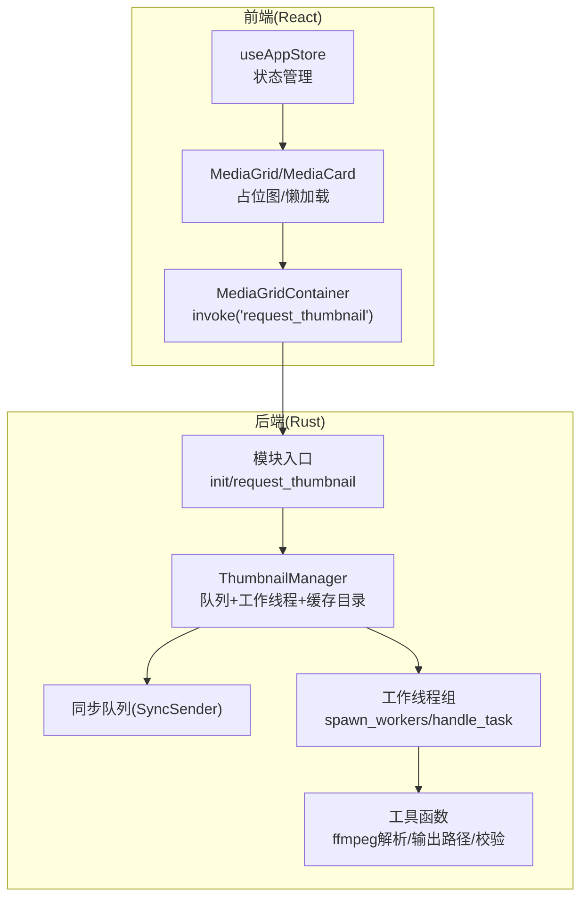
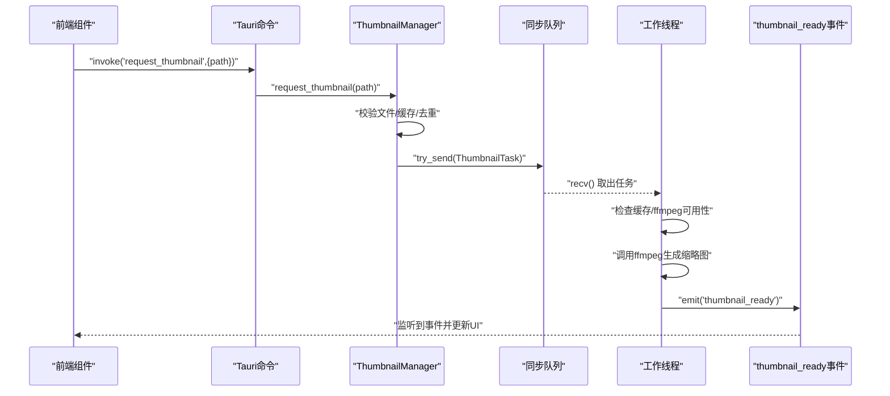
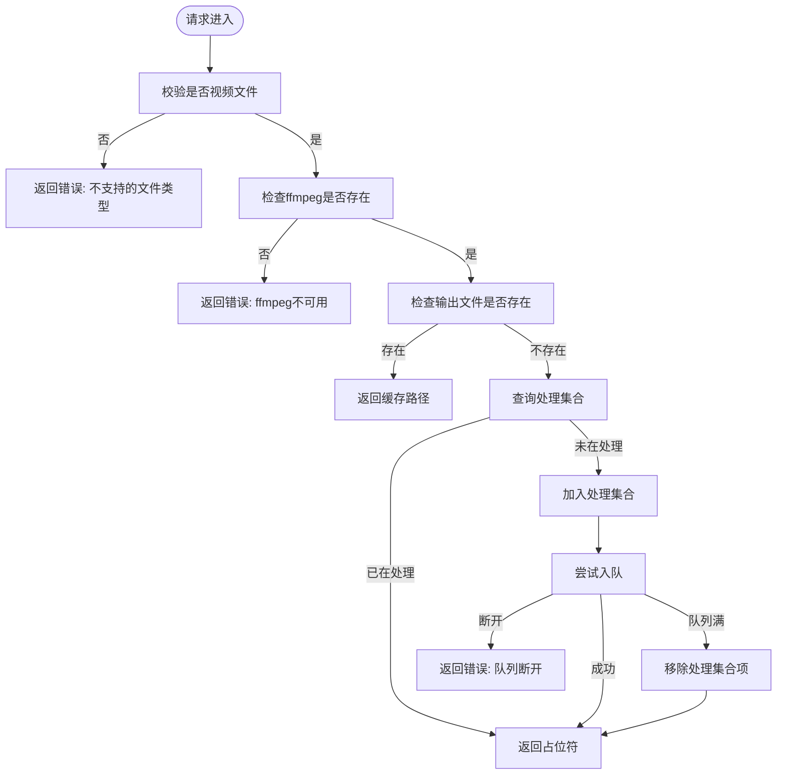
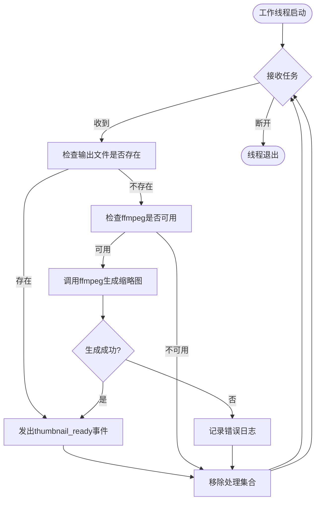
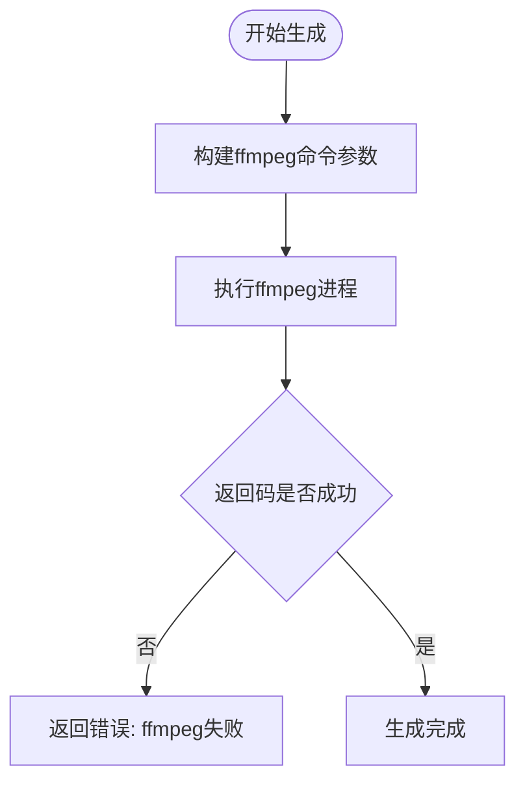
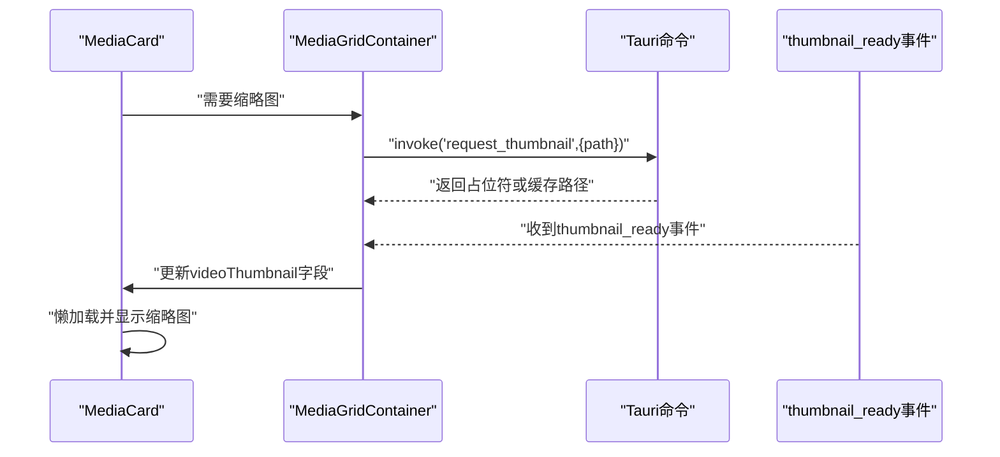
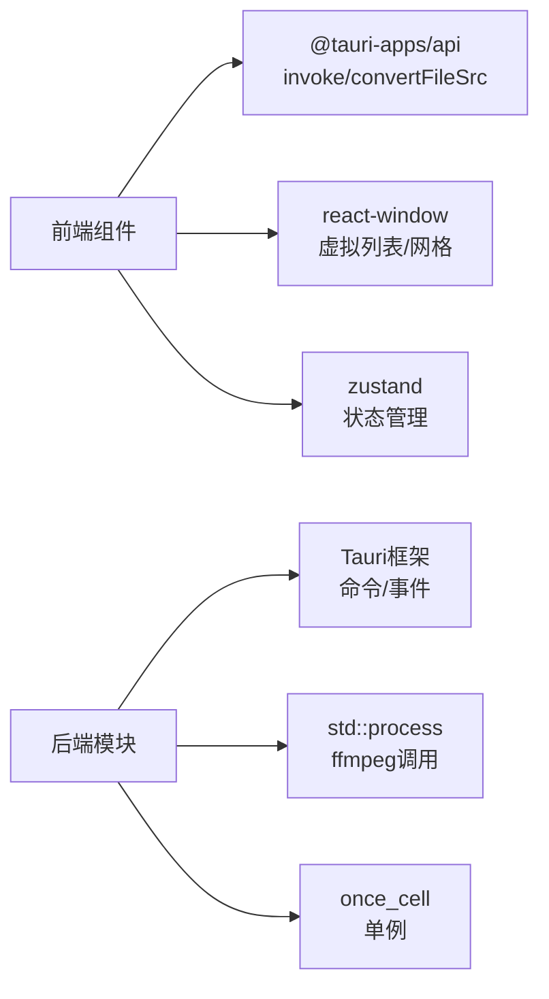

# 缩略图系统

<cite>
**本文引用的文件**
- [src-tauri/src/thumbnail/mod.rs](file://src-tauri/src/thumbnail/mod.rs)
- [src-tauri/src/thumbnail/manager.rs](file://src-tauri/src/thumbnail/manager.rs)
- [src-tauri/src/thumbnail/queue.rs](file://src-tauri/src/thumbnail/queue.rs)
- [src-tauri/src/thumbnail/worker.rs](file://src-tauri/src/thumbnail/worker.rs)
- [src-tauri/src/thumbnail/utils.rs](file://src-tauri/src/thumbnail/utils.rs)
- [src-tauri/src/main.rs](file://src-tauri/src/main.rs)
- [src-tauri/Cargo.toml](file://src-tauri/Cargo.toml)
- [src/components/MediaGrid.tsx](file://src/components/MediaGrid.tsx)
- [src/components/MediaCard.tsx](file://src/components/MediaCard.tsx)
- [src/containers/MediaGridContainer.tsx](file://src/containers/MediaGridContainer.tsx)
- [src/store/useAppStore.ts](file://src/store/useAppStore.ts)
</cite>

## 目录
1. [简介](#简介)
2. [项目结构](#项目结构)
3. [核心组件](#核心组件)
4. [架构总览](#架构总览)
5. [详细组件分析](#详细组件分析)
6. [依赖关系分析](#依赖关系分析)
7. [性能考量](#性能考量)
8. [故障排查指南](#故障排查指南)
9. [结论](#结论)
10. [附录](#附录)

## 简介
本文件为 Medex 缩略图系统的完整技术文档，聚焦于缩略图生成的端到端架构与实现细节，包括：
- 异步队列设计与工作线程管理
- 任务调度与并发控制
- 缩略图生成算法（基于 ffmpeg 的图像提取、尺寸调整与格式转换）
- 缓存机制（磁盘缓存与占位符策略）
- 请求处理流程与前端集成
- 错误处理、重试与降级策略
- 配置项、性能指标与监控建议
- 存储格式与文件命名规则

## 项目结构
缩略图系统主要由 Rust 后端与前端 React 组件协同完成：
- 后端（Tauri）负责初始化缩略图管理器、维护队列与工作线程、调用 ffmpeg 生成缩略图，并通过事件向前端推送结果。
- 前端负责触发缩略图请求、展示占位图与最终缩略图、监听后端事件并更新 UI。

图表来源
- [src-tauri/src/thumbnail/mod.rs:32-61](file://src-tauri/src/thumbnail/mod.rs#L32-L61)
- [src-tauri/src/thumbnail/manager.rs:24-49](file://src-tauri/src/thumbnail/manager.rs#L24-L49)
- [src-tauri/src/thumbnail/queue.rs:8-11](file://src-tauri/src/thumbnail/queue.rs#L8-L11)
- [src-tauri/src/thumbnail/worker.rs:13-50](file://src-tauri/src/thumbnail/worker.rs#L13-L50)
- [src-tauri/src/thumbnail/utils.rs:20-29](file://src-tauri/src/thumbnail/utils.rs#L20-L29)
- [src-tauri/src/main.rs:19-22](file://src-tauri/src/main.rs#L19-L22)
- [src/containers/MediaGridContainer.tsx:364-382](file://src/containers/MediaGridContainer.tsx#L364-L382)
- [src/components/MediaGrid.tsx:23-24](file://src/components/MediaGrid.tsx#L23-L24)
- [src/components/MediaCard.tsx:55-56](file://src/components/MediaCard.tsx#L55-L56)

章节来源
- [src-tauri/src/main.rs:19-22](file://src-tauri/src/main.rs#L19-L22)
- [src-tauri/src/thumbnail/mod.rs:32-61](file://src-tauri/src/thumbnail/mod.rs#L32-L61)

## 核心组件
- 模块入口与常量
  - 定义工作线程数量、队列容量、占位符字符串、任务与事件数据结构。
  - 提供初始化入口与命令接口，供前端调用。
- 缩略图管理器
  - 负责创建队列、启动工作线程、维护“正在处理集合”、解析 ffmpeg 路径、计算输出路径。
  - 处理请求：校验视频文件、命中缓存、去重、入队、返回占位符。
- 队列
  - 使用标准库同步通道，支持有界容量与非阻塞发送。
- 工作线程
  - 循环从队列取任务，检查缓存、校验 ffmpeg 可用性、调用生成函数、发出完成事件、清理处理集合。
- 工具函数
  - 计算缓存目录、输出文件名（基于输入路径哈希）、ffmpeg 查找策略、视频类型校验、调用 ffmpeg 生成缩略图。

章节来源
- [src-tauri/src/thumbnail/mod.rs:14-28](file://src-tauri/src/thumbnail/mod.rs#L14-L28)
- [src-tauri/src/thumbnail/manager.rs:16-49](file://src-tauri/src/thumbnail/manager.rs#L16-L49)
- [src-tauri/src/thumbnail/queue.rs:8-11](file://src-tauri/src/thumbnail/queue.rs#L8-L11)
- [src-tauri/src/thumbnail/worker.rs:13-50](file://src-tauri/src/thumbnail/worker.rs#L13-L50)
- [src-tauri/src/thumbnail/utils.rs:20-29](file://src-tauri/src/thumbnail/utils.rs#L20-L29)

## 架构总览
缩略图系统采用“命令式请求 + 异步队列 + 多工作线程”的模式：
- 前端通过 Tauri 命令发起请求，后端返回占位符或已存在的缓存路径。
- 后端在后台线程池中异步生成缩略图，完成后通过事件通知前端。
- 前端监听事件并更新对应卡片的缩略图显示。

图表来源
- [src-tauri/src/thumbnail/mod.rs:57-61](file://src-tauri/src/thumbnail/mod.rs#L57-L61)
- [src-tauri/src/thumbnail/manager.rs:51-106](file://src-tauri/src/thumbnail/manager.rs#L51-L106)
- [src-tauri/src/thumbnail/queue.rs:8-11](file://src-tauri/src/thumbnail/queue.rs#L8-L11)
- [src-tauri/src/thumbnail/worker.rs:26-49](file://src-tauri/src/thumbnail/worker.rs#L26-L49)
- [src/containers/MediaGridContainer.tsx:364-382](file://src/containers/MediaGridContainer.tsx#L364-L382)

## 详细组件分析

### 模块入口与常量
- 关键常量：工作线程数、队列容量、占位符字符串。
- 数据结构：ThumbnailTask（输入视频路径、输出路径），ThumbnailReady（视频路径、缩略图路径）。
- 初始化：单例化管理器，绑定命令接口，供前端调用。

章节来源
- [src-tauri/src/thumbnail/mod.rs:14-28](file://src-tauri/src/thumbnail/mod.rs#L14-L28)
- [src-tauri/src/thumbnail/mod.rs:32-61](file://src-tauri/src/thumbnail/mod.rs#L32-L61)

### 缩略图管理器
职责与行为：
- 初始化：解析缓存目录与 ffmpeg 路径；创建有界同步队列；克隆 app_handle 与 ffmpeg 路径；启动工作线程。
- 请求处理：校验视频类型；若输出文件存在则直接返回路径；若已在处理集合则返回占位符；否则插入处理集合并尝试入队；队列满时返回占位符并移除处理项；断开时返回错误。
- 并发控制：使用互斥集合记录正在处理的视频路径，避免重复入队与重复生成。

图表来源
- [src-tauri/src/thumbnail/manager.rs:51-106](file://src-tauri/src/thumbnail/manager.rs#L51-L106)

章节来源
- [src-tauri/src/thumbnail/manager.rs:24-49](file://src-tauri/src/thumbnail/manager.rs#L24-L49)
- [src-tauri/src/thumbnail/manager.rs:51-106](file://src-tauri/src/thumbnail/manager.rs#L51-L106)

### 队列设计
- 类型：同步通道（有界），发送为非阻塞尝试，接收为阻塞等待。
- 接收端封装为互斥保护的 Arc 引用，便于多工作线程安全访问。

章节来源
- [src-tauri/src/thumbnail/queue.rs:8-11](file://src-tauri/src/thumbnail/queue.rs#L8-L11)

### 工作线程与任务处理
- 工作线程：按配置数量创建，每个线程循环从队列取出任务。
- 任务处理逻辑：
  - 若输出文件已存在，直接发出完成事件并清理处理集合。
  - 若 ffmpeg 不可用，记录日志并清理处理集合。
  - 调用生成函数执行 ffmpeg，成功则发出完成事件，失败则记录错误日志。
  - 清理处理集合，保证并发一致性。

图表来源
- [src-tauri/src/thumbnail/worker.rs:26-49](file://src-tauri/src/thumbnail/worker.rs#L26-L49)
- [src-tauri/src/thumbnail/worker.rs:52-79](file://src-tauri/src/thumbnail/worker.rs#L52-L79)

章节来源
- [src-tauri/src/thumbnail/worker.rs:13-50](file://src-tauri/src/thumbnail/worker.rs#L13-L50)
- [src-tauri/src/thumbnail/worker.rs:52-79](file://src-tauri/src/thumbnail/worker.rs#L52-L79)

### 缩略图生成算法
- 输入参数：视频路径、输出路径、ffmpeg 路径。
- 处理步骤：
  - 从视频第 1 秒抽取一帧作为缩略图。
  - 将宽度固定为 320，高度按等比缩放。
  - 输出为 JPEG 格式，覆盖写入目标路径。
- 错误处理：进程启动失败、子进程返回码非零、输出路径无效均会返回错误。

图表来源
- [src-tauri/src/thumbnail/utils.rs:36-61](file://src-tauri/src/thumbnail/utils.rs#L36-L61)

章节来源
- [src-tauri/src/thumbnail/utils.rs:36-61](file://src-tauri/src/thumbnail/utils.rs#L36-L61)

### 缓存机制与文件命名
- 缓存目录：位于应用数据目录下的 thumbnails 子目录，首次使用自动创建。
- 文件命名：以输入视频路径进行哈希，扩展名为 jpg，确保唯一且可预测。
- 命中缓存：请求前先检查输出文件是否存在，存在则直接返回路径，避免重复生成。

章节来源
- [src-tauri/src/thumbnail/utils.rs:20-29](file://src-tauri/src/thumbnail/utils.rs#L20-L29)
- [src-tauri/src/thumbnail/utils.rs:31-34](file://src-tauri/src/thumbnail/utils.rs#L31-L34)
- [src-tauri/src/thumbnail/manager.rs:61-64](file://src-tauri/src/thumbnail/manager.rs#L61-L64)

### ffmpeg 解析与可用性
- 解析顺序：
  1) 优先从资源目录查找；
  2) 开发环境从本地 binaries 目录查找；
  3) 系统 PATH；
  4) 常见 Homebrew 路径。
- 若未找到，缩略图生成功能降级为不可用，但不影响其他功能。

章节来源
- [src-tauri/src/thumbnail/utils.rs:71-96](file://src-tauri/src/thumbnail/utils.rs#L71-L96)
- [src-tauri/src/thumbnail/utils.rs:109-157](file://src-tauri/src/thumbnail/utils.rs#L109-L157)
- [src-tauri/src/thumbnail/manager.rs:26-31](file://src-tauri/src/thumbnail/manager.rs#L26-L31)

### 前端请求与渲染
- 请求触发：容器组件在需要时调用 Tauri 命令请求缩略图。
- 占位图与懒加载：视频缩略图未就绪时显示占位动画，就绪后懒加载图片；普通图片失败时回退到占位提示。
- 事件驱动更新：监听 thumbnail_ready 事件，根据视频路径更新对应卡片的缩略图地址。

图表来源
- [src/containers/MediaGridContainer.tsx:364-382](file://src/containers/MediaGridContainer.tsx#L364-L382)
- [src/components/MediaCard.tsx:153-170](file://src/components/MediaCard.tsx#L153-L170)
- [src/components/MediaGrid.tsx:23-24](file://src/components/MediaGrid.tsx#L23-L24)

章节来源
- [src/containers/MediaGridContainer.tsx:364-382](file://src/containers/MediaGridContainer.tsx#L364-L382)
- [src/components/MediaCard.tsx:55-56](file://src/components/MediaCard.tsx#L55-L56)
- [src/components/MediaCard.tsx:153-170](file://src/components/MediaCard.tsx#L153-L170)

## 依赖关系分析
- 后端依赖
  - Tauri：命令注册、事件发射、资源路径解析。
  - once_cell：单例初始化。
  - std::process：调用外部 ffmpeg。
- 前端依赖
  - @tauri-apps/api：调用后端命令、转换文件 URL。
  - react-window：高性能列表/网格渲染。
  - zustand：全局状态管理。

图表来源
- [src-tauri/Cargo.toml:13-22](file://src-tauri/Cargo.toml#L13-L22)
- [src-tauri/src/main.rs:49-65](file://src-tauri/src/main.rs#L49-L65)
- [src/containers/MediaGridContainer.tsx:364-382](file://src/containers/MediaGridContainer.tsx#L364-L382)
- [src/components/MediaGrid.tsx:1-27](file://src/components/MediaGrid.tsx#L1-L27)
- [src/store/useAppStore.ts:1-20](file://src/store/useAppStore.ts#L1-L20)

章节来源
- [src-tauri/Cargo.toml:13-22](file://src-tauri/Cargo.toml#L13-L22)
- [src-tauri/src/main.rs:49-65](file://src-tauri/src/main.rs#L49-L65)

## 性能考量
- 并发与吞吐
  - 工作线程数固定为 4，适合多数桌面场景；可根据 CPU 核心数与 I/O 环境调整。
  - 队列容量为 2048，具备较高背压能力；满载时采用非阻塞入队并返回占位符，避免前端阻塞。
- I/O 与缓存
  - 输出文件以哈希命名，避免冲突；缓存命中直接返回路径，减少 IO 与 CPU。
  - 缓存目录统一管理，便于清理与迁移。
- 图像处理
  - 固定提取第 1 秒，缩放到 320 宽度，兼顾清晰度与体积；如需更高分辨率可调整参数。
- 前端渲染
  - 使用虚拟滚动与懒加载，降低首屏与滚动时的内存占用与重绘成本。

## 故障排查指南
- ffmpeg 未找到
  - 现象：请求返回错误，日志提示 ffmpeg 不可用。
  - 处理：确保 ffmpeg 可执行文件存在于资源目录、本地 binaries 或 PATH 中；必要时安装或打包内置二进制。
- 队列满或断开
  - 现象：返回占位符；日志提示队列满或断开。
  - 处理：增大队列容量或提升工作线程数；检查后端异常退出。
- 生成失败
  - 现象：日志打印 ffmpeg 失败原因。
  - 处理：检查输入视频格式、权限与路径有效性；确认 ffmpeg 参数与版本兼容性。
- 前端不显示缩略图
  - 现象：视频卡片持续显示占位动画。
  - 处理：确认事件监听正常；检查 convertFileSrc 生成的 URL 是否有效；验证缓存文件存在且可读。

章节来源
- [src-tauri/src/thumbnail/manager.rs:55-59](file://src-tauri/src/thumbnail/manager.rs#L55-L59)
- [src-tauri/src/thumbnail/manager.rs:83-103](file://src-tauri/src/thumbnail/manager.rs#L83-L103)
- [src-tauri/src/thumbnail/worker.rs:64-76](file://src-tauri/src/thumbnail/worker.rs#L64-L76)
- [src-tauri/src/thumbnail/utils.rs:55-58](file://src-tauri/src/thumbnail/utils.rs#L55-L58)
- [src/components/MediaCard.tsx:153-170](file://src/components/MediaCard.tsx#L153-L170)

## 结论
Medex 缩略图系统通过“命令 + 队列 + 工作线程 + 缓存”的组合，在保证高并发与稳定性的前提下，实现了对视频缩略图的高效生成与展示。其设计具备良好的可扩展性：可通过调整工作线程数与队列容量适配不同硬件环境；通过修改 ffmpeg 参数满足不同的图像质量需求；通过事件机制与前端虚拟渲染实现流畅的用户体验。

## 附录

### 配置选项
- 工作线程数：固定为 4（可在模块入口处调整）。
- 队列容量：默认 2048。
- 占位符字符串：用于指示缩略图生成中。
- 输出格式：JPEG（固定）。
- 输出尺寸：宽度 320，高度按比例自适应。

章节来源
- [src-tauri/src/thumbnail/mod.rs:14-16](file://src-tauri/src/thumbnail/mod.rs#L14-L16)
- [src-tauri/src/thumbnail/utils.rs:46-46](file://src-tauri/src/thumbnail/utils.rs#L46-L46)

### 监控与指标建议
- 后端
  - 队列长度与丢弃次数（队列满时的非阻塞入队失败计数）。
  - ffmpeg 进程启动与退出状态统计。
  - thumbnail_ready 事件发送速率与延迟。
  - 缓存命中率（输出文件存在即命中）。
- 前端
  - 视频缩略图加载成功率与平均加载时间。
  - 占位动画显示时长分布。

### 存储格式与命名规则
- 存储格式：JPEG。
- 命名规则：输入视频路径的哈希值 + .jpg，输出至缓存目录。

章节来源
- [src-tauri/src/thumbnail/utils.rs:31-34](file://src-tauri/src/thumbnail/utils.rs#L31-L34)
- [src-tauri/src/thumbnail/utils.rs:14-18](file://src-tauri/src/thumbnail/utils.rs#L14-L18)