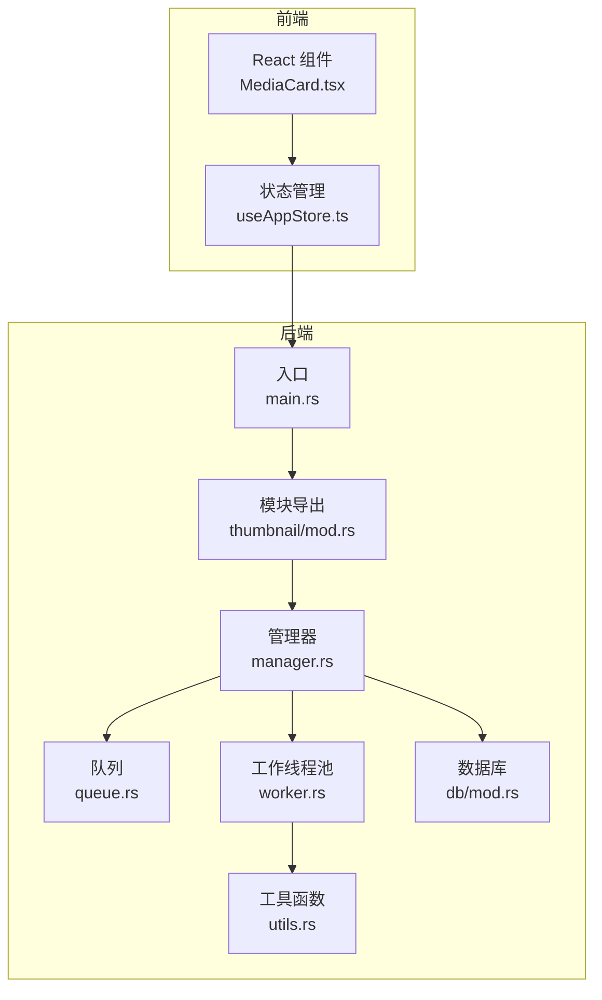
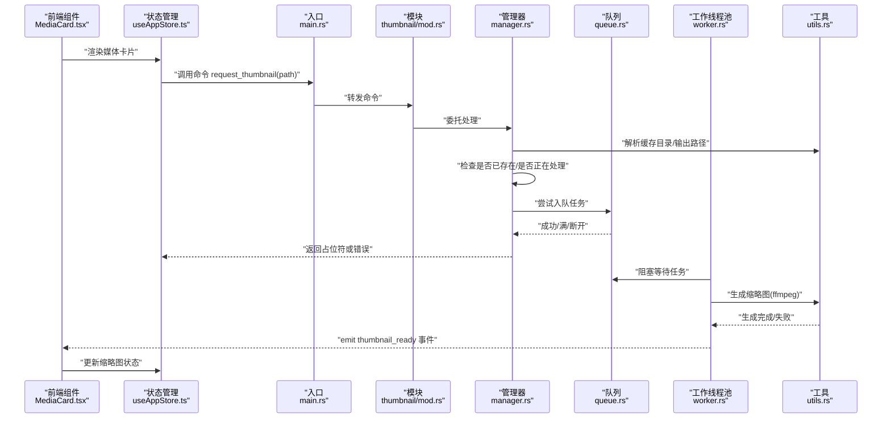
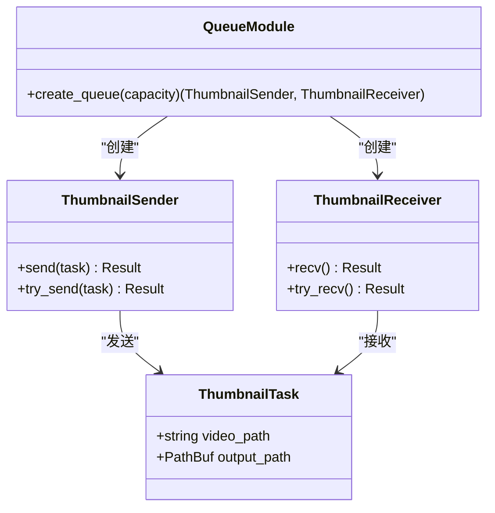
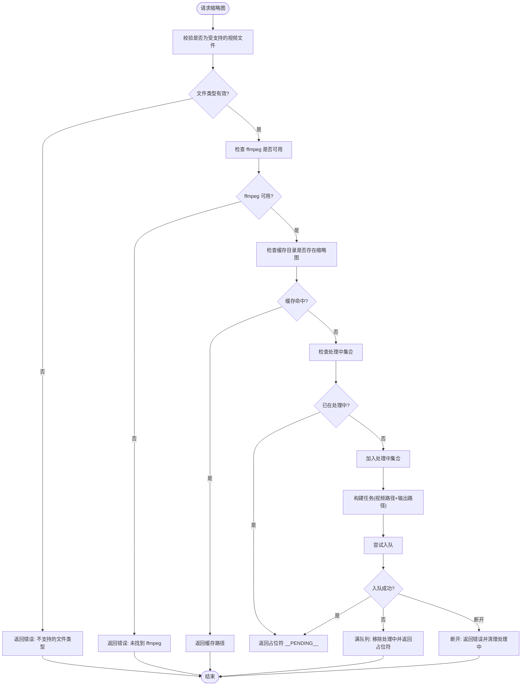
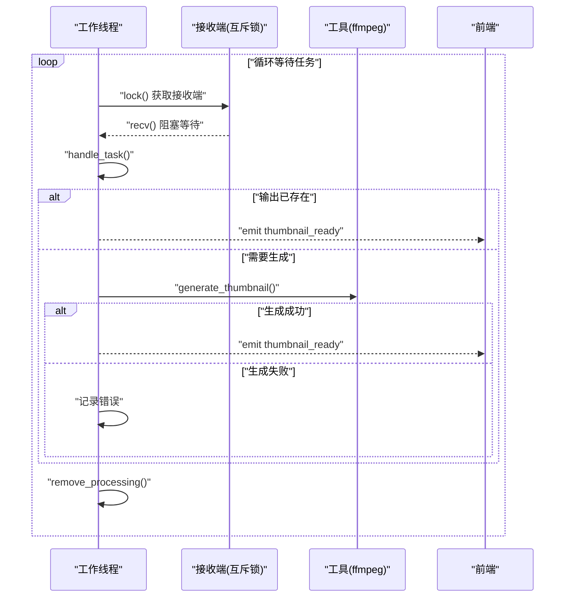
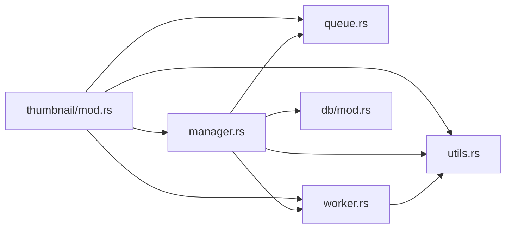

# 缩略图队列系统

<cite>
**本文档引用的文件**
- [src-tauri/src/thumbnail/queue.rs](file://src-tauri/src/thumbnail/queue.rs)
- [src-tauri/src/thumbnail/manager.rs](file://src-tauri/src/thumbnail/manager.rs)
- [src-tauri/src/thumbnail/worker.rs](file://src-tauri/src/thumbnail/worker.rs)
- [src-tauri/src/thumbnail/mod.rs](file://src-tauri/src/thumbnail/mod.rs)
- [src-tauri/src/thumbnail/utils.rs](file://src-tauri/src/thumbnail/utils.rs)
- [src-tauri/src/main.rs](file://src-tauri/src/main.rs)
- [src-tauri/src/db/mod.rs](file://src-tauri/src/db/mod.rs)
- [src/components/MediaCard.tsx](file://src/components/MediaCard.tsx)
- [src/store/useAppStore.ts](file://src/store/useAppStore.ts)
</cite>

## 目录
1. [简介](#简介)
2. [项目结构](#项目结构)
3. [核心组件](#核心组件)
4. [架构总览](#架构总览)
5. [详细组件分析](#详细组件分析)
6. [依赖关系分析](#依赖关系分析)
7. [性能考虑](#性能考虑)
8. [故障排查指南](#故障排查指南)
9. [结论](#结论)
10. [附录](#附录)

## 简介
本技术文档围绕缩略图队列系统展开，系统采用异步任务队列实现视频缩略图的生成与分发，具备以下关键能力：
- 队列容量管理：基于同步通道的有界队列，支持容量上限与满队列丢弃策略
- 任务去重：通过“处理中集合”避免重复提交同一视频的缩略图任务
- 生产者-消费者模式：前端或扫描器作为生产者，后台工作线程池作为消费者
- 阻塞策略：工作线程在无任务时阻塞等待，降低空转开销
- 状态监控与告警：通过占位符返回与日志输出实现基本状态反馈
- 与工作线程池协调：固定数量的工作线程并行消费队列任务
- 持久化与恢复：缩略图结果持久化到缓存目录，应用重启后可直接使用
- 故障转移：当队列满或断开时，系统以占位符返回并记录错误，保证前端体验连续性

## 项目结构
缩略图子系统位于 Rust 后端模块 src-tauri 的 thumbnail 子目录中，前端通过 Tauri 命令调用后端接口，后端通过多线程工作池异步生成缩略图并通过事件通知前端。

**图表来源**
- [src-tauri/src/main.rs:10-69](file://src-tauri/src/main.rs#L10-L69)
- [src-tauri/src/thumbnail/mod.rs:1-62](file://src-tauri/src/thumbnail/mod.rs#L1-L62)
- [src-tauri/src/thumbnail/manager.rs:1-108](file://src-tauri/src/thumbnail/manager.rs#L1-L108)
- [src-tauri/src/thumbnail/queue.rs:1-12](file://src-tauri/src/thumbnail/queue.rs#L1-L12)
- [src-tauri/src/thumbnail/worker.rs:1-96](file://src-tauri/src/thumbnail/worker.rs#L1-L96)
- [src-tauri/src/thumbnail/utils.rs:1-158](file://src-tauri/src/thumbnail/utils.rs#L1-L158)
- [src-tauri/src/db/mod.rs:1-123](file://src-tauri/src/db/mod.rs#L1-L123)

**章节来源**
- [src-tauri/src/main.rs:10-69](file://src-tauri/src/main.rs#L10-L69)
- [src-tauri/src/thumbnail/mod.rs:1-62](file://src-tauri/src/thumbnail/mod.rs#L1-L62)

## 核心组件
- 队列定义与创建：提供同步通道的发送端与接收端封装，支持指定容量
- 管理器：负责初始化缓存目录、解析 ffmpeg 路径、启动工作线程池、提交任务、任务去重与异常处理
- 工作线程池：固定数量的工作线程从队列取出任务，调用 ffmpeg 生成缩略图，并通过 Tauri 事件通知前端
- 工具函数：提供缓存目录解析、输出路径计算、ffmpeg 可执行文件查找与缩略图生成
- 前端集成：通过 Tauri 命令请求缩略图，监听缩略图就绪事件更新 UI

**章节来源**
- [src-tauri/src/thumbnail/queue.rs:1-12](file://src-tauri/src/thumbnail/queue.rs#L1-L12)
- [src-tauri/src/thumbnail/manager.rs:16-108](file://src-tauri/src/thumbnail/manager.rs#L16-L108)
- [src-tauri/src/thumbnail/worker.rs:13-96](file://src-tauri/src/thumbnail/worker.rs#L13-L96)
- [src-tauri/src/thumbnail/utils.rs:20-96](file://src-tauri/src/thumbnail/utils.rs#L20-L96)
- [src-tauri/src/thumbnail/mod.rs:14-28](file://src-tauri/src/thumbnail/mod.rs#L14-L28)

## 架构总览
系统采用“命令驱动 + 异步队列 + 多线程工作池”的架构。前端通过 Tauri 命令触发缩略图生成请求；后端管理器进行输入校验、去重与入队；工作线程池并发消费任务并生成缩略图；完成后通过事件通知前端刷新 UI。

**图表来源**
- [src-tauri/src/main.rs:49-65](file://src-tauri/src/main.rs#L49-L65)
- [src-tauri/src/thumbnail/mod.rs:57-62](file://src-tauri/src/thumbnail/mod.rs#L57-L62)
- [src-tauri/src/thumbnail/manager.rs:51-106](file://src-tauri/src/thumbnail/manager.rs#L51-L106)
- [src-tauri/src/thumbnail/queue.rs:8-11](file://src-tauri/src/thumbnail/queue.rs#L8-L11)
- [src-tauri/src/thumbnail/worker.rs:26-79](file://src-tauri/src/thumbnail/worker.rs#L26-L79)
- [src-tauri/src/thumbnail/utils.rs:36-61](file://src-tauri/src/thumbnail/utils.rs#L36-L61)
- [src/components/MediaCard.tsx:153-170](file://src/components/MediaCard.tsx#L153-L170)

## 详细组件分析

### 队列与任务模型
- 队列类型：同步通道（有界），发送端为同步发送，接收端通过互斥锁保护
- 任务模型：包含视频路径与输出路径两个字段
- 占位符：用于表示“正在处理中”的占位字符串

**图表来源**
- [src-tauri/src/thumbnail/queue.rs:5-11](file://src-tauri/src/thumbnail/queue.rs#L5-L11)
- [src-tauri/src/thumbnail/mod.rs:18-22](file://src-tauri/src/thumbnail/mod.rs#L18-L22)

**章节来源**
- [src-tauri/src/thumbnail/queue.rs:1-12](file://src-tauri/src/thumbnail/queue.rs#L1-L12)
- [src-tauri/src/thumbnail/mod.rs:18-28](file://src-tauri/src/thumbnail/mod.rs#L18-L28)

### 管理器：任务入队与去重
- 初始化：解析缓存目录、查找 ffmpeg、创建队列、启动工作线程池
- 请求处理：校验输入、检查缓存、检查“处理中集合”、构造任务、尝试入队
- 满队列处理：移除“处理中”标记并返回占位符，避免前端长时间挂起
- 断开处理：返回错误并清理“处理中”标记

**图表来源**
- [src-tauri/src/thumbnail/manager.rs:51-106](file://src-tauri/src/thumbnail/manager.rs#L51-L106)
- [src-tauri/src/thumbnail/utils.rs:20-34](file://src-tauri/src/thumbnail/utils.rs#L20-L34)

**章节来源**
- [src-tauri/src/thumbnail/manager.rs:24-49](file://src-tauri/src/thumbnail/manager.rs#L24-L49)
- [src-tauri/src/thumbnail/manager.rs:51-106](file://src-tauri/src/thumbnail/manager.rs#L51-L106)

### 工作线程池：任务出队与执行
- 线程创建：根据配置创建工作线程，每个线程独立持有接收端与共享状态
- 阻塞等待：使用互斥锁保护接收端，阻塞等待任务
- 执行流程：若输出已存在则直接通知；否则检查 ffmpeg 并生成缩略图；最后清理“处理中”集合
- 事件通知：通过 Tauri 发送“缩略图就绪”事件

**图表来源**
- [src-tauri/src/thumbnail/worker.rs:26-79](file://src-tauri/src/thumbnail/worker.rs#L26-L79)
- [src-tauri/src/thumbnail/utils.rs:36-61](file://src-tauri/src/thumbnail/utils.rs#L36-L61)

**章节来源**
- [src-tauri/src/thumbnail/worker.rs:13-50](file://src-tauri/src/thumbnail/worker.rs#L13-L50)
- [src-tauri/src/thumbnail/worker.rs:52-96](file://src-tauri/src/thumbnail/worker.rs#L52-L96)

### 工具函数：缓存与 ffmpeg 解析
- 缓存目录：基于应用数据目录创建缩略图缓存目录
- 输出路径：对视频路径进行哈希生成唯一文件名
- ffmpeg 查找：优先资源目录，其次开发目录，再回退系统 PATH，最后尝试常见 Homebrew 路径
- 缩略图生成：调用 ffmpeg 在指定时间截取帧并缩放输出

**章节来源**
- [src-tauri/src/thumbnail/utils.rs:20-34](file://src-tauri/src/thumbnail/utils.rs#L20-L34)
- [src-tauri/src/thumbnail/utils.rs:71-96](file://src-tauri/src/thumbnail/utils.rs#L71-L96)
- [src-tauri/src/thumbnail/utils.rs:36-61](file://src-tauri/src/thumbnail/utils.rs#L36-L61)

### 前端集成：命令与事件
- 命令注册：在主程序中注册缩略图请求命令
- 前端调用：组件渲染时调用命令请求缩略图
- 事件监听：监听“缩略图就绪”事件，更新媒体卡片的缩略图显示

**章节来源**
- [src-tauri/src/main.rs:49-65](file://src-tauri/src/main.rs#L49-L65)
- [src/components/MediaCard.tsx:153-170](file://src/components/MediaCard.tsx#L153-L170)

## 依赖关系分析
- 模块耦合：thumbnail 模块内部高内聚，manager 依赖 queue、worker、utils；worker 依赖 queue 与 utils；mod 提供统一入口与常量
- 外部依赖：Tauri 用于命令与事件通信；ffmpeg 用于缩略图生成；SQLite 用于媒体元数据存储
- 线程安全：通过互斥锁保护接收端与“处理中集合”，避免竞态条件

**图表来源**
- [src-tauri/src/thumbnail/mod.rs:1-62](file://src-tauri/src/thumbnail/mod.rs#L1-L62)
- [src-tauri/src/thumbnail/manager.rs:1-14](file://src-tauri/src/thumbnail/manager.rs#L1-L14)
- [src-tauri/src/thumbnail/worker.rs:1-11](file://src-tauri/src/thumbnail/worker.rs#L1-L11)
- [src-tauri/src/db/mod.rs:1-123](file://src-tauri/src/db/mod.rs#L1-L123)

**章节来源**
- [src-tauri/src/thumbnail/mod.rs:1-62](file://src-tauri/src/thumbnail/mod.rs#L1-L62)
- [src-tauri/src/thumbnail/manager.rs:1-14](file://src-tauri/src/thumbnail/manager.rs#L1-L14)
- [src-tauri/src/thumbnail/worker.rs:1-11](file://src-tauri/src/thumbnail/worker.rs#L1-L11)
- [src-tauri/src/db/mod.rs:1-123](file://src-tauri/src/db/mod.rs#L1-L123)

## 性能考虑
- 队列容量：默认容量较大，适合批量生成场景；可根据内存与 CPU 资源调整
- 工作线程数：固定数量的工作线程，建议与 CPU 核心数匹配或略低以避免上下文切换开销
- I/O 与 CPU：缩略图生成主要受 ffmpeg I/O 与编码影响，建议在 SSD 上存放缓存目录
- 去重策略：通过“处理中集合”避免重复任务，减少无效计算
- 阻塞策略：工作线程阻塞等待任务，降低空转 CPU 占用
- 前端体验：满队列时返回占位符，避免 UI 卡顿

[本节为通用性能指导，不直接分析具体文件]

## 故障排查指南
- ffmpeg 未找到：检查资源目录、开发目录与系统 PATH；确认常见 Homebrew 路径
- 队列满：观察日志中的“队列已满”提示；适当增大容量或减少并发
- 断开连接：队列断开通常由工作线程异常导致；检查日志并重启应用
- 缓存问题：确认缓存目录权限与磁盘空间；必要时清理缓存目录
- 事件未到达：检查前端是否正确监听“thumbnail_ready”事件

**章节来源**
- [src-tauri/src/thumbnail/manager.rs:55-102](file://src-tauri/src/thumbnail/manager.rs#L55-L102)
- [src-tauri/src/thumbnail/worker.rs:32-39](file://src-tauri/src/thumbnail/worker.rs#L32-L39)
- [src-tauri/src/thumbnail/utils.rs:71-96](file://src-tauri/src/thumbnail/utils.rs#L71-L96)

## 结论
该缩略图队列系统通过同步有界队列与固定大小工作线程池实现了稳定的异步缩略图生成能力。系统具备任务去重、占位符返回、事件通知等机制，确保了前端体验的连续性与系统的健壮性。通过合理的容量与线程配置，可在不同硬件环境下取得良好性能表现。

[本节为总结性内容，不直接分析具体文件]

## 附录

### 配置参数与默认值
- 工作线程数：固定常量
- 队列容量：固定常量
- 占位符：固定常量

**章节来源**
- [src-tauri/src/thumbnail/mod.rs:14-16](file://src-tauri/src/thumbnail/mod.rs#L14-L16)

### 监控与告警建议
- 日志级别：队列满与断开连接时输出错误日志
- 前端提示：渲染时显示“生成缩略图...”占位状态
- 事件驱动：通过“缩略图就绪”事件刷新 UI

**章节来源**
- [src-tauri/src/thumbnail/manager.rs:85-94](file://src-tauri/src/thumbnail/manager.rs#L85-L94)
- [src-tauri/src/thumbnail/worker.rs:81-89](file://src-tauri/src/thumbnail/worker.rs#L81-L89)
- [src/components/MediaCard.tsx:165-170](file://src/components/MediaCard.tsx#L165-L170)

### 持久化与恢复
- 缓存目录：应用数据目录下的缩略图缓存
- 恢复策略：应用重启后直接读取缓存文件，无需重新生成

**章节来源**
- [src-tauri/src/thumbnail/utils.rs:20-29](file://src-tauri/src/thumbnail/utils.rs#L20-L29)
- [src-tauri/src/thumbnail/manager.rs:61-64](file://src-tauri/src/thumbnail/manager.rs#L61-L64)