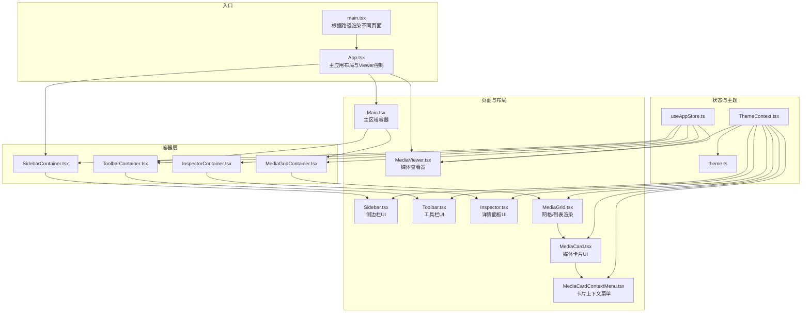
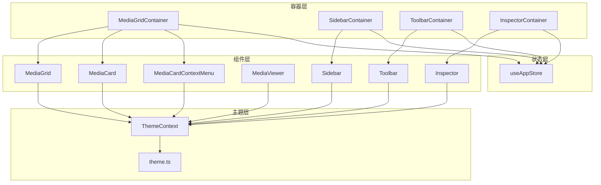
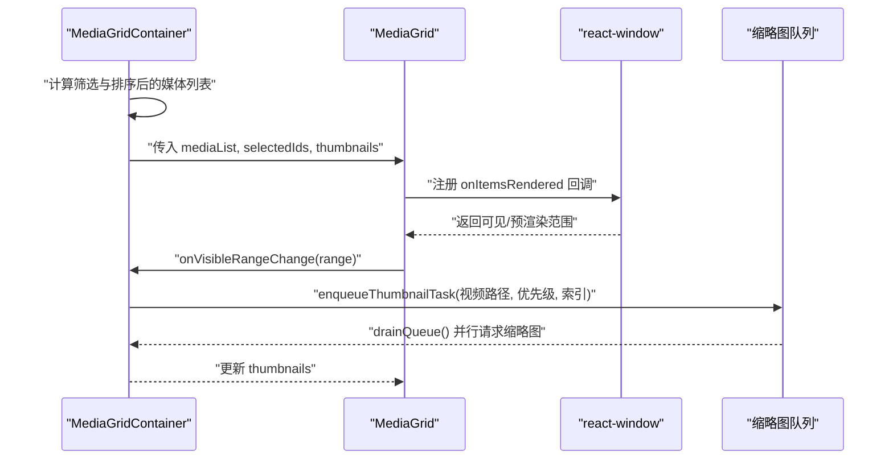
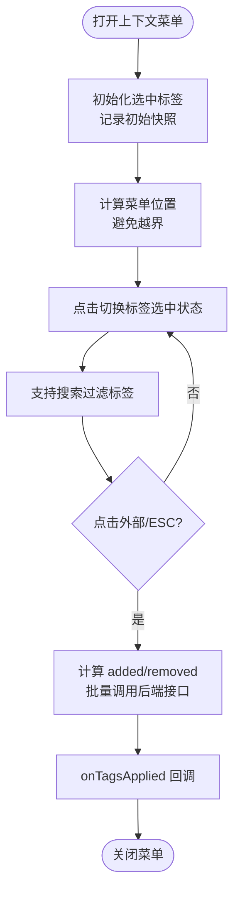
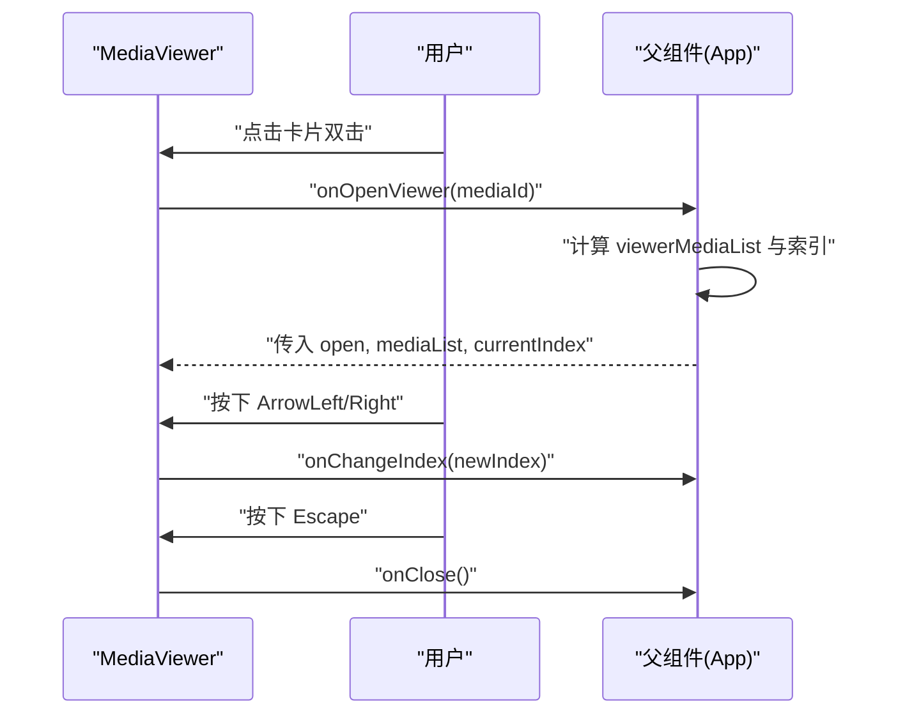
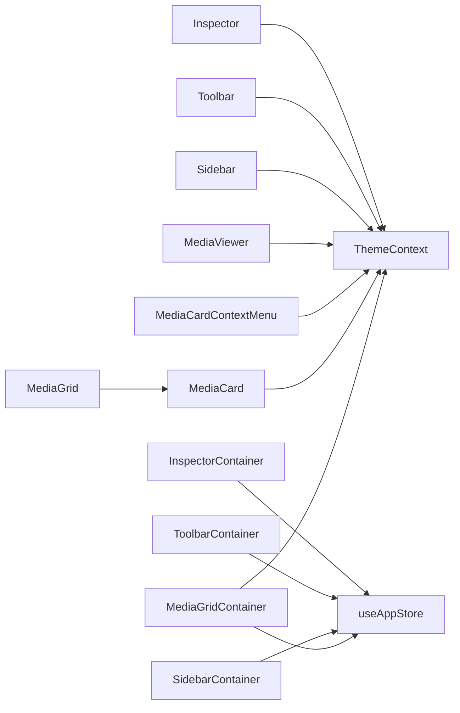

# React 组件规范

<cite>
**本文引用的文件**
- [src/App.tsx](file://src/App.tsx)
- [src/main.tsx](file://src/main.tsx)
- [src/components/Main.tsx](file://src/components/Main.tsx)
- [src/components/MediaGrid.tsx](file://src/components/MediaGrid.tsx)
- [src/components/MediaCard.tsx](file://src/components/MediaCard.tsx)
- [src/components/MediaCardContextMenu.tsx](file://src/components/MediaCardContextMenu.tsx)
- [src/components/MediaViewer.tsx](file://src/components/MediaViewer.tsx)
- [src/components/Sidebar.tsx](file://src/components/Sidebar.tsx)
- [src/components/Toolbar.tsx](file://src/components/Toolbar.tsx)
- [src/components/Inspector.tsx](file://src/components/Inspector.tsx)
- [src/containers/MediaGridContainer.tsx](file://src/containers/MediaGridContainer.tsx)
- [src/containers/SidebarContainer.tsx](file://src/containers/SidebarContainer.tsx)
- [src/containers/ToolbarContainer.tsx](file://src/containers/ToolbarContainer.tsx)
- [src/containers/InspectorContainer.tsx](file://src/containers/InspectorContainer.tsx)
- [src/store/useAppStore.ts](file://src/store/useAppStore.ts)
- [src/contexts/ThemeContext.tsx](file://src/contexts/ThemeContext.tsx)
- [src/theme/theme.ts](file://src/theme/theme.ts)
</cite>

## 目录
1. [简介](#简介)
2. [项目结构](#项目结构)
3. [核心组件](#核心组件)
4. [架构总览](#架构总览)
5. [详细组件分析](#详细组件分析)
6. [依赖关系分析](#依赖关系分析)
7. [性能考虑](#性能考虑)
8. [测试规范](#测试规范)
9. [可访问性要求](#可访问性要求)
10. [故障排查指南](#故障排查指南)
11. [结论](#结论)

## 简介
本规范面向 Medex 项目中的 React 组件与容器，系统化定义函数组件编写规范、Hooks 使用规范、组件设计原则、测试与性能优化策略以及可访问性要求。内容以仓库现有实现为依据，结合代码结构与交互流程，提供可落地的最佳实践与反例警示。

## 项目结构
Medex 采用“容器 + 组件”分层组织方式：
- 容器层负责状态管理、副作用与业务逻辑，向子组件注入 props。
- 组件层负责 UI 呈现与用户交互，尽量保持纯函数特性。
- 主入口负责路由式页面渲染与主题提供者包裹。

**图表来源**
- [src/main.tsx:1-44](file://src/main.tsx#L1-L44)
- [src/App.tsx:1-73](file://src/App.tsx#L1-L73)
- [src/components/Main.tsx:1-25](file://src/components/Main.tsx#L1-L25)
- [src/containers/MediaGridContainer.tsx:1-619](file://src/containers/MediaGridContainer.tsx#L1-L619)
- [src/containers/SidebarContainer.tsx:1-79](file://src/containers/SidebarContainer.tsx#L1-L79)
- [src/containers/ToolbarContainer.tsx:1-113](file://src/containers/ToolbarContainer.tsx#L1-L113)
- [src/containers/InspectorContainer.tsx:1-32](file://src/containers/InspectorContainer.tsx#L1-L32)
- [src/components/MediaGrid.tsx:1-351](file://src/components/MediaGrid.tsx#L1-L351)
- [src/components/MediaCard.tsx:1-318](file://src/components/MediaCard.tsx#L1-L318)
- [src/components/MediaCardContextMenu.tsx:1-255](file://src/components/MediaCardContextMenu.tsx#L1-L255)
- [src/components/MediaViewer.tsx:1-186](file://src/components/MediaViewer.tsx#L1-L186)
- [src/components/Sidebar.tsx:1-145](file://src/components/Sidebar.tsx#L1-L145)
- [src/components/Toolbar.tsx:1-75](file://src/components/Toolbar.tsx#L1-L75)
- [src/components/Inspector.tsx:1-277](file://src/components/Inspector.tsx#L1-L277)
- [src/store/useAppStore.ts:1-395](file://src/store/useAppStore.ts#L1-L395)
- [src/contexts/ThemeContext.tsx:1-99](file://src/contexts/ThemeContext.tsx#L1-L99)
- [src/theme/theme.ts:1-159](file://src/theme/theme.ts#L1-L159)

**章节来源**
- [src/main.tsx:1-44](file://src/main.tsx#L1-L44)
- [src/App.tsx:1-73](file://src/App.tsx#L1-L73)

## 核心组件
- 函数组件编写规范
  - 命名：组件名使用帕斯卡命名法；容器组件以 Container 结尾，UI 组件不带后缀或以 UI 结尾。
  - Props 类型：使用 TypeScript 接口定义 props，明确必填/可选字段与默认值。
  - 默认参数：在函数签名处提供合理默认值，避免运行时空值判断。
  - 事件回调：统一以 onXxx 命名，避免在子组件内直接修改父状态。
  - 样式与主题：通过 ThemeContext 注入主题对象，避免硬编码颜色。
- Hooks 使用规范
  - 自定义 Hooks：将可复用逻辑封装为独立 Hook，返回纯数据与方法，避免直接操作 DOM。
  - 状态管理：优先使用 Zustand（useAppStore）集中管理全局状态，容器组件按需订阅。
  - 副作用：useEffect 仅用于副作用，且必须清理；避免在 effect 内进行昂贵计算。
  - 依赖数组：严格维护 deps，避免遗漏或过度依赖导致的死循环或过期状态。
- 组件设计原则
  - 单一职责：每个组件只负责一个功能域，复杂逻辑下沉至容器或自定义 Hook。
  - 组件复用：通过接口抽象 props，使组件可在不同场景复用。
  - 状态提升：共享状态上移至最近公共祖先容器，避免兄弟组件间重复状态。
  - 受控与非受控：对外暴露受控 props（如 open、value），内部状态最小化。
- 示例与反例
  - 正例：MediaGridContainer 将媒体过滤、多选、上下文菜单、缩略图队列等逻辑集中在容器中，UI 组件仅负责渲染。
  - 反例：避免在 UI 组件中直接发起网络请求或直接操作全局状态，应通过容器或自定义 Hook 抽离。

**章节来源**
- [src/components/MediaGrid.tsx:13-351](file://src/components/MediaGrid.tsx#L13-L351)
- [src/components/MediaCard.tsx:6-318](file://src/components/MediaCard.tsx#L6-L318)
- [src/containers/MediaGridContainer.tsx:12-619](file://src/containers/MediaGridContainer.tsx#L12-L619)
- [src/store/useAppStore.ts:48-395](file://src/store/useAppStore.ts#L48-L395)

## 架构总览
Medex 的前端采用“容器 + 组件 + 状态 + 主题”的分层架构：
- 容器层：负责业务逻辑、状态订阅与副作用，向下传递 props。
- 组件层：负责 UI 呈现，接收 props 并触发回调。
- 状态层：Zustand 提供全局状态，容器通过 selector 订阅局部状态。
- 主题层：ThemeContext 提供主题模式与颜色变量，贯穿所有组件。

**图表来源**
- [src/containers/MediaGridContainer.tsx:30-619](file://src/containers/MediaGridContainer.tsx#L30-L619)
- [src/containers/SidebarContainer.tsx:7-79](file://src/containers/SidebarContainer.tsx#L7-L79)
- [src/containers/ToolbarContainer.tsx:14-113](file://src/containers/ToolbarContainer.tsx#L14-L113)
- [src/containers/InspectorContainer.tsx:6-32](file://src/containers/InspectorContainer.tsx#L6-L32)
- [src/components/MediaGrid.tsx:70-351](file://src/components/MediaGrid.tsx#L70-L351)
- [src/components/MediaCard.tsx:34-318](file://src/components/MediaCard.tsx#L34-L318)
- [src/components/MediaCardContextMenu.tsx:23-255](file://src/components/MediaCardContextMenu.tsx#L23-L255)
- [src/components/MediaViewer.tsx:14-186](file://src/components/MediaViewer.tsx#L14-L186)
- [src/components/Sidebar.tsx:17-145](file://src/components/Sidebar.tsx#L17-L145)
- [src/components/Toolbar.tsx:12-75](file://src/components/Toolbar.tsx#L12-L75)
- [src/components/Inspector.tsx:19-277](file://src/components/Inspector.tsx#L19-L277)
- [src/store/useAppStore.ts:145-395](file://src/store/useAppStore.ts#L145-L395)
- [src/contexts/ThemeContext.tsx:17-99](file://src/contexts/ThemeContext.tsx#L17-L99)
- [src/theme/theme.ts:8-159](file://src/theme/theme.ts#L8-L159)

## 详细组件分析

### MediaGrid 容器与 MediaGrid 组件
- 设计要点
  - 容器负责：媒体过滤、排序、视口可见范围计算、缩略图队列与并发控制、主题注入。
  - 组件负责：基于 react-window 的虚拟滚动，网格/列表两种视图，响应尺寸变化。
- 关键实现
  - 容器通过 selector 订阅媒体列表与导航状态，计算筛选后的媒体集合。
  - 组件使用 ResizeObserver 获取容器尺寸，计算列数与行数，传入虚拟列表。
  - 通过 onVisibleRangeChange 回调驱动缩略图预取队列。
- 性能优化
  - 使用 useMemo 缓存派生数据，减少不必要的重渲染。
  - 使用 useCallback 包裹事件处理器，稳定函数引用。
  - 虚拟滚动降低 DOM 节点数量，提升大数据集渲染性能。

**图表来源**
- [src/containers/MediaGridContainer.tsx:203-486](file://src/containers/MediaGridContainer.tsx#L203-L486)
- [src/components/MediaGrid.tsx:70-212](file://src/components/MediaGrid.tsx#L70-L212)

**章节来源**
- [src/containers/MediaGridContainer.tsx:12-619](file://src/containers/MediaGridContainer.tsx#L12-L619)
- [src/components/MediaGrid.tsx:13-351](file://src/components/MediaGrid.tsx#L13-L351)

### MediaCard 与 MediaCardContextMenu
- 设计要点
  - MediaCard：接收主题、选中态、收藏、标签等 props，内部处理图片/视频缩略图加载与错误回退。
  - MediaCardContextMenu：支持标签搜索、多选标签、边界适配、点击外部关闭与 ESC 关闭。
- 关键实现
  - MediaCard 使用 memo + 自定义比较函数，避免无关 props 变化导致重渲染。
  - 上下文菜单通过 useRef 管理初始标签快照，关闭时自动提交差异。
- 可访问性
  - 按钮提供 aria-label/title，鼠标悬停与离开时动态改变背景色，增强可用性。

**图表来源**
- [src/components/MediaCardContextMenu.tsx:23-255](file://src/components/MediaCardContextMenu.tsx#L23-L255)

**章节来源**
- [src/components/MediaCard.tsx:6-318](file://src/components/MediaCard.tsx#L6-L318)
- [src/components/MediaCardContextMenu.tsx:1-255](file://src/components/MediaCardContextMenu.tsx#L1-L255)

### MediaViewer 媒体查看器
- 设计要点
  - 支持键盘左右键切换、ESC 关闭、禁用态样式提示。
  - 根据媒体类型自动选择 video 或 img 渲染。
- 关键实现
  - 使用 useMemo 保障索引安全，避免越界。
  - 键盘事件监听在组件挂载时注册，卸载时清理。

**图表来源**
- [src/App.tsx:28-57](file://src/App.tsx#L28-L57)
- [src/components/MediaViewer.tsx:14-186](file://src/components/MediaViewer.tsx#L14-L186)

**章节来源**
- [src/App.tsx:1-73](file://src/App.tsx#L1-L73)
- [src/components/MediaViewer.tsx:1-186](file://src/components/MediaViewer.tsx#L1-L186)

### Sidebar 与 SidebarContainer
- 设计要点
  - SidebarContainer 负责标签加载、创建、删除与事件监听。
  - Sidebar 仅负责 UI 呈现与交互回调。
- 关键实现
  - 通过 invoke 与 Tauri 事件实现标签与媒体库的双向同步。

**章节来源**
- [src/containers/SidebarContainer.tsx:1-79](file://src/containers/SidebarContainer.tsx#L1-L79)
- [src/components/Sidebar.tsx:1-145](file://src/components/Sidebar.tsx#L1-L145)

### Toolbar 与 ToolbarContainer
- 设计要点
  - ToolbarContainer 负责媒体类型过滤、扫描进度监听与结果计数。
  - Toolbar 仅呈现标签与计数、媒体类型切换按钮。
- 关键实现
  - 使用 listen 订阅扫描完成事件，完成后刷新媒体列表并显示状态消息。

**章节来源**
- [src/containers/ToolbarContainer.tsx:1-113](file://src/containers/ToolbarContainer.tsx#L1-L113)
- [src/components/Toolbar.tsx:1-75](file://src/components/Toolbar.tsx#L1-L75)

### Inspector 与 InspectorContainer
- 设计要点
  - InspectorContainer 将选中媒体映射为 MediaCardProps，注入 Inspector。
  - Inspector 负责媒体详情、标签增删、收藏与删除操作。
- 关键实现
  - 通过事件监听自动刷新标签列表，避免手动刷新。

**章节来源**
- [src/containers/InspectorContainer.tsx:1-32](file://src/containers/InspectorContainer.tsx#L1-L32)
- [src/components/Inspector.tsx:1-277](file://src/components/Inspector.tsx#L1-L277)

## 依赖关系分析
- 组件依赖
  - UI 组件依赖 ThemeContext 提供的颜色变量，避免硬编码。
  - 容器组件依赖 useAppStore 的 selector 订阅状态，避免全局重渲染。
- 外部依赖
  - @tauri-apps/api 用于与后端通信与事件监听。
  - react-window 用于虚拟列表/网格渲染。
- 循环依赖
  - 未发现直接循环依赖；容器与组件通过 props 解耦。

**图表来源**
- [src/containers/MediaGridContainer.tsx:30-619](file://src/containers/MediaGridContainer.tsx#L30-L619)
- [src/components/MediaGrid.tsx:70-351](file://src/components/MediaGrid.tsx#L70-L351)
- [src/components/MediaCard.tsx:34-318](file://src/components/MediaCard.tsx#L34-L318)
- [src/components/MediaCardContextMenu.tsx:23-255](file://src/components/MediaCardContextMenu.tsx#L23-L255)
- [src/components/MediaViewer.tsx:14-186](file://src/components/MediaViewer.tsx#L14-L186)
- [src/containers/SidebarContainer.tsx:7-79](file://src/containers/SidebarContainer.tsx#L7-L79)
- [src/components/Sidebar.tsx:17-145](file://src/components/Sidebar.tsx#L17-L145)
- [src/containers/ToolbarContainer.tsx:14-113](file://src/containers/ToolbarContainer.tsx#L14-L113)
- [src/components/Toolbar.tsx:12-75](file://src/components/Toolbar.tsx#L12-L75)
- [src/containers/InspectorContainer.tsx:6-32](file://src/containers/InspectorContainer.tsx#L6-L32)
- [src/components/Inspector.tsx:19-277](file://src/components/Inspector.tsx#L19-L277)
- [src/store/useAppStore.ts:145-395](file://src/store/useAppStore.ts#L145-L395)
- [src/contexts/ThemeContext.tsx:17-99](file://src/contexts/ThemeContext.tsx#L17-L99)

**章节来源**
- [src/store/useAppStore.ts:145-395](file://src/store/useAppStore.ts#L145-L395)
- [src/contexts/ThemeContext.tsx:17-99](file://src/contexts/ThemeContext.tsx#L17-L99)

## 性能考虑
- 渲染优化
  - 使用 memo 与自定义比较函数（如 MediaCard）避免不必要重渲染。
  - 使用 useMemo 缓存派生数据（如筛选、排序、主题样式）。
  - 使用 useCallback 包裹事件处理器，稳定函数引用。
- 虚拟化
  - MediaGrid 使用 react-window 的 FixedSizeGrid/List，大幅降低 DOM 数量。
- 异步与节流
  - 容器中对高频事件（如滚动、尺寸变化）进行节流/去抖处理，避免频繁触发。
- 图片与缩略图
  - 使用 lazy 加载与错误回退，避免阻塞主线程。
  - 缩略图请求采用队列与并发限制，避免资源争用。

[本节为通用指导，无需特定文件来源]

## 测试规范
- 单元测试
  - 对纯函数与 Hook 返回值进行断言，验证 props 输入与输出一致性。
  - 使用 React Testing Library 渲染组件，模拟事件（点击、键盘、滚动）并断言行为。
- 状态测试
  - 使用 useAppStore 的 selector 订阅局部状态，断言容器组件在不同输入下的状态变化。
- 可访问性测试
  - 使用 axe-core 或类似工具检查无障碍属性（aria-*、title、label）是否完整。
- 端到端测试
  - 使用 Playwright/Cypress 覆盖关键用户流程（标签增删、媒体查看、主题切换）。

[本节为通用指导，无需特定文件来源]

## 可访问性要求
- 语义化与标签
  - 所有交互元素提供 aria-label 或 title，按钮与链接具备可读标题。
- 键盘导航
  - 支持 Tab 切换焦点，Enter/Space 触发操作，Esc 关闭对话框或菜单。
- 颜色与对比度
  - 通过 ThemeContext 提供高对比度颜色，确保文本与背景满足对比度要求。
- 屏幕阅读器
  - 重要状态变化（如扫描完成、标签更新）通过事件通知，便于辅助技术感知。

[本节为通用指导，无需特定文件来源]

## 故障排查指南
- 常见问题
  - 缩略图不显示：检查 convertFileSrc 转换与 __PENDING__ 状态，确认队列与并发限制。
  - 标签更新不同步：确认事件 medex:tags-updated 与 medex:media-tags-updated 是否正确派发。
  - 主题不生效：检查 ThemeContext 是否包裹根节点，data-theme 属性是否正确设置。
- 排查步骤
  - 在容器组件中打印关键状态（如 mediaList、selectedIds、thumbnails）。
  - 使用浏览器开发者工具监控网络请求与事件监听器数量。
  - 检查 useEffect 的依赖数组是否完整，是否存在内存泄漏。

**章节来源**
- [src/containers/MediaGridContainer.tsx:294-308](file://src/containers/MediaGridContainer.tsx#L294-L308)
- [src/containers/InspectorContainer.tsx:47-53](file://src/containers/InspectorContainer.tsx#L47-L53)
- [src/contexts/ThemeContext.tsx:46-54](file://src/contexts/ThemeContext.tsx#L46-L54)

## 结论
Medex 的组件体系遵循“容器承载业务、组件专注 UI、状态集中管理、主题统一注入”的设计原则。通过合理的 props 抽象、严格的 Hooks 使用规范与完善的性能优化策略，项目在复杂媒体管理场景下仍能保持良好的可维护性与用户体验。建议在后续迭代中持续完善测试覆盖与可访问性检查，确保质量与包容性双达标。