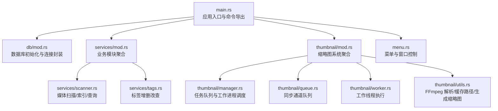
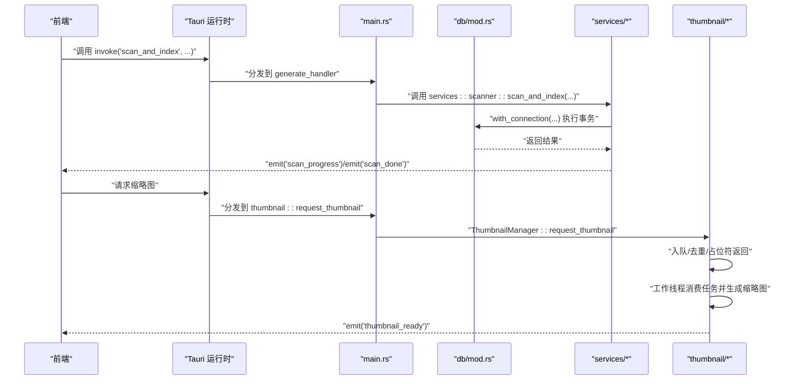
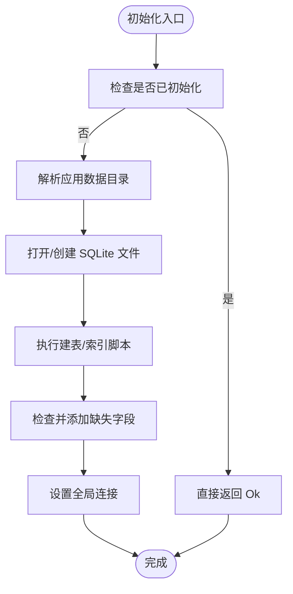
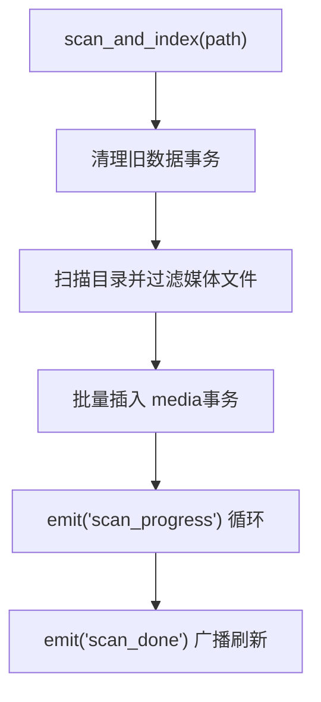
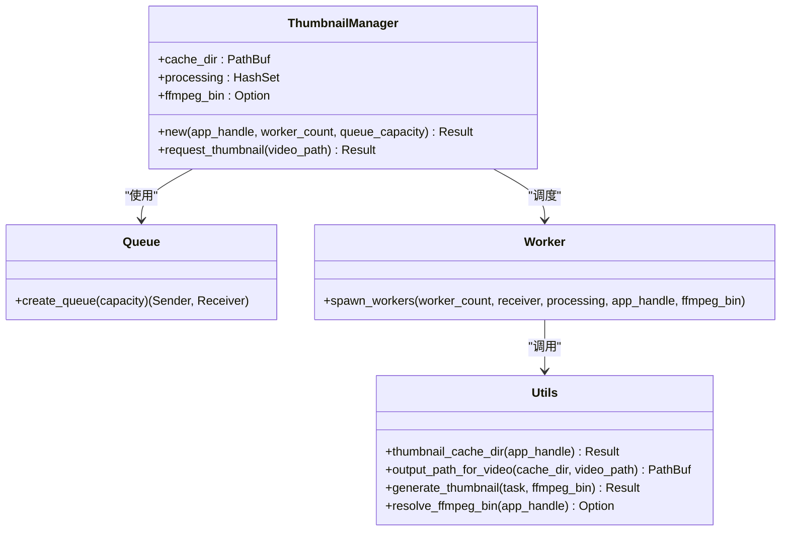
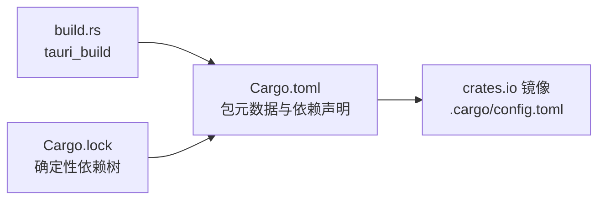

# Rust 后端编码规范

<cite>
**本文引用的文件**
- [Cargo.toml](file://src-tauri/Cargo.toml)
- [main.rs](file://src-tauri/src/main.rs)
- [.cargo/config.toml](file://src-tauri/.cargo/config.toml)
- [Cargo.lock](file://src-tauri/Cargo.lock)
- [build.rs](file://src-tauri/build.rs)
- [db/mod.rs](file://src-tauri/src/db/mod.rs)
- [services/mod.rs](file://src-tauri/src/services/mod.rs)
- [thumbnail/mod.rs](file://src-tauri/src/thumbnail/mod.rs)
- [menu.rs](file://src-tauri/src/menu.rs)
- [services/scanner.rs](file://src-tauri/src/services/scanner.rs)
- [services/tags.rs](file://src-tauri/src/services/tags.rs)
- [thumbnail/manager.rs](file://src-tauri/src/thumbnail/manager.rs)
- [thumbnail/queue.rs](file://src-tauri/src/thumbnail/queue.rs)
- [thumbnail/worker.rs](file://src-tauri/src/thumbnail/worker.rs)
- [thumbnail/utils.rs](file://src-tauri/src/thumbnail/utils.rs)
</cite>

## 目录
1. [引言](#引言)
2. [项目结构](#项目结构)
3. [核心组件](#核心组件)
4. [架构总览](#架构总览)
5. [详细组件分析](#详细组件分析)
6. [依赖关系分析](#依赖关系分析)
7. [性能考量](#性能考量)
8. [故障排查指南](#故障排查指南)
9. [结论](#结论)
10. [附录](#附录)

## 引言
本文件面向 Medex 项目的 Rust 后端（Tauri 应用中的 src-tauri 子项目），系统化梳理其编码规范与工程实践，覆盖编译与构建配置、依赖管理策略、模块组织原则、所有权与借用检查、错误处理模式、并发与异步实践、性能优化与内存安全等方面。文档同时提供图示化的架构与流程说明，帮助开发者快速理解并遵循统一的编码标准。

## 项目结构
src-tauri 是 Tauri 桌面应用的后端 Rust 工程，采用模块化组织：
- 根入口：main.rs 定义应用初始化、插件注册、命令导出与菜单事件处理
- 数据层：db 模块负责 SQLite 初始化、连接池封装与事务操作
- 业务层：services 包含扫描器与标签管理功能，导出为 Tauri 命令
- 媒体缩略图：thumbnail 子模块实现多线程任务队列、工作线程与缓存目录管理
- 菜单与窗口：menu 模块负责菜单事件与子窗口打开逻辑

图表来源
- [main.rs:10-68](file://src-tauri/src/main.rs#L10-L68)
- [db/mod.rs:45-122](file://src-tauri/src/db/mod.rs#L45-L122)
- [services/mod.rs:1-3](file://src-tauri/src/services/mod.rs#L1-L3)
- [thumbnail/mod.rs:32-61](file://src-tauri/src/thumbnail/mod.rs#L32-L61)
- [menu.rs:31-51](file://src-tauri/src/menu.rs#L31-L51)

章节来源
- [main.rs:10-68](file://src-tauri/src/main.rs#L10-L68)
- [services/mod.rs:1-3](file://src-tauri/src/services/mod.rs#L1-L3)
- [thumbnail/mod.rs:1-62](file://src-tauri/src/thumbnail/mod.rs#L1-L62)

## 核心组件
- 应用入口与命令导出：在 main 中注册插件、初始化数据库与缩略图系统，并通过 generate_handler 导出业务命令
- 数据库层：使用 once_cell::sync::OnceCell 管理全局互斥连接；提供 with_connection 封装，避免重复初始化与竞态
- 业务层：扫描器负责遍历目录、识别媒体类型、批量插入、进度事件与最终刷新；标签模块提供标签 CRUD 与媒体关联
- 缩略图系统：多线程任务队列 + 工作线程，支持去重、占位符返回、容量限制与错误处理

章节来源
- [main.rs:10-68](file://src-tauri/src/main.rs#L10-L68)
- [db/mod.rs:45-122](file://src-tauri/src/db/mod.rs#L45-L122)
- [services/scanner.rs:250-341](file://src-tauri/src/services/scanner.rs#L250-L341)
- [services/tags.rs:19-220](file://src-tauri/src/services/tags.rs#L19-L220)
- [thumbnail/mod.rs:32-61](file://src-tauri/src/thumbnail/mod.rs#L32-L61)

## 架构总览
下图展示了从应用启动到命令调用、数据库访问与缩略图生成的关键交互：

图表来源
- [main.rs:49-65](file://src-tauri/src/main.rs#L49-L65)
- [services/scanner.rs:250-341](file://src-tauri/src/services/scanner.rs#L250-L341)
- [thumbnail/mod.rs:57-61](file://src-tauri/src/thumbnail/mod.rs#L57-L61)
- [thumbnail/manager.rs:51-106](file://src-tauri/src/thumbnail/manager.rs#L51-L106)

## 详细组件分析

### 数据库模块（db）
- 设计要点
  - 使用 OnceCell + Mutex 实现全局互斥连接，避免重复初始化与线程安全问题
  - 提供 with_connection 闭包封装，简化调用方对连接的借用与作用域管理
  - 初始化 SQL 包含表结构、索引与迁移逻辑（如新增 is_favorite 字段）
- 错误处理
  - 大量使用 anyhow 的 Context 扩展，保留上下文信息便于定位问题
  - 对未初始化场景返回明确错误，避免空指针或未定义行为
- 性能与安全
  - 事务批处理插入，减少磁盘写放大
  - 索引建立提升查询性能

图表来源
- [db/mod.rs:45-95](file://src-tauri/src/db/mod.rs#L45-L95)

章节来源
- [db/mod.rs:1-123](file://src-tauri/src/db/mod.rs#L1-L123)

### 业务模块（services）
- 扫描器（scanner）
  - 媒体类型识别：基于扩展名判断 image/video
  - 批量插入：使用事务包裹，降低写入开销
  - 查询聚合：联结最近观看、标签拼接，一次性返回完整数据
  - 进度与刷新：通过 emit 事件通知前端，完成后刷新页面
- 标签（tags）
  - 标签去重创建、按使用计数统计、媒体关联与解除
  - 删除前检查使用情况，防止破坏完整性

图表来源
- [services/scanner.rs:250-341](file://src-tauri/src/services/scanner.rs#L250-L341)

章节来源
- [services/scanner.rs:1-525](file://src-tauri/src/services/scanner.rs#L1-L525)
- [services/tags.rs:1-220](file://src-tauri/src/services/tags.rs#L1-L220)

### 缩略图系统（thumbnail）
- 组件关系
  - manager：队列、缓存目录、处理集合、FFmpeg 可执行路径
  - queue：同步通道（容量受限）
  - worker：多个工作线程循环消费任务
  - utils：缓存目录、输出路径、FFmpeg 查找与生成

图表来源
- [thumbnail/manager.rs:16-107](file://src-tauri/src/thumbnail/manager.rs#L16-L107)
- [thumbnail/queue.rs:8-11](file://src-tauri/src/thumbnail/queue.rs#L8-L11)
- [thumbnail/worker.rs:13-96](file://src-tauri/src/thumbnail/worker.rs#L13-L96)
- [thumbnail/utils.rs:20-157](file://src-tauri/src/thumbnail/utils.rs#L20-L157)

章节来源
- [thumbnail/mod.rs:1-62](file://src-tauri/src/thumbnail/mod.rs#L1-L62)
- [thumbnail/manager.rs:1-108](file://src-tauri/src/thumbnail/manager.rs#L1-L108)
- [thumbnail/queue.rs:1-12](file://src-tauri/src/thumbnail/queue.rs#L1-L12)
- [thumbnail/worker.rs:1-96](file://src-tauri/src/thumbnail/worker.rs#L1-L96)
- [thumbnail/utils.rs:1-158](file://src-tauri/src/thumbnail/utils.rs#L1-L158)

### 菜单与窗口（menu）
- 功能：根据菜单事件打开设置/更新窗口，显示关于对话框，退出应用
- 注意：窗口复用与焦点管理，避免重复创建

章节来源
- [menu.rs:1-52](file://src-tauri/src/menu.rs#L1-L52)

## 依赖关系分析
- Cargo.toml 指定 Rust 版本与包元数据，依赖 tauri、serde、rusqlite、anyhow、walkdir、tauri 插件等
- .cargo/config.toml 使用清华镜像加速 crates.io 拉取
- build.rs 仅委托 tauri_build::build，保持最小化构建逻辑
- Cargo.lock 记录确定性依赖树，确保可复现构建

图表来源
- [Cargo.toml:1-23](file://src-tauri/Cargo.toml#L1-L23)
- [.cargo/config.toml:1-5](file://src-tauri/.cargo/config.toml#L1-L5)
- [build.rs:1-4](file://src-tauri/build.rs#L1-L4)
- [Cargo.lock:1-800](file://src-tauri/Cargo.lock#L1-L800)

章节来源
- [Cargo.toml:1-23](file://src-tauri/Cargo.toml#L1-L23)
- [.cargo/config.toml:1-5](file://src-tauri/.cargo/config.toml#L1-L5)
- [build.rs:1-4](file://src-tauri/build.rs#L1-L4)
- [Cargo.lock:1-800](file://src-tauri/Cargo.lock#L1-L800)

## 性能考量
- 数据库
  - 事务批处理插入，减少提交次数
  - 合理索引（路径、标签关联、最近观看时间）提升查询效率
- IO 与 CPU
  - 缩略图生成依赖 FFmpeg，建议优先使用资源内嵌二进制，避免运行时查找失败
  - 队列容量与工作线程数平衡吞吐与内存占用
- 内存
  - 使用 OnceCell 避免重复分配
  - 通过闭包封装连接借用，减少不必要的拷贝与持有

## 故障排查指南
- 数据库未初始化
  - 症状：调用 with_connection 报错“未初始化”
  - 排查：确认 main 中 init_db 是否在 setup 阶段成功返回
- FFmpeg 不可用
  - 症状：缩略图生成失败或被跳过
  - 排查：检查 resolve_ffmpeg_bin 的查找顺序与权限，确认资源目录或系统 PATH
- 队列满/断开
  - 症状：request_thumbnail 返回占位符或报错
  - 排查：增大队列容量、检查工作线程是否存活、确认发送端未提前关闭

章节来源
- [db/mod.rs:97-110](file://src-tauri/src/db/mod.rs#L97-L110)
- [thumbnail/manager.rs:51-106](file://src-tauri/src/thumbnail/manager.rs#L51-L106)
- [thumbnail/utils.rs:71-96](file://src-tauri/src/thumbnail/utils.rs#L71-L96)

## 结论
本规范以模块化、安全性与可维护性为核心目标：通过 OnceCell + Mutex 管理全局资源，借助 anyhow 的上下文增强错误可诊断性；在数据库与缩略图系统中结合事务与队列机制提升性能与稳定性。建议在后续迭代中持续完善日志分级、监控埋点与资源回收策略，确保生产环境的可靠性与可观测性。

## 附录

### 编译与构建配置
- Rust 版本与特性：使用 edition 2021 与指定 rust-version，确保工具链一致性
- 构建依赖：仅引入 tauri-build，保持构建脚本简洁
- 依赖镜像：通过 .cargo/config.toml 指向清华镜像，提高拉取速度

章节来源
- [Cargo.toml:7-8](file://src-tauri/Cargo.toml#L7-L8)
- [Cargo.toml:10-11](file://src-tauri/Cargo.toml#L10-L11)
- [.cargo/config.toml:1-5](file://src-tauri/.cargo/config.toml#L1-L5)
- [build.rs:1-4](file://src-tauri/build.rs#L1-L4)

### 依赖管理策略
- 显式锁定版本：通过 Cargo.lock 固化依赖树，保证跨环境一致性
- 最小依赖原则：仅引入必要 crate，避免冗余功能
- 版本兼容：tauri 与相关插件版本需匹配，避免运行时冲突

章节来源
- [Cargo.lock:1-800](file://src-tauri/Cargo.lock#L1-L800)
- [Cargo.toml:13-22](file://src-tauri/Cargo.toml#L13-L22)

### 模块组织原则
- 单一职责：db、services、thumbnail 各自独立，命令通过 main 聚合导出
- 可测试性：将业务逻辑与 Tauri 绑定解耦，便于单元测试
- 可扩展性：通过枚举常量（如缩略图参数）集中管理配置项

章节来源
- [main.rs:3-6](file://src-tauri/src/main.rs#L3-L6)
- [thumbnail/mod.rs:14-16](file://src-tauri/src/thumbnail/mod.rs#L14-L16)

### 所有权与借用检查规范
- 全局状态：使用 OnceCell + Mutex 管理共享状态，避免裸指针与裸共享引用
- 函数边界：通过闭包（如 with_connection）限定连接借用范围，减少生命周期复杂度
- 跨线程：缩略图系统使用 Arc + Mutex 保护共享集合，通道用于线程间通信

章节来源
- [db/mod.rs:8-10, 97-110](file://src-tauri/src/db/mod.rs#L8-L10,L97-L110)
- [thumbnail/manager.rs:32-48](file://src-tauri/src/thumbnail/manager.rs#L32-L48)
- [thumbnail/queue.rs:1-11](file://src-tauri/src/thumbnail/queue.rs#L1-L11)

### 错误处理模式
- Result 泛型返回：命令函数统一返回 Result<T, String>，便于 Tauri 侧错误传播
- anyhow 上下文：在关键步骤使用 Context 添加语境，便于定位问题
- 自定义错误：在需要时可引入 thiserror 或 displaydoc 定义领域错误类型

章节来源
- [services/scanner.rs:160-163, 250-341](file://src-tauri/src/services/scanner.rs#L160-L163,L250-L341)
- [services/tags.rs:19-220](file://src-tauri/src/services/tags.rs#L19-L220)
- [db/mod.rs:45-95](file://src-tauri/src/db/mod.rs#L45-L95)

### 并发编程最佳实践
- 线程安全：使用 Arc + Mutex 保护共享状态；通道用于无锁通信
- 异步替代：对于 IO 密集型场景可考虑引入 async-std 或 tokio，但当前实现以多线程为主
- 共享状态管理：通过 OnceCell 初始化全局组件，避免竞态初始化

章节来源
- [thumbnail/manager.rs:32-48](file://src-tauri/src/thumbnail/manager.rs#L32-L48)
- [thumbnail/worker.rs:13-50](file://src-tauri/src/thumbnail/worker.rs#L13-L50)
- [thumbnail/queue.rs:8-11](file://src-tauri/src/thumbnail/queue.rs#L8-L11)

### 性能优化与内存管理
- 批处理与事务：数据库写入采用事务包裹，减少提交开销
- 缓存与去重：缩略图生成前检查缓存与处理集合，避免重复计算
- 资源定位：优先从资源目录加载 FFmpeg，减少系统 PATH 查找成本

章节来源
- [services/scanner.rs:90-115](file://src-tauri/src/services/scanner.rs#L90-L115)
- [thumbnail/manager.rs:61-76](file://src-tauri/src/thumbnail/manager.rs#L61-L76)
- [thumbnail/utils.rs:71-96](file://src-tauri/src/thumbnail/utils.rs#L71-L96)