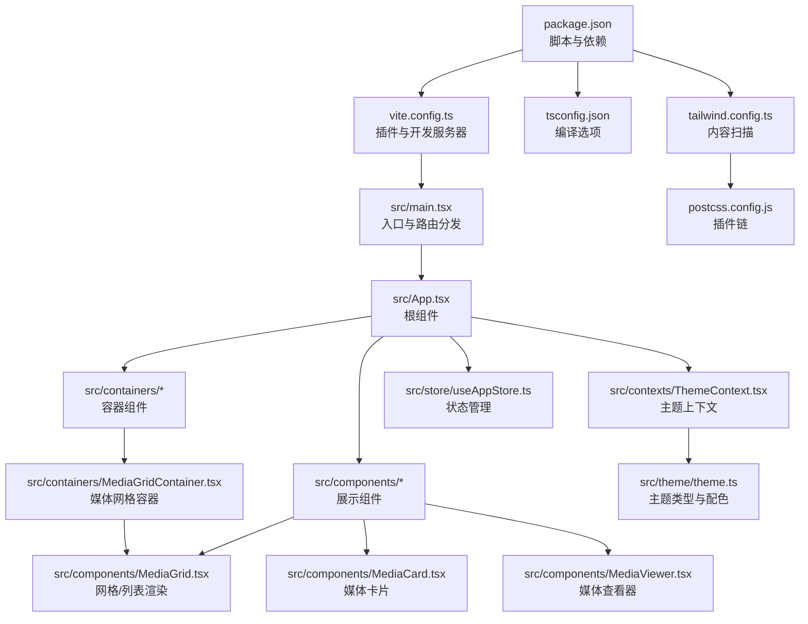
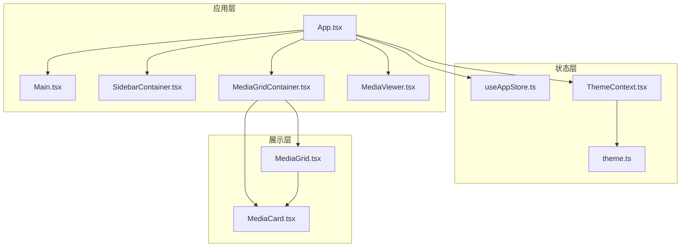
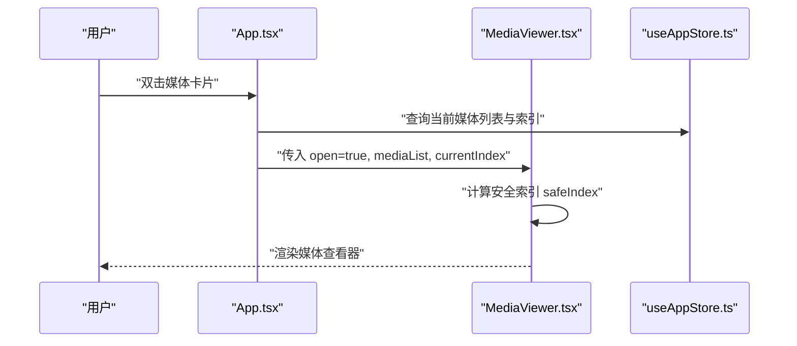
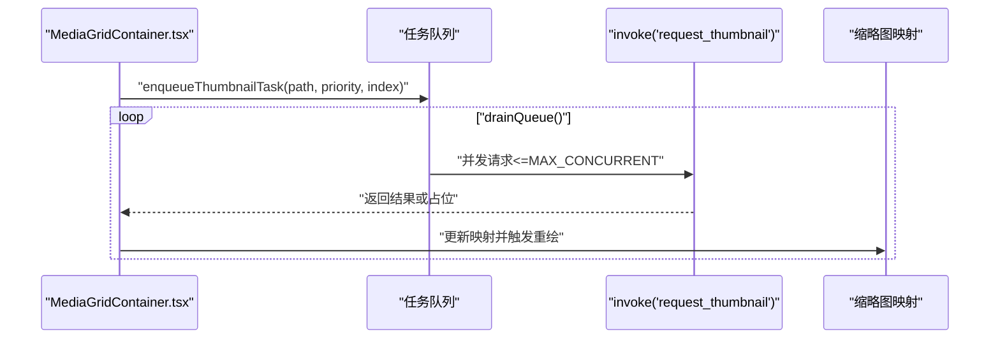
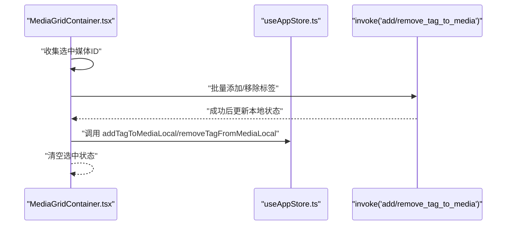
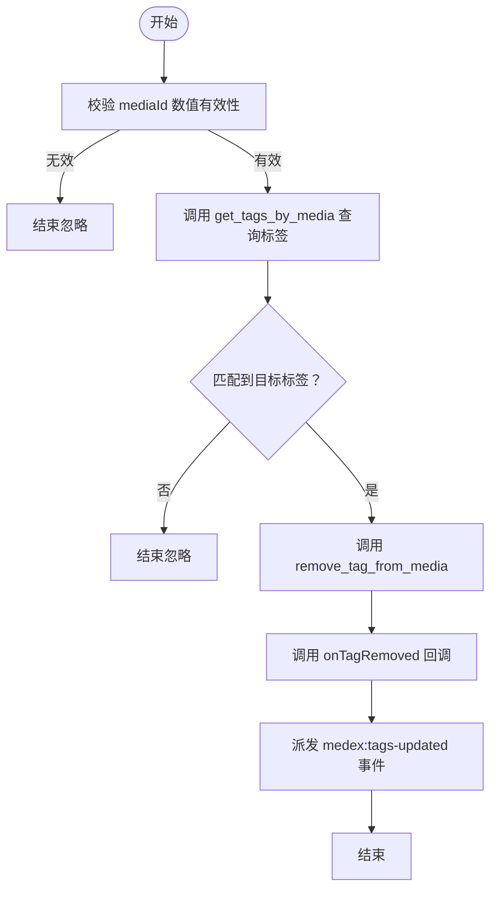
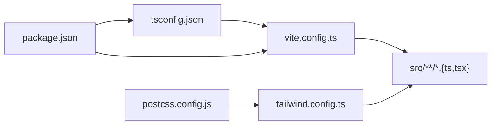

# TypeScript 编码规范

<cite>
**本文引用的文件**
- [tsconfig.json](file://tsconfig.json)
- [package.json](file://package.json)
- [vite.config.ts](file://vite.config.ts)
- [tailwind.config.ts](file://tailwind.config.ts)
- [postcss.config.js](file://postcss.config.js)
- [src/main.tsx](file://src/main.tsx)
- [src/App.tsx](file://src/App.tsx)
- [src/store/useAppStore.ts](file://src/store/useAppStore.ts)
- [src/contexts/ThemeContext.tsx](file://src/contexts/ThemeContext.tsx)
- [src/theme/theme.ts](file://src/theme/theme.ts)
- [src/components/Main.tsx](file://src/components/Main.tsx)
- [src/containers/SidebarContainer.tsx](file://src/containers/SidebarContainer.tsx)
- [src/components/MediaGrid.tsx](file://src/components/MediaGrid.tsx)
- [src/containers/MediaGridContainer.tsx](file://src/containers/MediaGridContainer.tsx)
- [src/components/MediaCard.tsx](file://src/components/MediaCard.tsx)
- [src/components/MediaViewer.tsx](file://src/components/MediaViewer.tsx)
</cite>

## 目录
1. [简介](#简介)
2. [项目结构](#项目结构)
3. [核心组件](#核心组件)
4. [架构总览](#架构总览)
5. [详细组件分析](#详细组件分析)
6. [依赖关系分析](#依赖关系分析)
7. [性能考量](#性能考量)
8. [故障排查指南](#故障排查指南)
9. [结论](#结论)
10. [附录](#附录)

## 简介
本文件面向 Medex 项目的 TypeScript 编码规范，结合 tsconfig.json 配置与源码实践，系统阐述编译选项、模块解析策略、JSX 处理方式、命名约定、类型安全最佳实践，并给出 ESLint 与代码格式化建议，帮助团队统一风格、提升可维护性与质量。

## 项目结构
Medex 采用 Vite + React + TypeScript 技术栈，前端源码位于 src 目录，TypeScript 编译由 tsconfig.json 控制；构建与运行由 package.json 脚本驱动，Vite 提供开发服务器与打包能力；TailwindCSS 与 PostCSS 负责样式管线。

图表来源
- [package.json:1-36](file://package.json#L1-L36)
- [vite.config.ts:1-11](file://vite.config.ts#L1-L11)
- [tsconfig.json:1-19](file://tsconfig.json#L1-L19)
- [tailwind.config.ts:1-36](file://tailwind.config.ts#L1-L36)
- [postcss.config.js:1-7](file://postcss.config.js#L1-L7)
- [src/main.tsx:1-44](file://src/main.tsx#L1-L44)
- [src/App.tsx:1-73](file://src/App.tsx#L1-L73)
- [src/store/useAppStore.ts:1-395](file://src/store/useAppStore.ts#L1-L395)
- [src/contexts/ThemeContext.tsx:1-99](file://src/contexts/ThemeContext.tsx#L1-L99)
- [src/theme/theme.ts:1-159](file://src/theme/theme.ts#L1-L159)
- [src/components/MediaGrid.tsx:1-351](file://src/components/MediaGrid.tsx#L1-L351)
- [src/containers/MediaGridContainer.tsx:1-619](file://src/containers/MediaGridContainer.tsx#L1-L619)
- [src/components/MediaCard.tsx:1-318](file://src/components/MediaCard.tsx#L1-L318)
- [src/components/MediaViewer.tsx:1-186](file://src/components/MediaViewer.tsx#L1-L186)

章节来源
- [package.json:1-36](file://package.json#L1-L36)
- [vite.config.ts:1-11](file://vite.config.ts#L1-L11)
- [tsconfig.json:1-19](file://tsconfig.json#L1-L19)
- [tailwind.config.ts:1-36](file://tailwind.config.ts#L1-L36)
- [postcss.config.js:1-7](file://postcss.config.js#L1-L7)

## 核心组件
- 编译配置与工具链
  - TypeScript 编译选项集中于 tsconfig.json，启用严格模式、ESNext 模块、bundler 解析、JSX React 编译等。
  - Vite 作为开发服务器与打包器，配合 @vitejs/plugin-react。
  - TailwindCSS 内容扫描覆盖 src/**/*.{ts,tsx}，PostCSS 自动前缀与 Tailwind 集成。
- 应用入口与路由
  - src/main.tsx 根据 URL 路径选择渲染 App、Settings 或 Update 页面，并包裹 ThemeProvider。
- 核心业务组件
  - App.tsx：聚合侧边栏、主区域与媒体查看器，协调状态与事件。
  - useAppStore.ts：Zustand 状态模型，定义导航、标签、媒体项等类型与动作。
  - ThemeContext.tsx 与 theme.ts：主题模式、颜色体系与上下文提供者。
  - MediaGridContainer.tsx：媒体网格容器，负责过滤、排序、缩略图队列与批量操作。
  - MediaGrid.tsx：基于 react-window 的虚拟滚动网格/列表实现。
  - MediaCard.tsx：媒体卡片，支持收藏、标签删除、悬停态与主题色。
  - MediaViewer.tsx：媒体查看器，支持键盘导航与主题色。

章节来源
- [src/main.tsx:1-44](file://src/main.tsx#L1-L44)
- [src/App.tsx:1-73](file://src/App.tsx#L1-L73)
- [src/store/useAppStore.ts:1-395](file://src/store/useAppStore.ts#L1-L395)
- [src/contexts/ThemeContext.tsx:1-99](file://src/contexts/ThemeContext.tsx#L1-L99)
- [src/theme/theme.ts:1-159](file://src/theme/theme.ts#L1-L159)
- [src/containers/MediaGridContainer.tsx:1-619](file://src/containers/MediaGridContainer.tsx#L1-L619)
- [src/components/MediaGrid.tsx:1-351](file://src/components/MediaGrid.tsx#L1-L351)
- [src/components/MediaCard.tsx:1-318](file://src/components/MediaCard.tsx#L1-L318)
- [src/components/MediaViewer.tsx:1-186](file://src/components/MediaViewer.tsx#L1-L186)

## 架构总览
Medex 采用“容器-展示”分层与状态集中管理：
- 容器组件负责数据获取、事件处理与状态协调（如 MediaGridContainer）。
- 展示组件专注 UI 呈现与用户交互（如 MediaGrid、MediaCard、MediaViewer）。
- 全局状态通过 Zustand 管理，主题通过 Context 注入，避免深层传递。

图表来源
- [src/App.tsx:1-73](file://src/App.tsx#L1-L73)
- [src/components/Main.tsx:1-25](file://src/components/Main.tsx#L1-L25)
- [src/containers/SidebarContainer.tsx:1-79](file://src/containers/SidebarContainer.tsx#L1-L79)
- [src/containers/MediaGridContainer.tsx:1-619](file://src/containers/MediaGridContainer.tsx#L1-L619)
- [src/components/MediaGrid.tsx:1-351](file://src/components/MediaGrid.tsx#L1-L351)
- [src/components/MediaCard.tsx:1-318](file://src/components/MediaCard.tsx#L1-L318)
- [src/components/MediaViewer.tsx:1-186](file://src/components/MediaViewer.tsx#L1-L186)
- [src/store/useAppStore.ts:1-395](file://src/store/useAppStore.ts#L1-L395)
- [src/contexts/ThemeContext.tsx:1-99](file://src/contexts/ThemeContext.tsx#L1-L99)
- [src/theme/theme.ts:1-159](file://src/theme/theme.ts#L1-L159)

## 详细组件分析

### TypeScript 编译选项与工程配置
- 目标与模块
  - target: ES2020，lib: ES2020/DOM/DOM.Iterable，module: ESNext，确保现代语法与 DOM API 支持。
  - moduleResolution: bundler，与 Vite/Vite 插件生态契合，避免 Node 解析差异。
  - skipLibCheck: true，降低第三方声明文件检查开销。
- JSX 与类型
  - jsx: react-jsx，启用 React 17+ 新 JSX 转换，无需显式导入 React。
  - strict: true，开启严格模式，提升类型安全性。
  - types: ["vite/client"]，注入 Vite 环境类型。
- 输出与检查
  - noEmit: true，仅进行类型检查，构建由 Vite/TSC 分离流程完成。
  - resolveJsonModule: true，允许 JSON 模块导入。
  - isolatedModules: true，便于单文件转换与增量编译。
  - allowImportingTsExtensions: true，允许直接导入 .ts/.tsx 扩展名（与 bundler 解析配合）。
- 包管理与脚本
  - type: module，ES 模块语义。
  - dev/build/preview/tauri 脚本分别对应开发、构建、预览与 Tauri 启动。

章节来源
- [tsconfig.json:1-19](file://tsconfig.json#L1-L19)
- [package.json:1-36](file://package.json#L1-L36)
- [vite.config.ts:1-11](file://vite.config.ts#L1-L11)

### 命名约定规范
- 类型与接口
  - 使用名词短语或抽象概念命名，如 MediaItem、DbTagItem、AppState、ThemeColors。
  - 使用大驼峰命名法，避免缩写，必要时保留领域内通用缩写（如 Id、Html）。
- 类型别名与字面量
  - 字面量联合类型用于枚举值，如 'grid' | 'list'、'all' | 'image' | 'video'。
  - 使用 Record<string, T> 表达映射，如 thumbnails: Record<string, string>。
- 函数与变量
  - 函数使用动词短语，如 setMediaItemsFromDb、toggleFavorite、toPreviewSrc。
  - 变量使用清晰描述性名称，避免单字母（除非循环索引），如 mediaList、selectedIds。
- 组件与 Props
  - 组件首字母大写，Props 接口以 Props 结尾，如 MediaGridProps、MediaCardProps。
  - 事件处理器以 on 前缀命名，如 onCardClick、onToggleFavorite。
- 常量与配置
  - 常量全大写加下划线，如 MAX_CONCURRENT、GRID_CARD_WIDTH。
- 文件与目录
  - 组件文件使用 PascalCase.tsx，容器文件使用 *Container.tsx，上下文文件使用 *Context.tsx。

章节来源
- [src/store/useAppStore.ts:1-395](file://src/store/useAppStore.ts#L1-L395)
- [src/components/MediaGrid.tsx:1-351](file://src/components/MediaGrid.tsx#L1-L351)
- [src/components/MediaCard.tsx:1-318](file://src/components/MediaCard.tsx#L1-L318)
- [src/containers/MediaGridContainer.tsx:1-619](file://src/containers/MediaGridContainer.tsx#L1-L619)
- [src/contexts/ThemeContext.tsx:1-99](file://src/contexts/ThemeContext.tsx#L1-L99)
- [src/theme/theme.ts:1-159](file://src/theme/theme.ts#L1-L159)

### 类型安全最佳实践
- 类型推断与明确标注
  - 利用 React.FC、ReactNode、React.MouseEventHandler 等泛型接口明确参数与返回值。
  - 对外部调用（如 invoke）使用明确的泛型参数，如 invoke<DbTagItem[]>。
- 联合类型与可选属性
  - 可选属性使用 ?，如 MediaItem.recentViewedAt?。
  - 联合类型表达互斥状态，如 ThemeMode。
- 泛型使用
  - 在高阶组件与 memo 中使用泛型约束 props，如 GridChildComponentProps<GridItemData>。
- 不可变更新与 Map/Set
  - 使用 Map/Set 构建去重与快速查找，如 setMediaItemsFromDb 中的 Map 构造。
- 索引与边界安全
  - 使用 useMemo 与边界判断，如 MediaViewer 中的安全索引计算。
- 事件与回调
  - 将事件处理器通过 props 下发，避免在渲染过程中创建新函数导致重渲染。

章节来源
- [src/App.tsx:1-73](file://src/App.tsx#L1-L73)
- [src/store/useAppStore.ts:1-395](file://src/store/useAppStore.ts#L1-L395)
- [src/containers/MediaGridContainer.tsx:1-619](file://src/containers/MediaGridContainer.tsx#L1-L619)
- [src/components/MediaGrid.tsx:1-351](file://src/components/MediaGrid.tsx#L1-L351)
- [src/components/MediaCard.tsx:1-318](file://src/components/MediaCard.tsx#L1-L318)
- [src/components/MediaViewer.tsx:1-186](file://src/components/MediaViewer.tsx#L1-L186)

### 关键流程时序图

#### 媒体查看器打开流程

图表来源
- [src/App.tsx:28-47](file://src/App.tsx#L28-L47)
- [src/components/MediaViewer.tsx:14-55](file://src/components/MediaViewer.tsx#L14-L55)
- [src/store/useAppStore.ts:48-68](file://src/store/useAppStore.ts#L48-L68)

#### 缩略图请求与队列处理

图表来源
- [src/containers/MediaGridContainer.tsx:390-451](file://src/containers/MediaGridContainer.tsx#L390-L451)
- [src/containers/MediaGridContainer.tsx:453-486](file://src/containers/MediaGridContainer.tsx#L453-L486)

#### 批量标签操作

图表来源
- [src/containers/MediaGridContainer.tsx:145-175](file://src/containers/MediaGridContainer.tsx#L145-L175)
- [src/store/useAppStore.ts:289-341](file://src/store/useAppStore.ts#L289-L341)
- [src/store/useAppStore.ts:342-381](file://src/store/useAppStore.ts#L342-L381)

### 复杂逻辑流程图

#### 媒体卡片标签移除流程

图表来源
- [src/components/MediaCard.tsx:65-84](file://src/components/MediaCard.tsx#L65-L84)

## 依赖关系分析
- 编译与构建
  - tsconfig.json 控制编译行为，Vite 通过 vite.config.ts 集成 React 插件与开发服务器。
  - TailwindCSS 通过 tailwind.config.ts 的 content 字段扫描源码，确保按需生成样式。
- 运行时依赖
  - React 生态与 Zustand 状态管理，Tauri 用于桌面端能力与事件通信。
- 开发依赖
  - TypeScript、@types/react、TailwindCSS、PostCSS、Vite 等。

图表来源
- [tsconfig.json:1-19](file://tsconfig.json#L1-L19)
- [vite.config.ts:1-11](file://vite.config.ts#L1-L11)
- [tailwind.config.ts:1-36](file://tailwind.config.ts#L1-L36)
- [postcss.config.js:1-7](file://postcss.config.js#L1-L7)
- [package.json:1-36](file://package.json#L1-L36)

章节来源
- [tsconfig.json:1-19](file://tsconfig.json#L1-L19)
- [vite.config.ts:1-11](file://vite.config.ts#L1-L11)
- [tailwind.config.ts:1-36](file://tailwind.config.ts#L1-L36)
- [postcss.config.js:1-7](file://postcss.config.js#L1-L7)
- [package.json:1-36](file://package.json#L1-L36)

## 性能考量
- 虚拟滚动
  - MediaGrid 使用 react-window 的 FixedSizeGrid/List，结合 overscan 与可见范围回调，减少 DOM 节点数量，提升大数据集渲染性能。
- 并发与队列
  - MediaGridContainer 维护并发上限与队列长度，避免过多网络请求与 UI 卡顿。
- 记忆化
  - 大量使用 useMemo/memo，避免不必要的重渲染与对象重建。
- 图像与视频资源
  - 条件加载与懒加载策略，优先展示骨架或占位符，提升感知性能。

章节来源
- [src/components/MediaGrid.tsx:133-212](file://src/components/MediaGrid.tsx#L133-L212)
- [src/containers/MediaGridContainer.tsx:352-388](file://src/containers/MediaGridContainer.tsx#L352-L388)
- [src/containers/MediaGridContainer.tsx:417-451](file://src/containers/MediaGridContainer.tsx#L417-L451)
- [src/components/MediaCard.tsx:266-275](file://src/components/MediaCard.tsx#L266-L275)

## 故障排查指南
- 编译错误
  - 严格模式下缺少类型标注或不兼容的赋值会报错，优先为函数参数与返回值添加明确类型。
  - JSX 转换相关错误通常源于 jsx 配置或 React 版本不匹配，确认 tsconfig.json 的 jsx 设置与 @types/react 版本。
- 运行时异常
  - invoke 外部调用可能失败，应捕获错误并提示用户，同时记录日志以便定位。
  - 事件监听与清理：确保在组件卸载时移除监听器，避免内存泄漏。
- 主题与样式
  - 主题切换后未生效时，检查 ThemeContext 是否正确提供，以及 HTML 的 data-theme 属性是否更新。

章节来源
- [src/containers/MediaGridContainer.tsx:169-173](file://src/containers/MediaGridContainer.tsx#L169-L173)
- [src/containers/SidebarContainer.tsx:16-33](file://src/containers/SidebarContainer.tsx#L16-L33)
- [src/contexts/ThemeContext.tsx:34-66](file://src/contexts/ThemeContext.tsx#L34-L66)

## 结论
通过严格的 tsconfig.json 配置、清晰的命名约定、完善的类型安全实践与合理的性能优化策略，Medex 在 TypeScript 与 React 生态下实现了高质量的前端工程。建议团队持续遵循本文规范，并结合 ESLint 与 Prettier 进一步统一代码风格与质量。

## 附录

### ESLint 配置建议
- 推荐规则族
  - @typescript-eslint/recommended：启用 TypeScript 相关推荐规则。
  - eslint:recommended：启用基础 JavaScript 推荐规则。
  - plugin:react-hooks/recommended：启用 React Hooks 规则。
- 关键规则建议
  - @typescript-eslint/no-explicit-any：禁止使用 any。
  - @typescript-eslint/explicit-function-return-type：要求函数显式返回类型。
  - @typescript-eslint/no-unused-vars：禁止未使用变量。
  - react-hooks/exhaustive-deps：确保 useEffect/依赖数组完整。
  - no-console：生产环境禁用 console。
- 插件与扩展
  - @typescript-eslint/eslint-plugin、eslint-plugin-react、eslint-plugin-react-hooks。
  - 配合 tsconfig.json 的 strict 选项，最大化类型检查收益。

### 代码格式化标准
- 使用 Prettier 统一格式化，推荐配置：
  - semi: true
  - singleQuote: true
  - trailingComma: es5
  - printWidth: 100
  - tabWidth: 2
- 与 ESLint 集成：编辑器保存时自动格式化，CI 中执行 lint 与 format 检查。