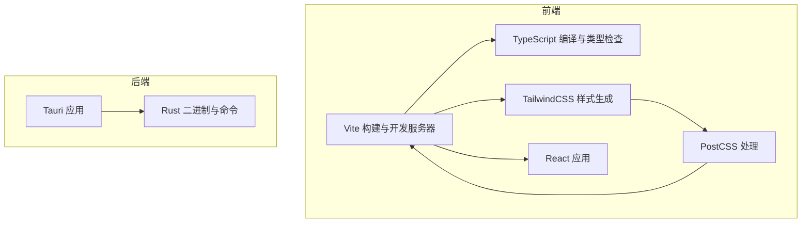
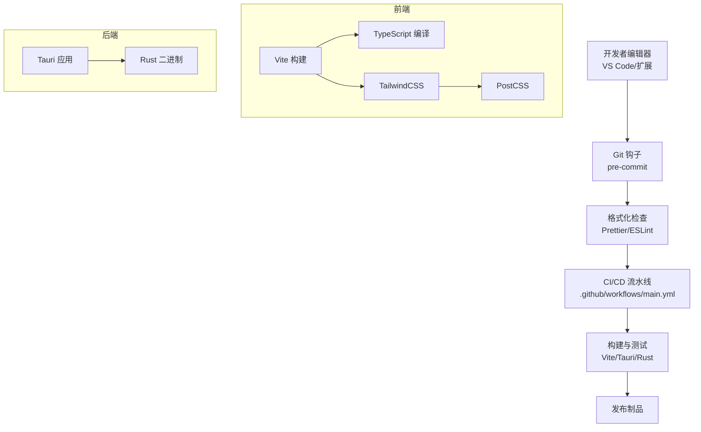
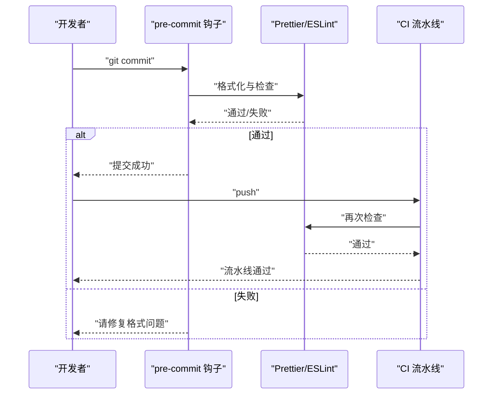
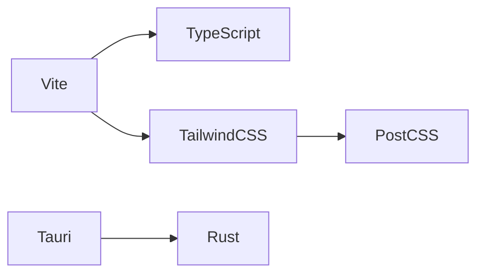

# 代码格式化标准

<cite>
**本文引用的文件**
- [package.json](file://package.json)
- [vite.config.ts](file://vite.config.ts)
- [tsconfig.json](file://tsconfig.json)
- [tailwind.config.ts](file://tailwind.config.ts)
- [postcss.config.js](file://postcss.config.js)
- [DEVELOPMENT.md](file://DEVELOPMENT.md)
- [.github/workflows/main.yml](file://.github/workflows/main.yml)
</cite>

## 目录
1. [简介](#简介)
2. [项目结构](#项目结构)
3. [核心组件](#核心组件)
4. [架构总览](#架构总览)
5. [详细组件分析](#详细组件分析)
6. [依赖分析](#依赖分析)
7. [性能考虑](#性能考虑)
8. [故障排除指南](#故障排除指南)
9. [结论](#结论)
10. [附录](#附录)

## 简介
本文件旨在为 Medex 项目制定统一的代码格式化标准，覆盖前端（React + TypeScript + Vite + TailwindCSS）、后端（Tauri + Rust）以及构建与 CI 流程中的格式化一致性要求。内容包括：
- Prettier 配置与规则建议（基于现有工具链推导）
- EditorConfig 配置建议（统一编辑器设置、字符编码、行尾符）
- IDE 集成方案（VS Code 扩展与自动格式化）
- Git 钩子与 CI/CD 自动化（提交前检查与流水线校验）
- 前端与后端格式化差异与统一开发体验

说明：当前仓库未包含 Prettier 与 EditorConfig 的显式配置文件，因此本文件提供基于现有工具链（Vite、TailwindCSS、PostCSS、TypeScript）的最佳实践与落地建议。

## 项目结构
Medex 采用“前端 + 后端（Tauri/Rust）”双栈结构，前端使用 Vite + React + TypeScript + TailwindCSS，后端使用 Tauri 与 Rust。构建与样式管线由 Vite、TailwindCSS、PostCSS 驱动。

图表来源
- [vite.config.ts:1-11](file://vite.config.ts#L1-L11)
- [postcss.config.js:1-7](file://postcss.config.js#L1-L7)
- [tailwind.config.ts:1-36](file://tailwind.config.ts#L1-L36)
- [tsconfig.json:1-19](file://tsconfig.json#L1-L19)

章节来源
- [vite.config.ts:1-11](file://vite.config.ts#L1-L11)
- [postcss.config.js:1-7](file://postcss.config.js#L1-L7)
- [tailwind.config.ts:1-36](file://tailwind.config.ts#L1-L36)
- [tsconfig.json:1-19](file://tsconfig.json#L1-L19)

## 核心组件
- Vite：负责开发服务器、插件体系与构建流程
- TailwindCSS：提供原子化样式与主题变量
- PostCSS：处理自动前缀与插件链
- TypeScript：类型安全与编译控制
- Tauri：前端与 Rust 后端的桥接
- Rust：后端命令与业务逻辑

章节来源
- [vite.config.ts:1-11](file://vite.config.ts#L1-L11)
- [postcss.config.js:1-7](file://postcss.config.js#L1-L7)
- [tailwind.config.ts:1-36](file://tailwind.config.ts#L1-L36)
- [tsconfig.json:1-19](file://tsconfig.json#L1-L19)
- [DEVELOPMENT.md:22-43](file://DEVELOPMENT.md#L22-L43)

## 架构总览
下图展示前端与后端在格式化与构建阶段的协作关系，以及与 CI 的集成点。

图表来源
- [.github/workflows/main.yml](file://.github/workflows/main.yml)
- [vite.config.ts:1-11](file://vite.config.ts#L1-L11)
- [postcss.config.js:1-7](file://postcss.config.js#L1-L7)
- [tailwind.config.ts:1-36](file://tailwind.config.ts#L1-L36)
- [tsconfig.json:1-19](file://tsconfig.json#L1-L19)

## 详细组件分析

### Prettier 配置与规则建议
说明：当前仓库未包含 Prettier 配置文件。以下为基于现有工具链的推荐规则与落地方式。

- 推荐规则（建议以配置文件形式落地，便于团队统一）
  - 单引号与尾逗号：保持一致的字符串与对象/函数尾逗号风格
  - 空格与缩进：统一使用空格缩进，避免混用 Tab
  - 行尾符：统一使用 LF（Linux 风格），避免 CRLF
  - 最大行长：建议 100~120，结合团队习惯调整
  - JSX 属性换行：建议在属性较多时换行，提升可读性
  - 与 ESLint 协同：使用 Prettier 作为格式化引擎，ESLint 专注语义规则
  - 文件类型覆盖：前端（JS/TS/TSX/CSS/JSON/Markdown）与后端（Rust）分别配置
  - 忽略文件：忽略 node_modules、dist、build、target 等目录

- 与现有工具链的衔接
  - Vite：无需额外配置，Prettier 可独立运行或通过 pre-commit 钩子触发
  - TailwindCSS：Prettier 默认不会破坏类名顺序，建议配合排序工具（如 Prettier 插件）保持一致性
  - PostCSS：Prettier 不影响 CSS，但可与 Prettier 的 CSS 插件协同
  - TypeScript：Prettier 与 TypeScript 语法兼容良好，建议开启 JSX 与 TSX 支持
  - Rust：建议单独配置 Rustfmt，与 Prettier 并行使用

- VS Code 集成（建议）
  - 设置默认格式化程序为 Prettier（或 ESLint 插件）
  - 启用“保存时格式化”与“保存时排序导入”
  - 配置工作区设置以覆盖团队默认

- 示例（概念性，非仓库内容）
  - 正确：函数参数与对象属性在换行后缩进对齐，尾逗号保留
  - 错误：混用 Tab 与空格、行尾符为 CRLF、长行不换行导致超出最大行长

章节来源
- [vite.config.ts:1-11](file://vite.config.ts#L1-L11)
- [postcss.config.js:1-7](file://postcss.config.js#L1-L7)
- [tailwind.config.ts:1-36](file://tailwind.config.ts#L1-L36)
- [tsconfig.json:1-19](file://tsconfig.json#L1-L19)

### EditorConfig 配置建议
- 统一编辑器设置
  - 缩进：使用空格，大小为 2
  - 列宽：最大行长 120
  - 行尾符：LF
  - 字符编码：UTF-8
  - 去除行尾空格：启用
- 作用范围
  - 前端：JS/TS/TSX/CSS/JSON/Markdown
  - 后端：Rust（与 Rustfmt 协同）
- VS Code 集成
  - 安装 EditorConfig 扩展
  - 在工作区设置中启用“保存时应用 EditorConfig”

章节来源
- [vite.config.ts:1-11](file://vite.config.ts#L1-L11)
- [postcss.config.js:1-7](file://postcss.config.js#L1-L7)
- [tailwind.config.ts:1-36](file://tailwind.config.ts#L1-L36)
- [tsconfig.json:1-19](file://tsconfig.json#L1-L19)

### IDE 集成方案（VS Code）
- 扩展推荐
  - Prettier（或 ESLint 插件）：统一格式化
  - TailwindCSS IntelliSense：类名提示与排序
  - EditorConfig：统一编辑器设置
  - Rust（rust-analyzer）：Rust 开发必备
- 自动格式化配置
  - 默认格式化程序：Prettier
  - 保存时格式化：启用
  - 排序导入：启用（ESLint 插件支持）
- 工作区设置建议
  - 将格式化相关设置放入 .vscode/settings.json，确保团队一致

章节来源
- [vite.config.ts:1-11](file://vite.config.ts#L1-L11)
- [postcss.config.js:1-7](file://postcss.config.js#L1-L7)
- [tailwind.config.ts:1-36](file://tailwind.config.ts#L1-L36)
- [tsconfig.json:1-19](file://tsconfig.json#L1-L19)

### Git 钩子与 CI/CD 自动化
- Git 钩子（pre-commit）
  - 使用 Husky + lint-staged
  - 触发 Prettier 格式化与 ESLint 检查
  - 仅对暂存区文件执行，避免无关文件干扰
- CI/CD（GitHub Actions）
  - 在流水线中添加“格式化检查”步骤
  - 前端：运行 Prettier 检查与 ESLint
  - 后端：运行 Rustfmt 检查
  - 若失败则中断流水线，要求修复后再合并

图表来源
- [.github/workflows/main.yml](file://.github/workflows/main.yml)

章节来源
- [.github/workflows/main.yml](file://.github/workflows/main.yml)

### 前端与后端格式化差异
- 前端（JS/TS/TSX/CSS/JSON/Markdown）
  - 使用 Prettier + ESLint
  - 配合 TailwindCSS 类名排序与 PostCSS 处理
  - 通过 Vite 构建链路集成
- 后端（Rust）
  - 使用 Rustfmt
  - 与 Cargo 集成，可在 CI 中统一检查
- 统一开发体验
  - 通过 EditorConfig 保证基础一致
  - 通过 VS Code 扩展与工作区设置确保团队一致
  - 通过 Git 钩子与 CI 强制执行

章节来源
- [vite.config.ts:1-11](file://vite.config.ts#L1-L11)
- [postcss.config.js:1-7](file://postcss.config.js#L1-L7)
- [tailwind.config.ts:1-36](file://tailwind.config.ts#L1-L36)
- [tsconfig.json:1-19](file://tsconfig.json#L1-L19)
- [DEVELOPMENT.md:22-43](file://DEVELOPMENT.md#L22-L43)

## 依赖分析
- 前端依赖
  - Vite：开发服务器与构建
  - TailwindCSS：原子化样式
  - PostCSS：自动前缀与插件链
  - TypeScript：类型安全与编译
- 后端依赖
  - Tauri：前端与 Rust 桥接
  - Rust：业务逻辑与命令
- 工具链耦合
  - Vite 与 TailwindCSS/PostCSS 形成样式管线
  - TypeScript 与 Vite 协同进行编译与类型检查
  - Tauri 与 Rust 形成后端执行环境

图表来源
- [vite.config.ts:1-11](file://vite.config.ts#L1-L11)
- [postcss.config.js:1-7](file://postcss.config.js#L1-L7)
- [tailwind.config.ts:1-36](file://tailwind.config.ts#L1-L36)
- [tsconfig.json:1-19](file://tsconfig.json#L1-L19)

章节来源
- [vite.config.ts:1-11](file://vite.config.ts#L1-L11)
- [postcss.config.js:1-7](file://postcss.config.js#L1-L7)
- [tailwind.config.ts:1-36](file://tailwind.config.ts#L1-L36)
- [tsconfig.json:1-19](file://tsconfig.json#L1-L19)

## 性能考虑
- 格式化性能
  - 仅对变更文件执行格式化，避免全量扫描
  - 使用 lint-staged 限定检查范围
- 构建性能
  - Prettier 与 ESLint 在 CI 中并行执行，缩短等待时间
  - Rustfmt 与 Cargo 检查在独立步骤中执行，避免相互阻塞
- 缓存与增量
  - 利用 Vite 的热更新与模块缓存，减少重复格式化带来的开销

## 故障排除指南
- Prettier 与 ESLint 冲突
  - 使用 Prettier 作为格式化引擎，ESLint 仅负责语义规则
  - 在 VS Code 中将默认格式化程序设为 Prettier
- EditorConfig 未生效
  - 确认已安装 EditorConfig 扩展
  - 检查工作区设置是否覆盖了 EditorConfig
- Git 钩子未触发
  - 确认 Husky 已安装并初始化
  - 检查 pre-commit 脚本是否正确配置
- CI 失败
  - 查看流水线日志，定位具体文件与规则
  - 在本地复现并修复后再提交

## 结论
通过在 Medex 项目中引入 Prettier、EditorConfig、VS Code 扩展、Git 钩子与 CI/CD 自动化，可以有效统一前端与后端的代码风格，提升开发效率与可维护性。建议尽快落地配置文件与工作流，确保团队成员遵循同一套格式化标准。

## 附录
- 建议的配置文件清单（概念性，非仓库内容）
  - Prettier：.prettierrc 或 package.json 中的 prettier 字段
  - EditorConfig：.editorconfig
  - VS Code：.vscode/settings.json
  - Git 钩子：.husky、lint-staged 配置
  - CI：.github/workflows/main.yml 中增加格式化检查步骤
- 参考文件
  - [package.json](file://package.json)
  - [vite.config.ts:1-11](file://vite.config.ts#L1-L11)
  - [postcss.config.js:1-7](file://postcss.config.js#L1-L7)
  - [tailwind.config.ts:1-36](file://tailwind.config.ts#L1-L36)
  - [tsconfig.json:1-19](file://tsconfig.json#L1-L19)
  - [DEVELOPMENT.md:22-43](file://DEVELOPMENT.md#L22-L43)
  - [.github/workflows/main.yml](file://.github/workflows/main.yml)