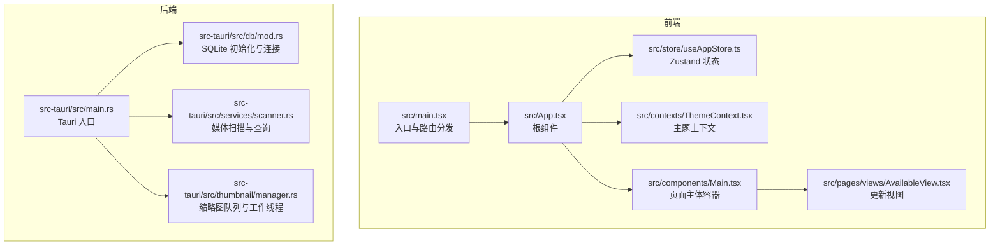
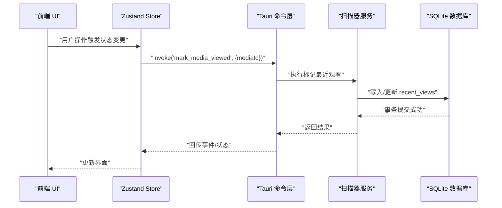
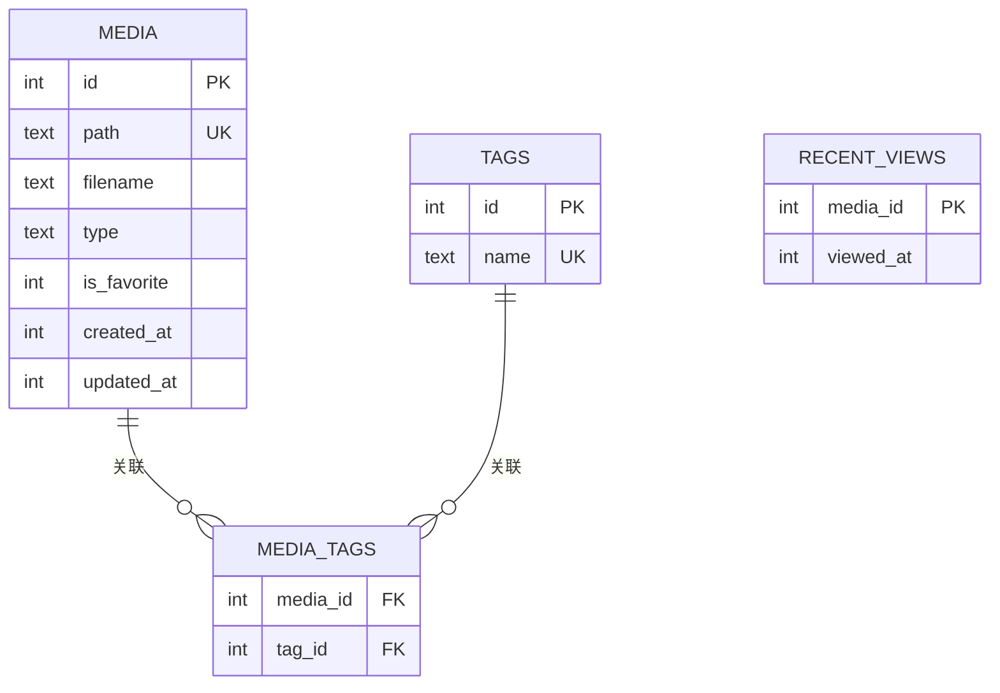
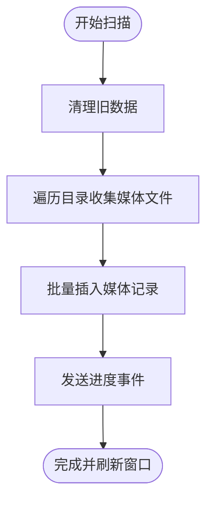
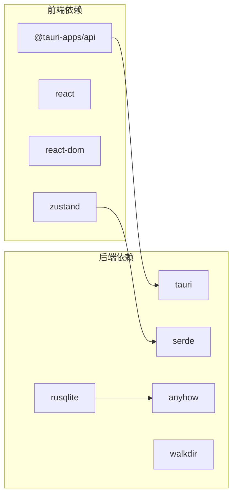

# 代码规范

<cite>
**本文引用的文件**
- [package.json](file://package.json)
- [tsconfig.json](file://tsconfig.json)
- [vite.config.ts](file://vite.config.ts)
- [tailwind.config.ts](file://tailwind.config.ts)
- [postcss.config.js](file://postcss.config.js)
- [src/main.tsx](file://src/main.tsx)
- [src/App.tsx](file://src/App.tsx)
- [src/store/useAppStore.ts](file://src/store/useAppStore.ts)
- [src/contexts/ThemeContext.tsx](file://src/contexts/ThemeContext.tsx)
- [src/components/Main.tsx](file://src/components/Main.tsx)
- [src/pages/views/AvailableView.tsx](file://src/pages/views/AvailableView.tsx)
- [src-tauri/Cargo.toml](file://src-tauri/Cargo.toml)
- [src-tauri/src/main.rs](file://src-tauri/src/main.rs)
- [src-tauri/src/db/mod.rs](file://src-tauri/src/db/mod.rs)
- [src-tauri/src/services/scanner.rs](file://src-tauri/src/services/scanner.rs)
- [src-tauri/src/thumbnail/manager.rs](file://src-tauri/src/thumbnail/manager.rs)
</cite>

## 目录
1. [引言](#引言)
2. [项目结构](#项目结构)
3. [核心组件](#核心组件)
4. [架构总览](#架构总览)
5. [详细组件分析](#详细组件分析)
6. [依赖关系分析](#依赖关系分析)
7. [性能考虑](#性能考虑)
8. [故障排查指南](#故障排查指南)
9. [结论](#结论)
10. [附录](#附录)

## 引言
本文件为 Medex 项目的综合代码规范文档，覆盖前端 TypeScript/React、后端 Rust/Tauri 以及构建与样式管线的整体规范。内容基于仓库现有实现进行提炼，旨在帮助团队在命名约定、接口定义、类型安全、错误处理、并发与依赖管理等方面形成一致的工程实践。

## 项目结构
- 前端采用 Vite + React + TypeScript，使用 Zustand 进行状态管理，TailwindCSS 提供样式能力。
- 后端基于 Tauri v2，Rust 实现数据库、扫描器、缩略图等服务模块。
- 构建与样式：Vite 打包、PostCSS 自动前缀、Tailwind 动态生成主题变量。

图表来源
- [src/main.tsx:1-44](file://src/main.tsx#L1-L44)
- [src/App.tsx:1-73](file://src/App.tsx#L1-L73)
- [src/store/useAppStore.ts:1-395](file://src/store/useAppStore.ts#L1-L395)
- [src/contexts/ThemeContext.tsx:1-99](file://src/contexts/ThemeContext.tsx#L1-L99)
- [src/components/Main.tsx:1-25](file://src/components/Main.tsx#L1-L25)
- [src/pages/views/AvailableView.tsx:1-87](file://src/pages/views/AvailableView.tsx#L1-L87)
- [src-tauri/src/main.rs:1-69](file://src-tauri/src/main.rs#L1-L69)
- [src-tauri/src/db/mod.rs:1-123](file://src-tauri/src/db/mod.rs#L1-L123)
- [src-tauri/src/services/scanner.rs:1-525](file://src-tauri/src/services/scanner.rs#L1-L525)
- [src-tauri/src/thumbnail/manager.rs:1-108](file://src-tauri/src/thumbnail/manager.rs#L1-L108)

章节来源
- [package.json:1-36](file://package.json#L1-L36)
- [tsconfig.json:1-19](file://tsconfig.json#L1-L19)
- [vite.config.ts:1-11](file://vite.config.ts#L1-L11)
- [tailwind.config.ts:1-36](file://tailwind.config.ts#L1-L36)
- [postcss.config.js:1-7](file://postcss.config.js#L1-L7)

## 核心组件
- 前端入口与路由分发：根据路径选择渲染 App/Settings/Update 页面，统一注入主题 Provider。
- 应用根组件：组合侧边栏容器、主内容区与媒体查看器，协调媒体列表与查看器状态。
- 状态管理：Zustand Store 定义导航、标签、媒体项及交互动作；提供本地变更与远程调用的桥接。
- 主题上下文：支持系统/深色/浅色三种模式，持久化存储与跨窗口同步。
- 页面视图：更新视图组件接收版本信息与回调，按主题颜色渲染。

章节来源
- [src/main.tsx:9-44](file://src/main.tsx#L9-L44)
- [src/App.tsx:8-73](file://src/App.tsx#L8-L73)
- [src/store/useAppStore.ts:3-68](file://src/store/useAppStore.ts#L3-L68)
- [src/contexts/ThemeContext.tsx:17-99](file://src/contexts/ThemeContext.tsx#L17-L99)
- [src/pages/views/AvailableView.tsx:4-87](file://src/pages/views/AvailableView.tsx#L4-L87)

## 架构总览
前端通过 Tauri 暴露的命令与后端交互，后端以 SQLite 存储媒体元数据，扫描器负责索引与过滤，缩略图管理器异步生成视频缩略图。

图表来源
- [src/App.tsx:35-42](file://src/App.tsx#L35-L42)
- [src-tauri/src/main.rs:49-65](file://src-tauri/src/main.rs#L49-L65)
- [src-tauri/src/services/scanner.rs:343-389](file://src-tauri/src/services/scanner.rs#L343-L389)
- [src-tauri/src/db/mod.rs:97-110](file://src-tauri/src/db/mod.rs#L97-L110)

## 详细组件分析

### TypeScript/React 规范

- 命名约定
  - 文件与组件：PascalCase（如 Main.tsx、AvailableView.tsx）。
  - Props 接口：PascalCase + “Props”后缀（如 MainProps）。
  - 类型别名：PascalCase（如 MediaItem、AppState）。
  - 常量：SCREAMING_SNAKE_CASE（如 THEME_STORAGE_KEY）。

- 接口定义与类型安全
  - 显式声明 Props 接口，避免 any/unknown。
  - 使用联合类型表达互斥状态（如 viewMode: 'grid' | 'list'）。
  - 可选字段使用可选链或空值合并，避免运行时异常。
  - 严格模式开启，禁止隐式 any，启用 noEmit/noUnusedLocals 等。

- Hooks 使用规范
  - 将副作用封装在 useEffect 内，合理设置依赖数组。
  - useMemo/useCallback 用于昂贵计算与回调稳定化。
  - 自定义 Hook 抽象复用逻辑，保持单一职责。

- 组件设计原则
  - 函数组件优先，无状态组件尽量纯函数化。
  - 单一职责：每个组件只负责一块 UI 与交互。
  - Props 下行、事件上行：父组件集中管理状态，子组件只消费与回调。

- 示例与反例（路径指引）
  - Props 接口定义与使用：[src/components/Main.tsx:4-6](file://src/components/Main.tsx#L4-L6)
  - 严格类型 Props 传递：[src/App.tsx:62-69](file://src/App.tsx#L62-L69)
  - 严格编译选项：[tsconfig.json:2-16](file://tsconfig.json#L2-L16)
  - 严格模式与 JSX 配置：[tsconfig.json:14-15](file://tsconfig.json#L14-L15)

章节来源
- [src/components/Main.tsx:4-6](file://src/components/Main.tsx#L4-L6)
- [src/App.tsx:62-69](file://src/App.tsx#L62-L69)
- [tsconfig.json:2-16](file://tsconfig.json#L2-L16)

### Zustand 状态管理规范

- 类型驱动的状态模型
  - 使用类型别名描述实体（MediaItem、DbMediaItem、DbTagItem）。
  - 将派生状态与计算逻辑放入 useMemo 或派生 selector，减少订阅范围。
  - 动作函数保持幂等与不可变更新，必要时使用事务性批量更新。

- 性能优化
  - 使用选择器精确订阅，避免全局重渲染。
  - 复杂计算放入 useMemo，避免每次渲染重建。

- 示例与反例（路径指引）
  - 类型定义与初始状态：[src/store/useAppStore.ts:3-82](file://src/store/useAppStore.ts#L3-L82)
  - 计算派生列表：[src/App.tsx:16-26](file://src/App.tsx#L16-L26)
  - 本地与远程状态同步：[src/App.tsx:35-42](file://src/App.tsx#L35-L42)

章节来源
- [src/store/useAppStore.ts:3-82](file://src/store/useAppStore.ts#L3-L82)
- [src/App.tsx:16-26](file://src/App.tsx#L16-L26)
- [src/App.tsx:35-42](file://src/App.tsx#L35-L42)

### 主题上下文与样式规范

- 主题上下文
  - 提供切换主题、持久化与跨窗口同步能力。
  - 使用 CSS 变量映射主题色板，动态设置 data-theme 属性。

- Tailwind 配置
  - 通过主题扩展变量，统一颜色命名空间（如 medexText、medexMain 等）。
  - content 覆盖到 TSX 文件，确保按需生成样式。

- 示例与反例（路径指引）
  - 主题上下文与事件监听：[src/contexts/ThemeContext.tsx:17-99](file://src/contexts/ThemeContext.tsx#L17-L99)
  - Tailwind 主题变量：[tailwind.config.ts:7-29](file://tailwind.config.ts#L7-L29)

章节来源
- [src/contexts/ThemeContext.tsx:17-99](file://src/contexts/ThemeContext.tsx#L17-L99)
- [tailwind.config.ts:7-29](file://tailwind.config.ts#L7-L29)

### 页面视图与交互规范

- 视图组件
  - 接收外部回调与主题色，内部不持有状态。
  - 使用内联样式或主题变量控制视觉细节，保证一致性。

- 示例与反例（路径指引）
  - 更新视图 Props 与渲染：[src/pages/views/AvailableView.tsx:4-87](file://src/pages/views/AvailableView.tsx#L4-L87)

章节来源
- [src/pages/views/AvailableView.tsx:4-87](file://src/pages/views/AvailableView.tsx#L4-L87)

### Rust/Tauri 编码规范

- 命名与模块组织
  - 模块按功能划分（db、services、thumbnail），清晰职责边界。
  - 命令函数以小写下划线命名，导出给前端调用。

- 错误处理模式
  - 使用 anyhow::Result 包裹错误，配合 with_context 提供上下文信息。
  - 对外暴露字符串错误，便于前端统一处理。

- 并发与资源管理
  - 使用 OnceCell + Mutex 管理全局数据库连接。
  - 缩略图任务通过 mpsc 队列与工作线程池异步处理，避免阻塞主线程。

- Cargo 依赖管理
  - 明确版本与特性开关，避免模糊版本导致的构建不一致。
  - 仅引入所需插件与库，保持最小依赖集。

- 示例与反例（路径指引）
  - Tauri 入口与命令注册：[src-tauri/src/main.rs:10-68](file://src-tauri/src/main.rs#L10-L68)
  - 数据库初始化与连接：[src-tauri/src/db/mod.rs:45-110](file://src-tauri/src/db/mod.rs#L45-L110)
  - 扫描器命令与事务：[src-tauri/src/services/scanner.rs:250-341](file://src-tauri/src/services/scanner.rs#L250-L341)
  - 缩略图队列与工作线程：[src-tauri/src/thumbnail/manager.rs:24-107](file://src-tauri/src/thumbnail/manager.rs#L24-L107)
  - Cargo 依赖清单：[src-tauri/Cargo.toml:13-23](file://src-tauri/Cargo.toml#L13-L23)

章节来源
- [src-tauri/src/main.rs:10-68](file://src-tauri/src/main.rs#L10-L68)
- [src-tauri/src/db/mod.rs:45-110](file://src-tauri/src/db/mod.rs#L45-L110)
- [src-tauri/src/services/scanner.rs:250-341](file://src-tauri/src/services/scanner.rs#L250-L341)
- [src-tauri/src/thumbnail/manager.rs:24-107](file://src-tauri/src/thumbnail/manager.rs#L24-L107)
- [src-tauri/Cargo.toml:13-23](file://src-tauri/Cargo.toml#L13-L23)

### 数据模型与查询流程

图表来源
- [src-tauri/src/db/mod.rs:12-43](file://src-tauri/src/db/mod.rs#L12-L43)

图表来源
- [src-tauri/src/services/scanner.rs:250-341](file://src-tauri/src/services/scanner.rs#L250-L341)

## 依赖关系分析

图表来源
- [package.json:12-22](file://package.json#L12-L22)
- [src-tauri/Cargo.toml:13-23](file://src-tauri/Cargo.toml#L13-L23)

章节来源
- [package.json:12-22](file://package.json#L12-L22)
- [src-tauri/Cargo.toml:13-23](file://src-tauri/Cargo.toml#L13-L23)

## 性能考虑
- 前端
  - 使用 useMemo/useCallback 缓存昂贵计算与回调。
  - 严格模式与 noUnusedLocals 等编译选项减少潜在性能隐患。
  - 按需样式与 Tailwind 变量减少 CSS 体积。
- 后端
  - 数据库事务批处理插入，降低 IO 开销。
  - 缩略图生成使用队列与工作线程池，避免阻塞主线程。
  - 索引优化与 LIMIT 限制最近观看记录数量。

章节来源
- [src/App.tsx:16-26](file://src/App.tsx#L16-L26)
- [tsconfig.json:14](file://tsconfig.json#L14)
- [src-tauri/src/services/scanner.rs:90-115](file://src-tauri/src/services/scanner.rs#L90-L115)
- [src-tauri/src/thumbnail/manager.rs:35-49](file://src-tauri/src/thumbnail/manager.rs#L35-L49)
- [src-tauri/src/db/mod.rs:42](file://src-tauri/src/db/mod.rs#L42)

## 故障排查指南
- 前端
  - 若主题切换无效：检查 data-theme 属性是否正确设置，确认主题变量已在 Tailwind 中注册。
  - 若媒体列表不更新：确认 Store 动作已触发且订阅范围正确。
- 后端
  - 数据库初始化失败：检查 app_data_dir 是否可写，INIT SQL 是否执行成功。
  - 缩略图生成失败：确认 ffmpeg 是否可用，缓存目录权限是否正确。
  - 扫描卡顿：检查队列容量与工作线程数，确认事务批处理是否生效。

章节来源
- [src/contexts/ThemeContext.tsx:52-54](file://src/contexts/ThemeContext.tsx#L52-L54)
- [src-tauri/src/db/mod.rs:45-64](file://src-tauri/src/db/mod.rs#L45-L64)
- [src-tauri/src/thumbnail/manager.rs:24-49](file://src-tauri/src/thumbnail/manager.rs#L24-L49)
- [src-tauri/src/services/scanner.rs:250-341](file://src-tauri/src/services/scanner.rs#L250-L341)

## 结论
本规范以现有代码为依据，总结了 Medex 在 TypeScript/React、Rust/Tauri 与构建样式的工程实践。建议在后续迭代中补充 ESLint/Prettier 配置与 EditorConfig，完善 CI/CD 中的静态检查与格式化步骤，持续提升代码质量与一致性。

## 附录

### TypeScript/React 最佳实践清单
- 使用显式 Props 接口与类型别名，避免 any/unknown。
- 严格模式开启，启用 noImplicitAny、noUnusedLocals 等。
- Hooks 使用：副作用放入 useEffect，计算放入 useMemo/useCallback。
- 组件设计：单一职责、Props 下行、事件上行。
- 状态管理：Zustand 选择器精确订阅，避免全局重渲染。

章节来源
- [tsconfig.json:2-16](file://tsconfig.json#L2-L16)
- [src/store/useAppStore.ts:3-82](file://src/store/useAppStore.ts#L3-L82)

### Rust/Tauri 最佳实践清单
- 错误处理：anyhow::Result + with_context 提供上下文。
- 资源管理：OnceCell + Mutex 管理全局连接。
- 并发：mpsc 队列 + 工作线程池异步处理。
- 依赖：明确版本与特性，最小依赖集。
- 命令：小写下划线命名，对外返回字符串错误。

章节来源
- [src-tauri/src/db/mod.rs:97-110](file://src-tauri/src/db/mod.rs#L97-L110)
- [src-tauri/src/thumbnail/manager.rs:35-49](file://src-tauri/src/thumbnail/manager.rs#L35-L49)
- [src-tauri/src/services/scanner.rs:250-341](file://src-tauri/src/services/scanner.rs#L250-L341)