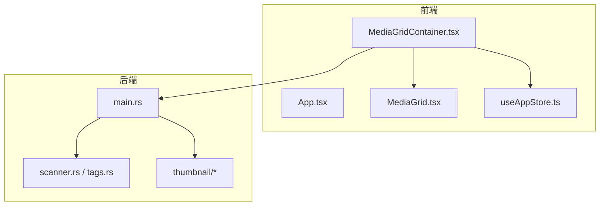
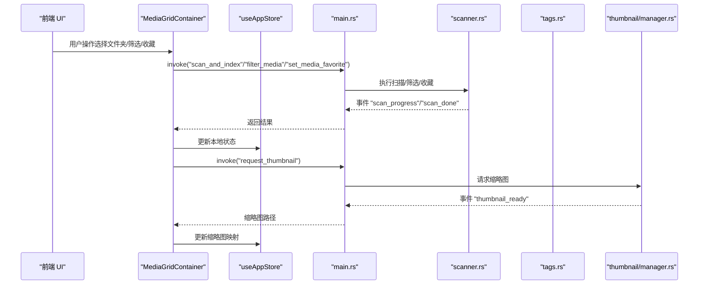
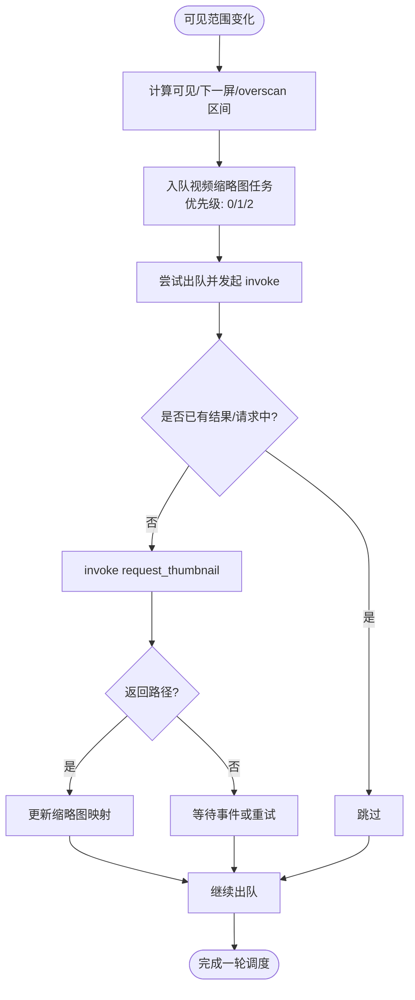
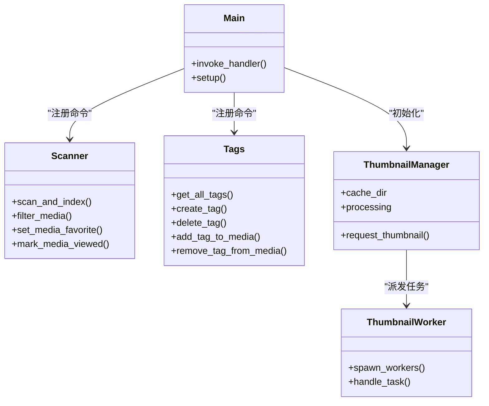
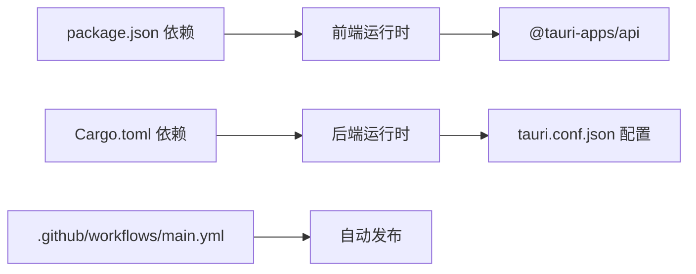

# 代码审查流程

<cite>
**本文引用的文件**
- [README.md](file://README.md)
- [DEVELOPMENT.md](file://DEVELOPMENT.md)
- [RELEASE_GUIDE.md](file://RELEASE_GUIDE.md)
- [package.json](file://package.json)
- [src-tauri/Cargo.toml](file://src-tauri/Cargo.toml)
- [.github/workflows/main.yml](file://.github/workflows/main.yml)
- [src-tauri/tauri.conf.json](file://src-tauri/tauri.conf.json)
- [src-tauri/src/main.rs](file://src-tauri/src/main.rs)
- [src-tauri/src/services/scanner.rs](file://src-tauri/src/services/scanner.rs)
- [src-tauri/src/services/tags.rs](file://src-tauri/src/services/tags.rs)
- [src-tauri/src/thumbnail/manager.rs](file://src-tauri/src/thumbnail/manager.rs)
- [src-tauri/src/thumbnail/queue.rs](file://src-tauri/src/thumbnail/queue.rs)
- [src-tauri/src/thumbnail/worker.rs](file://src-tauri/src/thumbnail/worker.rs)
- [src/store/useAppStore.ts](file://src/store/useAppStore.ts)
- [src/components/MediaGrid.tsx](file://src/components/MediaGrid.tsx)
- [src/containers/MediaGridContainer.tsx](file://src/containers/MediaGridContainer.tsx)
</cite>

## 目录
1. [简介](#简介)
2. [项目结构](#项目结构)
3. [核心组件](#核心组件)
4. [架构总览](#架构总览)
5. [详细组件分析](#详细组件分析)
6. [依赖分析](#依赖分析)
7. [性能考量](#性能考量)
8. [故障排查指南](#故障排查指南)
9. [结论](#结论)
10. [附录](#附录)

## 简介
本文件为 Medex 项目的代码审查流程文档，面向贡献者与维护者，提供 Pull Request 创建规范、审查标准与检查清单、审查流程与决策机制、常见问题解决方案以及自动化检查工具的使用方法。Medex 是一个基于 React + TypeScript + Tauri V2 + Rust + SQLite 的桌面媒体管理应用，强调高性能媒体浏览、标签体系与本地持久化。

## 项目结构
Medex 采用前后端分离与模块化组织：
- 前端（React + TypeScript）：组件、容器、状态管理、主题与页面入口
- 后端（Tauri + Rust）：命令注册、数据库与缩略图系统
- 构建与打包：Vite、Tauri CLI、GitHub Actions

图表来源
- [src/components/MediaGrid.tsx](file://src/components/MediaGrid.tsx)
- [src/containers/MediaGridContainer.tsx](file://src/containers/MediaGridContainer.tsx)
- [src/store/useAppStore.ts](file://src/store/useAppStore.ts)
- [src-tauri/src/main.rs](file://src-tauri/src/main.rs)
- [src-tauri/src/services/scanner.rs](file://src-tauri/src/services/scanner.rs)
- [src-tauri/src/services/tags.rs](file://src-tauri/src/services/tags.rs)
- [src-tauri/src/thumbnail/manager.rs](file://src-tauri/src/thumbnail/manager.rs)

章节来源
- [README.md: 97-119:97-119](file://README.md#L97-L119)
- [DEVELOPMENT.md: 51-116:51-116](file://DEVELOPMENT.md#L51-L116)

## 核心组件
- 前端状态与UI
  - 全局状态：useAppStore（导航、标签、媒体列表、筛选、收藏、最近查看）
  - 媒体网格：MediaGrid（虚拟化网格/列表渲染）、MediaGridContainer（缩略图调度、批量操作、上下文菜单）
- 后端命令与服务
  - 媒体扫描与筛选：scan_and_index、filter_media、set_media_favorite、mark_media_viewed
  - 标签系统：get_all_tags、create_tag、delete_tag、add_tag_to_media、remove_tag_from_media
  - 缩略图系统：request_thumbnail（队列、工作线程、缓存）

章节来源
- [src/store/useAppStore.ts: 48-68:48-68](file://src/store/useAppStore.ts#L48-L68)
- [src/components/MediaGrid.tsx: 13-27:13-27](file://src/components/MediaGrid.tsx#L13-L27)
- [src/containers/MediaGridContainer.tsx: 12-29:12-29](file://src/containers/MediaGridContainer.tsx#L12-L29)
- [src-tauri/src/services/scanner.rs: 160-168:160-168](file://src-tauri/src/services/scanner.rs#L160-L168)
- [src-tauri/src/services/tags.rs: 19-220:19-220](file://src-tauri/src/services/tags.rs#L19-L220)
- [src-tauri/src/thumbnail/manager.rs: 16-21:16-21](file://src-tauri/src/thumbnail/manager.rs#L16-L21)

## 架构总览
Medex 采用 Tauri 的 invoke/event 通道连接前端与后端，前端通过 invoke 调用 Rust 命令，后端通过事件向前端推送扫描进度与缩略图完成信号。缩略图系统通过队列与固定数量的工作线程异步生成，前端负责去重与并发控制。

图表来源
- [src-tauri/src/main.rs: 49-65:49-65](file://src-tauri/src/main.rs#L49-L65)
- [src-tauri/src/services/scanner.rs: 250-341:250-341](file://src-tauri/src/services/scanner.rs#L250-L341)
- [src-tauri/src/thumbnail/manager.rs: 51-106:51-106](file://src-tauri/src/thumbnail/manager.rs#L51-L106)
- [src/containers/MediaGridContainer.tsx: 365-387:365-387](file://src/containers/MediaGridContainer.tsx#L365-L387)

## 详细组件分析

### 前端组件：MediaGrid 与 MediaGridContainer
- MediaGrid
  - 虚拟化渲染：FixedSizeGrid/FixedSizeList，支持 overscan 与可见范围回调
  - 缩略图接入：根据路径映射视频缩略图，图片直连本地文件
- MediaGridContainer
  - 缩略图调度：基于可见范围与 overscan 的优先级入队，最大并发与队列上限控制
  - 批量操作：多选、批量打标签/移除标签，触发后端命令与本地状态同步
  - 事件监听：监听缩略图就绪事件与媒体更新事件，驱动 UI 刷新

图表来源
- [src/components/MediaGrid.tsx: 417-451:417-451](file://src/components/MediaGrid.tsx#L417-L451)
- [src/containers/MediaGridContainer.tsx: 390-451:390-451](file://src/containers/MediaGridContainer.tsx#L390-L451)

章节来源
- [src/components/MediaGrid.tsx: 70-212:70-212](file://src/components/MediaGrid.tsx#L70-L212)
- [src/containers/MediaGridContainer.tsx: 30-619:30-619](file://src/containers/MediaGridContainer.tsx#L30-L619)

### 后端组件：命令与服务
- 命令注册：main.rs 统一注册 scanner、tags、thumbnail 的命令
- 扫描与筛选：scanner.rs 实现目录扫描、批量插入、筛选（交集标签 + 媒体类型）
- 标签系统：tags.rs 实现标签 CRUD、媒体-标签关系维护
- 缩略图系统：manager/queue/worker 形成队列与工作线程模型，支持去重与缓存

图表来源
- [src-tauri/src/main.rs: 49-65:49-65](file://src-tauri/src/main.rs#L49-L65)
- [src-tauri/src/services/scanner.rs: 160-389:160-389](file://src-tauri/src/services/scanner.rs#L160-L389)
- [src-tauri/src/services/tags.rs: 19-220:19-220](file://src-tauri/src/services/tags.rs#L19-L220)
- [src-tauri/src/thumbnail/manager.rs: 16-107:16-107](file://src-tauri/src/thumbnail/manager.rs#L16-L107)
- [src-tauri/src/thumbnail/worker.rs: 13-96:13-96](file://src-tauri/src/thumbnail/worker.rs#L13-L96)

章节来源
- [src-tauri/src/main.rs: 10-68:10-68](file://src-tauri/src/main.rs#L10-L68)
- [src-tauri/src/services/scanner.rs: 250-341:250-341](file://src-tauri/src/services/scanner.rs#L250-L341)
- [src-tauri/src/services/tags.rs: 76-188:76-188](file://src-tauri/src/services/tags.rs#L76-L188)
- [src-tauri/src/thumbnail/manager.rs: 24-106:24-106](file://src-tauri/src/thumbnail/manager.rs#L24-L106)

## 依赖分析
- 前端依赖
  - React、Zustand、react-window、@tauri-apps/api、TailwindCSS
- 后端依赖
  - Tauri、rusqlite、walkdir、once_cell、anyhow、tauri-plugin-dialog/updater
- 构建与打包
  - Vite、Tauri CLI、GitHub Actions（按平台矩阵打包）

图表来源
- [package.json: 12-34:12-34](file://package.json#L12-L34)
- [src-tauri/Cargo.toml: 13-22:13-22](file://src-tauri/Cargo.toml#L13-L22)
- [src-tauri/tauri.conf.json: 6-44:6-44](file://src-tauri/tauri.conf.json#L6-L44)
- [.github/workflows/main.yml: 12-42:12-42](file://.github/workflows/main.yml#L12-L42)

章节来源
- [package.json: 6-34:6-34](file://package.json#L6-L34)
- [src-tauri/Cargo.toml: 1-23:1-23](file://src-tauri/Cargo.toml#L1-L23)
- [.github/workflows/main.yml: 1-42:1-42](file://.github/workflows/main.yml#L1-L42)

## 性能考量
- 前端
  - 虚拟化渲染：react-window 仅渲染可见区域，显著降低 DOM 数量
  - 缩略图并发与队列：最大并发与队列上限控制，避免 UI 卡顿
  - 事件驱动刷新：通过事件与 invoke 返回更新状态，减少无效重渲染
- 后端
  - 批量事务写入：扫描阶段使用事务提升写入性能
  - 去重与缓存：缩略图生成前检查缓存与处理中集合，避免重复任务
  - 线程池：固定数量工作线程消费队列，平衡吞吐与资源占用

章节来源
- [DEVELOPMENT.md: 306-341:306-341](file://DEVELOPMENT.md#L306-L341)
- [src/components/MediaGrid.tsx: 133-212:133-212](file://src/components/MediaGrid.tsx#L133-L212)
- [src/containers/MediaGridContainer.tsx: 27-29:27-29](file://src/containers/MediaGridContainer.tsx#L27-L29)
- [src-tauri/src/services/scanner.rs: 90-115:90-115](file://src-tauri/src/services/scanner.rs#L90-L115)
- [src-tauri/src/thumbnail/manager.rs: 51-106:51-106](file://src-tauri/src/thumbnail/manager.rs#L51-L106)

## 故障排查指南
- 缩略图失败
  - 检查 ffmpeg 是否可用（内置二进制、开发目录、系统 PATH、macOS 常见路径）
  - 确认外部二进制已按发布指南配置并具有执行权限
- 本地文件无法预览
  - 前端应使用 convertFileSrc 转换绝对路径
- dialog 权限
  - 确认 capabilities 中包含允许的对话框能力
- 扫描卡顿
  - 检查是否误在网格内挂载大量视频元素，确认虚拟化与并发参数

章节来源
- [RELEASE_GUIDE.md: 73-115:73-115](file://RELEASE_GUIDE.md#L73-L115)
- [RELEASE_GUIDE.md: 209-224:209-224](file://RELEASE_GUIDE.md#L209-L224)
- [DEVELOPMENT.md: 564-595:564-595](file://DEVELOPMENT.md#L564-L595)

## 结论
本流程文档为 Medex 项目提供了从 PR 创建到合并的标准化路径，结合现有前端/后端实现与发布配置，确保变更在质量、性能、安全与兼容性方面得到全面评估。建议在每次 PR 中明确变更范围、测试验证清单与潜在风险，并通过自动化检查与人工审查共同保障代码健康。

## 附录

### Pull Request 创建规范
- PR 模板填写要求
  - 标题：简明描述变更类型与目的（如 feat: 新增标签筛选、fix: 修复缩略图并发问题）
  - 描述：变更动机、具体改动点、影响范围、测试验证清单
- 变更范围说明
  - 前端：组件/容器/状态/样式改动，是否涉及虚拟化与事件
  - 后端：命令新增/修改、数据库结构变更、缩略图生成策略
  - 构建与发布：依赖变更、打包配置、CI 步骤
- 测试验证清单
  - 前端：本地构建通过、虚拟化滚动流畅、缩略图加载、收藏/标签交互
  - 后端：扫描与筛选正确性、事务一致性、错误处理
  - 兼容性：多平台打包产物、ffmpeg 二进制可用性

章节来源
- [README.md: 171-180:171-180](file://README.md#L171-L180)
- [DEVELOPMENT.md: 597-604:597-604](file://DEVELOPMENT.md#L597-L604)

### 代码审查标准与检查清单
- 代码质量
  - 命名清晰、注释必要、模块职责单一
  - 前端：避免在网格内挂载过多视频元素，保持虚拟化
  - 后端：事务封装、错误传播、幂等性
- 性能
  - 控制并发与队列长度，避免 UI 卡顿
  - 缓存命中与去重，减少重复计算
- 安全性
  - 输入校验与错误处理，避免 panic
  - 路径与权限检查，防止越权访问
- 兼容性
  - 多平台打包验证，ffmpeg 二进制分发策略
  - Tauri 能力与资源协议配置

章节来源
- [DEVELOPMENT.md: 470-496:470-496](file://DEVELOPMENT.md#L470-L496)
- [RELEASE_GUIDE.md: 232-238:232-238](file://RELEASE_GUIDE.md#L232-L238)

### 审查流程与决策机制
- 审查者分配
  - 前端改动由前端负责人审查，后端改动由后端负责人审查
- 反馈处理
  - 明确修改意见与截止时间，必要时进行二次审查
- 批准标准
  - 通过本地构建与关键用例验证，无重大性能/安全问题，符合发布检查清单

章节来源
- [RELEASE_GUIDE.md: 182-197:182-197](file://RELEASE_GUIDE.md#L182-L197)

### 常见问题解决方案
- 代码冲突
  - 优先基于主干分支 rebase，保持提交历史整洁
- 重构建议
  - 将大文件拆分为更小模块（如扫描服务拆分）
  - 引入 API 类型层与统一错误提示组件
- 最佳实践
  - 事件与 invoke 双向配合，避免分散的日志与状态
  - 逐步替换全局事件总线为显式状态动作

章节来源
- [DEVELOPMENT.md: 597-604:597-604](file://DEVELOPMENT.md#L597-L604)

### 自动化检查工具使用
- 前端
  - 构建：npm run build（TypeScript + Vite）
  - 样式与格式：TailwindCSS 与 PostCSS 配置
- 后端
  - 检查：cd src-tauri && cargo check
- 发布与打包
  - Tauri 打包：npm run tauri build
  - CI：按平台矩阵执行安装、构建、打包与制品上传

章节来源
- [DEVELOPMENT.md: 461-467:461-467](file://DEVELOPMENT.md#L461-L467)
- [RELEASE_GUIDE.md: 143-166:143-166](file://RELEASE_GUIDE.md#L143-L166)
- [.github/workflows/main.yml: 20-42:20-42](file://.github/workflows/main.yml#L20-L42)