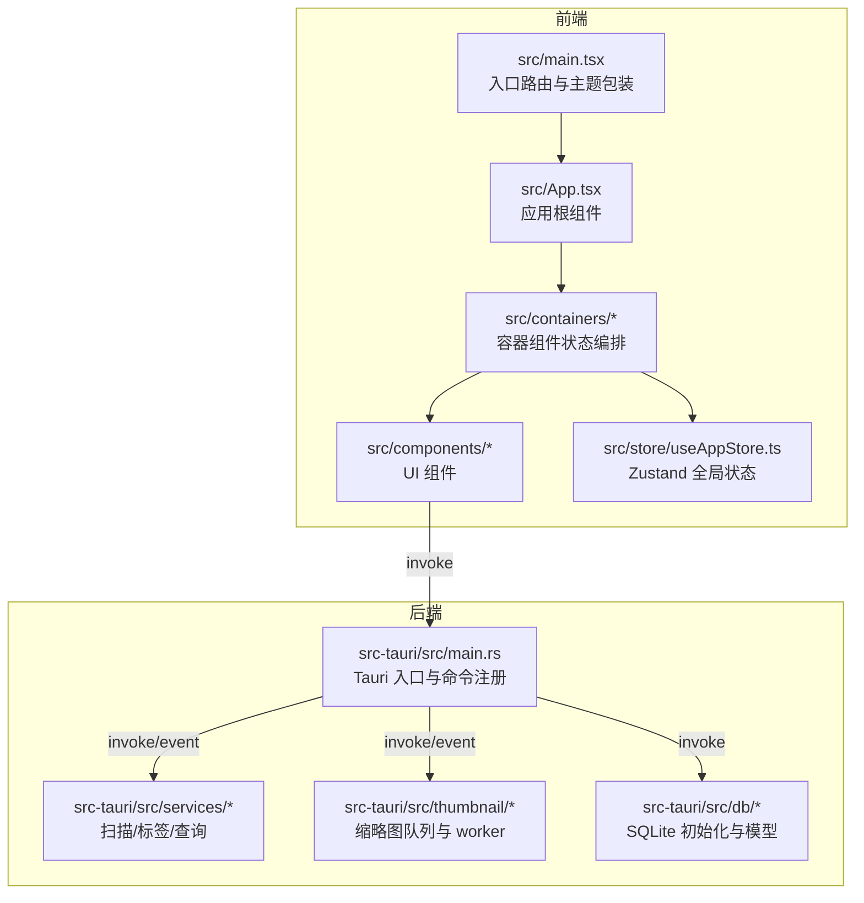
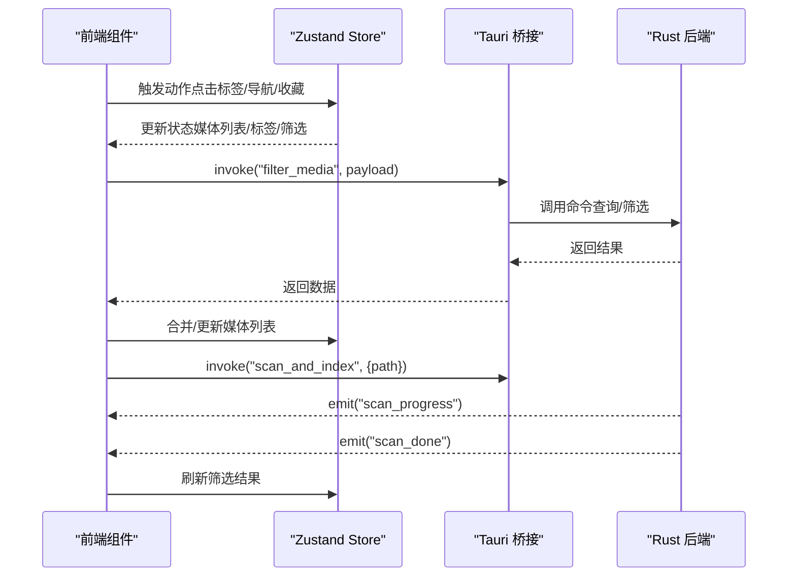
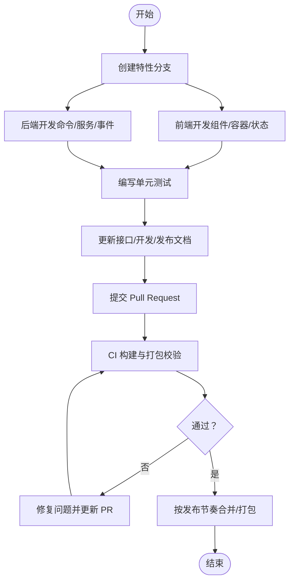
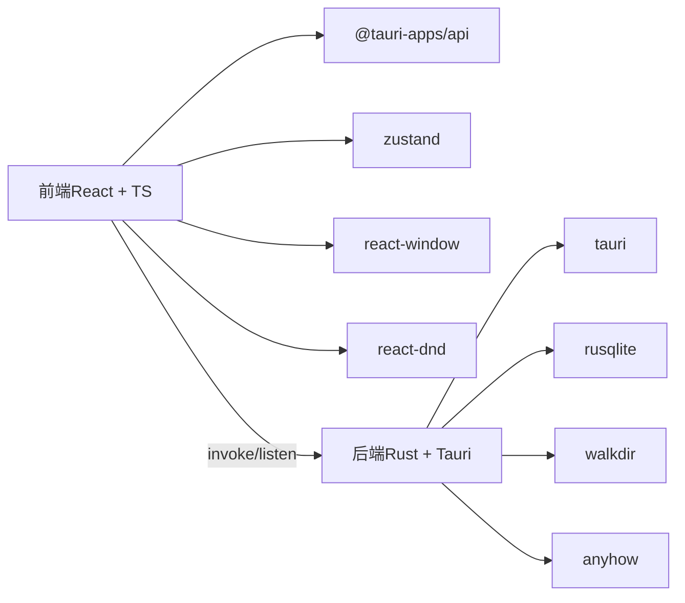

# 团队协作规范

<cite>
**本文引用的文件**
- [README.md](file://README.md)
- [DEVELOPMENT.md](file://DEVELOPMENT.md)
- [RELEASE_GUIDE.md](file://RELEASE_GUIDE.md)
- [THEME_GUIDE.md](file://THEME_GUIDE.md)
- [API_REFERENCE.md](file://API_REFERENCE.md)
- [package.json](file://package.json)
- [tauri.conf.json](file://src-tauri/tauri.conf.json)
- [main.yml](file://.github/workflows/main.yml)
- [src/main.tsx](file://src/main.tsx)
- [src/App.tsx](file://src/App.tsx)
- [src/store/useAppStore.ts](file://src/store/useAppStore.ts)
- [src/containers/MediaGridContainer.tsx](file://src/containers/MediaGridContainer.tsx)
- [src/containers/SidebarContainer.tsx](file://src/containers/SidebarContainer.tsx)
- [src-tauri/src/main.rs](file://src-tauri/src/main.rs)
- [src-tauri/src/services/scanner.rs](file://src-tauri/src/services/scanner.rs)
</cite>

## 目录
1. [简介](#简介)
2. [项目结构](#项目结构)
3. [核心组件](#核心组件)
4. [架构总览](#架构总览)
5. [详细组件分析](#详细组件分析)
6. [依赖分析](#依赖分析)
7. [性能考虑](#性能考虑)
8. [故障排查指南](#故障排查指南)
9. [结论](#结论)
10. [附录](#附录)

## 简介
本规范面向 Medex 项目团队，旨在建立统一的任务分配、项目管理、沟通协作、代码贡献与发布流程，保障跨职能协作与分布式团队高效协同。文档结合现有开发文档与仓库现状，给出可落地的流程与最佳实践。

## 项目结构
Medex 采用前端（React + TypeScript + Tauri 前端桥接）+ Rust 后端（Tauri v2 + SQLite）的混合架构，前端负责 UI 与交互，后端负责扫描、索引、标签与缩略图等业务逻辑，二者通过 Tauri invoke/event 通信。

图表来源
- [src/main.tsx:1-44](file://src/main.tsx#L1-L44)
- [src/App.tsx:1-73](file://src/App.tsx#L1-L73)
- [src/store/useAppStore.ts:1-395](file://src/store/useAppStore.ts#L1-L395)
- [src-tauri/src/main.rs:1-69](file://src-tauri/src/main.rs#L1-L69)

章节来源
- [README.md:97-119](file://README.md#L97-L119)
- [DEVELOPMENT.md:51-116](file://DEVELOPMENT.md#L51-L116)

## 核心组件
- 前端入口与路由：根据路径决定渲染主应用、设置页或更新页，统一包裹主题 Provider。
- 应用根组件：组合侧边栏、主内容区与全屏查看器，处理导航与媒体列表联动。
- 容器组件：封装状态编排与 Tauri 通信，如媒体网格容器、侧边栏容器。
- 全局状态：Zustand store 管理导航、标签、媒体列表、筛选条件与收藏/最近状态。
- 后端入口：注册 Tauri 命令与事件，初始化数据库与缩略图系统，设置菜单与事件监听。
- 服务模块：扫描目录、批量插入、标签管理、媒体查询、最近查看等。

章节来源
- [src/main.tsx:9-41](file://src/main.tsx#L9-L41)
- [src/App.tsx:8-72](file://src/App.tsx#L8-L72)
- [src/store/useAppStore.ts:48-394](file://src/store/useAppStore.ts#L48-L394)
- [src-tauri/src/main.rs:10-68](file://src-tauri/src/main.rs#L10-L68)

## 架构总览
Medex 的前后端通过 Tauri 桥接，前端通过 invoke 调用后端命令，后端通过事件推送扫描进度与缩略图完成通知。容器组件负责监听事件与刷新状态，UI 组件消费 store 数据并触发命令。

图表来源
- [API_REFERENCE.md:397-447](file://API_REFERENCE.md#L397-L447)
- [src/containers/MediaGridContainer.tsx:210-235](file://src/containers/MediaGridContainer.tsx#L210-L235)
- [src-tauri/src/main.rs:49-65](file://src-tauri/src/main.rs#L49-L65)

## 详细组件分析

### 任务分配与项目管理流程
- 需求评审
  - 由产品/技术负责人组织，明确功能边界、性能与兼容性要求。
  - 参考现有开发文档与接口文档，评估实现难度与依赖。
- 任务分解
  - 将功能拆分为前端组件、容器、状态与后端命令/服务模块。
  - 以 PR 为交付单元，避免跨模块耦合。
- 进度跟踪
  - 使用分支策略与 CI 发布流水线，保证每次合并均通过构建与打包校验。
  - 里程碑与版本节奏参考发布指南建议。

章节来源
- [RELEASE_GUIDE.md:182-206](file://RELEASE_GUIDE.md#L182-L206)
- [DEVELOPMENT.md:503-525](file://DEVELOPMENT.md#L503-L525)

### 沟通机制与信息共享
- 会议制度
  - 日站会：同步昨日进展、今日计划与阻塞项。
  - 双周回顾：回顾发布节奏、问题与改进点。
- 文档标准
  - 接口文档、开发文档、发布指南三类文档并行维护，保持与代码一致。
  - 重要变更在变更日志中记录。
- 知识库维护
  - 将常见问题与排障手册沉淀为知识库条目，便于新人查阅。

章节来源
- [API_REFERENCE.md:1-16](file://API_REFERENCE.md#L1-L16)
- [RELEASE_GUIDE.md:241-249](file://RELEASE_GUIDE.md#L241-L249)

### 代码贡献流程（从需求到上线）
- 功能开发
  - 前端：新增组件/容器，使用主题上下文与 store 编排状态。
  - 后端：新增命令或服务模块，完善事件与错误处理。
- 测试编写
  - 前端：针对容器组件与 store action 编写单元测试。
  - 后端：针对扫描/标签/缩略图等关键路径编写集成测试。
- 文档更新
  - 更新接口文档与开发文档，补充类型与调用示例。
- 提交流程
  - fork 仓库 -> 创建特性分支 -> 提交更改 -> 推送分支 -> 开启 PR。
  - CI 通过后由维护者合并。

图表来源
- [README.md:171-179](file://README.md#L171-L179)
- [RELEASE_GUIDE.md:182-206](file://RELEASE_GUIDE.md#L182-L206)

章节来源
- [README.md:171-179](file://README.md#L171-L179)
- [DEVELOPMENT.md:597-604](file://DEVELOPMENT.md#L597-L604)

### 冲突解决与决策机制
- 技术决策流程
  - 重大改动需在团队内形成共识，必要时形成设计文档。
  - 采用“小步快跑 + 可回滚”的策略，降低风险。
- 争议解决程序
  - 优先通过讨论达成一致；若无法解决，由技术负责人裁决。
- 团队共识建立
  - 通过 PR 评审、代码走读与结对编程促进共识。

章节来源
- [DEVELOPMENT.md:597-604](file://DEVELOPMENT.md#L597-L604)

### 技能发展与知识传承
- 导师制度
  - 新人由资深成员结对指导，覆盖前端组件开发、后端命令扩展与发布流程。
- 技术分享
  - 每两周一次主题分享（如 Tauri 桥接、Rust 性能优化、主题系统演进）。
- 培训计划
  - 基础：开发环境搭建与调试。
  - 进阶：命令注册、事件系统、缩略图队列与数据库设计。
  - 高阶：发布流程、CI/CD 与安全合规。

章节来源
- [THEME_GUIDE.md:1-193](file://THEME_GUIDE.md#L1-L193)
- [DEVELOPMENT.md:503-525](file://DEVELOPMENT.md#L503-L525)

### 远程协作工具与工作时间协调
- 工具使用
  - 代码托管与 CI：GitHub Actions 自动打包与发布。
  - 任务管理：Issue/PR 作为任务载体，里程碑跟踪版本节奏。
- 时间协调
  - 采用异步沟通为主，必要时安排同步会议。
  - 通过 CI 与自动化测试减少等待时间，提升反馈效率。

章节来源
- [.github/workflows/main.yml:1-42](file://.github/workflows/main.yml#L1-L42)
- [RELEASE_GUIDE.md:182-206](file://RELEASE_GUIDE.md#L182-L206)

## 依赖分析
- 前端依赖
  - React + TypeScript + Tauri JS API + Zustand + react-window + react-dnd。
- 后端依赖
  - Tauri v2 + Rust + rusqlite + walkdir + once_cell + anyhow。
- 构建与打包
  - Vite + Tauri CLI，支持多平台打包与自动更新。

图表来源
- [package.json:12-34](file://package.json#L12-L34)
- [src-tauri/src/main.rs:1-69](file://src-tauri/src/main.rs#L1-L69)

章节来源
- [package.json:12-34](file://package.json#L12-L34)
- [tauri.conf.json:1-46](file://src-tauri/tauri.conf.json#L1-L46)

## 性能考虑
- 前端性能
  - 虚拟化渲染（react-window）控制 DOM 数量。
  - 缩略图懒加载与优先级调度，限制并发与队列长度。
- 后端性能
  - 批量插入事务减少 IO。
  - 缩略图 worker 固定并发与队列容量，避免阻塞。
- 发布与分发
  - ffmpeg 二进制内置分发，减少用户环境差异带来的性能与稳定性问题。

章节来源
- [DEVELOPMENT.md:306-341](file://DEVELOPMENT.md#L306-L341)
- [DEVELOPMENT.md:344-378](file://DEVELOPMENT.md#L344-L378)
- [RELEASE_GUIDE.md:73-115](file://RELEASE_GUIDE.md#L73-L115)

## 故障排查指南
- 权限与能力
  - 确保 Tauri 能力包含对话框相关权限，避免弹窗失败。
- 本地文件预览
  - 使用 convertFileSrc 转换本地路径，避免 unsupported URL。
- 缩略图生成
  - 检查 ffmpeg 是否存在，必要时准备多平台二进制并配置 externalBin。
- 页面卡顿
  - 排查是否误挂载视频节点、是否启用虚拟化、并发是否过高。

章节来源
- [DEVELOPMENT.md:564-595](file://DEVELOPMENT.md#L564-L595)
- [RELEASE_GUIDE.md:209-230](file://RELEASE_GUIDE.md#L209-L230)

## 结论
本规范以现有开发文档为基础，结合发布与接口文档，给出了可执行的任务管理、沟通协作、代码贡献与发布流程。建议团队在实践中持续优化流程与文档，确保跨职能与分布式协作的高效与稳定。

## 附录
- 关键文件索引
  - 前端入口：src/main.tsx
  - 应用根组件：src/App.tsx
  - 全局状态：src/store/useAppStore.ts
  - 媒体网格容器：src/containers/MediaGridContainer.tsx
  - 侧边栏容器：src/containers/SidebarContainer.tsx
  - 后端入口：src-tauri/src/main.rs
  - 扫描服务：src-tauri/src/services/scanner.rs
  - 接口文档：API_REFERENCE.md
  - 发布指南：RELEASE_GUIDE.md
  - 主题指南：THEME_GUIDE.md

章节来源
- [DEVELOPMENT.md:620-635](file://DEVELOPMENT.md#L620-L635)