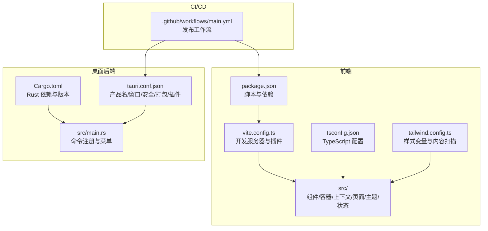
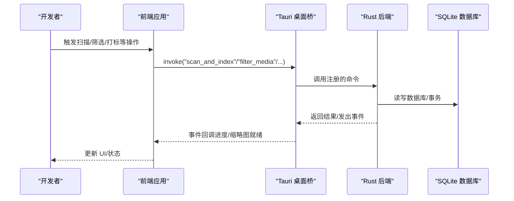
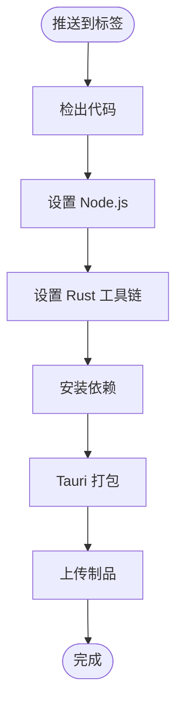
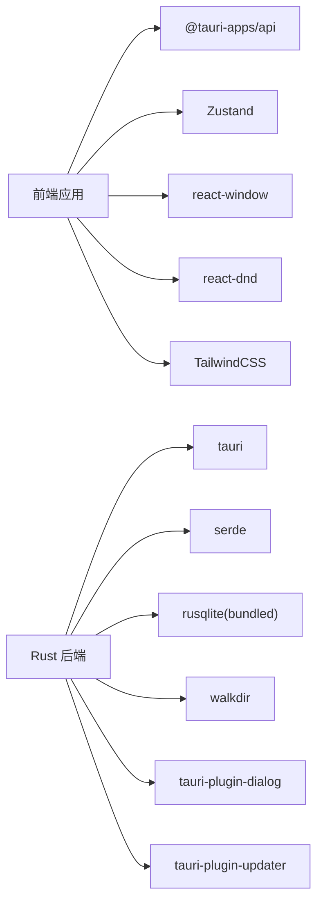

# 开发工作流程

<cite>
**本文引用的文件**
- [README.md](file://README.md)
- [DEVELOPMENT.md](file://DEVELOPMENT.md)
- [RELEASE_GUIDE.md](file://RELEASE_GUIDE.md)
- [API_REFERENCE.md](file://API_REFERENCE.md)
- [.github/workflows/main.yml](file://.github/workflows/main.yml)
- [package.json](file://package.json)
- [src-tauri/Cargo.toml](file://src-tauri/Cargo.toml)
- [src-tauri/tauri.conf.json](file://src-tauri/tauri.conf.json)
- [vite.config.ts](file://vite.config.ts)
- [tsconfig.json](file://tsconfig.json)
- [tailwind.config.ts](file://tailwind.config.ts)
- [src-tauri/src/main.rs](file://src-tauri/src/main.rs)
- [THEME_GUIDE.md](file://THEME_GUIDE.md)
</cite>

## 目录
1. [简介](#简介)
2. [项目结构](#项目结构)
3. [核心组件](#核心组件)
4. [架构总览](#架构总览)
5. [详细组件分析](#详细组件分析)
6. [依赖分析](#依赖分析)
7. [性能考虑](#性能考虑)
8. [故障排除指南](#故障排除指南)
9. [结论](#结论)
10. [附录](#附录)

## 简介
本指南面向 Medex 项目的开发团队，系统性地梳理从代码审查、版本控制、持续集成到团队协作与开发效率提升的全流程规范。结合现有仓库中的开发文档、发布指南、CI 工作流与技术配置，形成可落地的开发工作流程，帮助新成员快速上手并维持高质量交付。

## 项目结构
Medex 采用前端（React + TypeScript + Vite）与桌面后端（Tauri + Rust）的混合架构，核心目录与职责如下：
- 前端源码：src/（组件、容器、上下文、页面、主题、状态）
- 桌面后端：src-tauri/（Rust 项目、Tauri 配置、能力与图标）
- 构建与工具：package.json、vite.config.ts、tsconfig.json、tailwind.config.ts
- CI/CD：.github/workflows/main.yml
- 文档：README.md、DEVELOPMENT.md、RELEASE_GUIDE.md、API_REFERENCE.md、THEME_GUIDE.md

图表来源
- [package.json:1-36](file://package.json#L1-L36)
- [vite.config.ts:1-11](file://vite.config.ts#L1-L11)
- [tsconfig.json:1-19](file://tsconfig.json#L1-L19)
- [tailwind.config.ts:1-36](file://tailwind.config.ts#L1-L36)
- [src-tauri/Cargo.toml:1-23](file://src-tauri/Cargo.toml#L1-L23)
- [src-tauri/tauri.conf.json:1-46](file://src-tauri/tauri.conf.json#L1-L46)
- [src-tauri/src/main.rs:1-69](file://src-tauri/src/main.rs#L1-L69)
- [.github/workflows/main.yml:1-42](file://.github/workflows/main.yml#L1-L42)

章节来源
- [README.md:97-119](file://README.md#L97-L119)
- [package.json:1-36](file://package.json#L1-L36)
- [src-tauri/Cargo.toml:1-23](file://src-tauri/Cargo.toml#L1-L23)
- [src-tauri/tauri.conf.json:1-46](file://src-tauri/tauri.conf.json#L1-L46)
- [.github/workflows/main.yml:1-42](file://.github/workflows/main.yml#L1-L42)

## 核心组件
- 前端开发与构建
  - Vite 开发服务器（端口与严格端口）、React 插件、TypeScript 严格模式
  - TailwindCSS 样式系统与主题变量
- 桌面后端与打包
  - Tauri v2 配置（窗口、安全协议、打包与更新插件）
  - Rust 依赖（SQLite、文件扫描、对话框、更新器）
- 接口与事件
  - Tauri invoke 命令与事件通道（扫描进度、缩略图就绪）
- 主题系统
  - React Context + 主题变量 + Tailwind 变量映射

章节来源
- [vite.config.ts:1-11](file://vite.config.ts#L1-L11)
- [tsconfig.json:1-19](file://tsconfig.json#L1-L19)
- [tailwind.config.ts:1-36](file://tailwind.config.ts#L1-L36)
- [src-tauri/tauri.conf.json:1-46](file://src-tauri/tauri.conf.json#L1-L46)
- [src-tauri/Cargo.toml:1-23](file://src-tauri/Cargo.toml#L1-L23)
- [API_REFERENCE.md:19-33](file://API_REFERENCE.md#L19-L33)

## 架构总览
Medex 的前后端通过 Tauri 的 invoke 与事件通道通信，前端负责 UI 与交互，后端负责文件扫描、数据库与缩略图生成。CI 在打上版本标签时自动触发发布流程。

图表来源
- [API_REFERENCE.md:39-153](file://API_REFERENCE.md#L39-L153)
- [API_REFERENCE.md:282-329](file://API_REFERENCE.md#L282-L329)
- [src-tauri/src/main.rs:49-65](file://src-tauri/src/main.rs#L49-L65)

章节来源
- [API_REFERENCE.md:19-33](file://API_REFERENCE.md#L19-L33)
- [API_REFERENCE.md:39-153](file://API_REFERENCE.md#L39-L153)
- [API_REFERENCE.md:282-329](file://API_REFERENCE.md#L282-L329)
- [src-tauri/src/main.rs:49-65](file://src-tauri/src/main.rs#L49-L65)

## 详细组件分析

### 代码审查流程
- Pull Request 模板
  - 建议在 .github/PULL_REQUEST_TEMPLATE.md 中定义 PR 模板，包含变更摘要、影响范围、测试验证、截图/录屏、回归检查清单等。
- 代码审查清单
  - 代码风格与类型安全：TypeScript 严格模式、ESLint（如已配置）、组件函数式写法、Tailwind 使用
  - 交互与性能：虚拟列表、缩略图并发与去重、事件总线与状态同步
  - 安全与权限：Tauri 能力配置、资源协议作用域、外部二进制分发
  - 可测试性：命令与事件的可测试性、错误处理一致性
- 合并策略
  - 采用快进合并或 squash 合并，保留清晰的提交历史；重要变更建议开启二次审查
  - 合并前确保 CI 通过、文档更新、必要时进行小规模回归验证

章节来源
- [README.md:162-168](file://README.md#L162-L168)
- [DEVELOPMENT.md:597-604](file://DEVELOPMENT.md#L597-L604)
- [API_REFERENCE.md:450-467](file://API_REFERENCE.md#L450-L467)

### 版本控制最佳实践
- 分支策略
  - main：稳定发布线
  - release/*：发布候选分支
  - feature/* / fix/*：功能与修复分支
- 提交消息规范
  - 建议采用约定式提交（feat/fix/docs/chore/style/refactor/test/build/ci），并在 PR 合并时 squash
- 标签管理与版本发布
  - 使用语义化版本（vX.Y.Z），CI 在 push 标签时触发发布
  - 发布前检查：前端构建、Rust 检查、外部二进制存在性
- 版本号同步
  - package.json 与 Cargo.toml 的 version 保持一致，避免发布产物与依赖声明不一致

章节来源
- [RELEASE_GUIDE.md:184-189](file://RELEASE_GUIDE.md#L184-L189)
- [RELEASE_GUIDE.md:252-272](file://RELEASE_GUIDE.md#L252-L272)
- [package.json:4](file://package.json#L4)
- [src-tauri/Cargo.toml:3](file://src-tauri/Cargo.toml#L3)
- [.github/workflows/main.yml:3-7](file://.github/workflows/main.yml#L3-L7)

### 持续集成配置
- 工作流概述
  - 触发条件：push 标签（v*）
  - 平台矩阵：macOS 与 Windows
  - 步骤：安装 Node 与 Rust、安装依赖、Tauri 打包、上传制品
- 关键配置
  - Node 与 Rust 版本、Tauri CLI、签名密钥与密码、发布名称与正文
- 建议增强
  - 增加前端构建与 Rust 检查阶段，确保构建稳定性
  - 为不同平台产物命名规范化（含版本、平台、架构）

图表来源
- [.github/workflows/main.yml:20-42](file://.github/workflows/main.yml#L20-L42)

章节来源
- [.github/workflows/main.yml:1-42](file://.github/workflows/main.yml#L1-L42)
- [RELEASE_GUIDE.md:182-206](file://RELEASE_GUIDE.md#L182-L206)

### 团队协作规范
- 任务分配
  - 使用 Issue/Project/GitHub Milestone 管理需求与迭代
- 沟通机制
  - 日常站会、评审会议、问题跟踪与文档沉淀
- 文档维护
  - 开发文档、接口文档、发布指南、主题指南与变更日志
- 知识分享
  - 技术分享、代码评审、新人培训与工具链优化

章节来源
- [DEVELOPMENT.md:503-525](file://DEVELOPMENT.md#L503-L525)
- [RELEASE_GUIDE.md:241-249](file://RELEASE_GUIDE.md#L241-L249)

### 开发环境标准化
- IDE 与编辑器
  - VS Code（推荐扩展：ESLint、Prettier、Tailwind IntelliSense、ES7+ React/Redux Snippets）
- 开发工具
  - Node.js 18+、Rust stable、Tauri CLI、Git
- 环境变量管理
  - 前端：Vite 环境变量（NODE_ENV、开发端口）
  - 后端：Rust 环境（编译器版本、目标三元组）
  - CI：GITHUB_TOKEN、签名私钥与密码
- 依赖与构建
  - package.json 脚本：dev、build、preview、tauri
  - Vite 配置：端口与严格端口
  - TypeScript 严格模式与模块解析
  - Tailwind 内容扫描与主题变量

章节来源
- [README.md:52-56](file://README.md#L52-L56)
- [vite.config.ts:6-9](file://vite.config.ts#L6-L9)
- [tsconfig.json:14-16](file://tsconfig.json#L14-L16)
- [tailwind.config.ts:4](file://tailwind.config.ts#L4)
- [.github/workflows/main.yml:23-35](file://.github/workflows/main.yml#L23-L35)

### 开发效率提升技巧
- 快捷键与编辑器
  - VS Code 快捷键：多光标、片段插入、格式化、重构
- 自动化脚本
  - 前端：npm run dev、build、preview、tauri
  - 后端：cargo check、test（如后续增加）
- 工具集成
  - ESLint + Prettier 统一风格
  - Git hooks（pre-commit）校验构建与 Lint
  - IDE 集成终端与调试面板

章节来源
- [package.json:6-11](file://package.json#L6-L11)
- [DEVELOPMENT.md:440-467](file://DEVELOPMENT.md#L440-L467)

### 新成员入职指南
- 环境搭建
  - 安装 Node.js 18+、Rust stable、Tauri CLI
  - 克隆仓库、安装依赖（npm install）
  - 配置 Cargo 镜像源（如需）
- 运行与调试
  - 前端开发：npm run dev
  - 完整开发：npm run tauri dev
  - 构建与预览：npm run build、npm run preview
  - Rust 检查：cd src-tauri && cargo check
- 文档阅读
  - README.md、DEVELOPMENT.md、API_REFERENCE.md、RELEASE_GUIDE.md、THEME_GUIDE.md
- 第一次贡献
  - Fork 仓库、创建特性分支、提交与推送、发起 PR

章节来源
- [README.md:50-94](file://README.md#L50-L94)
- [DEVELOPMENT.md:440-467](file://DEVELOPMENT.md#L440-L467)
- [RELEASE_GUIDE.md:143-157](file://RELEASE_GUIDE.md#L143-L157)

## 依赖分析
- 前端依赖
  - React、Zustand、react-window、react-dnd、@tauri-apps/api、TailwindCSS
- 后端依赖
  - Tauri v2、Serde、rusqlite（bundled）、walkdir、once_cell、anyhow、tauri-plugin-dialog、tauri-plugin-updater
- 构建与工具
  - Vite、TypeScript、PostCSS、Autoprefixer、TailwindCSS

图表来源
- [package.json:12-34](file://package.json#L12-L34)
- [src-tauri/Cargo.toml:13-22](file://src-tauri/Cargo.toml#L13-L22)

章节来源
- [package.json:12-34](file://package.json#L12-L34)
- [src-tauri/Cargo.toml:13-22](file://src-tauri/Cargo.toml#L13-L22)

## 性能考虑
- 前端性能
  - 虚拟化渲染（react-window）减少 DOM 数量
  - 缩略图懒加载与优先级调度（并发与队列上限）
  - 避免在网格内挂载多个视频元素
- 后端性能
  - 事务批量写入、索引优化、worker 并发与队列容量
- 构建与打包
  - 外部二进制（ffmpeg）按平台分发，避免运行时缺失

章节来源
- [DEVELOPMENT.md:306-341](file://DEVELOPMENT.md#L306-L341)
- [DEVELOPMENT.md:344-378](file://DEVELOPMENT.md#L344-L378)
- [RELEASE_GUIDE.md:73-94](file://RELEASE_GUIDE.md#L73-L94)

## 故障排除指南
- dialog.open 权限
  - 检查 capabilities/default.json 是否包含所需权限
- 本地文件无法预览
  - 确保使用 convertFileSrc 转换文件路径
- 缩略图失败
  - 检查 ffmpeg 是否存在与可执行权限
- 页面卡顿/白屏
  - 排查是否误挂载多个视频、是否启用虚拟化、并发是否过高
- 发布失败
  - externalBin 缺失对应平台二进制、图标缺失或格式不正确

章节来源
- [DEVELOPMENT.md:564-595](file://DEVELOPMENT.md#L564-L595)
- [RELEASE_GUIDE.md:209-230](file://RELEASE_GUIDE.md#L209-L230)

## 结论
本指南基于现有仓库配置与文档，建立了覆盖代码审查、版本控制、CI/CD、团队协作与开发效率的完整工作流程。建议在后续迭代中补充 PR 模板、完善测试与质量门禁，并持续优化主题系统与接口文档，以支撑更大规模的团队协作与高质量交付。

## 附录
- 命令与脚本
  - 前端：dev、build、preview、tauri
  - 后端：cargo check、test（建议新增）
- 关键配置文件
  - vite.config.ts、tsconfig.json、tailwind.config.ts、tauri.conf.json、Cargo.toml
- 文档清单
  - README.md、DEVELOPMENT.md、RELEASE_GUIDE.md、API_REFERENCE.md、THEME_GUIDE.md

章节来源
- [package.json:6-11](file://package.json#L6-L11)
- [vite.config.ts:1-11](file://vite.config.ts#L1-L11)
- [tsconfig.json:1-19](file://tsconfig.json#L1-L19)
- [tailwind.config.ts:1-36](file://tailwind.config.ts#L1-L36)
- [src-tauri/tauri.conf.json:1-46](file://src-tauri/tauri.conf.json#L1-L46)
- [src-tauri/Cargo.toml:1-23](file://src-tauri/Cargo.toml#L1-L23)