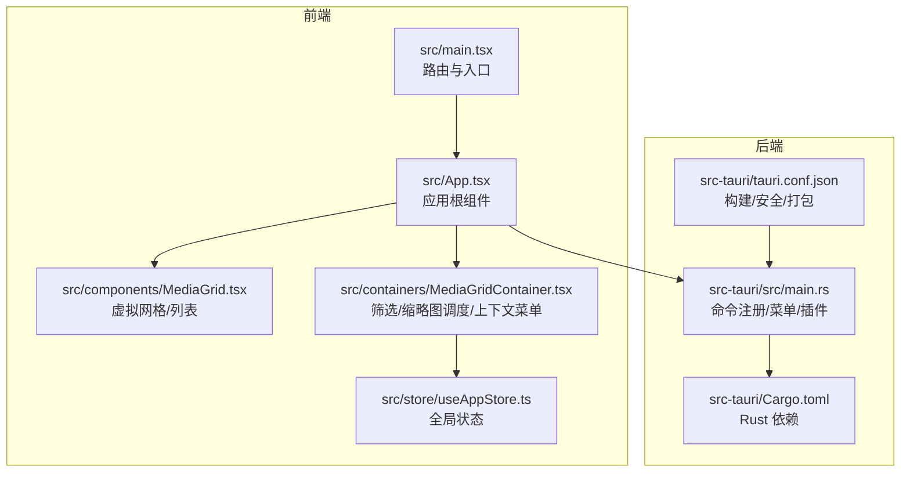
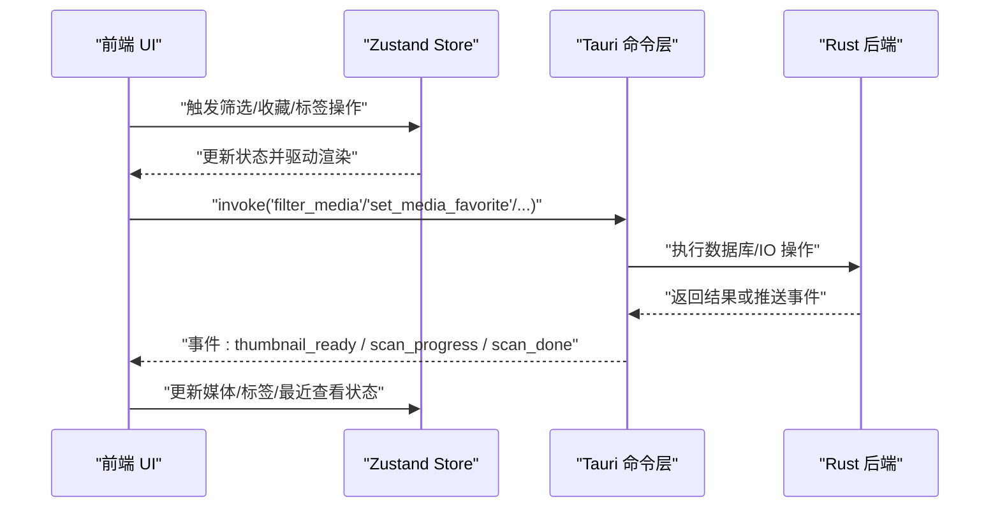
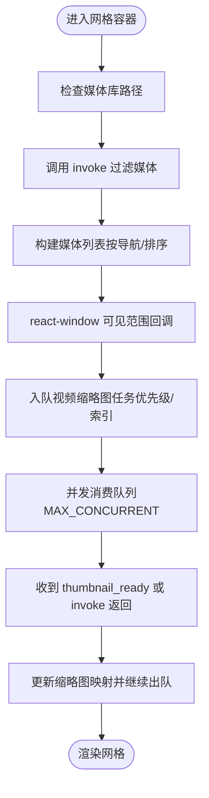
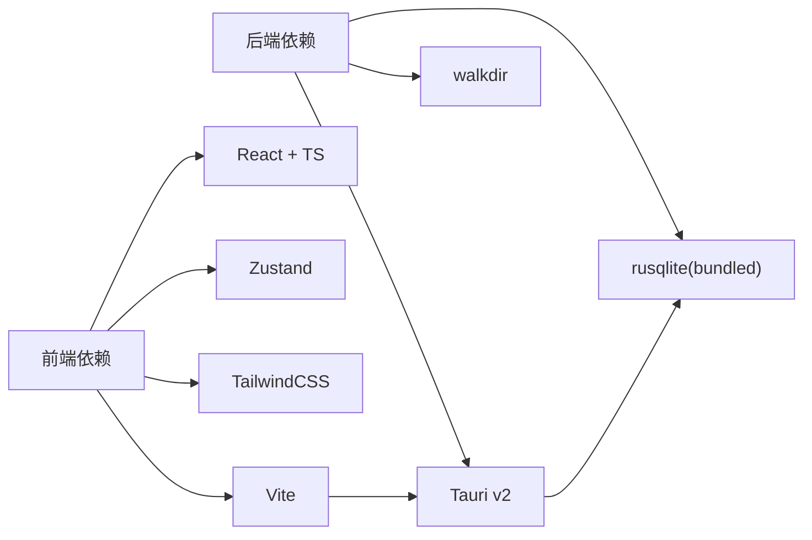

# 开发效率提升

<cite>
**本文引用的文件**   
- [package.json](file://package.json)
- [vite.config.ts](file://vite.config.ts)
- [DEVELOPMENT.md](file://DEVELOPMENT.md)
- [README.md](file://README.md)
- [src/main.tsx](file://src/main.tsx)
- [src/App.tsx](file://src/App.tsx)
- [src/containers/MediaGridContainer.tsx](file://src/containers/MediaGridContainer.tsx)
- [src/components/MediaGrid.tsx](file://src/components/MediaGrid.tsx)
- [src/store/useAppStore.ts](file://src/store/useAppStore.ts)
- [src-tauri/tauri.conf.json](file://src-tauri/tauri.conf.json)
- [src-tauri/src/main.rs](file://src-tauri/src/main.rs)
- [src-tauri/Cargo.toml](file://src-tauri/Cargo.toml)
- [tailwind.config.ts](file://tailwind.config.ts)
- [tsconfig.json](file://tsconfig.json)
- [postcss.config.js](file://postcss.config.js)
</cite>

## 目录
1. [简介](#简介)
2. [项目结构](#项目结构)
3. [核心组件](#核心组件)
4. [架构总览](#架构总览)
5. [详细组件分析](#详细组件分析)
6. [依赖分析](#依赖分析)
7. [性能考虑](#性能考虑)
8. [故障排除指南](#故障排除指南)
9. [结论](#结论)
10. [附录](#附录)

## 简介
本指南面向 Medex 项目开发者，聚焦于提升开发效率与工作流质量。内容覆盖编辑器快捷键与技巧、自动化脚本与任务管理、开发工具集成与热重载/调试/预览、性能优化策略、学习资源与技能路径、以及问题诊断与故障排除方法。目标是在保证高质量交付的同时，缩短迭代周期、降低心智负担。

## 项目结构
Medex 采用“前端 React + TypeScript + Vite + TailwindCSS + Zustand + Tauri v2 + Rust + SQLite”的技术栈，前后端通过 Tauri 的 invoke/event 通信。前端负责 UI 与交互、虚拟化渲染、缩略图调度；后端负责扫描、标签与媒体查询、缩略图生成与缓存、数据库持久化。

**图表来源**
- [src/main.tsx:1-44](file://src/main.tsx#L1-L44)
- [src/App.tsx:1-73](file://src/App.tsx#L1-L73)
- [src/components/MediaGrid.tsx:1-351](file://src/components/MediaGrid.tsx#L1-L351)
- [src/containers/MediaGridContainer.tsx:1-619](file://src/containers/MediaGridContainer.tsx#L1-L619)
- [src/store/useAppStore.ts:1-395](file://src/store/useAppStore.ts#L1-L395)
- [src-tauri/src/main.rs:1-69](file://src-tauri/src/main.rs#L1-L69)
- [src-tauri/Cargo.toml:1-23](file://src-tauri/Cargo.toml#L1-L23)
- [src-tauri/tauri.conf.json:1-46](file://src-tauri/tauri.conf.json#L1-L46)

**章节来源**
- [README.md:97-119](file://README.md#L97-L119)
- [DEVELOPMENT.md:51-116](file://DEVELOPMENT.md#L51-L116)

## 核心组件
- 前端入口与路由：根据路径选择渲染主应用、设置页或更新页。
- 应用根组件：协调侧栏、主内容区与全屏媒体查看器。
- 媒体网格：基于 react-window 的虚拟网格/列表，支持 grid/list 切换与 overscan。
- 网格容器：负责筛选、缩略图任务队列与并发控制、上下文菜单与批量标签操作、事件监听与本地存储同步。
- 全局状态：Zustand store 管理导航、标签、媒体列表、视图模式与筛选条件。
- 后端命令：扫描、标签、媒体查询、缩略图请求等通过 Tauri invoke 暴露。
- 构建与打包：Vite + Tauri CLI，前端产物由 Tauri 承载，Rust 侧负责数据库初始化与插件。

**章节来源**
- [src/main.tsx:9-44](file://src/main.tsx#L9-L44)
- [src/App.tsx:8-73](file://src/App.tsx#L8-L73)
- [src/components/MediaGrid.tsx:70-212](file://src/components/MediaGrid.tsx#L70-L212)
- [src/containers/MediaGridContainer.tsx:30-619](file://src/containers/MediaGridContainer.tsx#L30-L619)
- [src/store/useAppStore.ts:48-395](file://src/store/useAppStore.ts#L48-L395)
- [src-tauri/src/main.rs:49-65](file://src-tauri/src/main.rs#L49-L65)

## 架构总览
Medex 的前后端通过 Tauri 的 invoke 与事件通道协作，前端负责 UI 与性能优化（虚拟化、缩略图调度），后端负责 IO 密集型任务（扫描、缩略图生成、数据库访问）。

**图表来源**
- [src/containers/MediaGridContainer.tsx:210-235](file://src/containers/MediaGridContainer.tsx#L210-L235)
- [src/App.tsx:35-42](file://src/App.tsx#L35-L42)
- [src-tauri/src/main.rs:49-65](file://src-tauri/src/main.rs#L49-L65)

## 详细组件分析

### 前端入口与页面路由
- 根据 URL 路径决定渲染主应用、设置页或更新页，便于独立页面开发与调试。
- 建议在开发时针对不同页面开启独立的构建/预览流程，减少不必要的热重载范围。

**章节来源**
- [src/main.tsx:9-44](file://src/main.tsx#L9-L44)

### 应用根组件与媒体查看器
- 负责根据导航状态筛选媒体列表，双击卡片打开全屏查看器。
- 调用后端标记最近查看并触发全局刷新事件，保持 UI 与后端一致。

**章节来源**
- [src/App.tsx:15-42](file://src/App.tsx#L15-L42)

### 媒体网格与虚拟化渲染
- 使用 react-window 的 FixedSizeGrid/FixedSizeList，结合 overscan 与可见区域回调，仅渲染可视元素，显著降低 DOM 数量。
- 列表模式下提供头部与行渲染，支持标签、类型、时间等字段展示。

**章节来源**
- [src/components/MediaGrid.tsx:133-168](file://src/components/MediaGrid.tsx#L133-L168)
- [src/components/MediaGrid.tsx:170-212](file://src/components/MediaGrid.tsx#L170-L212)

### 网格容器：筛选、缩略图调度与批量操作
- 通过 invoke 进行筛选与收藏状态切换，本地状态与后端状态通过事件与 store 同步。
- 缩略图任务队列与并发控制：最大并发、队列上限、去重集合、优先级排序，保障滚动流畅。
- 上下文菜单与批量标签操作：支持多选、连续选择、批量添加/移除标签，完成后触发全局刷新事件。

**图表来源**
- [src/containers/MediaGridContainer.tsx:352-486](file://src/containers/MediaGridContainer.tsx#L352-L486)

**章节来源**
- [src/containers/MediaGridContainer.tsx:210-235](file://src/containers/MediaGridContainer.tsx#L210-L235)
- [src/containers/MediaGridContainer.tsx:352-486](file://src/containers/MediaGridContainer.tsx#L352-L486)
- [src/containers/MediaGridContainer.tsx:145-175](file://src/containers/MediaGridContainer.tsx#L145-L175)

### 全局状态管理（Zustand）
- 管理导航项、标签、媒体列表、视图模式与筛选条件。
- 提供本地更新与后端同步的方法，减少重复网络请求与状态不一致。

**章节来源**
- [src/store/useAppStore.ts:48-395](file://src/store/useAppStore.ts#L48-L395)

### 后端命令与数据库
- 前端通过 invoke 调用后端命令：扫描、筛选、收藏、标签管理、缩略图请求等。
- 后端初始化数据库与缩略图系统，注册菜单与事件处理。

**章节来源**
- [src-tauri/src/main.rs:49-65](file://src-tauri/src/main.rs#L49-L65)
- [src-tauri/Cargo.toml:13-23](file://src-tauri/Cargo.toml#L13-L23)

## 依赖分析
- 前端依赖：React、TypeScript、Vite、TailwindCSS、Zustand、react-window、react-dnd、@tauri-apps API。
- 后端依赖：Tauri v2、rusqlite（bundled）、walkdir、once_cell、anyhow。
- 构建与打包：Vite 作为开发服务器与构建器，Tauri 将前端产物打包为桌面应用。

**图表来源**
- [package.json:12-34](file://package.json#L12-L34)
- [src-tauri/Cargo.toml:13-23](file://src-tauri/Cargo.toml#L13-L23)

**章节来源**
- [package.json:12-34](file://package.json#L12-L34)
- [src-tauri/Cargo.toml:13-23](file://src-tauri/Cargo.toml#L13-L23)

## 性能考虑
- 虚拟化渲染：使用 react-window 的网格/列表，合理设置 overscan，避免一次性渲染大量节点。
- 缩略图调度：限制并发、设置队列上限、去重集合、优先级入队，滚动过程只加载可见与下一屏任务。
- 事件与状态同步：使用 window.dispatchEvent 与后端事件，减少重复查询；必要时引入统一的状态同步层（如后续建议）。
- 构建与打包：Vite 开发服务器端口固定，避免端口冲突；生产构建前清理缓存与中间产物。
- 资源协议：启用 asset protocol，确保本地文件预览与资源加载稳定。

**章节来源**
- [src/components/MediaGrid.tsx:170-212](file://src/components/MediaGrid.tsx#L170-L212)
- [src/containers/MediaGridContainer.tsx:27-28](file://src/containers/MediaGridContainer.tsx#L27-L28)
- [src/containers/MediaGridContainer.tsx:352-486](file://src/containers/MediaGridContainer.tsx#L352-L486)
- [src-tauri/tauri.conf.json:23-26](file://src-tauri/tauri.conf.json#L23-L26)

## 故障排除指南
- 对话框权限：若出现对话框打开受限，请检查 capabilities 配置是否包含允许打开与默认权限。
- 本地文件预览：前端必须使用 convertFileSrc 包装绝对路径，否则会出现不受支持的 URL。
- 缩略图失败：检查系统是否存在 ffmpeg，或在 src-tauri/binaries 中放置内置二进制。
- 页面卡顿/白屏：排查是否在网格内挂载过多视频、是否启用虚拟化、并发是否过高。
- Tauri 开发模式：使用 npm run tauri dev 启动完整开发环境，确保前端 dev 服务器与后端同步。

**章节来源**
- [DEVELOPMENT.md:566-595](file://DEVELOPMENT.md#L566-L595)
- [README.md:75-78](file://README.md#L75-L78)
- [src-tauri/tauri.conf.json:23-26](file://src-tauri/tauri.conf.json#L23-L26)

## 结论
通过明确的组件职责、稳定的前后端通信协议、完善的虚拟化与缩略图调度策略，以及规范的开发与故障排除流程，Medex 能够在桌面端实现高性能的媒体浏览体验。建议持续完善状态同步层、引入统一 API 类型层与日志分级，进一步提升可维护性与开发效率。

## 附录

### 开发效率提升清单
- 编辑器快捷键与技巧
  - 快速定位：使用符号/文件搜索（如“查找符号”、“打开文件”）快速跳转到组件或函数定义。
  - 一键修复：启用 ESLint/Prettier 集成，自动修复可修复的问题。
  - 代码折叠：对大型函数与组件进行折叠，聚焦当前修改范围。
  - 片段与模板：为常用组件/容器/命令注册代码片段，减少重复输入。
- 自动化脚本与任务管理
  - 开发：npm run dev（前端）、npm run tauri dev（完整开发）。
  - 构建：npm run build（TS/Vite）、npm run tauri build（打包桌面应用）。
  - 预览：npm run preview（本地预览构建产物）。
  - 检查：npm run build + cd src-tauri && cargo check（前后端一致性检查）。
- 开发工具集成与工作流优化
  - 热重载：Vite 默认启用，端口固定为 1420，避免端口冲突。
  - 调试工具：浏览器 DevTools + Tauri 开发者菜单；后端使用 cargo run/debug。
  - 实时预览：Tauri 将前端资源打包为本地协议，结合 convertFileSrc 实现本地文件预览。
- 性能优化技巧
  - 虚拟化：保持 overscan 合理值，避免过度渲染。
  - 缩略图：控制并发与队列长度，优先加载可见区域。
  - 状态：减少全局事件风暴，必要时合并事件或引入统一状态层。
- 学习资源与技能路径
  - 前端：React 18 + TypeScript + Vite + Zustand + react-window。
  - 后端：Tauri v2 + Rust + rusqlite + 事件系统。
  - 样式：TailwindCSS + PostCSS + Autoprefixer。
  - 构建：Vite 配置与 Tauri 打包流程。
- 问题诊断与故障排除
  - 权限：检查 capabilities 与资源协议。
  - 路径：convertFileSrc 使用与资源作用域。
  - 缩略图：ffmpeg 可用性与内置二进制放置。
  - 卡顿：虚拟化、并发与事件同步排查。

**章节来源**
- [package.json:6-11](file://package.json#L6-L11)
- [vite.config.ts:4-10](file://vite.config.ts#L4-L10)
- [README.md:68-94](file://README.md#L68-L94)
- [DEVELOPMENT.md:440-467](file://DEVELOPMENT.md#L440-L467)
- [src-tauri/tauri.conf.json:6-11](file://src-tauri/tauri.conf.json#L6-L11)