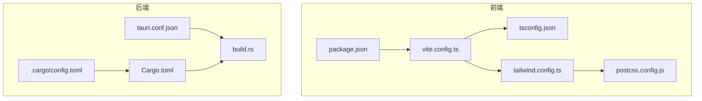
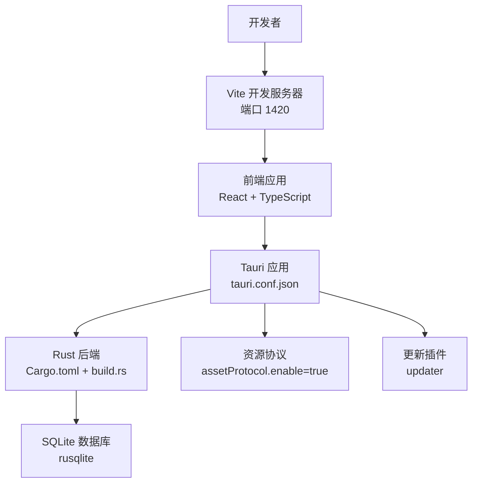
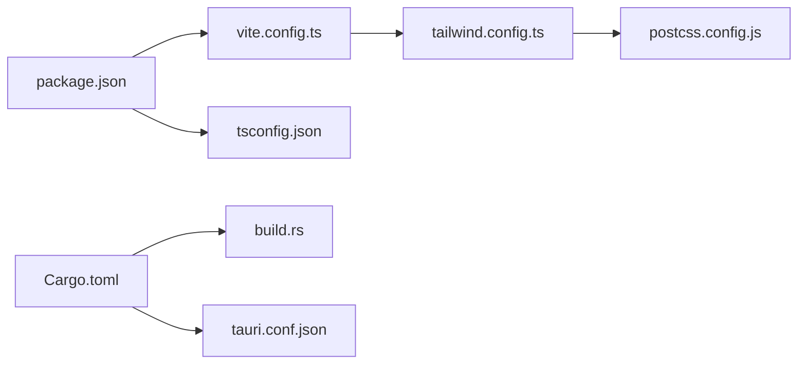

# 开发环境标准化

<cite>
**本文引用的文件**
- [package.json](file://package.json)
- [vite.config.ts](file://vite.config.ts)
- [tsconfig.json](file://tsconfig.json)
- [tailwind.config.ts](file://tailwind.config.ts)
- [postcss.config.js](file://postcss.config.js)
- [src-tauri/Cargo.toml](file://src-tauri/Cargo.toml)
- [src-tauri/tauri.conf.json](file://src-tauri/tauri.conf.json)
- [src-tauri/.cargo/config.toml](file://src-tauri/.cargo/config.toml)
- [src-tauri/build.rs](file://src-tauri/build.rs)
- [DEVELOPMENT.md](file://DEVELOPMENT.md)
- [README.md](file://README.md)
</cite>

## 目录
1. [简介](#简介)
2. [项目结构](#项目结构)
3. [核心组件](#核心组件)
4. [架构总览](#架构总览)
5. [详细组件分析](#详细组件分析)
6. [依赖分析](#依赖分析)
7. [性能考虑](#性能考虑)
8. [故障排除指南](#故障排除指南)
9. [结论](#结论)
10. [附录](#附录)

## 简介
本指南面向 Medex 项目团队，提供一套完整的开发环境标准化方案，覆盖 IDE 配置与插件推荐、开发工具链配置、环境变量与配置文件规范、调试与性能分析、代码格式化与 Linting、以及依赖管理与版本锁定策略。目标是消除环境差异，提升协作效率与构建稳定性。

## 项目结构
Medex 采用“前端 React + TypeScript + Vite + TailwindCSS + Tauri v2 + Rust + SQLite”的技术栈，分为两部分：
- 前端：src/ 目录下的 React 应用，使用 Vite 开发服务器与构建工具，TailwindCSS 作为样式框架。
- 后端：src-tauri/ 目录下的 Tauri/Rust 应用，负责系统集成、数据库访问、缩略图生成与命令桥接。

图表来源
- [package.json:1-36](file://package.json#L1-L36)
- [vite.config.ts:1-11](file://vite.config.ts#L1-L11)
- [tsconfig.json:1-19](file://tsconfig.json#L1-L19)
- [tailwind.config.ts:1-36](file://tailwind.config.ts#L1-L36)
- [postcss.config.js:1-7](file://postcss.config.js#L1-L7)
- [src-tauri/Cargo.toml:1-23](file://src-tauri/Cargo.toml#L1-L23)
- [src-tauri/tauri.conf.json:1-46](file://src-tauri/tauri.conf.json#L1-L46)
- [src-tauri/build.rs:1-4](file://src-tauri/build.rs#L1-L4)
- [src-tauri/.cargo/config.toml:1-5](file://src-tauri/.cargo/config.toml#L1-L5)

章节来源
- [README.md:97-119](file://README.md#L97-L119)
- [DEVELOPMENT.md:51-116](file://DEVELOPMENT.md#L51-L116)

## 核心组件
- 前端开发服务器与构建：Vite 配置了自定义端口与 React 插件，TypeScript 严格模式编译，TailwindCSS 动态色板与 PostCSS 流水线。
- Tauri 应用配置：开发/构建命令、窗口尺寸、安全策略（资源协议）、打包与更新插件。
- Rust 依赖与构建：Rust 版本约束、SQLite 依赖、构建脚本与 Cargo 镜像源。

章节来源
- [vite.config.ts:1-11](file://vite.config.ts#L1-L11)
- [tsconfig.json:1-19](file://tsconfig.json#L1-L19)
- [tailwind.config.ts:1-36](file://tailwind.config.ts#L1-L36)
- [postcss.config.js:1-7](file://postcss.config.js#L1-L7)
- [src-tauri/tauri.conf.json:1-46](file://src-tauri/tauri.conf.json#L1-L46)
- [src-tauri/Cargo.toml:1-23](file://src-tauri/Cargo.toml#L1-L23)
- [src-tauri/.cargo/config.toml:1-5](file://src-tauri/.cargo/config.toml#L1-L5)

## 架构总览
下图展示了前端与后端的开发与运行关系，以及关键配置文件之间的依赖：

图表来源
- [vite.config.ts:6-9](file://vite.config.ts#L6-L9)
- [src-tauri/tauri.conf.json:6-11](file://src-tauri/tauri.conf.json#L6-L11)
- [src-tauri/Cargo.toml:13-22](file://src-tauri/Cargo.toml#L13-L22)
- [src-tauri/.cargo/config.toml:1-5](file://src-tauri/.cargo/config.toml#L1-L5)

## 详细组件分析

### IDE 配置与插件推荐（VS Code）
- 推荐扩展
  - ESLint：统一前端 Lint 规则与修复
  - Prettier：代码格式化
  - Tailwind CSS IntelliSense：Tailwind 类智能提示
  - Rust (rls/rust-analyzer)：Rust 语言支持与诊断
  - Tauri：Tauri 配置与命令提示
  - EditorConfig：统一缩进与换行
  - DotENV：.env 文件语法高亮
- 工作区设置要点
  - 将根目录设为工作区，避免跨项目干扰
  - 前端与后端分别配置独立的语言设置与扩展偏好
  - 使用 tasks.json/launch.json 管理常用任务与调试配置（见附录）

章节来源
- [README.md:162-167](file://README.md#L162-L167)

### 开发工具链配置
- Node.js 与包管理器
  - Node.js 版本：满足项目要求（参见环境要求）
  - 包管理器：npm/pnpm（项目使用 npm 脚本）
- TypeScript
  - 严格模式、模块解析策略、JSX 转换、类型声明等由 tsconfig.json 控制
- Vite
  - 开发服务器端口 1420，严格端口占用；生产构建由 Vite 执行
- TailwindCSS 与 PostCSS
  - Tailwind 动态色板映射 CSS 变量；PostCSS 自动添加厂商前缀
- Rust 与 Tauri
  - Rust 版本约束与依赖；构建脚本 tauri_build；Cargo 镜像源加速

章节来源
- [README.md:52-56](file://README.md#L52-L56)
- [package.json:6-11](file://package.json#L6-L11)
- [tsconfig.json:2-16](file://tsconfig.json#L2-L16)
- [vite.config.ts:6-9](file://vite.config.ts#L6-L9)
- [tailwind.config.ts:3-32](file://tailwind.config.ts#L3-L32)
- [postcss.config.js:1-6](file://postcss.config.js#L1-L6)
- [src-tauri/Cargo.toml:7-8](file://src-tauri/Cargo.toml#L7-L8)
- [src-tauri/build.rs:1-3](file://src-tauri/build.rs#L1-L3)
- [src-tauri/.cargo/config.toml:1-5](file://src-tauri/.cargo/config.toml#L1-L5)

### 环境变量与配置文件规范
- 前端配置
  - Vite：开发端口、插件启用
  - TypeScript：严格模式、模块解析、类型声明
  - Tailwind：content 路径、主题颜色映射
  - PostCSS：Tailwind 与 Autoprefixer 插件
- 后端配置
  - Tauri：开发/构建命令、窗口尺寸、安全策略（资源协议）、打包与更新插件
  - Cargo：镜像源、依赖版本
- 环境差异
  - 建议在 CI 中统一 Node/Rust 版本与依赖锁文件，避免本地与流水线差异

章节来源
- [vite.config.ts:4-10](file://vite.config.ts#L4-L10)
- [tsconfig.json:2-16](file://tsconfig.json#L2-L16)
- [tailwind.config.ts:3-32](file://tailwind.config.ts#L3-L32)
- [postcss.config.js:1-6](file://postcss.config.js#L1-L6)
- [src-tauri/tauri.conf.json:6-44](file://src-tauri/tauri.conf.json#L6-L44)
- [src-tauri/Cargo.toml:1-23](file://src-tauri/Cargo.toml#L1-L23)
- [src-tauri/.cargo/config.toml:1-5](file://src-tauri/.cargo/config.toml#L1-L5)

### 调试工具与性能分析
- 浏览器调试
  - Vite 开发服务器端口 1420，可在浏览器中直接调试前端应用
  - 使用 React DevTools 与 Redux DevTools（如使用相关状态库）
- Rust 调试
  - 使用 rust-analyzer + CodeLLDB（或 LLDB）进行断点调试
  - 在 src-tauri 目录执行 cargo build/run 并附加调试器
- 性能分析
  - 前端：Vite DevTools、React Profiler、浏览器性能面板
  - 后端：perf/flamegraph、Rust 程序性能剖析工具

章节来源
- [vite.config.ts:6-9](file://vite.config.ts#L6-L9)
- [README.md:162-167](file://README.md#L162-L167)

### 代码格式化与 Linting
- 前端
  - 使用 Prettier 与 ESLint 统一格式与规则
  - 在提交前执行格式化与 Lint，CI 中强制校验
- Rust
  - 使用 rustfmt 与 clippy 保持一致风格与质量
  - 在 CI 中执行 cargo fmt --check 与 cargo clippy

章节来源
- [README.md:162-167](file://README.md#L162-L167)

### 依赖管理与版本锁定
- Node 依赖
  - 使用 package-lock.json 锁定版本，避免安装差异
  - 建议在 CI 中使用 npm ci 或 pnpm install --frozen-lockfile
- Rust 依赖
  - 使用 Cargo.lock 锁定版本，确保跨机器一致性
  - Cargo 镜像源配置可加速下载（清华大学镜像）
- 版本策略
  - 前端：语义化版本，小版本升级需回归测试
  - 后端：Rust 版本与依赖版本明确标注，升级需评估兼容性

章节来源
- [package.json:1-36](file://package.json#L1-L36)
- [src-tauri/Cargo.toml:1-23](file://src-tauri/Cargo.toml#L1-L23)
- [src-tauri/.cargo/config.toml:1-5](file://src-tauri/.cargo/config.toml#L1-L5)

## 依赖分析
- 前端依赖关系
  - package.json 中定义的 scripts、依赖与开发依赖
  - Vite 作为构建与开发服务器，React 插件提供 JSX 转换
  - TailwindCSS 与 PostCSS 形成样式管线
- 后端依赖关系
  - Cargo.toml 定义 Rust 依赖与版本
  - build.rs 调用 tauri_build 完成 Tauri 构建集成
  - tauri.conf.json 配置应用行为与打包策略

图表来源
- [package.json:1-36](file://package.json#L1-L36)
- [vite.config.ts:1-11](file://vite.config.ts#L1-L11)
- [tsconfig.json:1-19](file://tsconfig.json#L1-L19)
- [tailwind.config.ts:1-36](file://tailwind.config.ts#L1-L36)
- [postcss.config.js:1-7](file://postcss.config.js#L1-L7)
- [src-tauri/Cargo.toml:1-23](file://src-tauri/Cargo.toml#L1-L23)
- [src-tauri/build.rs:1-4](file://src-tauri/build.rs#L1-L4)
- [src-tauri/tauri.conf.json:1-46](file://src-tauri/tauri.conf.json#L1-L46)

章节来源
- [package.json:1-36](file://package.json#L1-L36)
- [src-tauri/Cargo.toml:1-23](file://src-tauri/Cargo.toml#L1-L23)
- [src-tauri/tauri.conf.json:1-46](file://src-tauri/tauri.conf.json#L1-L46)

## 性能考虑
- 前端性能
  - 使用 react-window 进行虚拟化渲染，减少 DOM 节点
  - TailwindCSS 动态类名与 PostCSS 优化输出
- 后端性能
  - SQLite 事务批量写入、索引优化
  - 缩略图生成采用队列与并发控制，避免阻塞
- 构建与打包
  - Vite 快速热更新与按需打包
  - Tauri 打包与外部二进制配置，减少安装包体积与提升可用性

章节来源
- [DEVELOPMENT.md:306-341](file://DEVELOPMENT.md#L306-L341)
- [DEVELOPMENT.md:344-377](file://DEVELOPMENT.md#L344-L377)
- [src-tauri/tauri.conf.json:29-34](file://src-tauri/tauri.conf.json#L29-L34)

## 故障排除指南
- 常见问题与定位
  - 对话框权限：检查 capabilities 中 dialog 权限
  - 本地文件预览：确认使用 convertFileSrc 转换路径
  - 缩略图失败：检查 ffmpeg 是否存在或内置二进制路径
  - 页面卡顿：排查是否在网格中挂载过多视频、是否启用虚拟化、并发请求是否过高
- 快速检查清单
  - 前端：npm run build 与 vite preview
  - 后端：cd src-tauri && cargo check
  - Rust 镜像：确认 .cargo/config.toml 生效

章节来源
- [DEVELOPMENT.md:564-595](file://DEVELOPMENT.md#L564-L595)
- [README.md:68-94](file://README.md#L68-L94)

## 结论
通过统一 IDE 插件、工具链版本、配置文件与依赖锁，Medex 项目能够在不同开发环境中保持一致的构建与运行体验。建议团队在本地与 CI 中严格执行格式化、Lint 与检查命令，确保代码质量与交付稳定性。

## 附录
- 开发与运行命令
  - 安装依赖：npm install
  - 前端开发：npm run dev
  - 完整开发（含 Rust）：npm run tauri dev
  - 构建生产：npm run build && npm run tauri build
  - 本地预览：npm run preview
- 配置文件索引
  - 前端：package.json、vite.config.ts、tsconfig.json、tailwind.config.ts、postcss.config.js
  - 后端：src-tauri/Cargo.toml、src-tauri/tauri.conf.json、src-tauri/build.rs、src-tauri/.cargo/config.toml

章节来源
- [README.md:58-94](file://README.md#L58-L94)
- [DEVELOPMENT.md:440-467](file://DEVELOPMENT.md#L440-L467)