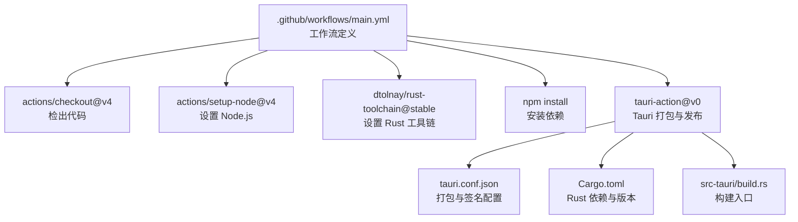
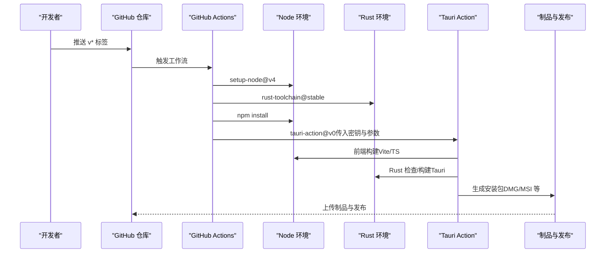
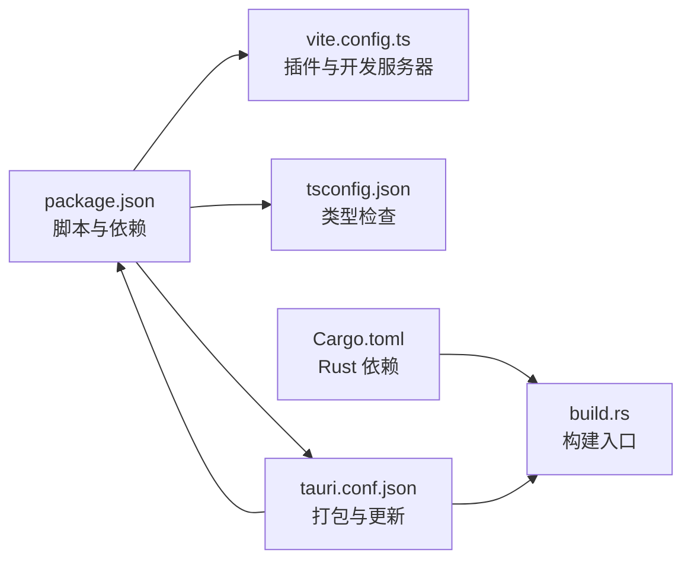

# 持续集成与部署

<cite>
**本文引用的文件**   
- [.github/workflows/main.yml](file://.github/workflows/main.yml)
- [package.json](file://package.json)
- [vite.config.ts](file://vite.config.ts)
- [tsconfig.json](file://tsconfig.json)
- [src-tauri/tauri.conf.json](file://src-tauri/tauri.conf.json)
- [src-tauri/Cargo.toml](file://src-tauri/Cargo.toml)
- [src-tauri/build.rs](file://src-tauri/build.rs)
- [RELEASE_GUIDE.md](file://RELEASE_GUIDE.md)
- [DEVELOPMENT.md](file://DEVELOPMENT.md)
- [README.md](file://README.md)
</cite>

## 目录
1. [简介](#简介)
2. [项目结构](#项目结构)
3. [核心组件](#核心组件)
4. [架构总览](#架构总览)
5. [详细组件分析](#详细组件分析)
6. [依赖分析](#依赖分析)
7. [性能考虑](#性能考虑)
8. [故障排除指南](#故障排除指南)
9. [结论](#结论)
10. [附录](#附录)

## 简介
本文件面向 Medex 项目的持续集成与部署（CI/CD）实践，围绕 GitHub Actions 工作流展开，系统性说明构建触发条件、矩阵构建与条件执行、自动化测试策略、构建验证与质量门禁、多平台构建与签名验证、发布分发与监控报告，以及故障排除与回滚策略。当前仓库已具备基础的 Tauri v2 打包配置与多平台矩阵构建，结合发布指南可形成完整的自动化流水线。

## 项目结构
Medex 采用“前端 React/Vite + 后端 Tauri/Rust”的双栈架构，CI/CD 关键入口与配置如下：
- GitHub Actions 工作流：定义触发条件、作业矩阵与步骤
- 前端构建：Vite + TypeScript，脚本由 package.json 管理
- 桌面打包：Tauri v2 + Rust，配置集中在 tauri.conf.json 与 Cargo.toml
- 发布与打包：结合 RELEASE_GUIDE.md 的外部二进制（ffmpeg）与制品命名规范

图表来源
- [.github/workflows/main.yml:1-42](file://.github/workflows/main.yml#L1-L42)
- [src-tauri/tauri.conf.json:1-46](file://src-tauri/tauri.conf.json#L1-L46)
- [src-tauri/Cargo.toml:1-23](file://src-tauri/Cargo.toml#L1-L23)
- [src-tauri/build.rs:1-4](file://src-tauri/build.rs#L1-L4)

章节来源
- [.github/workflows/main.yml:1-42](file://.github/workflows/main.yml#L1-L42)
- [package.json:1-36](file://package.json#L1-L36)
- [vite.config.ts:1-11](file://vite.config.ts#L1-L11)
- [tsconfig.json:1-19](file://tsconfig.json#L1-L19)
- [src-tauri/tauri.conf.json:1-46](file://src-tauri/tauri.conf.json#L1-L46)
- [src-tauri/Cargo.toml:1-23](file://src-tauri/Cargo.toml#L1-L23)
- [src-tauri/build.rs:1-4](file://src-tauri/build.rs#L1-L4)

## 核心组件
- GitHub Actions 工作流：定义在推送语义化标签时触发，使用矩阵在 macOS 与 Windows 上并行构建，通过 Tauri Action 完成打包与发布。
- 前端构建：Vite + TypeScript，使用 package.json 中的脚本进行安装、构建与预览。
- 桌面打包：Tauri v2 配置集中于 tauri.conf.json，包含资源协议、打包目标、外部二进制与自动更新配置。
- Rust 后端：Cargo.toml 管理依赖与版本，build.rs 作为构建入口。
- 发布指南：提供 ffmpeg 外部二进制准备、externalBin 配置、制品命名与常见错误处理，指导本地与 CI 的打包流程。

章节来源
- [.github/workflows/main.yml:1-42](file://.github/workflows/main.yml#L1-L42)
- [package.json:6-11](file://package.json#L6-L11)
- [src-tauri/tauri.conf.json:29-44](file://src-tauri/tauri.conf.json#L29-L44)
- [src-tauri/Cargo.toml:1-23](file://src-tauri/Cargo.toml#L1-L23)
- [RELEASE_GUIDE.md:109-115](file://RELEASE_GUIDE.md#L109-L115)

## 架构总览
下图展示了从代码提交到多平台安装包产出的端到端流程，涵盖前端构建、Rust 检查、Tauri 打包与发布。

图表来源
- [.github/workflows/main.yml:3-42](file://.github/workflows/main.yml#L3-L42)
- [package.json:6-11](file://package.json#L6-L11)
- [src-tauri/tauri.conf.json:6-11](file://src-tauri/tauri.conf.json#L6-L11)

## 详细组件分析

### GitHub Actions 工作流配置
- 触发条件：仅当推送以 v 开头的标签时触发，确保只对正式版本进行打包与发布。
- 权限：赋予写入内容与包的权限，满足发布资产与签名密钥的使用需求。
- 作业与矩阵：定义 build 作业，使用平台矩阵在 macOS 与 Windows 上并行执行。
- 步骤：
  - 检出代码
  - 设置 Node.js 20
  - 设置 Rust 稳定工具链
  - 安装依赖
  - 使用 Tauri Action 执行打包，传入 GITHUB_TOKEN、私钥与密码，以及版本号、发布名称、是否包含更新器 JSON 等参数。

章节来源
- [.github/workflows/main.yml:1-42](file://.github/workflows/main.yml#L1-L42)

### 前端构建与测试策略
- 构建命令：通过 package.json 中的脚本执行 TypeScript 编译与 Vite 构建，Vite 配置指定插件与开发服务器端口。
- 测试策略：当前仓库未发现前端测试脚本或测试配置文件，建议在后续阶段引入单元测试与端到端测试（如 Vitest、Playwright），并在 CI 中增加测试作业以保障质量门禁。
- 类型检查：tsconfig.json 启用严格模式，有助于在 CI 中尽早发现类型问题。

章节来源
- [package.json:6-11](file://package.json#L6-L11)
- [vite.config.ts:1-11](file://vite.config.ts#L1-L11)
- [tsconfig.json:14-16](file://tsconfig.json#L14-L16)

### Rust 后端与 Tauri 打包
- 依赖与版本：Cargo.toml 管理 Tauri、Serde、rusqlite、walkdir 等依赖，版本与特性明确。
- 构建入口：build.rs 调用 tauri_build::build，作为 Tauri 打包的必要入口。
- 打包配置：tauri.conf.json 指定前端构建产物目录、开发 URL、资源协议、打包目标、外部二进制（ffmpeg）与自动更新端点与公钥。

章节来源
- [src-tauri/Cargo.toml:1-23](file://src-tauri/Cargo.toml#L1-L23)
- [src-tauri/build.rs:1-4](file://src-tauri/build.rs#L1-L4)
- [src-tauri/tauri.conf.json:6-11](file://src-tauri/tauri.conf.json#L6-L11)
- [src-tauri/tauri.conf.json:29-44](file://src-tauri/tauri.conf.json#L29-L44)

### 自动化测试流程（建议）
- 前端测试：引入 Vitest 进行组件与工具函数测试；在 CI 中新增 job 执行测试并生成覆盖率报告。
- 后端测试：在 src-tauri 目录下添加 Rust 单元测试与集成测试，使用 cargo test；在 CI 中新增 job 执行测试。
- 端到端测试：引入 Playwright 或类似工具，覆盖扫描、筛选、打标、Viewer 等关键流程；在 CI 中新增 job 执行 E2E 并上传报告。
- 质量门禁：在 PR 与主干合并前强制执行测试与覆盖率检查，失败则阻止合并。

（本节为概念性建议，不直接分析具体文件）

### 构建验证与质量门禁（建议）
- 代码覆盖率：在前端测试中启用覆盖率统计，设定阈值（如语句、分支、函数、行）；在 CI 中失败即阻断。
- 安全扫描：在 CI 中集成 SAST（如 CodeQL）与依赖漏洞扫描（如 npm audit、cargo audit），对高危风险阻断。
- 性能基准：在 CI 中增加关键场景的性能测试（如大目录扫描、缩略图生成），记录指标并比较基线。

（本节为概念性建议，不直接分析具体文件）

### 多平台构建、签名验证与发布分发
- 多平台矩阵：当前工作流已在 macOS 与 Windows 上并行构建，后续可扩展 Linux。
- 签名验证：通过 Tauri Action 传入签名私钥与密码，tauri.conf.json 中配置自动更新公钥，确保安装包与更新通道的安全性。
- 发布分发：工作流将安装包作为发布资产上传，结合 RELEASE_GUIDE.md 的外部二进制与制品命名规范，形成稳定的发布流程。

章节来源
- [.github/workflows/main.yml:14-42](file://.github/workflows/main.yml#L14-L42)
- [src-tauri/tauri.conf.json:36-44](file://src-tauri/tauri.conf.json#L36-L44)
- [RELEASE_GUIDE.md:198-206](file://RELEASE_GUIDE.md#L198-L206)

### 监控与报告机制（建议）
- 构建状态通知：在工作流中集成通知（如 Slack、邮件），在成功/失败时发送消息。
- 测试报告：上传测试报告与覆盖率报告（如 JUnit XML、Coverage HTML），便于追溯与审计。
- 性能指标：记录构建耗时、安装包大小、关键 UI 场景 FPS/内存占用等，形成趋势图。

（本节为概念性建议，不直接分析具体文件）

### 故障排除与回滚策略（建议）
- 构建失败处理：在 CI 中区分“可恢复错误”与“不可恢复错误”，对前者尝试重试，对后者立即通知并冻结发布。
- 紧急修复流程：针对外部二进制缺失、ffmpeg 解析失败等问题，提供快速回退至上一稳定版本的发布通道。
- 回滚策略：利用自动更新机制回滚到上一个稳定版本，同时在发布说明中明确问题与修复版本。

（本节为概念性建议，不直接分析具体文件）

## 依赖分析
- 前端依赖：React、Vite、TailwindCSS、TypeScript 等，由 package.json 管理；Vite 配置与 tsconfig 为构建与类型检查提供基础。
- 后端依赖：Tauri、Serde、rusqlite、walkdir 等，由 Cargo.toml 管理；build.rs 作为构建入口。
- 打包与发布：tauri.conf.json 配置前端产物目录、资源协议、打包目标、外部二进制与自动更新；RELEASE_GUIDE.md 提供外部二进制准备与制品命名规范。

图表来源
- [package.json:1-36](file://package.json#L1-L36)
- [vite.config.ts:1-11](file://vite.config.ts#L1-L11)
- [tsconfig.json:1-19](file://tsconfig.json#L1-L19)
- [src-tauri/tauri.conf.json:1-46](file://src-tauri/tauri.conf.json#L1-L46)
- [src-tauri/Cargo.toml:1-23](file://src-tauri/Cargo.toml#L1-L23)
- [src-tauri/build.rs:1-4](file://src-tauri/build.rs#L1-L4)

章节来源
- [package.json:1-36](file://package.json#L1-L36)
- [vite.config.ts:1-11](file://vite.config.ts#L1-L11)
- [tsconfig.json:1-19](file://tsconfig.json#L1-L19)
- [src-tauri/tauri.conf.json:1-46](file://src-tauri/tauri.conf.json#L1-L46)
- [src-tauri/Cargo.toml:1-23](file://src-tauri/Cargo.toml#L1-L23)
- [src-tauri/build.rs:1-4](file://src-tauri/build.rs#L1-L4)

## 性能考虑
- 并行矩阵：在 macOS 与 Windows 上并行构建，缩短整体流水线时间。
- 外部二进制：通过 tauri.conf.json 的 externalBin 与 RELEASE_GUIDE.md 的二进制准备，确保 ffmpeg 随安装包分发，减少运行时查找与权限问题。
- 构建缓存：建议在 CI 中缓存 Node 与 Rust 依赖，进一步提升速度。

（本节为通用建议，不直接分析具体文件）

## 故障排除指南
- 外部二进制缺失：若启用 externalBin 但缺少对应目标文件，构建会失败。应补齐 src-tauri/binaries/ffmpeg-<target> 并确保可执行权限。
- ffmpeg 运行时未找到：确认发布包包含二进制、运行时解析顺序命中（resources/dev/PATH），并检查二进制权限。
- 资源路径问题：确认 tauri.conf.json 中 assetProtocol 启用与作用域配置正确，避免本地文件预览失败。
- 自动更新失败：核对 tauri.conf.json 中更新端点与公钥配置，确保签名与验证一致。

章节来源
- [RELEASE_GUIDE.md:111-115](file://RELEASE_GUIDE.md#L111-L115)
- [RELEASE_GUIDE.md:216-224](file://RELEASE_GUIDE.md#L216-L224)
- [src-tauri/tauri.conf.json:23-27](file://src-tauri/tauri.conf.json#L23-L27)
- [src-tauri/tauri.conf.json:36-44](file://src-tauri/tauri.conf.json#L36-L44)

## 结论
当前 Medex 已具备基于 GitHub Actions 的基础 CI/CD 能力，能够对语义化标签触发多平台打包与发布。结合 RELEASE_GUIDE.md 的外部二进制与制品规范，可形成稳定的发布流程。建议在后续阶段补充前端与后端测试、覆盖率与安全扫描、性能基准与监控报告，以完善质量门禁与可观测性；同时制定明确的故障排除与回滚策略，确保发布过程可控、可追踪、可恢复。

## 附录
- 发布操作模板与检查清单可参考 RELEASE_GUIDE.md，其中包含分支策略、制品命名、常见错误与处理建议。
- 开发与运行说明可参考 DEVELOPMENT.md 与 README.md，帮助理解项目结构与打包流程。

章节来源
- [RELEASE_GUIDE.md:182-206](file://RELEASE_GUIDE.md#L182-L206)
- [RELEASE_GUIDE.md:118-140](file://RELEASE_GUIDE.md#L118-L140)
- [README.md:50-94](file://README.md#L50-L94)
- [DEVELOPMENT.md:440-467](file://DEVELOPMENT.md#L440-L467)