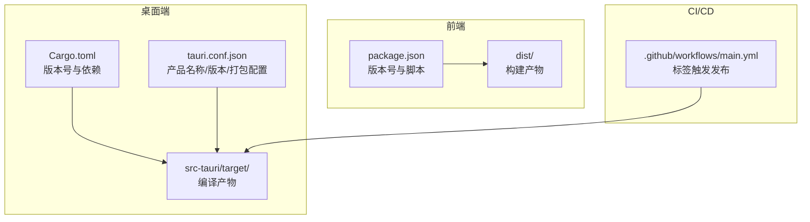
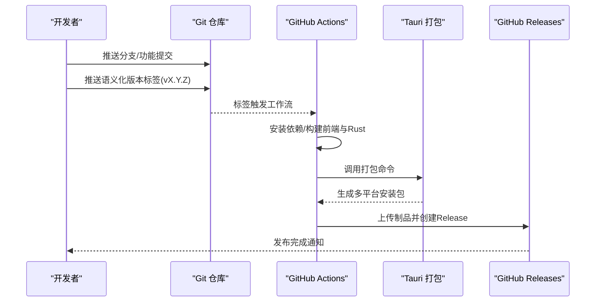
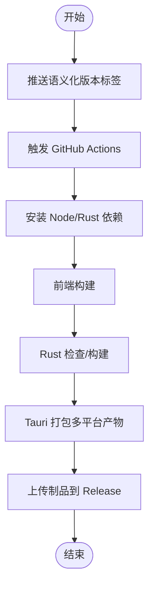
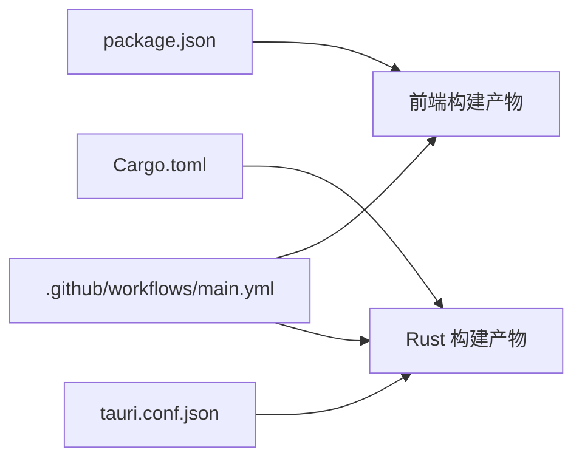

# 版本控制最佳实践

<cite>
**本文档引用的文件**
- [README.md](file://README.md)
- [RELEASE_GUIDE.md](file://RELEASE_GUIDE.md)
- [DEVELOPMENT.md](file://DEVELOPMENT.md)
- [.github/workflows/main.yml](file://.github/workflows/main.yml)
- [package.json](file://package.json)
- [src-tauri/Cargo.toml](file://src-tauri/Cargo.toml)
- [src-tauri/tauri.conf.json](file://src-tauri/tauri.conf.json)
- [.gitignore](file://.gitignore)
</cite>

## 目录
1. [简介](#简介)
2. [项目结构](#项目结构)
3. [核心组件](#核心组件)
4. [架构总览](#架构总览)
5. [详细组件分析](#详细组件分析)
6. [依赖分析](#依赖分析)
7. [性能考虑](#性能考虑)
8. [故障排除指南](#故障排除指南)
9. [结论](#结论)
10. [附录](#附录)

## 简介
本指南面向 Medex 项目的版本控制最佳实践，结合现有仓库中的发布流程、工作流配置与开发文档，系统化地定义分支策略、提交消息规范、标签与版本发布流程、冲突解决与合并策略，以及 Git 工具的高级用法建议。目标是帮助团队在保持高质量交付的同时，提升协作效率与发布稳定性。

## 项目结构
Medex 采用前端（React + TypeScript + Vite）与桌面端（Tauri + Rust）混合架构，版本控制实践围绕以下要点展开：
- 前端与桌面端分别维护独立的版本号与构建流程
- GitHub Actions 自动触发基于标签的发布流程
- 发布前检查清单与多平台打包配置明确

图表来源
- [package.json:1-36](file://package.json#L1-L36)
- [src-tauri/Cargo.toml:1-23](file://src-tauri/Cargo.toml#L1-L23)
- [src-tauri/tauri.conf.json:1-46](file://src-tauri/tauri.conf.json#L1-L46)
- [.github/workflows/main.yml:1-42](file://.github/workflows/main.yml#L1-L42)

章节来源
- [README.md:1-209](file://README.md#L1-L209)
- [RELEASE_GUIDE.md:1-283](file://RELEASE_GUIDE.md#L1-L283)
- [DEVELOPMENT.md:1-643](file://DEVELOPMENT.md#L1-L643)

## 核心组件
- 分支与标签策略：基于现有工作流与发布指南，建议采用主分支保护、功能分支与发布分支的组合策略，并以语义化版本标签驱动自动化发布。
- 提交消息规范：建议采用类型化前缀 + 主题 + 破坏性变更标注的格式，便于自动生成变更日志与版本标记。
- 发布流程：结合 GitHub Actions 与 Tauri 打包配置，形成“标签 → 自动构建 → 产物上传”的闭环。
- 冲突解决与合并：建议以 rebase 优先、squash 合并为主，配合严格的 PR 审查与测试，确保主分支稳定。

章节来源
- [RELEASE_GUIDE.md:182-207](file://RELEASE_GUIDE.md#L182-L207)
- [.github/workflows/main.yml:1-42](file://.github/workflows/main.yml#L1-L42)

## 架构总览
下图展示了从代码提交到自动发布的整体流程，涵盖分支策略、标签触发、CI 构建与产物发布：

图表来源
- [.github/workflows/main.yml:1-42](file://.github/workflows/main.yml#L1-L42)
- [RELEASE_GUIDE.md:143-166](file://RELEASE_GUIDE.md#L143-L166)
- [src-tauri/tauri.conf.json:29-44](file://src-tauri/tauri.conf.json#L29-L44)

## 详细组件分析

### 分支策略与命名规范
- 主分支（main）：用于稳定发布线，建议开启保护规则（禁止直接推送、强制 PR 合并、要求审查通过）。
- 功能分支（feature/*）：用于新功能开发，命名建议为 feature/模块-简述，如 feature/media-grid-enhancement。
- 发布分支（release/*）：用于发布候选与回归测试，命名建议为 release/vX.Y.Z，发布后合并回 main 并打标签。
- 其他分支（hotfix/*、chore/*）：用于紧急修复与杂务，命名建议 hotfix/问题简述、chore/docs-update。

章节来源
- [RELEASE_GUIDE.md:184-188](file://RELEASE_GUIDE.md#L184-L188)

### 提交消息规范与格式
建议采用以下格式，便于自动化工具解析与生成变更日志：
- 类型：feat、fix、docs、style、refactor、perf、test、build、ci、chore、revert
- 破坏性变更：在类型后添加 !，如 feat!(auth)：表示破坏性变更
- 主题：简明描述变更内容，避免冗长
- 参考：可选，如 closes #123

示例格式参考（不展示具体提交内容）：
- feat(auth): 新增登录状态持久化
- fix(thumbnail): 修复缩略图生成超时问题
- docs(readme): 更新安装与运行说明
- refactor!: 移除废弃的命令接口
- chore(deps): 升级 React 到最新版本

章节来源
- [README.md:171-179](file://README.md#L171-L179)

### 标签管理与版本发布流程
- 标签命名：采用语义化版本（SemVer），如 v0.1.0、v0.1.1、v1.0.0
- 自动化发布：当推送标签时，GitHub Actions 自动触发构建与发布
- 发布产物：多平台安装包（macOS DMG、Windows MSI 等），并生成更新 JSON
- 发布说明：可由工作流模板生成，也可在 GitHub Releases 中完善

图表来源
- [.github/workflows/main.yml:1-42](file://.github/workflows/main.yml#L1-L42)
- [RELEASE_GUIDE.md:143-166](file://RELEASE_GUIDE.md#L143-L166)

章节来源
- [.github/workflows/main.yml:1-42](file://.github/workflows/main.yml#L1-L42)
- [RELEASE_GUIDE.md:18-28](file://RELEASE_GUIDE.md#L18-L28)
- [RELEASE_GUIDE.md:252-272](file://RELEASE_GUIDE.md#L252-L272)

### 冲突解决与合并策略
- rebase 优先：在功能分支上定期 rebase 主分支，保持线性历史
- squash 合并：PR 合并时使用 squash，将多个提交压缩为单一语义化提交
- 冲突处理：冲突应尽量在功能分支阶段解决；必要时通过临时合并分支进行隔离解决
- 审查与测试：每次合并前确保通过 CI 与本地回归测试

章节来源
- [RELEASE_GUIDE.md:184-188](file://RELEASE_GUIDE.md#L184-L188)

### Git 工具使用技巧
- 交互式变基（rebase -i）：整理提交历史、修改提交信息、合并相邻提交
- 暂存与撤销：使用 stash 临时保存工作进度；谨慎使用 reset --hard，建议先备份
- 分支追踪：设置上游分支，简化推送与拉取
- 标签操作：创建轻量标签与附注标签；推送标签至远程；删除误打标签

章节来源
- [README.md:171-179](file://README.md#L171-L179)

## 依赖分析
- 前端版本与脚本：package.json 中定义了版本号与构建脚本，用于前端产物生成与预览
- 桌面端版本与打包：Cargo.toml 定义 Rust 项目版本；tauri.conf.json 控制产品名称、版本与打包配置
- CI 触发：GitHub Actions 通过标签触发，自动安装 Node 与 Rust 工具链并执行打包

图表来源
- [package.json:1-36](file://package.json#L1-L36)
- [src-tauri/Cargo.toml:1-23](file://src-tauri/Cargo.toml#L1-L23)
- [src-tauri/tauri.conf.json:1-46](file://src-tauri/tauri.conf.json#L1-L46)
- [.github/workflows/main.yml:1-42](file://.github/workflows/main.yml#L1-L42)

章节来源
- [package.json:1-36](file://package.json#L1-L36)
- [src-tauri/Cargo.toml:1-23](file://src-tauri/Cargo.toml#L1-L23)
- [src-tauri/tauri.conf.json:1-46](file://src-tauri/tauri.conf.json#L1-L46)
- [.github/workflows/main.yml:1-42](file://.github/workflows/main.yml#L1-L42)

## 性能考虑
- 历史线性化：通过 rebase 保持线性历史，减少合并节点带来的复杂度
- 提交粒度：将小而完整的变更作为提交，便于审查与回滚
- CI 并行：利用矩阵并行构建多平台产物，缩短发布周期
- 产物缓存：合理使用 CI 缓存与依赖缓存，减少重复安装时间

## 故障排除指南
- 标签未触发发布：检查标签是否符合 v* 格式，确认 GitHub Actions 工作流权限与密钥配置
- 多平台打包失败：检查 tauri.conf.json 中 externalBin 配置与 ffmpeg 二进制是否存在
- 依赖安装失败：确认 Node 与 Rust 版本满足要求，清理缓存后重试
- 本地构建缓存问题：清理 dist 与 target 目录后重新构建

章节来源
- [.github/workflows/main.yml:1-42](file://.github/workflows/main.yml#L1-L42)
- [RELEASE_GUIDE.md:109-115](file://RELEASE_GUIDE.md#L109-L115)
- [RELEASE_GUIDE.md:209-224](file://RELEASE_GUIDE.md#L209-L224)

## 结论
通过明确的分支与标签策略、规范化的提交消息、自动化的发布流程与严格的冲突解决机制，Medex 项目可以在保证质量的前提下高效迭代与稳定发布。建议团队在日常开发中严格执行上述实践，并根据项目演进持续优化流程与工具链。

## 附录
- 前端版本与脚本：参见 package.json
- 桌面端版本与打包：参见 Cargo.toml 与 tauri.conf.json
- 自动发布工作流：参见 .github/workflows/main.yml
- 发布检查清单与操作模板：参见 RELEASE_GUIDE.md
- 开发与架构说明：参见 DEVELOPMENT.md