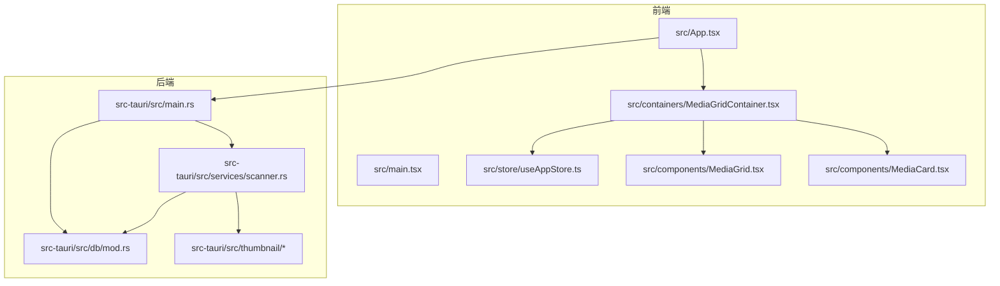
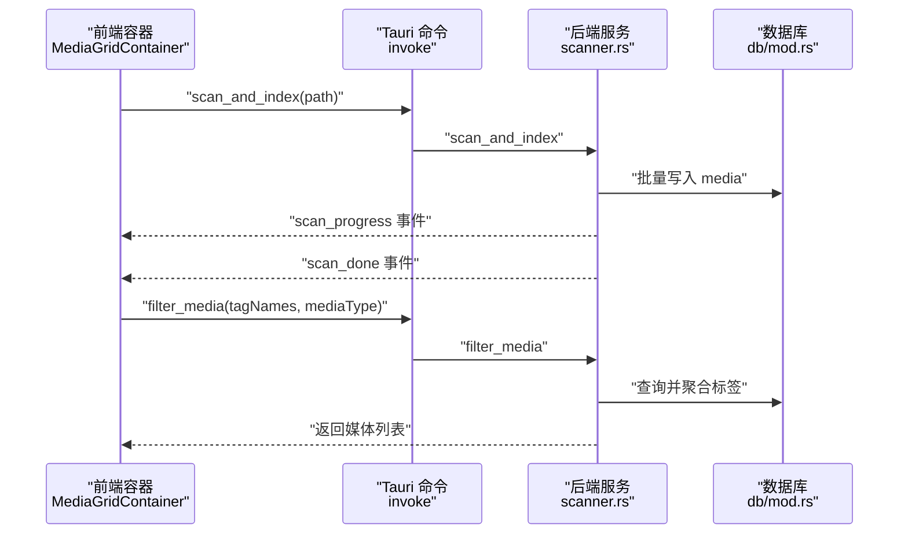
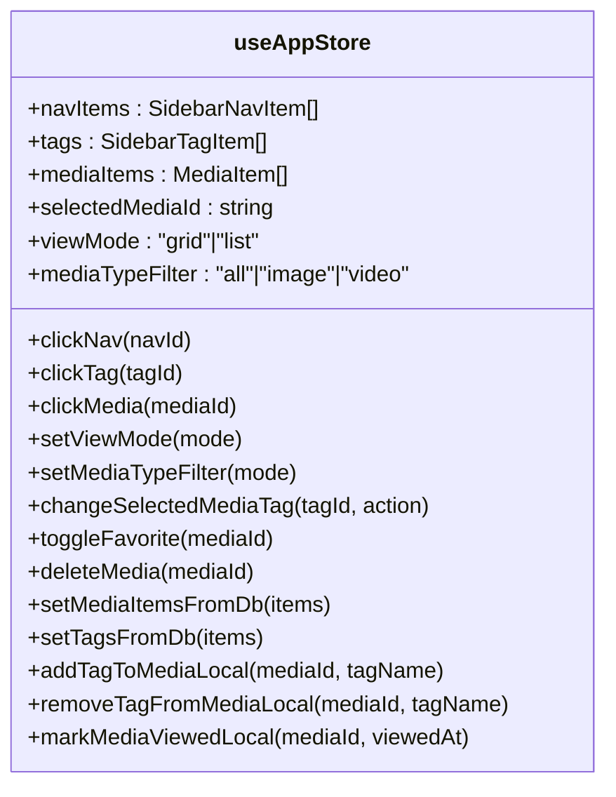
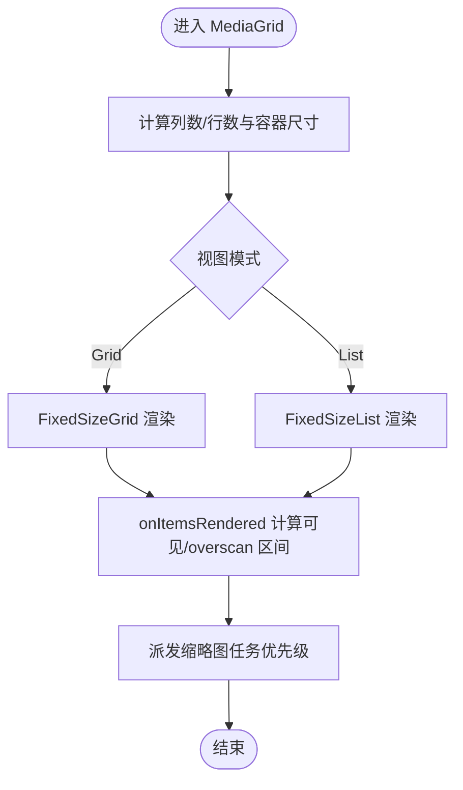
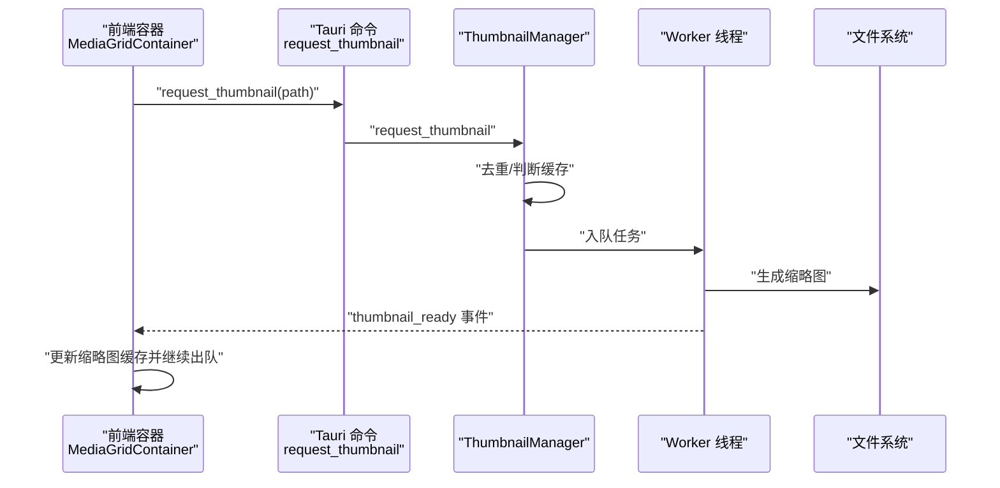
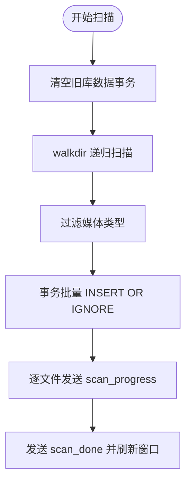
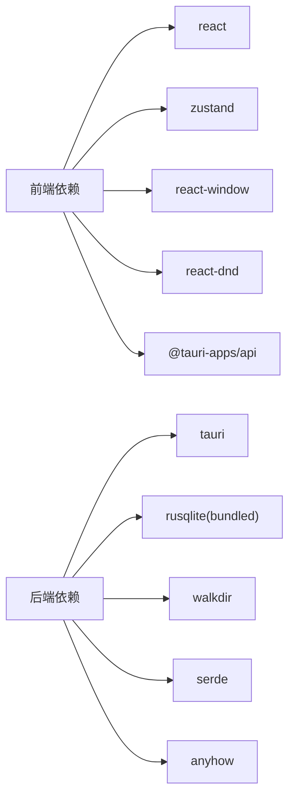
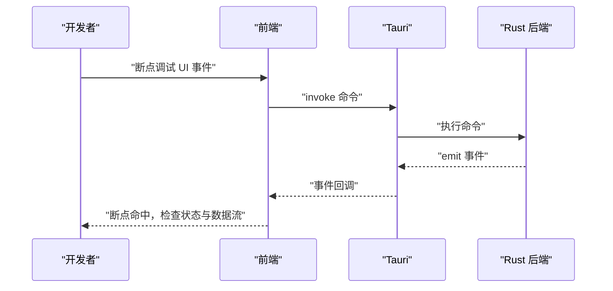

# 开发指南

<cite>
**本文引用的文件**
- [README.md](file://README.md)
- [DEVELOPMENT.md](file://DEVELOPMENT.md)
- [package.json](file://package.json)
- [vite.config.ts](file://vite.config.ts)
- [tsconfig.json](file://tsconfig.json)
- [src-tauri/Cargo.toml](file://src-tauri/Cargo.toml)
- [src-tauri/src/main.rs](file://src-tauri/src/main.rs)
- [src-tauri/src/db/mod.rs](file://src-tauri/src/db/mod.rs)
- [src-tauri/src/services/scanner.rs](file://src-tauri/src/services/scanner.rs)
- [src-tauri/src/thumbnail/manager.rs](file://src-tauri/src/thumbnail/manager.rs)
- [src-tauri/src/thumbnail/queue.rs](file://src-tauri/src/thumbnail/queue.rs)
- [src-tauri/src/thumbnail/worker.rs](file://src-tauri/src/thumbnail/worker.rs)
- [src/main.tsx](file://src/main.tsx)
- [src/App.tsx](file://src/App.tsx)
- [src/store/useAppStore.ts](file://src/store/useAppStore.ts)
- [src/components/MediaGrid.tsx](file://src/components/MediaGrid.tsx)
- [src/components/MediaCard.tsx](file://src/components/MediaCard.tsx)
- [src/containers/MediaGridContainer.tsx](file://src/containers/MediaGridContainer.tsx)
</cite>

## 目录
1. [简介](#简介)
2. [项目结构](#项目结构)
3. [核心组件](#核心组件)
4. [架构总览](#架构总览)
5. [详细组件分析](#详细组件分析)
6. [依赖分析](#依赖分析)
7. [性能考虑](#性能考虑)
8. [调试与排障](#调试与排障)
9. [结论](#结论)
10. [附录](#附录)

## 简介
本指南面向从入门到高级的开发者，系统性阐述 Medex 项目的开发规范、调试技巧、测试策略、性能优化、构建配置与工作流程最佳实践。Medex 是一个基于 React + TypeScript + Tauri V2 + Rust + SQLite 的桌面媒体管理应用，具备高性能媒体网格浏览、标签体系、缩略图生成与本地持久化能力。

## 项目结构
- 前端（React + TypeScript + Vite + TailwindCSS）
  - 入口与路由：src/main.tsx、src/App.tsx
  - 组件与容器：src/components、src/containers
  - 状态管理：src/store/useAppStore.ts
  - 主题与样式：src/theme、src/index.css
- 后端（Tauri + Rust + SQLite）
  - 入口与命令注册：src-tauri/src/main.rs
  - 数据库：src-tauri/src/db/mod.rs
  - 业务服务：src-tauri/src/services/scanner.rs、tags.rs
  - 缩略图系统：src-tauri/src/thumbnail/*
- 构建与配置
  - 前端：vite.config.ts、tsconfig.json、package.json
  - 后端：src-tauri/Cargo.toml

图表来源
- [src/main.tsx:1-44](file://src/main.tsx#L1-L44)
- [src/App.tsx:1-73](file://src/App.tsx#L1-L73)
- [src/store/useAppStore.ts:1-395](file://src/store/useAppStore.ts#L1-L395)
- [src/components/MediaGrid.tsx:1-351](file://src/components/MediaGrid.tsx#L1-L351)
- [src/components/MediaCard.tsx:1-318](file://src/components/MediaCard.tsx#L1-L318)
- [src/containers/MediaGridContainer.tsx:1-620](file://src/containers/MediaGridContainer.tsx#L1-L620)
- [src-tauri/src/main.rs:1-98](file://src-tauri/src/main.rs#L1-L98)
- [src-tauri/src/db/mod.rs:1-123](file://src-tauri/src/db/mod.rs#L1-L123)
- [src-tauri/src/services/scanner.rs:1-597](file://src-tauri/src/services/scanner.rs#L1-L597)
- [src-tauri/src/thumbnail/manager.rs:1-108](file://src-tauri/src/thumbnail/manager.rs#L1-L108)
- [src-tauri/src/thumbnail/queue.rs:1-12](file://src-tauri/src/thumbnail/queue.rs#L1-L12)
- [src-tauri/src/thumbnail/worker.rs:1-96](file://src-tauri/src/thumbnail/worker.rs#L1-L96)

章节来源
- [README.md:97-119](file://README.md#L97-L119)
- [DEVELOPMENT.md:51-116](file://DEVELOPMENT.md#L51-L116)

## 核心组件
- 前端状态与模型
  - useAppStore：全局业务状态（导航、标签、媒体列表、筛选、收藏、最近查看等）
  - MediaItem/DbMediaItem/SidebarTagItem 等类型定义
- 前端组件
  - MediaGrid：虚拟化网格/列表渲染，支持 overscan 与可见范围回调
  - MediaCard：媒体卡片，支持收藏、标签、右键菜单、双击打开 Viewer
  - MediaGridContainer：缩略图调度、批量操作、标签筛选、对话框选择库目录
- 后端命令与服务
  - scanner.rs：扫描目录、批量插入、标签筛选、收藏与最近查看
  - db/mod.rs：SQLite 初始化、表结构、索引、连接池封装
  - thumbnail/*：缩略图任务队列、工作线程、去重与缓存

章节来源
- [src/store/useAppStore.ts:1-395](file://src/store/useAppStore.ts#L1-L395)
- [src/components/MediaGrid.tsx:1-351](file://src/components/MediaGrid.tsx#L1-L351)
- [src/components/MediaCard.tsx:1-318](file://src/components/MediaCard.tsx#L1-L318)
- [src/containers/MediaGridContainer.tsx:1-620](file://src/containers/MediaGridContainer.tsx#L1-L620)
- [src-tauri/src/services/scanner.rs:1-597](file://src-tauri/src/services/scanner.rs#L1-L597)
- [src-tauri/src/db/mod.rs:1-123](file://src-tauri/src/db/mod.rs#L1-L123)
- [src-tauri/src/thumbnail/manager.rs:1-108](file://src-tauri/src/thumbnail/manager.rs#L1-L108)

## 架构总览
- 前后端通信
  - 前端通过 @tauri-apps/api 的 invoke 调用后端命令，通过事件监听后端推送（扫描进度、缩略图完成）
- 状态分层
  - 全局状态：Zustand store
  - 容器状态：组件局部状态与调度队列
- 数据持久化
  - SQLite：media、tags、media_tags、recent_views 表及索引
- 缩略图系统
  - Rust 后端固定并发 worker + 有界队列，前端去重与优先级调度

图表来源
- [src-tauri/src/main.rs:78-94](file://src-tauri/src/main.rs#L78-L94)
- [src-tauri/src/services/scanner.rs:321-413](file://src-tauri/src/services/scanner.rs#L321-L413)
- [src-tauri/src/db/mod.rs:12-43](file://src-tauri/src/db/mod.rs#L12-L43)
- [src/containers/MediaGridContainer.tsx:311-332](file://src/containers/MediaGridContainer.tsx#L311-L332)

## 详细组件分析

### 前端状态与模型（Zustand）
- 设计要点
  - 将本地 UI 状态与后端数据同步，提供 setMediaItemsFromDb、setTagsFromDb 等合并策略
  - 本地标签增删与后端保持一致，避免自动删除标签导致的数据不一致
- 性能与复杂度
  - 状态更新使用不可变更新，配合 React.memo 与 useMemo 降低重渲染
  - 复杂度 O(n) 的标签计数与媒体合并逻辑，适合中等规模数据

图表来源
- [src/store/useAppStore.ts:48-394](file://src/store/useAppStore.ts#L48-L394)

章节来源
- [src/store/useAppStore.ts:1-395](file://src/store/useAppStore.ts#L1-L395)

### 媒体网格与虚拟化（react-window）
- 设计要点
  - 固定尺寸网格/列表，overscan 控制可见区域外渲染数量
  - onItemsRendered 回调计算可见与 overscan 区间，驱动缩略图优先级
- 性能与复杂度
  - 时间复杂度 O(k) 渲染可见元素，空间复杂度 O(k)，k 为可见元素数
  - 通过列数/行数计算与 style 偏移，保证布局稳定

图表来源
- [src/components/MediaGrid.tsx:70-212](file://src/components/MediaGrid.tsx#L70-L212)
- [src/containers/MediaGridContainer.tsx:418-452](file://src/containers/MediaGridContainer.tsx#L418-L452)

章节来源
- [src/components/MediaGrid.tsx:1-351](file://src/components/MediaGrid.tsx#L1-L351)
- [src/containers/MediaGridContainer.tsx:1-620](file://src/containers/MediaGridContainer.tsx#L1-L620)

### 缩略图系统（Rust 后端）
- 设计要点
  - 固定 worker 数量 + 有界队列，去重 processing 集合
  - 任务结构包含输入视频路径与输出缓存路径，生成成功后通过事件通知前端
- 性能与复杂度
  - 并发固定，队列容量可控，避免资源耗尽
  - 任务入队按优先级插入，提升用户体验

图表来源
- [src-tauri/src/thumbnail/manager.rs:51-106](file://src-tauri/src/thumbnail/manager.rs#L51-L106)
- [src-tauri/src/thumbnail/worker.rs:52-79](file://src-tauri/src/thumbnail/worker.rs#L52-L79)
- [src-tauri/src/thumbnail/queue.rs:8-11](file://src-tauri/src/thumbnail/queue.rs#L8-L11)
- [src/containers/MediaGridContainer.tsx:366-387](file://src/containers/MediaGridContainer.tsx#L366-L387)

章节来源
- [src-tauri/src/thumbnail/manager.rs:1-108](file://src-tauri/src/thumbnail/manager.rs#L1-L108)
- [src-tauri/src/thumbnail/worker.rs:1-96](file://src-tauri/src/thumbnail/worker.rs#L1-L96)
- [src-tauri/src/thumbnail/queue.rs:1-12](file://src-tauri/src/thumbnail/queue.rs#L1-L12)

### 扫描与筛选（后端服务）
- 设计要点
  - 使用 walkdir 递归扫描，INSERT OR IGNORE 防重复，事务批量写入
  - 标签筛选通过子查询与 HAVING COUNT 实现“同时拥有所有选中标签”的交集
- 性能与复杂度
  - 批量写入事务显著降低 IO，索引覆盖 path、media_tags 主键与 recent_views 降序索引
  - SQL 查询在标签较多时注意索引与分组聚合成本

图表来源
- [src-tauri/src/services/scanner.rs:249-319](file://src-tauri/src/services/scanner.rs#L249-L319)
- [src-tauri/src/services/scanner.rs:321-413](file://src-tauri/src/services/scanner.rs#L321-L413)

章节来源
- [src-tauri/src/services/scanner.rs:1-597](file://src-tauri/src/services/scanner.rs#L1-L597)
- [src-tauri/src/db/mod.rs:12-43](file://src-tauri/src/db/mod.rs#L12-L43)

### 媒体卡片与交互
- 设计要点
  - 收藏按钮、标签删除、右键菜单、双击打开 Viewer
  - 视频缩略图懒加载与骨架屏，图片缩略图失败回退
- 性能与复杂度
  - memo + props 深比较，减少重渲染
  - 右键菜单与批量标签操作通过 invoke 与本地状态同步

章节来源
- [src/components/MediaCard.tsx:1-318](file://src/components/MediaCard.tsx#L1-L318)
- [src/containers/MediaGridContainer.tsx:146-176](file://src/containers/MediaGridContainer.tsx#L146-L176)

## 依赖分析
- 前端依赖
  - React、Zustand、react-window、react-dnd、@tauri-apps/*、TailwindCSS
- 后端依赖
  - tauri、rusqlite(bundled)、walkdir、once_cell、anyhow、serde
- 构建与工具
  - Vite、TypeScript、PostCSS、autoprefixer、tailwindcss

图表来源
- [package.json:12-35](file://package.json#L12-L35)
- [src-tauri/Cargo.toml:13-24](file://src-tauri/Cargo.toml#L13-L24)

章节来源
- [package.json:1-37](file://package.json#L1-37)
- [src-tauri/Cargo.toml:1-24](file://src-tauri/Cargo.toml#L1-L24)

## 性能考虑
- 前端性能
  - 虚拟化渲染：react-window 固定尺寸网格/列表，overscan 控制可见区域外渲染数量
  - 缩略图优先级：可见区域优先，下一屏次之，其余再次之，最大并发与队列上限控制资源占用
  - 图片懒加载与骨架屏：减少首屏与滚动卡顿
- 后端性能
  - 事务批量写入：INSERT OR IGNORE + 事务提交，显著降低 IO
  - 索引优化：media(path)、media_tags(media_id/tag_id)、recent_views(viewed_at DESC)
  - 固定并发 worker + 有界队列：避免资源耗尽，提升吞吐
- 内存管理
  - 前端：useMemo/useCallback 缓存计算结果，避免频繁重建
  - 后端：OnceCell 全局连接、processing 去重集合，避免重复任务

章节来源
- [src/components/MediaGrid.tsx:173-211](file://src/components/MediaGrid.tsx#L173-L211)
- [src/containers/MediaGridContainer.tsx:28-333](file://src/containers/MediaGridContainer.tsx#L28-L333)
- [src-tauri/src/services/scanner.rs:90-115](file://src-tauri/src/services/scanner.rs#L90-L115)
- [src-tauri/src/db/mod.rs:39-42](file://src-tauri/src/db/mod.rs#L39-L42)
- [src-tauri/src/thumbnail/manager.rs:32-49](file://src-tauri/src/thumbnail/manager.rs#L32-L49)

## 调试与排障
- 前端调试
  - 使用浏览器 DevTools 检查网络与事件监听，确认 invoke 返回与事件是否触发
  - 通过 window.dispatchEvent 触发本地刷新，定位状态不同步问题
- 后端调试
  - 在 main.rs 中打印初始化与菜单事件，检查数据库初始化与缩略图初始化
  - 在 scanner.rs 中观察扫描进度事件与事务提交日志
- 跨语言调试
  - 通过 Tauri 事件桥接：前端监听 thumbnail_ready、scan_progress、scan_done
  - 使用 convertFileSrc 将本地文件路径转换为可预览 URL
- 常见问题
  - dialog.open 权限：检查 capabilities/default.json 是否包含 dialog:allow-open
  - ffmpeg 未找到：确认内置二进制或 PATH，必要时配置 externalBin
  - 页面卡顿：检查是否在网格内挂载过多 <video>，是否启用虚拟化与合理并发

图表来源
- [src-tauri/src/main.rs:16-77](file://src-tauri/src/main.rs#L16-L77)
- [src-tauri/src/services/scanner.rs:378-401](file://src-tauri/src/services/scanner.rs#L378-L401)
- [src/containers/MediaGridContainer.tsx:454-487](file://src/containers/MediaGridContainer.tsx#L454-L487)

章节来源
- [DEVELOPMENT.md:564-595](file://DEVELOPMENT.md#L564-L595)
- [src-tauri/src/main.rs:1-98](file://src-tauri/src/main.rs#L1-L98)
- [src-tauri/src/services/scanner.rs:1-597](file://src-tauri/src/services/scanner.rs#L1-L597)

## 结论
Medex 通过 React + Tauri + Rust 的组合，在桌面端实现了高性能的媒体浏览与管理能力。前端采用虚拟化渲染与精细化缩略图调度，后端通过事务批量写入与固定并发 worker 提升吞吐，数据库层面通过索引与结构设计保障查询效率。建议在后续迭代中完善测试框架、统一错误提示、迁移全局事件到显式 store，并补齐媒体删除与批量操作等核心功能。

## 附录

### 代码规范与最佳实践
- TypeScript 编码规范
  - 严格模式开启，明确类型定义，避免 any
  - 使用 useMemo/useCallback 缓存计算与回调，减少重渲染
  - 组件 props 使用 memo + 自定义相等比较，避免不必要的重渲染
- React 组件规范
  - 函数式组件优先，hooks 拆分关注点
  - 容器组件负责状态与调度，展示组件专注渲染
  - 事件与副作用集中在容器组件，避免在纯展示组件中产生副作用
- Rust 编码规范
  - 使用 anyhow 进行错误处理，with_context 提供上下文信息
  - OnceCell 管理全局连接，Mutex 保护共享状态
  - 任务队列使用 sync_channel，固定 worker 数量，避免资源耗尽

章节来源
- [tsconfig.json:14-16](file://tsconfig.json#L14-L16)
- [src/components/MediaGrid.tsx:214-240](file://src/components/MediaGrid.tsx#L214-L240)
- [src/components/MediaCard.tsx:277-317](file://src/components/MediaCard.tsx#L277-L317)
- [src-tauri/src/db/mod.rs:8-122](file://src-tauri/src/db/mod.rs#L8-L122)
- [src-tauri/src/thumbnail/manager.rs:32-49](file://src-tauri/src/thumbnail/manager.rs#L32-L49)

### 测试策略与框架配置
- 前端测试建议
  - 单元测试：针对 useAppStore 的 action 与 MediaGrid 的渲染逻辑
  - 集成测试：容器组件与 invoke 的交互，事件监听与状态同步
- 后端测试建议
  - 单元测试：scanner.rs 的 SQL 查询与事务逻辑
  - 集成测试：缩略图队列与 worker 的任务流转
- 框架配置
  - 前端：Vitest/Jest（建议）+ React Testing Library
  - 后端：cargo test + mock 外部依赖（如 ffmpeg）

章节来源
- [src/store/useAppStore.ts:145-394](file://src/store/useAppStore.ts#L145-L394)
- [src-tauri/src/services/scanner.rs:160-247](file://src-tauri/src/services/scanner.rs#L160-L247)
- [src-tauri/src/thumbnail/worker.rs:13-50](file://src-tauri/src/thumbnail/worker.rs#L13-L50)

### 构建配置与优化策略
- 前端
  - Vite：开发服务器端口 1420，React 插件
  - TypeScript：严格模式、模块解析 bundler、JSX 使用 react-jsx
- 后端
  - Cargo：bundled SQLite，启用 protocol-asset
  - Tauri：插件 dialog、store、updater
- 优化
  - 生产构建：tsc + vite build
  - 资源协议：启用 asset protocol，支持 convertFileSrc 预览本地文件

章节来源
- [vite.config.ts:1-11](file://vite.config.ts#L1-L11)
- [tsconfig.json:1-19](file://tsconfig.json#L1-L19)
- [src-tauri/Cargo.toml:13-24](file://src-tauri/Cargo.toml#L13-L24)
- [src-tauri/src/main.rs:13-15](file://src-tauri/src/main.rs#L13-L15)

### 开发工作流程最佳实践
- 代码审查
  - 统一代码风格与命名约定，严格类型检查
  - 关注性能影响，特别是缩略图与虚拟化渲染
- 版本控制
  - Feature 分支开发，主分支保护，PR 审查与 CI 通过
- 持续集成
  - 前端：npm run build + tauri build
  - 后端：cargo check + cargo test
  - 构建产物校验与 smoke test

章节来源
- [README.md:171-180](file://README.md#L171-L180)
- [DEVELOPMENT.md:440-467](file://DEVELOPMENT.md#L440-L467)