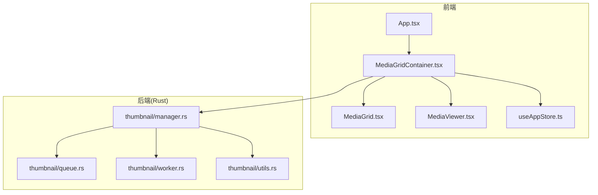
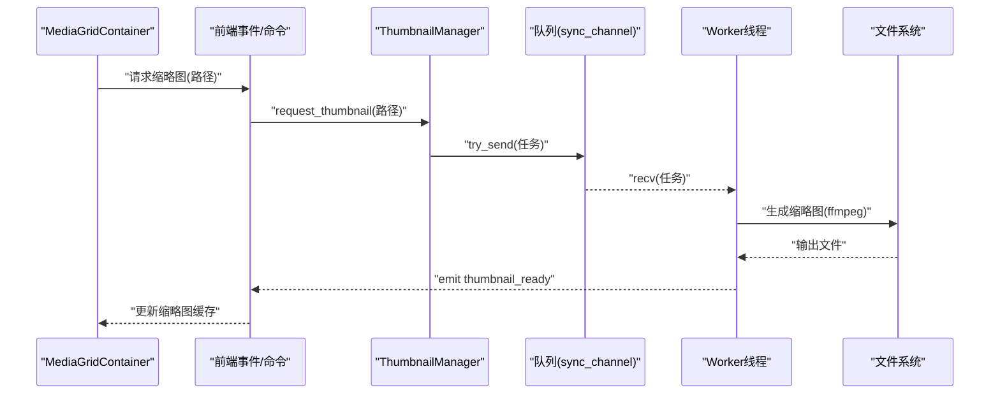
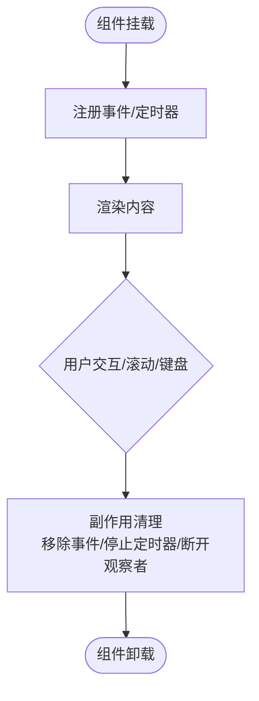
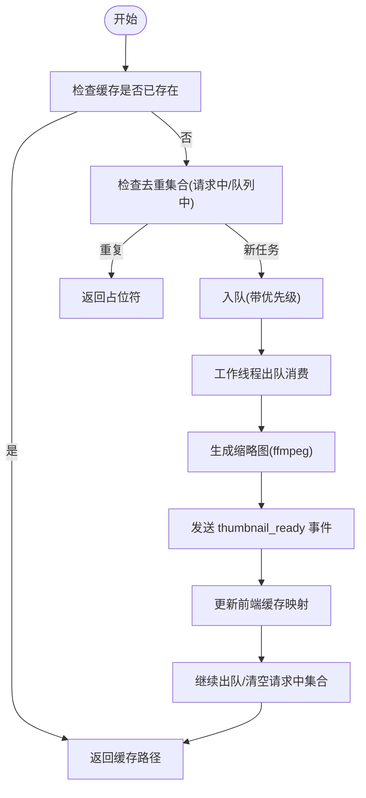
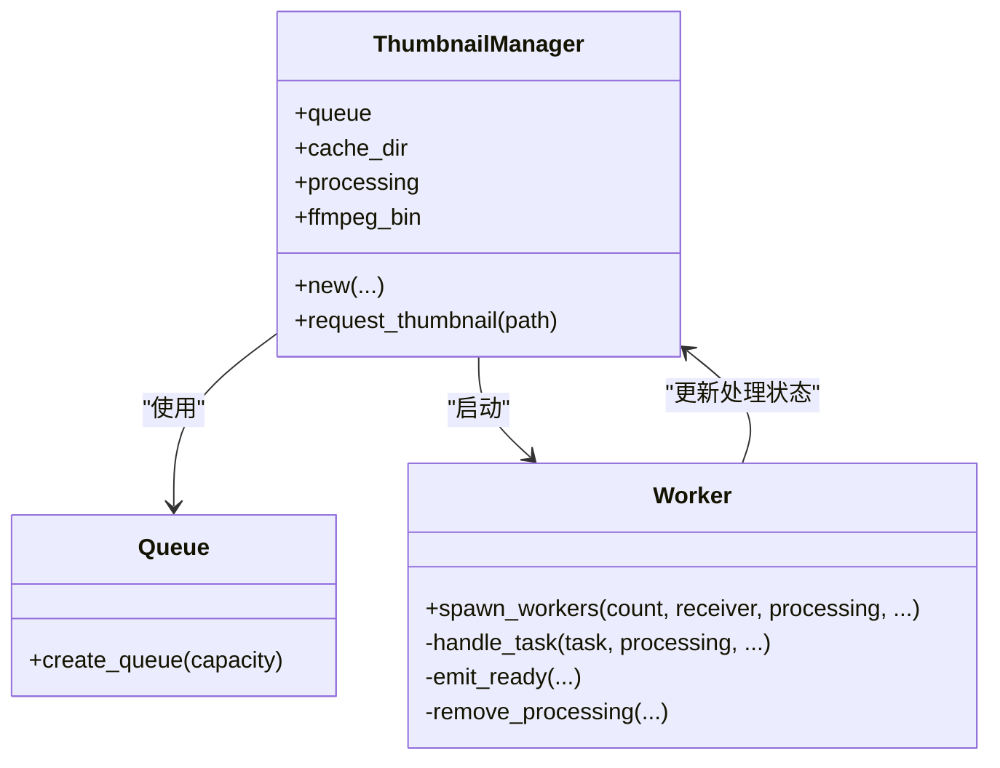
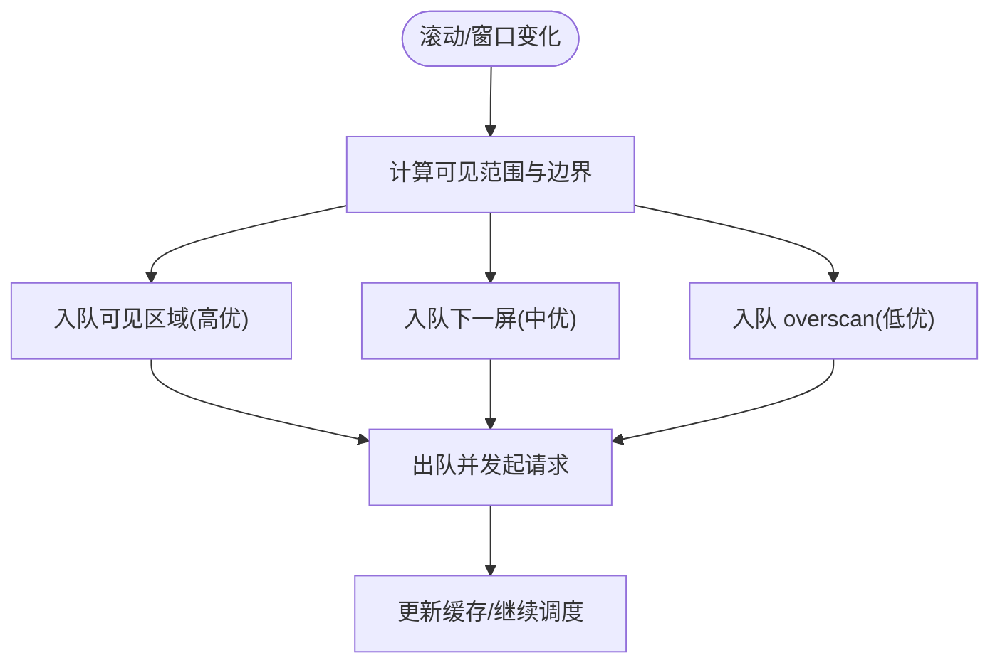
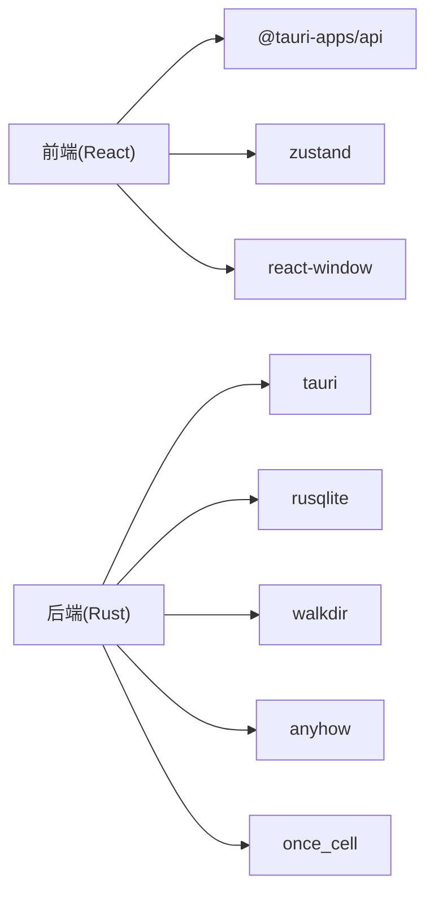

# 内存管理优化

<cite>
**本文引用的文件**
- [src/main.tsx](file://src/main.tsx)
- [src/App.tsx](file://src/App.tsx)
- [src/components/MediaViewer.tsx](file://src/components/MediaViewer.tsx)
- [src/components/MediaGrid.tsx](file://src/components/MediaGrid.tsx)
- [src/containers/MediaGridContainer.tsx](file://src/containers/MediaGridContainer.tsx)
- [src/store/useAppStore.ts](file://src/store/useAppStore.ts)
- [src-tauri/src/thumbnail/manager.rs](file://src-tauri/src/thumbnail/manager.rs)
- [src-tauri/src/thumbnail/queue.rs](file://src-tauri/src/thumbnail/queue.rs)
- [src-tauri/src/thumbnail/utils.rs](file://src-tauri/src/thumbnail/utils.rs)
- [src-tauri/src/thumbnail/worker.rs](file://src-tauri/src/thumbnail/worker.rs)
- [src-tauri/Cargo.toml](file://src-tauri/Cargo.toml)
- [package.json](file://package.json)
- [DEVELOPMENT.md](file://DEVELOPMENT.md)
</cite>

## 目录
1. [简介](#简介)
2. [项目结构](#项目结构)
3. [核心组件](#核心组件)
4. [架构总览](#架构总览)
5. [详细组件分析](#详细组件分析)
6. [依赖关系分析](#依赖关系分析)
7. [性能考量](#性能考量)
8. [故障排查指南](#故障排查指南)
9. [结论](#结论)
10. [附录](#附录)

## 简介
本指南聚焦于 Medex 的内存管理优化，覆盖前端 React 组件卸载清理、事件监听与定时器管理；缩略图缓存策略（含去重、并发与队列容量控制）；Rust 后端内存安全与并发模型；以及大数据集处理（虚拟化渲染、懒加载与分块）。同时提供内存监控工具使用建议与可落地的优化案例，帮助在媒体资产管理场景中实现高效稳定的内存使用。

## 项目结构
Medex 采用 Tauri + React 架构，前端负责 UI 与交互、缩略图请求与缓存；后端 Rust 负责扫描、数据库与缩略图生成（基于 ffmpeg）。缩略图子系统由前端容器发起请求、后端管理器入队、工作线程异步生成并通过事件回传结果。

图表来源
- [src/App.tsx:1-73](file://src/App.tsx#L1-L73)
- [src/containers/MediaGridContainer.tsx:1-619](file://src/containers/MediaGridContainer.tsx#L1-L619)
- [src/components/MediaGrid.tsx:1-351](file://src/components/MediaGrid.tsx#L1-L351)
- [src/components/MediaViewer.tsx:1-186](file://src/components/MediaViewer.tsx#L1-L186)
- [src/store/useAppStore.ts:1-395](file://src/store/useAppStore.ts#L1-L395)
- [src-tauri/src/thumbnail/manager.rs:1-108](file://src-tauri/src/thumbnail/manager.rs#L1-L108)
- [src-tauri/src/thumbnail/queue.rs:1-12](file://src-tauri/src/thumbnail/queue.rs#L1-L12)
- [src-tauri/src/thumbnail/worker.rs:1-96](file://src-tauri/src/thumbnail/worker.rs#L1-L96)
- [src-tauri/src/thumbnail/utils.rs:1-158](file://src-tauri/src/thumbnail/utils.rs#L1-L158)

章节来源
- [src/main.tsx:1-44](file://src/main.tsx#L1-L44)
- [src/App.tsx:1-73](file://src/App.tsx#L1-L73)
- [src/containers/MediaGridContainer.tsx:1-619](file://src/containers/MediaGridContainer.tsx#L1-L619)
- [src-tauri/src/thumbnail/manager.rs:1-108](file://src-tauri/src/thumbnail/manager.rs#L1-L108)

## 核心组件
- 前端入口与路由：根据路径选择渲染页面，避免不必要的组件树加载。
- 应用根组件：组织侧边栏、主内容区与媒体查看器，并在查看器关闭时进行必要的状态复位。
- 媒体网格容器：负责筛选、排序、可见范围计算、缩略图请求与缓存、事件监听清理、定时器清理。
- 媒体网格：基于 react-window 的虚拟化渲染，减少 DOM 与内存占用。
- 媒体查看器：按需渲染单个媒体元素，键盘事件监听在卸载时清理，视频元素在切换时暂停。
- 状态存储：Zustand 提供轻量状态管理，避免深层重渲染。
- 缩略图后端：Rust 管理器负责任务去重、队列容量控制与并发工作线程，生成完成后通过事件通知前端。

章节来源
- [src/main.tsx:10-44](file://src/main.tsx#L10-L44)
- [src/App.tsx:48-71](file://src/App.tsx#L48-L71)
- [src/containers/MediaGridContainer.tsx:30-619](file://src/containers/MediaGridContainer.tsx#L30-L619)
- [src/components/MediaGrid.tsx:70-212](file://src/components/MediaGrid.tsx#L70-L212)
- [src/components/MediaViewer.tsx:39-63](file://src/components/MediaViewer.tsx#L39-L63)
- [src/store/useAppStore.ts:145-395](file://src/store/useAppStore.ts#L145-L395)
- [src-tauri/src/thumbnail/manager.rs:24-108](file://src-tauri/src/thumbnail/manager.rs#L24-L108)

## 架构总览
前端通过 Tauri 命令向后端请求缩略图，后端使用固定数量的工作线程从队列消费任务，生成缩略图后通过事件通知前端更新缓存。前端以“可见区域优先、下一屏次之、overscan 最低”的策略调度任务，结合去重集合与并发上限，避免重复与过载。

图表来源
- [src/containers/MediaGridContainer.tsx:365-387](file://src/containers/MediaGridContainer.tsx#L365-L387)
- [src-tauri/src/thumbnail/manager.rs:51-106](file://src-tauri/src/thumbnail/manager.rs#L51-L106)
- [src-tauri/src/thumbnail/queue.rs:8-11](file://src-tauri/src/thumbnail/queue.rs#L8-L11)
- [src-tauri/src/thumbnail/worker.rs:52-89](file://src-tauri/src/thumbnail/worker.rs#L52-L89)
- [src-tauri/src/thumbnail/utils.rs:36-61](file://src-tauri/src/thumbnail/utils.rs#L36-L61)

## 详细组件分析

### 前端内存优化：组件卸载、事件与定时器清理
- 键盘事件监听：在查看器组件中为窗口注册按键监听，在卸载副作用中移除，防止悬挂监听导致内存泄漏。
- 视频元素暂停：切换媒体或关闭查看器时主动暂停视频，释放解码资源。
- 定时器清理：容器中对过滤媒体列表的防抖定时器在副作用中清理，避免多次订阅造成累积。
- 事件监听清理：监听缩略图生成完成事件与媒体更新事件时，均在副作用返回中执行解绑。
- ResizeObserver：网格组件内部使用 ResizeObserver 监听容器尺寸变化，退出时及时断开，避免持续回调持有引用。

图表来源
- [src/components/MediaViewer.tsx:39-63](file://src/components/MediaViewer.tsx#L39-L63)
- [src/containers/MediaGridContainer.tsx:100-109](file://src/containers/MediaGridContainer.tsx#L100-L109)
- [src/containers/MediaGridContainer.tsx:237-243](file://src/containers/MediaGridContainer.tsx#L237-L243)
- [src/containers/MediaGridContainer.tsx:488-494](file://src/containers/MediaGridContainer.tsx#L488-L494)
- [src/components/MediaGrid.tsx:326-350](file://src/components/MediaGrid.tsx#L326-L350)

章节来源
- [src/components/MediaViewer.tsx:39-63](file://src/components/MediaViewer.tsx#L39-L63)
- [src/containers/MediaGridContainer.tsx:100-109](file://src/containers/MediaGridContainer.tsx#L100-L109)
- [src/containers/MediaGridContainer.tsx:237-243](file://src/containers/MediaGridContainer.tsx#L237-L243)
- [src/containers/MediaGridContainer.tsx:488-494](file://src/containers/MediaGridContainer.tsx#L488-L494)
- [src/components/MediaGrid.tsx:326-350](file://src/components/MediaGrid.tsx#L326-L350)

### 缩略图缓存管理策略：LRU 与阈值控制
- 去重与限流：前端维护“已生成”、“请求中”、“队列中”三套集合，避免重复请求与过载。
- 优先级队列：根据可见性与滚动方向设定优先级，保证首屏与即将进入可视区的缩略图优先生成。
- 并发上限与队列容量：固定并发与队列上限，超过阈值的任务被丢弃或延迟，防止内存峰值。
- 后端去重：后端维护“正在处理”集合，重复请求直接返回占位符，避免重复生成。
- 缓存路径：使用哈希命名的本地缓存目录，命中则直接返回缓存路径，减少 IO 与内存拷贝。

图表来源
- [src/containers/MediaGridContainer.tsx:390-451](file://src/containers/MediaGridContainer.tsx#L390-L451)
- [src/containers/MediaGridContainer.tsx:352-388](file://src/containers/MediaGridContainer.tsx#L352-L388)
- [src-tauri/src/thumbnail/manager.rs:51-106](file://src-tauri/src/thumbnail/manager.rs#L51-L106)
- [src-tauri/src/thumbnail/worker.rs:52-89](file://src-tauri/src/thumbnail/worker.rs#L52-L89)
- [src-tauri/src/thumbnail/utils.rs:31-34](file://src-tauri/src/thumbnail/utils.rs#L31-L34)

章节来源
- [src/containers/MediaGridContainer.tsx:30-619](file://src/containers/MediaGridContainer.tsx#L30-L619)
- [src-tauri/src/thumbnail/manager.rs:24-108](file://src-tauri/src/thumbnail/manager.rs#L24-L108)
- [src-tauri/src/thumbnail/utils.rs:14-34](file://src-tauri/src/thumbnail/utils.rs#L14-L34)

### Rust 内存安全与并发模型
- 所有权与共享：使用 Arc<Mutex<...>> 在多线程间共享“正在处理”集合与接收端，确保线程安全访问。
- 通道容量：使用有界同步通道，防止生产者过快导致内存膨胀。
- 错误传播：统一使用 anyhow 进行错误包装与传播，便于定位问题。
- 资源释放：工作线程循环等待任务，任务完成后立即释放锁与临时对象，避免长生命周期持有。
- ffmpeg 调用：在生成失败时记录错误并清理“正在处理”标记，保证后续调度正常。

图表来源
- [src-tauri/src/thumbnail/manager.rs:16-50](file://src-tauri/src/thumbnail/manager.rs#L16-L50)
- [src-tauri/src/thumbnail/worker.rs:13-50](file://src-tauri/src/thumbnail/worker.rs#L13-L50)
- [src-tauri/src/thumbnail/queue.rs:8-11](file://src-tauri/src/thumbnail/queue.rs#L8-L11)

章节来源
- [src-tauri/src/thumbnail/manager.rs:1-108](file://src-tauri/src/thumbnail/manager.rs#L1-L108)
- [src-tauri/src/thumbnail/worker.rs:1-96](file://src-tauri/src/thumbnail/worker.rs#L1-L96)
- [src-tauri/src/thumbnail/queue.rs:1-12](file://src-tauri/src/thumbnail/queue.rs#L1-L12)
- [src-tauri/src/thumbnail/utils.rs:1-158](file://src-tauri/src/thumbnail/utils.rs#L1-L158)

### 大数据集处理：虚拟化与懒加载
- 虚拟化渲染：使用 react-window 的 FixedSizeGrid/List，仅渲染可视区域与少量 overscan，显著降低 DOM 数量与内存占用。
- 懒加载策略：仅在可见区域、下一屏与 overscan 区域内发起缩略图请求，避免一次性加载全部缩略图。
- 分块与节流：通过可见范围回调计算渲染边界，分批入队任务，配合前端与后端的并发/队列上限，平滑内存峰值。

图表来源
- [src/components/MediaGrid.tsx:183-206](file://src/components/MediaGrid.tsx#L183-L206)
- [src/containers/MediaGridContainer.tsx:417-451](file://src/containers/MediaGridContainer.tsx#L417-L451)
- [src/containers/MediaGridContainer.tsx:352-388](file://src/containers/MediaGridContainer.tsx#L352-L388)

章节来源
- [src/components/MediaGrid.tsx:70-212](file://src/components/MediaGrid.tsx#L70-L212)
- [src/containers/MediaGridContainer.tsx:30-619](file://src/containers/MediaGridContainer.tsx#L30-L619)

### 内存监控与诊断
- Chrome DevTools Memory 面板
  - Allocation instrumentation by heap snapshot：捕获堆快照对比，识别未释放的对象与闭包引用。
  - Record allocation timeline：滚动时录制内存分配，定位峰值与泄漏点。
  - 调试建议：在卸载组件、切换媒体、关闭查看器时观察内存回落情况。
- Rust 内存分析
  - 使用火焰图/性能剖析工具（如 perf 或 valgrind/memcheck）定位热点与异常增长。
  - 检查通道阻塞与线程饥饿：确认队列容量与工作线程数匹配实际负载。
- 系统资源监控
  - 使用系统监视器观察进程常驻内存、线程数与 CPU 占用，结合日志判断是否存在泄漏或过载。

[本节为通用指导，无需特定文件引用]

## 依赖关系分析
- 前端依赖
  - React 生态与 react-window：用于虚拟化渲染与高效更新。
  - Zustand：轻量状态管理，避免深层重渲染。
  - @tauri-apps/api：与后端通信、事件监听与文件路径转换。
- 后端依赖
  - tauri：桌面集成与命令暴露。
  - rusqlite：SQLite 数据库访问。
  - walkdir：文件系统遍历。
  - anyhow：错误处理。
  - once_cell：初始化缓存目录等一次性资源。

图表来源
- [package.json:12-35](file://package.json#L12-L35)
- [src-tauri/Cargo.toml:13-23](file://src-tauri/Cargo.toml#L13-L23)

章节来源
- [package.json:1-36](file://package.json#L1-L36)
- [src-tauri/Cargo.toml:1-23](file://src-tauri/Cargo.toml#L1-L23)

## 性能考量
- 避免不必要的重渲染：使用 useMemo/useCallback 缓存计算结果与回调，减少 props 变更。
- 控制缩略图生成速率：合理设置并发与队列容量，避免瞬时大量 IO 与内存峰值。
- 优先级调度：确保首屏与即将可视的缩略图优先生成，提升感知性能。
- 资源释放：在组件卸载、媒体切换与窗口关闭时，及时移除事件、停止定时器与暂停视频播放。
- 缓存策略：命中缓存直接返回，减少重复生成；缓存目录定期清理或按大小阈值淘汰旧文件。

[本节为通用指导，无需特定文件引用]

## 故障排查指南
- 查看器无法关闭或内存不回落
  - 检查键盘事件监听是否在卸载时移除。
  - 确认视频元素在切换或关闭时被暂停。
- 缩略图长时间显示占位符
  - 检查后端 ffmpeg 是否可用与路径解析逻辑。
  - 确认队列未满且工作线程正常运行。
- 滚动卡顿或内存持续上涨
  - 确认虚拟化参数（overscan、行高/列宽）配置合理。
  - 检查是否有未清理的 ResizeObserver 或定时器。
- 事件未触发或重复触发
  - 确认事件监听在副作用中返回时被解绑。
  - 检查去重集合是否正确维护。

章节来源
- [src/components/MediaViewer.tsx:39-63](file://src/components/MediaViewer.tsx#L39-L63)
- [src/containers/MediaGridContainer.tsx:488-494](file://src/containers/MediaGridContainer.tsx#L488-L494)
- [src-tauri/src/thumbnail/utils.rs:71-96](file://src-tauri/src/thumbnail/utils.rs#L71-L96)
- [src-tauri/src/thumbnail/manager.rs:83-106](file://src-tauri/src/thumbnail/manager.rs#L83-L106)

## 结论
Medex 的内存优化围绕“前端卸载清理 + 前端去重与限流 + 后端并发与队列控制 + 虚拟化渲染”展开。通过严格的事件与定时器清理、合理的缩略图优先级与容量控制、以及 Rust 的所有权与通道模型，可在大规模媒体资产管理中实现稳定、低峰值的内存表现。建议持续结合内存快照与系统监控进行回归验证。

## 附录
- 开发文档中关于缩略图与 UI 的现状与策略可作为优化依据与回归检查清单。
- 前端与后端的关键实现路径已在各小节中给出，便于快速定位与修改。

章节来源
- [DEVELOPMENT.md:317-389](file://DEVELOPMENT.md#L317-L389)